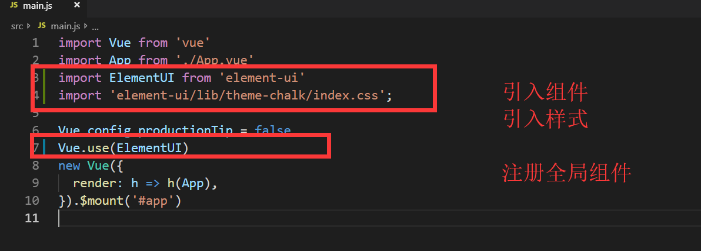
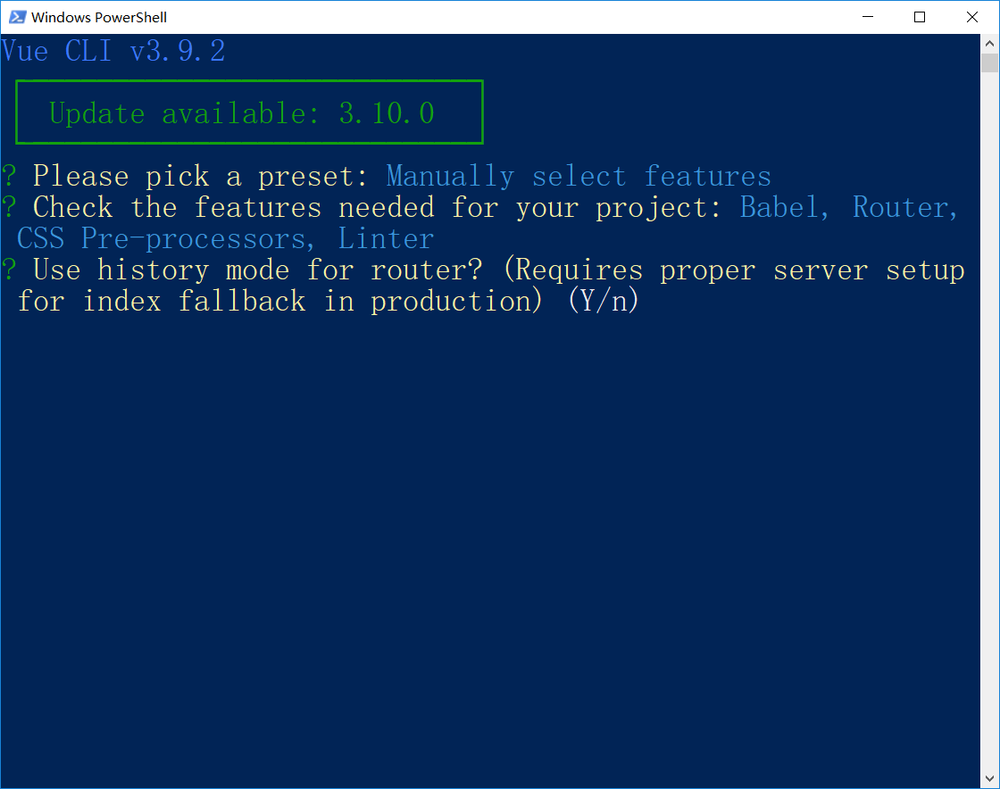
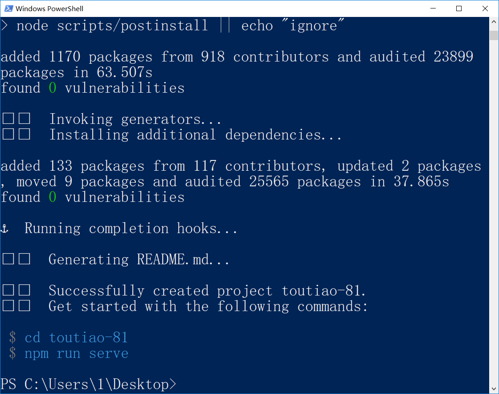
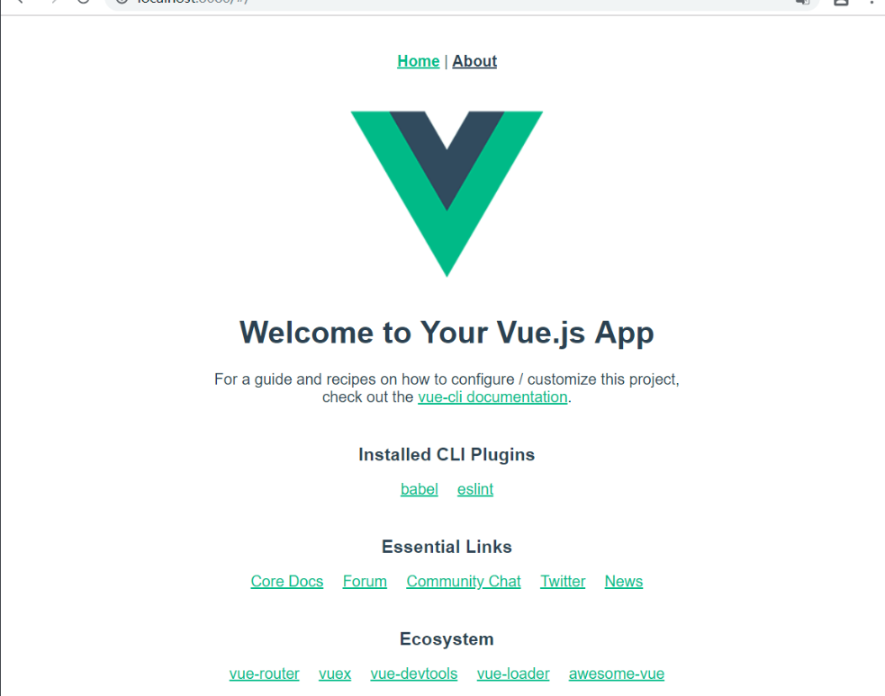

# 黑马头条PC第1天

## 回顾

* router  => 前端路由 => spa => 不刷新页面的情况下 切换模块 => 切换组件
* vue-router => 引入 /导航(可有可无)/容器/ Vue.use()注册路由 /实例化 路由/配置路由表 =>  path => component 
* 动态路由 
* 嵌套路由  => 一级路由  => 二级路由=> 一级路由的component => 放置容器(二级路由的容器)
* 二级路由=>路由表 => 一级路由表 =>children => [  二级路由表 ]
*  .js可以省略后缀 
* vue项目中 =>.vue 可以省略
* vue-cli => 综合性的工具 => 代码编译=>样式转化 => 语法校验 =>
* 初始化项目 => vue-cli2.0 => vue init  webpack-simple  heroes
* 抽提组件 => 头部组件=> 左侧导航 =>右侧列表  => 显示在页面 => App.vue => 整个项目的根组件 
* main.js(入口) => 实例化Vue  new  Vue()  => App.vue渲染到了Vue实例上
* App.vue => 嵌套组件 =>延伸需求  => 拆分组件
* 导入路由 => 一级路由 =>容器 =>App.vue
* 


## 基础-示例项目-优化-axios统一导入

> **`目标-任务`**实现axios的统一导入
>
> **`路径`**: axios的统一导入 和使用
>
> 1 在入口main.js文件中引入axios,并给全局Vue对象的原型链赋值 
>
> ```js
> Vue.prototype.$http = Axios; //所有的实例都直接共享拥有了 这个方法
> ```
> 
> 2  调用接口时  采用 实例.属性的方式即可调用 
>
> ```js
>addHero() {
> // 判断填报信息是否为空
> if (this.formData.name && this.formData.gender) {
> // 该判断条件是判断 当前的姓名和 性别都不为空
> // restful规则
> this.$http
> .post("http://localhost:3000/heroes", this.formData)
> .then(result => {
> // 注意这里添加成功的状态码 是 201
> if (result.status === 201) {
> // 添加成功之后 要跳转回列表页
> // 编程式导航
>  this.$router.push({ path: "/heroes" });
>  } else {
>  alert("添加失败");
> }
>  });
> } else {
> alert("提交信息不能为空");
> }
> }
> 
> ```
> 
> 

## 基础-示例项目-优化-设置baseUrl

> **`目标-任务`**通过配置**`baseUrl`**将所有的请求地址进行优化 
>
> **`路径`**: axios中配置统一的**`请求路径头`**
>
> 1. 给axios中的baseUrl设置常态值
>
> ```js
> Axios.defaults.baseURL = "http://localhost:3000"; // 设置共享的方法
> 
> 
> ```
>
> 2. 改造所有的的请求
>
> ```js
> this.$http.put("heroes/" + id, this.formData).then(result => {
> if (result.status === 200) {
> this.$router.push({ path: "/heroes" });
> } else {
> alert("编辑失败");
> }
> });
> 
> ```
>

## 基础--示例项目-优化-目录划分-统一设置激活样式

> **`目标-任务`**将组件的目录进行整理划分,并统一当前路由的激活样式
>
> 路径:   左侧导航激活样式  目录划分
>
> 1  统一激活样式
>
> ```js
> linkActiveClass: "active", // active为bootstrap中的 一个class样式
> ```
> 
> 2  整理目录   分门别类
>
> **注意**同一类 组件放入同一个文件夹下  修改引用地址
>
> * 组件分类 => 路由级组件 / 普通组件
>* 路由级组件 => 直接挂在路由上的组件 叫做路由级组件 =>相当于原来的一个页面/模块
> * pages/views =>一般用来存放路由级组件
> * 普通组件 =>  路由级组件中**`引用的组件`**  =>  一般放在 components目录下
> * componets => 目录 =>组件

## 给切换路由增加过渡效果 (扩展)

> **`目标-任务`**实现项目中的路由切换过渡
>
> **`路径`**:  给路由切换加入 过渡效果 
>
> 1  用过渡组件包裹路由视图
>
> ```html
> <transition name="slide">
> <router-view></router-view>
> </transition>
> 
> ```
>
> 2  编写 过渡效果
>
> ```css
> .slide-enter,
> .slide-leave-to {
> opacity: 0;
> }
> .slide-enter-to,
> .slide-leave {
> opacity: 1;
> }
> .slide-enter-active {
> transition: all 1s;
> }
> 
> ```

## 钩子函数

> **`目标`**掌握Vue的生命周期及其**`钩子函数`**
>
> **`鸡肋函数`**
>
> - 生命周期是指Vue实例或者组件从诞生到消亡经历的每一个阶段，在这些阶段的前后可以设置一些函数当做事件来调用。
> - 四个阶段 
> - **实例创建前后**  beforeCreate(**`鸡肋函数`**)=> 很少用  created=> 加载数据  this=>拥有了该有的东西 **`this.$refs(获取不到)`**
> - **页面渲染前后**  beforeMount(渲染前执行**`this.$refs获取不到`**) =>会用   mounted => 渲染完成 (会用) =>可以获取dom对象  `this.$refs(可以获取到)`
> -  **数据更新前后**  beforeCreate updated  => **`鸡肋函数`** => 监控name的变化=> watch => data中某个数据的变化
> - **组件销毁前后** beforeDestoty => (销毁之前定义的定时器)  destoryed(**`鸡肋函数`**)
> - 

## 黑马头条PC-我们要做什么?

**`目标`**对于黑马头条的项目进行演示及介绍

* 一个类似于[今日头条自媒体头条号](<http://mp.toutiao.com/profile_v3/index>)的后台管理系统。
* SPA应用
* [黑马头条PC线上地址](http://ttmp.research.itcast.cn/#/login)
* 演示项目效果

## 黑马头条PC-项目账号怎么来?

**`目标`** 如何拥有一个黑马头条的账号

* [黑马头条客户端地址](http://toutiao.research.itcast.cn/#/login)
* 你需要在这个地址上输入自己的**手机号** **验证码(246810)** 
* 以上操作便完成了注册操作 
* 再回到PC页面 使用 刚才注册用的**手机号**和**验证码(246810)**即可完成登录
* 13911111111(系统账号)
* 246810

**`任务`**注册一个自己的黑马头条账号,并浏览相关页面

## 黑马头条PC-我们用什么技术做?

**`目标`** 了解 在黑马头条项目中需要应用的技术

- [Vue.js](<https://cn.vuejs.org/>)   ==>> MVVM框架
- [Vue Router](<https://router.vuejs.org/>)  ==> 实现Vue项目的前端路由功能
- [Vue CLI](<https://cli.vuejs.org/>)   ==> Vue项目的脚手架工具3.0
- [Vuex](<https://vuex.vuejs.org/zh/>) ==> 状态共享框架(**`略难理解`**,根据情况) => PC项目不做 =>移动端Vuex
- evenBus ==> **`Vuex的替代方案`**(根据课程吸收情况) 子组件 => 父组件 $emit()
- [axios](<https://github.com/axios/axios>)  ==> 请求工具 (拦截请求)
- [ElementUI](<https://element.eleme.io/>)  ==> Vue前端UI框架 (**`极其重要`**的知识点  工作几乎每天都用)
- [Echarts](<https://echarts.baidu.com/>) ==> 第三方图表插件 (强大的图表插件 可在Vue中集成) 百度出品
- [nprogress](<https://github.com/rstacruz/nprogress>)  ==>  第三方进度条(用来美化前端的页面跳转)
- [Quill](<https://github.com/quilljs/quill>) ==> Vue第三方插件(富文本编辑器)
- [Eslint](https://cn.eslint.org/docs/user-guide/getting-started)  ==> 语法校验辅助工具(它的目标是保证**`代码的一致性`**和**`避免错误`**)


* 结论
* 需要重点掌握 通过**`vue-cli3.0`**初始化项目
* 使用**`vue-router`**配置前端路由
* 使用**`aixos`**进行数据请求
* 重点掌握 **`ElementUI`**在项目中的应用

**`任务`**查阅以上各个技术的官网文档,对各个技术有个初步了解


## 黑马头条PC-知识补充-Vue的插槽-默认插槽(匿名)

* **`目标`**掌握什么是插槽, 并且学会使用默认插槽

* 什么是插槽？

* 我们以前在学习组件的时候 如果要使用一个组件 只需要这样写

  ```xml
  <child></child>
  ```

  这个组件 的模板内容可能是这样的 

  ```xml
  <div>Hello World</div>
  ```

  我们发现 使用组件时 使用的是标签 标签内部可不可以写一些东西呢

  ```xml
  <child>张三</child>
  ```

  我们在组件标签上写入了一个张三 那么这个张三能显示吗? 答案显示是**`否定`**的 有没有什么办法能够让张三显示?  这个时候我们要用到一个叫做**`插槽`**的概念   我们可以在定义组件的模板中 用到一个**`slot(插槽)`**标签来接收传入的模板内容 如 

  ```xml
  <div>Hello World <slot></slot></div>
  ```

  效果立刻就会出来 

  

  那么 放**`多个插槽`**可不可以?

  ```xml
  <div><slot></slot>Hello World <slot></slot></div>
  ```

  

同样的,不管放置多少个**`slot`**,**放置slot的位置**都会将 我们组件标签内部的结构**`替换`**

那么如果child标签里放置的又是多个标签呢?

```xml
<child>
    <p>hi 我是插槽的内容1</p>
    <p>hi 我是插槽的内容2</p>
    <p>hi 我是插槽的内容3</p>
    <p>hi 我是插槽的内容4</p>
    <p>hi 我是插槽的内容5</p>
</child>
```

我们在child标签中放置了多个p标签 来看下效果


发现了吗? 不论放置多少个标签,都会完成**`slot标签的内容`**替换 **`传入的内容`**

以上这种我们在子组件中用**`slot占据位置`**,在父组件中 传入替换内容的方式 就是**`插槽`**

**`任务`**

1. 定义一个组件 里面静态内容为 
2. * 第一行   我来到学习前端技术
   * 第二行   在有很多可爱的同学
   * 第三行   希望离开时我们能一起吃个饭
3. 使用插槽技术 实现 显示的内容为
   - 第一行   我来到**`黑马`**学习前端技术
   - 第二行   在**`黑马`**有很多可爱的同学
   - 第三行   希望离开**`黑马`**时我们能一起吃个饭

## 黑马头条PC-知识补充-Vue的插槽-后备内容

- **`目标`**掌握插槽的后备内容的使用方式

- 上个小节中,我们学习了**`slot(插槽)`**最基本的使用方式,如果我们在**`组件中定义了插槽`**,就**必须传入内容**,否则组件插槽的位置就会什么都没有. 这样一来,如果 我们有七个组件用的是一个内容,只有第八个组件用的是另一个内容,那么**`同样的插槽内容要写多次`**,这样很傻,也不爽,有没有解决方案?

- **`当然有`**!!  我们可以在定义插槽时,在**`slot(标签)`**中写入**`默认内容`**   如果在传入插槽内容时,内容不为空,那么还会**`按照之前的模式替换`**,如果没传,那么**`默认内容`**就会自动出现**`替换slot`**的位置

- ```xml
  <div>
      Hello world 
      <slot>我是默认的哦</slot>
  </div>
  ```

- 使用组件

- ```xml
  <child></child>  // 什么都不写 页面上就会显示 Hello World 我是默认的哦
  <child>我是新的</child> // 写了内容 页面上就会显示 Hello World 我是新的
  ```

- 如果组件中定义了**`多个slot`**那么有内容部分就显示内容 没内容部分为空

- ```xml
  <div>
      <slot></slot>
      Hello world 
      <slot>我是默认的哦</slot>
  </div>
  // 在使用该组件内容时 如果不传入任何内容  页面上就会显示 Hello World 我是默认的哦
  ```

- **`任务`**

  1. 定义一个组件  内容为 

     

  2. 使用插槽的后备内容实现  

  3. 

## 黑马头条PC-知识补充-Vue的插槽-具名插槽

- **`目标`**掌握Vue具名插槽的使用方式

- 我们已经掌握了插槽的基本用法,上两个小节中 我们传入的**`插槽内容`**都会替换组件定义的**`slot`**,不论我们定义多少个slot,无一例外都会**`同样的内容`**替换掉

- 但是 有一些情况,我们需要传入**`不同的位置的内容`**去替换不同位置的**`slot插槽`**

  ```xml
  <div>
       <slot></slot>
      <p>静态内容</p>
      <slot></slot>
  </div>
  // 我们希望静态内容前面和后面的内容都通过传入的方式接受 但是目前只能接受同样的内容
  ```

  有没有什么办法能实现?

  **`当然有`**!  这个时候我们可以使用**`具名插槽`**的东西来实现 

  我们可以在定义插槽的时候给定义一个**`name`**属性 ,至于值随便取

  ```xml
  <div>
       <slot name='before'></slot>
      <p>静态内容</p>
      <slot name='after'></slot>
  </div>
  // 这里我们给两个插槽 定义了不同的name
  ```

  那么怎么传入呢 ?  希望自己的元素被哪个插槽使用 就用slot='插槽名'的方式配置

  ```xml
  <child>
      <span slot='after'>我是after的</span>
      <span slot='before'>我是before的</span>
  </child>
  ```

  **`注意`**这里我们故意把顺序颠倒了  但是效果没有任何影响,说明 具名插槽无关顺序

  具名插槽同样支持**`备用内容`**,不传入插槽内容 则显示插槽内部的内容
  
  **`任务`**
  
  1. 实现一个组件  背景色为红色
  2. 定义header  body  footer 插槽
  3. 实现 第一个组件实例 header 高 20px  背景色 蓝色    body内容为 白色字体的 我是body  footer为 绿色字体的 我是footer
  4. 第二个实例  header  高 40px  背景色  黄色   body内容为  绿色字体的 我是body  footer为白色的字体的 我是footer

## 黑马头条PC-知识补充-Vue的插槽-作用域插槽

- **`目标`**掌握Vue插槽的使用-作用域插槽

- 在以上几个小节中,我们在传入插槽内容时 没有用动态变量 如果用了会怎样?

- ```xml
  <child>
      {{name}}
  </child>
  ```

  **`注意`**上面代码中的**`name`**读取的是父组件的变量, 和child组件没有任何关系,假如 在child组件中定义了一个属性name,父组件中同样有属性name,这个时候读取的一定是父组件的**`name`**属性

  请记住

  > 父级模板里的所有内容都是在父级作用域中编译的；子模板里的所有内容都是在子作用域中编译的。

  但是!!!!   如果我想读取**`子组件中的name`**需要怎么做呢 ? 能做吗?

  **`当然可以!`**

  首选 我们希望 子组件中的name被父组件读取到,要先在**`定义插槽`**的位置 ,将name传递出来,怎么传呢?

  ```xml
  <div>
      Hello World 
      <slot v-bind:name1='name'></slot>
  </div>
  ```

  **`注意`** 我这里特意用了**`name1`**,为啥呢? 还记得 我们上一小节中讲到的**`具名插槽`**吗?定义具名插槽也是通过name属性,所以name成了关键字,不能用**`name`**!!!!!

  这里我们实现了将name的值给了一个叫做name1的属性名,那么怎么在父组件中接收呢?

  ```xml
  <child>
      <span slot-scope='obj自定义对象名'></span>
</child>
  ```
  
  大家看,我们在span标签上定义了一个叫做 **`slot-scope(作用域插槽)`**的属性 后面跟着的是我们随意定义的对象名**`obj`**, 我们前面定义的**`name1`**就被放入到我们的**`obj`**中, 我们就可以通过obj.name1取到值
  
  **注意**：
  
  ​	1.slot-scope不能写在组件标签上，要写在标签里
  
     2.slot-scope=“属性”，属性名随便写
  
     3.只有在定义slot-scope的标签中才能使用定义的
  
  ```xml
  <child>
      <span slot-scope='obj'>{{obj.name1}}</span>
  </child>
  ```
  
  **`任务`**
  
  1. 定义一个子组件 组件中的list数据为 ["北京","上海","天津"]  name数据为 Hello world
  2. 定义具名插槽 header 和 body 
  3. header插槽中读取 子组件中的name  颜色为红色 字体大小48px  
  4. body插槽中遍历 子组件中的list 

## 黑马头条PC-知识补充-ElementUI-介绍

* **`目标`**掌握目前Vue框架最火的前端UI框架ElementUI的介绍

* Element-UI 是 饿了么 前端团队，开源出来的一套 Vue 组件库(针对pc电脑浏览器端)，内部集成了许多项目中可以使用的成熟`组件component`，既增强了用户体验、又加快的开发速度。

* [ElementUI文档地址](https://element.eleme.cn/#/zh-CN/component/installation)

## 黑马头条PC-知识补充-ElementUI-安装

**`目标`**掌握如何在Vue-cli项目中安装ElementUI框架

* 安装elementUI的方式 分为**`两种`**, 一种在vue-cli脚手架项目中,一种是在页面中**`直接引入`**,这推荐在spa项目中使用**`npm`**直接安装使用

1. 执行指令安装组件库

   ```bash
   $ npm i element-ui -S
   ```

2. 在main.js文件中引入elementui模块和注册

3. 

   

4. 在任意位置使用elementUI组件

   

5. 运行效果

   


**`任务`**

1. 通过vue-cli3.0初始化一个Vue项目
2. 在项目中安装ElementUI 并完成框架的注册
3. 在App.vue组件中 任意应用一个ElementUI组件


## 黑马头条PC-初始化项目-VueCli3.0配置项目

**`目标-任务`** 通过vue-cli3.0初始化一个黑马头条项目  

* 注意: 前期只是为了展示和快速开发,我们基本采用了默认设置,这节课我们来进行一下个性化配置

1. 初始化一个项目(3.0)

   ```bash
   $ vue create toutiao-81 
   ```

2. 创建之后会得到如下图形

3. 

`default（babel，eslint）`：默认的配置

`Manually select features`：手动选择功能特性配置项

> 我们这里选择第2种，支持更多的自定义选项。


使用键盘上下箭头进行移动，使用空格切换选中与否。

`Babel`：将 ECMAScript  6 转 ECMAScript 5用的一个工具

`Router`：Vue Router 路由

`CSS Pre-processors`：CSS预处理器（SASS、Less、Stylus。。。。）

`Linter / Formatter`：代码校验和格式化

勾选好以后，回车进入下一步。



选择路由模式

路由路径有两种模式：

- hash锚点模式：`http://协议:端口号/path路径/#/路由路径`
  - 简单，兼容好
- history模式：`http://协议:端口号/路由路径`
  - url简洁
  - 兼容差，需要额外的服务器配置

我们这里输入 `n` ,使用默认的路由模式。 回车进入下一步


选择 CSS 预处理器

这里我们选择使用熟悉的 Less 预处理器。回车下一步


选择代码格式校验风格

JavaScript 代码风格不是固定的，社区中有几种比较推荐的格式。

Airbnb 制定的 JavaScript Style

[JavaScript Standard Style](<https://standardjs.com/readme-zhcn.html>)

这里我们选择 `ESLint + Standard config` 模式。


选择代码格式校验方式

`Lint on save`：每当代码文件保存的时候进行格式校验。

`Lint and fix on commit`：当执行 git commit 代码提交的时候进行校验和尝试自动修复校验失败的语法格式，如果校验失败并且自动修复也失败，就无法完成代码提交。你需要手动解决了代码格式问题然后重新提交，这样就确保版本历史中的代码一定没有代码格式问题。


VueCLI 会在项目中生成一些工具的配置文件。配置文件可以存储在两个地方：

`In dedicated config files`：生成独立的配置文件，推荐，维护方便

`In package.json` 混到 package.json 文件中，不推荐，维护麻烦

这里我们选择第1种，将这些工具的配置文件保存到独立的配置文件中，方便查看和修改。


你可以把你刚才那些选择配置项保存为一个模板，下次使用 `vue create` 创建项目的时候它会提示你是否可以使用这个选择模板直接创建你的项目。

如果你需要，就输入 `y`，然后它会让你给这个模板起个名字，下次就可以直接使用；

如果不需要，就输入 `n`，继续下一步。

这里我们不需要，输入 `n` 继续下一步。


> 到这里，自定义配置项就完成了，Vue CLI 开始根据你的选择创建项目并安装项目依赖的第三方包。



> 安装结束，根据在终端中的提示执行以下命令：
>
> ```bash
> $ cd 项目目录
> $ npm run serve
> ```
>
> 

> 启动成功

按照给出的地址，在浏览器中访问测试。




**`任务`** 根据以上步骤完成 黑马头条项目的初始化

## 黑马头条PC-知识补充-ESlint

- **`目标`**了解什么是ESlint 如何在VSCode中配置ESlint

- ESlint**：是用来统一**JavaScript**代码风格的工具，**不包含css、html等**。

  我们项目中使用的是 [JavaScript Standard Style](<https://standardjs.com/readme-zhcn.html>) 代码风格。下面是它的一些具体规则要求：

  - **使用两个空格** – 进行缩进 

  - **字符串使用单引号** – 需要转义的地方除外

  - ```js
    var a = 'hello world'
    ```

  - **不能有未使用的变量** 

  - **代码结尾无分号无空格**

  - **关键字后加空格** `if (condition) { ... }`

  - **函数名后加空格** `function name (arg) { ... }`

  - 对象 **成员名称******冒号**** 与 **值** 之间需要有一个空格   {name: '张三'}

  - 坚持使用全等 `===` 摒弃 `==` 一但在需要检查 `null || undefined` 时可以使用 `obj == null`。

    .....

  

说了那么多，看看[这个遵循了 Standard 规范的示例文件](https://github.com/expressjs/body-parser/blob/master/index.js) 中的代码吧。或者，这里还有[一大波使用了此规范的项目](https://raw.githubusercontent.com/standard/standard-packages/master/all.json) 代码可供参考。

如果你不认识命令行中的语法报错是什么意思，你可以根据错误代号去 ESLint 规则列表中查找其具体含义。

### 如何应用ESlint

**`目标`** 在eslint中应用eslint

 目前有两种方式 应用eslint  

- 一种是**`编辑器`**中可以加入ESLint插件,在编写代码时 进行检查 并且自动修正 (辅助工具)

  - 一种是在各种框架的**`脚手架`**上 加入了 **`eslint`**检查  一般用于**`代码检查`**和**`提交校验`**

- 如何在VSCode中配置ESlint

- **第一步** 在VSCode插件中 查找ESLint插件 **`安装`**并启用

- 

- **第二步**  安装全局依赖包

  ```bash 
  $ npm install -g eslint
  ```

- **第三步**  打开vscode配置文件 settings.json  (by File-> Preferences->Settings)

  在最末尾如下内容

  ```json
  "eslint.enable": true,
  "eslint.autoFixOnSave": true,
  "eslint.run": "onType",
  "eslint.options": {
      "extensions": [".js",".vue"]
  },
  "eslint.validate": [
      { "language": "html", "autoFix": true },
      { "language": "javascript", "autoFix": true },
      { "language": "vue", "autoFix": true }
  ]
  ```

* 前提是 项目中 支持eslint=>vuecli创建项目时 选择了eslint

## 黑马头条PC-初始化项目-项目目录介绍

**`目标`**初始化项目的目录进行简单认识

```
│  .browserslistrc 该文件会被 Babel 和 Autoprefix 用来根据浏览器的版本确定需要转译的 JavaScript 特性和 CSS 浏览器前缀
│  .editorconfig 编辑器配置文件，编辑器会根据该文件选择编辑格式
│  .eslintrc.js ESLint配置文件
│  .gitignore Git忽略配置文件
│  babel.config.js Babel转码工具配置文件
│  package-lock.json 包管理工具的锁定文件
│  package.json	包说明文件
│  postcss.config.js	postcss配置文件
│  README.md 说明文档
│  
├─node_modules 第三方包
├─public 公共资源目录
│      favicon.ico
│      index.html
│      
└─src 源码目录
    │  App.vue 根组件
    │  main.js 入口模块
    │  router.js 路由模块
    │  
    ├─assets 静态资源目录
    │      logo.png
    │      
    ├─components 非路由组件目录
    │      HelloWorld.vue
    │      
    └─views 路由组件目录
            About.vue
            Home.vue
```

通过代码发现 main.js为整个项目的总入口文件

```js
import Vue from 'vue'
import App from './App.vue'
import router from './router'

Vue.config.productionTip = false

new Vue({
  router,
  render: h => h(App)
}).$mount('#app')
// 在这里完成了 Vue的实例化 并且已经挂载了路由 
```

**`注意`**这里的app.vue实际上为整个项目的根组件 

```xml
<template>
  <div id="app">
    <div id="nav">
      <router-link to="/">Home</router-link> |
      <router-link to="/about">About</router-link>
    </div>
    <router-view/>
  </div>
</template>
```

我们发现根组件中放入了导航和路由的承载容器 接着我们查看路由的配置文件

```js
import Vue from 'vue'
import Router from 'vue-router'
import Home from './views/Home.vue'

Vue.use(Router)

export default new Router({
  routes: [
    {
      path: '/',
      name: 'home',
      component: Home
    },
    {
      path: '/about',
      name: 'about',
      // route level code-splitting
      // this generates a separate chunk (about.[hash].js) for this route
      // which is lazy-loaded when the route is visited.
      component: () => import(/* webpackChunkName: "about" */ './views/About.vue')
    }
  ]
})

```

我们发现了一种**`新的组件引用方式`**  


```js
component: () => import(/* webpackChunkName: "about" */ './views/About.vue')
```

**`注意`**: 我们曾经说过spa首屏渲染时会将所有模板的代码都**`一次性`**加载到页面上造成**`首屏加载缓慢`**, 并且提到了一种**`按需加载`**的引用方式,OK,上面这种方式就是**`按需加载`**,只有用到该组件的时候,该组件模块才会被加载到页面上,节省了多余的资源

按需加载 => 只有需要访问的时候 才进行js的请求,否则不请求

**`任务`**查阅以上模块内容,理解以上代码行为.

## 黑马头条PC-初始化项目-git管理

- **`目标-任务`**在github建立一个远程仓库,并将新建的代码推到远程仓库上
- - 真正的项目开发都是采用git管理的  
  - 以后每天的模块增加 修改 删除 都会以git提交的方式 推送给同学们

1. 新建git远程仓库 

- 首先需要有一个github的账号 然后登陆github官网 进行新建远程仓库操作

2. 完成初始提交

```bash
$ git remote add origin 远程仓库地址
$ git push -u origin master  // -u 的意思是 记录当前的推送信息
```

之后开发的过程如果需要提交历史记录：

```bash
$ git add .  
$ git commit -m "log日志"
```

推送的时候如果不改变远程仓库和分支的话就直接：

```bash
$ git push 
```

## 回顾 

* 英雄列表的收尾 

* axios => 统一导入=> Vue.propotype.$http = axios => 所有对象的实例共享对象propotype属性

* axios => baseUrl设置 => 设置请求常量=> http://localhost:3000

* 动画过渡 => transition包裹 => router-view => 进入

* 钩子函数 => 四个阶段 => 八个事件 =>  创建实例前后 页面渲染前后  数据更新前后 实例销毁前后 

* 插槽 => 匿名插槽 => 默认插槽 =>  slot=> 占坑 =>传值 <child>插槽内容</child>

* 后备内容 => 当插槽内容为空时 =>slot标签中的内容 就会替换当前slot所在的位置 .生成效果<slot>默认内容</slot>  => <child>有值</child> => <child></child>

* 具名插槽 =>  slot有名称 name属性=> 传值时 => 需要指定对应的插槽名称  <span slot="插槽名称"></span>  => 如果不写slot =>就是匿名插槽 => 默认给 组件中 的<slot></slot>

* 作用域插槽 => 父组件想获取子组件的数据 =>  <slot  :属性="变量"></slot> =>属性名不能叫name

* 父组件中 用  slot-scope="名称obj"=> 名称随意 => 名称就是 刚才定义的所有的属性的集合 =>obj.属性

* template => 不生成任何实际的标签 =>包裹所有的元素

* 黑马头条 VueCLi3.0生成项目 => babel/css预处理器/eslint/vue-router =>自动生成了项目

* eslint =>语法校验 => 空格 /未使用变量.单引号/不要分号 => eslint插件/拷贝 json //禁用掉之前的prettier

* git 管理

* 建立远程仓库 => 新建 => 输入仓库名称 => create

* 将本地仓库推送到远程仓库 

  

  ```bash
   # 建立本地仓库和远程仓库的联系
   $ git remote  add origin(别名) 地址   
  ```

* ```bash
  #第一次推送
  $ git push -u  origin mater
  ```

* ```bash
  #第二次推送
  $  git add .  # 从工作区提交到暂存区
  $ git commit -m "提交信息" # 从暂存区提交到仓库区 
  $ git push
  ```

  ```bash
  #强制工作区内容回退到上一个仓库区的版本
  $ git reset  --hard  HEAD  
  ```

* 

# 黑马头条PC第2天

## 复习

- vue-cli 单文件组件 => *.vue 就是一个组件 => 导出  export default  {   }  =>var obj = {}
- import  别名 from  路径  =>别名 => 导出的组件对象 =>注册组件 => 使用组件
- 插槽 => 匿名插槽 =>  定义组件 => <slot></slot> =>使用组件 <child>传入内容</child> => 匿名插槽替换
- 后备内容 =>  <slot>后备内容</slot> => 使用组件 <child>不传入内容</child> => 后备内容  =><child>传入内容</child> => 后备内容
- 具名插槽 => <slot name="before"></slot> => 使用组件 <child> 传入的内容 不指定 slot => 匿名插槽 ,如果指定slot=> 传给指定的slot</child>
- 作用域插槽 => 父组件想用子组件的数据 =>  定义<slot></slot> => 将子组件的数据绑定给slot的属性,但是属性名不能叫name,=> 父组件中 用slot-scope声明一个变量 => 变量是所有定义slot属性的集合
- vue-cli3.0创建项目 =>  babel/router/eslint/css 
- git管理 => 建立远程仓库 =>new => 写名=>create
- 本地仓库 => 远程仓库  =>  git  remote add origin  地址 
- git push -u origin master
- git add .  git commit -m "信息" 提交到本地仓库 / git push 

## 黑马头条PC-初始化项目-安装ElementUI

- **`目标-任务`**在新建的项目中 安装elementUI 并提交git

- 安装

  - ```bash
    $ npm install element-ui --save
    ```

  - 在main.js文件中引入elementui模块和注册

    ```js
    import Vue from 'vue'
    import App from './App.vue'
    import router from './router'
    import ElementUI from 'element-ui'  // 引入UI
    import 'element-ui/lib/theme-chalk/index.css' // 引入样式
    Vue.config.productionTip = false
    Vue.use(ElementUI)
    new Vue({
    router,
    render: h => h(App)
    }).$mount('#app')
    ```

## 黑马头条PC-初始化项目-整理目录-准备资源

- **`目标-任务`** 清理项目中无用的文件,并导入图片资源 到assets目录下  初始化引入一个index.less文件 
- views一般放置 **`路由级组件`**,就是直接挂到路由表的component的组件,相当于我们原来**`一个个页面`**
- 路由级组件里面 **`引用的其他组件`**一般放在components下 ,这样更规范
- 1. 清理无用的*.vue文件 
- 2. 导入准备好的图片资源
- 3. 在main.js中引入 一个index.less此样式文件的意义是 对于全局样式的设置 例如 margin padding的初始化配置
- 4. 提交git

结论: 此步骤的目的是准备好 开发资源 下一步做好准备

## 黑马头条PC-初始化项目-页面分析-新建登录和主页

- **`目标-任务`** 对具体的页面模块路由进行分析,并在路由中加入新建登录页面 
- 
- 
- 我们访问第一次会进入登录页面  得出 **`登录页`**是**`整个项目的入口页面`**, 登录页肯定属于一级路由
- 
- 进入主页后 我们发现 页面出现了**`三个区域`**  其中中间区域的内容切换菜单时 会发生变化,所以判断 主页存在**`二级路由`**


**`结论`**:通过以上得出结论,  **`登录页`** 和 **`主页`**都为一级路由,主页下 存在**`二级路由`**

根据一级路由和二级路由关系设计以下路由表

| path           | 功能     | 备注           |
| -------------- | -------- | -------------- |
| /login         | 登录     | **`一级路由`** |
| /home          | 首页     | **`一级路由`** |
| /home/publish  | 发布文章 | 二级路由       |
| /home/articles | 文章列表 | 二级路由       |
| /home/comment  | 评论     | 二级路由       |
| /home/material | 素材     | 二级路由       |
| //home/fans    | 粉丝     | 二级路由       |
| /home/account  | 个人设置 | 二级路由       |

- 新建一个login组件和home组件,并配置路由表,在页面显示,提交git
- import login from './login ' //简写模式
- import login from './login/index.vue ' // 完整模式

## 黑马头条PC-登录模块-页面布局及样式

- **`目标-任务`**完成登录页的布局及开发
- 
- **`注意`**千人千面,每个前端程序员对于样式的实现方式都不一样,手法和手段各有不同,但是目标都是写出精美的页面. 
  - 既然我们选择使用elementUI框架,那么任何样式布局的东西都可以先在element中寻找是否有适合的
- 登录实际上个表单 我们可以在ElementUI提供的表单类组件中寻找可使用的组件

**`补充知识点`** 

在单文件组件中,如果需要在style标签中使用 诸如 **less** **scss**  需要在style标签上 给lang属性赋值 如图


**scoped属性**

默认情况下，vue单文件组件的style样式是[全局的]()，

如果在一个应用中使用了**多个**单文件组件，它们使用<span style="background-color:yellow;">相同选择器</span>为相同的元素设置了style样式，那么只有一个会起作用(**后者会覆盖前者**)

**解决方法**：

如果加了**`scoped`**属性,那么当前组件的样式 **`只对当前自己的html`**起作用

给每个style标签都设置一个`scoped`属性，这样各个单文件组件的html标签解析出来后都会带有一个与其他单组件标签不同的`data-v-xxx`的唯一属性，style样式设定也会自动与本身组件的`data-v-xxx`联系起来，这样就使得style样式只针对自己的组件起作用了


登录页实际采用组件

- **`el-form`**是表单的容器 ,如果要放置表单, 需要放置在**`el-form`**里面
- 如果 要放置一个input组件到表单 =>  需要放置在**`el-form-item`**里面

- [el-card](https://element.eleme.cn/#/zh-CN/component/card)
- [el-form](https://element.eleme.cn/#/zh-CN/component/form)
- [el-form-item](https://element.eleme.cn/#/zh-CN/component/form)
- 页面内容

```xml
<div class='login'>
      <!-- 使用elementUI组件 el-card -->
     <el-card class="login-card">
         <!-- 匿名插槽 -->
         <div  class='title'>
             
         </div>
         <!-- 表单 => el-form包裹 -->
         <el-form style="margin-top:20px">
             <!-- 每一个表单域由一个 Form-Item 组件构成 -->
             <el-form-item>
                 <!-- 表单域中可以放置各种类型的表单控件，包括 Input、Select、Checkbox、Radio、Switch、DatePicker、TimePicker -->
                 <!-- 手机号 -->
                 <el-input></el-input>
             </el-form-item>
             <el-form-item>
                 <!-- 验证码 -->
                 <el-input style="width:65%"></el-input>
                 <!-- 发送验证码 -->
                 <el-button style="float:right">发送验证码</el-button>
             </el-form-item>
             <el-form-item>
                 <!-- 同意选项 -->
                 <el-checkbox>我已阅读并同意用户协议和隐私条款</el-checkbox>
             </el-form-item>
              <el-form-item>
                  <!-- 登录按钮 -->
                  <el-button type="primary" style="width:100%">登录</el-button>
              </el-form-item>
         </el-form>
     </el-card>
  </div>
```

页面样式

```less
// 如果要在组件样式中写less 就要给一个lang属性 lang='less'
// 如果加了scoped属性 那么该style就会只对当前组件有效
.login {
    background-image: url('../../assets/img/login_bg.jpg');
    height: 100vh;
    background-size: cover;
    display: flex;
    justify-content: center;
    align-items: center;
   .login-card {
       width:440px;
       height:340px;
       .title {
           text-align: center;
           img {
               height:45px;
           }
       }
   }
}
```

最终实现效果


## 黑马头条PC-登录模块-数据绑定及校验

**`目标-任务`**完成登录模块的表单数据绑定及数据校验-实现点击登录对手机号和验证码的验证

- 表单校验-两种-**`自动校验`**(校验单个表单数据)-**`手动校验`**-提交整个表单时,校验整个表单数据
- 数据校验 => el-form组件绑定 **`model`**属性 => 数据对象  给el-form绑定**`rules`**规则  给form-item配置**`prop`**,prop是校验的字段名(只写字段名)
- 通过采用elementUI的组件进行页面的渲染 绑定数据同样需要根据elementUI要求
- Form 组件提供了表单验证的功能，只需要通过 `rules` 属性传入约定的验证规则，并将 Form-Item 的 `prop` 属性设置为需校验的字段名即可。校验规则参见 [async-validator](https://github.com/yiminghe/async-validator)
- **el-form** 中的 **`model`**属性绑定表单数据对象
- **el-form** 中的 **`rules`**属性绑定数据的校验规则
- **el-form-item** 中的**`prop`**属性 写上 下面表单组件的字段名
- required只校验 null  '' undefined 和空字符串 ,但是不校验false/true

| 规则         | 说明                                                         |
| ------------ | ------------------------------------------------------------ |
| type(可不填) | 指定要检验的字段的类型                                       |
| required     | 必填项,如果不填 就无法通过校验/如果为true,就表示该字段必填   |
| validator    | **`自定义校验函数`**                                         |
| message      | 当不满足设置的规则时的提示信息                               |
| pattern      | 正则表达式                                                   |
| range        | 使用min和max属性定义范围。对于字符串和数组类型，将根据长度进行比较，对于数字类型，数字不得小于min，也不得大于max。 |
| len          | 要验证字段的确切长度，请指定len属性。对于字符串和数组类型，对length属性执行比较，对于数字类型，此属性指示数字的完全匹配，即，它可能仅严格等于len。如果len属性与最小和最大范围属性组合，则len优先。 |
| enum         | 要从可能值列表中验证值，请使用带枚举属性的枚举类型，列出该字段的有效值，例如： var descriptor = {   role: {type: "enum", enum: ['admin', 'user', 'guest']} } |

如果数据校验不满足 还可以自定义校验函数 **`validator`**

**`validator`**是一个函数, 其中有三个参数 (**`rule`**(当前规则),`value`(当前值),**`callback`**(回调函数))

```js
var  func = function (rule, value, callback) {
    // 根据value进行进行校验 
    // 如果一切ok  
    // 直接执行callback
    callback() // 一切ok 请继续
    // 如果不ok 
    callback(new Error("错误信息"))
}
```


最终模板代码

```xml
 <div class='login'>
      <!-- 使用elementUI组件 el-card -->
     <el-card class="login-card">
         <!-- 匿名插槽 -->
         <div  class='title'>
             
         </div>
         <!-- 表单 => el-form包裹 -->
         <!-- 数据校验 => el-form绑定 model ,绑定rules规则 -->
         <el-form ref="myForm" :model="loginForm" :rules="loginRules" style="margin-top:20px">
             <!-- 每一个表单域由一个 Form-Item 组件构成 -->
             <!-- form-item  prop属性 绑定 下面表单组件的 字段名 -->
             <el-form-item prop="mobile">
                 <!-- 表单域中可以放置各种类型的表单控件，包括 Input、Select、Checkbox、Radio、Switch、DatePicker、TimePicker -->
                 <!-- 手机号 绑定 v-model -->
                 <el-input v-model="loginForm.mobile" placeholder="请输入手机号"></el-input>
             </el-form-item>
             <el-form-item prop="code">
                 <!-- 验证码 -->
                 <el-input v-model="loginForm.code" placeholder="请输入验证码" style="width:65%"></el-input>
                 <!-- 发送验证码 -->
                 <el-button  style="float:right">发送验证码</el-button>
             </el-form-item>
             <el-form-item prop="agree">
                 <!-- 同意选项 -->
                 <el-checkbox v-model="loginForm.agree">我已阅读并同意用户协议和隐私条款</el-checkbox>
             </el-form-item>
              <el-form-item>
                  <!-- 登录按钮 -->
                  <!-- 注册点击事件 -->
                  <el-button @click="login"  type="primary" style="width:100%">登录</el-button>
              </el-form-item>
         </el-form>
     </el-card>
  </div>
```

最终js代码

```js
export default {
  data () {
    let validator = function (rule, value, callBack) {
      // rule当前规则
      // value当前表单项的值
      // callback 回调函数
      // 正常写法
    //   if (value) {
    //     // 正确 勾选了协议
    //     callBack() // 一切OK请继续
    //   } else {
    //     // 不对 没勾选协议
    //     callBack(new Error('您必须同意无条件被我们蒙骗'))
    //   }
      value ? callBack() : callBack(new Error('您必须同意无条件被我们蒙骗')) // 炫技模式
    }
    return {
      // 表单数据 是一个对象
      loginForm: {
        mobile: '', // 手机号
        code: '', // 验证码
        agree: false // 是否同意协议
      },
      loginRules: {
        //   决定着校验规则  key(字段名):value(对象数组) => 一个对象就是一个校验规则
        // required 为true 就表示该字段必填 如果不填 就会提示消息
        mobile: [{ required: true, message: '请输入您的手机号' },
          { pattern: /^1[3456789]\d{9}$/, message: '请输入合法的手机号' }],
        code: [{ required: true, message: '请输入您的验证码' },
          { pattern: /^\d{6}$/, message: '验证码为6位数字' }],
        agree: [{ validator }]
      } // 登录规则集合对象
      // 自定义形式去校验
    }
  },
  methods: {
    login () {
      // 校验整个表单的规则
      // validate 是一个方法 => 方法中传入的一个函数 两个校验参数  是否校验成功/未校验成功的字段
      this.$refs.myForm.validate(function (isOK) {
        if (isOK) {
          console.log('校验成功')
        }
      })
    }
  }
}
```

结论: 用到的**正则表达式**

手机号: **/^1[3456789]\d{9}$/**

6位数字:**/^\d{6}$/**

- el-form  需要绑定model,需要规则rules 
- el-form-item 需要prop属性 需要绑定校验的字段 
- rules规则 => required必填 pattern正则表达式 message 提示信息 
- 自定义校验函数 validator  => rule,value,callback =>  callBack() / callBack(new Error(错误信息))

## 黑马头条PC-登录模块-安装axios-配置全局使用

**`目标-任务`** 将axios安装在当前项目中,并将其赋值给全局对象,在任何位置都可以访问 并配置baseUrl

- 登录需要接口访问,访问工具推荐 axios

- axios 安装到运行依赖

  ```bash 
  $ npm i axios -S
  or 
  $ npm install axios --save
  ```

- 引入axios 配置baseUrl

- 在main.js中引用 并赋值给Vue的原型属性

- 

## 黑马头条PC-登录模块-登录请求-返回值中token解析

**`目标-任务`** 通过axios调用登录接口,得到登录返回值 分析返回值意义

```js
     this.$http
        .post('/authorizations', this.formData)
        .then(result => {
            console.log(result)
        })
```

**得到的数据结果**:

<table>
  <thead class="ant-table-thead">
    <tr>
      <th key=name>名称</th><th key=type>类型</th><th key=required>是否必须</th><th key=default>默认值</th><th key=desc>备注</th><th key=sub>其他信息</th>
    </tr>
  </thead><tbody className="ant-table-tbody"><tr key=0-0><td key=0><span style="padding-left: 0px"><span style="color: #8c8a8a"></span> message</span></td><td key=1><span>string</span></td><td key=2>必须</td><td key=3></td><td key=4><span>消息提示</span></td><td key=5></td></tr><tr key=0-1><td key=0><span style="padding-left: 0px"><span style="color: #8c8a8a"></span> data</span></td><td key=1><span>object</span></td><td key=2>非必须</td><td key=3></td><td key=4><span>数据</span></td><td key=5></td></tr><tr key=0-1-0><td key=0><span style="padding-left: 20px"><span style="color: #8c8a8a">├─</span> token</span></td><td key=1><span>string</span></td><td key=2>必须</td><td key=3></td><td key=4><span>用户token令牌</span></td><td key=5></td></tr><tr key=0-1-1><td key=0><span style="padding-left: 20px"><span style="color: #8c8a8a">├─</span> refresh_token</span></td><td key=1><span>string</span></td><td key=2>必须</td><td key=3></td><td key=4><span>用于刷新token的令牌</span></td><td key=5></td></tr><tr key=0-1-2><td key=0><span style="padding-left: 20px"><span style="color: #8c8a8a">├─</span> id</span></td><td key=1><span>integer</span></td><td key=2>必须</td><td key=3></td><td key=4><span>用户id</span></td><td key=5></td></tr><tr key=0-1-3><td key=0><span style="padding-left: 20px"><span style="color: #8c8a8a">├─</span> name</span></td><td key=1><span>string</span></td><td key=2>必须</td><td key=3></td><td key=4><span>用户昵称</span></td><td key=5></td></tr><tr key=0-1-4><td key=0><span style="padding-left: 20px"><span style="color: #8c8a8a">├─</span> photo</span></td><td key=1><span>string</span></td><td key=2>必须</td><td key=3></td><td key=4><span>用户头像</span></td><td key=5></td></tr>
               </tbody>
              </table>

我们需要重点分析一下上面传给我们的**token(令牌)**

- **token令牌** 是**`前后分离`**时代的产物
- 传统模式 采用的是**session**和**cookie** 
- 


## 黑马头条PC-登录模块-登录请求-token存储问题

**`目标-任务`**对token令牌进行前端存储,以便后续接口访问使用

- 上个小节中我们发现 token会被频繁用到,不可能每次请求接口之前先去后端登录获取一下token,所以token要在前端进行持久化

**`前端持久化`** 可以直接采用 **`localStorage`** localStorage和session没关系

**注意**设置数据时,由于我们设置的用户信息是个对象 需要先将对象转化成字符串  

```js
JSON.stringify(obj)
```

实际代码

```js
 this.$http.post('/authorizations', this.formData).then(result => {
         window.localStorage.setItem('user-token',result.data.data.token)
 })
```

## 黑马头条PC-登录模块-登录成功及失败处理

**`目标-任务`** 对登录成功或者失败时进行不同的处理

- 登录成功时 需要跳转 到主页
- 登录失败时 提示信息

实际代码

```js
          this.$axios({
            url: '/authorizations',
            method: 'post',
            data: this.loginForm
          }).then(result => {
            // console.log(result.data.data.token)
            // 放到前端的缓存中
            window.localStorage.setItem('user-token', result.data.data.token)
            // 编程式导航
            this.$router.push('/') // 登录成功 跳转到home页
          }).catch(() => {
            this.$message({
              message: '手机号或者验证码错误',
              type: 'warning'
            })
          })

```

## 黑马头条PC-主页模块-页面布局

**`思路-步骤`** 实现以下布局


- elementUI组件 是否有支持类似效果的

- el-container => 大容器

- 左侧 =>  el-aside 

- 右侧 => el-container =>  el-header- el-main

- ```xml
  <!-- 先定义一个大容器 -->
    <el-container>
      <!-- 先放置一个左侧 -->
      <el-aside>左侧内容</el-aside>
      <!-- 右侧大容器 -->
      <el-container>
        <!-- 头部 -->
        <el-header>头部</el-header>
        <!-- 中部区域 -->
        <el-main>
          <!-- 二级路由容器 -->
           <router-view></router-view>
        </el-main>
      </el-container>
    </el-container>
  ```

  

## 黑马头条PC-主页模块-左侧导航菜单

**`思路-步骤`**

- 左侧菜单背景色 #323745
- 菜单上部图片背景色  #2e2f32
- 导航背景色 #353b4e
- 导航字体颜色 #adafb5
- 导航字体激活颜色  #ffd04b

- 左侧导航=> 抽提一个新的组件 => components(普通组件)

- 导航组件=> el-menu => el-menu-item =>  不折叠的=>不带二级菜单的

- el-menu=> 二级菜单=> el-submenu => el-menu-item  => el-submenu 显示内容 => title插槽决定 => 

- ```xml
  <div class='layout-aside'>
       <div class='title'>
           
       </div>
       <el-menu
        style="width:201px"
        background-color="#353b4e"
        text-color="#adafb5"
        active-text-color="#ffd04b">
        <!-- 首页 -->
         <el-menu-item index="4">
             <!-- 图标 -->
          <i class="el-icon-s-home"></i>
          <span slot="title">首页</span>
        </el-menu-item>
        <!-- 内容管理 二级菜单 el-submenu => el-menu-item-->
        <el-submenu index="1">
            <!-- el-submenu 插槽 title =>  一级显示内容 -->
          <template slot="title">
            <i class="el-icon-document"></i>
            <span>内容管理</span>
          </template>
            <!-- 二级内容 -->
            <el-menu-item index="1-1">发布文章</el-menu-item>
            <el-menu-item index="1-2">内容列表</el-menu-item>
            <el-menu-item index="1-3">评论列表</el-menu-item>
            <el-menu-item index="1-3">素材管理</el-menu-item>
        </el-submenu>
        <el-submenu>
            <!-- title插槽时submenu 中显示的一级内容 -->
            <template slot='title'>
                <i class='el-icon-s-custom'></i>
                <span>粉丝管理</span>
            </template>
            <!-- 二级内容 -->
           <el-menu-item>图文数据</el-menu-item>
           <el-menu-item>粉丝概况</el-menu-item>
           <el-menu-item>粉丝画像</el-menu-item>
           <el-menu-item>粉丝列表</el-menu-item>
  
        </el-submenu>
        <el-menu-item index="3" >
          <i class="el-icon-s-tools"></i>
          <span slot="title">账户信息</span>
        </el-menu-item>
  
      </el-menu>
    </div>
  ```

## 回顾

- 安装elementUI => npm  i  elementUI -S  
- 注册使用   Vue.use()
- 引入样式
- 整理项目 => 删除垃圾文件 => 引入图片素材 => 引入初始化less文件 设置 margin padding
- 分析页面 =>  登录/主页 一级路由  => 新建一个登录组件/主页组件 
- 登录组件 =>布局及样式 =>背景图片  => el-card => el-form
- el-form => el-form-item => el-input /el-checkbox 
- 登录校验
- el-form => model 属性 => 表单数据对象   { mobile:'',code:'' }
- el-form =>  rules => 数据校验规则 
- el-form-item => prop 属性 => 写校验的字段名  
- rules => 对象 =>  {key(字段名):value(对象数组)  } => [{ 校验规则 }]
- 必填 => required: true =>  提示消息=> message
- pattern =>正则表达式 => 满足正则表达式 => 放过 => 否则=> 提示信息=> message
- validator => 自定义校验函数 => { validator:function(rule,value,callback){} }
- 判断value  =>  callback()// 通过  => 否则 => callBack(new Error("错误信息")) => 提示的错误信息
- 自动校验/手动校验
- 手动校验  = >手动校验整个表单的数据 => el-form => validate => 获取el-form对象 => ref => this.$refs.名字.validate
- validate=> 方法 => 回调函数 => function(isok,obj){} =>假如所有条件都oK 那么isok为true,否则为false
- 一切ok => 调用登录接口 => 返回数据 => token => 令牌 =>  前后分离时,token代表我们的身份
- 调用接口时 需要传递token
- 跳转到了登录页 => 登录页布局=> elementUI =>  el-container => el-aside => el-header=> el-main
- 左侧导航 => el-menu =>  el-menu-item(一级菜单)
- el-menu=> el-submenu => el-menu-item 
- el-submenu=> 插槽 title

# 黑马头条PC第3天

## 复习

使用elemenuUI组件=>组装页面

- el-card 卡片=> 匿名插槽/header具名插槽
- el-form 表单 => el-form-item=> el-input/el-checkbox
- el-menu 菜单组件 => 竖向菜单 => el-menu-item 是没有二级菜单的 
- el-menu=> el-submenu => el-menu-item
- el-button => 按钮  => type primary / success / warning / danger / info / text
- <el-form-item></el-form-item>
- 登录页面 /login  一级路由
- 主页 /home  一级路由 =>二级路由
- 路由 => 表单的校验 =>
- el-form =>  model =>绑定的表单数据对象 rules => 校验的规则对象 
- el-form-item => prop属性 =>要校验的字段名
- 配置rules => {  key(字段名) :value(对象数组)} => 一个一个的规则
- { required:true, message:"信息" }
- 手动整体校验 => 点击按钮 => 校验整个表单的数据 => el-form => methods => validate
- ref=> el-form对象 => validate方法 => validate(function(isOk){})  => 如果校验通过 isOK  true 否则为false
- 正则表达式 => pattetrn 正则表达式选项 => message
- 自定义校验 =>{  validator :自定义函数} function(rule,value,callback){} => value进行校验 
- 如果校验通过 => callback()  =>如果不ok  =>callback(new Error("错误信息"))
- 主页  =>布局 => el-container => el-aside =>el-header =>el-main
- 左侧导航菜单

## 黑马头条PC-主页模块-头部结构及下拉菜单

**`思路-步骤`**

- 要封装提取一个组件 layout-header.vue

- 

- 考虑elementUI=> el-row(行) => el-col(列)

- 属性="值" =>字符串

- :属性="变量"    span="abc" => abc字符串给了span属性  => :span="abc" => abc变量的值给了span属性

- :span="6"  var span = 6  /  span="6"  var span="6"

- ```xml
  <!-- 头部最外层放置一个el-row -->
    <el-row class='layout-header' type='flex' align="middle" justify="space-between">
        <!-- 左侧 -->
        <el-col :span="6">
            <i class="el-icon-s-unfold"></i>
            <span class='title'>江苏传智播客教育科技股份有限公司</span>
        </el-col>
        <!-- 右侧 -->
        <el-col :span="4">
            <!-- 用户头像 -->
            
      <!-- 下拉菜单组件  el-dropdown -->
       <el-dropdown trigger="click">
           <!-- 匿名插槽  -->
           <span class="el-dropdown-link">
             83期同学<i class="el-icon-arrow-down el-icon--right"></i>
           </span>
          <!-- 具名插槽 dropdown -->
        <el-dropdown-menu slot="dropdown">
          <el-dropdown-item >个人信息</el-dropdown-item>
          <el-dropdown-item >git地址</el-dropdown-item>
          <el-dropdown-item >退出</el-dropdown-item>
        </el-dropdown-menu>
      </el-dropdown>
        </el-col>
    </el-row>
  ```

  - el-row /el-col/el-dropdown

## 黑马头条PC-统一全局注册插件的使用方式Vue.use

**`思路-步骤`**实现 像elementUI一样 ,直接use ,然后就随便用

- elementUI里面 导出了一个对象=> Vue.use就会调用对象中的方法 =>install(Vue)

- ```js
  export default { 
    install(Vue){
        Vue.component()
        Vue.component()
        Vue.component()
        Vue.component()
        Vue.component()
        Vue.proptotype.$message = ''
    }
  }
  // elementUI导出的方法
  ```

- Vue.use(对象) => Vue框架 会调用 对象中的方法 **`install方法`**

- 调用insall方法时, 会传入Vue对象

- elementUI的install方法 里面 拿到了Vue对象, **`Vue.component()`** // 注册 组件

- 要实现类似elementUI的效果 => 定义对象  => install方法 =>  全局注册组件

- ```js
  import layoutAside from './home/layout-aside'
  import layoutHeader from './home/layout-header'
  
  // 所有自定义组件的插件
  export default {
    install: function (Vue) {
      Vue.component('layout-aside', layoutAside) // 注册 左侧导航组件
      Vue.component('layout-header', layoutHeader) // 注册头部组件
    }
  }
  
  ```

  

## 黑马头条PC-主页模块-头部信息查询

**`思路-步骤`**


- 要将头部的信息部分 => 真实的数据 => 调用接口查询用户头像 昵称

- 接口文档

- img 中引用的图片 如果是一个固定地址 =>  vue-cli就会把固定地址转化成base64位的字符串

  - 如果 img中地址不固定 => 地址根据条件得来的  =>就不能转成base64
  - 手动将图片地址转成base64
  - 本地地址才需要转base64 =>线上地址不需要

  ```js
  export default {
    data () {
      return {
        userInfo: {}, // 个人信息对象
        defaultImg: require('../../assets/img/avatar.jpg') // 转成base64
      }
    },
    methods: {
      // 获取用户个人资料
      getUserInfo () {
        let token = window.localStorage.getItem('user-token') // 从前端缓存中获取token
        this.$axios({
          url: '/user/profile',
          headers: { 'Authorization': `Bearer ${token}` } // 请求参数
        }).then(result => {
          this.userInfo = result.data.data // 接收数据对象
        })
      }
    },
    // 钩子函数
    created () {
      this.getUserInfo()
    }
  }
  ```

  

## 黑马头条PC-主页模块-头部退出系统

**`思路-步骤`**

- 退出 =>  退到登录页

- 删除token =>有token算登录,没有token算游客

- 下拉菜单 => 退出 => 退出事件 => 下拉菜单的点击事件

- ```js
      // 公共点击事件
      commonClick (key) {
        if (key === 'account') {
          // 账户信息
        } else if (key === 'git') {
          // 去项目git地址
          window.location.href = 'https://github.com/shuiruohanyu/83heimatoutiao'
        } else {
          // 退出
          window.localStorage.clear() // 只能清除本项目的所有前端缓存
          this.$router.push('/login') // 跳转到登录页
        }
      }
  ```

  

## 黑马头条PC-主页模块-左侧导航配置路由

**`思路-步骤`**

- 一级路由 登录/主页

- 主页/二级路由 =>  容器 router-view  导航 router-link /to属性

- el-menu 组件 => router  =>  路由模式 => index属性作为router-link的to属性

- ```xml
  <div class='layout-aside'>
       <div class='title'>
           
       </div>
       <!-- el-menu = router属性 true时,启用路由 -->
       <!-- :router="true"  和  router  -->
       <el-menu
        router
        style="width:201px"
        background-color="#353b4e"
        text-color="#adafb5"
        active-text-color="#ffd04b">
        <!-- 首页 -->
         <el-menu-item index="/home">
             <!-- 图标 -->
          <i class="el-icon-s-home"></i>
          <span slot="title">首页</span>
        </el-menu-item>
        <!-- 内容管理 二级菜单 el-submenu => el-menu-item-->
        <el-submenu index="1">
            <!-- el-submenu 插槽 title =>  一级显示内容 -->
          <template slot="title">
            <i class="el-icon-document"></i>
            <span>内容管理</span>
          </template>
            <!-- 二级内容 -->
            <el-menu-item index="/home/publish">发布文章</el-menu-item>
            <el-menu-item index="/home/articles">内容列表</el-menu-item>
            <el-menu-item index="/home/comment">评论列表</el-menu-item>
            <el-menu-item index="/home/material">素材管理</el-menu-item>
        </el-submenu>
        <el-submenu>
            <!-- title插槽时submenu 中显示的一级内容 -->
            <template slot='title'>
                <i class='el-icon-s-custom'></i>
                <span>粉丝管理</span>
            </template>
            <!-- 二级内容 -->
           <el-menu-item index="/home/gradata">图文数据</el-menu-item>
           <el-menu-item index="/home/fanpro">粉丝概况</el-menu-item>
           <el-menu-item index="/home/fanpic">粉丝画像</el-menu-item>
           <el-menu-item index="/home/fanlist">粉丝列表</el-menu-item>
        </el-submenu>
        <el-menu-item index="/home/account" >
          <i class="el-icon-s-tools"></i>
          <span slot="title">账户信息</span>
        </el-menu-item>
  
      </el-menu>
    </div>
  ```

- 

- ​      :router="true" (OK)   router(OK)

- | path           | 功能     | 备注         |
  | -------------- | -------- | ------------ |
  | /login         | 登录     | **一级路由** |
  | /home/publish  | 发布文章 | 二级路由     |
  | /home/articles | 文章列表 | 二级路由     |
  | /home          | 首页     | **一级路由** |
  | /home/comment  | 评论     | 二级路由     |
  | /home/material | 素材     | 二级路由     |
  | //home/fans    | 粉丝     | 二级路由     |
  | /home/account  | 个人设置 | 二级路由     |

## 黑马头条PC-主页模块-默认导航

**`思路-步骤`**


## 黑马头条PC-登录模块-主页-权限思考

**`思路-步骤`**  

- 不论登录与否 =>都可以直接进入主页 => **`不对`**!!!!

- 如果没登录 => 不能进入主页 =>  没token就不能进入主页

- 进入主页 => 有token => 放行

- 拦截 => 路由改变瞬间 => 判断有无token => 有token  继续 =>没token 就回登录

- 路由改变瞬间 => 导航守卫 => 路由改变时  => 页面拦截

  

## 黑马头条PC-主页模块-导航守卫

**`思路-步骤`**

- router.beforeEach  => 全局前置守卫 => 在每一个路由发生改变之前 会触发这个事件

  ```js
  router.beforeEach(function(to,from,next){})
  ```

  login => home

  this.$route.path

  **to: Route**: 即将要进入的目标 [路由对象](https://router.vuejs.org/zh/api/#路由对象)

  **from: Route**: 当前导航正要离开的路由

  **next: Function**: 一定要调用该方法来 **resolve** 这个钩子。执行效果依赖 `next` 方法的调用参数。

  ```js
  new Promise(function(resolve,reject){   }).then
  ```

  - next函数必须执行 =>不执行 就会死在跳转的位置
  - 如果直接执行next() => 表示一切正常 login => home 可以正常走   类似 callback()
  - **next(false)** => 中断当前的导航 =>  login => home 不能正常走  停在login
  - **next(地址)** => 强制将login=>home =>另一个地址 

  ```js
  import router from './router'
  // 全局前置守卫
  router.beforeEach(function (to, from, next) {
    // 判断 拦截的范围
    if (to.path.startsWith('/home')) {
      // 进入到了拦截范围
      // 判断是否登录 有token 就登录 没token就没登录
      let token = window.localStorage.getItem('user-token') // 获取token
      if (token) {
        // 如果有token
        next()
      } else {
        next('/login') // 没有token 就跳转到登录页
      }
    } else {
      next() // 放行
    }
  })
  // 先导出
  export default router
  
  ```

  

## 黑马头条PC-接口访问-token统一处理思考

**`思路-步骤`**

- token是令牌, 调用接口时 基本都要携带令牌,携带令牌的方式 各个接口 自己找自己的,这种方式不统一!!! 不好!!!!

班里有50个同学,要去食堂吃饭,但是吃饭每个人需要**`证件(token)`**,现在教室里每个人的证件都在讲台上,大家去吃饭先要去讲台上**`拿证件(取token)`**才能吃饭,50个人要分别上50次讲台,**`每个人独自取自己的token`**,现在有个方案,在大家出门前,老师自动把**`证件(统一注入token)`**放到每个人的兜里,大家不再需要上讲台拿证件,直接去食堂,很爽!!!!!

- 统一处理携带的令牌 => token => 携带参数  => axios =>headers=>Authorization
- axios拦截器 
- 请求拦截

## 黑马头条PC-接口访问-axios拦截器-统一处理请求token

**`思路-步骤`**

- 请求拦截 => **`请求之前`**拦截 =>  **`请求到达后台之前`**拦截
- **`请求到达后台之前`** => 将token塞进去,token格式一致
- 
- 响应拦截 => 别人返回的数据 拦截

```js
// 负责对axios进行处理
import axios from 'axios'
axios.interceptors.request.use(function (config) {
  // 在发起请求请做一些业务处理
  // config是要发送请求的配置信息
  let token = window.localStorage.getItem('user-token') // 获取token
  config.headers['Authorization'] = `Bearer ${token}` // 统一注入token 到headers属性 因为所有接口要求的token格式是一样的
  return config
}, function (error) {
  // 对请求失败做处理
  return Promise.reject(error)
})
export default axios

```

- config 的选项对象  axios默认选项

  ```json
  {
     // `url` 是用于请求的服务器 URL
    url: '/user',
  
    // `method` 是创建请求时使用的方法
    method: 'get', // default
  
    // `baseURL` 将自动加在 `url` 前面，除非 `url` 是一个绝对 URL。
    // 它可以通过设置一个 `baseURL` 便于为 axios 实例的方法传递相对 URL
    baseURL: 'https://some-domain.com/api/',
  
    // `transformRequest` 允许在向服务器发送前，修改请求数据
    // 只能用在 'PUT', 'POST' 和 'PATCH' 这几个请求方法
    // 后面数组中的函数必须返回一个字符串，或 ArrayBuffer，或 Stream
    transformRequest: [function (data, headers) {
      // 对 data 进行任意转换处理
      return data;
    }],
  
    // `transformResponse` 在传递给 then/catch 前，允许修改响应数据
    transformResponse: [function (data) {
      // 对 data 进行任意转换处理
      return data;
    }],
  
    // `headers` 是即将被发送的自定义请求头
    headers: {'X-Requested-With': 'XMLHttpRequest'},
  
    // `params` 是即将与请求一起发送的 URL 参数
    // 必须是一个无格式对象(plain object)或 URLSearchParams 对象
    params: {
      ID: 12345
    },
  
     // `paramsSerializer` 是一个负责 `params` 序列化的函数
    // (e.g. https://www.npmjs.com/package/qs, http://api.jquery.com/jquery.param/)
    paramsSerializer: function(params) {
      return Qs.stringify(params, {arrayFormat: 'brackets'})
    },
  
    // `data` 是作为请求主体被发送的数据
    // 只适用于这些请求方法 'PUT', 'POST', 和 'PATCH'
    // 在没有设置 `transformRequest` 时，必须是以下类型之一：
    // - string, plain object, ArrayBuffer, ArrayBufferView, URLSearchParams
    // - 浏览器专属：FormData, File, Blob
    // - Node 专属： Stream
    data: {
      firstName: 'Fred'
    },
  
    // `timeout` 指定请求超时的毫秒数(0 表示无超时时间)
    // 如果请求话费了超过 `timeout` 的时间，请求将被中断
    timeout: 1000,
  
     // `withCredentials` 表示跨域请求时是否需要使用凭证
    withCredentials: false, // default
  
    // `adapter` 允许自定义处理请求，以使测试更轻松
    // 返回一个 promise 并应用一个有效的响应 (查阅 [response docs](#response-api)).
    adapter: function (config) {
      /* ... */
    },
  
   // `auth` 表示应该使用 HTTP 基础验证，并提供凭据
    // 这将设置一个 `Authorization` 头，覆写掉现有的任意使用 `headers` 设置的自定义 `Authorization`头
    auth: {
      username: 'janedoe',
      password: 's00pers3cret'
    },
  
     // `responseType` 表示服务器响应的数据类型，可以是 'arraybuffer', 'blob', 'document', 'json', 'text', 'stream'
    responseType: 'json', // default
  
    // `responseEncoding` indicates encoding to use for decoding responses
    // Note: Ignored for `responseType` of 'stream' or client-side requests
    responseEncoding: 'utf8', // default
  
     // `xsrfCookieName` 是用作 xsrf token 的值的cookie的名称
    xsrfCookieName: 'XSRF-TOKEN', // default
  
    // `xsrfHeaderName` is the name of the http header that carries the xsrf token value
    xsrfHeaderName: 'X-XSRF-TOKEN', // default
  
     // `onUploadProgress` 允许为上传处理进度事件
    onUploadProgress: function (progressEvent) {
      // Do whatever you want with the native progress event
    },
  
    // `onDownloadProgress` 允许为下载处理进度事件
    onDownloadProgress: function (progressEvent) {
      // 对原生进度事件的处理
    },
  
     // `maxContentLength` 定义允许的响应内容的最大尺寸
    maxContentLength: 2000,
  
    // `validateStatus` 定义对于给定的HTTP 响应状态码是 resolve 或 reject  promise 。如果 `validateStatus` 返回 `true` (或者设置为 `null` 或 `undefined`)，promise 将被 resolve; 否则，promise 将被 rejecte
    validateStatus: function (status) {
      return status >= 200 && status < 300; // default
    },
  
    // `maxRedirects` 定义在 node.js 中 follow 的最大重定向数目
    // 如果设置为0，将不会 follow 任何重定向
    maxRedirects: 5, // default
  
    // `socketPath` defines a UNIX Socket to be used in node.js.
    // e.g. '/var/run/docker.sock' to send requests to the docker daemon.
    // Only either `socketPath` or `proxy` can be specified.
    // If both are specified, `socketPath` is used.
    socketPath: null, // default
  
    // `httpAgent` 和 `httpsAgent` 分别在 node.js 中用于定义在执行 http 和 https 时使用的自定义代理。允许像这样配置选项：
    // `keepAlive` 默认没有启用
    httpAgent: new http.Agent({ keepAlive: true }),
    httpsAgent: new https.Agent({ keepAlive: true }),
  
    // 'proxy' 定义代理服务器的主机名称和端口
    // `auth` 表示 HTTP 基础验证应当用于连接代理，并提供凭据
    // 这将会设置一个 `Proxy-Authorization` 头，覆写掉已有的通过使用 `header` 设置的自定义 `Proxy-Authorization` 头。
    proxy: {
      host: '127.0.0.1',
      port: 9000,
      auth: {
        username: 'mikeymike',
        password: 'rapunz3l'
      }
    },
  
    // `cancelToken` 指定用于取消请求的 cancel token
    // （查看后面的 Cancellation 这节了解更多）
    cancelToken: new CancelToken(function (cancel) {
    })
  }
  
  ```

  

## 黑马头条PC--接口访问-axios拦截器-统一处理响应数据

**`思路-步骤`** 

- 响应拦截  =>数据响应回来   **`到达then之前(响应拦截)`**=> then

 在axios 请求的响应数据 **`then`**执行之前也可以拦截 响应拦截器

return response =>  response =>  then(result)

处理返回响应数据 => resutlt.data.data =>  result.data

```js
axios.interceptors.response.use(function (response) {
    // 对响应数据做处理
    return response;
  }, function (error) {
    // 对响应错误做处理
    return Promise.reject(error);
  });

```

```js
// 响应拦截 响应数据 回来 到达then方法之前
axios.interceptors.response.use(function (response) {
  // 对响应数据做处理 执行成功时进入
  return response.data ? response.data : {}
}, function () {
  // 执行失败时执行
})

```

## 黑马头条PC--接口访问-axios拦截器-统一处理异常数据

**`思路-步骤`**

- 只有状态码 OK时 才会进入then=>状态码 200/201  否则 catch

- axios => then(成功),catch(失败)

- 统一处理失败 => 拦截器里统一处理失败 => 响应拦截器 => 响应拦截器中有状态码

- ```js
  // 响应拦截 响应数据 回来 到达then方法之前
  axios.interceptors.response.use(function (response) {
    // 对响应数据做处理 执行成功时进入
    return response.data ? response.data : {}
  }, function (error) {
    // 执行失败时执行
    let status = error.response.status // 获取失败的状态码
    let message = '未知错误'
    switch (status) {
      case 400:
        message = '请求参数错误'
        break
      case 403:
        message = '403 refresh_token未携带或已过期'
        break
      case 507:
        message = '服务器数据库异常'
        break
      case 401:
        message = 'token过期或未出'
        window.localStorage.clear() // 清空缓存
        router.push('/login') // this.$router.push()
        break
      case 404:
        message = '手机号不正确'
        break
      default:
        break
    }
    Message({ message })
    //   希望 在异常处理函数中将所有的错误都处理完毕 不再进入catch  终止错误
    return new Promise(function () {}) // 终止当前的错误
  })
  
  ```

## 回顾

- 头部组件 => el-row => el-col
- el-row     type='flex'   el-col => span (分多少栏)
- el-dropdown =>下拉菜单 =>  
- Vue.use(对象) => 调用 对象中的一个方法 install方法  => 传入一个Vue对象 => Vue.component/Vue.prototype.属性 = 对象   $axios /$message/$router
- 请求接口 => 用户个人信息 => token =>headers: { Authorization: "bearer  token"} 
- 默认图片 => img => src  赋值 => 固定 ,Vue-cli会将固定地址=> base64字符串
- img => src => 不固定 => 不会转base64 => require(地址)
- 头部退出 => 下拉菜单的注册事件 =>@command => 触发一个方法(菜单项的属性command)
- 退出 => 跳转到登录页 /清除token
- 默认导航=> 二级路由=> path: "" 什么都不写就是二级导航
- 主页权限思考 => 有token就可以进入 /没有token返回login
- 导航守卫 => 全局前置守卫 => router.beforeEach => 每次路由进行改变都会进入
- 根据  to 到哪里去 from 从哪来  next函数 => next()  正常执行  next(false) 终止导航  next(地址)
- axios 的拦截器
- 请求拦截 => 请求到达后台之前  => 将之前存在前端缓存中的token统一注入到了请求的headers中
- 响应拦截 => 数据到达then之前 => 将之前的数据 解构了一层 restult.data.data  => result.data
- 响应拦截里 => 异常处理=> 如果没成功 200/201/204 => 异常函数 =>
- 解析异常中response中的status(状态码) => 提示不同信息 => import {  Message } => 
- 如果想终止掉错误 就在代码的最后  return new Promise(function(){}) // 终止掉错误

# 黑马头条PC第4天

## 复习 

- 

- 请求拦截器=> **`请求到达后台服务器之前拦截的`**

- 

- 响应拦截器

- 后台返回数据 到达 **`axios的then之前执行的`**

- 请求拦截器=>获取到所有的请求参数  => 请求参数中注入了token

- 响应拦截器 => 获取返回的数据 => 将数据中data直接返回 => 解构了一层数据 => result.data.data  =>result.data

- 响应拦截器 =>异常处理 =>  当状态码 不正确是 200/201/204 => 进入后响应拦截器的异常函数

- 异常函数 => 根据状态码 判断提示信息 提示消息,进行相应的操作  

- return  new  Promise(function(){ })  =>执行链 结束

- ```js
  new  Promise(function(reslove,reject){
      resolve("1")
  }).then(result => {
      
      return new Promise(funtion(resolve,reject){
                        
                         
                 })
  }).then().catch()
  ```

- 导航守卫 => 路由发生变化时 => 全局前置守卫 =>router.beforeEach =>function(to,from,next){}

- to 去哪里 => 路由对象

- from  从哪来 => 路由对象

- next  函数 => next() => 正常执行  next(false)  中断  next(地址) => 强制跳转到某个地址

- 导航守卫 => 页面的权限 => 检查有token => 进入 => 没token 出去  => 登录

  

## 黑马头条PC-面包屑组件封装

**`步骤-思路`** 


- 普通组件 

- ```xml
  <!-- separator  分割符 -->
    <el-breadcrumb separator=">">
    <el-breadcrumb-item :to="{ path: '/' }">首页</el-breadcrumb-item>
    <el-breadcrumb-item>
        <!-- 定义一个插槽 -->
          <slot name='title'></slot>
    </el-breadcrumb-item>
  </el-breadcrumb>
  ```

- 

## 黑马头条PC-评论列表-新建页面-挂载路由

**`步骤-思路`** 

- 评论列表组件=>路由级组件=>views => comment => index.vue

- 挂载路由 =>  二级路由 => 一级路由下 =>home => children => router.js

- ```xml
  <el-card>
      <!-- 面包屑组件 -->
      <!-- slot=> header 是给el-card的插槽 -->
       <bread-crumb slot='header'>
        <!-- slot => title是给面包屑的插槽 -->
           <template slot='title'>评论列表</template>
       </bread-crumb>
  </el-card>
  ```

  

## 黑马头条PC-评论列表-页面结构-table的使用

**`步骤-思路`**  

- 表格 => elementUI => 表格 => el-table

- el-table => data属性 => 对象数组 

- el-table => el-table-column => prop(字段名)/label(表头)

- ```xml
      <el-table :data="list">
          <!-- el-table-column 列 属性 prop => 键名 => 字段名 label => 表头 -->
          <el-table-column width="600px"  label="标题" prop="title"></el-table-column>
          <el-table-column align="center" label="评论状态" prop="comment_status"></el-table-column>
          <el-table-column align="center" label="总评论数" prop="total_comment_count" ></el-table-column>
          <el-table-column align="center" label="粉丝评论数" prop="fans_comment_count" ></el-table-column>
          <el-table-column align="center" label="操作"  ></el-table-column>
    
      </el-table>
  ```

  

## 黑马头条PC-评论列表-评论数据加载到页面及状态过滤

**`步骤-思路`**

- 评论状态没有显示到页面上 => 布尔值 => el-table不能直接显示 => el-table-column提供了自定义的处理方式
- el-table-column =>formatter => function(row,column,cellValue, index)
- row => 行数据
- column  => 列信息
- cellValue => 当前单元格值 => prop(字段名) => row => row[字段名] 
- index  => 索引下标
- 发现问题=>操作里面 => 需要根据 评论状态决定 显示文字名称
- 评论状态是打开 =>  关闭评论
- 评论状态是关闭 =>  打开评论
- 最后一列 获取 其他列的数据

## 黑马头条PC-评论列表-打开和关闭评论

**`步骤-思路`**

- 操作列要获取其他列数据 ?  => 作用域插槽

- 通过 (作用域插槽)`Scoped slot` 可以获取到 row, column, $index 和 store（table 内部的状态管理）的数据

- 父组件模板 读取子组件的数据

- ```xml
  父组件模板
  <child>
      <span slot-scope="obj">{{obj.title}}</span>
  </child>
  ```

- ```xml
  // 子组件  
  <div>
      <slot :title="123"></slot>
  </div>
  ```

- ```xml
  el-table-column
  <div>
      <slot :row="row" :column="column" :$index="$index" :store="store"></slot>
  </div>
  ```

- ```xml
  #父组件模板
  <el-table-column>
      <template slot-scope="obj">{{obj.row}}</template>
  </el-table-column>
  ```

- ```xml
      <el-table-column align="center" label="操作"  >
        <!-- 作用域插槽 => 接收 el-table-column row/column/$index/store -->
         <template slot-scope="obj">
          <!-- 自定义内容 获取其他列的数据 -->
           <el-button size="small" type='text'>修改</el-button>
           <el-button size="small" type='text'>
             {{
               obj.row.comment_status ? "关闭评论" : '打开评论'
             }}</el-button>
         </template>
      </el-table-column>
  ```

  打开或者关闭评论 =>点击打开或者关闭时 =>调用方法

  ```js
   // 打开或者关闭  row 当前行数据
      closeOrOpen (row) {
        let mess = row.comment_status ? '关闭' : '打开' // 得到打开或者关闭
        this.$confirm(`您确定要${mess}评论?`).then(() => {
          // 确定调用接口
          this.$axios({
            url: 'comments/status', // 地址
            method: 'put',
            params: { article_id: row.id }, // 路径参数
            data: { allow_comment: !row.comment_status } // body参数  调用状态和当前状态是反着的 所以取反
          }).then(() => {
            // 成功之后一定会进入then
            this.getComment() // 重新拉取数据
          })
        })
      }
  ```

  所有代码写完=> 发现 执行失败 => 传过去的id是大数字 =>导致数据失真 =>导致数据变化 

## 黑马头条PC-统一处理大数字类型

**`步骤-思路`**

[js数据精度](https://juejin.im/post/5af3f84bf265da0b7c074be6)

- 在JavaScript处理整数的时候会遇到某些特别奇怪的问题,比如后台给你返回了一个超长的数字,然后js在计算的时候突然发现计算不对,不是后面为0就是计算得不到想要的结果.这里涉及到一个很简单的知识 也就是NUMBER的安全整数.

- javascript => 计算数字的时候 =>安全范围 => 如果超过了一定的数字大小 => 计算就会失真=>就会不正确

- 安全范围=> 最大安全整数 => 最大安全数字=> 如果超过了最大安全数字  => 计算就会有问题

- ```js
  Number.MAX_SAFE_INTEGER // 9007199254740991
  9007199254740991+2 // 9007199254740992
  ```

- 后端 => 前端 => 字符串 =>对象 => JSON.parse() => 如果超出了最大安全数字 => 计算偏差 =>JSON.parse不精确(一旦超过最大安全整数)  =>  axios 自动调用的  => 转化方法 =>json.parse()

- json.parse =>处理大数字的时候 => 计算偏差  => 找出替代方案 => 第三方的转化包 => 保证数字的不丢,计算正常

- js的数字有  最大安全数值

  - 2的53次方

  - Number.MAX_SAFE_INTEGER

  - 在运算 或 json对象转换的时候会有误差

  - 运算的时候：

    

  - json对象转换的时候：

    

- json-bigint  npm的包

  - 看文档 
  - **`npm i json-bigint`**
  - import JSONBig from 'json-bigint'
  - JSONBig .parse('json数据')

- 在哪里使用：

  - 原来 是axios默认转换的数据  **`JSON.parse`**()
  - 现在 使用自定义的方式来转换数据

```js
 // `transformResponse` 在传递给 then/catch 前，允许修改响应数据
  transformResponse: [function (data) {
    // 对 data 进行任意转换处理

    return data;
  }],
```

**`结论`**后端传会的id数字超过了前端的**`最大安全数字`**的限制,导致JSON.parse以及其他运算失败.需要第三方的转化包,

**`json-bigint`**, => 调用接口  => OK

```js
axios.defaults.transformResponse = [function (data) {
// data 是响应回来的字符串
  return jsonBigInt.parse(data)
}]
```

JSON.parse  => JSONbig.parse()

## 黑马头条PC-评论列表-列表分页及请求

**`步骤-思路`**

- 分页页面结构

- ```xml
      <!-- 分页页面结构 -->
      <el-row type="flex" justify="center" style='margin:20px 0'>
        <el-pagination background layout="prev, pager, next" :total="1000"></el-pagination>
      </el-row>
  ```

- 分页 => 分多少页=> 当前是第几页 => 总共有多少页

- 分页组件 => 你一共有多少条记录 => total  => 接收你的记录总条数

- 分页组件 => 当前在第几页

- 分页组件 =>  每页多少条

- total/current-page/page-size

- @current-change => 页码改变事件 => 调用函数 => newPage 最新页码 =>currentPage

## 黑马头条PC-评论列表-加载状态

**`步骤-思路`** 

- 请求结束之前 显示加载进度条
- v-loading 指令 -> v-前缀  后面直接跟表达式
- 属性="值" => 字符串
- :属性="表达式/变量"
- 发送请求之前  => loading => true(显示遮罩) => 请求之后 => loading => false(关闭遮罩)
- v-loading="布尔值变量"
- 加载前后 控制布尔值

## 黑马头条PC-素材列表-新建页面-挂载路由

**`步骤-思路`**

- 新建路由级组件 => 挂载二级路由 =>home => children

## 黑马头条PC-素材列表-页面结构-tab

**`步骤-思路`**

- el-tabs=> el-tab-pane 组成页签

- ```xml
      <el-tabs v-model="activeName" @tab-click="handleClick">
         <el-tab-pane label="全部素材" name="all">全部</el-tab-pane>
         <el-tab-pane label="收藏素材" name="collect">收藏</el-tab-pane>
    </el-tabs>
  ```

- el-tabs => v-model 绑定的是 **`选中的`** el-tab-pane的name属性

- ```xml
  <!-- 卡片 -->
    <el-card>
      <!-- header具名是给卡片的 -->
      <bread-crumb slot="header">
        <!-- title具名 是面包屑组件的具名 -->
        <template slot="title">素材管理</template>
      </bread-crumb>
      <!-- http-request 自定义上传 -->
      <el-upload :show-file-list="false" :http-request="uploadImg" action="" class='too-difficult'>
          <el-button type='primary'>我太难了(上传)</el-button>
      </el-upload>
      <!-- el-tabs => el-tab-pane -->
      <el-tabs v-model="activeName" @tab-click="changeTab">
        <el-tab-pane label="全部素材" name="all">
          <!-- 全部素材 -->
          <div class="img-list">
            <el-card class="img-item" v-for="item in list" :key="item.id">
              
              <div class="operate">
                <i :style="{color: item.is_collected ? 'red' : '#000'}" class="el-icon-star-on"></i>
                <i class="el-icon-delete-solid"></i>
              </div>
            </el-card>
          </div>
          <el-row type="flex" justify="center">
            <el-pagination @current-change="changePage" background layout="prev, pager, next" :total="page.total"
             :current-page="page.currentPage"
             :page-size="page.pageSize"
            ></el-pagination>
          </el-row>
        </el-tab-pane>
        <el-tab-pane label="收藏素材" name="collect">
          <div class="img-list">
            <el-card class="img-item" v-for="item in list" :key="item.id">
              
            </el-card>
          </div>
           <el-row type="flex" justify="center">
            <el-pagination @current-change="changePage" background layout="prev, pager, next" :total="page.total"
             :current-page="page.currentPage"
             :page-size="page.pageSize"
            ></el-pagination>
          </el-row>
        </el-tab-pane>
      </el-tabs>
    </el-card>
  ```

  

## 黑马头条PC-素材列表-数据加载

**`步骤-思路`**

- 全部/收藏 

- 公用一个接口 => tabs页签 =>看到一个 ,另一个就看不到了

- ```js
      this.$axios({
         url: '/user/images',
         params: { collect: this.activeName === 'collect' }
       }).then(result => {
         this.list = result.data.results
       })
  ```

  

## 黑马头条PC-素材列表-分页组件及请求

**`步骤-思路`**

- 放置一个分页组件
- total
- pageSize
- current-page

## 黑马头条PC-素材列表-素材的上传

**`步骤-思路`**

- 上传组件 => elementUI => el-upload组件 => 默认上传/自定义上传

- 默认上传 => action

- 自定义上传 => http-request => function => 参数 => file => 要上传的文件

- 调用上传接口过程中 => 要求的参数类型时formData

- let data  = new FormData() 

- data.append("image",文件) 

- 数据 => 发送请求 =>数据上传 =>上传成功=>重新拉取数据

- ```js
  //   上传方法
    uploadImg (params) {
      const data = new FormData() // 声明一个新的表单
      data.append('image', params.file)
      // 上传文件
      this.$axios({
        url: '/user/images',
        method: 'post',
        data
      }).then(() => {
        this.getMaterial()
      })
    },
  ```

## 回顾

- 评论列表 =>新建页面/挂载路由 => 路由级组件 => home主页=> children

- 素材管理=>新建页面/挂载路由=> 路由级组件 => home主页=> children

- 面包屑组件 => bread-crumb => 放置在页面上方 => 具名插槽title 

- ```xml
  <!-- separator  分割符 -->
    <el-breadcrumb separator=">">
    <el-breadcrumb-item :to="{ path: '/' }">首页</el-breadcrumb-item>
    <el-breadcrumb-item>
        <!-- 定义一个具名插槽 -->
          <slot name='title'></slot>
    </el-breadcrumb-item>
  </el-breadcrumb>
  ```

- ```xml
      <!-- slot=> header 是给el-card的插槽 -->
      <bread-crumb slot="header">
        <!-- slot => title是给面包屑的插槽 -->
        <template slot="title">评论列表</template>
      </bread-crumb>
  ```

- el-table =>data=> 对象数组

- el-table-column => prop(字段) => label(表头)=> width(宽度)

- 布尔值 在表格上不显示 => el-table-column => formatter => function(){}

- ```xml
  <el-table-column
        :formatter="stateFormatter"
        align="center"
        label="评论状态"
        prop="comment_status"
      ></el-table-column>
  ```

- ```js
  // filter => return
     stateFormatter (row, column, cellValue, index) {
       return cellValue ? '正常' : '关闭'
     },
  ```

- row => 当前数据 =>return  显示内容

- 打开或者关闭评论 => 需要其他列数据 => 作用域插槽

- el-table-column => <slot row colum $index store  />

- ```xml
  <el-table-column>
      <template slot-scope="obj">
      {{
          obj.row // 取到当前行数据
          }}
      </template>
  </el-table-column>
  ```

- javascrpt 超过一定的数字之后 ,计算会出问题 => JSON.parse( 超过最大安全数字的数字) =>  导致数字失真

- 第三方包 json-bigint => JSONBig.parse  =>替换原来的JSON.parse=> 最大安全数字 => BIgNumber => BigNumber.toString() => 字符串

- 素材管理 => el-tabs => el-tab-pane

- el-tabs => v-model="变量" => 变量 =>activeName => 当前选中的 el-tab-pane的name的值

```xml
    <el-tabs v-model="activeName" @tab-click="handleClick">
       <el-tab-pane label="全部素材" name="all">全部</el-tab-pane>
       <el-tab-pane label="收藏素材" name="collect">收藏</el-tab-pane>
  </el-tabs>
```

- 全部素材/收藏素材 =>一个接口 => collect:false => 全部素材 .collect:true=>收藏素材
- 全部素材/收藏素材 =>list => 用户只能看到一个=>全部/收藏
- 全部 => 点击全部=> 将全部的数据 给list => 收藏的数据也是list,但是!!!看不到收藏
- 收藏 => 点击收藏=>将收藏的数据给list => 全部的数据也是list,但是!!!看不到全部
- 分页 => total/pageSize/currentPage => @current-change => newPage  => 最新页码 => 根据最新页码区请求数据
- 全部/收藏 => 分页=> 公用了一份数据 =>  page:{ total:0,currerntPage:1,pageSize:10 }
- 是将当前的页码 归1
- 文件上传 => el-upload =>默认上传/自定义上传
- el-upload => http-request (自定义上传函数) => function(params)  params.file要上传的文件
- 调用接口时 => formData => let data = new FormData()  data.append("image",params.file) 
- 上传成功后 => 重新拉取当前的数据 => 

# 黑马头条PC第5天

## 素材列表-素材的收藏和删除 

**`思路-步骤`**

- 素材的收藏和删除

- 注册收藏和删除图片的点击事件

- 删除 =》 询问是否删除 =》this.$confirm

- promise 中如果resolve =》 then => reject => catch

- restful => /brands    /brands/2

- 图片素材 =》 记录 =》 { id(图片标识),url（地址），is_collected() }

- 正常接口  =》 返回值是字符串 

- 但是 删除接口 =》 没有任何返回 =》 jsonBIg.parse（“”）

- 收藏和反收藏

- ```js
      // 取消或者收藏
      collectOrCancel (item) {
        let mess = item.is_collected ? '取消' : ''
        this.$confirm(`您确定要${mess}收藏该图片?`).then(() => {
          this.$axios({
            url: `/user/images/${item.id}`,
            method: 'put',
            data: { collect: !item.is_collected } // 取反 收藏和取消收藏和当前的状态是反着的
          }).then(() => {
            // 收藏或者取消收藏成功  重新拉取数据
            this.getMaterial()
          })
        })
      },
      // 删除图片
      delImg (id) {
        this.$confirm('您确定要删除该图片吗').then(() => {
          // 如果点击了确定
          this.$axios({
            url: `/user/images/${id}`,
            method: 'delete'
          }).then(() => {
            this.getMaterial()
          })
        })
      },
  ```

- 

## 黑马头条PC-内容列表-新建页面-挂载路由

**`思路-步骤`**

- 内容列表 =》 home一级路由下 =》 二级路由 =》 路由级组件
- 路由级组件=》 views => 新建一个文件夹 =》 区分不同的业务
- React => pages
- wx => pages
- 路由级组件（页面）  =》 直接挂在路由上的 =》 如果只是在路由中使用 =》 不用全局注册 =》 如果不仅仅在路由中使用 需要注册
- 普通组件 =》 路由级组件使用的=》 普通组件中使用普通组件

## 黑马头条PC-内容列表-页面结构-搜索工具栏

**`思路-步骤`**

- 搜索工具栏  =》 表单 =》 el-form => el-form-item => el-input

- el-form-item=> label => 标题属性

- el-select => el-option => label（显示值）value(存储值)

- el-date-picker 绑定的值是个数组 =》 第一个值是开始时间 第二个值是结束时间

- ```js
      <!-- 表单 -->
      <el-form style="margin-left:50px">
          <!-- 文章状态 -->
          <el-form-item label="文章状态:">
               <el-radio-group>
                 <el-radio>全部</el-radio>
                 <el-radio>草稿</el-radio>
                 <el-radio>待审核</el-radio>
                 <el-radio>审核通过</el-radio>
                 <el-radio>审核失败</el-radio>
    
          </el-radio-group>
          </el-form-item>
          <el-form-item label="频道列表:">
              <!-- 频道列表 -->
              <el-select>
              </el-select>
          </el-form-item>
          <el-form-item label="时间选择:">
               <el-date-picker
                 type="daterange"
                 start-placeholder="开始日期"
                 end-placeholder="结束日期">
        </el-date-picker>
          </el-form-item>
      </el-form>
  ```

- 

## 黑马头条PC-内容列表-页面主体结构

**`思路-步骤`**

- 定制化样式

- ```xml
  <el-card>
         <!--面包屑 -->
         <bread-crumb slot='header'>
            <template slot='title'>
                内容列表
            </template>
         </bread-crumb>
         <!-- 表单 -->
         <el-form style="margin-left:50px">
             <!-- 文章状态 -->
             <el-form-item label="文章状态:">
                  <el-radio-group>
                    <el-radio>全部</el-radio>
                    <el-radio>草稿</el-radio>
                    <el-radio>待审核</el-radio>
                    <el-radio>审核通过</el-radio>
                    <el-radio>审核失败</el-radio>
    
             </el-radio-group>
             </el-form-item>
             <el-form-item label="频道列表:">
                 <!-- 频道列表 -->
                 <el-select>
                 </el-select>
             </el-form-item>
             <el-form-item label="时间选择:">
                  <el-date-picker
                    type="daterange"
                    start-placeholder="开始日期"
                    end-placeholder="结束日期">
           </el-date-picker>
             </el-form-item>
         </el-form>
         <!-- 主体内容 -->
      <div class='total'>共找到55091条符合条件的内容</div>
      <div class='article-item' v-for="(item,index) in list" :key="index">
          <!-- 布局 -->
          <!-- 左侧 -->
         <div class='left'>
             
             <div class='info'>
                 <span class='title'>十一放假,大家不开心</span>
                 <el-tag class='status'>已发表</el-tag>
                 <span class='date'>2019-09-23 11:21:21</span>
             </div>
         </div>
         <!-- 右侧 -->
         <div class='right'>
             <span><i class="el-icon-edit"></i>修改</span>
             <span><i class="el-icon-delete"></i>删除</span>
         </div>
      </div>
     </el-card>
  ```

- ```css
  .total {
      border-bottom: 1px dashed #ccc;
      height:50px;
      line-height: 50px;
  }
  .article-item {
      display: flex;
      justify-content: space-between;
      padding: 20px 10px;
      border-bottom: 1px solid  #f2f3f5;
      .left {
          display: flex;
          img {
              width: 180px;
              height:100px;
              border-radius: 4px;
          }
          .info {
              height: 100px;
              display: flex;
              flex-direction: column;
              margin-left:10px;
              justify-content: space-around;
              .date {
                  color:#999;
                  font-size:12px;
              }
              .title {
                  font-size:14px;
              }
              .status {
                  width: 60px;
                  text-align: center
              }
          }
      }
      .right {
          font-size: 12px;
          span {
              margin-right:8px;
          }
      }
  }
  ```

- 

## 黑马头条PC-内容列表-请求数据

**`思路-步骤`**

- axios调用接口

- 过滤器使用   **`v-bind:`** 或者插值表达式 表达式 | 过滤器名称

- ```JS
  methods: {
     getArticles () {
       this.$axios({
         url: '/articles'
       }).then(result => {
         this.list = result.data.results // 获取文章列表
       })
     }
   },
   created () {
     this.getArticles() // 获取文章
   },
   filters: {
     //   定义一个过滤器 处理显示文本
     // 过滤器的第一个参数 永远是前面传过来的值
     // 文章状态 0-草稿，1-待审核，2-审核通过，3-审核失败，4-已删除
     statusText (value) {
       switch (value) {
         case 0:
           return '草稿'
         case 1:
           return '待审核'
         case 2:
           return '已发表'
         case 3:
           return '审核失败'
         case 4:
           return '已删除'
       }
     },
     // 处理状态的显示样式
     statusType (value) {
       switch (value) {
         case 0:
           return 'warning'
         case 1:
           return 'info'
         case 2:
           return 'success'
         case 3:
           return 'danger'
         case 4:
           return 'danger'
       }
     }
   }
  ```

- 过滤器在插值表达式和v-bind 表达式操作是样的 都是 表达式 |  过滤器名称

## 黑马头条PC-内容列表-页面结构-搜索筛选

**`思路-步骤`**

- 工具栏 =》 表单 =》 三个表单域 =》 每一个表单域发生变化时 =》 重新去搜索

- 根据什么去搜索 =》 条件的组合去搜索 =》 状态变了 =》 重新搜索

- 绑定表单的数据 =》 v-model => 表单数据对象

- el-radio-group中 v-model绑定的值如果是空 则不会默认绑定显示

- 频道列表 =》 数据 =》 后台查询

- date-picker =》 存储的值 进行操作

- 使用`format（显示）`指定输入框的格式；使用`value-format（存储）`指定绑定值的格式。

- 什么时候去进行搜索 =》 值改变时 去搜索

- 空字符和null的区别 

- 空字符串有值 但是值是空字符串 

- null  => 空对象

- 值改变=》  formdata的值已经是 改变之后的最新的值了 ，所以在值改变事件中。可以直接获取formdata的值作为搜索条件

- ```js
  // 状态变化事件
    changeCondition () {
      // 因为值改变时 formdata已经是最新的值 所以直接可以用formData的值请求
      // 组装请求参数
      let params = {
        status: this.formData.status === 5 ? null : this.formData.status, // 状态  如果为5时，就是全部，但是接口要求全部不传内容 null就相当于什么都没传
        channel_id: this.formData.channel_id, // 频道id
        begin_pubdate: this.formData.date.length ? this.formData.date[0] : null,
        end_pubdate: this.formData.date.length > 1 ? this.formData.date[1] : null // 结束时间
      }
    
      this.getArticles(params)
    },
    getArticles (params) {
      this.$axios({
        url: '/articles',
        params
      }).then(result => {
        this.list = result.data.results // 获取文章列表
      })
    },
  ```

## 黑马头条PC-内容列表-分页请求

**`思路-步骤`**

- el-row => el-pagenation/total/current-page/pageSize/ 

- 分页时 =》 要不要携带条件 =》 携带条件 

- 分页时 =》 条件改变了 =》 回第一页

- ```js
  export default {
    data () {
      return {
        formData: {
          status: 5, // 文章状态 0-草稿，1-待审核，2-审核通过，3-审核失败，4-已删除
          channel_id: null, // 频道id
          date: []
        },
        list: [],
        channels: [], // 定义一个频道数组
        defaultImg: require('../../assets/img/default.gif'), // 将图片地址转成base64
        page: {
          total: 0,
          currentPage: 1,
          pageSize: 10
        }
      }
    },
    methods: {
      // 状态变化事件
      changeCondition () {
        // 因为值改变时 formdata已经是最新的值 所以直接可以用formData的值请求
        // 组装请求参数
        this.page.currentPage = 1 // 条件改变 默认会第一页
        this.queryArticles()
      },
      // 切换页码
      changePage (newPage) {
        // 分页时要携带条件
        this.page.currentPage = newPage // 赋值最新页码
        this.queryArticles()
      },
      queryArticles () {
        let params = {
          status: this.formData.status === 5 ? null : this.formData.status, // 状态  如果为5时，就是全部，但是接口要求全部不传内容 null就相当于什么都没传
          channel_id: this.formData.channel_id, // 频道id
          begin_pubdate: this.formData.date.length ? this.formData.date[0] : null,
          end_pubdate: this.formData.date.length > 1 ? this.formData.date[1] : null, // 结束时间
          page: this.page.currentPage,
          per_page: this.page.pageSize
        }
        this.getArticles(params)
      },
      getArticles (params) {
        this.$axios({
          url: '/articles',
          params
        }).then(result => {
          this.list = result.data.results // 获取文章列表
          this.page.total = result.data.total_count // 赋值记录总数
        })
      },
      // 获取频道列表
      getChannels () {
        this.$axios({
          url: '/channels'
        }).then(result => {
          this.channels = result.data.channels // 获取channels
        })
      }
    },
    created () {
      this.getChannels() // 获取频道
      this.getArticles() // 获取文章
    },
    filters: {
      //   定义一个过滤器 处理显示文本
      // 过滤器的第一个参数 永远是前面传过来的值
      // 文章状态 0-草稿，1-待审核，2-审核通过，3-审核失败，4-已删除
      statusText (value) {
        switch (value) {
          case 0:
            return '草稿'
          case 1:
            return '待审核'
          case 2:
            return '已发表'
          case 3:
            return '审核失败'
          case 4:
            return '已删除'
        }
      },
      // 处理状态的显示样式
      statusType (value) {
        switch (value) {
          case 0:
            return 'warning'
          case 1:
            return 'info'
          case 2:
            return 'success'
          case 3:
            return 'danger'
          case 4:
            return 'danger'
        }
      }
    }
  }
  ```

- 

## 黑马头条PC-内容列表-页面结构-删除内容

**`思路-步骤`**

- 注册删除按钮的点击事件

- 13911111111 =》 号码的文章 已发表 的不能删除 ，但是可以删除草稿 =》 可以先存为草稿 =》 再删除

- ```js
      // 删除文章
      delArticles (id) {
        this.$confirm('您确定要删除此文章吗').then(() => {
          // id超过了安全数字限制 被jsonbigint转成了bigNUmber类型 要想变成字符串
          // id.toString()
          this.$axios({
            url: `/articles/${id.toString()}`,
            method: 'delete'
          }).then(() => {
            this.queryArticles() // 带条件的查询
          })
        })
      },
  ```

  

## 黑马头条PC-发表文章-新建页面-挂载路由

**`思路-步骤`**

- 新建组件 =》 views

## 黑马头条PC-发表文章-页面结构-简单实现

**`思路-步骤`**

- 首先先用最基本的组件 把业务串起来

- el-form=> el-form-item => el-input/el-radio-group /el-select/el-button

- ```xml
  <el-form style='margin-left:100px' label-width="100px">
             <el-form-item label="标题">
                 <el-input style='width:400px'></el-input>
             </el-form-item>
             <el-form-item label="内容">
                 <el-input  type="textarea" :rows="4"  placeholder="请输入内容"></el-input>
             </el-form-item>
             <el-form-item label="封面">
                 <el-radio-group>
                     <el-radio>单选</el-radio>
                     <el-radio>三图</el-radio>
                     <el-radio>无图</el-radio>
                     <el-radio>自动</el-radio>
                 </el-radio-group>
             </el-form-item>
             <el-form-item label="频道">
                 <el-select></el-select>
             </el-form-item>
             <el-form-item>
                 <el-button type='primary'>发布文章</el-button>
                 <el-button>存入草稿</el-button>
             </el-form-item>
    
        </el-form>
  
  ```

  

## 黑马头条PC-发表文章-频道数据加载

**`思路-步骤`**

```js
export default {
  data () {
    return {
      channels: []
    }
  },
  methods: {
    //   获取频道数据
    getChannels () {
      this.$axios({
        url: '/channels'
      }).then(result => {
        this.channels = result.data.channels // 获取channels频道
      })
    }
  },
  created () {
    this.getChannels() // 获取频道
  }
}

```

## 回顾

- 素材管理的收藏和删除 
- 收藏、删除=》 询问 =》 $confirm => then => 收藏、删除 =>catch
- 删除、收藏 =》 成功之后 =》 获取数据
- 内容列表 =》 工具栏 =》 el-form => el-form-item
- 


el-radio-group

el-seletct 

el-datepicker

手写页面结构 =》flex布局

数据的加载 =》 status/0/1/2/3/4 => 文本 =》 过滤器 =》第一个参数永远是value => value是上一个表达式传过来的值

el-tag => 根据状态 stauts =》 决定el-tag的属性 type => 过滤器作用于v-bind表达式中   表达式 | 过滤器名称

搜索工具栏的搜索 =》任何一条条件改变 =》 都要重新搜索 =》 所有的条件 =》 组合条件 =》 重新去查询

 el-radio-group

el-seletct 

el-datepicker  

以上三个组件 值改变事件 =》 formData的数据已经是改变后的最新数据 =》 直接采用formdata的数据进行重新搜索

三个值改变事件 =》 调用了同一个方法  =》  生成新的条件 =》 重新查询

内容列表 =》 分页 =》 分页仍然需要协代表条件  =》 组合条件 + 分页 =》 

分页页码改变时 =》 讲组合条件 + 最新页码 =》 请求搜索

条件改变时 =》 组合条件  + 第一页 =》 请求搜索

```js
  // 状态变化事件
    changeCondition () {
      // 因为值改变时 formdata已经是最新的值 所以直接可以用formData的值请求
      // 组装请求参数
      this.page.currentPage = 1 // 条件改变 默认会第一页
      this.queryArticles()
    },
    // 切换页码
    changePage (newPage) {
      // 分页时要携带条件
      this.page.currentPage = newPage // 赋值最新页码
      this.queryArticles()
    },

```


封装了一个公共方法

```js
   // 带条件的查询
    queryArticles () {
      let params = {
        status: this.formData.status === 5 ? null : this.formData.status, // 状态  如果为5时，就是全部，但是接口要求全部不传内容 null就相当于什么都没传
        channel_id: this.formData.channel_id, // 频道id
        begin_pubdate: this.formData.date.length ? this.formData.date[0] : null,
        end_pubdate: this.formData.date.length > 1 ? this.formData.date[1] : null, // 结束时间
        page: this.page.currentPage,
        per_page: this.page.pageSize
      }
      this.getArticles(params)
    },

```


- 发布文章页面 =》 新建页面 =》 简单页面结构 =》 el-form
- el-input 
- el-radio-group
- el-select

# 黑马头条PC第6天

## 复习

- 看到的就是显示值， 北京(显示值) =》 bj(存储) =》 显示是有可能重复的，存储值一定不能重复
- 身份证 =》 名字 (可重复)=》 身份证号（不可能重复）
- 不要为了封装而封装 =》 重复的代码 过多 =》不利于维护
- 没有经验 =》 经验 =》 看问题表象 =》 看错误=》 英文（error）=> 做项目时 =》 分析整个的脉络
- 从数据库 加载一个数据到页面上绑定给elemntUI组件 =》 页面没效果
- 看结果 =》 有没有数据 =》有数据 =》elementUI绑定问题 =》 绑定方式正确不？  =》 ：v-model=""
- page 组件 :curren-page="page.currentpage"
- aixos=> method
- components => component
- components => compnent
- 路由组件 =》 components
- methods=》   {  created(){} } 
- debugger => 进入断点 =》 要在调试模式下 =》 调试完成删掉
- 内容列表 =》 搜索 》 分页 
- 搜索 =》 三个条件 =》 组合条件 =》 条件1 + 条件2 + 条件3 =》搜索
- 分页 =》 条件基础上搜索  =》分页 =》 携带条件 =》 条件 + 最新页码 =》 分页数据
- 搜索 =》 分页 =》 条件变化时 + 回到第一页

## 黑马头条PC-发表文章-发布文章-检验逻辑实现

**`思路-步骤`**

- 表单 =》 校验 =》 el-form => model（表单数据对象） rules =>(校验规则)

- el-form-item  => prop属性（字段名）

- ```html
  <el-card>
       <bread-crumb slot='header'>
          <template slot='title'>发布文章</template>
       </bread-crumb>
       <!-- 表单 -->
       <el-form ref="publishForm" :model="formData" :rules="publishRules"  style='margin-left:100px' label-width="100px">
            <el-form-item  prop="title" label="标题">
                <el-input v-model="formData.title" style='width:400px'></el-input>
            </el-form-item>
            <el-form-item prop="content" label="内容">
                <el-input v-model="formData.content"  type="textarea" :rows="4"  placeholder="请输入内容"></el-input>
            </el-form-item>
            <el-form-item label="封面"  prop="cover">
                <el-radio-group v-model="formData.cover.type">
                    <el-radio :label="1">单选</el-radio>
                    <el-radio :label="3">三图</el-radio>
                    <el-radio :label="0">无图</el-radio>
                    <el-radio :label="-1">自动</el-radio>
                </el-radio-group>
            </el-form-item>
            <el-form-item label="频道" prop="channel_id">
                <el-select v-model="formData.channel_id">
                    <el-option v-for="item in channels" :key="item.id" :value="item.id" :label="item.name"></el-option>
                </el-select>
            </el-form-item>
            <el-form-item>
                <el-button type='primary' @click="publish">发布文章</el-button>
                <el-button>存入草稿</el-button>
            </el-form-item>
    
       </el-form>
   </el-card>
  </template>
  
  <script>
  export default {
    data () {
      return {
        channels: [],
        // 表单数据对象
        formData: {
          title: '', // 标题
          content: '', // 内容
          channel_id: null, // 频道id
          cover: {
            type: 0,
            images: []
          } // 封面类型 -1:自动，0-无图，1-1张，3-3张
        },
        publishRules: {
          title: [{ required: true, message: '标题不能为空' }],
          content: [{ required: true, message: '内容不能为空' }],
          channel_id: [{ required: true, message: '频道不能为空' }]
        } //  发布规则
      }
    },
    methods: {
      //   获取频道数据
      getChannels () {
        this.$axios({
          url: '/channels'
        }).then(result => {
          this.channels = result.data.channels // 获取channels频道
        })
      },
      // 发布文章 validate
      publish () {
        this.$refs.publishForm.validate((isOk) => {
          if (isOk) {
  
          }
        })
      }
    },
    created () {
      this.getChannels() // 获取频道
    }
  }
  ```

- 

## 黑马头条PC-发表文章-发布文章-简单发布文章

**`思路-步骤`**

- el-form => 校验规则 =》 min /max =》 如果当前数据类型是字符串 =》 min 、max代表最短长度 和最大长度 

- 如果当前数据类型是 数字 =》 那么 min.max代表最大值和最小值  min  5, max: 30

- ```js
  // 发布文章 validate
     publish (draft) {
       this.$refs.publishForm.validate((isOk) => {
         if (isOk) {
           this.$axios({
             url: '/articles',
             method: 'post',
             params: { draft }, // draft为true时 是草稿 为false时 是正式内容
             data: this.formData
           }).then(() => {
             // 发布成功了 => 回到内容列表
             this.$router.push('/home/articles')
           })
         }
       })
     }
   },
  ```

## 黑马头条PC-发表文章-修改文章-简单模式跳转

**`思路-步骤`**

- 修改文章 =》 发布文章 =》 公用一个页面

- 英雄列表 =》 新增 =>  编辑 不是一个页面

- Vue  要求所有的v-for循环中的key的值类型 不能是对象 只能是 字符串、数字

- 由于 /home/publish 不能匹配 、home/publish/:articleId =》 找不到组件

- 再弄个路由

  ```js
  , {
            // 修改文章
            path: 'publish/:articleId', // 定义参数
            component: () => import('./views/publish')
          }, {
            // 新建组件
            path: 'publish',
            component: () => import('./views/publish')
          }
  ```

  

## 黑马头条PC-发表文章-修改文章-提交数据修改

**`思路-步骤`**

- 需要在页面初始化时 =》 获取文章的id => this.$route.params.articleId

- ```js
      let { articleId } = this.$route.params // 有 articleId就是编辑 没articleId就是新增
  
  ```

- 修改文章 =》 是另一个接口 =》 发布文章的时候 =》 判断当前是修改还是新增

- 判断修改还是新增的条件 =》 有没有articleId

- ```js
      // 发布文章 validate
      publish (draft) {
        this.$refs.publishForm.validate((isOk) => {
          if (isOk) {
            let { articleId } = this.$route.params // 有 articleId就是编辑 没articleId就是新增
            this.$axios({
              url: articleId ? `/articles/${articleId}` : '/articles',
              method: articleId ? 'put' : 'post',
              params: { draft },
              data: this.formData
            }).then(() => {
              // 发布成功了 => 回到内容列表
              this.$router.push('/home/articles')
            })
  
            // 原始代码
            // if (articleId) {
            //   // 修改
            //   this.$axios({
            //     url: `/articles/${articleId}`,
            //     params: { draft }, // draft为true时 是草稿 为false时 是正式内容
            //     method: 'put',
            //     data: this.formData
            //   }).then(result => {
            //     // 发布成功了 => 回到内容列表
            //     this.$router.push('/home/articles')
            //   })
            // } else {
            //   this.$axios({
            //     url: '/articles',
            //     method: 'post',
            //     params: { draft }, // draft为true时 是草稿 为false时 是正式内容
            //     data: this.formData
            //   }).then(() => {
            //   // 发布成功了 => 回到内容列表
            //     this.$router.push('/home/articles')
            //   })
            // }
          }
        })
      }
  ```

- 

## 黑马头条PC-发布文章-注册富文本编辑器并使用

**`思路-步骤`**

[quill编辑器](https://www.jianshu.com/p/8e6eeefcc588)

```bash 
$ npm install vue-quill-editor --save
```

```js
// 实现整体组件的统一注册
import layoutAside from './home/layout-aside'
import layoutHeader from './home/layout-header'
import breadCrumb from './common/bread-crumb'
import 'quill/dist/quill.core.css'
import 'quill/dist/quill.snow.css'
import 'quill/dist/quill.bubble.css'

import { quillEditor } from 'vue-quill-editor'
export default {
  install: function (Vue) {
    //    调用install方法 传入了Vue对象
    // 可不可以在实例化之前注册组件
    Vue.component('layout-aside', layoutAside) // 全局注册左侧导航组件
    Vue.component('layout-header', layoutHeader) // 全局注册头部组件
    Vue.component('bread-crumb', breadCrumb) // 注册面包屑组件
    Vue.component('quill-editor', quillEditor) // 全局注册富文本编辑
  }
}
```

使用quill-editor =》 使用el-input一样 v-model双向绑定属性 

```xml
                <quill-editor v-model="formData.content"  style='height:300px'></quill-editor>

```


## 黑马头条PC-发布文章-封面功能设计

**`思路-步骤`**

- 封面数据 =》 cover =>

- ```json
  cover: {
          type: 0,
          images: []
        } // 封面类型 -1:自动，0-无图，1-1张，3-3张
  
  ```

- type == 0 => images => []

- type==1 =>images=> [一个字符串] =》 字符串是封面的图片地址

- type==3 => images => [3个字符串] =》 字符串是封面的图片地址

- type==-1 => images => [可有可无] =》 归为无

- type变化时  =》 images变化 

- 绑定el-radio-group的值改变事件

- ```js
      // 类型改变事件
      changeType () {
        // 可以获取到最新的type
        // 根据type进行images的长度变化
        if (this.formData.cover.type === 1) {
          this.formData.cover.images = [''] // images长度1
        } else if (this.formData.cover.type === 3) {
          this.formData.cover.images = ['', '', ''] // images长度1
        } else {
          this.formData.cover.images = []
        }
      },
  
  ```

- 

## 黑马头条PC-发布文章-封面功能组件实现

**`思路-步骤`**

- image长度变化了=》 空字符 =》 空字符串换成地址

- 选图片 =》 选图片的位置 =》 封装一个组件 来选择图片

- 组件 =》 根据当前的images 长度自动渲染对应的选择的图片的位置

- images => 1 => 有一个选择图片的位置

- images => 3 => 有一个选择图片的位置

- images => -1、0=> 没有选择图片的位置

- 在父级模板中写子组件的标签 就是父子关系 =》 子组件 获取父组件的值 =》 父组件 =》 子组件 =》 props

- ```xml
  <template>
      <div class='cover-image'>
          <!-- v-for生成 封面图片 -->
          <div class='cover-item' v-for="(item,index) in images" :key="index">
              
          </div>
      </div>
  </template>
  
  <script>
  export default {
    props: ['images'],
    data () {
      return {
        defaultImg: require('../../assets/img/pic_bg.png')
      }
    }
  }
  </script>
  
  <style lang='less' scoped>
  .cover-image {
      display: flex;
      margin:10px 0;
      margin-left:100px;
      .cover-item {
          border: 1px solid #ccc;
          padding: 10px;
      }
  }
  </style>
  
  ```

- 

## 黑马头条PC-发布文章-封面图片选择组件封装及使用

**`思路-步骤`**

- 弹层 =》 el-dialog ==>visible => 布尔值 =》 true  => 弹层显示 =》false => 弹层隐藏
- Publish=> cover-image => select-image
- select-image => 拿到点击图片地址 =》 cover-image => 子组件给父组件传值 =》 $emit 自定义事件
- props 是只读的 =》 只能读 不能改 =》 只能父组件改 => publish
- 

select-image => cover-image => 子传父

cover0image => publish => 子传父 

cover-image => 点击时 =》 记录当前的索引 =》 再弹层

select-image => cover-image => url，当前的索引 =》 publish

数组 =》 push/pop/shift/unshift/splice/reverse/sort => 数据更新 =》 数据变化 =》 视图变化

[数组更新检测]([https://cn.vuejs.org/v2/guide/list.html#%E6%95%B0%E7%BB%84%E6%9B%B4%E6%96%B0%E6%A3%80%E6%B5%8B](https://cn.vuejs.org/v2/guide/list.html#数组更新检测))

由于 JavaScript 的限制，Vue **不能**检测以下数组的变动：

1. 当你利用索引直接设置一个数组项时，例如：`vm.items[indexOfItem] = newValue`
2. 当你修改数组的长度时，例如：`vm.items.length = newLength`

赋值新的数组 就可以实现 数据变化则视图变化

```JS
    // 接收子组件传过来得数据 更改images [""] ["","",""] []
    changeImg (url, index) {
      //    this.formData.cover.images[index] = url // 错误
      // Vue 更新原理 this.a = "zhangsan"  this.list[index] =  值 错误的
      // this.formData.cover.images = this.formData.cover.images.map(function (item, i) {
      //   if (index === i) {
      //     // 说明找到了要修改的值吧
      //     return url
      //   }
      //   return item
      // })
      // this.formData.cover.images.splice(index, 1, url) // 直接替换 只适用于字符串数组的情况
      this.formData.cover.images = this.formData.cover.images.map((item, i) => i === index ? url : item)
    },

```


## 黑马头条PC-发布文章-封面图片选择组件上传

**`思路-步骤`**

- 上传图片 =》 将上传的图片地址设置为封面

- ```JS
      //   上传用户素材
      uploadImg (params) {
        let data = new FormData()
        data.append('image', params.file)
        this.$axios({
          url: '/user/images',
          method: 'post',
          data
        }).then(result => {
          //   得到一个线上地址
          this.$emit('selectOneImg', result.data.url)
        })
      },
  
  ```

- 

## 黑马头条PC-账户信息-新增页面-挂载路由

**`思路-步骤`**

- 路由级组件 views

## 黑马头条PC-账户信息-页面结构

**`思路-步骤`**

- 表单 =》  el-form => el-form-item

- ```xm
  <el-card>
        <bread-crumb slot='header'>
          <template slot='title'>账户信息</template>
        </bread-crumb>
        <!-- 表单 -->
        <el-form style='margin-left:60px' label-width="100px">
            <el-form-item label="用户名">
                <el-input style="width:300px"></el-input>
            </el-form-item>
            <el-form-item label="简介">
                <el-input style="width:300px"></el-input>
            </el-form-item>
            <el-form-item label="邮箱">
                <el-input style="width:300px"></el-input>
            </el-form-item>
            <el-form-item label="手机号">
                <el-input style="width:300px"></el-input>
            </el-form-item>
            <el-form-item>
                <el-button type='primary'>保存信息</el-button>
            </el-form-item>
        </el-form>
        
    </el-card>
  
  ```

  

## 黑马头条PC-账户信息-数据加载给表单

**`思路-步骤`**

```Js
  methods: {
    //   获取用户的个人信息
    getUserInfo () {
      this.$axios({
        url: '/user/profile'
      }).then(result => {
        this.formData = result.data
      })
    }
  },
  created () {
    this.getUserInfo()
  }
}

```


## 黑马头条PC-账户信息-用户数据保存

**`思路-步骤`**

- 数据校验  =》 表单 =》 el-form => model rules  prop

- ```js
      //   保存用户的个人信息
      saveUser () {
        this.$refs.accountForm.validate((isOK) => {
          if (isOK) {
            // 调用修改用户资料的接口
            this.$axios({
              url: '/user/profile',
              method: 'patch',
              data: this.formData
            }).then(() => {
              // 成功了 提示消息
              this.$message({ message: '保存成功', type: 'success' })
            })
          }
        })
      },
  
  ```

## 黑马头条PC-账户信息-头像上传更新

**`思路-步骤`**

```js
uploadImg (params) {
      this.loading = true
      let data = new FormData()
      data.append('photo', params.file) // 取出文件放到参数中
      this.$axios({
        url: '/user/photo',
        method: 'patch',
        data
      }).then(result => {
        this.formData.photo = result.data.photo // 成功上传的头像更新给当前的页面数据
        this.loading = false
      })
    },

```

## 黑马头条PC-账户信息更新-同步到头部页面之evenBus

**`思路-步骤`**


- 账户信息更新成功之后  =》 头部组件的数据更新

- 非关系组件之间的传值 =》 父子=》父传子  =》 props

- 子传父 =》 自定义事件

- 非关系组件传值 =》 eventBus => $emit 

- this.$emit => 出发一个事件  =》 只能在当前实例中监听 =》 两种方式 =》 组件的标签上监听 /组件的代码中监听

- 组件的标签上监听 

  ```XMl
              <select-image @selectOneImg="receiveImg"></select-image>
  
  
  ```

  组件(子组件)的代码中监听 =》 $on /v-on => 只能当前触发事件的实例上监听

  ​	 this.$on('selectOneImg', () => {

  ​      alert('我触发了')

  ​    })

- A实例 =》A实例触发了自定义事件  abc =》 只能在A组件监听abc => 组件标签上、代码中

- 当前实例触发的事件 =》 只能在当前实例监听 

- 如果 拿出一个实例 专门做事件的触发和监听，事件和监听就都成了公共的了

  ==》  eventBus =》一个公共处理事件监听和出发的Vue实例

eventBus =>   只是将$emit和$ on  都在一个公共的实例上操作 

```js
 // eventBus => 公共的Vue实例 Vue实例 emit方法 on

import Vue from 'vue'

export default new Vue()


```

​	eventBus.$on('updateUserInfo', () => {

​      this.getUserInfo()

​    }) // 事件名

## 回顾

- 发布文章
- 表单 =》 校验 =》 el-form=> el-form-item => model rules prop
- {  min: 最小长度（最小值） max:最大长度（最大值） }
- 发布内容 =》 正式、草稿 =》 一个接口 =》 draft 为true时 是草稿 =》 false是正文
- 修改文章 =》 文章id => 发布文章组件 =》动态路由 =》 新建一个路由 专门动态路由
- 封面 =》 type /images type => images变化  type == 0 、1 、3、-1 =》images长度
- images =》 cover-image组件 =》 根据images => 渲染页面 =》 props => v-for =>
- cover-image => 点击图片时 =》 弹层 =》 select-image => 全部素材 、上传图片
- select-image => 点击图片时 =》 将图片地址传递给 cover-image => $emit
- cover-image => 地址 =》publish => 不能改！！！ 因为缺索引，缺点击哪个图片的索引
- cover-image => 弹层 =》 点击图片的索引记住 =》 给cover-image的data属性 =》 传给publish 地址时，将索引一同传出
- publish => url、index  => 更新 images => Vue不能 对数组 this.list[1] =值 =》 可以更新数组 
- 账户信息

账户信息 =》 新建页面 、表单 =。加载数据。修改数据 更新头像

非关系组件之间的传值  eventBus 

eventBus 实际上就是一个公共的Vue实例

大家都在一个实例上 触发事件，监听事件， $emit/$on 都只能在一个实例中触发

因为 公共的Vue实例 所有的组件都可以引用

```JS
 // eventBus => 公共的Vue实例 Vue实例 emit方法 on

import Vue from 'vue'

export default new Vue()

```

# 黑马头条PC第7天

## 复习

[FormData的使用](https://developer.mozilla.org/zh-CN/docs/Web/API/FormData/Using_FormData_Objects)

当后端需要formdata类型数据的时候 =》 new FormData() => append方法去添加参数  => 取决于接口

json=> 字符串 =》 json {  } => 取决于接口


插槽 =》 父模板中 写子组件标签时 =》 <child>123</child> => 可以在标签内部传入内容 

子组件 =》 定义slot标签 =》 插槽 =》 接收 父组件传入的内容 》 匿名插槽 》 具名插槽

<slot></slot> 如果给了name属性 就是具名插槽 否则就是匿名

作用域插槽 =》 父组件可以读取子组件的值 =》在父组件模板中读取的 

template/script/style => 作用域插槽是在标签中读取子组件的值

子=》父组件传值  =》 this.$emit(事件) =》 代码中触发

父组件 =》 template标签中监听事件


## 黑马头条PC-echarts在项目中的应用

**`思路-步骤`**

[**5 分钟上手 ECharts**]([https://www.echartsjs.com/zh/tutorial.html#5%20%E5%88%86%E9%92%9F%E4%B8%8A%E6%89%8B%20ECharts](https://www.echartsjs.com/zh/tutorial.html#5 分钟上手 ECharts)

图表 =》echarts => 百度

Vue中使用echarts =》 和Vue没关系 =》 可以在Vue中使用

1. 下载安装echarts

   ```bash
   $ npm i echarts -S
   ```

2. 需要引入echarts => 偏大 =》只在某个页面引入 =》 按需加载 =》 只会讲echarts打包到某个模块

   ```bash
   $ import echarts from 'echarts'
   ```

3. echarts 使用 需要dom元素，需要给echarts一个盒子，一般给一个div,注意！！！**`div必须有高度和宽度`**

```xml
 <div class='echarts'></div>
 .echarts {
     width:600px;
     height: 400px;
 }
```

4. 需要获取之前准备好的dom元素，对图表进行初始化，并且得到一个图表的实例对象

​    beforeCreate created beforeMount =》 里面获取不到dom元素 =》 因为页面还没渲染

mounted => 可以获取到dom元素 => **`init`**

```js 
echarts.init(dom对象)  => 得到图表的实例 => init 方法是图表的方法
```

5. 用得到的图表实例来进行图表的渲染，调用一个图表的方法 ***setOption*** =》 设置图表的数据、样式、配置

option => 教程实例中的数据 或者查阅API所得 =》 一般情况下 直接看教程实例即可


一旦数据发生变化，需要重新的**`setOption`**

## 黑马头条PC-页面进度条引入应用

**`思路-步骤`**

[nprogress](https://www.npmjs.com/package/nprogress)

- 安装进度条插件

  ```bash
  npm install --save nprogress
  ```

- 进度条 从哪里写 =》 导航守卫 =》路由发生变化时触发

- beforeEach => 开启进度条   start

- afterEach  => 关闭进度条   done

## 黑马头条PC-404页面应用

**`思路-步骤`**

- 404 找不到页面

- 当路由匹配不到组件时=》可以配置一个全局的404页面 =》配置方式

- 一级路由上 新建一个路由 path: *,compoent

- ```js
      {
        path: '*', // 匹配任何地址 但是如果其他的可以匹配 优先匹配其他 否则匹配该组件
        component: () => import('./views/404')
      },
  ```

- 

## 黑马头条PC-async和await新异步方案应用

**`思路-步骤`**

- ajax回调函数 =》 回调嵌套

- promise => 回调嵌套 =》 链式调用

- async/await 异步方案的终极解决方案

  ```js
  // 回调形式调用
  $.ajax({
      url,
      data,
      success:function(result){
          $.ajax({
              data:result
          })
      }
  })
  ```

  ```js
  // 链式调用 没有嵌套
  axios({ url,
      data,}).then(result => {
      return  axios({
           data:result
       })
  }).then(result1 => {
       return  axios({
           data:result1
       })
  }).then(result2 => {
      
  })
  ```

  ```js
  // async/await 同步形式去写代码
  axios({}).then(result=>{
      var a=1
  })
  var b=1 // 一定先执行b=1
  await // 强制等待 
  
  ```

  **`await`** 后面要跟一个**`promise`**的方法，只有**`promise`**方法reslove之后，await下面的代码才会执行

  ```js
  await axios({}).then(result=>{
      var a=1
  })
  var b=1 // 一定先执行a=1
  
  ```

  await会造成代码的阻塞，也就是代码死了，只有reslove之后，后面的代码才能活，有办法解决这个问题，

  就是给await所在的function 标明一个 **`async`**的标记,async 的意思是该函数是异步函数

  ```js
  methods: {
    aysnc  getArticles(){
     let result = await axios()  // 强制等待axios执行完毕 reslove => then /reject => catch 
        var b=1
      }，
      test () {
          this.getArticles() => 异步函数 =》 不用强制等待它里面的await执行完
          var a=1   // 先执行a=1 再执行b=1
      }
  }
  
  ```

  await 相当于将后面的**`异步函数`**强制性的变成 **`同步函数`**，后面promise的结果可以直接在前面接收

  ```js
        let result = await this.updateAxios() // 造成强制等待  同步写法
        // 异步写法
        this.updateAxios().then(result => {
          this.count = result
        })  
  
  ```

  await/async => 带来的改变就是 编程从异步变成同步了

  await不能滥用 =》 await造成当前代码强制等待 如果 await下面的代码 和await执行的结果没关系，那么请不要放在await下面，可以单独拎出来形成一个方法 或者放在await上面

  await必须和async配套使用 => 用了await,你的父级函数必须是async函数

  await 后面的promise只有resolve了才会执行 下 

  如果想要捕获reject => 要在await函数外面包一层 try/catch

## 黑马头条PC-请求模块单独优化方案

**`思路-步骤`**

- 所有的请求都在组件中

- 所有的请求都抽提出去 形成一个单独的模块，组件只是调用

- export default / export 

- ```js
  export function getArticles (params) {
    return axios({
      url: API.API_ARTICLES,
      params
    })
  }
  
  ```

- ```js
  import { getArticles } from '../../api/articles'
  
  
  ```

  ```js
  export  default  obj
  
  ```

```js
import obj  from '路径'

```

组件和请求就完全分离了

组件只管数据展示和操作 

请求只处理请求

## 黑马头条PC-扩展-用Vue实现一个时钟组件挂在主页

**`思路-步骤`**

- 时钟 表盘、时针、分针、秒针 
- 不停的转 =》根据当前时间转 =>css transform：rotate()  =>根据当前时间
- 时针 =》 8点 =》 一圈 360deg =>  一格30deg => 30*8=>240deg
- 分针 =》 20分 =》 1圈360deg => 一格6deg => 20* 6 =》 120deg
- 秒针 =》 20秒 =》 一圈360deg => 1格6deg => 20*6 => 120deg
- 

## 黑马头条PC-项目打包介绍

**`思路-步骤`**

- 中间过程代码 =》 html/js/css

- .vue/less=> html/js/css

- ```bash
  npm run build
  
  ```

- .vue =>{{}}/v-if/v-for/v-bind  =>  html/js/css

- 

这就是最终形态的代码 =》 上线=》 发布的就是这个 =》 webpack => 网络打包 =》 将web项目中的内容进行打包生成浏览器可识别的内容

## 黑马头条PC-打包在nodejs中运行

**`思路-步骤`**

- 阿里云服务器=》linux => ngix服务器=》nodejs服务器

通过nodejs的方式，创建http服务，以便运行打包好的项目

步骤：

1. 在桌面创建prorun目录

2. 把dist打包文件复制给prorun目录

3. 给prorun目录执行 npm init  生成 package.json文件

4. 给prorun目录执行  npm i express  安装需要的依赖包

5. 给prorun目录 创建  app.js文件 ，内容如下：

   ```js
   // 通过express创建一个http服务
   // 引入express
   var express = require('express')
   
   // 创建express实例化对象
   var app = express()
   
   // 设置dist目录被托管(运行内部的文件)
   app.use(express.static('./dist'))
   
   // 创建http服务
   app.listen(16677,function(){
     console.log('项目已经运行，具体在\n\nhttp://127.0.0.1:16677')
   })
   
   
   ```

   

6. 执行命令  node  app.js  运行项目

现在项目就可以执行了

