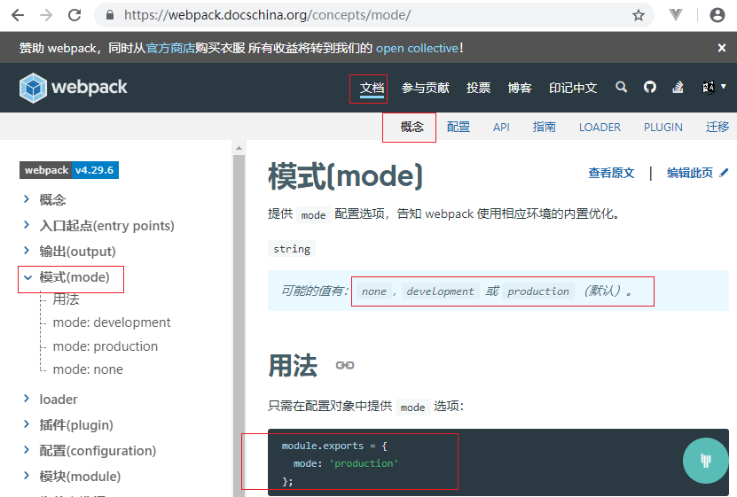
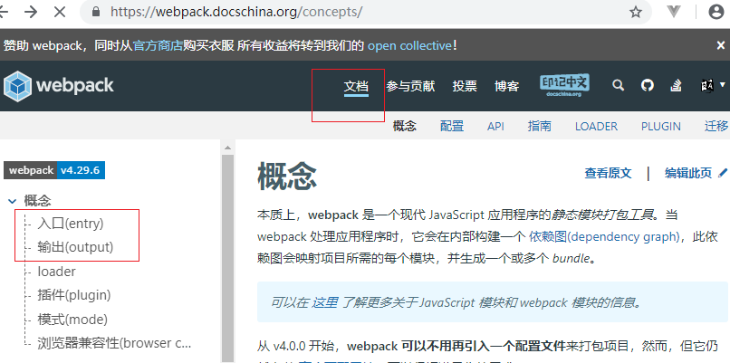
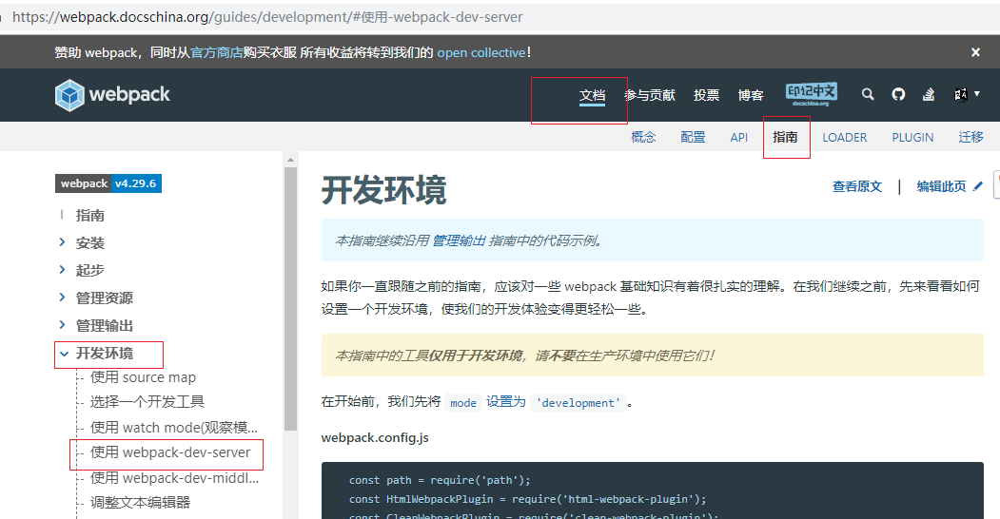
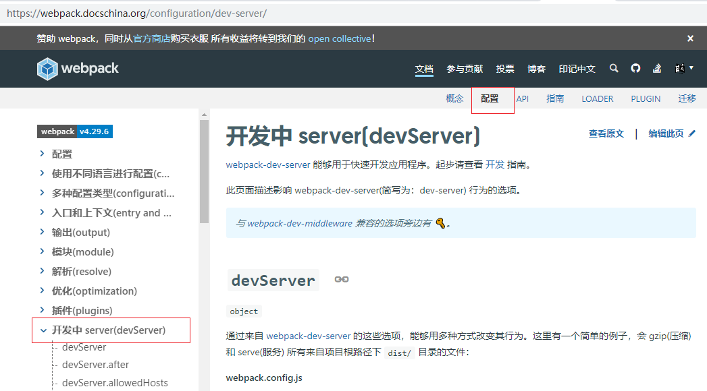
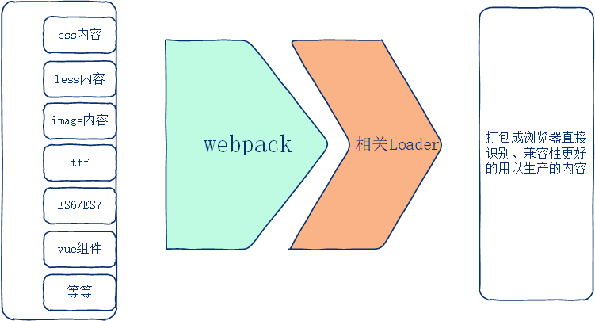
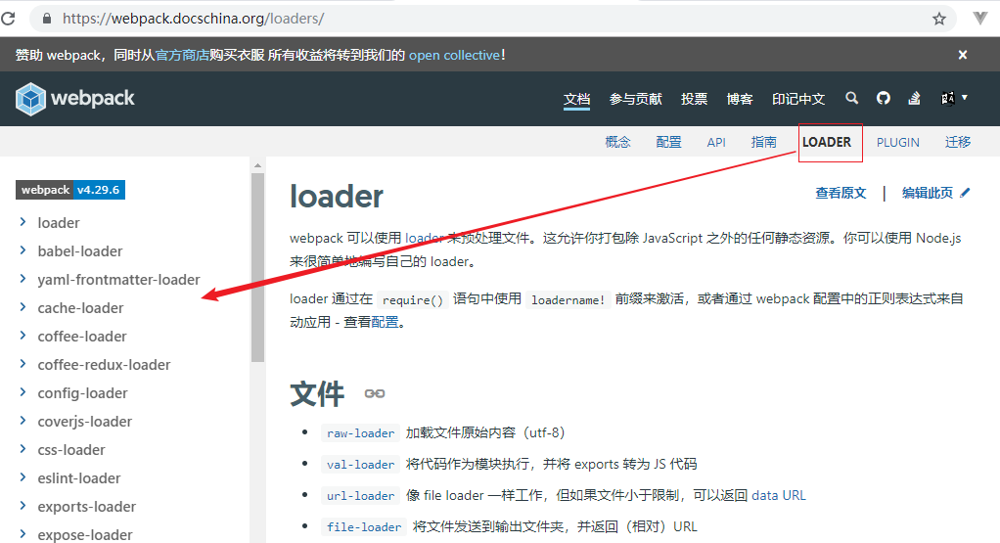
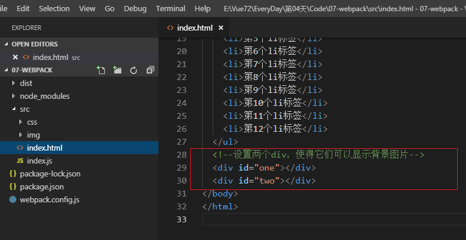
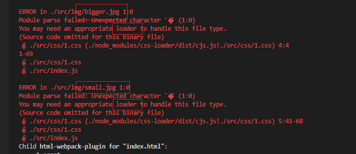
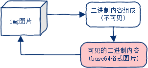
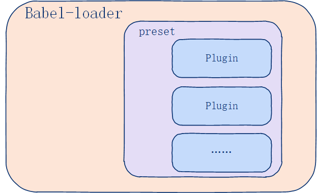

# WebPack安装使用


## 问题

第一个问题：

一个网站页面打开后，里边的请求资源很多(img/js/css等)，有可能达到数十至上百个，
有的资源本身很小，但是也需要进行一次http网络请求，并且http协议的**开启**和**关闭**所耗费的资源比文件本身都大很多，形成了喧宾夺主、不划算的效果


第二个问题：

项目开发过程中会使用各种语言
① html、JavaScript、css 通用语言技术
② less、scss、typescript(js的超集) ，高级语言技术
③ ES6(es2015)、ES7(es2016)，javascript高级标准 (es2019)

以上 ② 和 ③ 高级技术可以开发使用，但是不能直接用于生产，相反要通过指定的编译器做[转码]()或[降级]()处理才可以在所有浏览器上运行，各个高级技术逐个做编译处理是一件繁琐、效率低下的工作


## 什么是webpack

WebPack可以看做是模块**打包机器**,它做的事情是，分析你的项目结构，
找到JavaScript模块以及其它的一些浏览器不能直接运行的拓展语言
（less、es6、es7等），一次性将它们打包为合适的格式以供**所有浏览器**使用。


## 作用

1. 打包文件

   > 一次网络服务可能需要发送多个http请求，
   >
   > 请求的开启、关闭消耗的资源有可能比内容本身更消耗资源，
   >
   > 这样默认如把许多内容都打包为一个文件，做一次http请求更划算

2. 编译转码、降级高级技术标准为普通或通用的

   > 编译less、scss、typescript为浏览器可以运行的普通内容
   >
   > 降级es6、es7为es5或更低标准，使得代码的兼容性更好

3. 模块化开发

   > 可以通过require()/import方式开发程序代码

4. 编译图片为base64格式 字符串，减少网络请求次数


## 静态资源

webpack可以处理的静态资源具体有如下：

1. 样式表
   .css     .less     .scss
2. JS文件
   .js        .ts (typescript)
3. 图片
   .jpg/.jpeg    .png   .gif    .bmp  
4. 字体文件
   .ttf     .eot    .woff    .woff2    .svg
5. 模板文件
   .vue   .jsx(react)


## 什么地方适合使用

- webpack 非常适合于SPA(single page application) [单页面]()应用程序项目，这些项目通用特点是可供访问的页面总数量小于500个

  (不太适合与多页面的普通网站结合使用)

- vue/react/angular 都适合使用webpack进行项目构建


其他品牌的打包工具
Grunt
Gulp

...


## 案例-隔行换色(铺垫)

webpack是通过**node**开发出来的

因此使用webpack的形式与开发一个javascript功能包是一致的

### 初始化package.json文件

运行命令

```
yarn init -y
```

### 安装jquery

安装jquery

```javascript
yarn add jquery
```

> 正常情况下在vue环境中是不需要使用jquery的，因为相同的功能vue也可以实现，并且实现理念还更好

### 创建目录和文件(包括内容)

- src/index.js


创建src/index.html和src/index.js文件和对应内容

```javascript
// 页面加载完毕给li元素设置隔行换色
$(function(){
  $('li:odd').css('background-color','lightblue')
})
```


- src/index.html


在src/index.html文件中引入jquery.js   和 index.js 文件

```html
<script src="../node_modules/jquery/dist/jquery.js"></script>
<script src="./index.js"></script>
 <ul>
   <li>第1个li元素</li>
   <li>第2个li元素</li>
   <li>第3个li元素</li>
   <li>第4个li元素</li>
   <li>第5个li元素</li>
   <li>第6个li元素</li>
   <li>第7个li元素</li>
   <li>第8个li元素</li>
 </ul>
```

> index.js 和 index.html 都放到`src`子级目录中，因为webpack默认会寻找此目录


## 安装webpack并使用

webpack 是前端的一个开发工具，可以从NPM官网上下载使用；
官网：
https://webpack.docschina.org/

### 安装

运行命令

```
yarn add -D webpack webpack-cli
```

> 安装webpack 和 webpack-cli两个包，webpack-cli是webpack的内部依赖
>
> -D 表示通过`开发依赖`形式安装webpack  ，yarn的全称为 --dev (npm 全称为 --save-dev)


### 配置指令

打开 `package.json`文件，在 scripts 节点中，新增名称为 pack 的成员：

```javascript
"scripts": {
  "build": "webpack"
}
```


现在就可以通过如下命令运行webpack了

```
npm run build
```


### jquery的设置

src/index.js文件中引入jquery并做隔行代码设置：

```javascript
// ES6模块化方式导入jquery
import $ from 'jquery'

$(function(){
  $('li:odd').css('background-color','lightgreen')
})
```

> src/index.js是两个文件内容的体现，本身还包括jquery


### 打包

终端执行如下命令，使得webpack可以对src/index.js文件内容做打包处理

```javascript
npm run build
```


打包后的效果，可以看到项目根目录自动生成dist/main.js文件，

其是 **jquery** 和 **隔行代码** 的集中打包体现：

src/index.js   ==============>  dist/main.js

> src  、dist  或 main.js 等名称后期通过配置可以更改为其他


### 应用

现在在`src/index.html`应用中**不用**引入jquery和index.js文件，直接引入打包好的main.js就可以

```html
<!-- <script src="../node_modules/jquery/dist/jquery.js"></script> -->
<!-- <script src="./index.js"></script> -->
<script src="../dist/main.js"></script>			// 直接引入dist/main.js
```


注意：

> index.js 和 index.html 文件必须放到**src**目录中，因为webpack默认会操作该目录并找对应文件
>
> dist/main.js是webpack执行过程中自动创建的(通过配置可以修改，这是后话)

## 小结

- webpack具备**打包**、**编译**、降级代码功能等多重功能
- webpack需要同时安装**webpack**和**webpack-cli**两个功能包
- webpack打包好的文件默认放到**dist**目录，可以配置为其他
- 在**package.json**文件中配置指令，使得webpack可以运行


## 运行和开发依赖

依赖包的安装分为两种方式：开发 和 运行

- 依赖包在项目生产中充当**工具**作用的，建议通过开发依赖方式安装，例如webpack
- 依赖包在项目生产完毕**上线后都需要**使用的，就通过运行依赖方式安装，例如jquery


安装**运行**依赖包(dependencies)

```javascript
yarn add XXX  // 直接装包，没有任何其他参数，旧npm版本中要求设置--save参数
例如jquery通过运行依赖方式安装
yarn add jquery
```

安装**开发**依赖包(devdependencies)

```javascript
yarn add XXX --save-dev // 设置额外参数--save-dev(简称为-D)
例如webpack等依赖包通过开发依赖方式安装
yarn add --save-dev  webpack
```

问：依赖包如何区分是**开发的**还是**运行的**：
答：在 src/index.js 入口文件中通过require(或es6 import)引入的就是运行依赖包，否则是开发依赖包


运行依赖和开发依赖包会分别配置到package.json的  **dependencies**和 **devdependencies** 段里边


我们通过软件仓库获得到别人开发的项目代码，如果还需要二次开发，就执行如下指令安装依赖包，其表示要安装<font color=red>全部</font>的依赖包(运行的和开发的)

```
yarn
```

如果只是运行别人的项目，不做二次开发，就执行如下指令，表示只安装<font color=red>运行</font>依赖包(去除了不用的开发依赖包，**缩减了项目体积**，转而运行更快了)

```
yarn --production
```

> vue环境里边 开发、运行 依赖的效果不能体现
>
> nodejs中体现的更好


## webpack配置

### 打包模式

webpack首次运行打包后会产生下图的**警告**信息(原因是没有设置使用模式)，使得页面提示不是很友好，可以通过配置给消除(原因是没有设置**打包模式**)


[配置参考](https://webpack.docschina.org/concepts/)：




在项目**根目录**中，新建一个 [webpack.config.js]() 配置文件，内容如下


```javascript
module.exports = {
  mode: 'production'    // production    development
}
```

> 这是 使用 Node 语法， 向外导出一个 配置对象
> production：打包的dist/main.js文件是优化、压缩的
> development：打包的dist/main.js文件有适当的空白、换行、注释，可读性好


### 入口和出口配置

默认情况：

webpack的**入口**和**出口**文件分别是  src/index.js 和 dist/main.js

如果有需要，可以对以上路径名进行修改




在[webpack.config.js]() 配置文件中也可以给其他参数做配置

```javascript
module.exports = {
  entry: 'xxx',		//被打包的文件
  output:{
    path:'xxx',		//打包文件输出目录
    filename:'xxx',	//打包文件的名字
  }
}
```

> entry：配置入口文件
>
> output：配置出口 目录和文件


例如：

```js
const path = require('path')
module.exports = {
  entry: path.resolve('./src/index.js'),		//被打包的文件
  output:{
    path:path.resolve('./dist'),			//打包文件输出目录
    filename: 'bundle.js'				//打包文件的名字
  }
}
```

> path.resolve('./src/index.js.')					// E:\Vue40\every_day\03day\Code\01-webpack\src\index.js
>
> path.join(__dirname,  './src/index.js')     // E:\Vue40\every_day\03day\Code\01-webpack\src\index.js
>
> resolve较比join更加方便，其**不用**设置__dirname，也可以根据相对路径拼装出一个绝对路径


## 构建模板页面

webpack默认情况下只对src/index.js文件打包，完毕后在html应用文件中手动引入使用，不够智能。

现在目标：

webpack打包src/index.js文件的同时也要去**打包** src/index.html 模板文件，并**生成**在 dist/index.html，同时**自动引入**对应的js出口文件


有一个名称为**html-webpack-plugin**的插件，可以帮助我们把html模板文件也打包到dist目录去，并在其中

**自动引入**js打包文件，然后dist/index.html就可以直接用于生产使用了

[参考官网](https://webpack.docschina.org/plugins/html-webpack-plugin)：


### 装包

运行指令装包

```javascript
yarn add html-webpack-plugin -D
```


### 去除js文件引入

在src/index.html中不需要引入任何js文件，打包后会**自动**引入

```html
  <!-- <script src="../node_modules/jquery/dist/jquery.min.js"></script> -->
  <!-- <script src="./index.js"></script> -->
  <!-- <script src="../dist/bundle.js"></script> -->
```


### 给webpack配置插件

在 [webpack.config.js]()中，导入 html-webpack-plugin 插件：

同时，把这个插件配置给plugins项目

```javascript
const  HtmlWebpackPlugin  =  require('html-webpack-plugin')
plugins:  [
  new  HtmlWebpackPlugin({
    template:  'xxx'  // 被打包的html母模板文件路径名
  })
]
```

例如

```js
plugins: [
  new HtmlWebpackPlugin({
    // 设置被打包的html母模板文件路径名
    template: path.join(__dirname, './src/index.html')
  })
]
```


## 实时打包

现在 src/index.js和 src/index.html 都可以做打包处理了，但是有一个问题，就是当源码文件发生变动时，就需要重新打包才可以看到效果，这样工作效率比较低下。

webpack有一个名称为 **webpack-dev-sever** 工具，

这个工具可以**实时**处理js、**实时**处理html模板、**实时**编译查看效果，显著提高开发效率

> 这个工具安装配置好后，随时修改源码文件随时在浏览器上看效果，不用反复打包



### 装包

运行指令：

```
yarn add webpack-dev-server -D
```


### 参数配置

[配置参考](https://webpack.docschina.org/configuration/dev-server/)




在[webpack.config.js]()里边给webpack-dev-server配置运行参数

```javascript
// 给实时打包工具webpack-dev-server做相关配置
devServer: {
  port: 1024, // 实时http服务端口配置
  host: '127.0.0.1', // 实时http服务主机ip地址配置
  open: true, // 自动启动浏览器并呈现相关效果
  compress: true // 以压缩方式传输网络内容
}
```


### 启动指令

打开并配置package.json文件：

```javascript
"scripts": {
  "serve": "webpack-dev-server"
}
```


现在使用如下指令就可以运行webpack-dev-server了

```javascript
npm run serve
```

> 上述npm run  serve 是一个前台进程，终端窗口不能关闭，否则没有效果

现在 src/index.html 和 src/index.js  文件 可以实现随时修改随时看效果功能了


注意

- 实时打包文件内容以**内存**形式提供(不会生成dist物理目录和文件)，并通过**/根目录**形式被访问


## 小结

1. webpack通过配置文件**webpack.config.js**可以配置打包模式、入口和出口文件
2. 给webpack安装配置html-webpack-plugin插件可以**同时打包**html模板文件，同时html打包好的文件会自动引入js出口文件
3. 给webpack安装配置webpack-dev-server工具包可以实现**实时**打包并**查看**效果

   


# WebPack具体打包处理

## 处理css文件

创建独立的css样式文件并做引入使用

### 运行css步骤

1. 创建css文件和内容 相关

2. 项目主入口文件引入css

3. 在线实时打包运行

   

   错误原因：当前的webpack环境中，还不能对**css内容**进行识别


### 什么是loader

webpack本身就是一个**打包机器**，其不能对具体代码内容部分进行**处理**(或处理得非常有限)，不同的代码内容(less/scss/ES6(ES7)/image/css等等)需要webpack找到不同的**loader**(装载器)实现转码、编译、降级处理。





loader就是webpack手下的**小兵**(本质是javascript函数)，帮助webpack处理编译不同类型的内容，webpack打包过程中，遇到不同类型文件内容就会寻找对应loader处理


处理不同内容的loader：

| 不同内容 | loader处理器                                     |
| -------- | ------------------------------------------------ |
| css      | style-loader 和 css-loader                       |
| less     | less-loader 和 less(less是less-loader的内部依赖) |
| 图片     | url-loader 和 file-loader                        |
| ttf      | url-loader                                       |
| ES6/ES7  | babel-loader                                     |
| ...      | ...                                              |

[各种loader参考](https://webpack.docschina.org/loaders/)




### 安装处理css的loader

运行指令(通过开发依赖模式安装依赖包)

```javascript
yarn add style-loader css-loader -D
```

> 处理css内容需要两个loader配合使用 style-loader css-loader
> css-loader   :该loader可以实现在主入口js文件中以import/require的方式引入css 
> style-loader ：该loader可以实现在html文档中以style标签的形式嵌入css


### 配置loader

打开 [webpack.config.js]() 配置文件，在 module -> rules 数组中，新增处理 css 样式表的loader规则：

```javascript
module: { 
  // 制定各种类型文件的处理规则
  rules: [ 
    // css后缀文件loader匹配
    { test: /\.css$/, use: ['style-loader', 'css-loader'] }
  ]
}
```

> 先配置style-loader、再配置css-loader，有严格的顺序要求，执行的时候是先css-loader然后style-loader

现在css内容就可以正常打包处理了


注意：配置文件修改了，需要**重启**webpack或webpack-dev-server (npm run serve 或 npm run build)


给webpack做loader配置的其他格式参考：

```javascript
	// 没有参数的 1个或多个 加载器配置(use方式)
{ test: /\.格式$/, use: 加载器 },				    //1个
{ test: /\.格式$/, use: [加载器,加载器] },	//多个 数组元素 

  // 没有参数的 1个或多个 加载器配置(loader方式)
{ test: /\.格式$/, loader: 加载器},			    //1个
{ test: /\.格式$/, loader: 加载器!加载器},	//多个 !叹号分隔

	// 有参数的 1个或多个 加载器配置
{ test: /\.格式$/, loader: 加载器, options:对象参数}, //1个
{ test: /\.格式$/, 
  use:[
    {loader: 加载器, options:对象参数},
    {loader: 加载器, options:对象参数},
    ...
  ]
}, //多个
```


### 打包好的css在哪

css的文件内容最终会被打包进 dist/bundle.js 出口文件中，浏览器运行就可以看到效果

 (原理：css效果是通过style标签体现出来，bundle.js执行的时候会自动创建style标签和样式)

> 执行一次`npm run build` **物理**打包操作，会发现css样式内容被打包到bundle.js文件文件中


## 处理img文件

在css样式文件中给页面元素设置背景图片

### 运行img步骤

1. 准备img图片素材

   

   (大图大小为**339KB**、小图片大小为**7KB**)

2. 给模板设置图片显示的div站位标签 

   

3. 在css中的给div标签设置image背景图片

   

4. 在线实时打包运行

   

上图告知，css样式中使用image背景图片，该图片需要对应的loader来处理(目前没有)


### 安装loader


在css中给元素设置背景图片，这个图片文件需要通过url-loader处理

运行指令：

```javascript
yarn add file-loader url-loader -D
```

> file-loader是url-loader的内部依赖也需要一并安装


### 配置loader

在 [webpack.config.js]() 的配置文件中，新增一个 rules 规则来 处理 img图片 文件

```javascript
{
  // css样式中图片的处理loader设置
  test: /\.(png|jpg|gif)$/,
  use: [
    {
      loader: 'url-loader',
      options: {
        limit: 8192
      }
    }
  ]
}
```

> file-loader是url-loader的内部依赖模块，不需要设置
>
> 使用 url-loader, 它接受一个 limit 参数，单位为字节(byte)

`options/limit`  是给url-loader设置大小<font color=red>阈值</font>(8192字节=8k)

被处理的图片大小"小于等于"8192,那么就给其转码为<font color=red>base64字符串</font>格式图片，该格式图片可以嵌入到css样式文档中形成图片效果，好处是节省了http请求资源消耗，

否则就调用file-loader形成一个新的物理图片文件，在网络上有独立的http请求


### 在线实时运行

1. 生成物理图片
2. 生成base64字符串格式图片


经过上述步骤，现在进行实时打包，通过浏览器源代码可见：

- 大图被重新创建出来，并给重命名了
- 小图是通过**字符串**方式体现


### base64格式字符串

计算机里边每个文件都是通过”二进制码“组成的，包括图片



问：什么是base64格式图片？

答：Base64就是一种基于**64个可打印**字符来**表示二进制数据**的方法。 

一个图片可以变为二进制数据，该数据再编码为base64格式

 

[base64说明](https://www.imooc.com/article/27804)

问：什么样子的图片适合变为字符串形式显示？

答：网络中，每一个图片相当于一次http请求，图片多了的话，性能损失比较严重。
而将图片转化成base64格式的字符串，则极大地减少了请求数，因为base64是文本格式，可以直接放在body里。一般对于小于**10KB**大小的图片进行**base64**转码(大图片不适合做字符串转换，否则得不偿失)

(每个图片转变为base64格式后，大小都要变得大一些)


注意：

> html模板文件 中的img图片标签，**不会**被webpack处理的，只有css文件的背景图片才处理


### 图片子级目录

如果有多个图片都以物理文件形式被打包生成在dist目录，那么这个目录会显得非常凌乱，现在可以给loader做配置，使得图片生成在一个指定目录

给url-loader的options选项配置**outputPath**选项，使得在dist目录下创建子目录用于存储生成的图片

```js
{
  test: /\.(png|jpg|gif)$/i,
  use: [
    {
      loader: 'url-loader',
      options: {
        limit: 8192,
        outputPath: 'image'  // 现在做物理打包，图片就形成在dist/image目录里边了
      }
    }
  ]
}
```


## 处理less文件

创建独立的less样式文件并做引入使用

### 运行less步骤

1. 创建less文件和内容

2. 项目主入口文件引入less

3. 在线实时打包运行

   

   原因：缺少对应的loader处理less文件

### 安装loader

处理 less 的 webpack loader。将 Less 编译为 CSS

运行指令：

```javascript
yarn add less-loader less -D
```

> less是less-loader的依赖模块，需要一并安装


### 配置loader

在 [webpack.config.js]() 的配置文件中，新增一个 rules 规则来 处理 less 文件：

```javascript
{ test: /\.less$/, use: ['style-loader', 'css-loader', 'less-loader'] }
```

> 注意：
>
> ​	style-loader、css-loader、less-loader有严格的前后顺序要求
>
> ​	less-loader处理less内容为css内容，css内容再交给css-loader和style-loader处理


## 处理es6内容

### 运行es6标准内容

es6:  箭头函数、let、解构赋值、...扩展运算符、反单引号字符串等等

通过es6高标准技术实现项目开发

在src/index.js入口文件中声明使用es6标准内容


结果：es6的标准代码打包**前后**没有变化，与预期不相符(webpack应该**降级**es6/es7为es5标准)

打包好的代码兼容性差，只能在主流前沿浏览器中运行，低版本浏览器有可能就运行失败了


### babel-loader介绍

webpack是打包工具，不是代码转换工具，具体转换工作需要交给loader去做(不同的内容对应不同loader，css-loader  less-loader file-loader等)，如果开发者使用了es6或es7语法，为了各种浏览器都可以识别提升兼容性，就需要降级为es5标准，用于降级es6或es7的loader名称为**babel-loader**

在webpack官网可以找到处理es6高标准的babel-loader


babel是一个JS编译器，用来转换最新的JS语法，比如把ES6, ES7等语法转化成ES5语法，从而能够在大部分浏览器中运行。像箭头函数、let变量、反单引号字符串等，都可以转换。


[babel官网](https://babel.docschina.org)


在处理高级JS语法(ES6/ES7)的时候，webpack去寻找babel-loader，babel-loader自己不干活，具体交给plugin插件处理，不同es6/es7的语法对应不同的plugin转码，逐一安装使用太过繁琐，这时候**preset**出现了，其是一组**常用plugin**的集合，方便plugin的安装使用，提升开发效率(如果遇到冷门的es6语法，preset有可能处理不了，这时候再安装具体plugin处理即可)




### babel-loader使用效果展示

- 箭头函数变为具体函数


- 字符串拼接


- let变为var

  

- 解构语法

  

- 简易成员方式

  


### 安装loader

运行指令：

```javascript
yarn add babel-loader @babel/core @babel/preset-env -D
```

> 一共要安装3个模块
>
> @babel/core是内部依赖
>
> @babel-preset-env是许多常用plugin的集合


### 配置loader

在 [webpack.config.js]() 的配置文件中，新增一个 rules 规则来 处理 es6高级语法内容

```javascript
{
  // 通过loader对js文件中的es6/es7高标准进行降级处理，处理为es5
  test: /\.js$/,
  exclude: /node_modules/,
  use: 'babel-loader'
}
```

> exclude：设置表示对应目录不要经过babel-loader处理

配置示例：


在项目**根目录**创建[babel.config.js]()文件做如下配置

```javascript
module.exports = {
  presets : ['@babel/preset-env'],
}
```

> 作用：使得babel-loader找到preset插件集合帮忙处理es6/es7内容


### 应用

在入口文件中添加各种es6高级语法内容

```javascript
// 通过es6标准编写js代码
// 1) 箭头函数
var getInfo = ()=>{
  console.log('正在学习loader使用');
}
getInfo()

// 2) 解构赋值
const {name,number:num} = {name:'front62',number:75}
console.log(name,num);

// 3) let使用
let address="顺义"

// 4) 字符串拼装
var weather="晴朗"
console.log(`今天的天气情况：${weather}`);
```

之后webpack进行打包处理（npm run build），在dist/bundle.js打包文件中查看babel-loader/preset对es6内容的降级处理效果


## 处理ttf文件

`目标`：

​	给目标内容设置指定的字体库效果

`步骤`：

1. 设置字体库文件

   src/font/STCAIYUN.TTF

2. 在src/index.html中设置被操作p标签目标

   ```html
   <p>秋侵人影瘦，霜染菊花肥</p>
   ```

3. 在 src/css/1.css中设置p标签使用字体库文件

   ```css
   /*定义一个字体库*/
   @font-face{
     font-family: 'cai';
     src:url('../font/STCAIYUN.TTF');
   }
   /*页面元素应用字体库*/
   p{font-family: 'cai'}
   ```

   > 此时实时打包服务操作终端会提示字体库文件缺少对应的loader

4. 配置使用url-loader

   ```js
   module: { 
     // 制定各种类型文件的处理规则
     rules: [ 
       {
         //5) 处理字体库文件 的loader配置
         test:/\.(ttf|ttc|otf|woff)$/i,
         loader: 'url-loader',
         options: {
           limit: 10000, // 10k大小的阀值
           outputPath: 'fonts' // 为存储生成的字体库文件设置子级目录
         }
       }
     ]
   }
   ```

   > 现在字体库文件正常生效了


## @别名和默认后缀

脚手架搭建的项目，都会配置**@符号别名**，代表src的绝对目录信息，以方便其他文件引入

同时还可以给常用文件配置**后缀名**，使得文件引入可以省略设置，提高开发速度

如果有需要，可以在webpack.config.js中做如下配置：

```js
const ph = require('path')
module.exports = {
  resolve: {
    alias: {
      // 配置别名
      '@': ph.resolve('./src'),
    },
    // 配置自动识别后缀名
    extensions: [
      '.js',
      '.vue',
      '.json',
      '.css'
    ],
  },
}
```


## 小结

1. 处理css文件的loader有两个：  

   css-loader：允许入口文件通过模块化方式引入css文件

   style-loader：把css样式内容通过style标签嵌入到html文档中

2. 处理image图片的loader有两个：

   url-loader：把比较小的图片变为字符串

   file-loader：大图片重新编译生成处理

3. 处理less文件的loader有3个

   less-loader(less)：把less的内容编译转码为css内容

   style-loader、css-loader

4. es6/es7降级处理

   babel-loader：自己不干活，找preset处理

   preset：自己不干活，找plugin处理

   plugin：针对不同类型的高标准内容做降级处理


# VueCLI

在VueClI3版本的脚手架项目中，可以在项目根目录下通过如下指令，查看全部的的webpack配置信息

```
vue inspect > output.js				// 查看全部webpack配置信息
```

> 如上指令执行完毕，会在项目根目录下生成output.js文件，内容就是默认的webpack配置信息


# yarn

什么是yarn

> 快速、可靠、安全的依赖管理工具。
>
> Yarn是由Facebook、Google、Exponent 和 Tilde 联合推出了一个新的 JS 包管理工具 ，正如官方文档中写的，Yarn 是为了弥补 npm 的一些缺陷而出现的


与npm的主要区别

> yarn安装更快，会同时安装多个，而npm按照队列一个一个顺序安装，必须等到当前的包安装完毕后才能去安装下一个


安装步骤：

```

npm i -g yarn    // 全局方式安装yarn

```

> yarn --version   // 可以查看安装好的yarn的具体版本号码


给yarn配置taobao镜像

```

yarn config set registry https://registry.npm.taobao.org		// 配置为taobao的镜像源

```

> yarn config get registry				// 查看当前使用的源
>
> 镜像：外国npm服务器的全部资源被定期复制到中国服务器，以方便中国用户就近下载相关的资源，这个中国服务器就是“镜像”


yarn与npm针对各个指令的执行

|    **对比**    |         **yarn**          |          **npm**          |
| :------------: | :-----------------------: | :-----------------------: |
|     初始化     |       yarn init -y        |        npm init -y        |
|  安装全部依赖  |  yarn install 或者 yarn   |        npm install        |
|    新增依赖    |      yarn add 依赖包      |    npm install 依赖包     |
|                |    yarn add 依赖包 -D     |   npm install 依赖包 -D   |
|    删除依赖    |    yarn remove 依赖包     |   npm uninstall 依赖包    |
|    更新依赖    |       yarn upgrade        |        npm update         |
| 全局安装或删除 | yarn global remove 依赖包 |  npm uninstall 依赖包 -g  |
|  同时下载多个  |  yarn add 依赖包 依赖包   | npm install 依赖包 依赖包 |

> npm: --save-dev 和 -D 互为别名，表示通过开发依赖方式安装依赖包
>
> yarn: --dev 和 -D 互为别名，表示开发依赖
>
> yarn：global代表全局
>
> npm: -g 代表全局


相关文章

1. [vue.js 2.x 官网-国内](https://vue.docschina.org/)   或  [vue.js2.X 官网-国外](http://cn.vuejs.org)
2. [npm](https://www.npmjs.com/)
3. [饿了么组件库](http://element-cn.eleme.io/#/zh-CN)
4. [github](https://github.com/)
5. [webpack打包](https://webpack.docschina.org/)
6. [babel下一代javascript编译器](https://babel.docschina.org/)
7. [bootcdn免费提供静态内容支持](https://www.bootcdn.cn/)
8. [w3c帮助官网](http://www.w3school.com.cn)
9. [鸟哥帮助官网](http://www.runoob.com)
10. [JavaScript 指南](https://developer.mozilla.org/zh-CN/docs/Web/JavaScript/Guide)
11. [印记中文(深入挖掘国外前端新领域，为中国 Web 前端开发人员提供优质文档！)](https://docschina.org/)
12. [js 里面的键盘事件对应的键码](http://www.cnblogs.com/wuhua1/p/6686237.html)
13. [Vue.js双向绑定的实现原理](http://www.cnblogs.com/kidney/p/6052935.html)
14. [Vue开源项目汇总](https://github.com/opendigg/awesome-github-vue)
15. [Vuejs中文社区](https://www.vue-js.com)
16. [JavaScript Standard Style代码规范](https://standardjs.com/)

