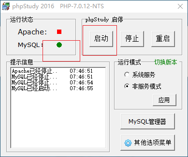
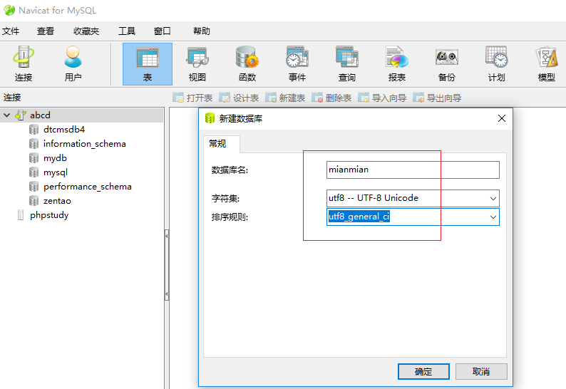
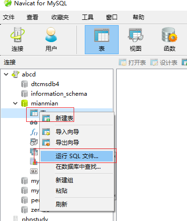
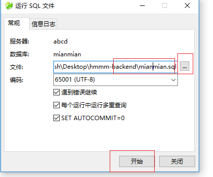
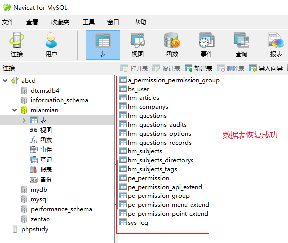
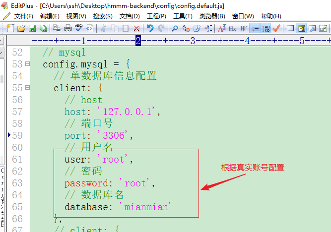
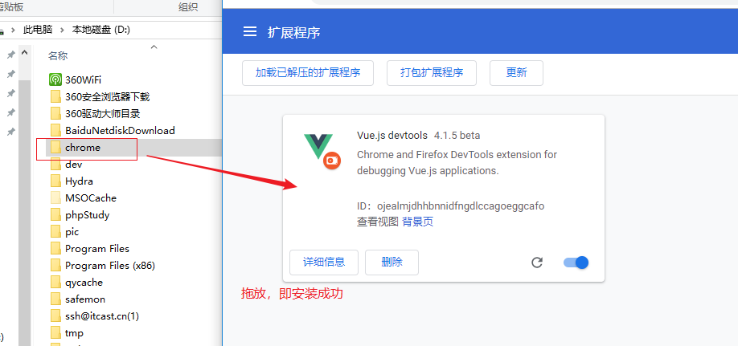

# 团队实战第一天

## 目标

- 了解项目开发流程
- 搭建后端项目
- 搭建前端项目
- github管理项目源代码
- 学科与数据接口结合
- 能够应用yapi

## 开发流程介绍

`目标`：

​	了解项目开发流程

`步骤`：

1. 需求分析
2. 产品设计
3. psd  原型图(通过photoshop绘制项目假想效果)
4. UI图(绘制项目相关图片、图标效果)
5. 后端数据接口项目开发(数据库(表、字段)设计、服务搭建[apache、nginx、nodejs等]、开发语言[nodejs、php、python等])
6. 前端项目开发，根据psd和ui绘制功能页面，大量应用第3方组件库(例如elementui)
7. 前、后 端数据接口问题，**mock**假数据(http://mockjs.com/)、在线数据，"数据接口"可以通过yapi管理
8. **数据接口**[地址、数据] 联调  -- **禅道**(https://www.zentao.net/)管理
9. 新项目、开发一半的

## 项目描述

`目标`：

​	了解项目产生背景、架构


针对目前大量学员在培训完之后直接去面试企业的通过率低的问题，公司研发了黑马面面小程序，学员在空闲时间可以通过查看企业真实面试题，不仅可以查看企业真题，也可以通过刷题寻找自己的短板进行补充，新版本提供模拟面试功能，用户可以通过微信小程序进入模拟面试模块，完成定向企业面试和自由组题模式


前端项目：

​	前台项目：微信小程序、电脑端、手机app

​	后台项目：黑马头条项目、黑马面面

后端项目：nodejs+mysql数据库开发的接口项目

## 安装后端项目

`目标`：

​	能够完成项目后端数据接口项目的安装、启停操作

`步骤`：

1. 创建项目

   把hmmm-backend目录复制到**桌面**

2. 通过命令行  进入 到 hmmm-backend目录，执行yarn，安装全部的依赖包

3. 创建数据库、导入数据

   启动mysql



​	创建数据库：



恢复数据信息：



导入数据：



数据恢复成功：



4. 给项目配置数据库账号(root/root)、mysql数据库名字(mianmian)

   对项目指定配置文件(hmmm-backend/config/config.default.js)做 数据库账号、数据库名称 配置



5. 启、停 接口项目

```
npm start
// 会同时创建许多子窗口，最小化即可 

npm stop
```

接口地址：http://127.0.0.1:7001

`注意`：

1. 后端数据接口项目启动后，有许多系统服务，不能关闭
2. 项目的上级各个目录名称不要使用"中文"或其他特殊符号，只使用英文或数字即可
3. 如果执行yarn安装全部依赖包有问题，也可以直接复制、粘贴老师的node-modules目录做应用
4. npm start  与 stop 需要配对使用，不用重复start

## 前端项目搭建

`目标`：

​	能够安装前端项目

`步骤`：

1. 复制项目代码到运行目录(桌面)

2. 安装全部依赖包

   不建议执行yarn，推荐直接复制老师的node_modules目录到项目中

   > 项目中使用到了node-sass依赖包，其不断升级，非常不稳定，导致不能很好地安装

3. 修改config/index.js文件，配置自动开启浏览器

```
autoOpenBrowser: true
```

4. 启动项目

```
npm start
```

> 正常情况，浏览器自动开启，并可以访问到后台项目效果
>

`注意`：

1. 与后端项目一样，前端项目的上级各个目录不要使用"中文"
2. 前端项目需要后端项目服务支撑，因此启动之前请先确保后端项目(http://127.0.0.1:7001)已经开启
3. 前端项目通过Ctrl+c关闭，本身没有npm stop指令
5. 如果执行yarn安装全部依赖包有问题，也可以直接复制、粘贴老师的node-modules目录做应用
5. 如果根目录没有static目录，新建一个即可

## 前端项目目录介绍

`目标`：

​	了解前端项目的目录组织结构

主结构文件说明(VueCLI2)：

```bash
|-- build                          # 项目构建(webpack)相关代码
|   |-- build.js                     # 生产环境构建代码
|   |-- check-version.js             # 检查node、npm等版本
|   |-- logo.png                     # logo图片
|   |-- utils.js                     # 构建工具相关
|   |-- vue-loader.conf.js				  # vue-loader配置
|   |-- webpack.base.conf.js       # webpack基础配置
|   |-- webpack.dev.conf.js        # webpack开发环境配置
|   |-- webpack.prod.conf.js       # webpack生产环境配置
|-- config                         # 项目开发环境配置
|   |-- dev.env.js                   # 开发环境配置
|   |-- index.js                   # 项目主要配置(包括监听端口，打包路径等)
|   |-- prod.env.js                  # 生产环境配置
|-- src                              # 源码目录
|   |--api
|      |-- base     # 基础接口API
|      |-- example  # 例子
|      |-- hmmm     # 功能接口API
|   |-- assets						   # 静态资源 
|   |-- components**          # vue公共组件
|   |-- filters   # 过滤器
|   |-- icons     # 图标
|   |-- lang			# 多语言切换
|   |-- mixins     # 内容合并
|   |-- mock
|   |-- module-dashboard
|   |-- module-details
|   |-- module-form
|   |-- module-hmmm**   # 待完成的功能
|   |-- |--components # 组件
|   |-- |--pages      # 页面组件（包含8个页面） **重点**    
|   |-- |--router     # 模块路由
|   |-- |--store      # 存储数据
|   |-- module-list
|   |-- module-manage
|   |-- router**                   # vue路由
|   |-- App.vue**                  # 页面入口文件
|   |-- main.js**                  # 程序入口文件，加载各种公共组件
|-- static                     # 静态文件，比如一些图片，json数据等
|   |-- data                       # 群聊分析得到的数据用于数据可视化
|-- .babelrc                       # ES6语法编译配置
|-- .editorconfig                  # 定义代码格式
|-- .gitignore                     # git上传需要忽略的文件格式
|-- .postcssrc.js                  # post-loader的插件配置文件
|-- index.html                   # 模板文件页面
|-- package.json                   # 项目基本信息
|-- package-lock.json              # 锁定当前安装的包的依赖
|-- README.md                      # 项目说明
```

## 分配任务

`目标`：

​	组长、组员能够清楚地知道自己的分工职责

`步骤`：

1. git远程仓库：	http://github.com

2. 组长
   1. 创建远程仓库

   2. 拉取成员进入仓库????

   3. 上传本地代码(hmmm_frontend)到远程仓库(默认是master分支)

      > 注意，如果当前项目没有git版本库，请先初始化(git init)
      >

      > 之后执行 git add  . / git commit -m 'xx' / git push 仓库地址 master

   4. 创建新git分支并切换进入( git checkout -b xxx )，与普通成员一样做具体业务功能开发

   5. 待各个组员开发完毕，把大家的代码合并到master分支

3. 普通成员
   1. git  clone 复制远程仓库内容到本地（git clone https仓库地址）
   2. 创建自己的开发分支(可以使用自己的名字拼音)并切换进入 (git checkout -b xxx )
   3. 在自己的分支里边做开发中。。。  
   4. add/commit/push 推送自己的分支到远程仓库

在自己的分支上开发各自分配的功能

- 基础题库
- 精选题库
- 试题审核
- 组题列表
- 学科管理
- 目录管理
- 标签管理
- 面试技巧
- 

`注意`：

1. 每名开发者都需要在本地**独立**搭建后端项目
2. 源代码管理仓库还可以使用码云(https://gitee.com/)

## github添加成员

`目标`：

​	github仓库中，组长能够实现添加组员到仓库

`步骤`：	

​	远程仓库进入"设置"项目----->合作者------->添加合作者----->设置被添加者的账号--->添加

​	被添加者：接收github邮件，接受请求，成为同一个仓库项目的开发者

## 相关资源

- 接口文档：https://mock.boxuegu.com/project/113/interface/api[恢复版]
- 学员yapi应用：<http://yapi.demo.qunar.com/>
- 原型图：[http://czpm.itcast.cn/黑马面面/V2.0/](http://czpm.itcast.cn/%E9%BB%91%E9%A9%AC%E9%9D%A2%E9%9D%A2/V2.0/)
- 设计稿：只做参考，主要依据原型。

## 上午总结

1. 了解项目开发流程

   1. 需求
   2. 产品设计(word、excel)
   3. psd
   4. ui
   5. 后端数据接口开发(mysql、服务器搭建、开发语言)
   6. 前端开发，psd、ui、第三方组件库
   7. 前端、后端数据结合，mock假数据，yapi数据接口管理系统
   8. 项目开发中的点滴事情需要通过“禅道”系统管理

2. 搭建后端项目

   1. 复制
   2. yarn(或复制成品node_modules目录)
   3. 数据库创建、导入数据表
   4. 配置文件配置数据库相关账号信息
   5. 项目启停  npm start  /  npm stop

3. 搭建前端项目

   1. 复制
   2. (yarn) 复制成品node_modules目录应用
   3. config/index.js  浏览器开启
   4. 启动项目 npm start

   

4. github管理项目源代码

   1. 组长
      1. 创建仓库、拉入组员、创建分支、开发
   2. 组员
      1. clone复制仓库、创建分支、开发

## 路由分析

`目标`：

​	知道系统中路由的组成

暂时全部路由如下：

```
src\router\index.js    // main.js中直引
src\module-manage\router\index.js  // main.js中通过use()插件方式引入
src\module-hmmm\router\index.js  // main.js中通过 use()插件方式引入
```

`注意`：

​	虽然路由分为3个文件组成，系统执行的时候会把它们合并到一起

## 组件寻找

`目标`：

​	通过路由可以找到应用组件

`步骤`：

​	路由==>  _import函数  ==>  src/router/import_development.js  

## api接口介绍

`目标`：

​	了解api的类型和应用

api接口分为两种类型：

1. axios动态接口数据
2. constants常量接口数据


## 题库与数据接口结合

`目标`：

​	制作题库列表 **学科**、**难度**、**试题类型** 3项表单域

`步骤`：

1. 给模板绘制各个表单域
2. 组件实例声明searchForm对象，内部有各个成员(名称参考api接口)
3. 组件实例  声明普通的搜索项目成员 List 相关的
4. import导入相关api接口方法 1个动态的，2个常量
5. 在methods中声明方法，调用api方法获得需要的数据
6. 在created中，调用methods相关方法，并把获得的数据直接赋予给组件实例普通成员
7. 在模板中对组件实例普通成员做遍历展示数据


模板相关代码：

```html
<template>
  <div class="dashboard-container">
    <div class="app-container">
      <!-- <el-form ref="searchFormRef" :model="searchForm"></el-form> 
            ref：用于获取当前的el-form元素
            :model: 是el-form的固定属性，用于获取整个form表单的各项表单域信息
      -->
      <el-row>

        <el-col :span="6">
          学科：
          <el-select v-model="searchForm.subjectID">
            <el-option v-for="item in subjectIDList" :key="item.value" :value="item.value" :label="item.label">
            </el-option>
          </el-select>
        </el-col>
        <el-col :span="6">
          难度：
          <el-select v-model="searchForm.difficulty">
            <el-option v-for="item in difficultyList" :key="item.value" :value="item.value" :label="item.label">
            </el-option>
          </el-select>
        </el-col>
        <el-col :span="6">
          试题类型：
          <el-select v-model="searchForm.questionType" style="width:140px;">
            <el-option v-for="item in questionTypeList" :key="item.value" :value="item.value" :label="item.label">
            </el-option>
          </el-select>
        </el-col>

      </el-row>
    </div>
  </div>
</template>
```


import导入相关api接口：

```js
// 把api数据接口相关方法导入进来
import { simple } from '@/api/hmmm/subjects' // 学科
// as给导入的成员设置别名
import {
  difficulty as difficultyList, 
  questionType as questionTypeList} 
  from '@/api/hmmm/constants' // 常量数据

```


组件实例的data、methods、created等成员：

```js
export default {
  name: 'QuestionsList',
  data() {
    return {
      // 定义各个搜索表单域的数据展示成员
      subjectIDList: [],
      difficultyList, // 简易成员赋值(difficultyList:difficultyList)
      questionTypeList,

      // 定义搜索数据对象
      searchForm: {
        subjectID: '',
        difficulty: '',
        questionType: ''
      }
    }
  },
  created() {
    // 学科
    this.getSubjectIDList()
  },

  methods: {
    // 获得 学科 下拉列表数据
    async getSubjectIDList() {
      var rst = await simple()
      // console.log(rst)
      // 把获得到的学科信息赋予给 subjectIDList 成员
      this.subjectIDList = rst.data
    }
  }
}
```


`注意`：

1. 学科信息 需要通过axios动态获取
2. 难度、试题类型 是常量，可以直接获取使用
3. 难度、试题类型 应用的是 es6模块化按需导入重命名 + 对象简易成员赋值

## yapi使用

`目标`：

​	能够注册、应用yapi进行数据接口管理


yapi是   高效、易用、功能强大  的数据接口管理平台
官网：<http://yapi.demo.qunar.com/>

简单使用：登录/注册----->导入接口api.json文件----->应用

`注意`：

​	yapi首次注册登录是通过”用户名“，后期要使用“邮箱账号“登录

## 下午总结

1. 路由分析

   1. 一共有3个路由文件

      

2. 组件寻找

   1. 路由-->_import--> @/utils/request.js  

3. api接口介绍

   1. axios动态获取接口数据
   2. constants常量数据

4. 题库与数据接口结合应用

   1. 学科
      1. import导入api方法  simple
      2. methods--->simple
      3. created-->methods
      4. List相关成员收集
      5. 模板展示 list相关成员
   2. 难度、视图类型
      1. import导入  as 设置别名
      2. data设置List成员，简易成员赋值
      3. 模板遍历展示List数据
   3. 各个表单域都需要配置 v-model

5. yapi应用


作业：

1. 组长
   1. 创建github仓库，拉取组员到仓库里边，push对送master分支、创建自己的新分支、并做业务开发
2. 组员
   1. clone仓库到本地，创建新分支进行开发

注意：

​	master分支不要开发


# 团队实战第二天

## 回顾

1. 安装后端项目hmmm_backend

   - 复制

   - 安装全部依赖包 yarn (或复制他人的node_modules目录)

   - 创建mianmian数据库、导入数据

   - 修改配置文件(config/config.default.js)，设置mysql账号、数据库名字

   - 启动服务(npm start 与 npm stop 配对使用)

     > 注意：项目上级各个目录不要使用“中文”

2. 安装前端项目 hmmm_frontend

   - 组长：创建远程仓库，push原始项目文件

   - 组员：git clone 地址

   - yarn安装全部依赖包 (或复制他人的node_modules目录)

   - 配置文件config/index.js，true，浏览器自动开启

   - npm start启动服务  ctrl+c  Y

     > 注意：项目上级各个目录不要使用“中文”

3. 前端项目目录介绍

   - src/api 数据接口相关(axios动态、constants常量)
   - 路由：
     - src\router\index.js
     - src\module-hmmm\router\index.js
     - src\module-manage\router\index.js
   - src/module-** 相关业务组件

4. github添加成员

   远程仓库

   设置

   合作者

   添加合作者

5. git常用操作

   ```bash
   git add .
   git commit -m 'xxx'
   git clone 远程仓库地址	 // 同一个项目执行一次
   git pull 远程仓库地址 远程分支名<:本地分支名>  // 更新， 同一个项目频繁执行
   git push 远程仓库地址  分支
   ```

6. 模块化

   1. CommonJS民间

      ```
      导出：
      module.exports=对象
      ```

      ```
      导入：
      var xx = require(模块文件)
      ```

   2. ES6官方

      ```
      默认导出导入：
      导出
      export default 对象
      导入：
      import xx from 模块文件
      ```

      ```
      按需导出导入：
      导出
      export const a = 10
      export const b = 20
      export function c(){}
      导入：
      import {a,b,c} from 模块文件
      import {a as aa, b,c} from 模块文件
      ```

   one.js

   ```
   export const a = 10
   export const b = 20
   export default 对象
   export function c(){}
   ```

   

   two.js

   ```
   默认、按需独立导入
   import {a,b} from 'one.js'
   import obj from 'one.js'
   默认、按需一并导入(默认在前、按需在后)
   import obj,{a,b,c as cc} from 'one.js'
   ```

   按需导出导入注意：

   1. 一般针对const、function进行导出操作，var/let做导出没有意义
   2. one.js文件既可以进行按需导出、也可以同时进行默认导出，默认只能设置一次，按需可以设置多次
   3. 导入的成员如果和当前环境的其他成员有冲突，可以通过as设置别名
   4. 按需导入不设置别名情况下，成员名称 与 导出的必须一致

   

7. 学科(下拉列表)与数据接口结合

   - 按需导入 import {simple} from '@/api/hmmm/subjects'
   - data声明subjectIDList成员并接收获得的学科信息
   - methods中声明方法getSubjectIDList()，调用simple方法获得数据并赋予给subjectIDList成员
   - created中调用getSubjectIDList方法
   - 下拉列表组件 el-select/el-option，并遍历展示subjectIDList数据

8. 难度/试题类型 与 数据接口结合

   - 按需导入 import { difficulty as difficultyList, questionType as questionTypeList} from '@/api/hmmm/constants'
   - data成员： difficultyList, questionTypeList  成员简易设置
   - 下拉列表组件 el-select/el-option，并遍历展示data数据

## 目标

- 实现题库数据列表展示
- 实现题库数据搜索
- 实现题库数据删除


## vue-devtools插件工具

`目标`：

​	能够给chrome浏览器安装devtools插件


devtools是chrome(google)浏览器的给vue开发的插件工具，利用这个工具可以清楚地查看到当前各个组件的data数据信息，极大地方便项目的开发

安装方式：

1. 浏览器直接下载安装(需要可以访问到google官网)
2. github上下载源码编译安装


`步骤`：

1. 把chrome目录复制粘贴到系统比较稳定的目录(例如D盘根目录)

2. 把chrome目录直接“**拖放**”到chrome浏览器的“扩展程序”区域，此时工具即安装好

   


`注意`：

​	只有vue开发的项目才可以激活该工具应用


# 基础题库搜索框

## 绘制相关元素

`目标`：

​	给题库搜索框绘制表单域元素  和  相关data成员


`步骤`：

1. 绘制相关的el-row   el-col  el-select/el-option   el-input

   ```html
           <el-col :span="6">标签:
             <el-select placeholder="请选择" v-model="searchForm.tags" style="width:135px">
             </el-select>
           </el-col>
         </el-row>
   
         <el-row :gutter="10">
           <el-col :span="6">城市：
             <el-select placeholder="请选择" v-model="searchForm.province" style="width:102px">
             </el-select>
             <el-select placeholder="请选择" v-model="searchForm.city" style="width:102px">
             </el-select>
   
           </el-col>
           <el-col :span="6">关键字：
             <el-input type="text" placeholder="请输入关键字" v-model="searchForm.keyword" style="width:190px"></el-input>
           </el-col>
           <el-col :span="6">题目备注：
             <el-input type="text" placeholder="请输入备注" v-model="searchForm.remarks" style="width:190px"></el-input>
           </el-col>
           <el-col :span="6">企业简称：
             <el-input type="text" placeholder="请输入简称" v-model="searchForm.shortName" style="width:190px"></el-input>
           </el-col>
         </el-row>
   
         <el-row :gutter="10">
           <el-col :span="6">方向：
             <el-select placeholder="请选择" v-model="searchForm.direction" style="width:135px">
             </el-select>
           </el-col>
           <el-col :span="6">录入人：
             <el-select placeholder="请选择" v-model="searchForm.creatorID" style="width:135px">
             </el-select>
           </el-col>
           <el-col :span="6">二级目录：
             <el-select placeholder="请选择" v-model="searchForm.catalogID" style="width:135px">
             </el-select>
           </el-col>
           <el-col :span="6">
             <el-button size="mini">清除</el-button>
             <el-button type="primary" size="mini">搜索</el-button>
           </el-col>
         </el-row>
   ```

2. 

3. 绘制相关的组件实例data的searchForm的各个成员

   ```js
         // 搜索表单数据对象
         searchForm: {
           subjectID: '', // 科学
           difficulty: '', // 难度
           questionType: '', // 试题类型
           tags: '', // 标签
           province: '', // 省份
           city: '', // 城市
           keyword: '', // 关键字
           remarks: '', // 备注
           shortname: '', // 企业简称
           direction: '', // 方向
           creatorID: '', // 录入人
           catalogID: '' // 二级目录
         }
   
   ```


## 标签下拉列表

`目标`:

​	绘制标签下拉列表数据部分

`步骤`：

1. 制作data成员tagsList

   ```js
         tagsList: [], // 标签
   
   ```

2. import导入获取标签数据 的simple(tagsSimple)方法

   ```js
   import {simple as tagsSimple} from '@/api/hmmm/tags' // 获取标签信息方法导入
   
   ```

3. 给methods声明getTagsList()方法，调用tagsSimple获得标签数据，并赋予给tagsList

   ```js
       // 获得 标签 列表数据
       async getTagsList() {
         var rst = await tagsSimple() // Promise对象 变为 dt了
         this.tagsList = rst.data
       },
       
       async getTagsList() {
         var rst = await tagsSimple() // Promise对象 变为 dt了
         var rst2 = await xx()
         var rst3 = await xx()
         var rst4 = await xx()
         this.tagsList = rst.data
       },  
         
       getTagsList() {
         tagsSimple().then(function(dt){
           this.tagsList = dt.data
         })
       },
   
   ```

4. 在created中调用getTagsList方法

   ```js
       // 获得标签信息
       this.getTagsList()
   
   ```

5. 模板中通过el-option把tagsList数据信息以下拉列表形式展示出来

   ```html
   <el-option 
              v-for="item in tagsList" 
              :key="item.value" 
              :label="item.label" 
              :value="item.value">
   </el-option>
   
   ```

   

`注意`：

​	各个表单域(下拉列表/输入框/文本域)标签需要设置**v-model**属性，避免不能设置信息


## 录入人下拉列表

`目标`:

​	绘制 录入人 下拉列表数据部分

`步骤`：

1. 制作data成员creatorIDList

   ```js
         creatorIDList: [], // 录入人
   
   ```

   

2. import导入获取标签数据 的simple(usersSimple)方法(api/base/users.js)

   ```js
   import {simple as usersSimple} from '@/api/base/users' // 获取录入人信息方法导入
   
   ```

   

3. 给methods声明getCreatorIDList()方法，调用usersSimple获得标签数据，并赋予给creatorIDList

   ```js
       // 获得 录入人 列表数据
       async getCreatorIDList() {
         var rst = await usersSimple()
         this.creatorIDList = rst.data
       },
   
   ```

   

4. 在created中调用getcreatorIDList方法

   ```js
       // 获得录入人信息
       this.getCreatorIDList()
   
   ```

   

5. 模板中通过el-option把creatorIDsList数据信息以下拉列表形式展示出来

   ```html
   <el-option 
              v-for="item in creatorIDList" 
              :key="item.id" 
              :label="item.username" 
              :value="item.id">
   </el-option>
   
   ```

   

`注意`：

​	录入人的返回信息是id和username字段，之前其他项目时value/label

## 二级目录下拉列表

`目标`:

​	绘制 二级目录 下拉列表数据部分

`步骤`：

1. 制作data成员catalogIDList

   ```js
         catalogIDList: [], // 二级目录
   
   ```

   

2. import导入获取标签数据 的simple(directorysSimple)方法(api/hmmm/directorys.js)

   ```js
   import {simple as directorysSimple} from '@/api/hmmm/directorys' // 获取二级目录信息方法导入
   
   ```

   

3. 给methods声明getCatalogIDList()方法，调用directorysSimple获得标签数据，并赋予给catalogIDList

   ```js
       // 获得 录入人 列表数据
       async getCatalogIDList() {
         var rst = await directorysSimple()
         this.catalogIDList = rst.data
       },
   
   ```

   

4. 在created中调用getCatalogIDList方法

   ```js
       // 获得 二级目录 信息
       this.getCatalogIDList()
   
   ```

   

5. 模板中通过el-option把catalogIDList数据信息以下拉列表形式展示出来

   ```html
   <el-option 
              v-for="item in catalogIDList" 
              :key="item.value" 
              :label="item.label" 
              :value="item.value">
   </el-option>
   
   ```

   

## 方向下拉列表

`目标`:

​	绘制 方向 下拉列表数据部分

`步骤`：

1. import导入方向数据，并起别名 {direction as directionList}  (api/hmmm/drection.js)

   ```js
   import { direction as directionList } from '@/api/hmmm/constants'
   
   ```

2. data中给做简易成员赋值方式制作directionList

   ```js
         directionList, // 方向(简易成员复制)
   
   ```

3. 模板中el-option遍历展示 directionList

   ```html
   <el-option 
              v-for="item in directionList" 
              :key="item" 
              :value="item" 
              :label="item">
   </el-option>
   
   ```


`注意`：

​	方向信息就是一个**普通数组**，直接对应item做应用即可	


## 城市

`目标`：

​	绘制 城市 下拉列表数据部分

`步骤`：

1. import引入 citys.js的两个方法 provinces/citys 两个方法

   ```js
   import {provinces, citys} from '@/api/hmmm/citys' // 获取 省份/城市 信息方法导入
   
   ```

   

2. 在methods中，简易成员赋值声明 provinces 方法

   ```js
       // 获得 省份 信息，简易成员赋值
       provinces, // provinces:provinces
   
   ```

   

3. 模板中 el-option 直接对 provinces方法做遍历，设置下拉列表信息

   ```html
   <el-option 
             v-for="item in provinces()" 
             :key="item" 
             :label="item" 
             :value="item">
   </el-option>
   
   ```

   

`注意`：

​	v-for遍历，既可以遍历data成员，也可以遍历methods方法

​	遍历methods的时候，要给方法后边设置() 括号


## 区县

`目标`：

​	选取省份后要通过下拉列表展示对应的城市列表

`步骤`：

1. 设置data成员 cityList

   ```js
         cityList: [], // 区县信息
   
   ```

   

2. 给**省份**设置change内容改变事件  @change="getCitys"

   ```html
   <el-select @change="getCitys">
   
   ```

   

3. 在methods中，设置getCitys(pname代表当前选中省份)方法，调用citys()获取对应的城市信息并赋予给cityList

   ```js
       // 获得 城市 信息
       // getCitys方法在模板中声明的时候，没有设置()
       // 这个pname形参就代表被选中的省份信息
       getCitys(pname) {
         this.searchForm.city = '' // 清除之前选取好的城市
         this.cityList = citys(pname)
       },
   
   ```

   

4. 模板中遍历cityList展示省份对应的城市信息

   ```html
   <el-option 
              v-for="item in cityList" 
              :key="item" 
              :label="item" 
              :value="item">
   </el-option>
   
   ```


`注意`：

​	给省份设置change事件  @change="getCitys" 的getCitys后边不要设置()


# 基础题库数据列表展示

`目标`：

​	绘制基础题库 table表格数据

`步骤`：

1. 制作data成员questionList

   ```js
         questionsList: [], // 基础题库列表信息
   
   ```

   

2. import导入list方法(api/hmmm/questions.js)

   ```js
   import {list} from '@/api/hmmm/questions' // 基础题库相关api导入
   
   ```

   

3. 制作methods方法getQuesionList()，调用api接口list，获得题库列表数据赋予给 questionList成员

   ```js
       // 获得基础题库列表信息
       async getQuestionsList() {
         var rst = await list()
         // 把获得好的题库列表信息赋予给 questionList 成员
         this.questionsList = rst.data.items
       },
   
   ```

   

4. created中调用   getQuesionsList()

   ```js
       // 获得 基础题库 列表信息
       this.getQuestionsList()
   
   ```

   

5. 绘制el-table/el-table-column 展示各个试题信息

   ```html
         <el-table :data="questionList" style="width:100%">
           <el-table-column label="序号" type="index"></el-table-column>
           <el-table-column label="试题编号" prop="number"></el-table-column>
           <el-table-column label="学科" prop="subject"></el-table-column>
           <el-table-column label="题型" prop="questionType"></el-table-column>
           <el-table-column label="题干" prop="question"></el-table-column>
           <el-table-column label="录入时间" prop="addDate" width="170"></el-table-column>
           <el-table-column label="难度" prop="difficulty" ></el-table-column>
           <el-table-column label="录入人" prop="creator"></el-table-column>
           <el-table-column label="操作" width="200">
             <template slot-scope="stData">
               <a href="#">预览</a>
               <a href="#">修改</a>
               <a href="#">删除</a>
               <a href="#">加入精选</a>
             </template>
           </el-table-column>
         </el-table>
   
   ```


## 调整样式

给el-row和el-table设置样式

```html
<style scoped>
.el-row{margin-top:10px;}
.el-table{margin-top:10px;}
</style>

```


使用elementui组件库的过程中，各个组件最终要变为具体的html标签

有一个特点：组件的名称  会 变为 相关html标签的class属性值

例如：

```
el-form  --> <form class="el-form">
el-input --> <div class="el-input">
el-row   --> <div class="el-row">
el-table --> <div class="el-table">
...

```


## 上午总结

1. 实现题库数据搜索表单域制作
   1. 标签、录入人、二级目录(axios动态数据)
      1. data  List
      2. import
      3. methods
      4. created
      5. 模板展示data数据
   2. 方向(常量)
      1. import  as  List相关的别名
      2. data声明 List相关成员，简易成员赋值
      3. 模板展示data数据
   3. 城市
      1. import 导入 provinces方法，
      2. methods  provinces  简易成语赋值
      3. v-for直接遍历methods方法
   4. 区县
      1. data   cityList
      2. 城市：@change = "getCitys"
      3. methods-->getCitys(pname){ citys(pname) }
      4. 模板展示
2. 实现题库数据列表展示
   1. data  List
   2. import
   3. methods
   4. created
   5. 模板展示data数据


## 题型数字转汉字

`目标`：

​	给列表中数字的题型变为汉字显示

`步骤`：

0. 把mysql中“题型”信息都更改为数字的 1/2/3

1. 给题型 el-table-column设置 :formatter属性

   ```html
   <el-table-column label="题型" :formatter="questionTypeFMT" ></el-table-column>
   
   ```

   

2. 在methods方法中生成 formatter对应的方法，实现当前列内容的转化操作

   ```js
       // 题型数字转汉字
       questionTypeFMT(row, column, cellValue) {
         return this.questionTypeList[cellValue - 1]['label']
       },
   
   ```


## 难度数字转汉字

`目标`：

​	给列表中数字的难度变为汉字显示

`步骤`：

0. 把mysql中“难度”信息都更改为数字的 1/2/3

1. 给题型 el-table-column设置 :formatter属性

   ```html
   <el-table-column label="难度" prop="difficulty"  :formatter="difficultyFMT">
   
   ```

   

2. 在methods方法中生成 formatter对应的方法，实现当前列内容的转化操作

   ```js
       // 难度数字转汉字
       difficultyFMT(row, column, cellValue) {
         return this.difficultyList[cellValue - 1]['label']
       },
   
   ```


## 时间格式化

`目标`：

​	给列表中时间信息变为格式化样子

`步骤`：

1. 通过**作用域插槽**方式获取每行的时间信息，并结合过滤器做信息格式转变

   ```html
           <el-table-column label="录入时间" width="170">
             <!--table表格column中获取数据信息，要使用 作用域插槽 形式-->
             <span slot-scope="stData">{{stData.row.addDate | parseTimeByString}}</span>
           </el-table-column>
   
   ```

   

`注意`：

​	时间变为格式化样子，可以通过**:formatter**实现，但是需要额外编辑methods方法，**过滤器**已经封装好直接使用更方便


## 搜索数据

`目标`：

​	单击“搜索”按钮，根据各个条件获得题库列表展示

`步骤`：

1. 给搜索按钮设置click单击事件

   ```html
   <el-button type="primary" size="mini" @click="getQuestionList()">搜索</el-button>
   
   ```

   

2. getQuestionList方法内部在调用list()方法时候，把搜索的表单数据对象当做参数使用  list(this.searchForm)

   ```js
   var rst = await list(this.searchForm)
   
   ```


`注意`：

​	getQuestionList()方法是之前已经声明好的，用于获得基础题库列表信息的方法

​	目前只有**关键字**一个项目支持搜索，其他的都是摆设


## 题库删除

`目标`：

​	实现题库删除操作

`步骤`：

1. 给删除按钮设置@click.prevent="del(stData.row)" 单击事件

   ```html
   <a href="#" @click.prevent="del(stData.row)">删除</a>
   
   ```

   

2. import引入remove接口方法， api/hmmm/questions.js

   ```js
   import {list,remove} from '@/api/hmmm/questions' // 基础题库相关api导入
   
   ```

   

3. 在methods中制作del方法，实现数据参数操作

   ```js
       // 删除题库
       del(info) {
         // 确认框
         this.$confirm('确认要删除该题库么?', '删除', {
             confirmButtonText: '确定',
             cancelButtonText: '取消',
             type: 'warning'
           }).then(() => {
             remove(info) // 删除数据
             this.getQuestionList() // 更新数据
           }).catch(() => {
           })
       }
   
   ```

   

`注意`：

1. 要把被删除的"整个"记录对象当做参数传递使用(非id)
2. @click.prevent 设置事件修饰符，阻止a标签默认动作


## 下午总结

1. 题型、难度 数字转汉字

   1. el-table-column  :formatter="xx"
   2. methods  xx(row, column,cellValue){}

2. 时间转换格式

   1. el-table-column  >  

      ```
      <span slot-scope="stData">{{stData.row.addData| 过滤器}}</span>
      
      ```

      

3. 搜索数据

   1. 搜索按钮  
   2. list(this.searchForm)

4. 题库删除

   1. @click.prevent="del(stData.row)"
   2. methods  del(info)  remove(info)


# 团队实战第三天

## 回顾

- devtools插件工具安装

- 基础题库搜索框

  - 标签、录入人、二级目录：
    - data、import、methods、created、el-option
  - 方向：
    - import/别名、简易成员data、el-option
  - 城市：
    - 城市provinces() import引入、methods方法简易成员、v-for遍历methods方法
    - 区县 @change="getCitys"、methods方法getCitys(pname)、  citys(pname)、data中cityList

- 基础题库数据列表

  - 基础数据el-table表格展示

    - data、import(list)、methods、created、el-table

  - 题型数字转汉字

    - ```
      :formatter="questionTypeFMT"     return this.questionTypeList[题型-1]['label']
      ```

  - 难度数字转汉字

    - ```
      :formatter="difficultyFMT"     this.difficultyList[难度-1]['label']
      ```

  - 时间格式化(过滤器)

    - {{时间 | parseTimeByString}}

  - 搜索数据

    - list( this.searchForm )

  - 题库删除

    - ```html
      <template slot-scope="stData">
      ```

    - @click="del(stData.row)"

  - import导入quesions.js中的remove方法

    - remove(整条数据)


## 目标

- 实现题库数据**增加**操作-重点
- 实现题库数据**分页**效果
- 了解
  - 多语言切换
  - 插件
  - yapi使用
  - git善后


# 题库数据增加

## 绘制简单表单域元素

`目标`：

​	添加题库 绘制简单(学科、目录、企业、城市、方向)表单域元素  和  相关data成员

`步骤`：

1. 绘制相关的el-form   el-select

   > 在src/module-hmmm/pages/questions-new.vue中设置

   ```html
     		<el-form ref="addFormRef" :model="addForm" label-width="120px">
           <!--:model作用：可以使得el-form针对表单的全部信息进行收集，固定属性-->
           <el-form-item label="学科：">
             <el-select v-model="addForm.subjectID">
             </el-select>
           </el-form-item>
           <el-form-item label="目录：">
             <el-select v-model="addForm.catalogID">
             </el-select>
           </el-form-item>
           <el-form-item label="企业：">
             <el-select v-model="addForm.enterpriseID">
             </el-select>
           </el-form-item>
           <el-form-item label="城市：">
             <el-select v-model="addForm.province" @change="getCitys">
             </el-select>
             <el-select v-model="addForm.city">
             </el-select>
           </el-form-item>
           <el-form-item label="方向：">
             <el-select v-model="addForm.direction">
             </el-select>
           </el-form-item>
         </el-form>
   ```

   

2. 制作组件实例data的addForm的各个成员

   ```js
         // 添加试题 表单数据对象
         addForm: {
           subjectID: '', // 学科
           catalogID: '', // 二级目录
           enterpriseID: '', // 企业
           city: '', // 区县
           province: '', // 城市
           direction: '', // 方向
         }
   ```


## 学科表单域绘制

`目标`:

​	绘制 学科 下拉列表表单域

`步骤`：

1. 制作data成员 subjectIDList

   ```js
   subjectIDList: [], // 学科
   ```

2. import导入获取标签数据 的simple(别名subjectsSimple)方法

   ```js
   import { simple as subjectsSimple } from '@/api/hmmm/subjects' // 获取标签信息方法导入
   ```

3. 给methods声明getSubjectIDList()方法，调用subjectsSimple获得标签数据，并赋予给subjectIDList

   ```js
       // 获得学科列表信息
       async getSubjectIDList() {
         var rst = await subjectsSimple()
         this.subjectIDList = rst.data
       },
   ```

4. 在created中调用getSubjectIDList方法

   ```js
   this.getSubjectIDList() // 获得学科
   
   ```

5. 模板中通过el-option把tagsList数据信息以下拉列表形式展示出来

   ```html
               <el-option
                 v-for="item in subjectIDList"
                 :key="item.value"
                 :label="item.label"
                 :value="item.value"
               ></el-option>
   
   ```

   

`注意`：

​	simple的别名 subjectsSimple **中间**有一大一小两个s


## 目录表单域绘制

`目标`:

​	绘制 二级目录 下拉列表表单域

`步骤`：

1. 制作data成员catalogIDList

   ```js
         catalogIDList: [], // 二级目录
   
   ```

   

2. import导入获取标签数据 的simple(directorysSimple)方法(api/hmmm/directorys.js)

   ```js
   import {simple as directorysSimple} from '@/api/hmmm/directorys' // 获取二级目录信息方法导入
   
   ```

   

3. 给methods声明getCatalogIDList()方法，调用directorysSimple获得标签数据，并赋予给catalogIDList

   ```js
       // 获得 录入人 列表数据
       async getCatalogIDList() {
         var rst = await directorysSimple()
         this.catalogIDList = rst.data
       },
   
   ```

   

4. 在created中调用getCatalogIDList方法

   ```js
       // 获得 二级目录 信息
       this.getCatalogIDList()
   
   ```

   

5. 模板中通过el-option把catalogIDList数据信息以下拉列表形式展示出来

   ```html
   <el-option 
              v-for="item in catalogIDList" 
              :key="item.value" 
              :label="item.label" 
              :value="item.value">
   </el-option>
   
   ```

   


## 城市

`目标`：

​	绘制 城市 下拉列表表单域

`步骤`：

1. import引入 citys.js的两个方法 provinces/citys 两个方法

   ```js
   import {provinces, citys} from '@/api/hmmm/citys' // 获取 省份/城市 信息方法导入
   
   ```

   

2. 在methods中，简易成员赋值声明 provinces 方法

   ```js
       // 获得 省份 信息，简易成员赋值
       provinces // provinces:provinces
   
   ```

   

3. 模板中 el-option 直接对 provinces方法做遍历，设置下拉列表信息

   ```html
   <el-option 
             v-for="item in provinces()" 
             :key="item" 
             :label="item" 
             :value="item">
   </el-option>
   
   ```

   

`注意`：

​	v-for遍历，既可以遍历data成员，也可以遍历methods方法

​	遍历methods的时候，要给方法后边设置() 括号


## 区县

`目标`：

​	选取省份后要通过下拉列表展示对应的城市列表信息

`步骤`：

1. 设置data成员 cityList

   ```js
         cityList: [], // 区县信息
   
   ```

   

2. 给**城市**设置change内容改变事件  @change="getCitys"

   ```html
   <el-select @change="getCitys">
   
   ```

   

3. 在methods中，设置getCitys(pname代表当前选中省份)方法，调用citys()获取对应的城市信息并赋予给cityList

   ```js
       // 获得 城市 信息
       // getCitys方法在模板中声明的时候，没有设置()
       // 这个pname形参就代表被选中的省份信息
       getCitys(pname) {
         this.addForm.city = '' // 清除之前选取好的城市
         this.cityList = citys(pname)
       },
   
   ```

   

4. 模板中遍历cityList展示省份对应的城市信息

   ```html
   <el-option 
              v-for="item in cityList" 
              :key="item" 
              :label="item" 
              :value="item">
   </el-option>
   
   ```


`注意`：

​	给省份设置change事件  @change="getCitys" 的getCitys后边不要设置()


## 方向下拉列表

`目标`:

​	绘制 方向 下拉列表表单域

`步骤`：

1. import导入方向数据，并起别名 {direction as directionList}  (api/hmmm/drection.js)

   ```js
   import { direction as directionList } from '@/api/hmmm/constants'
   
   ```

2. data中给做简易成员赋值方式制作directionList

   ```js
         directionList, // 方向(简易成员复制)
   
   ```

3. 模板中el-option遍历展示 directionList

   ```html
   <el-option 
              v-for="item in directionList" 
              :key="item" 
              :value="item" 
              :label="item">
   </el-option>
   
   ```


`注意`：

​	方向信息就是一个**普通数组**，直接对应item做应用即可	


## 企业表单域绘制

`目标`:

​	绘制 企业 下拉列表表单域

`步骤`：

1. 制作data成员enterpriseIDList

   ```js
         enterpriseIDList: [], // 企业
   
   ```

   

2. import导入获取标签数据 的list(companysList)方法(api/hmmm/companys.js)

   ```js
   import { list as companysList } from '@/api/hmmm/companys' // 企业
   
   ```

   

3. 给methods声明getEnterpriseIDList()方法，调用companysList获得标签数据，并赋予给enterpriseIDList

   ```js
       // 获得 企业 列表信息
       async getEnterpriseIDList() {
         var rst = await companysList()
         this.enterpriseIDList = rst.data.items
       },
   
   ```

   

4. 在created中调用getEnterpriseIDList方法

   ```js
       this.getEnterpriseIDList() // 获得企业
   
   ```

   

5. 模板中通过el-option把catalogIDList数据信息以下拉列表形式展示出来

   ```html
               <el-option
                 v-for="item in enterpriseIDList"
                 :key="item.id"
                 :label="item.company"
                 :value="item.id"
               ></el-option>
   
   ```

   

`注意`：

1. 企业需要执行 list 方法
2. 获得回来的数据信息需要调用items获得  this.enterpriseIDList = rst.data.items
3. 数据遍历要走 id和company关键字段


## 文章修改状态

需要对api接口进行调整如下：

```js
export const state = data =>
  createAPI(`/articles/${data.id}/${data.state}`, 'post', data)

```

> 设置为 ${data.state}

## 题型表单域绘制(单选按钮)

`目标`:

​	绘制 题型 单选按钮表单域

`步骤`：

1. import导入获取标签数据 的questionType常量 并设置别名questionTypeList

   ```js
   import {
     questionType as questionTypeList
   } from '@/api/hmmm/constants'
   
   ```

2. 制作data成员

   ```js
         questionTypeList, // 题型 简易成员赋值
         addForm:{
         	questionType: '1', // 默认“单选” 题型 项目被选中(要求是字符串)
         }
   
   ```


3. 模板中通过el-radio组件对questionTypeList数据做遍历展示

   ```html
   <el-form-item label="题型：">
     <el-radio-group v-model="addForm.questionType">
       <el-radio v-for="item in questionTypeList" :key="item.value" :label="item.value+''">
         {{item.label}}
       </el-radio>
     </el-radio-group>
   </el-form-item>
   
   ```


`注意`：

1. el-radio-group对多个radio进行分组，并利用v-model**设置或接收**选中的项目
2. el-radio真实起作用的数据信息要通过label属性定义
3. 服务器端要求题型的信息为String，所以设置 item.value+''


## 难度表单域绘制(单选按钮)

`目标`:

​	绘制 难度 单选按钮表单域

`步骤`：

1. import导入获取标签数据 的 difficulty 常量 并设置别名 difficultyList

   ```js
   import {
     difficulty as difficultyList
   } from '@/api/hmmm/constants'
   
   ```

2. 制作data成员

   ```js
         difficultyList, // 难度 简易成员赋值
         addForm:{
         	difficulty: '1', // 默认 难度 第一个项目被选中(要求是字符串)
         }
   
   ```

3. 模板中通过el-radio组件对 difficultyList 数据做遍历展示

   ```html
   <el-form-item label="难度：">
     <el-radio-group v-model="addForm.difficulty">
       <el-radio v-for="item in difficultyList" :key="item.value" :label="item.value+''">
         {{item.label}}
       </el-radio>
     </el-radio-group>
   </el-form-item>
   
   ```


`注意`：

1. el-radio-group对多个radio进行分组，并利用v-model**设置或接收**选中的项目
2. el-radio真实起作用的数据信息要通过label属性定义
3. 服务器端要求难度的信息为String，所以设置 item.value+''


## 普通文本域和文本框绘制

`目标`：

​	绘制 题干、答案、备注、标签、提交按钮 等输入框表单域

`步骤`：

1. 制作各个表单域

```html
        <el-form-item label="题干：">
          <el-input type="textarea" v-model="addForm.question"></el-input>
        </el-form-item>
        <el-form-item label="答案：">
          <el-input type="textarea" v-model="addForm.answer"></el-input>
        </el-form-item>
        <el-form-item label="备注：">
          <el-input type="textarea" v-model="addForm.remarks"></el-input>
        </el-form-item>
        <el-form-item label="标签：">
          <el-input type="text" v-model="addForm.tags"></el-input>
        </el-form-item>
        <el-form-item>
          <el-button type="primary">提交</el-button>
        </el-form-item>

```

2. 给data制作表单对象成员

```js
addForm:{
        question: '', // 题干
        answer: '', // 答案
        remarks: '', // 备注
        tags: '', // 标签
        videoURL: 'http://www.xxx.com' // 解析视频
}

```


## 选项(单选按钮)制作

`目标`：

​	绘制 试题选项 表单域

`步骤`：

1. 声明data成员

   ```js
   // 感知被被选中的项目的值，是中间成员，需要通过watch转变为isRight
   singleSelect: '', 
   
   addForm:{
     // 选项表单数据对象部分
     options: [
       { code: 'A', title: '', img: '', isRight: false },
       { code: 'B', title: '', img: '', isRight: false },
       { code: 'C', title: '', img: '', isRight: false },
       { code: 'D', title: '', img: '', isRight: false }
     ]
   }
   
   ```

   

2. 绘制4组单选按钮，各个单选按钮有label属性，取值分别为 0/1/2/3

   ```html
   <el-form-item label="选项：">
     <el-radio v-model="singleSelect" :label="0">
       A: <el-input type="text" v-model="addForm.options[0]['title']"></el-input>
     </el-radio><br />
     <el-radio v-model="singleSelect" :label="1">
       B: <el-input type="text" v-model="addForm.options[1]['title']"></el-input>
     </el-radio><br />
     <el-radio v-model="singleSelect" :label="2">
       C: <el-input type="text" v-model="addForm.options[2]['title']"></el-input>
     </el-radio><br />
     <el-radio v-model="singleSelect" :label="3">
       D: <el-input type="text" v-model="addForm.options[3]['title']"></el-input>
     </el-radio>
   </el-form-item>
   
   ```

   > 使得各个单选按钮的el-input输入框直接与title成员联系

3. 创建**watch监听器**，监听singleSelect，根据值情况设置对应项目的isRight为true

   ```js
     // watch监听器
     watch: {
       // 监听选项选中要把isRight的值做设置操作
       singleSelect(newval) {
         // 要使得全部的isRight变为false
         // newval代表的当前项目的isRight变为true
         for (var i = 0; i < 4; i++) {
           this.addForm.options[i].isRight = false
         }
         this.addForm.options[newval].isRight = true
       }
     },
   
   ```


## 实现试题添加

`目标`：

​	实现 试题 的添加操作

`步骤`：

1. 给添加按钮，并设置事件 @click="addQuestion()"

   ```html
   <el-button type="primary" @click="addQuestion()">提交</el-button>
   
   ```

2. import导入api接口，questions.js---》add

   ```js
   import { add } from '@/api/hmmm/questions'
   
   ```

3. 制作methods方法addQuestion，调用add(this.addForm)方法实现数据添加

   ```js
       // 收集表单数据，完成添加操作
       async addQuestion() {
         // 注意：要使得数据完成添加后，再做列表页面重定向操作
         await add(this.addForm) // 添加数据
         this.$message.success('添加数据成功')
         this.$router.push('/questions/list')// 路由重定向跳转
       },
   
   ```

   

`注意`：

1. addQuestion要使用async和await保证数据完成添加，再做页面跳转
2. 题型、难度 要求是string字符串类型
3. videoURL字段是必填的项目
4. 数据添加，如果服务器端返回422错误，这表示表单域数据类型不正确，可通过浏览器firebug查看调试


## 单选、多选、简单切换

`目标`：

​	实现试题选项的 单选、多选、简答 三种类型的切换

> 单选：显示单选项目表单
>
> 多选：显示多选项目表单
>
> 简单：单选、多选都不显示


`步骤`：

1. 制作复选框表单域项目组

   ```html
   <el-checkbox v-model="addForm.options[0]['isRight']"> 
     A: <el-input type="text" v-model="addForm.options[0]['title']"></el-input>
   </el-checkbox><br />
   <el-checkbox v-model="addForm.options[1]['isRight']"> 
     B: <el-input type="text" v-model="addForm.options[1]['title']"></el-input>
   </el-checkbox><br />
   <el-checkbox v-model="addForm.options[2]['isRight']"> 
     C: <el-input type="text" v-model="addForm.options[2]['title']"></el-input>
   </el-checkbox><br />
   <el-checkbox v-model="addForm.options[3]['isRight']"> 
     D: <el-input type="text" v-model="addForm.options[3]['title']"></el-input>
   </el-checkbox>
   
   ```

   

2. 声明data成员控制显示

   ```js
         radioShow: true, // 默认显示单选项目
         allShow: true, // 单选或多选默认显示一个
   
   ```

   > radioShow:true   显示单选
   >
   > radioShow:false  显示多选
   >
   > allShow:true 单选或多选显示一个
   >
   > allShow:false 单选和多选都不显示

3. 通过监听器设置切换动作

   ```js
     watch: {
       // 对题型进行监听
       'addForm.questionType': function(newval) {
         // console.log(newval)
         if (Number(newval) === 1) {
           // newval=1 单选
           this.radioShow = true
           this.allShow = true
         } else if (Number(newval) === 2) {
           // newval=2 多选
           this.radioShow = false
           this.allShow = true
         } else {
           // newval=3 简答
           this.allShow = false
         }
       }
     },
   
   ```

4. 也可以通过change事件实现切换处理，具体如下：

5. 给 题型 单选按钮设置事件@change="controlShow"

   ```js
   <el-radio-group v-model="addForm.questionType" @change="controlShow">
   
   ```

   > controlShow不要设置()括号，这样事件驱动方法的第一个形参就是当前选中的项目值
   >
   > (当然，需要需要亲力亲为，可以这样 @change="controlShow(addForm.questionType)"  )

6. 在methods方法中制作controlShow方法，实现不同类型表单域切换

   ```js
       // 根据选中的题型，判断单选、多选表单域组是否显示
       controlShow(type) {
         if (type === '1') {
           // 单选
           this.allShow = true
           this.radioShow = true
         } else if (type === '2') {
           // 多选
           this.allShow = true
           this.radioShow = false
         } else {
           // 简答(没有单选或多选了)
           this.allShow = false
         }
       },
   
   ```

7. 制作 复选框项目组，并和   单选框项目组 做判断显示

   ```html
   <el-form-item label="选项：" v-if="allShow">
     <template v-if="radioShow">
       <el-radio v-model="singleSelect" :label="0">A:
         <el-input type="text" v-model="addForm.options[0]['title']"></el-input>
       </el-radio>
       <br>
       <el-radio v-model="singleSelect" :label="1">B:
         <el-input type="text" v-model="addForm.options[1]['title']"></el-input>
       </el-radio>
       <br>
       <el-radio v-model="singleSelect" :label="2">C:
         <el-input type="text" v-model="addForm.options[2]['title']"></el-input>
       </el-radio>
       <br>
       <el-radio v-model="singleSelect" :label="3">D:
         <el-input type="text" v-model="addForm.options[3]['title']"></el-input>
       </el-radio>
     </template>
     <template v-else>
       <el-checkbox v-model="addForm.options[0]['isRight']">A:
         <el-input type="text" v-model="addForm.options[0]['title']"></el-input>
       </el-checkbox>
       <br>
       <el-checkbox v-model="addForm.options[1]['isRight']">B:
         <el-input type="text" v-model="addForm.options[1]['title']"></el-input>
       </el-checkbox>
       <br>
       <el-checkbox v-model="addForm.options[2]['isRight']">C:
         <el-input type="text" v-model="addForm.options[2]['title']"></el-input>
       </el-checkbox>
       <br>
       <el-checkbox v-model="addForm.options[3]['isRight']">D:
         <el-input type="text" v-model="addForm.options[3]['title']"></el-input>
       </el-checkbox>
     </template>
   </el-form-item>
   
   ```


`注意`：

单选按钮组 是通过**singleSelect** 接收被选中项目，而 复选框组 是直接通过data子成员**isRight**接收

​	

## 上午总结

1. 增加试题
   1. 表单域绘制
      1. 学科、目录、企业(data、import、methods、created、模板展示)
      2. 城市
      3. 方向(import 、data、模板展示)
      4. 单选按钮组
         1. 题型、难度
            1. import导入常量数据、data简易赋值、addForm定义成员
            2. el-radio-group(v-model)、el-radio(v-for/:key/:label)
      5. 选项
         1. 单选按钮组
            1. data: code img title  isRight
            2. 4个单选按钮 
            3. data：  singleSelect-->isRight(**watch监听器**)
      6. 添加试题
         1. @click="addQuestion"
         2. import  add  quesions.js
         3. methods   add(this.addForm)
      7. 单选、多选、简答切换
         1. data：radioShow/allShow
         2. v-if  v-else
         3. **watch监听器**   'addForm.questionType':function(){}


# 题库数据分页

`目标`：

​	给试题实现数据分页效果

> 在questions.vue中进行

`步骤`：

1. 编辑分页组件，及各个相关属性

   ```html
         <el-pagination
           @size-change="handleSizeChange"
           @current-change="handleCurrentChange"
           :current-page="searchForm.page"
           :page-sizes="[4, 10, 15, 20]"
           :page-size="searchForm.pagesize"
           layout="total, sizes, prev, pager, next, jumper"
           :total="tot"
         ></el-pagination>
   
   ```

   > searchForm.page：当前页码
   >
   > searchForm.pagesize：每页显示条数
   >
   > searchForm.tot：总记录条数

2. 在methods方法中添加分页的两个成员，分别感知 页码、条数 变化后的处理

   ```js
       // 每页条数变化的处理
       handleSizeChange(val) {
         this.searchForm.pagesize = val
         this.getQuestionsList()
       },
       // 当前页码变化的回调处理
       handleCurrentChange(val) {
         this.searchForm.page = val
         this.getQuestionsList()
       },
   
   ```

   

3. 在data成员searchForm中声明3个成员：page、pagesize、tot

   ```js
       tot: 0, // 数据总条数
   		searchForm: {
           page: 1, // 默认获取第1页数据
           pagesize: 4, // 默认每页获得4条数据
         }
   
   ```

   > tot与searchForm没有关系，故定义到外边也可以

4. 在getQuestionsList()方法中，把获得的总记录条数赋予给tot成员

   ```js
       // 基础题库 列表
       async getQuestionsList() {
         var rst = await list(this.searchForm)
         // 把获得好的题库数据列表 赋予给questionsList
         this.questionsList = rst.data.items
         // 获得数据总条数并赋予给searchForm.tot成员
         this.tot = rst.data.counts
       }
   
   ```


# 多语言切换

## 项目应用

`目标`：

​	给项目中“基础题库”两个按钮实现语言切换效果

`步骤`：

0. 制作相关按钮

   ```html
         <el-row>
           <el-col>
             <el-button type="primary" size="mini" @click="$router.push('/questions/new')">
               {{ $t('question.xinzeng') }}
             </el-button>
             <el-button type="danger" size="mini">
               {{ $t('question.pidao') }}
             </el-button>
           </el-col>
         </el-row>
   
   ```

   

1. 在 src/lang/en.js 和 src/lang/zh.js 文件中配置语言

   ```js
   en.js:
   question: {
     'xinzeng': 'new add question',
     'pidao': 'many import'
   },
     
   zh.js:
   question: {
     'xinzeng': '新增试题',
     'pidao': '批量导入'
   },
   
   ```

   

2. 在具体业务组件中使用语言

   语法：

   ```
   {{ $t( 语言名称 ) }}
   
   ```

   ```html
   <el-button type="primary" size="mini">{{ $t('question.xinzeng') }}</el-button>
   <el-button type="danger" size="mini">{{ $t('question.pidao') }}</el-button>
   
   ```

   

`注意`：

​	elementui组件库的各个组件""多语言""默认也有配置好


## 一般项目多语言切换实现

`目标`：

​	了解 i18n 多语言国际化实现


`步骤`：

1. 安装i18n( internationalization )语言包

```
yarn add vue-i18n  // 黑马面面项目已经安装了，不用重复执行

```

2. 在main.js中进行如下配置：

```js
import Vue from 'vue'
import App from './App'

import ElementUI from 'element-ui';
import 'element-ui/lib/theme-chalk/index.css';
// 1) 引入elementui默认提供的语言包
import enLocale from 'element-ui/lib/locale/lang/en'
import zhLocale from 'element-ui/lib/locale/lang/zh-CN'
// 2) 引入i18n的依赖包
import VueI18n from 'vue-i18n'
// 3) Vue对i18n进行注册
Vue.use(VueI18n)
Vue.use(ElementUI)

// 4) 对全部的语言进行收集，并存储到"messages对象"中
const messages = {
  en: {
    first: 'main', // 自定义语言包
    second: 'success',
    ...enLocale // elementui语言包 与 自定义语言包合并(英文)
  },
  zh: {
    first: '主要',
    second: '成功',
    ...zhLocale // elementui语言包 与 自定义语言包合并(中文)
  }
}
// 5) 实例化i18n对象，并初始化配置默认语言 和 全部语言集
const i18n = new VueI18n({
  locale: 'zh', // 配置默认语言
  messages, // 全部语言集合
})
// 6) ElementUI对语言包进行注册，使得ElementUI可以使用各种语言
Vue.use(ElementUI, {
  i18n: (key, value) => i18n.t(key, value)
})

new Vue({
  // 7) 挂载语言包
  i18n,
  render:h=>h(App)
}).$mount('#app')


```

3. 应用，在模板中使用语言包的各种语言，例如：

```html
<el-button type="primary">{{$t('first')}}按钮</el-button>
<el-button type="success">{{$t('second')}}按钮</el-button>

```


# 插件

`目标`：

​	了解项目中 路由 的注册 和 合并操作

插件：通过独立的模块把“Vue实例”的各个成员给设置好，待需要使用之时，快速完成配置部署，这个模块就是“插件”

官网：[https://vue.docschina.org/v2/guide/plugins.html#%E7%BC%96%E5%86%99%E6%8F%92%E4%BB%B6](https://vue.docschina.org/v2/guide/plugins.html#编写插件)

使用插件

```js
import MyPlugin from './MyPlugin'
Vue.use(MyPlugin)    // 本质：MyPlugin.install(Vue)
或 
Vue.use(MyPlugin, { someOption: true })

new Vue({
  // ...组件选项
})

```

> 使用插件需要在 new  Vue()之前


声明插件

```js
// MyPlugin.js
export default {
  install(obj){
    obj.prototype.xx = yy  // 声明全局属性，类似data
    obj.prototype.xx = ()=>{}  // 声明全局方法，类似methods
    obj.filter('timeFT',function(origin){ }) // 声明全局过滤器
    obj.component(xx,yy)  // 声明全局组件
    obj.directive(xx,yy)  // 声明全局指令
    ……
  }
}

```

> obj 是自定义名字，代表 "Vue 构造函数" 
>
> 可以通过插件完成 data、methods、directive、filter、component等全局成员的声明


# yapi使用

`目标`：

​	利用yapi模拟向指定接口发送请求


`注意`：

1. yapi运行执行接口，需要额外配置token信息
2. 需要给浏览器安装扩展(cross-request-master)，使得“运行”按钮是处于激活状态的


# 开发完毕git管理(了解)

## 合并master

项目功能开发完毕，要把组员的分支内容合并到master分支

- 组员
  - 给开发好的代码执行git add .  、  git commit -m '日志'
  - git push origin 分支(zhangsan) // 把当前开发的分支推送到远程仓库


- 组长
  - 在自己本地版本库中创建一个与 组员同名称(例如zhangsan)的 分支 并切换进去 git branch -b zhangsan 
  - 把远程仓库上zhangsan分支内容抓取下来并合并到本身zhangsan分支里边  git pull origin zhangsan
  - 切换到master主分支  git checkout master
  - 使得当前的master与zhangsan分支合并   git merge zhangsan
  - 把合并好的master分支推送到远程仓库  git push origin  master


## 普通组员合并

两个普通组员的代码要做合并  (lisi   liwu)

lisi 要把 liwu的代码合并给自己

- liwu

  - 被合并者要把自己的分支push推送给远程仓库(add/commit先执行好)  git push origin liwu

- lisi

  - 合并者可以把远程仓库上的某个分支拉取下来与自己的分支直接合并  

    > git pull origin liwu   // 会把liwu的分支拉取下拉与当前正在操作的分支合并


## 下午总结

1. 数据分页
   1. 分页组件应用
   2. methods
   3. data：tot    searchForm.page   searchForm.pagesize
   4. getQuestionsList  -> tot
2. 了解
   1. 多语言切换
      1. vue-i18n
      2. 配置
      3. {{ $t(名称) }}
   2. 路由合并插件应用
   3. yapi发送接口请求
      1. token
      2. 请求根地址
      3. 浏览器cross插件
   4. git


