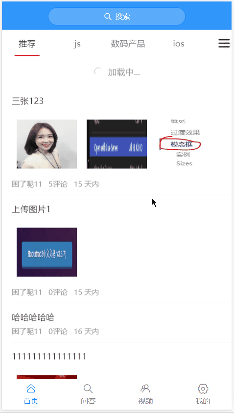
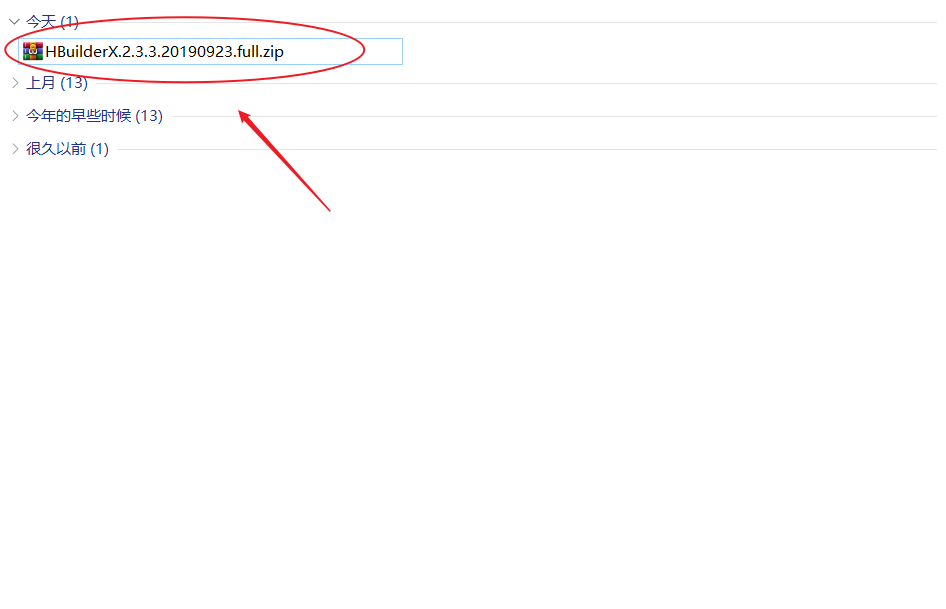

# 项目初始化

## 使用 Vue CLI 初始化项目

在命令行中输入以下命令创建 Vue 项目：

```bash
vue create topline-webapp
```

```
Vue CLI v3.11.0
? Please pick a preset:
  default (babel, eslint)
> Manually select features
```

> 选择第2种：手动选择特性，支持更多自定义选项

```
? Please pick a preset: Manually select features
? Check the features needed for your project:
 (*) Babel
 ( ) TypeScript
 ( ) Progressive Web App (PWA) Support
 (*) Router
 (*) Vuex
 (*) CSS Pre-processors
>(*) Linter / Formatter
 ( ) Unit Testing
 ( ) E2E Testing
```

> 分别选择：
>
> Babel：es6 转 es5
>
> Router：路由
>
> Vuex：容器
>
> CSS Pre-processors：CSS预处理器
>
> Linter / Formatter：代码格式校验

```
? Use history mode for router? (Requires proper server setup for index fallback in production) (Y/n) n
```

> 是否使用 history 路由模式，这里输入 n 不使用

```
? Pick a CSS pre-processor (PostCSS, Autoprefixer and CSS Modules are supported by default):

  Sass/SCSS (with dart-sass)
  Sass/SCSS (with node-sass)
> Less
  Stylus
```

> 选择 CSS 预处理器，这里选择我们熟悉的 Less

```bash
? Pick a linter / formatter config:
  ESLint with error prevention only
  ESLint + Airbnb config
> ESLint + Standard config
  ESLint + Prettier
```

> 选择校验工具，这里选择 ESLint + [Standard config](https://standardjs.com/)

```
? Pick additional lint features:
 (*) Lint on save
>(*) Lint and fix on commit
```

> 选择在什么时机下触发代码格式校验：
>
> - Lint on save：每当保存文件的时候
> - Lint and fix on commit：每当执行 `git commit` 提交的时候
>
> 这里建议两个都选上，更严谨。

```bash
? Where do you prefer placing config for Babel, PostCSS, ESLint, etc.? (Use arrow keys)
> In dedicated config files
  In package.json
```

> Babel、ESLint 等工具会有一些额外的配置文件，这里的意思是问你将这些工具相关的配置文件写到哪里：
>
> - In dedicated config files：分别保存到单独的配置文件
> - In package.json：保存到 package.json 文件中
>
> 这里讲义选择第1个，保存到单独的配置文件，这样方便我们做自定义配置。

```bash
? Save this as a preset for future projects? (y/N) n
```

> 这里是问你是否需要将刚才选择的一系列配置保存起来，然后它可以帮你记住上面的一系列选择，以便下次直接重用。
>
> 这里根据自己需要输入 y 或者 n，我这里输入 n 不需要。

```bash
✨  Creating project in C:\Users\LPZ\Desktop\topline-mweb.
�  Initializing git repository...
⚙  Installing CLI plugins. This might take a while...

[     .............] | loadDep:unpipe: s
```

> 向导配置结束，开始装包。
>
> 安装包的时间可能较长，请耐心等待......

```bash
added 132 packages from 118 contributors, updated 2 packages and moved 9 packages in 20.506s ⚓  Running completion hooks...

�  Generating README.md...

�  Successfully created project topline-mweb.
�  Get started with the following commands:

 $ cd topline-mweb
 $ npm run serve
```

> 安装结束，命令提示你项目创建成功，按照命令行的提示在终端中分别输入：
>
> - `cd 你的项目`
> - `npm run serve`

```bash
 DONE  Compiled successfully in 7527ms                                           


  App running at:
  - Local:   http://localhost:8080/
  - Network: http://192.168.10.216:8080/

  Note that the development build is not optimized.
  To create a production build, run npm run build.
  

```

> 启动成功，命令行中输出项目的 http 访问地址。
>
> 打开浏览器，输入其中任何一个地址进行访问。


如果能看到该页面，恭喜你，项目创建成功了。

## 目录结构

项目创建好以后，下面我们来了解一下目录结构的含义：

```
├── babel.config.js	babel配置文件
├── package-lock.json	npm相关文件
├── package.json	npm相关文件
├── postcss.config.js	postcss配置文件
├── public	静态资源托管目录
│   ├── favicon.ico
│   └── index.html
├── README.md	项目说明文件
└── src	源码
    ├── App.vue	根组件
    ├── assets	资源目录
    ├── components	组件目录
    ├── main.js	入口文件
    ├── router.js	路由模块
    ├── store.js	vuex容器模块
    └── views  视图组件目录
```

## 加入 Git 版本管理

几个好处：

- 代码备份
- 多人协作
- 历史记录


1、创建远程仓库（github、码云、coding。。。）

2、将本地仓库推到线上

正常的话我们需要创建仓库并提交历史记录：

```bash
git init
git add 文件
git commit "提交日志"
```


Vue CLI 生成的项目默认完成了Git仓库的初始化和一次提交，所以这里只需要 push 到线上即可。

```bash
git remote add 远程仓库地址
git push -u origin master
```


之后如果需要提交，则直接：

```bash
git add .
git commit -m "提交日志"
git push
```


## 调整目录结构

默认生成的目录结构不满足我们的开发需求，所以这里需要做一些自定义改动。

这里主要就是下面的两个工作：

- 删除初始化的默认文件
- 新增调整我们需要的目录结构

```
├── babel.config.js	babel配置文件
├── package-lock.json	npm相关文件
├── package.json	npm相关文件
├── postcss.config.js	postcss配置文件
├── public	静态资源托管目录
│   ├── favicon.ico
│   └── index.html
├── README.md	项目说明文件
└── src	源码
    ├── api	请求接口封装模块
    ├── App.vue	根组件
    ├── assets	资源目录
    ├── components	组件目录
    ├── main.js	入口文件
    ├── router	路由模块
    ├── store	 Vuex容器模块
    ├── styles 样式目录
    ├── utils  工具模块目录
    └── views  视图组件目录
```

在 src 中创建以下目录：

- api
  - 存储请求函数模块
- router
  - 路由文件模块
- store
  - Vuex 容器模块
- styles
  - 样式文件模块
- utils
  - 工具函数模块


将 `App.vue` 修改为：

```html
<template>
  <div id="app">
    <router-view />
  </div>
</template>

<script></script>

<style></style>

```

删除默认生成的 `src/router.js`，然后创建 `src/router/index.js` 并写入以下内容：

```js
import Vue from 'vue'
import VueRouter from 'vue-router'

Vue.use(VueRouter)

const router = new VueRouter({
  // 配置路由表
  routes: []
})

export default router

```

删除 `src/store.js`，然后创建 `src/store/index.js` 并写入：

```js
import Vue from 'vue'
import Vuex from 'vuex'

Vue.use(Vuex)

export default new Vuex.Store({
  state: {

  },
  mutations: {

  },
  actions: {

  }
})

```

删除默认生成的一些文件：

- components/HelloWorld.vue
- views/Home.vue
- views/About.vue
- assets/logo.png


Git 只能管理文件，对于空目录不会进行版本管理，所以建议在空目录中添加一个 `.gitkeep` 空文件以保持提交历史中的目录结构。


调整之后的目录结构如下：


最后，让我们来提交一下：

```bash
git add .
git commit -m "项目初始化-调整目录结构"

git push
```


## 导入 Vant

> 参考：
>
> - https://youzan.github.io/vant/#/zh-CN/quickstart

基于 Vue.js 的移动端组件库有很多，在官方的 [awesome](https://github.com/vuejs/awesome-vue#mobile) 中也推荐了一些，在我们的项目中使用的是有赞开发的 [Vant](https://github.com/youzan/vant)。

全部引入

- 好处：使用方便
- 缺点：打包体积大

按需引入（建议）

- 好处：打包体积小
- 缺点：相对于全部引入要稍微麻烦一些


将 Vant 导入项目中，推荐使用官网提供的自动按需引入组件的方式。

下面是具体操作步骤。

一、安装 Vant

```bash
npm i vant
```


二、[配置按需引入 Vant 组件](https://youzan.github.io/vant/#/zh-CN/quickstart#fang-shi-yi.-zi-dong-an-xu-yin-ru-zu-jian-tui-jian)

1、安装依赖

```bash
npm i babel-plugin-import -D
```

2、然后将 `babel.config.js` 中修改为

```js
module.exports = {
  presets: [
    '@vue/app'
  ],
+  plugins: [
+    ['import', {
+      libraryName: 'vant',
+      libraryDirectory: 'es',
+      style: true
+    }, 'vant']
+  ]
}

```

配置完毕，最好重启一下。


三、注册使用

注册组件：

```bash
// 按需注册 Vant 组件
import {
  Button,
  Cell,
  CellGroup
} from 'vant'

Vue
  .use(Button)
  .use(Cell)
  .use(CellGroup)
```

测试使用：

```html
<van-button type="default">默认按钮</van-button>
<van-button type="primary">主要按钮</van-button>
<van-button type="info">信息按钮</van-button>
<van-button type="warning">警告按钮</van-button>
<van-button type="danger">危险按钮</van-button>
```


> 提示：之后无论使用哪个组件，一定要记得：**先注册，后使用**。

## 配置 REM 适配（后面讲）

二、使用 [postcss-pxtorem](https://github.com/cuth/postcss-pxtorem) 将 px 转为 rem

安装：

```bash
# yarn add -D postcss-pxtorem
npm install postcss-pxtorem --save-dev
```

然后将项目中的 `postcss.config.js` 修改为：

```js {5-11}
module.exports = {
  plugins: {
    'autoprefixer': {
      browsers: ['Android >= 4.0', 'iOS >= 7']
    },
    'postcss-pxtorem': {
      rootValue: 37.5,
      propList: ['*']
    }
  }
}
```

在浏览器中审查元素的样式查看是否已转换为 rem。

> 注意：
>
> - **只能转换单独的 .css|.less|.scss 之类的文件、.vue 文件中的 style 中的 px**
> - **不能转换行内样式中的 px**


一、使用 [amfe-flexible](https://github.com/amfe/lib-flexible) 动态设置 html 标签的字体大小

安装：

```bash
npm i amfe-flexible
```

然后在 `main.js` 中新增：

```js
...
import 'amfe-flexible/index.js'

```

测试：在浏览器中切换不同的手机设备尺寸，观察 html 标签 `font-size` 的变化。


## 封装 axios 请求函数

这里我们直接把 axios 封装为一个请求模块，在需要的时候直接加载使用。

1、安装 axios

```bash
npm i axios
```


2、创建 `utils/request.js` 并写入以下代码

```js
import axios from 'axios'

// axios.create 方法
// 建议使用 create 方式，我们可以拥有
// 说白了就是复制了一个 axios，拥有和 axios 完全一样的功能，但是配置可以不一样
// 例如我们可以创建多个请求对象，而不同的请求对象拥有不同的 baseURL
// 例如我们可以有 a 请求的拦截器，也可以专门定制 b 请求的拦截器
const request = axios.create({
  baseURL: 'http://ttapi.research.itcast.cn'
})

export default request

```

调用测试。

## 处理后端返回数据超出 JS 安全整数范围问题

> 注意：该项目所使用的后端接口数据中包含超出 JavaScript 安全整数范围的数字，所以也需要像之前的 PC 端项目一样使用 [json-bigint](https://github.com/sidorares/json-bigint) 将后端返回数据处理一下才能正确使用。

1、安装依赖：

```bash
npm i json-bigint
```


2、在 `utils/request.js` 中新增：

```js
/**
 * axios 请求相关操作封装到这里
 */
import axios from 'axios'
+ import jsonBig from 'json-bigint'

const request = axios.create({
  // 请求的基础路径
  baseURL: 'http://ttapi.research.itcast.cn/'
})

/**
 * 配置处理后端返回数据中超出 js 安全整数范围问题
 */
+ request.defaults.transformResponse = [function (data) {
+  return data ? jsonBig.parse(data) : {} // 换了一个转化方法 使得 计算更精确 保证id不失真
+ }]

/**
 * 请求拦截器
 */

/**
* 响应拦截器
*/

// 导出这个请求对象，哪里需要发请求，哪里就加载使用
export default request

```

最后请求测试。

## 补充：关于 npm 和 yarn

npm 和 yarn 都是管理第三方包的。

yarn 相比 npm 稍微快一些。

下面是npm 和 yarn 常用命令对照表：

```bash
# yarn init
npm init

# yarn add 包名
npm install 包名

# yarn install 或者直接 yarn
npm install

# yarn add -D 包名
npm install -D 包名

# yarn remove 包名
npm uninstall 包名

# yarn global remove 包名
npm uninstall --global 包名

# yarn global add 包名
npm install --global 包名
```

在一个项目中，使用哪个包管理工具那你就自始至终都使用这个工具，千万不要混用，否则会导致文件丢失。

如果你想切换项目使用的包管理工具：

1、删除 node_modules

2、删除 yarn.lock/package-lock.json

3、使用你要使用的新的包管理工具把所有依赖重新安装一遍

- yarn
- npm install

4、之后就可以正常使用了

# 登陆开始


流程：

- 创建登录组件并配置路由
- 布局
- 完成登录功能


## 准备

### 创建登录组件并配置路由


1、创建 `views/login/index.vue` 并写入以下内容：

```html
<template>
  <div class="login">登录页面</div>
</template>

<script>
export default {
  name: 'LoginIndex'
}
</script>

<style lang="less" scoped>
</style>

```

2、然后在 `router/index.js` 中配置路由表：

```js
import Vue from 'vue'
import Router from 'vue-router'
+ import Login from '@/views/login'

Vue.use(Router)

export default new Router({
  routes: [
+    {
+      name: 'login',
+      path: '/login',
+      component: Login
+    }
  ]
})

```

最后，访问 `/login` 查看是否能访问到登录页面组件。

### 页面结构


这里主要使用到三个 Vant 组件：

- [NavBar 导航栏](https://youzan.github.io/vant/#/zh-CN/nav-bar)
- [Field 输入框](https://youzan.github.io/vant/#/zh-CN/field)
- [Button 按钮](https://youzan.github.io/vant/#/zh-CN/button)

1、将登录页修改为：

```html
<template>
  <div class="login">
    <!-- 导航栏 -->
    <van-nav-bar
      title="标题"
    />
    <!-- /导航栏 -->

    <!-- 登录表单 -->
    <van-cell-group>
      <van-field
        required
        clearable
        label="手机号"
        placeholder="请输入手机号"
      />

      <van-field
        type="password"
        label="验证码"
        placeholder="请输入验证码"
        required
      />
    </van-cell-group>
    <!-- /登录表单 -->

    <!-- 登录按钮 -->
    <div>
      <van-button type="info">登录</van-button>
    </div>
    <!-- /登录按钮 -->
  </div>
</template>

<script>
export default {
  name: 'LoginIndex'
}
</script>

<style>

</style>

```

### 样式调整


我们把设置登录页头部的样式写到全局（全局生效），因为其它页面也要使用。把非公共样式写到页面组件内部，避免和其它组件样式冲突。

下面是具体实现步骤。

一、添加全局样式

1、创建 `styles/index.less` 并写入以下内容：

```less
.van-nav-bar {
  background-color: #3196fa;
  .van-nav-bar__title {
    color: #fff;
  }
}

```

2、然后在 `main.js` 中加载使其生效：

```js
...
import './styles/index.less'
```

完了测试查看效果。

二、添加局部样式

将 `views/login/index.vue` 组件中的 style 修改为：

```css
<style lang="less" scoped>
.login {
  .btn-wrap {
    padding: 20px;
    .btn {
      width: 100%;
      background-color: #6db4fb;
      color: #fff;
    }
  }
}
</style>
```


## 实现基本登录功能


实现流程：

- 获取表单数据（绑定）
- 注册点击登录的事件
- 表单验证
- 发请求提交
- 根据请求结果做下一步处理


下面是具体的实现过程：

一、数据绑定

1、根据接口要求绑定表单数据

在登录页面组件的实例选项 data 中添加 `user` 数据字段：

```js
...
data () {
  return {
    user: {
      mobile: '',
      code: ''
    }
  }
}
```

2、在表单中使用 `v-model` 绑定对应数据：

```html
<!-- van-cell-group 仅仅是提供了一个上下外边框，能看到包裹的区域 -->
<van-cell-group>
  <van-field
+    v-model="user.mobile"
    required
    clearable
    label="手机号"
    placeholder="请输入手机号"
  />

  <van-field
+    v-model="user.code"
    type="password"
    label="验证码"
    placeholder="请输入验证码"
    required
  />
</van-cell-group>
```

最后在浏览器使用 VueDevtools 调试工具查看是否绑定成功。

二、请求提交

1、给登录按钮注册点击事件处理函数

```html
...
<van-button type="info" @click="onLogin">登录</van-button>

```


2、登录处理函数

```js
import request from '@/utils/request'

async onLogin () {
  try {
    // 请求提交表单数据
    const { data } = await request({
      method: 'POST',
      url: '/app/v1_0/authorizations',
      data: this.user
    })
    this.$toast.success('登录成功')
  } catch (err) { // 所有大于等于 400 的状态码都会进入 catch
    if (err.response && err.response.status === 400) {
      this.$toast.fail('登录失败，手机号或验证码错误')
    }
  }
}


```

## 登录中 loading 提示

文字提示：

```js
this.$toast('提示内容')

```

加载提示（永远不会关闭）：

```js
this.$toast.loading({
  mask: true,
  message: '加载中...'
})

```

成功/失败提示：

```js
this.$toast.success('提示内容')

this.$toast.fail('提示内容')

// 根据文档提示，我们可以看到这两个方法也支持自定义方式
this.$toast.success({
  一坨的选项
})

```

可以手动控制关闭的 loading：

```js
// 开启
const toast = this.$toast.loading({
  duration: 0,       // 持续展示 toast
  forbidClick: true, // 禁用背景点击
  loadingType: 'spinner',
  message: '倒计时 3 秒'
})

// 结束 loading
// 如果后面有 success、fail 之类的提示，就不需要手动关闭 loading 了
toast.clear()

```


## 封装 api 请求模块

我们建议将所有请求都封装为函数的方式来进行使用，这样做的主要目的是为了便于重用和维护。

下面是具体的实现方式：

1、创建 `api/user.js` 并写入

```js
import request from '@/utils/request'

/**
* 登录
*/
export function login (user) {
  return request({
    // method 用来指定请求方法，这是 axios 的固定 API，不能瞎写
    method: 'POST',
    // url 用来指定请求路径
    url: '/app/v1_0/authorizations',
    // data 是 axios 请求要求的字段名，用来传递请求体数据的
    data: user
  })
}


```


2、然后在登录页面中加载调用：

```js
+ import { login } from '@/api/user'

async onLogin () {
  // 表单验证

  // 验证通过，loading，请求
  const toast = this.$toast.loading({
    duration: 0, // 持续展示 toast
    forbidClick: true, // 禁用背景点击
    loadingType: 'spinner',
    message: '登录中'
  })

  try {
    // 请求提交表单数据
+    const { data } = await login(this.user)

    console.log(data)

    // 先清除 loading
    toast.clear()

    // 再提示登录成功
    this.$toast.success('登录成功')
  } catch (err) { // 所有大于等于 400 的状态码都会进入 catch
    toast.clear()
    if (err.response && err.response.status === 400) {
      this.$toast.fail('登录失败，手机号或验证码错误')
    }
  }
}

```

之后项目中所有的请求就都不要直接在组件中去直接发了，而是都采用上面的方式封装之后进行使用，这是一个建议的做法。

## 表单验证

方式一：HTML5自带的表单验证（了解即可）

```html
<!DOCTYPE html>
<html lang="en">
<head>
  <meta charset="UTF-8">
  <meta name="viewport" content="width=device-width, initial-scale=1.0">
  <meta http-equiv="X-UA-Compatible" content="ie=edge">
  <title>Document</title>
</head>
<body>
  <form action="">
    <!-- 
      required 必填项
      max
      min
      length
      email
      ....

      兼容不好，各大浏览器实现不一致
     -->
    <input type="text" required max="5">
    <input type="submit" value="提交表单">
  </form>
</body>
</html>


```


方式二：自己写，建议参考 Vue 官方 Cookbook 写的[表单校验](https://cn.vuejs.org/v2/cookbook/form-validation.html)

方式三：使用组件库内置的验证

- 例如 element 内置的验证功能

- vant 没有提供

方式四：使用专门的验证插件

- [vuelidate](https://github.com/monterail/vuelidate)
- [VeeValidate](https://github.com/baianat/vee-validate)
- ...


这里我们以使用 VeeValidate 为例。


### 安装和配置

1、安装

```bash
# yarn add vee-validate
npm install vee-validate

```


2、在 `main.js` 中

```js
..
import { ValidationProvider, ValidationObserver, extend } from 'vee-validate'
import zhCN from 'vee-validate/dist/locale/zh_CN' // 加载验证插件的语言包
import * as rules from 'vee-validate/dist/rules'

// 配置使用中文语言
for (let rule in rules) {
  extend(rule, {
    ...rules[rule], // add the rule
    message: zhCN.messages[rule] // add its message
  })
}

// 注册为全局组件
Vue.component('ValidationProvider', ValidationProvider)
Vue.component('ValidationObserver', ValidationObserver)


```

### 基本使用

在模板中为需要验证的表单字段配置验证规则：

```html
<!-- 登录表单 -->
+ <ValidationObserver ref="loginForm">
  <van-cell-group>
    <!--
      name 提示的文本
      rules 验证规则
        required 必填项
        email
        max
        ....
        参考文档：https://logaretm.github.io/vee-validate/api/rules.html#alpha

      v-slot="{ errors }" 获取校验结果数据
        errors[0] 读取校验结果的失败信息
      -->
    <!-- <ValidationProvider name="手机号" rules="required|email|max:5" v-slot="{ errors }"> -->
+    <ValidationProvider name="手机号" rules="required" v-slot="{ errors }">
      <van-field
        v-model="user.mobile"
        required
        clearable
        label="手机号"
        placeholder="请输入手机号"
+        :error-message="errors[0]"
      />
+    </ValidationProvider>

+    <ValidationProvider name="验证码" rules="required|max:6" v-slot="{ errors }">
      <van-field
        v-model="user.code"
        type="password"
        label="验证码"
        placeholder="请输入验证码"
        required
+        :error-message="errors[0]"
      />
+    </ValidationProvider>
   </van-cell-group>
+ </ValidationObserver>
<!-- /登录表单 -->

```

当表单提交的时候，调用 js 进行验证

```js {3-6}
async onLogin () {
  // 表单验证
+  const isValid = await this.$refs.loginForm.validate()

+  // 如果验证失败，阻止表单提交
+  if (!isValid) {
+    return
+  }

  ...
}

```

测试效果。


如何自定义扩展校验规则，在 `main.js` 中：

```js
// 扩展自定义校验规则
// extend('规则名称', 配置对象)
extend('phone', {
  // 验证方法，value 是需要校验的数据，返回一个布尔值，表示验证成功与否
  validate: function (value) {
    return /^1\d{10}$/.test(value)
  },
  // 错误提示消息
  message: '请输入有效的手机号码'
})

```

# Token 处理

- 什么是 Token？一个令牌，用来请求需要权限的接口用的。
- 将 token 存储到了本地存储
  - 为了在其它地方能获取
  - 防止页面刷新丢失


如何存储：

- 为了方便获取：我们建议放到 Vuex 容器中
  - 组件中无论是直接通过 js 来获取还是直接在模板中获取都非常方便
  - $store
  - 如果只是纯粹的放到本地存储，那我在使用的时候，首先读取出来，然后放到 data 中，然后才能在模板中使用
- 为了防止刷新丢失：我们会把数据存储到本地存储


## 使用 Vuex 容器存储 token

1、在 `store/index.js` 中：

```js
import Vue from 'vue'
import Vuex from 'vuex'

Vue.use(Vuex)

export default new Vuex.Store({
  state: {
+    user: null
  },
  mutations: {
+    setUser (state, user) {
+      state.user = user
+    }
  },
  actions: {
  }
})

```

2、登录成功以后将数据存储到容器中

```js
async onLogin () {
  ...
  
  // 登录成功，将数据存储到容器中
  this.$store.commit('setUser', data.data)
}
```


## 持久化 token

Vuex 容器中的数据只是为了方便在其他任何地方能方便的获取登录状态数据，但是页面刷新还是会丢失数据状态，所以我们还要把数据进行持久化中以防止页面刷新丢失状态的问题。

前端持久化常见的方式就是：

- 本地存储
- Cookie

这里我们以使用本地存储持久化用户状态为例。

为了方便，这里先封装一个用于操作本地存储的存储模块。

1、创建 `src/utils/storage.js` 并写入以下内容

```js
export const getItem = name => {
  return JSON.parse(window.localStorage.getItem(name))
}

export const setItem = (name, data) => {
  return window.localStorage.setItem(name, JSON.stringify(data))
}

export const removeItem = name => {
  window.localStorage.removeItem(name)
}

```


2、然后在登录成功以后，将 token 存储到本地存储

```js
+ import { setItem } from '@/utils/storage'

async onLogin () {
  ...
  
  // 登录成功，将数据存储到容器中
  this.$store.commit('setUser', data.data)
  
  // 为了防止页面刷新数据丢失，将数据存储到本地存储
+  setItem('user', data.data)
}
```


3、最后，在容器中使用本地存储中的数据进行初始化

```js
import Vue from 'vue'
import Vuex from 'vuex'
+ import { getItem } from '@/utils/storage'

Vue.use(Vuex)

export default new Vuex.Store({
  state: {
    // 初始化的时候从本地存储获取数据，没有就是 null
+    user: getItem('user')
  },
  mutations: {
    setUser (state, user) {
      state.user = user
    }
  },
  actions: {

  }
})

```


## 使用请求拦截器统一添加 token

很多接口都需要提供 token 才能访问。

方式一：在每次请求的时候手动添加（麻烦）

```js
axios({
  method: '',
  url: '',
  headers: {
  	token数据
  }
})
```

方式二：使用请求拦截器统一添加（推荐，更方便）

在 `utils/request.js` 中添加拦截器统一设置 token：

```js
...
// 非组件模块访问容器直接加载即可
// 这里得到的 store 和组件中访问的 this.$store 是一个东西
import store from '@/store'

/**
 * 请求拦截器，请求到达后台之前拦截
 */
request.interceptors.request.use(function (config) {
  // 在发起请求请做一些业务处理
  // config是要发送请求的配置信息
  const user = store.state.user
  if (user) {
    // Authorization 是后端要求的名字，不能瞎写
    // 数据值 "Bearer空格token" 也是后端要求的数据格式，不能瞎写
    // 千万!千万!千万!注意，Bearer 和 token 之间的空格不能少
    // 什么意义？这是后端要求的，我们决定不了。
    config.headers['Authorization'] = `Bearer ${user.token}` // 统一注入token 到headers属性 因为所有接口要求的token格式是一样的
  }
  return config
}, function (error) {
  // 对请求失败做处理
  return Promise.reject(error)
})

```


## 处理 token 过期（后面讲）


# 首页（上）


## 准备

### 创建页面组件并配置路由

#### tabBar 视图组件


这里主要使用到的 Vant 组件：

- [Tabbar 标签栏](https://youzan.github.io/vant/#/zh-CN/tabbar)

1、创建 `views/tabbar/index.vue` 并写入以下代码

```html
<template>
  <div>
    <!-- 路由出口 -->
    <router-view />
    <!-- /路由出口 -->

    <!-- 底部导航栏 -->
    <van-tabbar>
      <van-tabbar-item icon="home-o">首页</van-tabbar-item>
      <van-tabbar-item icon="search">问答</van-tabbar-item>
      <van-tabbar-item icon="friends-o">视频</van-tabbar-item>
      <van-tabbar-item icon="setting-o">我的</van-tabbar-item>
    </van-tabbar>
    <!-- /底部导航栏 -->
  </div>
</template>

<script>
export default {
  name: 'TabbarIndex'
}

</script>

<style>

</style>

```

2、然后在 `router/index.js` 中配置路由表：

```js
import Vue from 'vue'
import Router from 'vue-router'
import Login from '@/views/login'
+ import Tabbar from '@/views/tabbar'

Vue.use(Router)

export default new Router({
+   routes: [
+    {
+      path: '/',
+      component: Tabbar,
+      children: []
+    },
    {
      name: 'login',
      path: '/login',
      component: Login
    }
  ]
})

```

访问 `/` 进行测试。

#### 首页视图组件


1、创建 `views/home/index.vue` 组件文件并写入以下代码

```html
<template>
  <div class="home">首页</div>
</template>

<script>
export default {
  name: 'HomeIndex'
}
</script>

<style lang="less" scoped>
</style>

```

2、然后在 `router/index.js` 中配置路由表

```js
import Vue from 'vue'
import Router from 'vue-router'
import login from '@/views/login'
import tabbar from '@/views/tabbar'
+ import Home from '@/views/home'

Vue.use(Router)

export default new Router({
  routes: [
    {
      path: '/',
      component: tabbar,
      children: [
+        {
+          name: 'home',
+          path: '', // 默认子路由
+          component: Home
+        }
      ]
    },
    {
      name: 'login',
      path: '/login',
      component: Login
    }
  ]
})

```


最后访问 `/` 测试。

### 页面结构

这里需要使用到的组件：

- [NavBar 导航栏](https://youzan.github.io/vant/#/zh-CN/nav-bar)
- [Tab 标签页](https://youzan.github.io/vant/#/zh-CN/tab)
- [PullRefresh 下拉刷新](https://youzan.github.io/vant/#/zh-CN/pull-refresh)
  - 做这个功能的时候再来写
- [List 列表](https://youzan.github.io/vant/#/zh-CN/list)


```html
<template>
  <div class="home">
    <!-- 导航栏 -->
    <van-nav-bar
      title="首页"
    />
    <!-- /导航栏 -->

    <!-- 频道列表 -->
    <van-tabs v-model="active">
      <van-tab title="标签 1">
        <!-- 文章列表 -->
        <van-list
          v-model="loading"
          :finished="finished"
          finished-text="没有更多了"
          @load="onLoad"
        >
          <van-cell
            v-for="item in list"
            :key="item"
            :title="item"
          />
        </van-list>
        <!-- /文章列表 -->
      </van-tab>
      <van-tab title="标签 2">内容 2</van-tab>
      <van-tab title="标签 3">内容 3</van-tab>
      <van-tab title="标签 4">内容 4</van-tab>
    </van-tabs>
    <!-- /频道列表 -->
  </div>
</template>

<script>
export default {
  name: 'HomeIndex',
  data () {
    return {
      active: 0,
      list: [],
      loading: false,
      finished: false
    }
  },

  methods: {
    onLoad () {
      // 异步更新数据
      setTimeout(() => {
        for (let i = 0; i < 10; i++) {
          this.list.push(this.list.length + 1)
        }
        // 加载状态结束
        this.loading = false

        // 数据全部加载完成
        if (this.list.length >= 40) {
          this.finished = true
        }
      }, 500)
    }
  }
}
</script>

<style>

</style>

```


### 样式调整（放到本章节最后）

## 展示频道列表


1、封装请求接口，创建 `api/channel.js` 并写入

```js
/**
 * 频道相关接口模块
 */
import request from '@/utils/request'

/**
 * 获取用户默认推荐的频道列表
 */
export function getDefaultChannels () {
  return request({
    method: 'GET',
    url: '/app/v1_0/user/channels'
  })
}
```

2、在首页中请求调用

```js
+ import { getDefaultChannels } from '@/api/channel'

export default {
  name: 'HomeIndex',
  data () {
    return {
      active: 0,
      list: [],
      loading: false,
      finished: false,
+      channels: [] // 频道列表
    }
  },

+  created () {
+    this.loadChannels()
+  },

  methods: {
    onLoad () {
      // 异步更新数据
      setTimeout(() => {
        for (let i = 0; i < 10; i++) {
          this.list.push(this.list.length + 1)
        }
        // 加载状态结束
        this.loading = false

        // 数据全部加载完成
        if (this.list.length >= 40) {
          this.finished = true
        }
      }, 500)
    },

+    async loadChannels () {
+      const { data } = await getDefaultChannels()
+      this.channels = data.data.channels
+    }
  }
}
```

> 提示：代码写完以后在浏览器的调试工具中查看是否能够加载获取到 channels 数据，确保能正常获取到数据以后，再进行模板绑定。

3、拿到数据，渲染模板

```html
...
<!-- 频道列表 -->
<van-tabs v-model="active">
  <van-tab
+    :title="channel.name"
+    v-for="channel in channels"
+    :key="channel.id"
  >
    <!-- 文章列表 -->
    ...
    <!-- 文章列表 -->
  </van-tab>
</van-tabs>
<!-- /频道列表 -->
...
```

## 展示文章列表

### 使用模拟数据


频道是遍历出来的，频道中的文章列表当然也是遍历出来的。所以要搞清楚的几点是：

- 每个频道都有一个文章列表组件（遍历出来的）
- 不同的频道应该拥有不同的数据状态
  - 频道的文章列表
  - 频道是否加载结束
  - 频道是否正在 loading 加载中

```
每个频道都有一份儿自己的文章列表数据：

[
  频道a: {
    id: xx,
    name: 'xxxx',
    文章列表: [],
    finished: false,
    loading: false
  },
  频道b: {
    id: xx,
    name: 'xxxx',
    文章列表: [],
    finished: false,
    loading: false
  }
]

查看频道a：
  - 请求获取频道a 的文章列表
  - 将数据添加到 频道a.文章列表中

查看频道b:
  - 请求获取频道b 的文章列表
  - 将数据添加到 频道b.文章列表中

```


1、所以我们首先要将数据进行改造，为每个频道添加自定义数据：文章列表、loading状态、finished 结束状态

```js
async loadChannels () {
  const { data } = await getDefaultChannels()
  const channels = data.data.channels
+  channels.forEach(channel => {
+    channel.articles = [] // 存储频道的文章列表
+    channel.finished = false // 存储频道的加载结束状态
+    channel.loading = false // 存储频道的加载更多的 loading 状态
+  })
  this.channels = channels
}

```

2、然后在让文章列表绑定每个频道对应的数据

```html
<van-list
+  v-model="channel.loading" // 该频道的 loading 加载状态
+  :finished="channel.finished" // 该频道的 finished 结束状态
  finished-text="没有更多了"
  @load="onLoad"
>
  <!-- 具体的内容 -->
  <van-cell
+    v-for="item in channel.articles" // 该频道的文章列表
    :key="item"
    :title="item"
  />
</van-list>

```

3、最后将 `onLoad` 函数修改为

```js
onLoad () {
  // 当前激活的频道对象
  const activeChannel = this.channels[this.active]
  
  // 1. 请求获取数据
  setTimeout(() => {
    for (let i = 0; i < 10; i++) {
      // 2. 将数据添加到 当前频道.articles 中
      activeChannel.articles.push(activeChannel.articles.length + 1)
    }

    // 3. 结束本次 loading
    activeChannel.loading = false

    // 4. 判断数据是否已全部加载结束，如果没有数据了，将 finish 设置为 true
    if (activeChannel.articles.length >= 40) {
      activeChannel.finished = true
    }
  }, 500)
},

```

最后测试结果。

### 使用真实数据


1、封装接口：创建 `api/article.js` 模块并写入以下代码

```js
/**
 * 文章接口相关请求模块
 */
import request from '@/utils/request'

/**
 * 获取文章列表
 */
export function getArticles (params) {
  return request({
    method: 'GET',
    url: '/app/v1_1/articles',
    params
  })
}


```


2、然后在首页中列表组件 `onload` 的时候请求加载文章列表

```js
import { getDefaultChannels } from '@/api/channel'
+ import { getArticles } from '@/api/article'

export default {
  name: 'HomeIndex',
  data () {
    return {
      active: 0,
      channels: [] // 频道列表
    }
  },

  created () {
    this.loadChannels()
  },

  methods: {
+++    async onLoad () {
      // 获取当期激活的频道对象
      const activeChannel = this.channels[this.active]

      // 1. 请求获取数据
      const { data } = await getArticles({
        // 注意：channel_id、timestamp、with_top 都是后端要求指定的数据字段名称，不能随便写
        channel_id: activeChannel.id, // 频道ID
        // a: 3 b: 2
        // 4    3
        // 这里的这个时间戳就好比当前频道下一页的页码
        timestamp: activeChannel.timestamp || Date.now(), // 时间戳，请求新的推荐数据传当前的时间戳，请求历史推荐传指定的时间戳
        with_top: 1 // 是否包含置顶，进入页面第一次请求时要包含置顶文章，1-包含置顶，0-不包含
      })

      // 2. 将数据添加到当前频道.articles中
      // activeChannel.articles = activeChannel.articles.concat(data.data.results)
      activeChannel.articles.push(...data.data.results)

      // 3. 结束当前频道.loging = false
      activeChannel.loading = false

      // 4. 如果还有下一页数据
      if (data.data.pre_timestamp) {
        // 更新获取下一页数据的页码时间戳
        activeChannel.timestamp = data.data.pre_timestamp
      } else {
        // 如果没有下一页数据了，就意味着后面没有数据了
        activeChannel.finished = true
      }
    },

    async loadChannels () {
      const { data } = await getDefaultChannels()
      const channels = data.data.channels
      channels.forEach(channel => {
        channel.articles = [] // 存储频道的文章列表
        channel.finished = false // 存储频道的加载结束状态
        channel.loading = false // 存储频道的加载更多的 loading 状态
+        channel.timestamp = null // 存储获取频道下一页的时间戳
      })
      this.channels = channels
    }
  }
}

```

3、将数据绑定到模板中展示

```html
<van-list
  v-model="channel.loading"
  :finished="channel.finished"
  finished-text="没有更多了"
  @load="onLoad"
  >
  <!-- 具体的内容 -->
  <!-- 
	v-for 中的 key 必须是字符串或者数字，不能是数组或对象
	-->
  <van-cell
    v-for="(article, index) in channel.articles"
    :key="index"
    :title="article.title"
  />
</van-list>

```

最终完成，测试结果。

### 下拉刷新



需求：用户在文章列表中下拉页面，刷新文章列表数据。

- 注册下拉刷新事件（组件）的处理函数
- 发送请求获取文章列表数据
- 把获取到的数据添加到当前频道的文章列表的顶部
- 提示用户刷新成功！

1、为每个频道数据添加保存频道的下拉刷新状态

```js
/**
 * 加载频道列表
 */
async loadChannels () {
  const { data } = await getDefaultChannels()
  const channels = data.data.channels
  channels.forEach(channel => {
    channel.articles = [] // 存储频道的文章列表
    channel.finished = false // 存储频道的加载结束状态
    channel.loading = false // 存储频道的加载更多的 loading 状态
    channel.timestamp = null // 存储获取频道下一页的时间戳
+    channel.isPullDownLoading = false // 存储频道的下拉刷新 loading 状态
  })
  this.channels = channels
},

```

2、使用下拉刷新组件包裹文章列表

```html
<van-pull-refresh v-model="channel.isPullDownLoading" @refresh="onRefresh">
  ...
  文章列表
  ...
</van-pull-refresh>

```

3、在 `onRefresh` 下拉刷新处理函数中请求加载数据

```js
/**
 * 下拉刷新
 */
async onRefresh () {
  // 获取当期激活的频道对象
  const activeChannel = this.channels[this.active]

  // 1. 请求获取最新推荐的文章列表
  const { data } = await getArticles({
    channel_id: activeChannel.id,
    timestamp: Date.now(), // 下拉刷新永远都是在获取最新推荐的文章列表，所以传递当前最新时间戳
    with_top: 1
  })

  // 2. 将数据添加到文章列表顶部
  activeChannel.articles.unshift(...data.data.results)

  // 3. 关闭下拉刷新的 loading 状态
  activeChannel.isPullDownLoading = false

  // 4. 提示
  this.$toast('刷新成功')
}

```

最后测试结果。

### 展示详细的列表项信息


这里主要使用到的 Vant 组件：

- [Grid 宫格](https://youzan.github.io/vant/#/zh-CN/grid)
- [Image 图片](https://youzan.github.io/vant/#/zh-CN/image)

在模板中新增：

```html
<van-cell
  v-for="(article, index) in channel.articles"
  :key="index"
  :title="article.title"
  >
+  <div slot="label">
+    <van-grid :border="false" :column-num="3">
+      <van-grid-item v-for="(img, index) in article.cover.images" :key="index">
+        <van-image height="80" :src="img" />
+      </van-grid-item>
+    </van-grid>
+    <div class="article-info">
+      <div class="meta">
+        <span>{{ article.aut_name }}</span>
+        <span>{{ article.comm_count }}评论</span>
+        <span>{{ article.pubdate }}</span>
+      </div>
+      <van-icon name="close" />
+    </div>
+  </div>
</van-cell>

```

然后在 style 中设置一下样式：

```css
...
.home {
  .article-info {
    display: flex;
    align-items: center;
    justify-content: space-between;
    .meta span {
      margin-right: 10px;
    }
  }
}


```

### 图片懒加载

Vant 提供了[Lazyload](https://youzan.github.io/vant/#/zh-CN/lazyload)组件，可以很方便的实现图片懒加载的功能。这里我们可以将文章列表中的文章图片配置为图片懒加载的方式，增强用户体验。

1、注册组件

```js
import Vue from 'vue';
import { Lazyload } from 'vant';

// options 为可选参数，无则不传
Vue.use(Lazyload, options);

```

2、使用

如果是普通的 img 标签，则将原来的 `src` 配置为 `v-lazy` 即可：

```html


```

如果使用的是 Vant 提供的图片组件，则直接配置 `lazy-load` 属性即可：

```html
<van-image
  width="100"
  height="100"
  lazy-load
  src="https://img.yzcdn.cn/vant/cat.jpeg"
/>

```


### 相对时间处理

[moment](https://github.com/moment/moment) 和 [dayjs](https://github.com/iamkun/dayjs) 都可以处理相对时间，这里我们以使用 dayjs 为例。

- moment 功能更强大一些
- dayjs 的设计是参照的 moment，所以无论你使用哪个一个，上手另一个都一样
- dayjs 好处是比 moment 小很多

1、安装依赖

```bash
npm i dayjs

```

2、创建 `utils/date.js` 并写入以下代码

```js
/**
 * 专门处理时间的工具模块
 */
import dayjs from 'dayjs'
import 'dayjs/locale/zh-cn'
import rTime from 'dayjs/plugin/relativeTime'
import Vue from 'vue'

dayjs.extend(rTime)

dayjs.locale('zh-cn')

Vue.filter('relativeTime', value => {
  return dayjs().from(dayjs(value))
})

// 我们把处理时间的代码都封装成一个一个的小函数，然后在需要的时候加载调用
// export xxx
// export xxx
// export xxx
// export xxx
// export xxx


```


3、然后在模板中使用

```html
...
<!--
	过滤器的本质作用：就是为模板提供一个函数进行调用
	过滤器是函数，使用过滤器就是在调用函数
	| 前面的会作为参数传递给过滤器函数
	过滤器函数的返回值将渲染到这里
-->
<span>{{ article.pubdate | relativeTime }}</span>

```

最后在浏览器中查看结果。


## 样式调整

频道列表固定定位：

1、让头部导航栏固定定位，只需要为导航栏组件添加一个 fixed 属性即可：

```html
<van-nav-bar title="首页" fixed />

```

2、让频道列表固定定位

```css
<style lang="less" scoped>
.home {
	.van-tabs /deep/ .van-tabs__wrap--scrollable {
    position: fixed;
    top: 46px;
    left: 0;
    right: 16px;
    z-index: 2;
  }

  .van-tabs /deep/ .van-tabs__content {
    margin-top: 90px;
  }
}
</style>

```

[关于作用域样式的说明](https://vue-loader.vuejs.org/zh/guide/scoped-css.html)：

- 如果没有 scoped，样式会作用到全局

- 当 `<style>` 标签有 `scoped` 属性时，它的 CSS 只作用于当前组件中的元素

- 使用 `scoped` 后，父组件的样式将不会渗透到子组件中。不过一个子组件的根节点会同时受其父组件的 scoped CSS 和子组件的 scoped CSS 的影响。这样设计是为了让父组件可以从布局的角度出发，调整其子组件根元素的样式。

- 如果你希望 `scoped` 样式中的一个选择器能够作用得“更深”，例如影响子组件，你可以使用 `>>>` 操作符：

  ```html
  <style scoped>
  .a >>> .b { /* ... */ }
  </style>
  
  ```

  上述代码将会编译成：

  ```css
  .a[data-v-f3f3eg9] .b { /* ... */ }
  
  ```

  有些像 Sass 之类的预处理器无法正确解析 `>>>`。这种情况下你可以使用 `/deep/` 或 `::v-deep` 操作符取而代之——两者都是 `>>>` 的别名，同样可以正常工作。


示例：

组件a：

```html
<template>
  <div id="app">
    <p>roo hello</p>
    <p>root world</p>
    <!-- <router-view /> -->
    <Foo />
    <div class="box">
      <p>root hello</p>
      <p>root world</p>
    </div>
  </div>
</template>

<script>
import Foo from '@/components/Foo'

export default {
  name: 'App',
  components: {
    Foo
  }
}
</script>

<!--
  关于组件样式的作用域问题
  在具有作用域样式的组件中，依然可以设置子组件根节点的样式
  如果需要在带有作用域样式的组件中想让样式作用的更深，则使用 /deep/ 这个语法。
  /deep/ 是在 .vue 文件中特定的语法，非 CSS 标准语法
  参考文档：
-->
<style scoped>
/* p {
  color: red;
} */

.box {
  color: red;
}

/* .p2 {
  color: blue;
} */

.box /deep/ .p2 {
  color: blue;
}
</style>


```

组件b：

```html
<template>
  <div class="box">
    <p>foo hello</p>
    <p class="p2">foo world</p>
  </div>

  <!-- <div>
    <div class="box">
      <p>foo hello</p>
      <p>foo world</p>
    </div>
  </div> -->
</template>

<script>
export default {

}
</script>

<style>

</style>


```

# 首页（下）


## 频道弹窗

### 弹窗组件

1、在首页中添加弹层组件用来展示频道管理

```html
<!-- 编辑频道 -->
<van-popup
  v-model="isChannelEditShow"
  position="bottom"
  :style="{ height: '95%' }"
  round
/>
<!-- /编辑频道 -->

```

2、然后在 `data `中添加一个数据用来控制弹窗的显示和隐藏

```js
data () {
  return {
    ...
    isChannelEditShow: true // 这里我们先设置为 true 就能看到弹窗的页面了
  }
}

```

测试查看结果。


### 点击面包按钮展示频道弹窗

在 `views/home/index.vue` 中添加按钮模板：

```html
<!-- 频道列表 -->
<van-tabs v-model="active">
  ...
  <!-- 面包按钮 -->
  <div slot="nav-right" class="wap-nav" @click="isChannelEditShow = true">
    <van-icon name="wap-nav" size="24" />
  </div>
  <!-- /面包按钮 -->
</van-tabs>
<!-- /频道列表 -->

```

> 注意：我们这里是把面包按钮通过 van-tabs 组件的 nav-right 插槽插入进去的。

别忘了给它设置一下样式，定位到右侧不动：

```css
.wap-nav {
  position: sticky;
  right: 0;
  display: flex;
  align-items: center;
  background-color: #fff;
  opacity: 0.8;
}

```

测试查看结果。


## 组件布局


1、在频道管理的弹层中添加

```html
<!-- 频道管理 -->
<van-popup
  v-model="isChannelShow"
  round
  position="bottom"
  :style="{ height: '95%' }"
  closeable
  close-icon-position="top-left"
>
  <div class="channel-container">
    <van-cell title="我的频道" :border="false">
      <van-button type="danger" size="mini">编辑</van-button>
    </van-cell>
    <van-grid :gutter="10">
      <van-grid-item
        v-for="value in 8"
        :key="value"
        text="文字"
      />
    </van-grid>

    <van-cell title="推荐频道" :border="false" />
    <van-grid :gutter="10">
      <van-grid-item
        v-for="value in 8"
        :key="value"
        text="文字"
      />
    </van-grid>
  </div>
</van-popup>
<!-- /频道管理 -->

```

别忘了添加一个样式：

```css
.home {
  ...
+  .channel-container {
+    padding-top: 30px;
+  }
}

```


## 展示我的频道


直接在我的频道中遍历 `channels` 数据就可以了。

```html
<van-cell title="我的频道" :border="false">
  <van-button type="danger" size="mini">编辑</van-button>
</van-cell>
<van-grid :gutter="10">
  <van-grid-item
+    v-for="(channel, index) in channels"
+    :key="index"
+    :text="channel.name"
  />
</van-grid>

```


## 展示推荐频道列表


思路：`所有频道列表 - 我的频道 = 剩余的频道`。

实现过程所以一共分为两大步：

- 获取所有频道
- 获取剩余频道


一、获取所有频道

1、在 `api/channel.js` 中新增

```js
/**
 * 获取所有频道列表
 */
export function getAllChannels () {
  return request({
    method: 'GET',
    url: '/app/v1_0/channels'
  })
}

```

2、然后在首页组件中

```js
...
import { getUserOrDefaultChannels, getAllChannels } from '@/api/channel'

export default {
  name: 'HomeIndex',
  data () {
    return {
      ...
+      allChannels: [] // 存储所有频道列表
    }
  },

  created () {
    this.loadUserOrDefaultChannels()
+    this.loadAllChannels()
  },

  methods: {
    // 原来的 loadAllChannels 改名为 loadUserOrDefaultChannels
    async loadUserOrDefaultChannels () {
      。。。
    },

    /**
     * 获取所有频道
     */
+    async loadAllChannels () {
+      const { data } = await getAllChannels()
+      this.allChannels = data.data.channels
+    }
  }
}


```

最后回到浏览器中测试结果。


二、处理获取展示剩余频道

1、封装一个计算属性用来获取剩余频道

```js
computed: {
  /**
   * 获取推荐频道列表
   */
  recommondChannels () {
    const arr = []
    // 遍历所有频道
    this.allChannels.forEach(channel => {
      // 判断 channel 是否存在我的频道中
      // 如果不存在，就证明它是剩余推荐的频道

      // 数组的 find 方法
      // 它会遍历数组，每遍历一次，它就判定 item.id === channel.id
      // 如果 true，则停止遍历，返回满足该条件的元素
      // 如果 false，则继续遍历
      // 如果直到遍历结束都没有找到符合 item.id === channel.id 条件的元素，则返回 undefined
      const ret = this.channels.find(item => item.id === channel.id)
      if (!ret) {
        arr.push(channel)
      }
    })

    return arr
    // return 所有频道 - 我的频道
  }
},


```

2、模板绑定进行展示

```html
<van-cell title="推荐频道" :border="false" />
<van-grid :gutter="10">
  <van-grid-item
    v-for="(channel, index) in recommondChannels"
    :key="index"
    :text="channel.name"
  />
</van-grid>


```


## 添加频道


1、给推荐频道中的频道注册点击事件

```html
<van-cell title="推荐频道" :border="false" />
<van-grid :gutter="10">
  <van-grid-item
    v-for="(channel, index) in recommondChannels"
    :key="index"
    :text="channel.name"
+    @click="onAddChannel(channel)"
  />
</van-grid>


```

2、在添加频道事件处理函数中

```js
/**
 * 添加频道
 */
onAddChannel (channel) {
  // 将频道添加到我的频道中
  this.channels.push(channel)
}


```

然后你会神奇的发现点击的那个推荐频道跑到我的频道中了，我们并没有去手动的删除点击的这个推荐频道，但是它没了！主要是因为推荐频道是通过一个计算属性获取的，计算属性中使用了 channels（我的频道）数据，所以只要我的频道中的数据发生变化，那么计算属性就会重新运算获取最新的数据。

## 频道数据持久化

1、当我们添加或是删除频道的时候都需要对频道数据进行持久化，所以为了方便，我们可以利用 Vue 中的 watch  功能来监视频道数据的变化，当数据发生改变，就把数据重新存储到本地存储

```js
import { getItem, setItem } from '@/utils/storage'

watch: {
  // 函数名就是要监视的数据成员名称
  channels (newVal) {
    setItem('channels', newVal)
  }
},


```

2、因为我们把数据持久化到了本次存储，所以我们需要在页面初始化的时候优先从本地存储来获取频道数据

```js
/**
 * 加载我的频道列表
 */
async loadChannels () {
+  let channels = []

  // 读取本地存储中的频道列表
+  const localChannels = getItem('channels')

  // 如果有本地存储的频道列表就使用本地存储的频道列表
+  if (localChannels) {
+    channels = localChannels
+  } else {
    // 如果没有本地存储的频道列表，则请求获取后台推荐的频道列表
+    const { data } = await getDefaultChannels()
+    channels = data.data.channels
+  }

  // 根据需要扩展自定义数据，用以满足我们的业务需求
  channels.forEach(channel => {
    channel.articles = [] // 存储频道的文章列表
    channel.finished = false // 存储频道的加载结束状态
    channel.loading = false // 存储频道的加载更多的 loading 状态
    channel.timestamp = null // 存储获取频道下一页的时间戳
    channel.isPullDownLoading = false // 存储频道的下拉刷新 loading 状态
  })

  // 最后把数据更新到组件中
  this.channels = channels
},


```


## 处理编辑频道按钮的切换显示


1、首先在 data 中初始化一个数据成员用来控制删除按钮的显示和隐藏

```js
data () {
  return {
    ...
    isEditShow: false
  }
}


```

2、然后在我的频道模板中

```html
<van-cell title="我的频道" :border="false">
  <van-button
    type="danger"
    size="mini"
+    @click="isEditShow = !isEditShow"
+  >{{ isEditShow ? '完成' : '编辑' }}</van-button>
</van-cell>
<van-grid :gutter="10">
  <van-grid-item
    v-for="(channel, index) in channels"
    :key="index"
    :text="channel.name"
  >
+    <van-icon v-show="isEditShow" class="close-icon" slot="icon" name="close" />
  </van-grid-item>
</van-grid>


```

别忘了给关闭按钮通过样式处理将其定位到频道项的右上角：

```css
.close-icon {
  position: absolute;
  top: -5px;
  right: -5px;
}


```

## 切换频道和删除频道


两个功能需求：

- 切换频道
- 删除频道

1、首先给我的频道中的频道项注册点击事件

```html
<van-cell title="我的频道" :border="false">
  <van-button
    type="danger"
    size="mini"
    @click="isEditShow = !isEditShow"
  >{{ isEditShow ? '完成' : '编辑' }}</van-button>
</van-cell>
<van-grid :gutter="10">
  <van-grid-item
    v-for="(channel, index) in channels"
    :key="index"
    :text="channel.name"
+    @click="onMyChannelClick(index)"
  >
    <van-icon v-show="isEditShow" class="close-icon" slot="icon" name="close" />
  </van-grid-item>
</van-grid>


```

2、在事件处理函数中

```js
/**
 * 我的频道项点击处理函数
 */
onMyChannelClick (index) {
  if (this.isEditShow) {
    // 如果是编辑状态，删除频道
    this.channels.splice(index, 1)
  } else {
    // 如果是非编辑状态，切换频道展示

    // 切换当前激活的频道
    this.active = index

    // 关闭频道弹层
    this.isChannelShow = false
  }
}


```

最后测试结果。


## 补充：关于 axios 传参

Headers 参数：

> 比较常见

```js
axios({
  method: 'xxx',
  headers: {
    名字: 值
  }
})


```

Query 参数：

> 常见于 GET 请求

```js
axios({
  method: 'xxx',
  params: {
    名字: 值
  }
})


```

Body 参数：

> 常见于 POST、PUT、PATCH 请求

```js
axios({
  method: 'xxx',
  data: {
    名字: 值
  }
})


```

路径参数：

> 文档中一般是在 url 中通过 :xxx 表示的

```
/app/v1_0/users/:target
/app/v1_0/sms/codes/:mobile
/app/v1_0/article/dislikes/:target
/app/v1_0/comment/likings/:target


```

这种参数必须手动拼接在 url 中。

```js
var userId = 3

axios({
  method: 'xxx',
  url: '/app/v1_0/users/' + userId
})


```

## 补充：关于第三方组件的插槽使用

```html
<!--
  一般在使用第三方组件的时候，它们默认给出的是最常用的功能
  如果需要自定义内容展示，那就看文档，看看人家是否支持自定义插槽
  -->
<van-cell title="单元格" value="内容" label="hello" />

<van-cell title="单元格" value="内容" label="hello">
  <button slot="title">hello</button>

  <!-- 当你没有给元素插槽起名字的时候，这个组件提供了默认插槽 -->
  <span>默认内容</span>
  <span slot="default">默认内容</span>

  <!-- 同名插槽可以插入多次 -->
  <span slot="title">world</span>
</van-cell>


```

## 功能优化：不删除推荐频道

```html
<template>
  <div class="home">
    <!-- 导航栏 -->
    <van-nav-bar title="首页" fixed />
    <!-- /导航栏 -->

    <!-- 频道列表 -->
    <!--
      v-model="active" 用来控制当前激活的频道索引
     -->
    <van-tabs v-model="active" animated swipeable>
      <!-- 面包菜单按钮 -->
      <div slot="nav-right" class="wap-nav" @click="isChannelShow = true">
        <van-icon name="wap-nav" size="24" />
      </div>
      <!-- /面包菜单按钮 -->
      <van-tab
        :title="channel.name"
        v-for="channel in channels"
        :key="channel.id"
      >
        <!-- 文章列表 -->
        <!--
          v-model="isLoading" 控制下拉刷线的 loading 状态
          @refresh 下拉刷新的时候会触发该事件
         -->
        <van-pull-refresh v-model="channel.isPullDownLoading" @refresh="onRefresh">
          <!--
            loading  控制上拉加载更多的 loading 效果
            finished 控制是否已加载结束
            finished-text 加载结束的提示文本
            @load="onLoad" 上拉加载更多触发的事件

            列表组件会在初始化的时候自动触发 load 事件调用 onLoad 方法
          -->
          <van-list
            v-model="channel.loading"
            :finished="channel.finished"
            finished-text="没有更多了"
            @load="onLoad"
          >
            <!-- 列表内容 -->
            <!--
              key 只能是数字或者字符串，不能是数组或对象
            -->
            <!-- <van-cell
              v-for="(article, index) in channel.articles"
              :key="index"
              :title="article.title"
            /> -->
            <van-cell
              v-for="(article, index) in channel.articles"
              :key="index"
              :title="article.title"
              >
              <div slot="label">
                <van-grid :border="false" :column-num="3">
                  <van-grid-item v-for="(img, index) in article.cover.images" :key="index">
                    <van-image lazy-load height="80" :src="img" />
                  </van-grid-item>
                </van-grid>
                <div class="article-info">
                  <div class="meta">
                    <span>{{ article.aut_name }}</span>
                    <span>{{ article.comm_count }}评论</span>
                    <span>{{ article.pubdate | relativeTime }}</span>
                  </div>
                </div>
              </div>
            </van-cell>
            <!-- /列表内容 -->
          </van-list>
        </van-pull-refresh>
        <!-- /文章列表 -->
      </van-tab>
    </van-tabs>
    <!-- /频道列表 -->

    <!-- 频道管理 -->
    <van-popup
      v-model="isChannelShow"
      round
      position="bottom"
      :style="{ height: '95%' }"
      closeable
      close-icon-position="top-left"
    >
      <div class="channel-container">
        <van-cell title="我的频道" :border="false">
          <van-button
            type="danger"
            size="mini"
            @click="isEditShow = !isEditShow"
          >{{ isEditShow ? '完成' : '编辑' }}</van-button>
        </van-cell>
        <van-grid :gutter="10">
+          <van-grid-item text="推荐" @click="switchChannel(0)" />
          <van-grid-item
+            v-for="(channel, index) in channels.slice(1)"
            :key="index"
            :text="channel.name"
            @click="onMyChannelClick(index)"
          >
            <van-icon v-show="isEditShow" class="close-icon" slot="icon" name="close" />
          </van-grid-item>
        </van-grid>

        <van-cell title="推荐频道" :border="false" />
        <van-grid :gutter="10">
          <van-grid-item
            v-for="(channel, index) in recommondChannels"
            :key="index"
            :text="channel.name"
            @click="onAddChannel(channel)"
          />
        </van-grid>
      </div>
    </van-popup>
    <!-- /频道管理 -->
  </div>
</template>

<script>
import { getDefaultChannels, getAllChannels } from '@/api/channel'
import { getArticles } from '@/api/article'
import { setItem, getItem } from '@/utils/storage'

export default {
  name: 'HomeIndex',
  data () {
    return {
      active: 0,
      // list: [],
      // loading: false,
      // finished: false,
      channels: [], // 我的频道列表
      isChannelShow: false, // 频道的显示状态
      allChannels: [], // 所有的频道列表
      isEditShow: false // 频道的编辑状态
    }
  },

  watch: {
    // 函数名就是要监视的数据成员名称
    channels (newVal) {
      setItem('channels', newVal)
    }
  },

  computed: {
    /**
     * 获取推荐频道列表
     */
    recommondChannels () {
      const arr = []
      // 遍历所有频道
      this.allChannels.forEach(channel => {
        // 判断 channel 是否存在我的频道中
        // 如果不存在，就证明它是剩余推荐的频道

        // 数组的 find 方法
        // 它会遍历数组，每遍历一次，它就判定 item.id === channel.id
        // 如果 true，则停止遍历，返回满足该条件的元素
        // 如果 false，则继续遍历
        // 如果直到遍历结束都没有找到符合 item.id === channel.id 条件的元素，则返回 undefined
        const ret = this.channels.find(item => item.id === channel.id)
        if (!ret) {
          arr.push(channel)
        }
      })

      return arr
      // return 所有频道 - 我的频道
    }
  },

  created () {
    // 获取我的频道
    this.loadChannels()

    // 获取所有频道
    this.loadAllChannels()
  },

  methods: {
    /**
     * 上拉加载更多
     */
    async onLoad () {
      // 获取当期激活的频道对象
      const activeChannel = this.channels[this.active]

      // 1. 请求获取数据
      const { data } = await getArticles({
        channel_id: activeChannel.id, // 频道ID
        // a: 3 b: 2
        // 4    3
        // 这里的这个时间戳就好比当前频道下一页的页码
        timestamp: activeChannel.timestamp || Date.now(), // 时间戳，请求新的推荐数据传当前的时间戳，请求历史推荐传指定的时间戳
        with_top: 1 // 是否包含置顶，进入页面第一次请求时要包含置顶文章，1-包含置顶，0-不包含
      })

      // 2. 将数据添加到当前频道.articles中
      // activeChannel.articles = activeChannel.articles.concat(data.data.results)
      activeChannel.articles.push(...data.data.results)

      // 3. 结束当前频道.loging = false
      activeChannel.loading = false

      // 4. 如果还有下一页数据
      if (data.data.pre_timestamp) {
        // 更新获取下一页数据的页码时间戳
        activeChannel.timestamp = data.data.pre_timestamp
      } else {
        // 如果没有下一页数据了，就意味着后面没有数据了
        activeChannel.finished = true
      }
    },

    /**
     * 加载我的频道列表
     */
    async loadChannels () {
      let channels = []

      // 读取本地存储中的频道列表
      const localChannels = getItem('channels')

      // 如果有本地存储的频道列表就使用本地存储的频道列表
      if (localChannels) {
        channels = localChannels
      } else {
        // 如果没有本地存储的频道列表，则请求获取后台推荐的频道列表
        const { data } = await getDefaultChannels()
        channels = data.data.channels
      }

      // 根据需要扩展自定义数据，用以满足我们的业务需求
      channels.forEach(channel => {
        channel.articles = [] // 存储频道的文章列表
        channel.finished = false // 存储频道的加载结束状态
        channel.loading = false // 存储频道的加载更多的 loading 状态
        channel.timestamp = null // 存储获取频道下一页的时间戳
        channel.isPullDownLoading = false // 存储频道的下拉刷新 loading 状态
      })

      // 最后把数据更新到组件中
      this.channels = channels
    },

    /**
     * 下拉刷新
     */
    async onRefresh () {
      // 获取当期激活的频道对象
      const activeChannel = this.channels[this.active]

      // 1. 请求获取最新推荐的文章列表
      const { data } = await getArticles({
        channel_id: activeChannel.id,
        timestamp: Date.now(), // 下拉刷新永远都是在获取最新推荐的文章列表，所以传递当前最新时间戳
        with_top: 1
      })

      // 2. 将数据添加到文章列表顶部
      activeChannel.articles.unshift(...data.data.results)

      // 3. 关闭下拉刷新的 loading 状态
      activeChannel.isPullDownLoading = false

      // 4. 提示
      this.$toast('刷新成功')
    },

    /**
     * 获取所有频道列表
     */
    async loadAllChannels () {
      const { data } = await getAllChannels()
      this.allChannels = data.data.channels
    },

    /**
     * 添加频道
     */
    onAddChannel (channel) {
      // 将频道添加到我的频道中
      this.channels.push(channel)
    },

    /**
     * 我的频道项点击处理函数
     */
    onMyChannelClick (index) {
      if (this.isEditShow) {
        // 如果是编辑状态，删除频道
        this.channels.splice(index, 1)
      } else {
        // 如果是非编辑状态，切换频道展示

        // 切换当前激活的频道
-        // this.active = index

        // 关闭频道弹层
-        // this.isChannelShow = false

  			// 因为这个数组不包括“推荐”频道，而首页中遍历的频道列表是包括推荐，所以让索引+1
+        this.switchChannel(index + 1)
      }
    },

    /**
     * 切换频道
     */
+    switchChannel (index) {
+      this.active = index
+      this.isChannelShow = false
+    }
  }
}
</script>

<!-- <style lang="less" scoped> -->
<style lang="less" scoped>
.home {
  .article-info {
    display: flex;
    align-items: center;
    justify-content: space-between;
    .meta span {
      margin-right: 10px;
    }
  }

  /** 展示频道的菜单按钮 */
  .wap-nav {
    position: sticky;
    right: 0;
    display: flex;
    align-items: center;
    background-color: #fff;
    opacity: 0.8;
  }

  /* 标签组件的根节点的类名 */
  .van-tabs {
    /deep/ .van-tabs__wrap {
      position: fixed;
      top: 46px;
      z-index: 2;
      left: 0;
      right: 15px;
    }

    /deep/ .van-tabs__content {
      margin-top: 90px;
      margin-bottom: 50px;
    }
  }

  .channel-container {
    padding-top: 30px;
    .close-icon {
      position: absolute;
      top: -5px;
      right: -5px;
    }
  }
}
</style>


```

## 解决新添加的频道报错问题

```html
<template>
  <div class="home">
    <!-- 导航栏 -->
    <van-nav-bar title="首页" fixed />
    <!-- /导航栏 -->

    <!-- 频道列表 -->
    <!--
      v-model="active" 用来控制当前激活的频道索引
     -->
    <van-tabs v-model="active" animated swipeable>
      <!-- 面包菜单按钮 -->
      <div slot="nav-right" class="wap-nav" @click="isChannelShow = true">
        <van-icon name="wap-nav" size="24" />
      </div>
      <!-- /面包菜单按钮 -->
      <van-tab
        :title="channel.name"
        v-for="channel in channels"
        :key="channel.id"
      >
        <!-- 文章列表 -->
        <!--
          v-model="isLoading" 控制下拉刷线的 loading 状态
          @refresh 下拉刷新的时候会触发该事件
         -->
        <van-pull-refresh v-model="channel.isPullDownLoading" @refresh="onRefresh">
          <!--
            loading  控制上拉加载更多的 loading 效果
            finished 控制是否已加载结束
            finished-text 加载结束的提示文本
            @load="onLoad" 上拉加载更多触发的事件

            列表组件会在初始化的时候自动触发 load 事件调用 onLoad 方法
          -->
          <van-list
            v-model="channel.loading"
            :finished="channel.finished"
            finished-text="没有更多了"
            @load="onLoad"
          >
            <!-- 列表内容 -->
            <!--
              key 只能是数字或者字符串，不能是数组或对象
            -->
            <!-- <van-cell
              v-for="(article, index) in channel.articles"
              :key="index"
              :title="article.title"
            /> -->
            <van-cell
              v-for="(article, index) in channel.articles"
              :key="index"
              :title="article.title"
              >
              <div slot="label">
                <van-grid :border="false" :column-num="3">
                  <van-grid-item v-for="(img, index) in article.cover.images" :key="index">
                    <van-image lazy-load height="80" :src="img" />
                  </van-grid-item>
                </van-grid>
                <div class="article-info">
                  <div class="meta">
                    <span>{{ article.aut_name }}</span>
                    <span>{{ article.comm_count }}评论</span>
                    <span>{{ article.pubdate | relativeTime }}</span>
                  </div>
                </div>
              </div>
            </van-cell>
            <!-- /列表内容 -->
          </van-list>
        </van-pull-refresh>
        <!-- /文章列表 -->
      </van-tab>
    </van-tabs>
    <!-- /频道列表 -->

    <!-- 频道管理 -->
    <van-popup
      v-model="isChannelShow"
      round
      position="bottom"
      :style="{ height: '95%' }"
      closeable
      close-icon-position="top-left"
    >
      <div class="channel-container">
        <van-cell title="我的频道" :border="false">
          <van-button
            type="danger"
            size="mini"
            @click="isEditShow = !isEditShow"
          >{{ isEditShow ? '完成' : '编辑' }}</van-button>
        </van-cell>
        <van-grid :gutter="10">
          <van-grid-item text="推荐" @click="switchChannel(0)" />
          <van-grid-item
            v-for="(channel, index) in channels.slice(1)"
            :key="index"
            :text="channel.name"
            @click="onMyChannelClick(index)"
          >
            <van-icon v-show="isEditShow" class="close-icon" slot="icon" name="close" />
          </van-grid-item>
        </van-grid>

        <van-cell title="推荐频道" :border="false" />
        <van-grid :gutter="10">
          <van-grid-item
            v-for="(channel, index) in recommondChannels"
            :key="index"
            :text="channel.name"
            @click="onAddChannel(channel)"
          />
        </van-grid>
      </div>
    </van-popup>
    <!-- /频道管理 -->
  </div>
</template>

<script>
import { getDefaultChannels, getAllChannels } from '@/api/channel'
import { getArticles } from '@/api/article'
import { setItem, getItem } from '@/utils/storage'

export default {
  name: 'HomeIndex',
  data () {
    return {
      active: 0,
      // list: [],
      // loading: false,
      // finished: false,
      channels: [], // 我的频道列表
      isChannelShow: false, // 频道的显示状态
      allChannels: [], // 所有的频道列表
      isEditShow: false // 频道的编辑状态
    }
  },

  watch: {
    // 函数名就是要监视的数据成员名称
    channels (newVal) {
      setItem('channels', newVal)
    }
  },

  computed: {
    /**
     * 获取推荐频道列表
     */
    recommondChannels () {
      const arr = []
      // 遍历所有频道
      this.allChannels.forEach(channel => {
        // 判断 channel 是否存在我的频道中
        // 如果不存在，就证明它是剩余推荐的频道

        // 数组的 find 方法
        // 它会遍历数组，每遍历一次，它就判定 item.id === channel.id
        // 如果 true，则停止遍历，返回满足该条件的元素
        // 如果 false，则继续遍历
        // 如果直到遍历结束都没有找到符合 item.id === channel.id 条件的元素，则返回 undefined
        const ret = this.channels.find(item => item.id === channel.id)
        if (!ret) {
          arr.push(channel)
        }
      })

      return arr
      // return 所有频道 - 我的频道
    }
  },

  created () {
    // 获取我的频道
    this.loadChannels()

    // 获取所有频道
    this.loadAllChannels()
  },

  methods: {
    /**
     * 上拉加载更多
     */
    async onLoad () {
      // 获取当期激活的频道对象
      const activeChannel = this.channels[this.active]

      // 1. 请求获取数据
      const { data } = await getArticles({
        channel_id: activeChannel.id, // 频道ID
        // a: 3 b: 2
        // 4    3
        // 这里的这个时间戳就好比当前频道下一页的页码
        timestamp: activeChannel.timestamp || Date.now(), // 时间戳，请求新的推荐数据传当前的时间戳，请求历史推荐传指定的时间戳
        with_top: 1 // 是否包含置顶，进入页面第一次请求时要包含置顶文章，1-包含置顶，0-不包含
      })

      // 2. 将数据添加到当前频道.articles中
      // activeChannel.articles = activeChannel.articles.concat(data.data.results)
      activeChannel.articles.push(...data.data.results)

      // 3. 结束当前频道.loging = false
      activeChannel.loading = false

      // 4. 如果还有下一页数据
      if (data.data.pre_timestamp) {
        // 更新获取下一页数据的页码时间戳
        activeChannel.timestamp = data.data.pre_timestamp
      } else {
        // 如果没有下一页数据了，就意味着后面没有数据了
        activeChannel.finished = true
      }
    },

    /**
     * 加载我的频道列表
     */
    async loadChannels () {
      let channels = []

      // 读取本地存储中的频道列表
      const localChannels = getItem('channels')

      // 如果有本地存储的频道列表就使用本地存储的频道列表
      if (localChannels) {
        channels = localChannels
      } else {
        // 如果没有本地存储的频道列表，则请求获取后台推荐的频道列表
        const { data } = await getDefaultChannels()
        channels = data.data.channels
      }

      // 根据需要扩展自定义数据，用以满足我们的业务需求
+      this.extendData(channels)
      
-      // channels.forEach(channel => {
-      //   channel.articles = [] // 存储频道的文章列表
-      //   channel.finished = false // 存储频道的加载结束状态
-      //   channel.loading = false // 存储频道的加载更多的 loading 状态
-      //   channel.timestamp = null // 存储获取频道下一页的时间戳
-      //   channel.isPullDownLoading = false // 存储频道的下拉刷新 loading 状态
-      // })

      // 最后把数据更新到组件中
      this.channels = channels
    },

    /**
     * 下拉刷新
     */
    async onRefresh () {
      // 获取当期激活的频道对象
      const activeChannel = this.channels[this.active]

      // 1. 请求获取最新推荐的文章列表
      const { data } = await getArticles({
        channel_id: activeChannel.id,
        timestamp: Date.now(), // 下拉刷新永远都是在获取最新推荐的文章列表，所以传递当前最新时间戳
        with_top: 1
      })

      // 2. 将数据添加到文章列表顶部
      activeChannel.articles.unshift(...data.data.results)

      // 3. 关闭下拉刷新的 loading 状态
      activeChannel.isPullDownLoading = false

      // 4. 提示
      this.$toast('刷新成功')
    },

    /**
     * 获取所有频道列表
     */
    async loadAllChannels () {
      const { data } = await getAllChannels()
      const channels = data.data.channels
+      this.extendData(channels)
      this.allChannels = channels
    },

    /**
     * 添加频道
     */
    onAddChannel (channel) {
      // 将频道添加到我的频道中
      this.channels.push(channel)
    },

    /**
     * 我的频道项点击处理函数
     */
    onMyChannelClick (index) {
      if (this.isEditShow) {
        // 如果是编辑状态，删除频道
        this.channels.splice(index, 1)
      } else {
        // 如果是非编辑状态，切换频道展示

        // 切换当前激活的频道
        // this.active = index

        // 关闭频道弹层
        // this.isChannelShow = false

        this.switchChannel(index + 1)
      }
    },

    /**
     * 切换频道
     */
    switchChannel (index) {
      this.active = index
      this.isChannelShow = false
    },

+    extendData (channels) {
+      channels.forEach(channel => {
+        channel.articles = [] // 存储频道的文章列表
+        channel.finished = false // 存储频道的加载结束状态
+        channel.loading = false // 存储频道的加载更多的 loading 状态
+        channel.timestamp = null // 存储获取频道下一页的时间戳
+        channel.isPullDownLoading = false // 存储频道的下拉刷新 loading 状态
+      })
+    }
  }
}
</script>

<!-- <style lang="less" scoped> -->
<style lang="less" scoped>
.home {
  .article-info {
    display: flex;
    align-items: center;
    justify-content: space-between;
    .meta span {
      margin-right: 10px;
    }
  }

  /** 展示频道的菜单按钮 */
  .wap-nav {
    position: sticky;
    right: 0;
    display: flex;
    align-items: center;
    background-color: #fff;
    opacity: 0.8;
  }

  /* 标签组件的根节点的类名 */
  .van-tabs {
    /deep/ .van-tabs__wrap {
      position: fixed;
      top: 46px;
      z-index: 2;
      left: 0;
      right: 15px;
    }

    /deep/ .van-tabs__content {
      margin-top: 90px;
      margin-bottom: 50px;
    }
  }

  .channel-container {
    padding-top: 30px;
    .close-icon {
      position: absolute;
      top: -5px;
      right: -5px;
    }
  }
}
</style>


```

# 搜索


## 准备

### 创建组件并配置路由


1、创建 `views/search/index.vue` 并写入以下内容

```html
<template>
  <div class="search">搜索页面</div>
</template>

<script>
export default {
  name: 'SearchIndex'
}
</script>

```

2、然后在路由配置中新增

```js
import Vue from 'vue'
import VueRouter from 'vue-router'
import Login from '@/views/login'
import Tabbar from '@/views/tabbar'
import Home from '@/views/home'
import Search from '@/views/search'

Vue.use(VueRouter)

const router = new VueRouter({
  // 配置路由表
  routes: [
    {
      name: 'login',
      path: '/login',
      component: Login
    },
+    {
+      name: 'search',
+      path: '/search',
+      component: Search
+    },
    {
      path: '/',
      component: Tabbar,
      children: [
        {
          name: 'home',
          path: '', // 默认子路由
          component: Home
        }
      ]
    }
  ]
})

export default router

```

然后访问 `/search` 测试。

### 自定义首页中导航栏的搜索按钮


导航栏的标题默认只能渲染文字，如果想要渲染一些别的元素则可以使用组件的插槽的方式来自定义，查阅 Vant 的导航栏文档我们知道该组件支持自定义 title 插槽，所以这里我们可以通过自定义插槽的方式来渲染一个按钮到导航栏标题的位置：

```html
<template>
  <div class="home">
    <!-- 导航栏 -->
+    <van-nav-bar fixed>
+      <van-button
+        class="search-btn"
+        slot="title"
+        round
+        type="info"
+        size="small"
+        @click="$router.push('/search')"
+      >搜索</van-button>
+    </van-nav-bar>
    <!-- /导航栏 -->

    <!-- 频道列表 -->
    <!--
      v-model="active" 用来控制当前激活的频道索引
     -->
    <van-tabs v-model="active" animated swipeable>
      <!-- 面包菜单按钮 -->
      <div slot="nav-right" class="wap-nav" @click="isChannelShow = true">
        <van-icon name="wap-nav" size="24" />
      </div>
      <!-- /面包菜单按钮 -->
      <van-tab
        :title="channel.name"
        v-for="channel in channels"
        :key="channel.id"
      >
        <!-- 文章列表 -->
        <!--
          v-model="isLoading" 控制下拉刷线的 loading 状态
          @refresh 下拉刷新的时候会触发该事件
         -->
        <van-pull-refresh v-model="channel.isPullDownLoading" @refresh="onRefresh">
          <!--
            loading  控制上拉加载更多的 loading 效果
            finished 控制是否已加载结束
            finished-text 加载结束的提示文本
            @load="onLoad" 上拉加载更多触发的事件

            列表组件会在初始化的时候自动触发 load 事件调用 onLoad 方法
          -->
          <van-list
            v-model="channel.loading"
            :finished="channel.finished"
            finished-text="没有更多了"
            @load="onLoad"
          >
            <!-- 列表内容 -->
            <!--
              key 只能是数字或者字符串，不能是数组或对象
            -->
            <!-- <van-cell
              v-for="(article, index) in channel.articles"
              :key="index"
              :title="article.title"
            /> -->
            <van-cell
              v-for="(article, index) in channel.articles"
              :key="index"
              :title="article.title"
              >
              <div slot="label">
                <van-grid :border="false" :column-num="3">
                  <van-grid-item v-for="(img, index) in article.cover.images" :key="index">
                    <van-image lazy-load height="80" :src="img" />
                  </van-grid-item>
                </van-grid>
                <div class="article-info">
                  <div class="meta">
                    <span>{{ article.aut_name }}</span>
                    <span>{{ article.comm_count }}评论</span>
                    <span>{{ article.pubdate | relativeTime }}</span>
                  </div>
                </div>
              </div>
            </van-cell>
            <!-- /列表内容 -->
          </van-list>
        </van-pull-refresh>
        <!-- /文章列表 -->
      </van-tab>
    </van-tabs>
    <!-- /频道列表 -->

    <!-- 频道管理 -->
    <van-popup
      v-model="isChannelShow"
      round
      position="bottom"
      :style="{ height: '95%' }"
      closeable
      close-icon-position="top-left"
    >
      <div class="channel-container">
        <van-cell title="我的频道" :border="false">
          <van-button
            type="danger"
            size="mini"
            @click="isEditShow = !isEditShow"
          >{{ isEditShow ? '完成' : '编辑' }}</van-button>
        </van-cell>
        <van-grid :gutter="10">
          <van-grid-item text="推荐" @click="switchChannel(0)" />
          <van-grid-item
            v-for="(channel, index) in channels.slice(1)"
            :key="index"
            :text="channel.name"
            @click="onMyChannelClick(index)"
          >
            <van-icon v-show="isEditShow" class="close-icon" slot="icon" name="close" />
          </van-grid-item>
        </van-grid>

        <van-cell title="推荐频道" :border="false" />
        <van-grid :gutter="10">
          <van-grid-item
            v-for="(channel, index) in recommondChannels"
            :key="index"
            :text="channel.name"
            @click="onAddChannel(channel)"
          />
        </van-grid>
      </div>
    </van-popup>
    <!-- /频道管理 -->
  </div>
</template>

<script>
import { getDefaultChannels, getAllChannels } from '@/api/channel'
import { getArticles } from '@/api/article'
import { setItem, getItem } from '@/utils/storage'

export default {
  name: 'HomeIndex',
  data () {
    return {
      active: 0,
      // list: [],
      // loading: false,
      // finished: false,
      channels: [], // 我的频道列表
      isChannelShow: false, // 频道的显示状态
      allChannels: [], // 所有的频道列表
      isEditShow: false // 频道的编辑状态
    }
  },

  watch: {
    // 函数名就是要监视的数据成员名称
    channels (newVal) {
      setItem('channels', newVal)
    }
  },

  computed: {
    /**
     * 获取推荐频道列表
     */
    recommondChannels () {
      const arr = []
      // 遍历所有频道
      this.allChannels.forEach(channel => {
        // 判断 channel 是否存在我的频道中
        // 如果不存在，就证明它是剩余推荐的频道

        // 数组的 find 方法
        // 它会遍历数组，每遍历一次，它就判定 item.id === channel.id
        // 如果 true，则停止遍历，返回满足该条件的元素
        // 如果 false，则继续遍历
        // 如果直到遍历结束都没有找到符合 item.id === channel.id 条件的元素，则返回 undefined
        const ret = this.channels.find(item => item.id === channel.id)
        if (!ret) {
          arr.push(channel)
        }
      })

      return arr
      // return 所有频道 - 我的频道
    }
  },

  created () {
    // 获取我的频道
    this.loadChannels()

    // 获取所有频道
    this.loadAllChannels()
  },

  methods: {
    /**
     * 上拉加载更多
     */
    async onLoad () {
      // 获取当期激活的频道对象
      const activeChannel = this.channels[this.active]

      // 1. 请求获取数据
      const { data } = await getArticles({
        channel_id: activeChannel.id, // 频道ID
        // a: 3 b: 2
        // 4    3
        // 这里的这个时间戳就好比当前频道下一页的页码
        timestamp: activeChannel.timestamp || Date.now(), // 时间戳，请求新的推荐数据传当前的时间戳，请求历史推荐传指定的时间戳
        with_top: 1 // 是否包含置顶，进入页面第一次请求时要包含置顶文章，1-包含置顶，0-不包含
      })

      // 2. 将数据添加到当前频道.articles中
      // activeChannel.articles = activeChannel.articles.concat(data.data.results)
      activeChannel.articles.push(...data.data.results)

      // 3. 结束当前频道.loging = false
      activeChannel.loading = false

      // 4. 如果还有下一页数据
      if (data.data.pre_timestamp) {
        // 更新获取下一页数据的页码时间戳
        activeChannel.timestamp = data.data.pre_timestamp
      } else {
        // 如果没有下一页数据了，就意味着后面没有数据了
        activeChannel.finished = true
      }
    },

    /**
     * 加载我的频道列表
     */
    async loadChannels () {
      let channels = []

      // 读取本地存储中的频道列表
      const localChannels = getItem('channels')

      // 如果有本地存储的频道列表就使用本地存储的频道列表
      if (localChannels) {
        channels = localChannels
      } else {
        // 如果没有本地存储的频道列表，则请求获取后台推荐的频道列表
        const { data } = await getDefaultChannels()
        channels = data.data.channels
      }

      // 根据需要扩展自定义数据，用以满足我们的业务需求
      this.extendData(channels)
      // channels.forEach(channel => {
      //   channel.articles = [] // 存储频道的文章列表
      //   channel.finished = false // 存储频道的加载结束状态
      //   channel.loading = false // 存储频道的加载更多的 loading 状态
      //   channel.timestamp = null // 存储获取频道下一页的时间戳
      //   channel.isPullDownLoading = false // 存储频道的下拉刷新 loading 状态
      // })

      // 最后把数据更新到组件中
      this.channels = channels
    },

    /**
     * 下拉刷新
     */
    async onRefresh () {
      // 获取当期激活的频道对象
      const activeChannel = this.channels[this.active]

      // 1. 请求获取最新推荐的文章列表
      const { data } = await getArticles({
        channel_id: activeChannel.id,
        timestamp: Date.now(), // 下拉刷新永远都是在获取最新推荐的文章列表，所以传递当前最新时间戳
        with_top: 1
      })

      // 2. 将数据添加到文章列表顶部
      activeChannel.articles.unshift(...data.data.results)

      // 3. 关闭下拉刷新的 loading 状态
      activeChannel.isPullDownLoading = false

      // 4. 提示
      this.$toast('刷新成功')
    },

    /**
     * 获取所有频道列表
     */
    async loadAllChannels () {
      const { data } = await getAllChannels()
      const channels = data.data.channels
      this.extendData(channels)
      // channels.forEach(channel => {
      //   channel.articles = [] // 存储频道的文章列表
      //   channel.finished = false // 存储频道的加载结束状态
      //   channel.loading = false // 存储频道的加载更多的 loading 状态
      //   channel.timestamp = null // 存储获取频道下一页的时间戳
      //   channel.isPullDownLoading = false // 存储频道的下拉刷新 loading 状态
      // })
      this.allChannels = channels
    },

    /**
     * 添加频道
     */
    onAddChannel (channel) {
      // 将频道添加到我的频道中
      this.channels.push(channel)
    },

    /**
     * 我的频道项点击处理函数
     */
    onMyChannelClick (index) {
      if (this.isEditShow) {
        // 如果是编辑状态，删除频道
        this.channels.splice(index, 1)
      } else {
        // 如果是非编辑状态，切换频道展示

        // 切换当前激活的频道
        // this.active = index

        // 关闭频道弹层
        // this.isChannelShow = false

        this.switchChannel(index + 1)
      }
    },

    /**
     * 切换频道
     */
    switchChannel (index) {
      this.active = index
      this.isChannelShow = false
    },

    extendData (channels) {
      channels.forEach(channel => {
        channel.articles = [] // 存储频道的文章列表
        channel.finished = false // 存储频道的加载结束状态
        channel.loading = false // 存储频道的加载更多的 loading 状态
        channel.timestamp = null // 存储获取频道下一页的时间戳
        channel.isPullDownLoading = false // 存储频道的下拉刷新 loading 状态
      })
    }
  }
}
</script>

<!-- <style lang="less" scoped> -->
<style lang="less" scoped>
.home {
  .article-info {
    display: flex;
    align-items: center;
    justify-content: space-between;
    .meta span {
      margin-right: 10px;
    }
  }

+  .search-btn {
+    width: 100%;
+    background: #5babfb;
+  }

  /** 展示频道的菜单按钮 */
  .wap-nav {
    position: sticky;
    right: 0;
    display: flex;
    align-items: center;
    background-color: #fff;
    opacity: 0.8;
  }

  /* 标签组件的根节点的类名 */
  .van-tabs {
    /deep/ .van-tabs__wrap {
      position: fixed;
      top: 46px;
      z-index: 2;
      left: 0;
      right: 15px;
    }

    /deep/ .van-tabs__content {
      margin-top: 90px;
      margin-bottom: 50px;
    }
  }

  .channel-container {
    padding-top: 30px;
    .close-icon {
      position: absolute;
      top: -5px;
      right: -5px;
    }
  }
}
</style>

```

按钮的自定义样式如下：

```css
.search-btn {
  width: 100%;
  background: #5babfb;
}
```

### 页面布局


```html
<template>
  <div class="search">
    <!-- 搜索框 -->
+    <van-search
+      v-model="searchText"
+      placeholder="请输入搜索关键词"
+      show-action
+      shape="round"
+      @search="onSearch"
+    >
+      <div slot="action" @click="onSearch">搜索</div>
+    </van-search>
    <!-- /搜索框 -->

    <!-- 联想建议 -->
+    <van-cell-group>
+      <van-cell title="单元格" icon="search" />
+      <van-cell title="单元格" icon="search" />
+    </van-cell-group>
    <!-- /联想建议 -->
  </div>
</template>

<script>
export default {
  name: 'SearchIndex',
  data () {
    return {
+      searchText: ''
    }
  },

+  methods: {
+    onSearch () {
+      console.log('onSearch')
+    }
  }
}
</script>

<style>

</style>

```


## 搜索联想建议

步骤：

- 封装请求函数
- 当搜索输入变化的时候，请求加载联想建议的数据
- 将请求得到的结果绑定到模板中

1、封装数据接口，创建 `api/serach.js` 并写入

```js
/**
 * 搜索接口相关请求模块
 */
import request from '@/utils/request'

export function getSearchSuggestions (params) {
  return request({
    method: 'GET',
    url: '/app/v1_0/suggestion',
    params
  })
}

```


2、然后在 `search/index.vue` 中请求获取数据

```js
+ import { getSearchSuggestions } from '@/api/search'

export default {
  name: 'SearchIndex',
  data () {
    return {
      searchText: '',
+      searchSuggestions: [] // 联想建议列表
    }
  },

  methods: {
    onSearch () {
      console.log('onSearch')
    },

+    async onSearchInput () {
+      const searchText = this.searchText.trim()
+      if (!searchText) {
+        return
+      }
+      const { data } = await getSearchSuggestions({
+        q: this.searchText
+      })

+      this.searchSuggestions = data.data.options
+    }
  }
}
```

3、模板绑定

```html
<template>
  <div class="search">
    <!-- 搜索框 -->
    <van-search
      v-model="searchText"
      placeholder="请输入搜索关键词"
      show-action
      shape="round"
      @search="onSearch"
+      @input="onSearchInput"
    >
      <div slot="action" @click="onSearch">搜索</div>
    </van-search>
    <!-- /搜索框 -->

    <!-- 联想建议 -->
    <van-cell-group>
      <van-cell
+        :title="item"
        icon="search"
+        v-for="(item, index) in searchSuggestions"
+        :key="index"
      />
    </van-cell-group>
    <!-- /联想建议 -->
  </div>
</template>
```


## 搜索关键字高亮

```html
<template>
  <div class="search">
    <!-- 搜索框 -->
    <van-search
      v-model="searchText"
      placeholder="请输入搜索关键词"
      show-action
      shape="round"
      @search="onSearch"
      @input="onSearchInput"
    >
      <div slot="action" @click="onSearch">搜索</div>
    </van-search>
    <!-- /搜索框 -->

    <!-- 联想建议 -->
    <van-cell-group>
      <van-cell
        icon="search"
        v-for="(item, index) in searchSuggestions"
        :key="index"
      >
+        <div v-html="item" slot="title"></div>
      </van-cell>
    </van-cell-group>
    <!-- /联想建议 -->
  </div>
</template>

<script>
import { getSearchSuggestions } from '@/api/search'

export default {
  name: 'SearchIndex',
  data () {
    return {
      searchText: '',
      searchSuggestions: [] // 联想建议列表
    }
  },

  methods: {
    onSearch () {
      console.log('onSearch')
    },

    async onSearchInput () {
      const searchText = this.searchText.trim()
      if (!searchText) {
        return
      }

      const { data } = await getSearchSuggestions({
        q: this.searchText
      })

+      const searchSuggestions = data.data.options

      // 根据一个字符串创建一个正则表达式对象
+      const reg = new RegExp(searchText, 'g')

+      searchSuggestions.forEach((item, index) => {
+        searchSuggestions[index] = item.replace(reg, '<span style="color: red">'+ searchText +'</span>')
+      })

+      this.searchSuggestions = searchSuggestions
    }
  }
}
</script>

<style>

</style>


```


## 搜索结果

步骤：

- 注册搜索表单的提交事件处理函数
- 跳转到搜索结果页
  - 根据搜索关键字获取搜索结果
  - 展示到列表中


### 创建组件并配置路由

1、创建 `views/search-result/index.vue` 并写入以下内容：

```html
<template>
  <div class="serach-result">搜索结果</div>
</template>

<script>
export default {
  name: 'SearchResult'
}
</script>

<style>

</style>


```

2、然后在 `router/index.js` 中：

```js
import Vue from 'vue'
import VueRouter from 'vue-router'
import Login from '@/views/login'
import Tabbar from '@/views/tabbar'
import Home from '@/views/home'
import Search from '@/views/search'
import SearchResult from '@/views/search-result'

Vue.use(VueRouter)

const router = new VueRouter({
  // 配置路由表
  routes: [
    {
      name: 'login',
      path: '/login',
      component: Login
    },
    {
      name: 'search',
      path: '/search',
      component: Search
    },
+    {
+      name: 'search-result',
+      path: '/search/:q',
+      component: SearchResult
+    },
    {
      path: '/',
      component: Tabbar,
      children: [
        {
          name: 'home',
          path: '', // 默认子路由
          component: Home
        }
      ]
    }
  ]
})

export default router


```

最后访问 `/search/任意字符` 测试。

### 传递搜索参数

在 `views/search/index.vue` 中：

```html
<template>
  <div class="search">
    <!-- 搜索框 -->
    <van-search
      v-model="searchText"
      placeholder="请输入搜索关键词"
      show-action
      shape="round"
+      @search="onSearch(searchText)"
      @input="onSearchInput"
    >
+      <div slot="action" @click="onSearch(searchText)">搜索</div>
    </van-search>
    <!-- /搜索框 -->

    <!-- 联想建议 -->
    <van-cell-group>
      <van-cell
        icon="search"
        v-for="(item, index) in searchSuggestions"
        :key="index"
+        @click="onSearch(item)"
      >
        <!--
          这里不能使用过滤器
          因为过滤器只能用于 {{}}、v-bind
         -->
+        <div v-html="highlight(item)" slot="title"></div>
      </van-cell>
    </van-cell-group>
    <!-- /联想建议 -->
  </div>
</template>

<script>
import { getSearchSuggestions } from '@/api/search'

export default {
  name: 'SearchIndex',
  data () {
    return {
      searchText: '',
      searchSuggestions: [] // 联想建议列表
    }
  },

  methods: {
+    onSearch (str) {
+      this.$router.push('/search/' + str)
+    },

    async onSearchInput () {
      const searchText = this.searchText.trim()
      if (!searchText) {
        return
      }

      const { data } = await getSearchSuggestions({
        q: this.searchText
      })

      const searchSuggestions = data.data.options

      // 根据一个字符串创建一个正则表达式对象
-      // const reg = new RegExp(searchText, 'g')

-      // searchSuggestions.forEach((item, index) => {
-      //   searchSuggestions[index] = item.replace(reg, '<span style="color: red">'+ searchText +'</span>')
-      // })

      this.searchSuggestions = searchSuggestions
    },

+    highlight (str) {
      // 'AA'
      // 'a'、'a1'、'aaa'
+      const reg = new RegExp(this.searchText, 'g')
+      return str.replace(reg, '<span style="color: red">'+ this.searchText +'</span>')
+    }
  }
}
</script>

<style>

</style>


```


### 布局

```html
<template>
  <div class="serach-result">
    <!-- 导航栏 -->
    <van-nav-bar
      title="xxx 的搜索结果"
      left-arrow
      fixed
      @click-left="$router.back()"
    />
    <!-- /导航栏 -->

    <!-- 文章列表 -->
    <van-list
      class="article-list"
      v-model="loading"
      :finished="finished"
      finished-text="没有更多了"
      @load="onLoad"
    >
      <van-cell
        v-for="item in list"
        :key="item"
        :title="item"
      />
    </van-list>
    <!-- /文章列表 -->
  </div>
</template>

<script>
export default {
  name: 'SearchResult',
  data () {
    return {
      list: [],
      loading: false,
      finished: false
    }
  },

  methods: {
    onLoad () {
      // 异步更新数据
      setTimeout(() => {
        for (let i = 0; i < 10; i++) {
          this.list.push(this.list.length + 1)
        }
        // 加载状态结束
        this.loading = false

        // 数据全部加载完成
        if (this.list.length >= 40) {
          this.finished = true
        }
      }, 500)
    }
  }
}
</script>

<style lang="less" scoped>
.serach-result {
  .article-list {
    margin-top: 46px;
  }
}
</style>


```


### 展示搜索结果

步骤：

- 封装接口
- 发请求，获取结果
- 模板绑定

1、在 `api/serach.js` 封装请求方法

```js
/**
 * 搜索接口相关请求模块
 */
import request from '@/utils/request'

export function getSearchSuggestions (params) {
  return request({
    method: 'GET',
    url: '/app/v1_0/suggestion',
    params
  })
}

/**
 * 获取请求结果
 */
+ export function getSearch (params) {
+  return request({
+    method: 'GET',
+    url: '/app/v1_0/search',
+    params
+  })
+ }


```

2、然后在 `views/search-result/index.vue` 中

```js
+ import { getSearch } from '@/api/search'

export default {
  name: 'SearchResult',
  data () {
    return {
      list: [], // 数据列表
      loading: false, // 上拉加载更多的 loading
      finished: false, // 是否加载结束
+      page: 1,
+      perPage: 10
    }
  },

  methods: {
+    async onLoad () {
+      // 1. 请求获取数据
+      const { data } = await getSearch({
+        page: this.page, // 页数，不传默认为1
+        per_page: this.perPage, // 每页数量，不传每页数量由后端决定
+        q: this.$route.params.q // 搜索关键词
+      })

+      // 2. 将数据添加到数组中
+      this.list.push(...data.data.results)

+      // 3. 结束 loading
+      this.loading = false

+      // 4. 判断是否还有数据
+      if (data.data.results.length) {
+        // 如果有，更新页码
+        this.page++
+      } else {
+        // 如果没有，则将 finished 设置为 true
+        this.finished = true
+      }
+    }
    // onLoad () {
    //   // 异步更新数据
    //   setTimeout(() => {
    //     for (let i = 0; i < 10; i++) {
    //       this.list.push(this.list.length + 1)
    //     }
    //     // 加载状态结束
    //     this.loading = false

    //     // 数据全部加载完成
    //     if (this.list.length >= 40) {
    //       this.finished = true
    //     }
    //   }, 500)
    // }
  }
}

```

3、最后，模板绑定

```html
<template>
  <div class="serach-result">
    <!-- 导航栏 -->
    <van-nav-bar
+      :title="$route.params.q +  '的搜索结果'"
      left-arrow
      fixed
      @click-left="$router.back()"
    />
    <!-- /导航栏 -->

    <!-- 文章列表 -->
    <van-list
      class="article-list"
      v-model="loading"
      :finished="finished"
      finished-text="没有更多了"
      @load="onLoad"
    >
      <van-cell
+        v-for="(item, index) in list"
+        :key="index"
+        :title="item.title"
      />
    </van-list>
    <!-- /文章列表 -->
  </div>
</template>

```


## 搜索历史记录

### 布局

在 `views/serach/index.vue` 中新增：

```html
<template>
  <div class="search">
    <!-- 搜索框 -->
    <van-search
      v-model="searchText"
      placeholder="请输入搜索关键词"
      show-action
      shape="round"
      @search="onSearch(searchText)"
      @input="onSearchInput"
    >
      <div slot="action" @click="onSearch(searchText)">搜索</div>
    </van-search>
    <!-- /搜索框 -->

    <!-- 联想建议 -->
    <van-cell-group>
      <van-cell
        icon="search"
        v-for="(item, index) in searchSuggestions"
        :key="index"
        @click="onSearch(item)"
      >
        <!--
          这里不能使用过滤器
          因为过滤器只能用于 {{}}、v-bind
         -->
        <div v-html="highlight(item)" slot="title"></div>
      </van-cell>
    </van-cell-group>
    <!-- /联想建议 -->

    + <!-- 搜索历史记录 -->
    + <van-cell-group>
    +   <van-cell title="历史记录">
    +     <span>全部删除</span>&nbsp;&nbsp;
    +     <span>完成</span>
    +     <van-icon name="delete" />
    +   </van-cell>
    +   <van-cell title="单元格">
    +     <van-icon name="close" />
    +   </van-cell>
    +   <van-cell title="单元格">
    +     <van-icon name="close" />
    +   </van-cell>
    + </van-cell-group>
    + <!-- /搜索历史记录 -->
  </div>
</template>

```


### 保存搜索历史记录

```js
import { getSearchSuggestions } from '@/api/search'
+ import { getItem, setItem } from '@/utils/storage'

export default {
  name: 'SearchIndex',
  data () {
    return {
      searchText: '',
      searchSuggestions: [], // 联想建议列表
+      searchHistories: getItem('search-histories') || [] // 搜索历史记录
    }
  },

  methods: {
    onSearch (str) {
      // 存储搜索历史记录
      // 如果搜索历史记录中已存在，则直接移除
+      const index = this.searchHistories.indexOf(str)
+      if (index !== -1) {
+        this.searchHistories.splice(index, 1)
+      }
+      this.searchHistories.unshift(str)
      // 把最新的记录存储到数组的顶部

      // 持久化存储
+      setItem('search-histories', this.searchHistories)

      // 跳转到搜索结果页面
      this.$router.push('/search/' + str)
    },

    async onSearchInput () {
      const searchText = this.searchText.trim()
      if (!searchText) {
        return
      }

      const { data } = await getSearchSuggestions({
        q: this.searchText
      })

      const searchSuggestions = data.data.options

      // 根据一个字符串创建一个正则表达式对象
      // const reg = new RegExp(searchText, 'g')

      // searchSuggestions.forEach((item, index) => {
      //   searchSuggestions[index] = item.replace(reg, '<span style="color: red">'+ searchText +'</span>')
      // })

      this.searchSuggestions = searchSuggestions
    },

    highlight (str) {
      // 'AA'
      // 'a'、'a1'、'aaa'
      const reg = new RegExp(this.searchText, 'g')
      return str.replace(reg, '<span style="color: red">' + this.searchText + '</span>')
    }
  }
}

```

### 展示历史记录

```html
<template>
  <div class="search">
    <!-- 搜索框 -->
    <van-search
      v-model="searchText"
      placeholder="请输入搜索关键词"
      show-action
      shape="round"
      @search="onSearch(searchText)"
      @input="onSearchInput"
    >
      <div slot="action" @click="onSearch(searchText)">搜索</div>
    </van-search>
    <!-- /搜索框 -->

    <!-- 联想建议 -->
    <van-cell-group>
      <van-cell
        icon="search"
        v-for="(item, index) in searchSuggestions"
        :key="index"
        @click="onSearch(item)"
      >
        <!--
          这里不能使用过滤器
          因为过滤器只能用于 {{}}、v-bind
         -->
        <div v-html="highlight(item)" slot="title"></div>
      </van-cell>
    </van-cell-group>
    <!-- /联想建议 -->

    <!-- 搜索历史记录 -->
    <van-cell-group>
      <van-cell title="历史记录">
        <span>全部删除</span>&nbsp;&nbsp;
        <span>完成</span>
        <van-icon name="delete" />
      </van-cell>
+      <van-cell :title="item" v-for="item in searchHistories" :key="item">
+        <van-icon name="close" />
+      </van-cell>
    </van-cell-group>
    <!-- /搜索历史记录 -->
  </div>
</template>

```

### 点击历史记录跳转到搜索结果页

```html
<template>
  <div class="search">
    <!-- 搜索框 -->
    <van-search
      v-model="searchText"
      placeholder="请输入搜索关键词"
      show-action
      shape="round"
      @search="onSearch(searchText)"
      @input="onSearchInput"
    >
      <div slot="action" @click="onSearch(searchText)">搜索</div>
    </van-search>
    <!-- /搜索框 -->

    <!-- 联想建议 -->
    <van-cell-group>
      <van-cell
        icon="search"
        v-for="(item, index) in searchSuggestions"
        :key="index"
        @click="onSearch(item)"
      >
        <!--
          这里不能使用过滤器
          因为过滤器只能用于 {{}}、v-bind
         -->
        <div v-html="highlight(item)" slot="title"></div>
      </van-cell>
    </van-cell-group>
    <!-- /联想建议 -->

    <!-- 搜索历史记录 -->
    <van-cell-group>
      <van-cell title="历史记录">
        <span>全部删除</span>&nbsp;&nbsp;
        <span>完成</span>
        <van-icon name="delete" />
      </van-cell>
      <van-cell
        :title="item"
        v-for="item in searchHistories"
        :key="item"
+        @click="onSearch(item)"
      >
        <van-icon name="close" />
      </van-cell>
    </van-cell-group>
    <!-- /搜索历史记录 -->
  </div>
</template>

```


### 处理删除操作相关元素的显示状态

```html
<template>
  <div class="search">
    <!-- 搜索框 -->
    <van-search
      v-model="searchText"
      placeholder="请输入搜索关键词"
      show-action
      shape="round"
      @search="onSearch(searchText)"
      @input="onSearchInput"
    >
      <div slot="action" @click="onSearch(searchText)">搜索</div>
    </van-search>
    <!-- /搜索框 -->

    <!-- 联想建议 -->
    <van-cell-group>
      <van-cell
        icon="search"
        v-for="(item, index) in searchSuggestions"
        :key="index"
        @click="onSearch(item)"
      >
        <!--
          这里不能使用过滤器
          因为过滤器只能用于 {{}}、v-bind
         -->
        <div v-html="highlight(item)" slot="title"></div>
      </van-cell>
    </van-cell-group>
    <!-- /联想建议 -->

    <!-- 搜索历史记录 -->
    <van-cell-group>
      <van-cell title="历史记录">
+        <template v-if="isDeleteShow">
+          <span>全部删除</span>&nbsp;&nbsp;
+          <span @click="isDeleteShow = false">完成</span>
+        </template>
+        <van-icon v-else name="delete" @click="isDeleteShow = true" />
      </van-cell>
      <van-cell
        :title="item"
        v-for="item in searchHistories"
        :key="item"
        @click="onSearch(item)"
      >
+        <van-icon name="close" v-show="isDeleteShow" />
      </van-cell>
    </van-cell-group>
    <!-- /搜索历史记录 -->
  </div>
</template>

<script>
import { getSearchSuggestions } from '@/api/search'
import { getItem, setItem } from '@/utils/storage'

export default {
  name: 'SearchIndex',
  data () {
    return {
      searchText: '',
      searchSuggestions: [], // 联想建议列表
      searchHistories: getItem('search-histories') || [], // 搜索历史记录
+      isDeleteShow: false // 控制删除的显示状态
    }
  },

  methods: {
    onSearch (str) {
      // 存储搜索历史记录
      // 如果搜索历史记录中已存在，则直接移除
      const index = this.searchHistories.indexOf(str)
      if (index !== -1) {
        this.searchHistories.splice(index, 1)
      }
      this.searchHistories.unshift(str)
      // 把最新的记录存储到数组的顶部

      // 持久化存储
      setItem('search-histories', this.searchHistories)

      // 跳转到搜索结果页面
      this.$router.push('/search/' + str)
    },

    async onSearchInput () {
      const searchText = this.searchText.trim()
      if (!searchText) {
        return
      }

      const { data } = await getSearchSuggestions({
        q: this.searchText
      })

      const searchSuggestions = data.data.options

      // 根据一个字符串创建一个正则表达式对象
      // const reg = new RegExp(searchText, 'g')

      // searchSuggestions.forEach((item, index) => {
      //   searchSuggestions[index] = item.replace(reg, '<span style="color: red">'+ searchText +'</span>')
      // })

      this.searchSuggestions = searchSuggestions
    },

    highlight (str) {
      // 'AA'
      // 'a'、'a1'、'aaa'
      const reg = new RegExp(this.searchText, 'g')
      return str.replace(reg, '<span style="color: red">' + this.searchText + '</span>')
    }
  }
}
</script>

<style>

</style>


```

### 删除历史记录

两个功能：

- 删除单个
- 删除所有

```html
<template>
  <div class="search">
    <!-- 搜索框 -->
    <van-search
      v-model="searchText"
      placeholder="请输入搜索关键词"
      show-action
      shape="round"
      @search="onSearch(searchText)"
      @input="onSearchInput"
    >
      <div slot="action" @click="onSearch(searchText)">搜索</div>
    </van-search>
    <!-- /搜索框 -->

    <!-- 联想建议 -->
    <van-cell-group>
      <van-cell
        icon="search"
        v-for="(item, index) in searchSuggestions"
        :key="index"
        @click="onSearch(item)"
      >
        <!--
          这里不能使用过滤器
          因为过滤器只能用于 {{}}、v-bind
         -->
        <div v-html="highlight(item)" slot="title"></div>
      </van-cell>
    </van-cell-group>
    <!-- /联想建议 -->

    <!-- 搜索历史记录 -->
    <van-cell-group>
      <van-cell title="历史记录">
        <template v-if="isDeleteShow">
+          <span @click="searchHistories = []">全部删除</span>&nbsp;&nbsp;
          <span @click="isDeleteShow = false">完成</span>
        </template>
        <van-icon
          v-else
          name="delete"
          @click="isDeleteShow = true"
        />
      </van-cell>
      <van-cell
        :title="item"
        v-for="(item, index) in searchHistories"
        :key="item"
        @click="onSearch(item)"
      >
        <van-icon
          name="close"
          v-show="isDeleteShow"
+          @click.stop="searchHistories.splice(index, 1)"
        />
      </van-cell>
    </van-cell-group>
    <!-- /搜索历史记录 -->
  </div>
</template>

<script>
import { getSearchSuggestions } from '@/api/search'
import { getItem, setItem } from '@/utils/storage'

export default {
  name: 'SearchIndex',
  data () {
    return {
      searchText: '',
      searchSuggestions: [], // 联想建议列表
      searchHistories: getItem('search-histories') || [], // 搜索历史记录
      isDeleteShow: false
    }
  },

+  watch: {
+    searchHistories (newVal) {
+      setItem('search-histories', newVal)
+    }
+  },

  methods: {
    onSearch (str) {
      // 存储搜索历史记录
      // 如果搜索历史记录中已存在，则直接移除
      const index = this.searchHistories.indexOf(str)
      if (index !== -1) {
        this.searchHistories.splice(index, 1)
      }
      this.searchHistories.unshift(str)
      // 把最新的记录存储到数组的顶部

      // 持久化存储
      // 这里必须手动调用持久化存储数据，因为没来得及执行 watch，当前页面就跳转了
      setItem('search-histories', this.searchHistories)

      // 跳转到搜索结果页面
      this.$router.push('/search/' + str)
    },

    async onSearchInput () {
      const searchText = this.searchText.trim()
      if (!searchText) {
        return
      }

      const { data } = await getSearchSuggestions({
        q: this.searchText
      })

      const searchSuggestions = data.data.options

      // 根据一个字符串创建一个正则表达式对象
      // const reg = new RegExp(searchText, 'g')

      // searchSuggestions.forEach((item, index) => {
      //   searchSuggestions[index] = item.replace(reg, '<span style="color: red">'+ searchText +'</span>')
      // })

      this.searchSuggestions = searchSuggestions
    },

    highlight (str) {
      // 'AA'
      // 'a'、'a1'、'aaa'
      const reg = new RegExp(this.searchText, 'g')
      return str.replace(reg, '<span style="color: red">' + this.searchText + '</span>')
    }
  }
}
</script>

<style>

</style>


```


### 处理联想建议和历史记录的切换显示

```html
<template>
  <div class="search">
    <!-- 搜索框 -->
    <van-search
      v-model="searchText"
      placeholder="请输入搜索关键词"
      show-action
      shape="round"
      @search="onSearch(searchText)"
      @input="onSearchInput"
    >
      <div slot="action" @click="onSearch(searchText)">搜索</div>
    </van-search>
    <!-- /搜索框 -->

    <!-- 联想建议 -->
+    <van-cell-group v-if="searchText">
      <van-cell
        icon="search"
        v-for="(item, index) in searchSuggestions"
        :key="index"
        @click="onSearch(item)"
      >
        <!--
          这里不能使用过滤器
          因为过滤器只能用于 {{}}、v-bind
         -->
        <div v-html="highlight(item)" slot="title"></div>
      </van-cell>
    </van-cell-group>
    <!-- /联想建议 -->

    <!-- 搜索历史记录 -->
+    <van-cell-group v-else>
      <van-cell title="历史记录">
        <template v-if="isDeleteShow">
          <span @click="searchHistories = []">全部删除</span>&nbsp;&nbsp;
          <span @click="isDeleteShow = false">完成</span>
        </template>
        <van-icon
          v-else
          name="delete"
          @click="isDeleteShow = true"
        />
      </van-cell>
      <van-cell
        :title="item"
        v-for="(item, index) in searchHistories"
        :key="item"
        @click="onSearch(item)"
      >
        <van-icon
          name="close"
          v-show="isDeleteShow"
          @click.stop="searchHistories.splice(index, 1)"
        />
      </van-cell>
    </van-cell-group>
    <!-- /搜索历史记录 -->
  </div>
</template>

<script>
import { getSearchSuggestions } from '@/api/search'
import { getItem, setItem } from '@/utils/storage'

export default {
  name: 'SearchIndex',
  data () {
    return {
      searchText: '',
      searchSuggestions: [], // 联想建议列表
      searchHistories: getItem('search-histories') || [], // 搜索历史记录
      isDeleteShow: false
    }
  },

  watch: {
    searchHistories (newVal) {
      setItem('search-histories', newVal)
    }
  },

  methods: {
    onSearch (str) {
      // 存储搜索历史记录
      // 如果搜索历史记录中已存在，则直接移除
      const index = this.searchHistories.indexOf(str)
      if (index !== -1) {
        this.searchHistories.splice(index, 1)
      }
      this.searchHistories.unshift(str)
      // 把最新的记录存储到数组的顶部

      // 持久化存储
      // 这里必须手动调用持久化存储数据，因为没来得及执行 watch，当前页面就跳转了
      setItem('search-histories', this.searchHistories)

      // 跳转到搜索结果页面
      this.$router.push('/search/' + str)
    },

    async onSearchInput () {
      const searchText = this.searchText.trim()
      if (!searchText) {
        return
      }

      const { data } = await getSearchSuggestions({
        q: this.searchText
      })

      const searchSuggestions = data.data.options

      // 根据一个字符串创建一个正则表达式对象
      // const reg = new RegExp(searchText, 'g')

      // searchSuggestions.forEach((item, index) => {
      //   searchSuggestions[index] = item.replace(reg, '<span style="color: red">'+ searchText +'</span>')
      // })

      this.searchSuggestions = searchSuggestions
    },

    highlight (str) {
      // 'AA'
      // 'a'、'a1'、'aaa'
      const reg = new RegExp(this.searchText, 'g')
      return str.replace(reg, '<span style="color: red">' + this.searchText + '</span>')
    }
  }
}
</script>

<style>

</style>


```


## 函数防抖和函数节流

> 推荐资料：
>
> - https://zhuanlan.zhihu.com/p/38313717

干嘛的？限制函数调用的频率。

为什么要限制？例如搜索的时候请求联想建议，没必要每次内容改变就发请求，当用户输入的很快的时候，中间的请求都是无意义的，浪费资源，没必要。

### 函数防抖（Debounce）

**概念：** `在事件被触发n秒后再执行，如果在这n秒内又被触发，则重新计时。`

**生活中的实例：** `如果有人进电梯（触发事件），那电梯将在10秒钟后出发（执行事件监听器），这时如果又有人进电梯了（在10秒内再次触发该事件），我们又得等10秒再出发（重新计时）。`

我们先使用第三方包 [lodash]() 来体验什么是函数防抖：

首先把 lodash 安装到项目中：

```bash
# yarn add lodash
npm i lodash

```

示例：

```html
<!DOCTYPE html>
<html lang="en">
<head>
  <meta charset="UTF-8">
  <meta name="viewport" content="width=device-width, initial-scale=1.0">
  <meta http-equiv="X-UA-Compatible" content="ie=edge">
  <title>Document</title>
</head>
<body>
  <script src="./node_modules/lodash/lodash.js"></script>
  <script>
    // lodash 会在全局提供一个成员：_

    // _ 对象中有很多方法，其中有一个方法专门用于处理函数防抖
    // 方法名：debounce
    // 作用：函数防抖
    // 使用方式：

    function fn (foo) {
      console.log('hello', foo)
    }

    // 正常的函数调用：立即调用，而且是一定会调用
    // fn()
    // fn()
    // fn()

    // 我们可以使用函数防抖把一个正常的函数变得不正常
    // 两个参数：
    //   参数1：函数
    //   参数2：时间，单位是毫秒
    // 返回值：函数
    //   返回值函数的功能和 fn 和的功能是一样
    //   唯一的区别就是经过了防抖处理
    const newFn = _.debounce(fn, 1000)

    // 计时 1s
    newFn('a')

    // 当你不到 1s 的时候，再次调用
    // 先把之前的废掉，重新计时 1s
    newFn('b')

    newFn('b')
    newFn('b')
    // newFn()

    // he
  </script>
</body>
</html>


```

然后在我们的应用中将原来的搜索联想建议进行函数防抖优化：

```html
<template>
  <div class="search">
    <!-- 搜索框 -->
    <van-search
      v-model="searchText"
      placeholder="请输入搜索关键词"
      show-action
      shape="round"
      @search="onSearch(searchText)"
      @input="onSearchInput"
    >
      <div slot="action" @click="onSearch(searchText)">搜索</div>
    </van-search>
    <!-- /搜索框 -->

    <!-- 联想建议 -->
    <van-cell-group v-if="searchText">
      <van-cell
        icon="search"
        v-for="(item, index) in searchSuggestions"
        :key="index"
        @click="onSearch(item)"
      >
        <!--
          这里不能使用过滤器
          因为过滤器只能用于 {{}}、v-bind
         -->
        <div v-html="highlight(item)" slot="title"></div>
      </van-cell>
    </van-cell-group>
    <!-- /联想建议 -->

    <!-- 搜索历史记录 -->
    <van-cell-group v-else>
      <van-cell title="历史记录">
        <template v-if="isDeleteShow">
          <span @click="searchHistories = []">全部删除</span>&nbsp;&nbsp;
          <span @click="isDeleteShow = false">完成</span>
        </template>
        <van-icon
          v-else
          name="delete"
          @click="isDeleteShow = true"
        />
      </van-cell>
      <van-cell
        :title="item"
        v-for="(item, index) in searchHistories"
        :key="item"
        @click="onSearch(item)"
      >
        <van-icon
          name="close"
          v-show="isDeleteShow"
          @click.stop="searchHistories.splice(index, 1)"
        />
      </van-cell>
    </van-cell-group>
    <!-- /搜索历史记录 -->
  </div>
</template>

<script>
import { getSearchSuggestions } from '@/api/search'
import { getItem, setItem } from '@/utils/storage'
+ import { debounce } from 'lodash'

export default {
  name: 'SearchIndex',
  data () {
    return {
      searchText: '',
      searchSuggestions: [], // 联想建议列表
      searchHistories: getItem('search-histories') || [], // 搜索历史记录
      isDeleteShow: false
    }
  },

  watch: {
    searchHistories (newVal) {
      setItem('search-histories', newVal)
    }
  },

  methods: {
    onSearch (str) {
      // 存储搜索历史记录
      // 如果搜索历史记录中已存在，则直接移除
      const index = this.searchHistories.indexOf(str)
      if (index !== -1) {
        this.searchHistories.splice(index, 1)
      }
      this.searchHistories.unshift(str)
      // 把最新的记录存储到数组的顶部

      // 持久化存储
      // 这里必须手动调用持久化存储数据，因为没来得及执行 watch，当前页面就跳转了
      setItem('search-histories', this.searchHistories)

      // 跳转到搜索结果页面
      this.$router.push('/search/' + str)
    },

-    // async onSearchInput () {
+    onSearchInput: debounce(async function () {
      const searchText = this.searchText.trim()
      if (!searchText) {
        return
      }

      const { data } = await getSearchSuggestions({
        q: this.searchText
      })

      const searchSuggestions = data.data.options

      // 根据一个字符串创建一个正则表达式对象
      // const reg = new RegExp(searchText, 'g')

      // searchSuggestions.forEach((item, index) => {
      //   searchSuggestions[index] = item.replace(reg, '<span style="color: red">'+ searchText +'</span>')
      // })

      this.searchSuggestions = searchSuggestions
+    }, 300),

    highlight (str) {
      // 'AA'
      // 'a'、'a1'、'aaa'
      const reg = new RegExp(this.searchText, 'g')
      return str.replace(reg, '<span style="color: red">' + this.searchText + '</span>')
    }
  }
}
</script>

<style>

</style>


```

函数防抖的实现原理：

```js
function fn (foo) {
  console.log('hello', foo)
}

const newFn = debounce(fn, 1000)

// 计时 1s
newFn(123)

// 如果在 1s 之内重新调用
//   先把之前的废除
//   重新计时
newFn('world')
// newFn()


function debounce (callback, time) {
  let timer = null
  // 函数参数中的 ... 表示接收剩余参数
  // 它会把所有的参数收集到一个数组中
  return function (...args) {
    console.log(args)
    window.clearTimeout(timer)
    timer = setTimeout(() => {
      // 这里的 ... 表示数组展示操作符
      // args[0], args[1], args[2] .........
      callback(...args)
    }, time)
  }
}

```

### 函数节流（Throttle）

**概念：** `规定一个单位时间，在这个单位时间内，只能有一次触发事件的回调函数执行，如果在同一个单位时间内某事件被触发多次，只有一次能生效。`

生活中的例子：`函数节流就是开枪游戏的射速，就算一直按着鼠标射击，也只会在规定射速内射出子弹。`


我们先用 lodash 来体验节流的使用方式：

```js
function fn () {
  console.log('------ fire ------')
}


// 参数1：函数
// 参数2：间隔时间
// 返回值：函数（它的功能和保证的 fn 的功能是一样的，但是被进行了节流处理）
// 第1次直接调用，之后的按照一定频率进行调用
  const newFn = _.throttle(fn, 2000)

// newFn()
// newFn()

setInterval(() => {
  console.log('鼠标点击')
  newFn()
}, 200)

// 一上来就调用一次
// newFn()

// // 之后的调用，开始计时 1s
// newFn()

// // 1s 之内所有的调用只有1次
// newFn()
// newFn()
// newFn()
// newFn()
// newFn()

```


完了，我们再来研究它的原理实现。

```js
function throttle(callback, interval) {
  // 最后一次的调用时间
  let lastTime = 0
  
  // 定时器
  let timer = null
  
  // 返回一个函数
  return function () {
    // 清除定时器
    clearTimeout(timer)

    // 当前最新时间
    let nowTime = Date.now()

    // 如果当前最新时间 - 上一次时间 >= 时间间隔
    // 或者没有上一次时间，那就立即调用
    if (nowTime - lastTime >= interval) {
      callback()

      // 记录最后一次的调用时间
      // 1
      lastTime = nowTime
    } else {
      timer = setTimeout(() => {
        callback()
      }, interval)
    }
  }
}

const fn = throttle(函数, 1000)

// 
fn()

fn()

fn()


```


### 总结

- 函数防抖和函数节流都是防止某一时间频繁触发，但是这两兄弟之间的原理却不一样。
  - search搜索联想，用户在不断输入值时，用防抖来节约请求资源。
  - window触发resize的时候，不断的调整浏览器窗口大小会不断的触发这个事件，用防抖来让其只触发一次
- 函数防抖是某一段时间内只执行一次，而函数节流是间隔时间执行。
  - 鼠标不断点击触发，mousedown(单位时间内只触发一次)
  - 监听滚动事件，比如是否滑到底部自动加载更多，用throttle来判断


## lodash 函数库

lodash 是一个常用工具函数库，它里面封装了好多常用的工具函数：

- 官方文档： https://www.lodashjs.com/ 
- https://segmentfault.com/a/1190000008738183
- http://huzerui.com/blog/2017/01/22/lodash-useful-function/

# 文章详情（上）


## 创建组件并配置路由

- 创建组件文件
- 配置路由
- 页面布局
- 功能编写


1、创建 `views/article/index.vue` 并写入以下内容

```html
<template>
  <div class="article-container">
    <!-- 导航栏 -->
    <van-nav-bar
      fixed
      left-arrow
      @click-left="$router.back()"
      title="文章详情"
    ></van-nav-bar>
    <!-- /导航栏 -->

    <!-- 加载中 loading -->
    <van-loading class="article-loading" />
    <!-- /加载中 loading -->

    <!-- 文章详情 -->
    <div class="detail">
      <h3 class="title">{{article.title}}</h3>
      <div class="author">
        <van-image round width="2rem" height="2rem" fit="fill" :src="article.aut_photo" />
        <div class="text">
          <p class="name">{{article.aut_name}}</p>
          <p class="time">{{article.pubdate}}</p>
        </div>
        <van-button
          round
          size="small"
          type="info"
        >+ 关注</van-button>
      </div>
      <div class="content" v-html="article.content"></div>
      <div class="zan">
        <van-button round size="small" hairline type="primary" plain icon="good-job-o">点赞</van-button>
        &nbsp;&nbsp;&nbsp;&nbsp;
        <van-button round size="small" hairline type="danger" plain icon="delete">不喜欢</van-button>
      </div>
    </div>
    <!-- /文章详情 -->

    <!-- 加载失败的消息提示 -->
    <div class="error">
      <p>网络超时，点击 <a href="#" @click.prevent="loadArticle">刷新</a> 试一试。</p>
    </div>
    <!-- /加载失败的消息提示 -->
  </div>
</template>

<script>
export default {
  name: 'ArticleIndex',
  data () {
    return {
      loading: true, // 控制加载中的 loading 状态
      article: { // 文章详情
        title: 'hello world',
        content: '<p>hello hello</p>',
        aut_name: 'LPZ',
        pubdate: '4天前',
        aut_photo: 'http://toutiao.meiduo.site/FsyeQUotMscq-vji-2ZDiXrc44k5'
      }
    }
  }
}
</script>

<style scoped lang='less'>
.article-container{
  position: absolute;
  left: 0;
  top: 0;
  overflow-y: scroll;
  width: 100%;
  height: 100%;
}
.article-loading {
  padding-top: 100px;
  text-align: center;
}
.error{
  padding-top: 100px;
  text-align: center;
}
.detail {
  padding: 50px 10px;
  .title {
    font-size: 16px;
  }
  .zan{
    text-align: center;
  }
  .author {
    padding: 10px 0;
    display: flex;
    .text {
      flex: 1;
      padding-left: 10px;
      line-height: 1.3;
      .name {
        font-size: 14px;
        margin: 0;
      }
      .time {
        margin: 0;
        font-size: 12px;
        color: #999;
      }
    }
  }
  .content {
    overflow: hidden;
    white-space: pre-wrap;
    word-break: break-all;
    /deep/ img{
      max-width:100%;
      background: #f9f9f9;
    }
  }
}
</style>

```

2、然后在 `router/index.js` 中新增路由配置项

```js
import Vue from 'vue'
import VueRouter from 'vue-router'
import Login from '@/views/login'
import Tabbar from '@/views/tabbar'
import Home from '@/views/home'
import Search from '@/views/search'
import SearchResult from '@/views/search-result'
import Article from '@/views/article'

Vue.use(VueRouter)

const router = new VueRouter({
  // 配置路由表
  routes: [
    {
      name: 'login',
      path: '/login',
      component: Login
    },
    {
      name: 'search',
      path: '/search',
      component: Search
    },
    {
      name: 'search-result',
      path: '/search/:q',
      component: SearchResult
    },
+    {
+      name: 'article',
+      path: '/article/:articleId',
+      component: Article
+    },
    {
      path: '/',
      component: Tabbar,
      children: [
        {
          name: 'home',
          path: '', // 默认子路由
          component: Home
        }
      ]
    }
  ]
})

export default router

```

然后在点击文章列表项的时候，传递文章id跳转到文章详情页：

```html
<van-cell
  v-for="article in channel.articles"
  :key="article.art_id.toString()"
  :title="article.title"
+ @click="$router.push({
+   name: 'article',
+   params: {
+     articleId: article.art_id.toString()
+   }
+ })"
>
</van-cell>
```


## 展示基本信息

这里我们主要实现两个主要功能：

- 获取展示文章详情
- 处理加载中 loading


**一、获取展示文章详情**

步骤：

- 封装接口
- 发送请求获取数据
- 模板绑定

下面是具体实现：

1、在 `api/article.js` 中新增

```js
/**
 * 文章接口相关请求模块
 */
import request from '@/utils/request'

/**
 * 获取文章列表
 */
export function getArticles (params) {
  return request({
    method: 'GET',
    url: '/app/v1_1/articles',
    params
  })
}

/**
 * 获取文章详情
 */
+ export function getArticle (articleId) {
+  return request({
+    method: 'GET',
+    url: '/app/v1_0/articles/' + articleId
+  })
+ }

```

2、在组件中调用获取文章详情

```js
+ import { getArticle } from '@/api/article'

export default {
  name: 'ArticleIndex',
  data () {
    return {
      loading: true, // 控制加载中的 loading 状态
      article: {} // 文章详情
    }
  },

+  created () {
+    this.loadArticle()
+  },

+  methods: {
+    async loadArticle () {
+      const { data } = await getArticle(this.$route.params.articleId)
+      this.article = data.data
+    }
  }
}
```

3、模板绑定

```html
<template>
  <div class="article-container">
    <!-- 导航栏 -->
    <van-nav-bar
      fixed
      left-arrow
      @click-left="$router.back()"
      title="文章详情"
    ></van-nav-bar>
    <!-- /导航栏 -->

    <!-- 加载中 loading -->
    <van-loading class="article-loading" />
    <!-- /加载中 loading -->

    <!-- 文章详情 -->
    <div class="detail">
+      <h3 class="title">{{ article.title }}</h3>
      <div class="author">
        <van-image round width="2rem" height="2rem" fit="fill" :src="article.aut_photo" />
        <div class="text">
+          <p class="name">{{ article.aut_name }}</p>
+          <p class="time">{{ article.pubdate | relativeTime }}</p>
        </div>
        <van-button
          round
          size="small"
          type="info"
        >+ 关注</van-button>
      </div>
+      <div class="content" v-html="article.content"></div>
      <div class="zan">
        <van-button round size="small" hairline type="primary" plain icon="good-job-o">点赞</van-button>
        &nbsp;&nbsp;&nbsp;&nbsp;
        <van-button round size="small" hairline type="danger" plain icon="delete">不喜欢</van-button>
      </div>
    </div>
    <!-- /文章详情 -->

    <!-- 加载失败的消息提示 -->
    <div class="error">
      <p>网络超时，点击 <a href="#" @click.prevent="loadArticle">刷新</a> 试一试。</p>
    </div>
    <!-- /加载失败的消息提示 -->
  </div>
</template>
```


**二、处理加载中 loading**

需求：

- 加载中，显示 loading
- 加载成功，显示文章详情
- 加载失败，显示错误提示


步骤：

- 添加 loading 数据用来控制 loading 展示
- 在请求获取数据处理函数中处理 loading
  - 请求开始，loading = true
  - 请求结束，loading = false
- 在模板中绑定处理


下面是具体实现过程：

```html
<template>
  <div class="article-container">
    <!-- 导航栏 -->
    <van-nav-bar
      fixed
      left-arrow
      @click-left="$router.back()"
      title="文章详情"
    ></van-nav-bar>
    <!-- /导航栏 -->

    <!-- 加载中 loading -->
+    <van-loading class="article-loading" v-if="loading" />
    <!-- /加载中 loading -->

    <!-- 文章详情 -->
+    <div class="detail" v-else-if="article.title">
      <h3 class="title">{{ article.title }}</h3>
      <div class="author">
        <van-image round width="2rem" height="2rem" fit="fill" :src="article.aut_photo" />
        <div class="text">
          <p class="name">{{ article.aut_name }}</p>
          <p class="time">{{ article.pubdate | relativeTime }}</p>
        </div>
        <van-button
          round
          size="small"
          type="info"
        >+ 关注</van-button>
      </div>
      <div class="content" v-html="article.content"></div>
      <div class="zan">
        <van-button round size="small" hairline type="primary" plain icon="good-job-o">点赞</van-button>
        &nbsp;&nbsp;&nbsp;&nbsp;
        <van-button round size="small" hairline type="danger" plain icon="delete">不喜欢</van-button>
      </div>
    </div>
    <!-- /文章详情 -->

    <!-- 加载失败的消息提示 -->
+    <div class="error" v-else>
      <!--
        stop 是阻止冒泡
        prevent 是阻止元素的默认行为
       -->
      <p>网络超时，点击 <a href="#" @click.prevent="loadArticle">刷新</a> 试一试。</p>
    </div>
    <!-- /加载失败的消息提示 -->
  </div>
</template>

<script>
import { getArticle } from '@/api/article'

export default {
  name: 'ArticleIndex',
  data () {
    return {
      loading: true, // 控制加载中的 loading 状态
      article: { // 文章详情
        // title: 'hello world',
        // content: '<p>hello hello</p>',
        // aut_name: 'LPZ',
        // pubdate: '4天前',
        // aut_photo: 'http://toutiao.meiduo.site/FsyeQUotMscq-vji-2ZDiXrc44k5'
      }
    }
  },

  created () {
    this.loadArticle()
  },

  methods: {
    async loadArticle () {
      // 开启 loading
+      this.loading = true
+      try {
        const { data } = await getArticle(this.$route.params.articleId)
        this.article = data.data
+      } catch (err) {
        // 如果请求出错就意味着获取数据失败了，我们这里可以提示用户加载失败
+        console.log(err)
+      }

      // 无论是加载成功还是加载失败，loading 都需要结束
+      this.loading = false
    }
  }
}
</script>

<style scoped lang='less'>
.article-container{
  position: absolute;
  left: 0;
  top: 0;
  overflow-y: scroll;
  width: 100%;
  height: 100%;
}
.article-loading {
  padding-top: 100px;
  text-align: center;
}
.error{
  padding-top: 100px;
  text-align: center;
}
.detail {
  padding: 50px 10px;
  .title {
    font-size: 16px;
  }
  .zan{
    text-align: center;
  }
  .author {
    padding: 10px 0;
    display: flex;
    .text {
      flex: 1;
      padding-left: 10px;
      line-height: 1.3;
      .name {
        font-size: 14px;
        margin: 0;
      }
      .time {
        margin: 0;
        font-size: 12px;
        color: #999;
      }
    }
  }
  .content {
    overflow: hidden;
    white-space: pre-wrap;
    word-break: break-all;
    /deep/ img{
      max-width:100%;
      background: #f9f9f9;
    }
  }
}
</style>

```


## 关注|取消关注

步骤：

- 封装接口
- 请求调用
- 模板处理

下面是具体实现过程：

1、在 `api/user.js` 中新增

```js
/**
 * 1、接口重用
 * 2、接口维护
 * 实际开发过程中，接口经常容易变化，
 * 你能记住你在哪里请求了这个接口吗？很难记住
 * 怎么办呢？
 *  我们单独的把接口请求的代码封装起来，统一的放到一起。
 * 放到哪里呢？
 *  我们放到项目的 api 目录中，
 *  根据接口的种类进行归类管理
 *  例如用户相关的接口放到 user.js 中
 *      文章相关的接口放到 article.js 中
 * 如何封装呢？
 *  一个函数，接收参数，返回请求结果就可以了。
 * 用户接口相关请求模块
 */
import request from '@/utils/request'

/**
* 登录
*/
export function login (user) {
  return request({
    // method 用来指定请求方法，这是 axios 的固定 API，不能瞎写
    method: 'POST',
    // url 用来指定请求路径
    url: '/app/v1_0/authorizations',
    // data 是 axios 请求要求的字段名，用来传递请求体数据的
    data: user
  })
}

/**
 * 关注用户
 */
+ export function followUser (userId) {
+  return request({
+    method: 'POST',
+    url: '/app/v1_0/user/followings',
+    data: {
+      target: userId // 用户id
+    }
+  })
+ }

/**
 * 取消关注用户
 */
+ export function unFollowUser (userId) {
+  return request({
+    method: 'DELETE',
+    url: '/app/v1_0/user/followings/' + userId
+  })
+ }

```

2、然后在模板中

```html
<template>
  <div class="article-container">
    <!-- 导航栏 -->
    <van-nav-bar
      fixed
      left-arrow
      @click-left="$router.back()"
      title="文章详情"
    ></van-nav-bar>
    <!-- /导航栏 -->

    <!-- 加载中 loading -->
    <van-loading class="article-loading" v-if="loading" />
    <!-- /加载中 loading -->

    <!-- 文章详情 -->
    <div class="detail" v-else-if="article.title">
      <h3 class="title">{{ article.title }}</h3>
      <div class="author">
        <van-image round width="2rem" height="2rem" fit="fill" :src="article.aut_photo" />
        <div class="text">
          <p class="name">{{ article.aut_name }}</p>
          <p class="time">{{ article.pubdate | relativeTime }}</p>
        </div>
        <van-button
          round
          size="small"
          type="info"
+          @click="onFollow"
+        >{{ article.is_followed ? '取消关注' : '+ 关注' }}</van-button>
      </div>
      <div class="content" v-html="article.content"></div>
      <div class="zan">
        <van-button round size="small" hairline type="primary" plain icon="good-job-o">点赞</van-button>
        &nbsp;&nbsp;&nbsp;&nbsp;
        <van-button round size="small" hairline type="danger" plain icon="delete">不喜欢</van-button>
      </div>
    </div>
    <!-- /文章详情 -->

    <!-- 加载失败的消息提示 -->
    <div class="error" v-else>
      <!--
        stop 是阻止冒泡
        prevent 是阻止元素的默认行为
       -->
      <p>网络超时，点击 <a href="#" @click.prevent="loadArticle">刷新</a> 试一试。</p>
    </div>
    <!-- /加载失败的消息提示 -->
  </div>
</template>

<script>
import { getArticle } from '@/api/article'
import { followUser, unFollowUser } from '@/api/user'

export default {
  name: 'ArticleIndex',
  data () {
    return {
      loading: true, // 控制加载中的 loading 状态
      article: { // 文章详情
      }
    }
  },

  created () {
    this.loadArticle()
  },

  methods: {
    async loadArticle () {
      // 开启 loading
      this.loading = true
      try {
        const { data } = await getArticle(this.$route.params.articleId)
        this.article = data.data
      } catch (err) {
        // 如果请求出错就意味着获取数据失败了，我们这里可以提示用户加载失败
        console.log(err)
      }

      // 无论是加载成功还是加载失败，loading 都需要结束
      this.loading = false
    },

+    async onFollow () {
+      // 如果已关注，则取消关注
+      if (this.article.is_followed) {
+        await unFollowUser(this.article.aut_id)
+      } else {
+        // 如果没有关注，则关注
+        await followUser(this.article.aut_id)
+      }
+      this.article.is_followed = !this.article.is_followed
+    }
  }
}
</script>

<style scoped lang='less'>
.article-container{
  position: absolute;
  left: 0;
  top: 0;
  overflow-y: scroll;
  width: 100%;
  height: 100%;
}
.article-loading {
  padding-top: 100px;
  text-align: center;
}
.error{
  padding-top: 100px;
  text-align: center;
}
.detail {
  padding: 50px 10px;
  .title {
    font-size: 16px;
  }
  .zan{
    text-align: center;
  }
  .author {
    padding: 10px 0;
    display: flex;
    .text {
      flex: 1;
      padding-left: 10px;
      line-height: 1.3;
      .name {
        font-size: 14px;
        margin: 0;
      }
      .time {
        margin: 0;
        font-size: 12px;
        color: #999;
      }
    }
  }
  .content {
    overflow: hidden;
    white-space: pre-wrap;
    word-break: break-all;
    /deep/ img{
      max-width:100%;
      background: #f9f9f9;
    }
  }
}
</style>


```


## 点赞|取消点赞

步骤：

- 封装接口
- 请求调用
- 模板处理

1、在 `api/article.js` 中封装数据接口

```js
/**
 * 文章接口相关请求模块
 */
import request from '@/utils/request'

/**
 * 获取文章列表
 */
export function getArticles (params) {
  return request({
    method: 'GET',
    url: '/app/v1_1/articles',
    params
  })
}

/**
 * 获取文章详情
 */
export function getArticle (articleId) {
  return request({
    method: 'GET',
    url: '/app/v1_0/articles/' + articleId
  })
}

/**
 * 点赞
 */
+export function addLike (articleId) {
+  return request({
+    method: 'POST',
+    url: '/app/v1_0/article/likings',
+    data: {
+      target: articleId
+    }
+  })
+}

/**
 * 取消点赞
 */
+export function deleteLike (articleId) {
+  return request({
+    method: 'DELETE',
+    url: '/app/v1_0/article/likings/' + articleId
+  })
+}


```

2、然后在 `views/article/index.vue` 组件中

```html
<template>
  <div class="article-container">
    <!-- 导航栏 -->
    <van-nav-bar
      fixed
      left-arrow
      @click-left="$router.back()"
      title="文章详情"
    ></van-nav-bar>
    <!-- /导航栏 -->

    <!-- 加载中 loading -->
    <van-loading class="article-loading" v-if="loading" />
    <!-- /加载中 loading -->

    <!-- 文章详情 -->
    <div class="detail" v-else-if="article.title">
      <h3 class="title">{{ article.title }}</h3>
      <div class="author">
        <van-image round width="2rem" height="2rem" fit="fill" :src="article.aut_photo" />
        <div class="text">
          <p class="name">{{ article.aut_name }}</p>
          <p class="time">{{ article.pubdate | relativeTime }}</p>
        </div>
        <van-button
          round
          size="small"
          type="info"
          @click="onFollow"
        >{{ article.is_followed ? '取消关注' : '+ 关注' }}</van-button>
      </div>
      <div class="content" v-html="article.content"></div>
      <div class="zan">
        <van-button
          round
          size="small"
          hairline
          type="primary"
          plain
+          :icon="article.attitude === 1 ? 'good-job' : 'good-job-o'"
+          @click="onLike"
+        >{{ article.attitude === 1 ? '取消点赞' : '+ 点赞' }}</van-button>
        &nbsp;&nbsp;&nbsp;&nbsp;
        <van-button round size="small" hairline type="danger" plain icon="delete">不喜欢</van-button>
      </div>
    </div>
    <!-- /文章详情 -->

    <!-- 加载失败的消息提示 -->
    <div class="error" v-else>
      <!--
        stop 是阻止冒泡
        prevent 是阻止元素的默认行为
       -->
      <p>网络超时，点击 <a href="#" @click.prevent="loadArticle">刷新</a> 试一试。</p>
    </div>
    <!-- /加载失败的消息提示 -->
  </div>
</template>

<script>
import { getArticle } from '@/api/article'
import { followUser, unFollowUser } from '@/api/user'
import { addLike, deleteLike } from '@/api/article'

export default {
  name: 'ArticleIndex',
  data () {
    return {
      loading: true, // 控制加载中的 loading 状态
      article: { // 文章详情
        // title: 'hello world',
        // content: '<p>hello hello</p>',
        // aut_name: 'LPZ',
        // pubdate: '4天前',
        // aut_photo: 'http://toutiao.meiduo.site/FsyeQUotMscq-vji-2ZDiXrc44k5'
      }
    }
  },

  created () {
    this.loadArticle()
  },

  methods: {
    async loadArticle () {
      // 开启 loading
      this.loading = true
      try {
        const { data } = await getArticle(this.$route.params.articleId)
        this.article = data.data
      } catch (err) {
        // 如果请求出错就意味着获取数据失败了，我们这里可以提示用户加载失败
        console.log(err)
      }

      // 无论是加载成功还是加载失败，loading 都需要结束
      this.loading = false
    },

    async onFollow () {
      // 如果已关注，则取消关注
      if (this.article.is_followed) {
        await unFollowUser(this.article.aut_id)
      } else {
        // 如果没有关注，则关注
        await followUser(this.article.aut_id)
      }
      this.article.is_followed = !this.article.is_followed
    },

+    async onLike () {
+      const articleId = this.article.art_id.toString()
+      // 如果已赞，则取消点赞
+      if (this.article.attitude === 1) {
+        await deleteLike(articleId)
+        this.article.attitude = -1
+      } else {
+        // 否则点赞
+        await addLike(articleId)
+        this.article.attitude = 1
+      }
+    }
  }
}
</script>

<style scoped lang='less'>
.article-container{
  position: absolute;
  left: 0;
  top: 0;
  overflow-y: scroll;
  width: 100%;
  height: 100%;
}
.article-loading {
  padding-top: 100px;
  text-align: center;
}
.error{
  padding-top: 100px;
  text-align: center;
}
.detail {
  padding: 50px 10px;
  .title {
    font-size: 16px;
  }
  .zan{
    text-align: center;
  }
  .author {
    padding: 10px 0;
    display: flex;
    .text {
      flex: 1;
      padding-left: 10px;
      line-height: 1.3;
      .name {
        font-size: 14px;
        margin: 0;
      }
      .time {
        margin: 0;
        font-size: 12px;
        color: #999;
      }
    }
  }
  .content {
    overflow: hidden;
    white-space: pre-wrap;
    word-break: break-all;
    /deep/ img{
      max-width:100%;
      background: #f9f9f9;
    }
  }
}
</style>


```


1、封装点赞/取消点赞的数据接口：

```js
/**
 * 对文章点赞
 */
export const likeArticle = articleId => {
  return request({
    method: 'POST',
    url: '/app/v1_0/article/likings',
    data: {
      target: articleId
    }
  })
}

/**
 * 取消文章点赞
 */
export const unLikeArticle = articleId => {
  return request({
    method: 'DELETE',
    url: `/app/v1_0/article/likings/${articleId}`
  })
}

```

2、注册“点赞”按钮的点击事件以及处理模板展示

```html
<van-button
  round
  size="small"
  hairline
+  :type="article.attitude === 1 ? 'default' : 'primary'"
  plain
  icon="good-job-o"
+  @click="onLike"
+ >{{ article.attitude === 1 ? '取消点赞' : '+ 点赞' }}</van-button>

```

3、处理流程如下：

```js
...

import {
  getArticle,
+  likeArticle,
+  unLikeArticle
} from '@/api/article'

methods: {
  ...
  onLike () {
    const { attitude } = this.article
    const articleId = this.article.art_id.toString()

    if (attitude === 1) {
      // 已点赞，取消点赞
      unLikeArticle(articleId)
      this.article.attitude = -1
    } else {
      // 没有点赞，去点赞
      likeArticle(articleId)
      this.article.attitude = 1
    }
  },
}


```

> 这里唯一的难点对接口属性的使用
>
> article中的 attitude：`用户对文章的态度, -1: 无态度，0-不喜欢，1-点赞`

## 不喜欢|取消不喜欢

步骤

- 封装接口
- 请求调用
- 模板处理

下面是具体实现流程：

1、在 `api/article.js` 中封装两个请求方法

```js
/**
 * 文章接口相关请求模块
 */
import request from '@/utils/request'

/**
 * 获取文章列表
 */
export function getArticles (params) {
  return request({
    method: 'GET',
    url: '/app/v1_1/articles',
    params
  })
}

/**
 * 获取文章详情
 */
export function getArticle (articleId) {
  return request({
    method: 'GET',
    url: '/app/v1_0/articles/' + articleId
  })
}

/**
 * 点赞
 */
export function addLike (articleId) {
  return request({
    method: 'POST',
    url: '/app/v1_0/article/likings',
    data: {
      target: articleId
    }
  })
}

/**
 * 取消点赞
 */
export function deleteLike (articleId) {
  return request({
    method: 'DELETE',
    url: '/app/v1_0/article/likings/' + articleId
  })
}

/**
 * 对文章不喜欢
 */
+ export function addDislike (articleId) {
+   return request({
+     method: 'POST',
+     url: '/app/v1_0/article/dislikes',
+     data: {
+       target: articleId
+     }
+   })
+ }

/**
 * 取消对文章不喜欢
 */
+ export function deleteDislike (articleId) {
+   return request({
+     method: 'DELETE',
+     url: '/app/v1_0/article/dislikes/' + articleId
+   })
+ }


```

2、然后在 `views/article/index.vue` 组件中

```html
<template>
  <div class="article-container">
    <!-- 导航栏 -->
    <van-nav-bar
      fixed
      left-arrow
      @click-left="$router.back()"
      title="文章详情"
    ></van-nav-bar>
    <!-- /导航栏 -->

    <!-- 加载中 loading -->
    <van-loading class="article-loading" v-if="loading" />
    <!-- /加载中 loading -->

    <!-- 文章详情 -->
    <div class="detail" v-else-if="article.title">
      <h3 class="title">{{ article.title }}</h3>
      <div class="author">
        <van-image round width="2rem" height="2rem" fit="fill" :src="article.aut_photo" />
        <div class="text">
          <p class="name">{{ article.aut_name }}</p>
          <p class="time">{{ article.pubdate | relativeTime }}</p>
        </div>
        <van-button
          round
          size="small"
          type="info"
          @click="onFollow"
        >{{ article.is_followed ? '取消关注' : '+ 关注' }}</van-button>
      </div>
      <div class="content" v-html="article.content"></div>
      <div class="zan">
        <van-button
          round
          size="small"
          hairline
          type="primary"
          plain
          :icon="article.attitude === 1 ? 'good-job' : 'good-job-o'"
          @click="onLike"
        >{{ article.attitude === 1 ? '取消点赞' : '+ 点赞' }}</van-button>
        &nbsp;&nbsp;&nbsp;&nbsp;
        <van-button
          round
          size="small"
          hairline
          type="danger"
          plain
          icon="delete"
+          @click="onDislike"
+        >{{ article.attitude === 0 ? '取消不喜欢' : '不喜欢'}}</van-button>
      </div>
    </div>
    <!-- /文章详情 -->

    <!-- 加载失败的消息提示 -->
    <div class="error" v-else>
      <!--
        stop 是阻止冒泡
        prevent 是阻止元素的默认行为
       -->
      <p>网络超时，点击 <a href="#" @click.prevent="loadArticle">刷新</a> 试一试。</p>
    </div>
    <!-- /加载失败的消息提示 -->
  </div>
</template>

<script>
import { getArticle } from '@/api/article'
import { followUser, unFollowUser } from '@/api/user'
+ import { addLike, deleteLike, addDislike, deleteDislike } from '@/api/article'

export default {
  name: 'ArticleIndex',
  data () {
    return {
      loading: true, // 控制加载中的 loading 状态
      article: { // 文章详情
        // title: 'hello world',
        // content: '<p>hello hello</p>',
        // aut_name: 'LPZ',
        // pubdate: '4天前',
        // aut_photo: 'http://toutiao.meiduo.site/FsyeQUotMscq-vji-2ZDiXrc44k5'
      }
    }
  },

  created () {
    this.loadArticle()
  },

  methods: {
    /**
     * 获取文章详情
     */
    async loadArticle () {
      // 开启 loading
      this.loading = true
      try {
        const { data } = await getArticle(this.$route.params.articleId)
        this.article = data.data
      } catch (err) {
        // 如果请求出错就意味着获取数据失败了，我们这里可以提示用户加载失败
        console.log(err)
      }

      // 无论是加载成功还是加载失败，loading 都需要结束
      this.loading = false
    },

    /**
     * 关注/取消关注
     */
    async onFollow () {
      // 如果已关注，则取消关注
      if (this.article.is_followed) {
        await unFollowUser(this.article.aut_id)
      } else {
        // 如果没有关注，则关注
        await followUser(this.article.aut_id)
      }
      this.article.is_followed = !this.article.is_followed
    },

    /**
     * 点赞/取消点赞
     */
    async onLike () {
      const articleId = this.article.art_id.toString()
      // 如果已赞，则取消点赞
      if (this.article.attitude === 1) {
        await deleteLike(articleId)
        this.article.attitude = -1
      } else {
        // 否则点赞
        await addLike(articleId)
        this.article.attitude = 1
      }
    },

    /**
     * 不喜欢/取消不喜欢
     */
+    async onDislike () {
+      const articleId = this.article.art_id.toString()
+      // 如果是不喜欢状态，则取消不喜欢
+      if (this.article.attitude === 0) {
+        await deleteDislike(articleId)
+        this.article.attitude = -1
+      } else {
+        // 否则，不喜欢
+        await addDislike(articleId)
+        this.article.attitude = 0
+      }
+    }
  }
}
</script>

<style scoped lang='less'>
.article-container{
  position: absolute;
  left: 0;
  top: 0;
  overflow-y: scroll;
  width: 100%;
  height: 100%;
}
.article-loading {
  padding-top: 100px;
  text-align: center;
}
.error{
  padding-top: 100px;
  text-align: center;
}
.detail {
  padding: 50px 10px;
  .title {
    font-size: 16px;
  }
  .zan{
    text-align: center;
  }
  .author {
    padding: 10px 0;
    display: flex;
    .text {
      flex: 1;
      padding-left: 10px;
      line-height: 1.3;
      .name {
        font-size: 14px;
        margin: 0;
      }
      .time {
        margin: 0;
        font-size: 12px;
        color: #999;
      }
    }
  }
  .content {
    overflow: hidden;
    white-space: pre-wrap;
    word-break: break-all;
    /deep/ img{
      max-width:100%;
      background: #f9f9f9;
    }
  }
}
</style>


```


1、封装接口

```js
/**
 * 对文章不喜欢
 */
export const addDislike = articleId => {
  return request({
    method: 'POST',
    url: '/app/v1_0/article/dislikes',
    data: {
      target: articleId
    }
  })
}

/**
 * 取消对文章不喜欢
 */
export const deleteDislike = articleId => {
  return request({
    method: 'DELETE',
    url: `/app/v1_0/article/dislikes/${articleId}`
  })
}

```

2、模板处理

```html
<!-- 不喜欢按钮 -->
<van-button
  round
  size="small"
  hairline
+  :type="article.attitude === 0 ? 'default' : 'danger'"
  plain
  icon="delete"
+  @click="onDislike"
+ >{{ article.attitude === 0 ? '取消不喜欢' : '不喜欢' }}</van-button>
<!-- /不喜欢按钮 -->

```

3、具体的请求处理函数如下：

```js
...
import {
  getArticle,
  likeArticle,
  unLikeArticle,
  addDislike,
  deleteDislike
} from '@/api/article'

methods: {
  ...
  /**
   * 对文章不喜欢/取消不喜欢
   */
  onDislike () {
    const { attitude } = this.article
    const articleId = this.article.art_id.toString()

    if (attitude === 0) {
      // 已不喜欢，取消不喜欢
      deleteDislike(articleId)
      this.article.attitude = -1
    } else {
      // 没有不喜欢，去不喜欢
      addDislike(articleId)
      this.article.attitude = 0
    }
  }
}

```

4、测试。


# 文章详情（下）


## 准备文章评论组件


1、创建 `views/article/components/article-comment.vue` 并写入以下内容：

```html
<template>
  <div class="article-comments">
    <!-- 评论列表 -->
    <van-list
      v-model="loading"
      :finished="finished"
      finished-text="没有更多了"
      @load="onLoad"
    >
      <van-cell
        v-for="item in list"
        :key="item"
        :title="item"
      >
        <van-image
          slot="icon"
          round
          width="30"
          height="30"
          style="margin-right: 10px;"
          src="https://img.yzcdn.cn/vant/cat.jpeg"
        />
        <span style="color: #466b9d;" slot="title">hello</span>
        <div slot="label">
          <p style="color: #363636;">我出去跟别人说我的是。。。</p>
          <p>
            <span style="margin-right: 10px;">3天前</span>
            <van-button size="mini" type="default">回复</van-button>
          </p>
        </div>
        <van-icon slot="right-icon" name="like-o" />
      </van-cell>
    </van-list>
    <!-- 评论列表 -->

    <!-- 发布评论 -->
    <van-cell-group class="publish-wrap">
      <van-field
        clearable
        placeholder="请输入评论内容"
      >
        <van-button slot="button" size="mini" type="info">发布</van-button>
      </van-field>
    </van-cell-group>
    <!-- /发布评论 -->
  </div>
</template>

<script>
export default {
  name: 'ArticleComment',
  props: {},
  data () {
    return {
      list: [], // 评论列表
      loading: false, // 上拉加载更多的 loading
      finished: false // 是否加载结束
    }
  },

  methods: {
    onLoad () {
      // 异步更新数据
      setTimeout(() => {
        for (let i = 0; i < 10; i++) {
          this.list.push(this.list.length + 1)
        }
        // 加载状态结束
        this.loading = false

        // 数据全部加载完成
        if (this.list.length >= 40) {
          this.finished = true
        }
      }, 500)
    }
  }
}
</script>

<style scoped lang='less'>
.publish-wrap {
  position: fixed;
  left: 0;
  bottom: 0;
  width: 100%;
}

.van-list {
  margin-bottom: 45px;
}
</style>


```

2、在文章详情页面中加载注册文章评论子组件：

```js
import ArticleComment from './components/article-comment'

export default {
  ...
  components: {
    ArticleComment
  }
}

```

3、在文章详情页面中使用文章评论子组件

```html
<div class="article-container">
	...  	
  <!-- 文章评论 -->
  <article-comment />
  <!-- /文章评论 -->
</div>

```

## 展示文章评论列表

> 提示：有评论数据的文章id：138765。

步骤：

- 封装接口
- 请求获取数据
- 处理模板

实现：

1、在 `api/comment.js` 中封装请求方法

```js
/**
 * 评论接口相关请求模块
 */
import request from '@/utils/request'

export function getComments (params) {
  return request({
    method: 'GET',
    url: '/app/v1_0/comments',
    params
  })
}


```

2、在 `views/article/components/article-comment.vue` 组件中加载获取数据

```js
import { getComments } from '@/api/comment'

export default {
  name: 'ArticleComment',
  props: {},
  data () {
    return {
      list: [], // 评论列表
      loading: false, // 上拉加载更多的 loading
      finished: false, // 是否加载结束
+      offset: null
    }
  },

  methods: {
    + async onLoad () {
    +   // 1. 请求获取数据
    +   const { data } = await getComments({
    +     type: 'a', // 评论类型，a-对文章(article)的评论，c-对评论(comment)的回复
    +     source: this.$route.params.articleId, // 源id，文章id或评论id
    +     offset: this.offset, // 获取评论数据的偏移量，值为评论id，表示从此id的数据向后取，不传表示从第一页开始读取数据
    +     // limit // 获取的评论数据个数，不传表示采用后端服务设定的默认每页数据量
    +   })
    + 
    +   // 2. 将数据添加到数组中
    +   this.list.push(...data.data.results)
    + 
    +   // 3. 结束 loading
    +   this.loading = false
    + 
    +   // 4. 判断是否加载结束
    +   //    如果还有数据，则更新获取下一页数据的页码（offset）
    +   //    如果没有数据，则 finished = true
    +   if (data.data.results.length) {
    +     this.offset = data.data.last_id
    +   } else {
    +     this.finished = true
    +   }
    + }
  }
}

```

3、模板绑定

```html
<template>
  <div class="article-comments">
    <!-- 评论列表 -->
    <van-list
      v-model="loading"
      :finished="finished"
      finished-text="没有更多了"
      @load="onLoad"
    >
      <van-cell
        v-for="(item, index) in list"
        :key="index"
+        :title="item.aut_name"
      >
        <van-image
          slot="icon"
          round
          width="30"
          height="30"
          style="margin-right: 10px;"
+          :src="item.aut_photo"
        />
        <span style="color: #466b9d;" slot="title">hello</span>
        <div slot="label">
+          <p style="color: #363636;">{{ item.content }}</p>
          <p>
+            <span style="margin-right: 10px;">{{ item.pubdate | relativeTime }}</span>
+            <van-button size="mini" type="default">回复 {{ item.reply_count }}</van-button>
          </p>
        </div>
        <van-icon slot="right-icon" name="like-o" />
      </van-cell>
    </van-list>
    <!-- 评论列表 -->

    <!-- 发布评论 -->
    <van-cell-group class="publish-wrap">
      <van-field
        clearable
        placeholder="请输入评论内容"
      >
        <van-button slot="button" size="mini" type="info">发布</van-button>
      </van-field>
    </van-cell-group>
    <!-- /发布评论 -->
  </div>
</template>

```


在文章详情组件中传递：

```html
<!-- 文章评论 -->
<article-comment :article-id="$route.params.articleId" />
<!-- /文章评论 -->

```


在文章评论组件中声明接收：

```js
export default {
  ...
  props: ['articleId']
}

```


3、然后在评论列表中请求获取文章评论列表

```js
import { getComments } from '@/api/comment'

export default {
  name: 'ArticleComment',
  props: ['articleId'],
  data () {
    return {
      list: [], // 评论列表
      loading: false, // 上拉加载更多的 loading
      finished: false, // 是否加载结束
+      offset: null, // 获取下一页数据的页码，第1页就是 null
+      limit: 10 // 每页大小
    }
  },

  methods: {
    async onLoad () {
      // 1. 请求获取评论数据
      const { data } = await getComments({
        type: 'a',
        source: this.articleId,
        offset: this.offset,
        limit: this.limit
      })

      // 2. 将数据添加到数组中
      this.list.push(...data.data.results)

      // 3. 将 loading 设置为 false
      this.loading = false

      // 4. 判断数据是否已加载结束
      if (data.data.last_id) {
        // 4.1 如果后面还有数据，则更新获取下一页数据的页码
        this.offset = data.data.last_id
      } else {
        // 4.2 如果后面没数据了，则将 finished 设置为 true
        this.finished = true
      }
    }
  }
}


```

4、最后，模板绑定

```html
  <!-- 评论列表 -->
  <van-list
    v-model="loading"
    :finished="finished"
    finished-text="没有更多了"
    @load="onLoad"
  >
    <van-cell
+      v-for="comment in list"
+      :key="comment.com_id.toString()"
    >
      <van-image
        slot="icon"
        round
        width="30"
        height="30"
        style="margin-right: 10px;"
+        :src="comment.aut_photo"
      />
+      <span style="color: #466b9d;" slot="title">{{ comment.aut_name }}</span>
      <div slot="label">
+        <p style="color: #363636;">{{ comment.content }}</p>
        <p>
+          <span style="margin-right: 10px;">{{ comment.pubdate | relativeTime }}</span>
          <van-button size="mini" type="default">回复</van-button>
        </p>
      </div>
      <van-icon slot="right-icon" name="like-o" />
    </van-cell>
  </van-list>
  <!-- 评论列表 -->


```


## 发布文章评论

步骤：

- 注册发布处理函数
- 请求提交表单
- 根据响应结果进行后续处理

实现：

1、在 `api/comment.js` 中添加封装数据接口

```js
/**
 * 评论接口相关请求模块
 */
import request from '@/utils/request'

/**
 * 获取评论列表
 */
export function getComments (params) {
  return request({
    method: 'GET',
    url: '/app/v1_0/comments',
    params
  })
}

/**
 * 发布评论
 */
+ export function addComment (data) {
+  return request({
+    method: 'POST',
+    url: '/app/v1_0/comments',
+    data
+  })
+ }


```

2、在 `views/article/components/article-comment.vue` 组件中

```html
<template>
  <div class="article-comments">
    <!-- 评论列表 -->
    <van-list
      v-model="loading"
      :finished="finished"
      finished-text="没有更多了"
      @load="onLoad"
    >
      <van-cell
        v-for="(item, index) in list"
        :key="index"
        :title="item.aut_name"
      >
        <van-image
          slot="icon"
          round
          width="30"
          height="30"
          style="margin-right: 10px;"
          :src="item.aut_photo"
        />
        <span style="color: #466b9d;" slot="title">hello</span>
        <div slot="label">
          <p style="color: #363636;">{{ item.content }}</p>
          <p>
            <span style="margin-right: 10px;">{{ item.pubdate | relativeTime }}</span>
            <van-button size="mini" type="default">回复 {{ item.reply_count }}</van-button>
          </p>
        </div>
        <van-icon slot="right-icon" name="like-o" />
      </van-cell>
    </van-list>
    <!-- 评论列表 -->

    <!-- 发布评论 -->
    <van-cell-group class="publish-wrap">
      <van-field
        v-model="commentText"
        clearable
        placeholder="请输入评论内容"
      >
        <van-button
          slot="button"
          size="mini"
          type="info"
+          @click="onAddComment"
        >发布</van-button>
      </van-field>
    </van-cell-group>
    <!-- /发布评论 -->
  </div>
</template>

<script>
+ import { getComments, addComment } from '@/api/comment'

export default {
  name: 'ArticleComment',
  props: {},
  data () {
    return {
      list: [], // 评论列表
      loading: false, // 上拉加载更多的 loading
      finished: false, // 是否加载结束
      offset: null,
+      commentText: ''
    }
  },

  methods: {
    async onLoad () {
      // 1. 请求获取数据
      const { data } = await getComments({
        type: 'a', // 评论类型，a-对文章(article)的评论，c-对评论(comment)的回复
        source: this.$route.params.articleId, // 源id，文章id或评论id
        offset: this.offset // 获取评论数据的偏移量，值为评论id，表示从此id的数据向后取，不传表示从第一页开始读取数据
        // limit // 获取的评论数据个数，不传表示采用后端服务设定的默认每页数据量
      })

      // 2. 将数据添加到数组中
      this.list.push(...data.data.results)

      // 3. 结束 loading
      this.loading = false

      // 4. 判断是否加载结束
      //    如果还有数据，则更新获取下一页数据的页码（offset）
      //    如果没有数据，则 finished = true
      if (data.data.results.length) {
        this.offset = data.data.last_id
      } else {
        this.finished = true
      }
    },

    /**
     * 发布评论
     */
+    async onAddComment () {
+      // 获取评论内容
+      const commentText = this.commentText.trim()
+      if (!commentText) {
+        return
+      }

+      // 请求提交
+      const { data } = await addComment({
+        target: this.$route.params.articleId, // 评论的目标id（评论文章即为文章id，对评论进行回复则为评论id）
6        content: commentText // 评论内容
        // art_id // 文章id，对评论内容发表回复时，需要传递此参数，表明所属文章id。对文章进行评论，不要传此参数。
+      })

+      // 将最新添加的评论数据放到顶部展示
+      this.list.unshift(data.data.new_obj)

+      // 清空文本框
+      this.commentText = ''
+    }
  }
}
</script>

<style scoped lang='less'>
.publish-wrap {
  position: fixed;
  left: 0;
  bottom: 0;
  width: 100%;
}

.van-list {
  margin-bottom: 45px;
}
</style>


```

## 文章评论点赞

1、在 `api/comment.js` 中添加两个数据接口

```js
/**
 * 评论接口相关请求模块
 */
import request from '@/utils/request'

/**
 * 获取评论列表
 */
export function getComments (params) {
  return request({
    method: 'GET',
    url: '/app/v1_0/comments',
    params
  })
}

/**
 * 发布评论
 */
export function addComment (data) {
  return request({
    method: 'POST',
    url: '/app/v1_0/comments',
    data
  })
}

/**
 * 对评论点赞
 */
+ export function addCommentLike (commentId) {
+   return request({
+     method: 'POST',
+     url: '/app/v1_0/comment/likings',
+     data: {
+       target: commentId
+     }
+   })
+ }

/**
 * 取消对评论点赞
 */
+ export function deleteCommentLike (commentId) {
+   return request({
+     method: 'DELETE',
+     url: '/app/v1_0/comment/likings/' + commentId
+   })
+ }


```

2、然后在 `views/article/components/article-comment.vue` 组件中

```html
<template>
  <div class="article-comments">
    <!-- 评论列表 -->
    <van-list
      v-model="loading"
      :finished="finished"
      finished-text="没有更多了"
      @load="onLoad"
    >
      <van-cell
        v-for="(item, index) in list"
        :key="index"
        :title="item.aut_name"
      >
        <van-image
          slot="icon"
          round
          width="30"
          height="30"
          style="margin-right: 10px;"
          :src="item.aut_photo"
        />
        <span style="color: #466b9d;" slot="title">hello</span>
        <div slot="label">
          <p style="color: #363636;">{{ item.content }}</p>
          <p>
            <span style="margin-right: 10px;">{{ item.pubdate | relativeTime }}</span>
            <van-button size="mini" type="default">回复 {{ item.reply_count }}</van-button>
          </p>
        </div>
        <van-icon
          slot="right-icon"
+          :name="item.is_liking ? 'like' : 'like-o'"
+          @click="onCommentLike(item)"
        />
      </van-cell>
    </van-list>
    <!-- 评论列表 -->

    <!-- 发布评论 -->
    <van-cell-group class="publish-wrap">
      <van-field
        v-model="commentText"
        clearable
        placeholder="请输入评论内容"
      >
        <van-button
          slot="button"
          size="mini"
          type="info"
          @click="onAddComment"
        >发布</van-button>
      </van-field>
    </van-cell-group>
    <!-- /发布评论 -->
  </div>
</template>

<script>
import {
  getComments,
  addComment,
+  addCommentLike,
+  deleteCommentLike
} from '@/api/comment'

export default {
  name: 'ArticleComment',
  props: {},
  data () {
    return {
      list: [], // 评论列表
      loading: false, // 上拉加载更多的 loading
      finished: false, // 是否加载结束
      offset: null,
      commentText: ''
    }
  },

  methods: {
    async onLoad () {
      // 1. 请求获取数据
      const { data } = await getComments({
        type: 'a', // 评论类型，a-对文章(article)的评论，c-对评论(comment)的回复
        source: this.$route.params.articleId, // 源id，文章id或评论id
        offset: this.offset // 获取评论数据的偏移量，值为评论id，表示从此id的数据向后取，不传表示从第一页开始读取数据
        // limit // 获取的评论数据个数，不传表示采用后端服务设定的默认每页数据量
      })

      // 2. 将数据添加到数组中
      this.list.push(...data.data.results)

      // 3. 结束 loading
      this.loading = false

      // 4. 判断是否加载结束
      //    如果还有数据，则更新获取下一页数据的页码（offset）
      //    如果没有数据，则 finished = true
      if (data.data.results.length) {
        this.offset = data.data.last_id
      } else {
        this.finished = true
      }
    },

    /**
     * 发布评论
     */
    async onAddComment () {
      // 获取评论内容
      const commentText = this.commentText.trim()
      if (!commentText) {
        return
      }

      // 请求提交
      const { data } = await addComment({
        target: this.$route.params.articleId, // 评论的目标id（评论文章即为文章id，对评论进行回复则为评论id）
        content: commentText // 评论内容
        // art_id // 文章id，对评论内容发表回复时，需要传递此参数，表明所属文章id。对文章进行评论，不要传此参数。
      })

      // 将最新添加的评论数据放到顶部展示
      this.list.unshift(data.data.new_obj)

      // 清空文本框
      this.commentText = ''
    },

    /**
     * 评论点赞/取消评论点赞
     */
    + async onCommentLike (comment) {
    +   const commentId = comment.com_id.toString()
    +   // 如果已点赞，则取消点赞
    +   if (comment.is_liking) {
    +     await deleteCommentLike(commentId)
    +   } else {
    +     // 否则，点赞
    +     await addCommentLike(commentId)
    +   }
    +   comment.is_liking = !comment.is_liking
    + }
  }
}
</script>

<style scoped lang='less'>
.publish-wrap {
  position: fixed;
  left: 0;
  bottom: 0;
  width: 100%;
}

.van-list {
  margin-bottom: 45px;
}
</style>


```


## 评论回复-准备

### 弹层

```html
<template>
  <div class="article-comments">
    <!-- 评论列表 -->
    <van-list
      v-model="loading"
      :finished="finished"
      finished-text="没有更多了"
      @load="onLoad"
    >
      <van-cell
        v-for="(item, index) in list"
        :key="index"
        :title="item.aut_name"
      >
        <van-image
          slot="icon"
          round
          width="30"
          height="30"
          style="margin-right: 10px;"
          :src="item.aut_photo"
        />
        <span style="color: #466b9d;" slot="title">hello</span>
        <div slot="label">
          <p style="color: #363636;">{{ item.content }}</p>
          <p>
            <span style="margin-right: 10px;">{{ item.pubdate | relativeTime }}</span>
            <van-button
              size="mini"
              type="default"
+              @click="onReplyShow"
            >回复 {{ item.reply_count }}</van-button>
          </p>
        </div>
        <van-icon
          slot="right-icon"
          :name="item.is_liking ? 'like' : 'like-o'"
          @click="onCommentLike(item)"
        />
      </van-cell>
    </van-list>
    <!-- 评论列表 -->

    <!-- 发布评论 -->
    <van-cell-group class="publish-wrap">
      <van-field
        v-model="commentText"
        clearable
        placeholder="请输入评论内容"
      >
        <van-button
          slot="button"
          size="mini"
          type="info"
          @click="onAddComment"
        >发布</van-button>
      </van-field>
    </van-cell-group>
    <!-- /发布评论 -->

    <!-- 评论回复 -->
+    <van-popup
+      v-model="isReplyShow"
+      round
+      position="bottom"
+      :style="{ height: '90%' }"
+    />
    <!-- /评论回复 -->
  </div>
</template>

<script>
import {
  getComments,
  addComment,
  addCommentLike,
  deleteCommentLike
} from '@/api/comment'

export default {
  name: 'ArticleComment',
  props: {},
  data () {
    return {
      list: [], // 评论列表
      loading: false, // 上拉加载更多的 loading
      finished: false, // 是否加载结束
      offset: null,
      commentText: '',
+      isReplyShow: false
    }
  },

  methods: {
    async onLoad () {
      // 1. 请求获取数据
      const { data } = await getComments({
        type: 'a', // 评论类型，a-对文章(article)的评论，c-对评论(comment)的回复
        source: this.$route.params.articleId, // 源id，文章id或评论id
        offset: this.offset // 获取评论数据的偏移量，值为评论id，表示从此id的数据向后取，不传表示从第一页开始读取数据
        // limit // 获取的评论数据个数，不传表示采用后端服务设定的默认每页数据量
      })

      // 2. 将数据添加到数组中
      this.list.push(...data.data.results)

      // 3. 结束 loading
      this.loading = false

      // 4. 判断是否加载结束
      //    如果还有数据，则更新获取下一页数据的页码（offset）
      //    如果没有数据，则 finished = true
      if (data.data.results.length) {
        this.offset = data.data.last_id
      } else {
        this.finished = true
      }
    },

    /**
     * 发布评论
     */
    async onAddComment () {
      // 获取评论内容
      const commentText = this.commentText.trim()
      if (!commentText) {
        return
      }

      // 请求提交
      const { data } = await addComment({
        target: this.$route.params.articleId, // 评论的目标id（评论文章即为文章id，对评论进行回复则为评论id）
        content: commentText // 评论内容
        // art_id // 文章id，对评论内容发表回复时，需要传递此参数，表明所属文章id。对文章进行评论，不要传此参数。
      })

      // 将最新添加的评论数据放到顶部展示
      this.list.unshift(data.data.new_obj)

      // 清空文本框
      this.commentText = ''
    },

    /**
     * 评论点赞/取消评论点赞
     */
    async onCommentLike (comment) {
      const commentId = comment.com_id.toString()
      // 如果已点赞，则取消点赞
      if (comment.is_liking) {
        await deleteCommentLike(commentId)
      } else {
        // 否则，点赞
        await addCommentLike(commentId)
      }
      comment.is_liking = !comment.is_liking
    },

    /**
     * 展示回复弹层
     */
+    onReplyShow () {
+      this.isReplyShow = true
+    }
  }
}
</script>

<style scoped lang='less'>
.publish-wrap {
  position: fixed;
  left: 0;
  bottom: 0;
  width: 100%;
}

.van-list {
  margin-bottom: 45px;
}
</style>


```


### 布局

1、创建 `views/article/components/comment-reply.vue` 并写入

```html
<template>
  <div class="article-comments">
    <!-- 导航栏 -->
    <van-nav-bar title="1条回复">
      <van-icon slot="left" name="cross" />
    </van-nav-bar>
    <!-- /导航栏 -->

    <!-- 当前评论 -->
    <van-cell title="当前评论">
      <van-image
        slot="icon"
        round
        width="30"
        height="30"
        style="margin-right: 10px;"
        src=""
      />
      <span style="color: #466b9d;" slot="title">hello</span>
      <div slot="label">
        <p style="color: #363636;">评论内容</p>
        <p>
          <span style="margin-right: 10px;">几天前</span>
          <van-button
            size="mini"
            type="default"
          >回复 10</van-button>
        </p>
      </div>
      <van-icon slot="right-icon" />
    </van-cell>
    <!-- /当前评论 -->

    <van-cell title="全部评论" />

    <!-- 回复列表 -->
    <van-list
      v-model="loading"
      :finished="finished"
      finished-text="没有更多了"
      @load="onLoad"
    >
      <van-cell
        v-for="(item, index) in list"
        :key="index"
        :title="item.aut_name"
      >
        <van-image
          slot="icon"
          round
          width="30"
          height="30"
          style="margin-right: 10px;"
          :src="item.aut_photo"
        />
        <span style="color: #466b9d;" slot="title">hello</span>
        <div slot="label">
          <p style="color: #363636;">{{ item.content }}</p>
          <p>
            <span style="margin-right: 10px;">{{ item.pubdate | relativeTime }}</span>
            <van-button
              size="mini"
              type="default"
            >回复 {{ item.reply_count }}</van-button>
          </p>
        </div>
        <van-icon
          slot="right-icon"
          :name="item.is_liking ? 'like' : 'like-o'"
          @click="onCommentLike(item)"
        />
      </van-cell>
    </van-list>
    <!-- 回复列表 -->

    <!-- 发布回复 -->
    <van-cell-group class="publish-wrap">
      <van-field
        v-model="commentText"
        clearable
        placeholder="请输入评论内容"
      >
        <van-button
          slot="button"
          size="mini"
          type="info"
          @click="onAddComment"
        >发布</van-button>
      </van-field>
    </van-cell-group>
    <!-- /发布回复 -->
  </div>
</template>

<script>
import {
  getComments,
  addComment,
  addCommentLike,
  deleteCommentLike
} from '@/api/comment'

export default {
  name: 'ArticleComment',
  props: {},
  data () {
    return {
      list: [], // 评论列表
      loading: false, // 上拉加载更多的 loading
      finished: false, // 是否加载结束
      offset: null,
      commentText: ''
    }
  },

  methods: {
    async onLoad () {
      // 1. 请求获取数据
      const { data } = await getComments({
        type: 'a', // 评论类型，a-对文章(article)的评论，c-对评论(comment)的回复
        source: this.$route.params.articleId, // 源id，文章id或评论id
        offset: this.offset // 获取评论数据的偏移量，值为评论id，表示从此id的数据向后取，不传表示从第一页开始读取数据
        // limit // 获取的评论数据个数，不传表示采用后端服务设定的默认每页数据量
      })

      // 2. 将数据添加到数组中
      this.list.push(...data.data.results)

      // 3. 结束 loading
      this.loading = false

      // 4. 判断是否加载结束
      //    如果还有数据，则更新获取下一页数据的页码（offset）
      //    如果没有数据，则 finished = true
      if (data.data.results.length) {
        this.offset = data.data.last_id
      } else {
        this.finished = true
      }
    },

    /**
     * 发布评论
     */
    async onAddComment () {
      // 获取评论内容
      const commentText = this.commentText.trim()
      if (!commentText) {
        return
      }

      // 请求提交
      const { data } = await addComment({
        target: this.$route.params.articleId, // 评论的目标id（评论文章即为文章id，对评论进行回复则为评论id）
        content: commentText // 评论内容
        // art_id // 文章id，对评论内容发表回复时，需要传递此参数，表明所属文章id。对文章进行评论，不要传此参数。
      })

      // 将最新添加的评论数据放到顶部展示
      this.list.unshift(data.data.new_obj)

      // 清空文本框
      this.commentText = ''
    },

    /**
     * 评论点赞/取消评论点赞
     */
    async onCommentLike (comment) {
      const commentId = comment.com_id.toString()
      // 如果已点赞，则取消点赞
      if (comment.is_liking) {
        await deleteCommentLike(commentId)
      } else {
        // 否则，点赞
        await addCommentLike(commentId)
      }
      comment.is_liking = !comment.is_liking
    },

    /**
     * 展示回复弹层
     */
    onReplyShow () {
      this.isReplyShow = true
    }
  }
}
</script>

<style scoped lang='less'>
.publish-wrap {
  position: fixed;
  left: 0;
  bottom: 0;
  width: 100%;
}

.van-list {
  margin-bottom: 45px;
}
</style>


```

2、然后在 `views/article/components/article-comment.vue` 组件中加载使用

```html
<template>
  <div class="article-comments">
    <!-- 评论列表 -->
    <van-list
      v-model="loading"
      :finished="finished"
      finished-text="没有更多了"
      @load="onLoad"
    >
      <van-cell
        v-for="(item, index) in list"
        :key="index"
        :title="item.aut_name"
      >
        <van-image
          slot="icon"
          round
          width="30"
          height="30"
          style="margin-right: 10px;"
          :src="item.aut_photo"
        />
        <span style="color: #466b9d;" slot="title">hello</span>
        <div slot="label">
          <p style="color: #363636;">{{ item.content }}</p>
          <p>
            <span style="margin-right: 10px;">{{ item.pubdate | relativeTime }}</span>
            <van-button
              size="mini"
              type="default"
              @click="onReplyShow"
            >回复 {{ item.reply_count }}</van-button>
          </p>
        </div>
        <van-icon
          slot="right-icon"
          :name="item.is_liking ? 'like' : 'like-o'"
          @click="onCommentLike(item)"
        />
      </van-cell>
    </van-list>
    <!-- 评论列表 -->

    <!-- 发布评论 -->
    <van-cell-group class="publish-wrap">
      <van-field
        v-model="commentText"
        clearable
        placeholder="请输入评论内容"
      >
        <van-button
          slot="button"
          size="mini"
          type="info"
          @click="onAddComment"
        >发布</van-button>
      </van-field>
    </van-cell-group>
    <!-- /发布评论 -->

    <!-- 评论回复 -->
    <van-popup
      v-model="isReplyShow"
      round
      position="bottom"
      :style="{ height: '90%' }"
    >
+      <comment-reply />
    </van-popup>
    <!-- /评论回复 -->
  </div>
</template>

<script>
import {
  getComments,
  addComment,
  addCommentLike,
  deleteCommentLike
} from '@/api/comment'
+ import CommentReply from './comment-reply'

export default {
  name: 'ArticleComment',
+  components: {
+    CommentReply
+   },
  props: {},
  data () {
    return {
      list: [], // 评论列表
      loading: false, // 上拉加载更多的 loading
      finished: false, // 是否加载结束
      offset: null,
      commentText: '',
      isReplyShow: false
    }
  },

  methods: {
    async onLoad () {
      // 1. 请求获取数据
      const { data } = await getComments({
        type: 'a', // 评论类型，a-对文章(article)的评论，c-对评论(comment)的回复
        source: this.$route.params.articleId, // 源id，文章id或评论id
        offset: this.offset // 获取评论数据的偏移量，值为评论id，表示从此id的数据向后取，不传表示从第一页开始读取数据
        // limit // 获取的评论数据个数，不传表示采用后端服务设定的默认每页数据量
      })

      // 2. 将数据添加到数组中
      this.list.push(...data.data.results)

      // 3. 结束 loading
      this.loading = false

      // 4. 判断是否加载结束
      //    如果还有数据，则更新获取下一页数据的页码（offset）
      //    如果没有数据，则 finished = true
      if (data.data.results.length) {
        this.offset = data.data.last_id
      } else {
        this.finished = true
      }
    },

    /**
     * 发布评论
     */
    async onAddComment () {
      // 获取评论内容
      const commentText = this.commentText.trim()
      if (!commentText) {
        return
      }

      // 请求提交
      const { data } = await addComment({
        target: this.$route.params.articleId, // 评论的目标id（评论文章即为文章id，对评论进行回复则为评论id）
        content: commentText // 评论内容
        // art_id // 文章id，对评论内容发表回复时，需要传递此参数，表明所属文章id。对文章进行评论，不要传此参数。
      })

      // 将最新添加的评论数据放到顶部展示
      this.list.unshift(data.data.new_obj)

      // 清空文本框
      this.commentText = ''
    },

    /**
     * 评论点赞/取消评论点赞
     */
    async onCommentLike (comment) {
      const commentId = comment.com_id.toString()
      // 如果已点赞，则取消点赞
      if (comment.is_liking) {
        await deleteCommentLike(commentId)
      } else {
        // 否则，点赞
        await addCommentLike(commentId)
      }
      comment.is_liking = !comment.is_liking
    },

    /**
     * 展示回复弹层
     */
    onReplyShow () {
      this.isReplyShow = true
    }
  }
}
</script>

<style scoped lang='less'>
.publish-wrap {
  position: fixed;
  left: 0;
  bottom: 0;
  width: 100%;
}

.van-list {
  margin-bottom: 45px;
}
</style>


```

## 展示当前评论

1、把在文章评论组件中所点击的评论对象传递到评论回复组件中

```html
<template>
  <div class="article-comments">
    <!-- 评论列表 -->
    <van-list
      v-model="loading"
      :finished="finished"
      finished-text="没有更多了"
      @load="onLoad"
    >
      <van-cell
        v-for="(item, index) in list"
        :key="index"
        :title="item.aut_name"
      >
        <van-image
          slot="icon"
          round
          width="30"
          height="30"
          style="margin-right: 10px;"
          :src="item.aut_photo"
        />
        <span style="color: #466b9d;" slot="title">{{ item.aut_name }}</span>
        <div slot="label">
          <p style="color: #363636;">{{ item.content }}</p>
          <p>
            <span style="margin-right: 10px;">{{ item.pubdate | relativeTime }}</span>
            <van-button
              size="mini"
              type="default"
+              @click="onReplyShow(item)"
            >回复 {{ item.reply_count }}</van-button>
          </p>
        </div>
        <van-icon
          slot="right-icon"
          :name="item.is_liking ? 'like' : 'like-o'"
          @click="onCommentLike(item)"
        />
      </van-cell>
    </van-list>
    <!-- 评论列表 -->

    <!-- 发布评论 -->
    <van-cell-group class="publish-wrap">
      <van-field
        v-model="commentText"
        clearable
        placeholder="请输入评论内容"
      >
        <van-button
          slot="button"
          size="mini"
          type="info"
          @click="onAddComment"
        >发布</van-button>
      </van-field>
    </van-cell-group>
    <!-- /发布评论 -->

    <!-- 评论回复 -->
    <van-popup
      v-model="isReplyShow"
      round
      position="bottom"
      :style="{ height: '90%' }"
    >
+      <comment-reply :comment="currentComment" />
    </van-popup>
    <!-- /评论回复 -->
  </div>
</template>

<script>
import {
  getComments,
  addComment,
  addCommentLike,
  deleteCommentLike
} from '@/api/comment'
import CommentReply from './comment-reply'

export default {
  name: 'ArticleComment',
  components: {
    CommentReply
  },
  props: {},
  data () {
    return {
      list: [], // 评论列表
      loading: false, // 上拉加载更多的 loading
      finished: false, // 是否加载结束
      offset: null,
      commentText: '',
      isReplyShow: false,
+      currentComment: {} // 查看回复的当前评论
    }
  },

  methods: {
    async onLoad () {
      // 1. 请求获取数据
      const { data } = await getComments({
        type: 'a', // 评论类型，a-对文章(article)的评论，c-对评论(comment)的回复
        source: this.$route.params.articleId, // 源id，文章id或评论id
        offset: this.offset // 获取评论数据的偏移量，值为评论id，表示从此id的数据向后取，不传表示从第一页开始读取数据
        // limit // 获取的评论数据个数，不传表示采用后端服务设定的默认每页数据量
      })

      // 2. 将数据添加到数组中
      this.list.push(...data.data.results)

      // 3. 结束 loading
      this.loading = false

      // 4. 判断是否加载结束
      //    如果还有数据，则更新获取下一页数据的页码（offset）
      //    如果没有数据，则 finished = true
      if (data.data.results.length) {
        this.offset = data.data.last_id
      } else {
        this.finished = true
      }
    },

    /**
     * 发布评论
     */
    async onAddComment () {
      // 获取评论内容
      const commentText = this.commentText.trim()
      if (!commentText) {
        return
      }

      // 请求提交
      const { data } = await addComment({
        target: this.$route.params.articleId, // 评论的目标id（评论文章即为文章id，对评论进行回复则为评论id）
        content: commentText // 评论内容
        // art_id // 文章id，对评论内容发表回复时，需要传递此参数，表明所属文章id。对文章进行评论，不要传此参数。
      })

      // 将最新添加的评论数据放到顶部展示
      this.list.unshift(data.data.new_obj)

      // 清空文本框
      this.commentText = ''
    },

    /**
     * 评论点赞/取消评论点赞
     */
    async onCommentLike (comment) {
      const commentId = comment.com_id.toString()
      // 如果已点赞，则取消点赞
      if (comment.is_liking) {
        await deleteCommentLike(commentId)
      } else {
        // 否则，点赞
        await addCommentLike(commentId)
      }
      comment.is_liking = !comment.is_liking
    },

    /**
     * 展示回复弹层
     */
    onReplyShow (comment) {
+      this.currentComment = comment
      this.isReplyShow = true
    }
  }
}
</script>

<style scoped lang='less'>
.publish-wrap {
  position: fixed;
  left: 0;
  bottom: 0;
  width: 100%;
}

.van-list {
  margin-bottom: 45px;
}
</style>


```

2、然后在子组件接收使用

```html
<template>
  <div class="article-comments">
    <!-- 导航栏 -->
+    <van-nav-bar :title="comment.reply_count + '条回复'">
      <van-icon slot="left" name="cross" />
    </van-nav-bar>
    <!-- /导航栏 -->

    <!-- 当前评论 -->
    <van-cell title="当前评论">
      <van-image
        slot="icon"
        round
        width="30"
        height="30"
        style="margin-right: 10px;"
+        :src="comment.aut_photo"
      />
+      <span style="color: #466b9d;" slot="title">{{ comment.aut_name }}</span>
      <div slot="label">
+        <p style="color: #363636;">{{ comment.content }}</p>
        <p>
+          <span style="margin-right: 10px;">{{ comment.pubdate | relativeTime }}</span>
          <van-button
            size="mini"
            type="default"
+          >回复 {{ comment.reply_count }}</van-button>
        </p>
      </div>
      <van-icon slot="right-icon" />
    </van-cell>
    <!-- /当前评论 -->

    <van-cell title="全部评论" />

    <!-- 回复列表 -->
    <van-list
      v-model="loading"
      :finished="finished"
      finished-text="没有更多了"
      @load="onLoad"
    >
      <van-cell
        v-for="(item, index) in list"
        :key="index"
        :title="item.aut_name"
      >
        <van-image
          slot="icon"
          round
          width="30"
          height="30"
          style="margin-right: 10px;"
          :src="item.aut_photo"
        />
        <span style="color: #466b9d;" slot="title">hello</span>
        <div slot="label">
          <p style="color: #363636;">{{ item.content }}</p>
          <p>
            <span style="margin-right: 10px;">{{ item.pubdate | relativeTime }}</span>
            <van-button
              size="mini"
              type="default"
            >回复 {{ item.reply_count }}</van-button>
          </p>
        </div>
        <van-icon
          slot="right-icon"
          :name="item.is_liking ? 'like' : 'like-o'"
          @click="onCommentLike(item)"
        />
      </van-cell>
    </van-list>
    <!-- 回复列表 -->

    <!-- 发布回复 -->
    <van-cell-group class="publish-wrap">
      <van-field
        v-model="commentText"
        clearable
        placeholder="请输入评论内容"
      >
        <van-button
          slot="button"
          size="mini"
          type="info"
          @click="onAddComment"
        >发布</van-button>
      </van-field>
    </van-cell-group>
    <!-- /发布回复 -->
  </div>
</template>

<script>
import {
  getComments,
  addComment,
  addCommentLike,
  deleteCommentLike
} from '@/api/comment'

export default {
  name: 'CommentReply',
+  props: ['comment'],
  data () {
    return {
      list: [], // 评论列表
      loading: false, // 上拉加载更多的 loading
      finished: false, // 是否加载结束
      offset: null,
      commentText: ''
    }
  },

  methods: {
    async onLoad () {
      // 1. 请求获取数据
      const { data } = await getComments({
        type: 'a', // 评论类型，a-对文章(article)的评论，c-对评论(comment)的回复
        source: this.$route.params.articleId, // 源id，文章id或评论id
        offset: this.offset // 获取评论数据的偏移量，值为评论id，表示从此id的数据向后取，不传表示从第一页开始读取数据
        // limit // 获取的评论数据个数，不传表示采用后端服务设定的默认每页数据量
      })

      // 2. 将数据添加到数组中
      this.list.push(...data.data.results)

      // 3. 结束 loading
      this.loading = false

      // 4. 判断是否加载结束
      //    如果还有数据，则更新获取下一页数据的页码（offset）
      //    如果没有数据，则 finished = true
      if (data.data.results.length) {
        this.offset = data.data.last_id
      } else {
        this.finished = true
      }
    },

    /**
     * 发布评论
     */
    async onAddComment () {
      // 获取评论内容
      const commentText = this.commentText.trim()
      if (!commentText) {
        return
      }

      // 请求提交
      const { data } = await addComment({
        target: this.$route.params.articleId, // 评论的目标id（评论文章即为文章id，对评论进行回复则为评论id）
        content: commentText // 评论内容
        // art_id // 文章id，对评论内容发表回复时，需要传递此参数，表明所属文章id。对文章进行评论，不要传此参数。
      })

      // 将最新添加的评论数据放到顶部展示
      this.list.unshift(data.data.new_obj)

      // 清空文本框
      this.commentText = ''
    },

    /**
     * 评论点赞/取消评论点赞
     */
    async onCommentLike (comment) {
      const commentId = comment.com_id.toString()
      // 如果已点赞，则取消点赞
      if (comment.is_liking) {
        await deleteCommentLike(commentId)
      } else {
        // 否则，点赞
        await addCommentLike(commentId)
      }
      comment.is_liking = !comment.is_liking
    },

    /**
     * 展示回复弹层
     */
    onReplyShow () {
      this.isReplyShow = true
    }
  }
}
</script>

<style scoped lang='less'>
.publish-wrap {
  position: fixed;
  left: 0;
  bottom: 0;
  width: 100%;
}

.van-list {
  margin-bottom: 45px;
}
</style>


```


## 展示评论回复列表

1、将评论回复组件中请求获取评论列表的参数稍加修改就可以获取回复列表了（同一个数据接口）

```js
import {
  getComments,
  addComment,
  addCommentLike,
  deleteCommentLike
} from '@/api/comment'

export default {
  name: 'CommentReply',
  props: ['comment'],
  data () {
    return {
      list: [], // 评论列表
      loading: false, // 上拉加载更多的 loading
      finished: false, // 是否加载结束
      offset: null,
      commentText: ''
    }
  },

  created () {
    console.log('created')
  },

  methods: {
    async onLoad () {
      // 1. 请求获取数据
      const { data } = await getComments({
+        type: 'c', // 评论类型，a-对文章(article)的评论，c-对评论(comment)的回复
+        source: this.comment.com_id.toString(), // 源id，文章id或评论id
        offset: this.offset // 获取评论数据的偏移量，值为评论id，表示从此id的数据向后取，不传表示从第一页开始读取数据
        // limit // 获取的评论数据个数，不传表示采用后端服务设定的默认每页数据量
      })

      // 2. 将数据添加到数组中
      this.list.push(...data.data.results)

      // 3. 结束 loading
      this.loading = false

      // 4. 判断是否加载结束
      //    如果还有数据，则更新获取下一页数据的页码（offset）
      //    如果没有数据，则 finished = true
      if (data.data.results.length) {
        this.offset = data.data.last_id
      } else {
        this.finished = true
      }
    },

    /**
     * 发布评论
     */
    async onAddComment () {
      // 获取评论内容
      const commentText = this.commentText.trim()
      if (!commentText) {
        return
      }

      // 请求提交
      const { data } = await addComment({
        target: this.$route.params.articleId, // 评论的目标id（评论文章即为文章id，对评论进行回复则为评论id）
        content: commentText // 评论内容
        // art_id // 文章id，对评论内容发表回复时，需要传递此参数，表明所属文章id。对文章进行评论，不要传此参数。
      })

      // 将最新添加的评论数据放到顶部展示
      this.list.unshift(data.data.new_obj)

      // 清空文本框
      this.commentText = ''
    },

    /**
     * 评论点赞/取消评论点赞
     */
    async onCommentLike (comment) {
      const commentId = comment.com_id.toString()
      // 如果已点赞，则取消点赞
      if (comment.is_liking) {
        await deleteCommentLike(commentId)
      } else {
        // 否则，点赞
        await addCommentLike(commentId)
      }
      comment.is_liking = !comment.is_liking
    },

    /**
     * 展示回复弹层
     */
    onReplyShow () {
      this.isReplyShow = true
    }
  }
}


```

2、文章评论列表组件中使用 `v-if` 控制回复列表组件的动态渲染

```html
<template>
  <div class="article-comments">
    <!-- 评论列表 -->
    <van-list
      v-model="loading"
      :finished="finished"
      finished-text="没有更多了"
      @load="onLoad"
    >
      <van-cell
        v-for="(item, index) in list"
        :key="index"
        :title="item.aut_name"
      >
        <van-image
          slot="icon"
          round
          width="30"
          height="30"
          style="margin-right: 10px;"
          :src="item.aut_photo"
        />
        <span style="color: #466b9d;" slot="title">{{ item.aut_name }}</span>
        <div slot="label">
          <p style="color: #363636;">{{ item.content }}</p>
          <p>
            <span style="margin-right: 10px;">{{ item.pubdate | relativeTime }}</span>
            <van-button
              size="mini"
              type="default"
              @click="onReplyShow(item)"
            >回复 {{ item.reply_count }}</van-button>
          </p>
        </div>
        <van-icon
          slot="right-icon"
          :name="item.is_liking ? 'like' : 'like-o'"
          @click="onCommentLike(item)"
        />
      </van-cell>
    </van-list>
    <!-- 评论列表 -->

    <!-- 发布评论 -->
    <van-cell-group class="publish-wrap">
      <van-field
        v-model="commentText"
        clearable
        placeholder="请输入评论内容"
      >
        <van-button
          slot="button"
          size="mini"
          type="info"
          @click="onAddComment"
        >发布</van-button>
      </van-field>
    </van-cell-group>
    <!-- /发布评论 -->

    <!-- 评论回复 -->
    <van-popup
      v-model="isReplyShow"
      round
      position="bottom"
      :style="{ height: '90%' }"
    >
      <comment-reply
        :comment="currentComment"
+        v-if="isReplyShow"
      />
    </van-popup>
    <!-- /评论回复 -->
  </div>
</template>


```

弹层渲染出来以后就只是简单的切换显示和隐藏，里面的内容也不再重新渲染了，所以会导致我们的评论的回复列表不会动态更新了。解决办法就是在每次弹层显示的时候重新渲染组件。

## 发布评论回复

在评论回复组件中，对发布评论的请求稍加修改即可：

```js
import {
  getComments,
  addComment,
  addCommentLike,
  deleteCommentLike
} from '@/api/comment'

export default {
  name: 'CommentReply',
  props: ['comment'],
  data () {
    return {
      list: [], // 评论列表
      loading: false, // 上拉加载更多的 loading
      finished: false, // 是否加载结束
      offset: null,
      commentText: ''
    }
  },

  created () {
    console.log('created')
  },

  methods: {
    async onLoad () {
      // 1. 请求获取数据
      const { data } = await getComments({
        type: 'c', // 评论类型，a-对文章(article)的评论，c-对评论(comment)的回复
        source: this.comment.com_id.toString(), // 源id，文章id或评论id
        offset: this.offset // 获取评论数据的偏移量，值为评论id，表示从此id的数据向后取，不传表示从第一页开始读取数据
        // limit // 获取的评论数据个数，不传表示采用后端服务设定的默认每页数据量
      })

      // 2. 将数据添加到数组中
      this.list.push(...data.data.results)

      // 3. 结束 loading
      this.loading = false

      // 4. 判断是否加载结束
      //    如果还有数据，则更新获取下一页数据的页码（offset）
      //    如果没有数据，则 finished = true
      if (data.data.results.length) {
        this.offset = data.data.last_id
      } else {
        this.finished = true
      }
    },

    /**
     * 发布评论
     */
    async onAddComment () {
      // 获取评论内容
      const commentText = this.commentText.trim()
      if (!commentText) {
        return
      }

      // 请求提交
      const { data } = await addComment({
+        target: this.comment.com_id.toString(), // 评论的目标id（评论文章即为文章id，对评论进行回复则为评论id）
        content: commentText, // 评论内容
+        art_id: this.$route.params.articleId // 文章id，对评论内容发表回复时，需要传递此参数，表明所属文章id。对文章进行评论，不要传此参数。
      })

      // 将最新添加的评论数据放到顶部展示
      this.list.unshift(data.data.new_obj)

      // 清空文本框
      this.commentText = ''

      // 更新当前评论的回复数量
+      this.comment.reply_count++
    },

    /**
     * 评论点赞/取消评论点赞
     */
    async onCommentLike (comment) {
      const commentId = comment.com_id.toString()
      // 如果已点赞，则取消点赞
      if (comment.is_liking) {
        await deleteCommentLike(commentId)
      } else {
        // 否则，点赞
        await addCommentLike(commentId)
      }
      comment.is_liking = !comment.is_liking
    },

    /**
     * 展示回复弹层
     */
    onReplyShow () {
      this.isReplyShow = true
    }
  }
}


```

## 在评论回复组件中关闭弹层

1、在评论回复组件中发布一个自定义事件

```html
<template>
  <div class="article-comments">
    <!-- 导航栏 -->
    <van-nav-bar :title="comment.reply_count + '条回复'">
      <van-icon
        slot="left"
        name="cross"
+        @click="$emit('close')"
      />
    </van-nav-bar>
    <!-- /导航栏 -->

    <!-- 当前评论 -->
    <van-cell title="当前评论">
      <van-image
        slot="icon"
        round
        width="30"
        height="30"
        style="margin-right: 10px;"
        :src="comment.aut_photo"
      />
      <span style="color: #466b9d;" slot="title">{{ comment.aut_name }}</span>
      <div slot="label">
        <p style="color: #363636;">{{ comment.content }}</p>
        <p>
          <span style="margin-right: 10px;">{{ comment.pubdate | relativeTime }}</span>
          <van-button
            size="mini"
            type="default"
          >回复 {{ comment.reply_count }}</van-button>
        </p>
      </div>
      <van-icon slot="right-icon" />
    </van-cell>
    <!-- /当前评论 -->

    <van-cell title="全部评论" />

    <!-- 回复列表 -->
    <van-list
      v-model="loading"
      :finished="finished"
      finished-text="没有更多了"
      @load="onLoad"
    >
      <van-cell
        v-for="(item, index) in list"
        :key="index"
        :title="item.aut_name"
      >
        <van-image
          slot="icon"
          round
          width="30"
          height="30"
          style="margin-right: 10px;"
          :src="item.aut_photo"
        />
        <span style="color: #466b9d;" slot="title">hello</span>
        <div slot="label">
          <p style="color: #363636;">{{ item.content }}</p>
          <p>
            <span style="margin-right: 10px;">{{ item.pubdate | relativeTime }}</span>
            <van-button
              size="mini"
              type="default"
            >回复 {{ item.reply_count }}</van-button>
          </p>
        </div>
        <van-icon
          slot="right-icon"
          :name="item.is_liking ? 'like' : 'like-o'"
          @click="onCommentLike(item)"
        />
      </van-cell>
    </van-list>
    <!-- 回复列表 -->

    <!-- 发布回复 -->
    <van-cell-group class="publish-wrap">
      <van-field
        v-model="commentText"
        clearable
        placeholder="请输入评论内容"
      >
        <van-button
          slot="button"
          size="mini"
          type="info"
          @click="onAddComment"
        >发布</van-button>
      </van-field>
    </van-cell-group>
    <!-- /发布回复 -->
  </div>
</template>


```

2、在文章评论组件中监听处理

```html
<template>
  <div class="article-comments">
    <!-- 评论列表 -->
    <van-list
      v-model="loading"
      :finished="finished"
      finished-text="没有更多了"
      @load="onLoad"
    >
      <van-cell
        v-for="(item, index) in list"
        :key="index"
        :title="item.aut_name"
      >
        <van-image
          slot="icon"
          round
          width="30"
          height="30"
          style="margin-right: 10px;"
          :src="item.aut_photo"
        />
        <span style="color: #466b9d;" slot="title">{{ item.aut_name }}</span>
        <div slot="label">
          <p style="color: #363636;">{{ item.content }}</p>
          <p>
            <span style="margin-right: 10px;">{{ item.pubdate | relativeTime }}</span>
            <van-button
              size="mini"
              type="default"
              @click="onReplyShow(item)"
            >回复 {{ item.reply_count }}</van-button>
          </p>
        </div>
        <van-icon
          slot="right-icon"
          :name="item.is_liking ? 'like' : 'like-o'"
          @click="onCommentLike(item)"
        />
      </van-cell>
    </van-list>
    <!-- 评论列表 -->

    <!-- 发布评论 -->
    <van-cell-group class="publish-wrap">
      <van-field
        v-model="commentText"
        clearable
        placeholder="请输入评论内容"
      >
        <van-button
          slot="button"
          size="mini"
          type="info"
          @click="onAddComment"
        >发布</van-button>
      </van-field>
    </van-cell-group>
    <!-- /发布评论 -->

    <!-- 评论回复 -->
    <van-popup
      v-model="isReplyShow"
      round
      position="bottom"
      :style="{ height: '90%' }"
    >
      <comment-reply
        :comment="currentComment"
        v-if="isReplyShow"
+        @close="isReplyShow = false"
      />
    </van-popup>
    <!-- /评论回复 -->
  </div>
</template>


```


# 我的


## 准备

### 创建组件并配置路由

1、创建 `views/my/index.vue` 并写入

```html
<template>
  <div class="my">我的页面</div>
</template>

<script>
export default {
	name: 'MyIndex'
}
</script>

<style>

</style>

```


2、配置路由

```js
import Vue from 'vue'
import VueRouter from 'vue-router'
import Login from '@/views/login'
import Tabbar from '@/views/tabbar'
import Home from '@/views/home'
import Search from '@/views/search'
import SearchResult from '@/views/search-result'
import Article from '@/views/article'
import My from '@/views/my'

Vue.use(VueRouter)

const router = new VueRouter({
  // 配置路由表
  routes: [
    {
      name: 'login',
      path: '/login',
      component: Login
    },
    {
      name: 'search',
      path: '/search',
      component: Search
    },
    {
      name: 'search-result',
      path: '/search/:q',
      component: SearchResult
    },
    {
      name: 'article',
      path: '/article/:articleId',
      component: Article
    },
    {
      path: '/',
      component: Tabbar,
      children: [
        {
          name: 'home',
          path: '', // 默认子路由
          component: Home
        },
+        {
+          name: 'my',
+          path: '/my', // 默认子路由
+          component: My
+        }
      ]
    }
  ]
})

export default router

```

3、配置 tabbar 组件开启路由导航

```html
<template>
  <div class="tabbar">
    <!-- 子路由出口 -->
    <router-view />
    <!-- /子路由出口 -->

    <!-- 底部导航 -->
+    <van-tabbar route>
+      <van-tabbar-item icon="home-o" to="/">首页</van-tabbar-item>
      <van-tabbar-item icon="search">问答</van-tabbar-item>
      <van-tabbar-item icon="friends-o">视频</van-tabbar-item>
+      <van-tabbar-item icon="setting-o" to="/my">我的</van-tabbar-item>
    </van-tabbar>
    <!-- /底部导航 -->
  </div>
</template>

<script>
export default {
  name: 'Tabbar'
}
</script>

<style>

</style>

```

最后测试。

### 布局

```html
<template>
  <div>
    <!-- 未登录 -->
    <div class="not-login">
      <div class="circle" @click="$router.push({ name: 'login' })">
        <span>登录</span>
      </div>
    </div>
    <!-- /未登录 -->

    <!-- 用户信息 -->
    <van-cell-group class="user-info">
      <van-cell
        class="base-info"
        is-link :border="false"
        @click="$router.push('/user')"
      >
        <div slot="title">
          
          <span class="title">{{ user.name }}</span>
        </div>
      </van-cell>
      <van-grid class="data-info" :border="false">
        <van-grid-item>
          <span class="count">{{ user.art_count }}</span>
          <span class="text">头条</span>
        </van-grid-item>
        <van-grid-item>
          <span class="count">{{ user.follow_count }}</span>
          <span class="text">关注</span>
        </van-grid-item>
        <van-grid-item>
          <span class="count">{{ user.fans_count }}</span>
          <span class="text">粉丝</span>
        </van-grid-item>
        <van-grid-item>
          <span class="count">{{ user.like_count }}</span>
          <span class="text">获赞</span>
        </van-grid-item>
      </van-grid>
    </van-cell-group>
    <!-- /用户信息 -->

    <!-- 其它 -->
    <van-cell-group>
      <van-grid clickable>
        <van-grid-item icon="star" text="我的收藏"/>
        <van-grid-item icon="chat" text="我的评论"/>
        <van-grid-item icon="like" text="我的点赞"/>
        <van-grid-item icon="browsing-history" text="浏览历史"/>
      </van-grid>
    </van-cell-group>
    <van-cell-group>
      <van-cell title="消息通知" is-link />
      <van-cell title="用户反馈" is-link />
      <van-cell title="小智同学" is-link @click="$router.push('/chat')" />
      <van-cell title="系统设置" is-link to="/settings" />
    </van-cell-group>
    <!-- /其它 -->
  </div>
</template>

<script>
export default {
  name: 'UserIndex',
  data () {
    return {
      user: {} // 用户信息对象
    }
  }
}
</script>

<style lang="less" scoped>
.not-login {
  height: 150px;
  display: flex;
  justify-content: center;
  align-items: center;
  .circle {
    width: 50px;
    height: 50px;
    padding: 20px;
    background-color: red;
    border-radius: 100%;
    display: flex;
    justify-content: center;
    align-items: center;
    color: #fff;
    font-size: 20px;
  }
}

.user-info {
  .base-info {
    display: flex;
    align-items: center;
    div {
      display: flex;
      align-items: center
    }
    .avatar {
      margin-right: 15px;
      width: 50px;
      height: 50px;
      border-radius: 100%;
    }
  }
  .data-info {
    .text {
      font-size: 14px;
    }
    .count {
      font-size: 12px;
    }
  }
}
</style>

```


## 处理已登录和未登录的显示状态

一、tabbar 中的文字显示


- 已登录，显示“我的“
- 没有登录，显示“未登录”

```html
<template>
  <div class="tabbar">
    <!-- 子路由出口 -->
    <router-view />
    <!-- /子路由出口 -->

    <!-- 底部导航 -->
    <van-tabbar route>
      <van-tabbar-item icon="home-o" to="/">首页</van-tabbar-item>
      <van-tabbar-item icon="search">问答</van-tabbar-item>
      <van-tabbar-item icon="friends-o">视频</van-tabbar-item>
+      <van-tabbar-item icon="setting-o" to="/my">{{ $store.state.user ? '我的' : '未登录'}}</van-tabbar-item>
    </van-tabbar>
    <!-- /底部导航 -->
  </div>
</template>

<script>
export default {
  name: 'Tabbar'
}
</script>

<style>

</style>

```

二、处理我的页面中几个元素的显示状态


- 未登录，显示上面的圆环
- 已登录，显示下面的用户信息

```html
<template>
  <div>
    <!-- 用户信息 -->
+    <van-cell-group class="user-info" v-if="$store.state.user">
      <van-cell
        class="base-info"
        is-link :border="false"
        @click="$router.push('/user')"
      >
        <div slot="title">
          
          <span class="title">{{ user.name }}</span>
        </div>
      </van-cell>
      <van-grid class="data-info" :border="false">
        <van-grid-item>
          <span class="count">{{ user.art_count }}</span>
          <span class="text">头条</span>
        </van-grid-item>
        <van-grid-item>
          <span class="count">{{ user.follow_count }}</span>
          <span class="text">关注</span>
        </van-grid-item>
        <van-grid-item>
          <span class="count">{{ user.fans_count }}</span>
          <span class="text">粉丝</span>
        </van-grid-item>
        <van-grid-item>
          <span class="count">{{ user.like_count }}</span>
          <span class="text">获赞</span>
        </van-grid-item>
      </van-grid>
    </van-cell-group>
    <!-- /用户信息 -->

    <!-- 未登录 -->
+    <div class="not-login" v-else>
      <!-- <div class="circle" @click="$router.push('/login')"> -->
      <div class="circle" @click="$router.push({ name: 'login' })">
        <span>登录</span>
      </div>
    </div>
    <!-- /未登录 -->

    <!-- 其它 -->
    <van-cell-group>
      <van-grid clickable>
        <van-grid-item icon="star" text="我的收藏"/>
        <van-grid-item icon="chat" text="我的评论"/>
        <van-grid-item icon="like" text="我的点赞"/>
        <van-grid-item icon="browsing-history" text="浏览历史"/>
      </van-grid>
    </van-cell-group>
    <van-cell-group>
      <van-cell title="消息通知" is-link />
      <van-cell title="用户反馈" is-link />
      <van-cell title="小智同学" is-link @click="$router.push('/chat')" />
      <van-cell title="系统设置" is-link to="/settings" />
    </van-cell-group>
    <!-- /其它 -->
  </div>
</template>

<script>
export default {
  name: 'UserIndex',
  data () {
    return {
      user: {} // 用户信息对象
    }
  }
}
</script>

<style lang="less" scoped>
.not-login {
  height: 150px;
  display: flex;
  justify-content: center;
  align-items: center;
  .circle {
    width: 50px;
    height: 50px;
    padding: 20px;
    background-color: red;
    border-radius: 100%;
    display: flex;
    justify-content: center;
    align-items: center;
    color: #fff;
    font-size: 20px;
  }
}

.user-info {
  .base-info {
    display: flex;
    align-items: center;
    div {
      display: flex;
      align-items: center
    }
    .avatar {
      margin-right: 15px;
      width: 50px;
      height: 50px;
      border-radius: 100%;
    }
  }
  .data-info {
    .text {
      font-size: 14px;
    }
    .count {
      font-size: 12px;
    }
  }
}
</style>

```


## 展示用户信息

步骤：

- 封装接口
- 请求获取数据
- 处理模板

下面是具体实现流程：

1、在 `api/user.js` 中添加封装数据接口

```js
/**
 * 1、接口重用
 * 2、接口维护
 * 实际开发过程中，接口经常容易变化，
 * 你能记住你在哪里请求了这个接口吗？很难记住
 * 怎么办呢？
 *  我们单独的把接口请求的代码封装起来，统一的放到一起。
 * 放到哪里呢？
 *  我们放到项目的 api 目录中，
 *  根据接口的种类进行归类管理
 *  例如用户相关的接口放到 user.js 中
 *      文章相关的接口放到 article.js 中
 * 如何封装呢？
 *  一个函数，接收参数，返回请求结果就可以了。
 * 用户接口相关请求模块
 */
import request from '@/utils/request'

/**
* 登录
*/
export function login (user) {
  return request({
    // method 用来指定请求方法，这是 axios 的固定 API，不能瞎写
    method: 'POST',
    // url 用来指定请求路径
    url: '/app/v1_0/authorizations',
    // data 是 axios 请求要求的字段名，用来传递请求体数据的
    data: user
  })
}

/**
 * 关注用户
 */
export function followUser (userId) {
  return request({
    method: 'POST',
    url: '/app/v1_0/user/followings',
    data: {
      target: userId // 用户id
    }
  })
}

/**
 * 取消关注用户
 */
export function unFollowUser (userId) {
  return request({
    method: 'DELETE',
    url: '/app/v1_0/user/followings/' + userId
  })
}

/**
 * 获取用户自己信息
 */
+export function getSelf (userId) {
+  return request({
+    method: 'GET',
+    url: '/app/v1_0/user'
+  })
+}

```

2、在 `views/my/index.vue` 组件中

```html
<template>
  <div>
    <!-- 用户信息 -->
    <van-cell-group class="user-info" v-if="$store.state.user">
      <van-cell
        class="base-info"
        is-link :border="false"
        @click="$router.push('/user')"
      >
        <div slot="title">
+          
+          <span class="title">{{ user.name }}</span>
        </div>
      </van-cell>
      <van-grid class="data-info" :border="false">
        <van-grid-item>
+          <span class="count">{{ user.art_count }}</span>
          <span class="text">头条</span>
        </van-grid-item>
        <van-grid-item>
+          <span class="count">{{ user.follow_count }}</span>
          <span class="text">关注</span>
        </van-grid-item>
        <van-grid-item>
+          <span class="count">{{ user.fans_count }}</span>
          <span class="text">粉丝</span>
        </van-grid-item>
        <van-grid-item>
+          <span class="count">{{ user.like_count }}</span>
          <span class="text">获赞</span>
        </van-grid-item>
      </van-grid>
    </van-cell-group>
    <!-- /用户信息 -->

    <!-- 未登录 -->
    <div class="not-login" v-else>
      <!-- <div class="circle" @click="$router.push('/login')"> -->
      <div class="circle" @click="$router.push({ name: 'login' })">
        <span>登录</span>
      </div>
    </div>
    <!-- /未登录 -->

    <!-- 其它 -->
    <van-cell-group>
      <van-grid clickable>
        <van-grid-item icon="star" text="我的收藏"/>
        <van-grid-item icon="chat" text="我的评论"/>
        <van-grid-item icon="like" text="我的点赞"/>
        <van-grid-item icon="browsing-history" text="浏览历史"/>
      </van-grid>
    </van-cell-group>
    <van-cell-group>
      <van-cell title="消息通知" is-link />
      <van-cell title="用户反馈" is-link />
      <van-cell title="小智同学" is-link @click="$router.push('/chat')" />
      <van-cell title="系统设置" is-link to="/settings" />
    </van-cell-group>
    <!-- /其它 -->
  </div>
</template>

<script>
+ import { getSelf } from '@/api/user'

export default {
  name: 'UserIndex',
  data () {
    return {
+      user: {} // 用户信息对象
    }
  },

+  created () {
+    this.loadSelf()
+  },

+  methods: {
+    async loadSelf () {
+      const { data } = await getSelf()
+      this.user = data.data
+    }
+  }
}
</script>

<style lang="less" scoped>
.not-login {
  height: 150px;
  display: flex;
  justify-content: center;
  align-items: center;
  .circle {
    width: 50px;
    height: 50px;
    padding: 20px;
    background-color: red;
    border-radius: 100%;
    display: flex;
    justify-content: center;
    align-items: center;
    color: #fff;
    font-size: 20px;
  }
}

.user-info {
  .base-info {
    display: flex;
    align-items: center;
    div {
      display: flex;
      align-items: center
    }
    .avatar {
      margin-right: 15px;
      width: 50px;
      height: 50px;
      border-radius: 100%;
    }
  }
  .data-info {
    .text {
      font-size: 14px;
    }
    .count {
      font-size: 12px;
    }
  }
}
</style>

```


最后测试。

# 编辑个人信息


## 准备

1、创建 `user/index.vue` 并写入以下内容：

```html
<template>
  <div>
    <van-nav-bar
      title="个人信息"
      left-arrow
      right-text="保存"
    />
    <van-cell-group>
      <van-cell title="头像" is-link>
        <van-image
          round
          width="30"
          height="30"
          src="http://toutiao.meiduo.site/FgSTA3msGyxp5-Oufnm5c0kjVgW7"
        />
      </van-cell>
      <van-cell title="昵称" value="abc" is-link />
      <van-cell title="性别" value="男" is-link />
      <van-cell title="生日" value="2019-9-27" is-link />
    </van-cell-group>
  </div>
</template>

<script>
export default {
  name: 'UserIndex'
}
</script>

```

2、配置路由

```js
import Vue from 'vue'
import VueRouter from 'vue-router'
import Login from '@/views/login'
import Tabbar from '@/views/tabbar'
import Home from '@/views/home'
import Search from '@/views/search'
import SearchResult from '@/views/search-result'
import Article from '@/views/article'
import My from '@/views/my'
import User from '@/views/user'

Vue.use(VueRouter)

const router = new VueRouter({
  // 配置路由表
  routes: [
    {
      name: 'login',
      path: '/login',
      component: Login
    },
    {
      name: 'search',
      path: '/search',
      component: Search
    },
    {
      name: 'search-result',
      path: '/search/:q',
      component: SearchResult
    },
    {
      name: 'article',
      path: '/article/:articleId',
      component: Article
    },
+    {
+      name: 'user',
+      path: '/user',
+      component: User
+    },
    {
      path: '/',
      component: Tabbar,
      children: [
        {
          name: 'home',
          path: '', // 默认子路由
          component: Home
        },
        {
          name: 'my',
          path: '/my', // 默认子路由
          component: My
        }
      ]
    }
  ]
})

export default router

```

3、在我的页面中点击用户信息跳转到个人信息页面

```html
<template>
  <div>
    <!-- 用户信息 -->
    <van-cell-group class="user-info" v-if="$store.state.user">
      <van-cell
        class="base-info"
        is-link :border="false"
+        @click="$router.push('/user')"
      >
        <div slot="title">
          
          <span class="title">{{ user.name }}</span>
        </div>
      </van-cell>
      <van-grid class="data-info" :border="false">
        <van-grid-item>
          <span class="count">{{ user.art_count }}</span>
          <span class="text">头条</span>
        </van-grid-item>
        <van-grid-item>
          <span class="count">{{ user.follow_count }}</span>
          <span class="text">关注</span>
        </van-grid-item>
        <van-grid-item>
          <span class="count">{{ user.fans_count }}</span>
          <span class="text">粉丝</span>
        </van-grid-item>
        <van-grid-item>
          <span class="count">{{ user.like_count }}</span>
          <span class="text">获赞</span>
        </van-grid-item>
      </van-grid>
    </van-cell-group>
    <!-- /用户信息 -->

    <!-- 未登录 -->
    <div class="not-login" v-else>
      <!-- <div class="circle" @click="$router.push('/login')"> -->
      <div class="circle" @click="$router.push({ name: 'login' })">
        <span>登录</span>
      </div>
    </div>
    <!-- /未登录 -->

    <!-- 其它 -->
    <van-cell-group>
      <van-grid clickable>
        <van-grid-item icon="star" text="我的收藏"/>
        <van-grid-item icon="chat" text="我的评论"/>
        <van-grid-item icon="like" text="我的点赞"/>
        <van-grid-item icon="browsing-history" text="浏览历史"/>
      </van-grid>
    </van-cell-group>
    <van-cell-group>
      <van-cell title="消息通知" is-link />
      <van-cell title="用户反馈" is-link />
      <van-cell title="小智同学" is-link @click="$router.push('/chat')" />
      <van-cell title="系统设置" is-link to="/settings" />
    </van-cell-group>
    <!-- /其它 -->
  </div>
</template>

<script>
import { getSelf } from '@/api/user'

export default {
  name: 'UserIndex',
  data () {
    return {
      user: {} // 用户信息对象
    }
  },

  created () {
    // 如果用户登录了才发请求获取用户信息
    if (this.$store.state.user) {
      this.loadSelf()
    }
  },

  methods: {
    async loadSelf () {
      const { data } = await getSelf()
      this.user = data.data
    }
  }
}
</script>

<style lang="less" scoped>
.not-login {
  height: 150px;
  display: flex;
  justify-content: center;
  align-items: center;
  .circle {
    width: 50px;
    height: 50px;
    padding: 20px;
    background-color: red;
    border-radius: 100%;
    display: flex;
    justify-content: center;
    align-items: center;
    color: #fff;
    font-size: 20px;
  }
}

.user-info {
  .base-info {
    display: flex;
    align-items: center;
    div {
      display: flex;
      align-items: center
    }
    .avatar {
      margin-right: 15px;
      width: 50px;
      height: 50px;
      border-radius: 100%;
    }
  }
  .data-info {
    .text {
      font-size: 14px;
    }
    .count {
      font-size: 12px;
    }
  }
}
</style>

```

最后点击跳转测试。

## 展示个人信息

步骤：

- 封装接口
- 请求获取数据
- 处理模板


下面是具体的实现方式：

1、在 `api/user.js` 中添加封装数据接口

```js
/**
 * 1、接口重用
 * 2、接口维护
 * 实际开发过程中，接口经常容易变化，
 * 你能记住你在哪里请求了这个接口吗？很难记住
 * 怎么办呢？
 *  我们单独的把接口请求的代码封装起来，统一的放到一起。
 * 放到哪里呢？
 *  我们放到项目的 api 目录中，
 *  根据接口的种类进行归类管理
 *  例如用户相关的接口放到 user.js 中
 *      文章相关的接口放到 article.js 中
 * 如何封装呢？
 *  一个函数，接收参数，返回请求结果就可以了。
 * 用户接口相关请求模块
 */
import request from '@/utils/request'

/**
* 登录
*/
export function login (user) {
  return request({
    // method 用来指定请求方法，这是 axios 的固定 API，不能瞎写
    method: 'POST',
    // url 用来指定请求路径
    url: '/app/v1_0/authorizations',
    // data 是 axios 请求要求的字段名，用来传递请求体数据的
    data: user
  })
}

/**
 * 关注用户
 */
export function followUser (userId) {
  return request({
    method: 'POST',
    url: '/app/v1_0/user/followings',
    data: {
      target: userId // 用户id
    }
  })
}

/**
 * 取消关注用户
 */
export function unFollowUser (userId) {
  return request({
    method: 'DELETE',
    url: '/app/v1_0/user/followings/' + userId
  })
}

/**
 * 获取用户自己信息
 */
export function getSelf (userId) {
  return request({
    method: 'GET',
    url: '/app/v1_0/user'
  })
}

/**
 * 获取用户个人资料
 */
+ export function getProfile (userId) {
+  return request({
+    method: 'GET',
+    url: '/app/v1_0/user/profile'
+  })
+ }

```


2、在 `views/user/index.vue` 组件中请求获取数据

```js
+ import { getProfile } from '@/api/user'

export default {
  name: 'UserIndex',
  data () {
    return {
+      user: {}
    }
  },

  created () {
+    this.loadUserProfile()
  },

  methods: {
+    async loadUserProfile () {
      const { data } = await getProfile()
      this.user = data.data
    }
  }
}
```


3、模板绑定

```html
<template>
  <div>
    <van-nav-bar
      title="个人信息"
      left-arrow
      right-text="保存"
    />
    <van-cell-group>
      <van-cell title="头像" is-link>
        <van-image
          round
          width="30"
          height="30"
+          :src="user.photo"
        />
      </van-cell>
+      <van-cell title="昵称" :value="user.name" is-link />
+      <van-cell title="性别" :value="user.gender === 0 ? '男' : '女'" is-link />
+      <van-cell title="生日" :value="user.birthday" is-link />
    </van-cell-group>
  </div>
</template>
```

最后测试。

## 头像上传

需求：

- 头像上传预览
- 保存头像上传

### 图片上传预览

方式一：结合服务器的图片上传预览


方式二：纯客户端实现上传图片预览

```js
// 获取文文件对象
const file = this.files[0]

// 设置图片的 src
图片.src = window.URL.createObjectURL(file)
```

客户端上传预览示例：

```html
<!DOCTYPE html>
<html lang="en">
<head>
  <meta charset="UTF-8">
  <meta name="viewport" content="width=device-width, initial-scale=1.0">
  <meta http-equiv="X-UA-Compatible" content="ie=edge">
  <title>Document</title>
</head>
<body>
  <input type="file">
  
  <script>
    const file = document.querySelector('input')
    const img = document.querySelector('img')

    file.onchange = function () {
      // 获取文件对象
      const data = window.URL.createObjectURL(file.files[0])
      img.src = data
    }
  </script>
</body>
</html>

```

接下来就是在项目中使用纯客户端的方式处理用户头像上传预览。

在 `views/user/index.vue` 组件中：

```html
<template>
  <div>
    <van-nav-bar
      title="个人信息"
      left-arrow
      right-text="保存"
    />
    <van-cell-group>
+      <van-cell title="头像" is-link @click="onChangePhoto">
        <van-image
          round
          width="30"
          height="30"
          :src="user.photo"
        />
      </van-cell>
      <van-cell title="昵称" :value="user.name" is-link />
      <van-cell title="性别" :value="user.gender === 0 ? '男' : '女'" is-link />
      <van-cell title="生日" :value="user.birthday" is-link />
    </van-cell-group>

    <!--
      表单元素的 hidden 表示隐藏这个表单元素
     -->
+    <input type="file" hidden ref="file" @change="onFileChange">
  </div>
</template>

<script>
import { getProfile } from '@/api/user'

export default {
  name: 'UserIndex',
  data () {
    return {
      user: {}
    }
  },

  created () {
    this.loadUserProfile()
  },

  methods: {
    async loadUserProfile () {
      const { data } = await getProfile()
      this.user = data.data
    },

+    onChangePhoto () {
      this.$refs.file.click()
    },

+    onFileChange () {
      this.user.photo = window.URL.createObjectURL(this.$refs.file.files[0])
    }
  }
}
</script>


```


### 保存提交

步骤：

- 封装接口
- 请求提交
- 更新视图

1、在 `api/user.js` 中添加封装数据接口

```js
/**
 * 1、接口重用
 * 2、接口维护
 * 实际开发过程中，接口经常容易变化，
 * 你能记住你在哪里请求了这个接口吗？很难记住
 * 怎么办呢？
 *  我们单独的把接口请求的代码封装起来，统一的放到一起。
 * 放到哪里呢？
 *  我们放到项目的 api 目录中，
 *  根据接口的种类进行归类管理
 *  例如用户相关的接口放到 user.js 中
 *      文章相关的接口放到 article.js 中
 * 如何封装呢？
 *  一个函数，接收参数，返回请求结果就可以了。
 * 用户接口相关请求模块
 */
import request from '@/utils/request'

/**
* 登录
*/
export function login (user) {
  return request({
    // method 用来指定请求方法，这是 axios 的固定 API，不能瞎写
    method: 'POST',
    // url 用来指定请求路径
    url: '/app/v1_0/authorizations',
    // data 是 axios 请求要求的字段名，用来传递请求体数据的
    data: user
  })
}

/**
 * 关注用户
 */
export function followUser (userId) {
  return request({
    method: 'POST',
    url: '/app/v1_0/user/followings',
    data: {
      target: userId // 用户id
    }
  })
}

/**
 * 取消关注用户
 */
export function unFollowUser (userId) {
  return request({
    method: 'DELETE',
    url: '/app/v1_0/user/followings/' + userId
  })
}

/**
 * 获取用户自己信息
 */
export function getSelf (userId) {
  return request({
    method: 'GET',
    url: '/app/v1_0/user'
  })
}

/**
 * 获取用户个人资料
 */
export function getProfile (userId) {
  return request({
    method: 'GET',
    url: '/app/v1_0/user/profile'
  })
}

/**
 * 更新用户头像
 */
+ export function updateUserPhoto (data) {
  return request({
    method: 'PATCH',
    url: '/app/v1_0/user/photo',
    data
  })
}


```

2、在 `views/user/index.vue` 组件中保存提交

```html
<template>
  <div>
    <van-nav-bar
      title="个人信息"
      left-arrow
      right-text="保存"
+      @click-right="onSave"
    />
    <van-cell-group>
      <van-cell title="头像" is-link @click="onChangePhoto">
        <van-image
          round
          width="30"
          height="30"
          :src="user.photo"
        />
      </van-cell>
      <van-cell title="昵称" :value="user.name" is-link />
      <van-cell title="性别" :value="user.gender === 0 ? '男' : '女'" is-link />
      <van-cell title="生日" :value="user.birthday" is-link />
    </van-cell-group>

    <!--
      表单元素的 hidden 表示隐藏这个表单元素
     -->
    <input type="file" hidden ref="file" @change="onFileChange">
  </div>
</template>

<script>
+ import { getProfile, updateUserPhoto } from '@/api/user'

export default {
  name: 'UserIndex',
  data () {
    return {
      user: {}
    }
  },

  created () {
    this.loadUserProfile()
  },

  methods: {
    async loadUserProfile () {
      const { data } = await getProfile()
      this.user = data.data
    },

    onChangePhoto () {
      this.$refs.file.click()
    },

    onFileChange () {
      const fileObj = this.$refs.file.files[0]
      if (fileObj) {
        this.user.photo = window.URL.createObjectURL(fileObj)
      }
    },

+    async onSave () {
      // 如果 Content-Type 要求是	application/json	，则 data 传普通对象 {}
      // 如果 Content-Type 要求是	multipart/form-data	，则 data 传 FormData 对象
      // 纵观所有数据接口，你会发现大多数的接口都要求 Content-Type 要求是	application/json
      // 一般只有涉及到文件上传的数据接口才要求Content-Type 要求是	multipart/form-data
      // 这个时候传递一个 FormData 对象
      this.$toast.loading({
        duration: 0, // 持续展示 toast
        forbidClick: true, // 禁用背景点击
        loadingType: 'spinner',
        message: '保存中'
      })

      try {
        const formData = new FormData()
        // formData.append('名字', 数据)
        formData.append('photo', this.$refs.file.files[0])
        await updateUserPhoto(formData)
        this.$toast.success('保存成功')
      } catch (err) {
        console.log(err)
        this.$toast.fail('保存失败')
      }
    }
  }
}
</script>


```


## 其它字段修改

### 编辑昵称

```html
<template>
  <div>
    <van-nav-bar
      title="个人信息"
      left-arrow
      right-text="保存"
      @click-right="onSave"
    />
    <van-cell-group>
      <van-cell title="头像" is-link @click="onChangePhoto">
        <van-image
          round
          width="30"
          height="30"
          :src="user.photo"
        />
      </van-cell>
      <van-cell
        title="昵称"
        :value="user.name"
        is-link
        @click="isEditNameShow = true"
      />
      <van-cell title="性别" :value="user.gender === 0 ? '男' : '女'" is-link />
      <van-cell title="生日" :value="user.birthday" is-link />
    </van-cell-group>

    <!--
      表单元素的 hidden 表示隐藏这个表单元素
     -->
    <input type="file" hidden ref="file" @change="onFileChange">

    <!-- 编辑用户昵称弹窗 -->
+    <van-dialog
+      v-model="isEditNameShow"
+      title="用户昵称"
+      show-cancel-button
+      @confirm="onUserNameConfirm"
+    >
+      <van-field
+        placeholder="请输入用户名"
+        :value="user.name"
+        @input="onUserNameInput"
+      />
+    </van-dialog>
    <!-- /编辑用户昵称弹窗 -->
  </div>
</template>

<script>
import { getProfile, updateUserPhoto } from '@/api/user'

export default {
  name: 'UserIndex',
  data () {
    return {
      user: {},
+      isEditNameShow: false,
+      inputUserName: '' // 存储编辑用户名字的输入框数据
    }
  },

  created () {
    this.loadUserProfile()
  },

  methods: {
    async loadUserProfile () {
      const { data } = await getProfile()
      this.user = data.data
    },

    onChangePhoto () {
      this.$refs.file.click()
    },

    onFileChange () {
      const fileObj = this.$refs.file.files[0]
      if (fileObj) {
        this.user.photo = window.URL.createObjectURL(fileObj)
      }
    },

    async onSave () {
      // 如果 Content-Type 要求是	application/json	，则 data 传普通对象 {}
      // 如果 Content-Type 要求是	multipart/form-data	，则 data 传 FormData 对象
      // 纵观所有数据接口，你会发现大多数的接口都要求 Content-Type 要求是	application/json
      // 一般只有涉及到文件上传的数据接口才要求Content-Type 要求是	multipart/form-data
      // 这个时候传递一个 FormData 对象
      this.$toast.loading({
        duration: 0, // 持续展示 toast
        forbidClick: true, // 禁用背景点击
        loadingType: 'spinner',
        message: '保存中'
      })

      try {
        const formData = new FormData()
        // formData.append('名字', 数据)
        formData.append('photo', this.$refs.file.files[0])
        await updateUserPhoto(formData)
        this.$toast.success('保存成功')
      } catch (err) {
        console.log(err)
        this.$toast.fail('保存失败')
      }
    },

+    onUserNameConfirm () {
+      this.user.name = this.inputUserName
+    },

+    onUserNameInput (value) {
+      this.inputUserName = value
+    }
  }
}
</script>


```


### 编辑性别

```html
<template>
  <div>
    <van-nav-bar
      title="个人信息"
      left-arrow
      right-text="保存"
      @click-right="onSave"
    />
    <van-cell-group>
      <van-cell title="头像" is-link @click="onChangePhoto">
        <van-image
          round
          width="30"
          height="30"
          :src="user.photo"
        />
      </van-cell>
      <van-cell
        title="昵称"
        :value="user.name"
        is-link
        @click="isEditNameShow = true"
      />
      <van-cell
        title="性别"
        :value="user.gender === 0 ? '男' : '女'"
        is-link
        @click="isEditGenderShow = true"
      />
      <van-cell title="生日" :value="user.birthday" is-link />
    </van-cell-group>

    <!--
      表单元素的 hidden 表示隐藏这个表单元素
     -->
    <input type="file" hidden ref="file" @change="onFileChange">

    <!-- 编辑用户昵称弹窗 -->
    <van-dialog
      v-model="isEditNameShow"
      title="用户昵称"
      show-cancel-button
      @confirm="onUserNameConfirm"
    >
      <van-field
        placeholder="请输入用户名"
        :value="user.name"
        @input="onUserNameInput"
      />
    </van-dialog>
    <!-- /编辑用户昵称弹窗 -->

    <!-- 编辑用户昵称上拉菜单 -->
+    <van-action-sheet
+      v-model="isEditGenderShow"
+      :actions="actions"
+      cancel-text="取消"
+      @select="onSelect"
+    />
    <!-- /编辑用户昵称上拉菜单 -->
  </div>
</template>

<script>
import { getProfile, updateUserPhoto } from '@/api/user'

export default {
  name: 'UserIndex',
  data () {
    return {
      user: {},
      isEditNameShow: false,
      inputUserName: '', // 存储编辑用户名字的输入框数据
+      isEditGenderShow: false, // 控制编辑性别的上拉菜单的显示状态
+      actions: [ // 上拉菜单的数据
        // name 会当作文本输出渲染
        // value 是我自己自定义添加的
        { name: '男', value: 0 },
        { name: '女', value: 1 }
      ]
    }
  },

  created () {
    this.loadUserProfile()
  },

  methods: {
    async loadUserProfile () {
      const { data } = await getProfile()
      this.user = data.data
    },

    onChangePhoto () {
      this.$refs.file.click()
    },

    onFileChange () {
      const fileObj = this.$refs.file.files[0]
      if (fileObj) {
        this.user.photo = window.URL.createObjectURL(fileObj)
      }
    },

    async onSave () {
      // 如果 Content-Type 要求是	application/json	，则 data 传普通对象 {}
      // 如果 Content-Type 要求是	multipart/form-data	，则 data 传 FormData 对象
      // 纵观所有数据接口，你会发现大多数的接口都要求 Content-Type 要求是	application/json
      // 一般只有涉及到文件上传的数据接口才要求Content-Type 要求是	multipart/form-data
      // 这个时候传递一个 FormData 对象
      this.$toast.loading({
        duration: 0, // 持续展示 toast
        forbidClick: true, // 禁用背景点击
        loadingType: 'spinner',
        message: '保存中'
      })

      try {
        const formData = new FormData()
        // formData.append('名字', 数据)
        formData.append('photo', this.$refs.file.files[0])
        await updateUserPhoto(formData)
        this.$toast.success('保存成功')
      } catch (err) {
        console.log(err)
        this.$toast.fail('保存失败')
      }
    },

    onUserNameConfirm () {
      this.user.name = this.inputUserName
    },

    onUserNameInput (value) {
      this.inputUserName = value
    },

+    onSelect (item) {
+      // 修改数据
+      this.user.gender = item.value
+
+      // 关闭上拉菜单
+      this.isEditGenderShow = false
+    }
  }
}
</script>


```


### 编辑生日

```html
<template>
  <div>
    <van-nav-bar
      title="个人信息"
      left-arrow
      right-text="保存"
      @click-right="onSave"
    />
    <van-cell-group>
      <van-cell title="头像" is-link @click="onChangePhoto">
        <van-image
          round
          width="30"
          height="30"
          :src="user.photo"
        />
      </van-cell>
      <van-cell
        title="昵称"
        :value="user.name"
        is-link
        @click="isEditNameShow = true"
      />
      <van-cell
        title="性别"
        :value="user.gender === 0 ? '男' : '女'"
        is-link
        @click="isEditGenderShow = true"
      />
      <van-cell
        title="生日"
        :value="user.birthday"
        is-link
        @click="isEditBirthdayShow = true"
      />
    </van-cell-group>

    <!--
      表单元素的 hidden 表示隐藏这个表单元素
     -->
    <input type="file" hidden ref="file" @change="onFileChange">

    <!-- 编辑用户昵称弹窗 -->
    <van-dialog
      v-model="isEditNameShow"
      title="用户昵称"
      show-cancel-button
      @confirm="onUserNameConfirm"
    >
      <van-field
        placeholder="请输入用户名"
        :value="user.name"
        @input="onUserNameInput"
      />
    </van-dialog>
    <!-- /编辑用户昵称弹窗 -->

    <!-- 编辑用户昵称上拉菜单 -->
    <van-action-sheet
      v-model="isEditGenderShow"
      :actions="actions"
      cancel-text="取消"
      @select="onSelect"
    />
    <!-- /编辑用户昵称上拉菜单 -->

    <!-- 编辑用户生日 -->
+    <van-popup
+      v-model="isEditBirthdayShow"
+      position="bottom"
+      :style="{ height: '30%' }"
+    >
+      <van-datetime-picker
+        type="date"
+        @confirm="onUserBirthdayConfirm"
+        @cancel="isEditBirthdayShow = false"
+      />
+    </van-popup>
    <!-- /编辑用户生日 -->
  </div>
</template>

<script>
import { getProfile, updateUserPhoto } from '@/api/user'
+ import dayjs from 'dayjs'

export default {
  name: 'UserIndex',
  data () {
    return {
      user: {},
      isEditNameShow: false,
      inputUserName: '', // 存储编辑用户名字的输入框数据
      isEditGenderShow: false,
      actions: [
        // name 会当作文本输出渲染
        // value 是我自己自定义添加的
        { name: '男', value: 0 },
        { name: '女', value: 1 }
      ],
+      isEditBirthdayShow: false
    }
  },

  created () {
    this.loadUserProfile()
  },

  methods: {
    async loadUserProfile () {
      const { data } = await getProfile()
      this.user = data.data
    },

    onChangePhoto () {
      this.$refs.file.click()
    },

    onFileChange () {
      const fileObj = this.$refs.file.files[0]
      if (fileObj) {
        this.user.photo = window.URL.createObjectURL(fileObj)
      }
    },

    async onSave () {
      // 如果 Content-Type 要求是	application/json	，则 data 传普通对象 {}
      // 如果 Content-Type 要求是	multipart/form-data	，则 data 传 FormData 对象
      // 纵观所有数据接口，你会发现大多数的接口都要求 Content-Type 要求是	application/json
      // 一般只有涉及到文件上传的数据接口才要求Content-Type 要求是	multipart/form-data
      // 这个时候传递一个 FormData 对象
      this.$toast.loading({
        duration: 0, // 持续展示 toast
        forbidClick: true, // 禁用背景点击
        loadingType: 'spinner',
        message: '保存中'
      })

      try {
        const formData = new FormData()
        // formData.append('名字', 数据)
        formData.append('photo', this.$refs.file.files[0])
        await updateUserPhoto(formData)
        this.$toast.success('保存成功')
      } catch (err) {
        console.log(err)
        this.$toast.fail('保存失败')
      }
    },

    onUserNameConfirm () {
      this.user.name = this.inputUserName
    },

    onUserNameInput (value) {
      this.inputUserName = value
    },

    onSelect (item) {
      // 修改数据
      this.user.gender = item.value

      // 关闭上拉菜单
      this.isEditGenderShow = false
    },

+    onUserBirthdayConfirm (value) {
      // 更新数据
      this.user.birthday = dayjs(value).format('YYYY-MM-DD')

      // 关闭弹层
      this.isEditBirthdayShow = false
    }
  }
}
</script>


```


## 保存修改

步骤：

- 封装接口
- 请求提交
- 后续处理


下面是具体的实现流程：

1、在 `api/user.js` 中添加封装数据接口

```js
/**
 * 1、接口重用
 * 2、接口维护
 * 实际开发过程中，接口经常容易变化，
 * 你能记住你在哪里请求了这个接口吗？很难记住
 * 怎么办呢？
 *  我们单独的把接口请求的代码封装起来，统一的放到一起。
 * 放到哪里呢？
 *  我们放到项目的 api 目录中，
 *  根据接口的种类进行归类管理
 *  例如用户相关的接口放到 user.js 中
 *      文章相关的接口放到 article.js 中
 * 如何封装呢？
 *  一个函数，接收参数，返回请求结果就可以了。
 * 用户接口相关请求模块
 */
import request from '@/utils/request'

/**
* 登录
*/
export function login (user) {
  return request({
    // method 用来指定请求方法，这是 axios 的固定 API，不能瞎写
    method: 'POST',
    // url 用来指定请求路径
    url: '/app/v1_0/authorizations',
    // data 是 axios 请求要求的字段名，用来传递请求体数据的
    data: user
  })
}

/**
 * 关注用户
 */
export function followUser (userId) {
  return request({
    method: 'POST',
    url: '/app/v1_0/user/followings',
    data: {
      target: userId // 用户id
    }
  })
}

/**
 * 取消关注用户
 */
export function unFollowUser (userId) {
  return request({
    method: 'DELETE',
    url: '/app/v1_0/user/followings/' + userId
  })
}

/**
 * 获取用户自己信息
 */
export function getSelf (userId) {
  return request({
    method: 'GET',
    url: '/app/v1_0/user'
  })
}

/**
 * 获取用户个人资料
 */
export function getProfile (userId) {
  return request({
    method: 'GET',
    url: '/app/v1_0/user/profile'
  })
}

/**
 * 更新用户头像
 */
export function updateUserPhoto (data) {
  return request({
    method: 'PATCH',
    url: '/app/v1_0/user/photo',
    data
  })
}

/**
 * 更新用户基本信息
 */
+ export function updateUserProfile (data) {
+  return request({
+    method: 'PATCH',
+    url: '/app/v1_0/user/profile',
+    data
+  })
+ }


```

2、然后在 `views/user/index.vue` 组件中

```js
import { getProfile, updateUserPhoto, updateUserProfile } from '@/api/user'
import dayjs from 'dayjs'

export default {
  name: 'UserIndex',
  data () {
    return {
      user: {},
      isEditNameShow: false,
      inputUserName: '', // 存储编辑用户名字的输入框数据
      isEditGenderShow: false,
      actions: [
        // name 会当作文本输出渲染
        // value 是我自己自定义添加的
        { name: '男', value: 0 },
        { name: '女', value: 1 }
      ],
      isEditBirthdayShow: false
    }
  },

  created () {
    this.loadUserProfile()
  },

  methods: {
    async loadUserProfile () {
      const { data } = await getProfile()
      this.user = data.data
    },

    onChangePhoto () {
      this.$refs.file.click()
    },

    onFileChange () {
      const fileObj = this.$refs.file.files[0]
      if (fileObj) {
        this.user.photo = window.URL.createObjectURL(fileObj)
      }
    },

    async onSave () {
      // 如果Content-Type要求是application/json，则 data 传普通对象 {}
      // 如果Content-Type要求是multipart/form-data，则 data 传 FormData 对象
      // 纵观所有数据接口，你会发现大多数的接口都要求Content-Type要求是application/json
      // 一般只有涉及到文件上传的数据接口才要求Content-Type 要求是multipart/form-data
      // 这个时候传递一个 FormData 对象
      this.$toast.loading({
        duration: 0, // 持续展示 toast
        forbidClick: true, // 禁用背景点击
        loadingType: 'spinner',
        message: '保存中'
      })

      try {
+        const fileObj = this.$refs.file.files[0]
+
+        // 如果用户选择了新的头像，那就更新用户头像
+        if (fileObj) {
+          const formData = new FormData()
+          formData.append('photo', fileObj)
+          await updateUserPhoto(formData)
+        }
+
+        // 更新用户其它文本信息
+        await updateUserProfile({
+          name: this.user.name,
+          gender: this.user.gender,
+          birthday: this.user.birthday
+        })

        this.$toast.success('保存成功')
      } catch (err) {
        console.log(err)
        this.$toast.fail('保存失败')
      }
    },

    onUserNameConfirm () {
      this.user.name = this.inputUserName
    },

    onUserNameInput (value) {
      this.inputUserName = value
    },

    onSelect (item) {
      // 修改数据
      this.user.gender = item.value

      // 关闭上拉菜单
      this.isEditGenderShow = false
    },

    onUserBirthdayConfirm (value) {
      // 更新数据
      this.user.birthday = dayjs(value).format('YYYY-MM-DD')

      // 关闭弹层
      this.isEditBirthdayShow = false
    }
  }
}

```

> 提示：性别无法修改，因为接口有问题，实际工作需要好好的和后台小哥哥商量。


# 小智同学


## WebSocket


- WebSocket 是一种数据通信协议，类似于我们常见的 http
- 既然有 http，为啥还要 WebSocket
- http 通信是单向的
  - 请求 + 响应
  - 没有请求也就没有响应


初次接触 WebSocket 的人，都会问同样的问题：我们已经有了 HTTP 协议，为什么还需要另一个协议？它能带来什么好处？

答案很简单，因为 HTTP 协议有一个缺陷：通信只能由客户端发起。

举例来说，我们想了解今天的天气，只能是客户端向服务器发出请求，服务器返回查询结果。HTTP 协议做不到服务器主动向客户端推送信息。

这种单向请求的特点，注定了如果服务器有连续的状态变化，客户端要获知就非常麻烦。我们只能使用["轮询"](https://www.pubnub.com/blog/2014-12-01-http-long-polling/)：每隔一段时候，就发出一个询问，了解服务器有没有新的信息。最典型的场景就是聊天室。

轮询的效率低，非常浪费资源（因为必须不停连接，或者 HTTP 连接始终打开）。因此，工程师们一直在思考，有没有更好的方法。WebSocket 就是这样发明的。


WebSocket 协议在2008年诞生，2011年成为国际标准。所有浏览器都已经支持了。

它的最大特点就是，**服务器可以主动向客户端推送信息**，**客户端也可以主动向服务器发送信息**，是真正的**双向平等对话**，属于[服务器推送技术](https://en.wikipedia.org/wiki/Push_technology)的一种。

简单理解：

HTTP 打电话：

- 我问一句
- 你回答一句
- 没有提问就没有回答，即便对方主动给你说话，我也是个聋子听不见

WebSocket 打电话：

- 双向对话


> HTTP 和 WebSocket 通信模型


其他特点包括：

（1）建立在 TCP 协议之上，服务器端的实现比较容易。

（2）与 HTTP 协议有着良好的兼容性。默认端口也是80和443，并且握手阶段（第1次建立连接）采用 HTTP 协议，因此握手时不容易屏蔽，能通过各种 HTTP 代理服务器。

（3）数据格式比较轻量，性能开销小，通信高效。

（4）可以发送文本，也可以发送二进制数据。

（5）没有同源跨域限制，客户端可以与任意服务器通信。

（6）协议标识符是`ws`（如果加密，则为`wss`），服务器网址就是 URL。

（7）浏览器专门为 WebSocket 通信提供了一个请求对象 `WebSocket`


```
ws://example.com:80/some/path
```


## 使用原生 WebSocket（了解）

> 参考文档：
>
> - [MDN - WebSocket](https://developer.mozilla.org/zh-CN/docs/Web/API/WebSocket)

浏览器为 HTTP 通信提供了 `XMLHttpRequest` 对象，同样的，也为 WebSocket 通信提供了一个通信操作接口：`WebSocket`。

通信模型：

- 拨号（建立连接）
- 通话（双向通信）
- 结束通话（关闭连接）


```html
<!DOCTYPE html>
<html lang="en">
<head>
  <meta charset="UTF-8">
  <meta name="viewport" content="width=device-width, initial-scale=1.0">
  <meta http-equiv="X-UA-Compatible" content="ie=edge">
  <title>Document</title>
</head>
<body>
  <script>
    // WebSocet 通信模型

    // 1. 拨打电话（建立连接）
    // 注意：wss://echo.websocket.org 是一个在线的测试接口，仅用于 WebSocket 协议通信测试使用
    var ws = new WebSocket("wss://echo.websocket.org");

    // 当连接建立成功，触发 open 事件
    ws.onopen = function(evt) { 
      console.log("建立连接成功 ..."); 

      // 连接建立成功以后，就可以使用这个连接对象通信了
      // send 方法发送数据
      ws.send("Hello WebSockets!");
    };

    // 当接收到对方发送的消息的时候，触发 message 事件
    // 我们可以通过回调函数的 evt.data 获取对方发送的数据内容
    ws.onmessage = function(evt) {
      console.log( "接收到消息: " + evt.data);

      // 当不需要通信的时候，可以手动的关闭连接
      // ws.close();
    };

    // 当连接断开的时候触发 close 事件
    ws.onclose = function(evt) {
      console.log("连接已关闭.");
    }; 
  </script>
</body>
</html>

```

怎么查看 WebSocket 请求日志：


> 朝上的绿色箭头是发出去的消息
>
> 朝下的红色箭头是收到的消息


## Socket.IO（了解体验）

### 介绍

- 原生的 WebSocket 使用比较麻烦，所以推荐使用一个封装好的解决方案：socket.io
- socket.io 提供了服务端 + 客户端的实现
  - 客户端：浏览器
  - 服务端：Java、Python、PHP、。。。。Node.js
- 对于前端开发者来说，只需要关心她的客户端如何使用即可
- 注意：Socket.io 必须前后端配套使用
  - 实际工作中，socket.io 已经成为了各大后端开发的 WebSocket 通信主流解决方案
- [GitHub 仓库](https://github.com/socketio/socket.io)
- [官网](https://socket.io/)

### 基本使用

官方的 Hello World：https://socket.io/get-started/chat/。


服务端代码：

```js
var app = require('express')();
var http = require('http').createServer(app);
var io = require('socket.io')(http);

app.get('/', function(req, res){
  res.sendFile(__dirname + '/index.html');
});

io.on('connection', function(socket){

  socket.on('disconnect', function(){
    console.log('user disconnected');
  });

  socket.on('chat message', function(msg){
    io.emit('chat message', msg);
  });
});

http.listen(3000, '0.0.0.0', function(){
  console.log('listening on *:3000');
});

```


客户端代码：

```html
<!doctype html>
<html>
  <head>
    <title>Socket.IO chat</title>
    <style>
      * { margin: 0; padding: 0; box-sizing: border-box; }
      body { font: 13px Helvetica, Arial; }
      form { background: #000; padding: 3px; position: fixed; bottom: 0; width: 100%; }
      form input { border: 0; padding: 10px; width: 90%; margin-right: .5%; }
      form button { width: 9%; background: rgb(130, 224, 255); border: none; padding: 10px; }
      #messages { list-style-type: none; margin: 0; padding: 0; }
      #messages li { padding: 5px 10px; }
      #messages li:nth-child(odd) { background: #eee; }
    </style>
  </head>
  <body>
    <!-- 消息列表 -->
    <ul id="messages"></ul>

    <!-- 发送消息的表单 -->
    <form action="">
      <input id="m" autocomplete="off" /><button>Send</button>
    </form>

    <!-- SocketIO 提供了一个客户端实现：socket.io.js -->
    <script src="/socket.io/socket.io.js"></script>
    <script src="https://code.jquery.com/jquery-1.11.1.js"></script>
    <script>
      // 建立连接，得到 socket 通信对象
      var socket = io()

      socket.on('connect', () => {
        console.log('建立连接成功了')
      })

      $('form').submit(function(e){
        e.preventDefault(); // prevents page reloading
        socket.emit('chat message', $('#m').val());
        $('#m').val('');
        return false;
      });

      socket.on('chat message', function(msg){
        $('#messages').append($('<li>').text(msg));
      });
    </script>
  </body>
</html>

```


### 总结

我们只需要关注客户端怎么使用：

- 怎么建立连接
- 怎么发送消息
- 怎么接收消息

建立连接：

```js
const socket = io('连接地址')
```

发送数据：

```js
// 等价于 soket.emit('message', 数据)
socket.send('数据')

// 发送指定类型的消息
socket.emit('消息类型', 数据)
```

接收消息：

```js
// 消息类型
// 回调函数参数获取消息数据
socket.on('消息类型', data => {
  console.log(data)
})
```


## 小智同学

### 准备

创建 `chat/index.vue`：

```html
<template>
  <div>小智同学</div>
</template>

<script>
export default {
  name: 'ChatIndex'
}
</script>

<style>

</style>

```

然后配置路由：

```js
...
import Chat from '@/views/chat'

Vue.use(VueRouter)

const router = new VueRouter({
  // 配置路由表
  routes: [
    ...
    {
      name: 'chat',
      path: '/chat',
      component: Chat
    }
  ]
})

export default router


```

最后，在我的页面中点击 “小智同学” 跳转到聊天页面：

```html
<!-- 其它 -->
<van-cell-group>
  <van-grid clickable>
    <van-grid-item icon="star" text="我的收藏"/>
    <van-grid-item icon="chat" text="我的评论"/>
    <van-grid-item icon="like" text="我的点赞"/>
    <van-grid-item icon="browsing-history" text="浏览历史"/>
  </van-grid>
</van-cell-group>
<van-cell-group>
  <van-cell title="消息通知" is-link />
  <van-cell title="用户反馈" is-link />
+  <van-cell title="小智同学" is-link @click="$router.push('/chat')" />
  <van-cell title="系统设置" is-link to="/settings" />
</van-cell-group>
<!-- /其它 -->

```

### 布局

```html
<template>
  <div class="chat-container">
    <!-- 导航栏 -->
    <van-nav-bar
      title="小智同学"
      left-arrow
      @click-left="$router.back()"
      fixed
    />
    <!-- /导航栏 -->

    <!-- 消息列表 -->
    <div class="message-list" ref="message-list">
      <div
        class="message-item"
        :class="{ reverse: item % 3 === 0 }"
        v-for="item in 20"
        :key="item"
      >
        <van-image
          class="avatar"
          slot="icon"
          round
          width="30"
          height="30"
          src="https://img.yzcdn.cn/vant/cat.jpeg"
        />
        <div class="title">
          <span>{{ `hello${item}` }}</span>
        </div>
      </div>
    </div>
    <!-- /消息列表 -->

    <!-- 发送消息 -->
    <van-cell-group class="send-message">
      <van-field
        v-model="message"
        center
        clearable
      >
        <van-button slot="button" size="small" type="primary">发送</van-button>
      </van-field>
    </van-cell-group>
    <!-- /发送消息 -->
  </div>
</template>

<script>
export default {
  data () {
    return {
      message: ''
    }
  },

  mounted () {
    window.list = this.$refs['message-list']
  }
}
</script>

<style scoped lang='less'>
.chat-container {
  position: absolute;
  width: 100%;
  height: 100%;
  padding: 46px 0 50px 0;
  top: 0;
  left: 0;
  box-sizing: border-box;
  background: #f5f5f6;
  .message-list {
    height: 100%;
    overflow-y: scroll;
    .message-item {
      display: flex;
      align-items: center;
      padding: 10px;
      .title {
        background: #fff;
        padding: 5px;
        border-radius: 6px;
      }
      .avatar {
        margin-right: 5px;
      }
    }
    .reverse {
      flex-direction: row-reverse;
      .title {
        margin-right: 5px;
      }
    }
  }

  .send-message {
    position: fixed;
    bottom: 0;
    left: 0;
    right: 0;
    background: #f5f5f6 !important;
  }
}
</style>


```


```html
<template>
  <div class="page-user-chat">
    <van-nav-bar fixed left-arrow @click-left="$router.back()" title="小智同学"></van-nav-bar>
    <div class="chat-list" ref="list">
      <div
        class="chat-item"
        :class="{left:item.name==='xz',right:item.name==='self'}"
        v-for="(item,i) in list"
        :key="i"
      >
        <van-image v-if="item.name==='xz'" fit="cover" round :src="xzAvatar" />
        <div class="chat-pao">{{item.msg}}</div>
        <van-image v-if="item.name==='self'" fit="cover" round src="https://img.yzcdn.cn/vant/cat.jpeg" />
      </div>
    </div>
    <div class="reply-container van-hairline--top">
      <van-field v-model="value" placeholder="说点什么...">
        <van-loading v-if="commentLoading" slot="button" type="spinner" size="16px"></van-loading>
        <span v-else @click="send()" slot="button" style="font-size:12px;color:#999">提交</span>
      </van-field>
    </div>
  </div>
</template>

<script>
import xzAvatar from '@/assets/images/xz.png'
import io from 'socket.io-client'
import { userLocal } from '@/utils/local'
export default {
  data () {
    return {
      value: '',
      list: null,
      xzAvatar,
      commentLoading: false
    }
  },
  created () {
    this.list = []
    this.socket = io('http://ttapi.research.itcast.cn', {
      query: {
        token: userLocal.getUser().token
      }
    })
    this.socket.on('connect', () => {
      // 建了链接后默认  小智给你打招呼
      this.list.push({ name: 'xz', msg: '你好' })
    })
    this.socket.on('message', data => {
      // 接受机器人消息
      this.list.push({ name: 'xz', msg: data.msg })
      this.scrollBottom()
    })
  },
  deactivated () {
    this.socket.close()
  },
  methods: {
    scrollBottom () {
      this.$nextTick(() => {
        this.$refs.list.scrollTop = this.$refs.list.scrollHeight
      })
    },
    send () {
      this.socket.emit('message', { msg: this.value, timestamp: Date.now() })
      this.list.push({ name: 'self', msg: this.value })
      this.value = ''
      this.scrollBottom()
    }
  }
}
</script>

<style scoped lang='less'>
.page-user-chat {
  height: 100%;
  width: 100%;
  position: absolute;
  left: 0;
  top: 0;
  box-sizing: border-box;
  padding: 46px 0 50px 0;
  .chat-list {
    height: 100%;
    overflow-y: scroll;
    .chat-item {
      padding: 10px;
      .van-image {
        vertical-align: top;
      }
      .chat-pao {
        vertical-align: top;
        display: inline-block;
        min-width: 20px;
        max-width: 60%;
        min-height: 40px;
        line-height: 40px;
        border: 0.5px solid #c2d9ea;
        border-radius: 4px;
        position: relative;
        padding: 0 10px;
        background-color: #e0effb;
        word-break: break-all;
        font-size: 14px;
        color: #333;
        &::before {
          content: "";
          width: 10px;
          height: 10px;
          position: absolute;
          top: 13px;
          border-top: 1px solid #c2d9ea;
          border-right: 1px solid #c2d9ea;
          background: #e0effb;
        }
      }
    }
  }
}
.chat-item.right {
  text-align: right;
  .chat-pao {
    margin-left: 0;
    margin-right: 15px;
    &::before {
      right: -6px;
      transform: rotate(45deg);
    }
  }
}
.chat-item.left {
  text-align: left;
  .chat-pao {
    margin-left: 15px;
    margin-right: 0;
    &::before {
      left: -6px;
      transform: rotate(-135deg);
    }
  }
}
.van-image {
  width: 40px;
  height: 40px;
}
.reply-container {
  position: fixed;
  left: 0;
  bottom: 0;
  height: 44px;
  width: 100%;
  background: #f5f5f5;
  z-index: 9999;
}
</style>

```


### 功能处理

一、建立 WebSocket 通信连接

步骤：

- 安装
  - https://github.com/socketio/socket.io-client
- 导入
- 建立连接


```bash
# yarn add socket.io-client
npm i socket.io-client

```


建立连接：

```html
<template>
  <div class="chat-container">
    <!-- 导航栏 -->
    <van-nav-bar
      title="小智同学"
      left-arrow
      @click-left="$router.back()"
      fixed
    />
    <!-- /导航栏 -->

    <!-- 消息列表 -->
    <div class="message-list" ref="message-list">
      <div
        class="message-item"
        :class="{ reverse: item % 3 === 0 }"
        v-for="item in 20"
        :key="item"
      >
        <van-image
          class="avatar"
          slot="icon"
          round
          width="30"
          height="30"
          src="https://img.yzcdn.cn/vant/cat.jpeg"
        />
        <div class="title">
          <span>{{ `hello${item}` }}</span>
        </div>
      </div>
    </div>
    <!-- /消息列表 -->

    <!-- 发送消息 -->
    <van-cell-group class="send-message">
      <van-field
        v-model="message"
        center
        clearable
      >
        <van-button
          slot="button"
          size="small"
          type="primary"
          @click="onSendMessage"
        >发送</van-button>
      </van-field>
    </van-cell-group>
    <!-- /发送消息 -->
  </div>
</template>

<script>
import io from 'socket.io-client'

export default {
  data () {
    return {
      message: ''
    }
  },

  created () {
    // 建立连接
    const socket = io('http://ttapi.research.itcast.cn')

    // 当客户端与服务器建立连接成功，触发 connect 事件
    socket.on('connect', () => {
      console.log('建立连接成功！')
    })
  }
}
</script>

<style scoped lang='less'>
.chat-container {
  position: absolute;
  width: 100%;
  height: 100%;
  padding: 46px 0 50px 0;
  top: 0;
  left: 0;
  box-sizing: border-box;
  background: #f5f5f6;
  .message-list {
    height: 100%;
    overflow-y: scroll;
    .message-item {
      display: flex;
      align-items: center;
      padding: 10px;
      .title {
        background: #fff;
        padding: 5px;
        border-radius: 6px;
      }
      .avatar {
        margin-right: 5px;
      }
    }
    .reverse {
      flex-direction: row-reverse;
      .title {
        margin-right: 5px;
      }
    }
  }

  .send-message {
    position: fixed;
    bottom: 0;
    left: 0;
    right: 0;
    background: #f5f5f6 !important;
  }
}
</style>


```

二、收发消息

```html
<template>
  <div class="chat-container">
    <!-- 导航栏 -->
    <van-nav-bar
      title="小智同学"
      left-arrow
      @click-left="$router.back()"
      fixed
    />
    <!-- /导航栏 -->

    <!-- 消息列表 -->
    <div class="message-list" ref="message-list">
      <div
        class="message-item"
        :class="{ reverse: item % 3 === 0 }"
        v-for="item in 20"
        :key="item"
      >
        <van-image
          class="avatar"
          slot="icon"
          round
          width="30"
          height="30"
          src="https://img.yzcdn.cn/vant/cat.jpeg"
        />
        <div class="title">
          <span>{{ `hello${item}` }}</span>
        </div>
      </div>
    </div>
    <!-- /消息列表 -->

    <!-- 发送消息 -->
    <van-cell-group class="send-message">
      <van-field
        v-model="message"
        center
        clearable
      >
        <van-button
          slot="button"
          size="small"
          type="primary"
          @click="onSendMessage"
        >发送</van-button>
      </van-field>
    </van-cell-group>
    <!-- /发送消息 -->
  </div>
</template>

<script>
import io from 'socket.io-client'

export default {
  data () {
    return {
      message: '',
+      socket: null
    }
  },

  created () {
    // 建立连接
    const socket = io('http://ttapi.research.itcast.cn')

    // 把 socket 存储到 data 中，然后就可以在 methods 中访问到了
+    this.socket = socket

    // 当客户端与服务器建立连接成功，触发 connect 事件
    socket.on('connect', () => {
      console.log('建立连接成功！')
    })

    // 监听接收服务端消息
+    socket.on('message', data => {
+      console.log('收到服务器消息：', data)
+    })
  },

  methods: {
+    onSendMessage () {
+      const message = this.message.trim()
+      if (!message) {
+        return
+      }
+
+      // 发送消息
+      this.socket.emit('message', {
+        msg: message,
+        timestamp: Date.now()
+      })
    }
  }
}
</script>

<style scoped lang='less'>
.chat-container {
  position: absolute;
  width: 100%;
  height: 100%;
  padding: 46px 0 50px 0;
  top: 0;
  left: 0;
  box-sizing: border-box;
  background: #f5f5f6;
  .message-list {
    height: 100%;
    overflow-y: scroll;
    .message-item {
      display: flex;
      align-items: center;
      padding: 10px;
      .title {
        background: #fff;
        padding: 5px;
        border-radius: 6px;
      }
      .avatar {
        margin-right: 5px;
      }
    }
    .reverse {
      flex-direction: row-reverse;
      .title {
        margin-right: 5px;
      }
    }
  }

  .send-message {
    position: fixed;
    bottom: 0;
    left: 0;
    right: 0;
    background: #f5f5f6 !important;
  }
}
</style>


```


三、展示消息列表

```html
<template>
  <div class="chat-container">
    <!-- 导航栏 -->
    <van-nav-bar
      title="小智同学"
      left-arrow
      @click-left="$router.back()"
      fixed
    />
    <!-- /导航栏 -->

    <!-- 消息列表 -->
    <div class="message-list" ref="message-list">
      <div
        class="message-item"
+        :class="{ reverse: item.isMe }"
+        v-for="(item, index) in messages"
+        :key="index"
      >
        <van-image
          class="avatar"
          slot="icon"
          round
          width="30"
          height="30"
+          :src="item.photo"
        />
        <div class="title">
+          <span>{{ item.message }}</span>
        </div>
      </div>
    </div>
    <!-- /消息列表 -->

    <!-- 发送消息 -->
    <van-cell-group class="send-message">
      <van-field
        v-model="message"
        center
        clearable
      >
        <van-button
          slot="button"
          size="small"
          type="primary"
          @click="onSendMessage"
        >发送</van-button>
      </van-field>
    </van-cell-group>
    <!-- /发送消息 -->
  </div>
</template>

<script>
import io from 'socket.io-client'

export default {
  name: 'ChatIndex',
  data () {
    return {
      message: '',
      socket: null,
      // [ { message: '消息数据', isMe: true, photo: '头像' }, ]
+      messages: [] // 存储所有的消息列表
    }
  },

  created () {
    // 建立连接
    const socket = io('http://ttapi.research.itcast.cn')

    // 把 socket 存储到 data 中，然后就可以在 methods 中访问到了
    this.socket = socket

    // 当客户端与服务器建立连接成功，触发 connect 事件
    socket.on('connect', () => {
      console.log('建立连接成功！')
    })

    // 监听接收服务端消息
    socket.on('message', data => {
      console.log('收到服务器消息：', data)
+      this.messages.push({
+        message: data.msg,
+        isMe: false,
+        photo: 'http://toutiao.meiduo.site/FkBUsGwtrHKjoF0NPLzeilckol1-'
+      })
    })
  },

  methods: {
    onSendMessage () {
      const message = this.message.trim()
      if (!message) {
        return
      }

      // 发送消息
      this.socket.emit('message', {
        msg: message,
        timestamp: Date.now()
      })

      // 把消息存储到数组中
+      this.messages.push({
+        message,
+        isMe: true,
+        photo: 'https://img.yzcdn.cn/vant/cat.jpeg'
+      })

      // 清空文本框
      this.message = ''
    }
  }
}
</script>

<style scoped lang='less'>
.chat-container {
  position: absolute;
  width: 100%;
  height: 100%;
  padding: 46px 0 50px 0;
  top: 0;
  left: 0;
  box-sizing: border-box;
  background: #f5f5f6;
  .message-list {
    height: 100%;
    overflow-y: scroll;
    .message-item {
      display: flex;
      align-items: center;
      padding: 10px;
      .title {
        background: #fff;
        padding: 5px;
        border-radius: 6px;
      }
      .avatar {
        margin-right: 5px;
      }
    }
    .reverse {
      flex-direction: row-reverse;
      .title {
        margin-right: 5px;
      }
    }
  }

  .send-message {
    position: fixed;
    bottom: 0;
    left: 0;
    right: 0;
    background: #f5f5f6 !important;
  }
}
</style>


```

四、持久化

```js
import io from 'socket.io-client'
+ import { getItem, setItem } from '@/utils/storage'

export default {
  name: 'ChatIndex',
  data () {
    return {
      message: '',
      socket: null,
      // [ { message: '消息数据', isMe: true, photo: '头像' }, ]
+      messages: getItem('chat-messages') || []
    }
  },

+  watch: {
+    messages (newValue) {
+      setItem('chat-messages', newValue)
+    }
+  },

  created () {
    // 建立连接
    const socket = io('http://ttapi.research.itcast.cn')

    // 把 socket 存储到 data 中，然后就可以在 methods 中访问到了
    this.socket = socket

    // 当客户端与服务器建立连接成功，触发 connect 事件
    socket.on('connect', () => {
      console.log('建立连接成功！')
    })

    // 监听接收服务端消息
    socket.on('message', data => {
      console.log('收到服务器消息：', data)
      this.messages.push({
        message: data.msg,
        isMe: false,
        photo: 'http://toutiao.meiduo.site/FkBUsGwtrHKjoF0NPLzeilckol1-'
      })
    })
  },

  methods: {
    onSendMessage () {
      const message = this.message.trim()
      if (!message) {
        return
      }

      // 发送消息
      this.socket.emit('message', {
        msg: message,
        timestamp: Date.now()
      })

      // 把消息存储到数组中
      this.messages.push({
        message,
        isMe: true,
        photo: 'https://img.yzcdn.cn/vant/cat.jpeg'
      })

      // 清空文本框
      this.message = ''
    }
  }
}

```


五、自动滚动到底部

公式：DOM.scrollTop = DOM.scrollHeight

```js
import io from 'socket.io-client'
import { getItem, setItem } from '@/utils/storage'

export default {
  name: 'ChatIndex',
  data () {
    return {
      message: '',
      socket: null,
      // [ { message: '消息数据', isMe: true, photo: '头像' }, ]
      messages: getItem('chat-messages') || []
    }
  },

  watch: {
    messages (newValue) {
      setItem('chat-messages', newValue)

      // 让列表滚动到最底部
+      const messageList = this.$refs['message-list']
+
+      // 这里需要把操作 DOM 的这个代码放到 $nextTick 中
+      // 为啥？明天再说
+      this.$nextTick(() => {
+        messageList.scrollTop = messageList.scrollHeight
+      })
    }
  },

  created () {
    // 建立连接
    const socket = io('http://ttapi.research.itcast.cn')

    // 把 socket 存储到 data 中，然后就可以在 methods 中访问到了
    this.socket = socket

    // 当客户端与服务器建立连接成功，触发 connect 事件
    socket.on('connect', () => {
      console.log('建立连接成功！')
    })

    // 监听接收服务端消息
    socket.on('message', data => {
      console.log('收到服务器消息：', data)
      this.messages.push({
        message: data.msg,
        isMe: false,
        photo: 'http://toutiao.meiduo.site/FkBUsGwtrHKjoF0NPLzeilckol1-'
      })
    })
  },

+  mounted () {
+    const messageList = this.$refs['message-list']
+    messageList.scrollTop = messageList.scrollHeight
+  },

  methods: {
    onSendMessage () {
      const message = this.message.trim()
      if (!message) {
        return
      }

      // 发送消息
      this.socket.emit('message', {
        msg: message,
        timestamp: Date.now()
      })

      // 把消息存储到数组中
      this.messages.push({
        message,
        isMe: true,
        photo: 'https://img.yzcdn.cn/vant/cat.jpeg'
      })

      // 清空文本框
      this.message = ''
    }
  }
}

```

# 功能优化

## 处理 token 过期

- 为什么 token 过期时间这么短？
  - 为了安全
- 过期了怎么办？
  - 通过登录页面重新登录获取 token
  - 使用 refresh_token 重新获取新的 token


```js
/**
 * axios 请求相关操作封装到这里
 */
import axios from 'axios'
import jsonBig from 'json-bigint'

// 在非组件模块中使用容器就直接加载即可
// 这里获取到的 store 和你在组件中的 this.$store 是一个东西
import store from '@/store'

// 非组件模块使用路由就直接加载即可
// 如果加载目录下的 index.js ，则可以省略文件名
+ import router from '@/router'

// 之前是这样写的
// axios.defaults.baseURL = 'xxx'
// 之前也是直接使用 axios 发送请求
// 为了方便，把 axios 挂载到了 Vue 的原型对象上了
// this.$axios

// axios.create 方法返回一个请求对象，这个请求对象的功能和 axios 的功能是一样的
// 也就是说我们复制了一个 axios
// 为什么要单独复制一个 axios 出来？
// 因为有时候我们需要单独定制不同的请求
// 例如有的项目中有多个请求地址
//      http://a.com
//      http://b.com
// axios.defaults.baseURL = 'xxx'
// 所以推荐这么做
const request = axios.create({
  // 请求的基础路径
  baseURL: 'http://ttapi.research.itcast.cn/'
})

/**
 * 配置处理后端返回数据中超出 js 安全整数范围问题
 */
request.defaults.transformResponse = [function (data) {
  return data ? jsonBig.parse(data) : {} // 换了一个转化方法 使得 计算更精确 保证id不失真
}]

/**
 * 请求拦截器，请求到达后台之前拦截
 */
request.interceptors.request.use(function (config) {
  // 在发起请求请做一些业务处理
  // config是要发送请求的配置信息
  const user = store.state.user
  if (user) {
    // Authorization 是后端要求的名字，不能瞎写
    // 数据值 "Bearer空格token" 也是后端要求的数据格式，不能瞎写
    // 千万!千万!千万!注意，Bearer 和 token 之间的空格不能少
    // 什么意义？这是后端要求的，我们决定不了。
    config.headers['Authorization'] = `Bearer ${user.token}` // 统一注入token 到headers属性 因为所有接口要求的token格式是一样的
  }
  return config
}, function (error) {
  // 对请求失败做处理
  return Promise.reject(error)
})

/**
 * 响应拦截器
 */
+++ request.interceptors.response.use(function (response) { // <400 的状态码进入这里
  return response
}, async function (error) { // >= 400 的状态码会进入这里
  console.dir(error)
  // 如果状态码是 401
  if (error.response && error.response.status === 401) {
    const { user } = store.state
    if (!user) {
      // 直接跳转登录页
      router.push({
        name: 'login'
      })
    } else {
      try {
        // 请求获取新的 token
        const { data } = await axios({
          method: 'PUT',
          url: 'http://ttapi.research.itcast.cn/app/v1_0/authorizations',
          headers: {
            Authorization: `Bearer ${user.refresh_token}`
          }
        })

        // 将最新的 token 替换原有 token
        store.commit('setUser', {
          token: data.data.token, // 最新获取的
          refresh_token: user.refresh_token // 还是原来的
        })

        // 将原来失败的请求继续发出去
        return request(error.config)
      } catch (err) {
        console.log(err)
        // 刷新 token 也失败了，直接跳转到登录页
        router.push({
          name: 'login'
        })
      }
    }
  }
  // 如果有 refresh_token，则请求刷新 token
  return Promise.reject(error)
})

// 导出这个请求对象，哪里需要发请求，哪里就加载使用
export default request

```


## 登录成功跳转回原来页面

首先在响应拦截器中：

```js
/**
 * axios 请求相关操作封装到这里
 */
import axios from 'axios'
import jsonBig from 'json-bigint'

// 在非组件模块中使用容器就直接加载即可
// 这里获取到的 store 和你在组件中的 this.$store 是一个东西
import store from '@/store'

// 非组件模块使用路由就直接加载即可
// 如果加载目录下的 index.js ，则可以省略文件名
import router from '@/router'

// 之前是这样写的
// axios.defaults.baseURL = 'xxx'
// 之前也是直接使用 axios 发送请求
// 为了方便，把 axios 挂载到了 Vue 的原型对象上了
// this.$axios

// axios.create 方法返回一个请求对象，这个请求对象的功能和 axios 的功能是一样的
// 也就是说我们复制了一个 axios
// 为什么要单独复制一个 axios 出来？
// 因为有时候我们需要单独定制不同的请求
// 例如有的项目中有多个请求地址
//      http://a.com
//      http://b.com
// axios.defaults.baseURL = 'xxx'
// 所以推荐这么做
const request = axios.create({
  // 请求的基础路径
  baseURL: 'http://ttapi.research.itcast.cn/'
})

/**
 * 配置处理后端返回数据中超出 js 安全整数范围问题
 */
request.defaults.transformResponse = [function (data) {
  return data ? jsonBig.parse(data) : {} // 换了一个转化方法 使得 计算更精确 保证id不失真
}]

/**
 * 请求拦截器，请求到达后台之前拦截
 */
request.interceptors.request.use(function (config) {
  // 在发起请求请做一些业务处理
  // config是要发送请求的配置信息
  const user = store.state.user
  if (user) {
    // Authorization 是后端要求的名字，不能瞎写
    // 数据值 "Bearer空格token" 也是后端要求的数据格式，不能瞎写
    // 千万!千万!千万!注意，Bearer 和 token 之间的空格不能少
    // 什么意义？这是后端要求的，我们决定不了。
    config.headers['Authorization'] = `Bearer ${user.token}` // 统一注入token 到headers属性 因为所有接口要求的token格式是一样的
  }
  return config
}, function (error) {
  // 对请求失败做处理
  return Promise.reject(error)
})

/**
 * 响应拦截器
 */
request.interceptors.response.use(function (response) { // <400 的状态码进入这里
  return response
}, async function (error) { // >= 400 的状态码会进入这里
  console.dir(error)
  // 如果状态码是 401
  if (error.response && error.response.status === 401) {
    const { user } = store.state
    if (!user) {
      // 在非组件中获取当前路由对象使用：router.currentRoute
      // 它和你在组件中获取的 this.$route 是一个东西
      // console.log(router.currentRoute)

      // 你喜欢上面的写法
      // router.push('/login?redirect=' + router.currentRoute.fullPath)

      // 我喜欢下面的写法
      router.push({
        name: 'login',
+        query: {
+          redirect: router.currentRoute.fullPath
+          // foo: 'bar'
+        }
      })
    } else {
      try {
        // 请求获取新的 token
        const { data } = await axios({
          method: 'PUT',
          url: 'http://ttapi.research.itcast.cn/app/v1_0/authorizations',
          headers: {
            Authorization: `Bearer ${user.refresh_token}`
          }
        })

        // 将最新的 token 替换原有 token
        store.commit('setUser', {
          token: data.data.token, // 最新获取的
          refresh_token: user.refresh_token // 还是原来的
        })

        // 将原来失败的请求继续发出去
        // request 请求会走自己的拦截器
        return request(error.config)
      } catch (err) {
        console.log(err)
        // 刷新 token 也失败了，直接跳转到登录页
        router.push({
          name: 'login',
+          query: {
+            redirect: router.currentRoute.fullPath
+          }
        })
      }
    }
  }
  // 如果有 refresh_token，则请求刷新 token
  return Promise.reject(error)
})

// 导出这个请求对象，哪里需要发请求，哪里就加载使用
export default request

```

然后在登录成功以后：

```js
<template>
  <div class="login">
    <!-- 导航栏 -->
    <van-nav-bar
      title="标题"
    />
    <!-- /导航栏 -->

    <!-- 登录表单 -->
    <ValidationObserver ref="loginForm">
      <van-cell-group>
        <!--
          name 提示的文本
          rules 验证规则
            required 必填项
            email
            max
            ....
            参考文档：https://logaretm.github.io/vee-validate/api/rules.html#alpha

          v-slot="{ errors }" 获取校验结果数据
            errors[0] 读取校验结果的失败信息
         -->
        <!-- <ValidationProvider name="手机号" rules="required|email|max:5" v-slot="{ errors }"> -->
        <ValidationProvider name="手机号" rules="required|phone" v-slot="{ errors }">
          <van-field
            v-model="user.mobile"
            required
            clearable
            label="手机号"
            placeholder="请输入手机号"
            :error-message="errors[0]"
          />
        </ValidationProvider>

        <ValidationProvider name="验证码" rules="required|max:6" v-slot="{ errors }">
          <van-field
            v-model="user.code"
            type="password"
            label="验证码"
            placeholder="请输入验证码"
            required
            :error-message="errors[0]"
          />
        </ValidationProvider>
      </van-cell-group>
    </ValidationObserver>
    <!-- /登录表单 -->

    <!-- 登录按钮 -->
    <div class="btn-wrap">
      <van-button class="btn" type="info" @click="onLogin">登录</van-button>
    </div>
    <!-- /登录按钮 -->
  </div>
</template>

<script>
import { login } from '@/api/user'
import { setItem } from '@/utils/storage'

export default {
  name: 'LoginIndex',
  data () {
    return {
      user: {
        mobile: '15555555555', // 手机号
        code: '246810' // 验证码
      }
    }
  },

  methods: {
    async onLogin () {
      // 表单验证
      const isValid = await this.$refs.loginForm.validate()

      // 如果验证失败，阻止表单提交
      if (!isValid) {
        return
      }

      // 验证通过，loading，请求
      this.$toast.loading({
        duration: 0, // 持续展示 toast
        forbidClick: true, // 禁用背景点击
        loadingType: 'spinner',
        message: '登录中'
      })

      try {
        // 请求提交表单数据
        const { data } = await login(this.user)

        console.log(data)

        // 如果 loading 后面有 success、fail 之类的提示，就不需要手动的关闭了
        // 因为 success、fail 会自动把 loading 也给关掉
        // toast.clear()

        // 登录成功，将 token 存储到 Vuex 容器中
        this.$store.commit('setUser', data.data)

        // 为了防止页面刷新数据丢失，我们需要把数据放到本地存储
        setItem('user', data.data)

        this.$toast.success('登录成功')

        // 跳转到之前的页面或首页
+        this.$router.push(this.$route.query.redirect || '/')
      } catch (err) { // 所有大于等于 400 的状态码都会进入 catch
        if (err.response && err.response.status === 400) {
          this.$toast.fail('登录失败，手机号或验证码错误')
        }
      }
    }
  }
}
</script>

<style lang="less" scoped>
.login {
  .btn-wrap {
    padding: 20px;
    .btn {
      width: 100%;
      background-color: #6db4fb;
      color: #fff;
    }
  }
}
</style>

```


## 解决移动端点击 300ms 延迟

有些移动端浏览器的点击事件有 300ms 延迟问题，为了保证都没事儿，我们建议把 fastclick 配置到你的项目中。

安装 FastClick：

```bash
npm i fastclick
```

在 `main.js` 中：

```js
import Vue from 'vue'
import App from './App.vue'
import router from './router'
import store from './store'
import './utils/datetime'
import {
  Button,
  Cell,
  CellGroup,
  NavBar,
  Field,
  Toast,
  Tabbar,
  TabbarItem,
  Tab,
  Tabs,
  List,
  PullRefresh,
  Grid,
  GridItem,
  Image,
  Lazyload,
  Popup,
  Icon,
  Search,
  Loading,
  Dialog,
  ActionSheet,
  DatetimePicker
} from 'vant'

import './styles/index.less'

// 表单验证
import { ValidationProvider, ValidationObserver, extend } from 'vee-validate' // 核心组件
import zhCN from 'vee-validate/dist/locale/zh_CN' // 中文语言包
import * as rules from 'vee-validate/dist/rules' // 验证规则
+ import fastClick from 'fastclick'

+ fastClick.attach(document.body)

// 配置使用中文语言
for (let rule in rules) {
  extend(rule, {
    ...rules[rule], // add the rule
    message: zhCN.messages[rule] // add its message
  })
}

// 注册为全局组件
Vue.component('ValidationProvider', ValidationProvider)
Vue.component('ValidationObserver', ValidationObserver)

// 扩展自定义校验规则
// extend('规则名称', 配置对象)
extend('phone', {
  // 验证方法，value 是需要校验的数据，返回一个布尔值，表示验证成功与否
  validate: function (value) {
    return /^1\d{10}$/.test(value)
  },
  // 错误提示消息
  message: '请输入有效的手机号码'
})

Vue
  .use(Button)
  .use(Cell)
  .use(CellGroup)
  .use(NavBar)
  .use(Field)
  .use(Toast)
  .use(Tabbar)
  .use(TabbarItem)
  .use(Tab)
  .use(Tabs)
  .use(List)
  .use(PullRefresh)
  .use(Grid)
  .use(GridItem)
  .use(Image)
  .use(Lazyload)
  .use(Popup)
  .use(Icon)
  .use(Search)
  .use(Loading)
  .use(Dialog)
  .use(ActionSheet)
  .use(DatetimePicker)

Vue.config.productionTip = false

new Vue({
  router,
  store,
  render: h => h(App)
}).$mount('#app')

```


## 组件缓存

> 参考文档：
>
> - [在动态组件上使用 `keep-alive`](https://cn.vuejs.org/v2/guide/components-dynamic-async.html#在动态组件上使用-keep-alive)

```html
<!-- 失活的组件将会被缓存！-->
<keep-alive>
  动态组件
</keep-alive>
```

> 注意：`<keep-alive>` 要求被切换到的组件都有自己的名字，不论是通过组件的 `name` 选项还是局部/全局注册。

### 禁用组件缓存

> 参考文档：
>
> - https://cn.vuejs.org/v2/api/#keep-alive

手动销毁的方式需要修改组件内部的代码，这里介绍一种更灵活的方式来配置哪些组件缓存，哪些组件不缓存。

`include` 和 `exclude` 属性允许组件有条件地缓存。二者都可以用逗号分隔字符串、正则表达式或一个数组来表示：

```html
<!-- 逗号分隔字符串 -->
<keep-alive include="a,b">
  <component :is="view"></component>
</keep-alive>

<!-- 正则表达式 (使用 `v-bind`) -->
<keep-alive :include="/a|b/">
  <component :is="view"></component>
</keep-alive>

<!-- 数组 (使用 `v-bind`) -->
<keep-alive :include="['a', 'b']">
  <component :is="view"></component>
</keep-alive>
```

匹配首先检查组件自身的 `name` 选项，如果 `name` 选项不可用，则匹配它的局部注册名称 (父组件 `components` 选项的键值)。匿名组件不能被匹配。

## 移动端 REM 适配

## 路由懒加载


# 打包发布

## 构建打包

```bash
npm run build
```

VueCLI 会把打包结果存储到项目的 `dist` 目录中。

## 测试打包结果

将 dist 放到一个 Web 服务器中运行测试。

- Ngxin
- Apache
- tomcat
- IIS
- 。。。。
- Node.js


这里推荐使用 Vue 官方推荐的一个命令行 http 服务工具：[serve](https://github.com/zeit/serve)。

安装：

```bash
# yarn global add serve
npm install -g serve
```

使用：

```bash
# dist 是运行 Web 服务根目录
serve -s dist
```

> serve 默认占用 5000 端口并启动一个服务

然后在浏览器中访问给出的地址访问测试。

## 部署

- 公司有专门的 devops，说白了就是运维
  - 有些公司没有专门的运维人员，那就后端负责
- 你只需要把打包结果给人家就可以了


# 打包移动 App

## [移动 App 开发相关概念](./mobile-app.md)

## DCloud HTML5+ App

### 下载安装 HBuilder

访问 HBuilder 的下载页面：https://www.dcloud.io/hbuilderx.html


> 选择 DOWNLOAD


> 根据自己的操作系统下载对应的安装包。
>
> - 标准版：可直接用于web开发、markdown、字处理场景。做App仍需要安装插件
>
> - App开发板：在标准版的基础之上预置了App/uni-app开发所需的插件，开箱即用
>
> 如果是开发 App 建议下载安装App开发版即可。



> 下载的文件是一个压缩包


> 解压到当前文件夹（或者其它目录都可以）


> 解压时间比较长，耐心等待一下...


> 解压好以后得到一个名为 `HBuilderX` 的目录


> 进入 HBuilderX 目录中，找到 `HBuilderX.exe` 并打开。


### 创建项目

在 Hbuilder 的菜单栏中依次找到：文件 -> 新建 -> 项目


> - 项目类型：选择 5+App
> - 项目名称：给项目起个名字
> - 存储目录：设置项目的存储目录
> - 项目模板：选择默认模板
>
> 配置好以后，点击“创建”


> 创建完成。

项目目录结构说明：

- `css`：存储项目中的样式文件资源

- `img`：存储项目中的图片文件资源

- `js`：存储项目中的js文件资源
- `unpackage`：存储不需要打包的文件资源
- `index.html`：项目首页
- `manifest.json`：打包App的配置文件

为了待会儿我们真机调试运行能够看到页面效果，我们这里在项目的 `index.html` 中添加一个标签：

```html
<h1>Hello World</h1>
```


### 真机调试运行

这里我们主要了解如何把上一步创建好的项目运行到手机上（仅用于开发测试）。

#### Android

1、打开手机的开发者选项

在手机的设置中找到开发者选项：


> 提示：大多数安卓手机的设置中默认没有开发者选项，如果没有就打开百度搜索：你的手机品牌型号开发者选项，例如：小米9开发者选项，然后根据搜索到的结果找到并打开开发者选项。

2、启用开发者选项和 USB 调试


3、使用数据线连接手机和电脑


4、在 HBuilder 的菜单栏中依次选择：运行 -> 运行到手机或模拟器 -> 你的手机设备


> 提示：如果没有发现你的手机设备，请参考：[HBuilder/HBuilderX真机运行、手机运行、真机联调常见问题](http://ask.dcloud.net.cn/article/97)


> 运行到设备之后，Hbuilder 中会自动打开一个控制台并输出运行日志。

然后 Hbuilder 需要安装调试基座（应用）到手机中，这个时候手机会提示你是否允许安装该应用，选择允许即可。

调试基座安装好以后，Hbuilder 会自动打开并将项目运行到这个 App 中。


然后我们在 `index.html` 新增一些内容：

```html
<p>杨柳青青江水平</p>
<p>闻郎江上唱歌声</p>
<p>东边日出西边雨</p>
<p>道是无晴却有晴</p>
```


我们可以看到，手机App中的内容也自动更新了。

#### iOS

1、下载安装 [iTunes](https://www.apple.com/cn/itunes/download/)

2、使用数据线连接到电脑

3、确保 iTunes 能够正常连接到手机

4、在 Hbuilder 中选择运行到你的 iPhone 设备

5、它会在手机中安装一个用于调试的测试 App：Hbuilder

6、在手机上设置 Hbuilder 为受信任的开发者

因为 iPhone 的权限比较高，所以打开 Hbuilder 会提示“未受信任的企业级开发者”，所以这里需要手动设置该应用为受信任的开发者。


> 打开手机的设置


> 在设置中找到通用并打开


> 打开设备管理


> 打开名称为 Digital Heaven... 的选项


> 选择“信任Digital Heaven...”


> 选择信任

设置好以后就可以正常打开了，之后的其它操作和 Android 类似。

### 访问 HTML5 + API

- [HTML5+ API Reference](http://www.html5plus.org/doc/h5p.html)

### 打包发布

- 配置 [manifest.json](http://ask.dcloud.net.cn/article/94) 文件
- 在 HBuilder 中找到：发行 -> 原生 App（云打包）
- 等待一段时间，得到打包结果安装包，然后安装到手机上测试
- 最后根据需要发布到对应的手机应用商店

#### 配置 manifest

- [Manifest.json文档说明 manifest配置](http://ask.dcloud.net.cn/article/94)

#### 打包

- 离线打包
- 云打包

#### 发布

## 使用 Vue.js 开发 HTML5+ App

### HelloWorld

一、使用 VueCLI 创建项目

```bash
vue create 项目名称
```


二、真机调试运行


三、打包发布

1、在项目的 `vue.config.js` 文件中

```js
/**
 * 配置文档：https://cli.vuejs.org/zh/config/
 */

module.exports = {
  /**
  * / 用于部署在 HTTP 服务中
  * 如果是混合应用，则将其设置为相对路径 ./
  * 参考文档：https://cli.vuejs.org/zh/config/#publicpath
  */
  publicPath: './',
  
  devServer: {
    // host: '和手机在一个网段的网卡地址'
  }
}

```

2、在项目的 `public` 目录中添加一个文件 `manifest.json`

```json
{
    "@platforms": ["android", "iPhone", "iPad"],
    "id" : "H54723C87",/*应用的标识*/
    "name" : "test",/*应用名称，程序桌面图标名称*/
    "version": {
        "name": "1.0",/*应用版本名称*/
        "code": ""
    },
    "description": "",/*应用描述信息*/
    "icons": {
        "72": "icon.png"
    },
    "launch_path": "http://172.20.10.8:8080",/*应用的入口页面，默认为根目录下的index.html；支持网络地址，必须以http://或https://开头*/
    "developer": {
        "name": "",/*开发者名称*/
        "email": "",/*开发者邮箱地址*/
        "url": ""/*开发者个人主页地址*/
    },
    "permissions": {
        "Accelerometer": {
            "description": "访问加速度感应器"
        },
        "Audio": {
            "description": "访问麦克风"
        },
        "Messaging":{
        	"description": "短彩邮件插件"
        },
        "Cache": {
            "description": "管理应用缓存"
        },
        "Camera": {
            "description": "访问摄像头"
        },
        "Console": {
            "description": "跟踪调试输出日志"
        },
        "Contacts": {
            "description": "访问系统联系人信息"
        },
        "Device": {
            "description": "访问设备信息"
        },
        "Downloader": {
            "description": "文件下载管理"
        },
        "Events": {
            "description": "应用扩展事件"
        },
        "File": {
            "description": "访问本地文件系统"
        },
        "Gallery": {
            "description": "访问系统相册"
        },
        "Geolocation": {
            "description": "访问位置信息"
        },
        "Invocation": {
            "description": "使用Native.js能力"
        },
        "Orientation": {
            "description": "访问方向感应器"
        },
        "Proximity": {
            "description": "访问距离感应器"
        },
        "Storage": {
            "description": "管理应用本地数据"
        },
        
        "Uploader": {
            "description": "管理文件上传任务"
        },
        "Runtime": {
            "description": "访问运行期环境"
        },
        "XMLHttpRequest": {
            "description": "跨域网络访问"
        },
        "Zip": {
            "description": "文件压缩与解压缩"
        },
        "Barcode": {
            "description": "管理二维码扫描插件"
        },
        "Maps": {
            "description": "管理地图插件"
        },
        "Speech": {
            "description": "管理语音识别插件"
        },
        "Webview":{
        	"description": "窗口管理"
        },
        "NativeUI":{
        	"description": "原生UI控件"
        },
        "Navigator":{
        	"description": "浏览器信息"
        },
        "NativeObj":{
        	"description": "原生对象"
        }
    },
    "plus": {
        "splashscreen": {
            "autoclose": true,/*是否自动关闭程序启动界面，true表示应用加载应用入口页面后自动关闭；false则需调plus.navigator.closeSplashscreen()关闭*/
            "waiting": true/*是否在程序启动界面显示等待雪花，true表示显示，false表示不显示。*/
        },
        "popGesture": "close",/*设置应用默认侧滑返回关闭Webview窗口，"none"为无侧滑返回功能，"hide"为侧滑隐藏Webview窗口。参考http://ask.dcloud.net.cn/article/102*/
        "runmode": "normal",/*应用的首次启动运行模式，可取liberate或normal，liberate模式在第一次启动时将解压应用资源（Android平台File API才可正常访问_www目录）*/
        "signature": "Sk9JTiBVUyBtYWlsdG86aHIyMDEzQGRjbG91ZC5pbw==",/*可选，保留给应用签名，暂不使用*/
        "distribute": {
            "apple": {
                "appid": "",/*iOS应用标识，苹果开发网站申请的appid，如io.dcloud.HelloH5*/
                "mobileprovision": "",/*iOS应用打包配置文件*/
                "password": "",/*iOS应用打包个人证书导入密码*/
                "p12": "",/*iOS应用打包个人证书，打包配置文件关联的个人证书*/
                "devices": "universal",/*iOS应用支持的设备类型，可取值iphone/ipad/universal*/
                "frameworks":[
                ]/*调用Native.js调用原生Objective-c API需要引用的FrameWork，如需调用GameCenter，则添加"GameKit.framework"*/
            },
            "google": {
                "packagename": "",/*Android应用包名，如io.dcloud.HelloH5*/
                "keystore": "",/*Android应用打包使用的密钥库文件*/
                "password": "",/*Android应用打包使用密钥库中证书的密码*/
                "aliasname": "",/*Android应用打包使用密钥库中证书的别名*/
               "permissions": ["<uses-permission android:name=\"android.permission.CHANGE_NETWORK_STATE\"/>","<uses-permission android:name=\"android.permission.MOUNT_UNMOUNT_FILESYSTEMS\"/>","<uses-permission android:name=\"android.permission.READ_CONTACTS\"/>","<uses-permission android:name=\"android.permission.VIBRATE\"/>","<uses-permission android:name=\"android.permission.READ_LOGS\"/>","<uses-permission android:name=\"android.permission.ACCESS_WIFI_STATE\"/>","<uses-feature android:name=\"android.hardware.camera.autofocus\"/>","<uses-permission android:name=\"android.permission.WRITE_CONTACTS\"/>","<uses-permission android:name=\"android.permission.ACCESS_NETWORK_STATE\"/>","<uses-permission android:name=\"android.permission.CAMERA\"/>","<uses-permission android:name=\"android.permission.RECORD_AUDIO\"/>","<uses-permission android:name=\"android.permission.GET_ACCOUNTS\"/>","<uses-permission android:name=\"android.permission.MODIFY_AUDIO_SETTINGS\"/>","<uses-permission android:name=\"android.permission.READ_PHONE_STATE\"/>","<uses-permission android:name=\"android.permission.CHANGE_WIFI_STATE\"/>","<uses-permission android:name=\"android.permission.WAKE_LOCK\"/>","<uses-permission android:name=\"android.permission.CALL_PHONE\"/>","<uses-permission android:name=\"android.permission.FLASHLIGHT\"/>","<uses-permission android:name=\"android.permission.ACCESS_COARSE_LOCATION\"/>","<uses-feature android:name=\"android.hardware.camera\"/>","<uses-permission android:name=\"android.permission.ACCESS_FINE_LOCATION\"/>","<uses-permission android:name=\"android.permission.WRITE_SETTINGS\"/>"]
				/*使用Native.js调用原生安卓API需要使用到的系统权限*/
            },
            "orientation": [
                "portrait-primary"
            ],/*应用支持的方向，portrait-primary：竖屏正方向；portrait-secondary：竖屏反方向；landscape-primary：横屏正方向；landscape-secondary：横屏反方向*/
            "icons": {
                "ios": {
                    "prerendered": true, /*应用图标是否已经高亮处理，在iOS6及以下设备上有效*/
                    "auto": "", /*应用图标，分辨率：512x512，用于自动生成各种尺寸程序图标*/
                    "iphone": {
                        "normal": "", /*iPhone3/3GS程序图标，分辨率：57x57*/
                        "retina": "", /*iPhone4程序图标，分辨率：114x114*/
                        "retina7": "", /*iPhone4S/5/6程序图标，分辨率：120x120*/
			"retina8": "", /*iPhone6 Plus程序图标，分辨率：180x180*/
                        "spotlight-normal": "", /*iPhone3/3GS Spotlight搜索程序图标，分辨率：29x29*/
                        "spotlight-retina": "", /*iPhone4 Spotlight搜索程序图标，分辨率：58x58*/
                        "spotlight-retina7": "", /*iPhone4S/5/6 Spotlight搜索程序图标，分辨率：80x80*/
                        "settings-normal": "", /*iPhone4设置页面程序图标，分辨率：29x29*/
                        "settings-retina": "", /*iPhone4S/5/6设置页面程序图标，分辨率：58x58*/
			"settings-retina8": "" /*iPhone6Plus设置页面程序图标，分辨率：87x87*/
                    },
                    "ipad": {
                        "normal": "", /*iPad普通屏幕程序图标，分辨率：72x72*/
                        "retina": "", /*iPad高分屏程序图标，分辨率：144x144*/
                        "normal7": "", /*iPad iOS7程序图标，分辨率：76x76*/
                        "retina7": "", /*iPad iOS7高分屏程序图标，分辨率：152x152*/
                        "spotlight-normal": "", /*iPad Spotlight搜索程序图标，分辨率：50x50*/
                        "spotlight-retina": "", /*iPad高分屏Spotlight搜索程序图标，分辨率：100x100*/
                        "spotlight-normal7": "",/*iPad iOS7 Spotlight搜索程序图标，分辨率：40x40*/
                        "spotlight-retina7": "",/*iPad iOS7高分屏Spotlight搜索程序图标，分辨率：80x80*/
                        "settings-normal": "",/*iPad设置页面程序图标，分辨率：29x29*/
                        "settings-retina": "" /*iPad高分屏设置页面程序图标，分辨率：58x58*/
                    }
                },
                "android": {
                    "mdpi": "", /*普通屏程序图标，分辨率：48x48*/
                    "ldpi": "", /*大屏程序图标，分辨率：48x48*/
                    "hdpi": "", /*高分屏程序图标，分辨率：72x72*/
                    "xhdpi": "",/*720P高分屏程序图标，分辨率：96x96*/
                    "xxhdpi": ""/*1080P 高分屏程序图标，分辨率：144x144*/
                }
            },
            "splashscreen": {
                "ios": {
                    "iphone": {
                        "default": "", /*iPhone3启动图片选，分辨率：320x480*/
                        "retina35": "",/*3.5英寸设备(iPhone4)启动图片，分辨率：640x960*/
                        "retina40": "",/*4.0 英寸设备(iPhone5/iPhone5s)启动图片，分辨率：640x1136*/
                        "retina47": "",/*4.7 英寸设备(iPhone6)启动图片，分辨率：750x1334*/
                        "retina55": "",/*5.5 英寸设备(iPhone6 Plus)启动图片，分辨率：1242x2208*/
                        "retina55l": ""/*5.5 英寸设备(iPhone6 Plus)横屏启动图片，分辨率：2208x1242*/
                    },
                    "ipad": {
                        "portrait": "", /*iPad竖屏启动图片，分辨率：768x1004*/
                        "portrait-retina": "",/*iPad高分屏竖屏图片，分辨率：1536x2008*/
                        "landscape": "", /*iPad横屏启动图片，分辨率：1024x748*/
                        "landscape-retina": "", /*iPad高分屏横屏启动图片，分辨率：2048x1496*/
                        "portrait7": "", /*iPad iOS7竖屏启动图片，分辨率：768x1024*/
                        "portrait-retina7": "",/*iPad iOS7高分屏竖屏图片，分辨率：1536x2048*/
                        "landscape7": "", /*iPad iOS7横屏启动图片，分辨率：1024x768*/
                        "landscape-retina7": ""/*iPad iOS7高分屏横屏启动图片，分辨率：2048x1536*/
                    }
                },
                "android": {
                    "mdpi": "", /*普通屏启动图片，分辨率：240x282*/
                    "ldpi": "", /*大屏启动图片，分辨率：320x442*/
                    "hdpi": "", /*高分屏启动图片，分辨率：480x762*/
                    "xhdpi": "", /*720P高分屏启动图片，分辨率：720x1242*/
                    "xxhdpi": ""/*1080P高分屏启动图片，分辨率：1080x1882*/
                }
            }
        }
    }
}

```

3、Vue 项目打包

```bash
npm run build
```


3、打包移动 App

在 Hbuilder 中打开上一步打包好的 `dist` 目录，然后分别选择：发行 -> 原生App云打包

### 开发调试

将 manifest.json 中的 `launch_path` 配置为你 `npm run serve` 中给出的局域网网络访问地址。

最后使用 Hbuilder 打开带有 `manifest.json` 文件的项目目录，选择：运行 -> 运行到手机或模拟器 -》 你的手机设备。

### App 打包

1、将 Vue 项目打包（构建为纯粹的 html、css、js），产出 dist

```bash
npm run build
```

2、把 dist 打包 App

3、安装到手机上进行测试

5、发布

## 打包黑马头条


# 移动 App 开发


- 传统的移动应用：能独立安装到手机上的一个独立的软件 App
  - Native App
  - Hybrid App
  - 跨平台开发 Native App
  - Web App
- 另类的移动应用：类似于小程序、公众号、快应用。。

## 原生应用（Native App）

- 原生应用

### 开发技术

- 原生的 Android 平台
- 原生的 iOS 平台


Native APP 指的是原生程序，一般依托于操作系统，有很强的交互，是一个完整的App，可拓展性强，需要用户下载安装使用。（简单来说，原生应用是特别为某种操作系统开发的，比如iOS、Android等等，它们是在各自的移动设备上运行的）


该模式通常是由“云服务器数据+APP应用客户端”两部份构成，APP应用所有的UI元素、数据内容、逻辑框架均安装在手机终端上。


原生应用程序是某一个移动平台（比如iOS或安卓）所特有的，使用相应平台支持的开发工具和语言（比如iOS平台支持Xcode和Objective-C，安卓平台支持Eclipse和Java）。原生应用程序看起来（外观）和运行起来（性能）是最佳的。

iOS

- 语言：Object-C、Swift
- 开发工具：XCode
- 操作系统：macOS


Android：

- 语言：Java、Kotlin
- 开发工具：Eclipse、Android Studio
- 操作系统：Windows、macOS、Linux 都支持


### 优点

- 直接依托于操作系统,交互性最强,性能最好

  相比于其它模式的交互,原生APP体验是最优的

- 功能最为强大,特别是在与系统交互中,几乎所有功能都能实现

  得益于原生是直接依托于系统的,所以可以直接调用官方提供的api,功能最为全面(比如本地资源操作,通知,动画等)

### 缺点

- 开发成本高,无法跨平台,不同平台Android和iOS上都要各自独立开发

  Android上基于Java开发,iOS上基于OC或Swift开发,相互之间独立,必须要有各自的开发人员

- 更新缓慢,特别是发布应用商店后,需要等到审核周期

  原生应用更新是一个很大的问题,Android中还能直接下载整包APK进行更新,但是iOS中,如果是发布AppStore,必须通过AppStore地址更新,而每次更新都需要审核,所以无法达到及时更新

- 维护成本高

  同开发一样,项目上线后,维护起来也很为麻烦


## 网站应用（Web App）

Web App 指采用Html5语言写出的App，不需要下载安装。类似于现在所说的轻应用。生存在浏览器中的应用，基本上可以说是触屏版的网页应用。（Web应用本质上是为移动浏览器设计的基于Web的应用，它们是用普通Web开发语言开发的，可以在各种智能手机浏览器上运行）


Web App开发即是一种框架型APP开发模式（HTML5 APP 框架开发模式），该开发具有跨平台的优势，该模式通常由“HTML5云网站+APP应用客户端”两部份构成，APP应用客户端只需安装应用的框架部份，而应用的数据则是每次打开APP的时候，去云端取数据呈现给手机用户。


HTML5应用程序使用标准的Web技术，通常是HTML5、JavaScript和CSS。这种只编写一次、可到处运行的移动开发方法构建的跨平台移动应用程序可以在多个设备上运行。虽然开发人员单单使用HTML5和JavaScript就能构建功能复杂的应用程序，但仍然存在一些重大的局限性，具体包括

**会话管理、安全离线存储以及访问原生设备功能**

（摄像头、日历和地理位置等）。


### 优点

- 开发成本低,可以跨平台,调试方便，开发速度最快

  web app一般只需要一个前端人员开发出一套代码,然后即可应用于各大主流浏览器(特殊情况可以代码进行下兼容),没有新的学习成本,而且可以直接在浏览器中调试

- 维护成本低

  同上,如果代码合理,只需要一名前端就可以维护多个web app

- 更新最为快速

  由于web app资源是直接部署在服务器端的,所以只需要替换服务器端的文件,用户访问是就已经更新了(当然需要解决一些缓存问题)

- 无需安装App,占用少量的手机内存

  通过浏览器即可访问,无需安装,用户就会比较愿意去用

### 缺点

- 性能低,用户体验最差

  由于是直接通过的浏览器访问,所以无法使用原生的API,操作体验不好

- 依赖于网络,页面访问速度慢,耗费流量

  Web App每次访问都需要去服务端加载资源访问,所以必须依赖于网络,而且网速慢时访问速度很不理想,特别是在移动端,如果网站优化不好会无故消耗大量流量

- 功能受限,大量功能无法实现

  只能使用Html5的一些特殊api,无法调用原生API,所以很多功能存在无法实现情况

- 临时性入口,用户留存率低

  这既是它的优点,也是缺点,优点是无需安装,缺点是用完后有时候很难再找到,或者说很难专门为某个web app留存一个入口,导致用户很难再次使用

## 混合应用（Hybrid App）


Hybrid APP指的是半原生半Web的混合类App。需要下载安装，看上去类似Native App，但只有很少的原生内容，大多数内容是 Web 。


混合应用程序让开发人员可以把HTML5应用程序嵌入到一个细薄的原生容器里面，集原生应用程序和HTML5应用程序的优点（及缺点）于一体。


混合应用大家都知道是原生应用和Web应用的结合体，采用了原生应用的一部分、Web应用的一部分，所以必须在部分在设备上运行、部分在Web上运行。不过混合应用中比例很自由，比如Web 占90%，原生占10%；或者各占50%。


有些应用最开始就是包了个原生客户端的壳，其实里面是HTML5的网页，后来才推出真正的原生应用。比较知名的APP，比如手机百度和淘宝客户端 Android版，走的也是Hybrid App的路线，不过手机百度里面封装的不是WebView，而是自己的浏览内核，所以体验上更像客户端，更高效。

### 优点

- 开发成本较低,可以跨平台,调试方便

  Hybrid模式下,由原生提供统一的API给JS调用,实际的主要逻辑有Html和JS来完成,而由于最终是放在webview中显示的,所以只需要写一套代码即可,达到跨平台效果,另外也可以直接在浏览器中调试,很为方便

  最重要的是只需要一个前端人员稍微学习下JS api的调用即可,无需两个独立的原生人员

  一般Hybrid中的跨平台最少可以跨三个平台:Android App,iOS App,普通webkit浏览器

- 维护成本低,功能可复用

  同上,如果代码合理,只需要一名前端就可以维护多个app,而且很多功能还可以互相复用

- 更新较为自由

  虽然没有web app更新那么快速,但是Hybrid中也可以通过原生提供api,进行资源主动下载,达到只更新资源文件,不更新apk(ipa)的效果

- 针对新手友好,学习成本较低

  这种开发模式下,只需要前端人员关注一些原生提供的API,具体的实现无需关心,没有新的学习内容,只需要前端人员即可开发

- 功能更加完善,性能和体验要比起web app好太多

  因为可以调用原生api,所以很多功能只要原生提供出就可以实现,另外性能也比较接近原生了

- 部分性能要求的页面可用原生实现

  这应该是Hybrid模式的最多一个好处了,因为这种模式是原生混合web,所以我们完全可以将交互强,性能要求高的页面用原生写,然后一些其它页面用JS写,嵌入webview中,达到最佳体验

### 缺点

- 相比原生,性能仍然有较大损耗

  这种模式受限于webview的性能桎梏,相比原生而言有不少损耗,体验无法和原生相比

- 不适用于交互性较强的app

  这种模式的主要应用是:一些新闻阅读类,信息展示类的app;但是不适用于一些交互较强或者性能要求较高的app(比如动画较多就不适合)

### 相关技术

共同点：

- 把网页打包成移动 App
- 使你的 Web 程序可以访问手机原生能力，例如调用摄像头之类

#### [Cordova](https://cordova.apache.org/)

Cordova是Apache软件基金会的一个产品。其前身是PhoneGap，由Nitobi开发，2011年10月，Adobe收够了Nitobi，并且PhoneGap项目也被贡献给Apache软件基金会。Apache在2012年12月，发布了Cordova，截止到2015年12月，最新版面是3.0。

    该框架的目标用户群体是原生开发者，其设计初衷是希望用户群体能够通过跨平台开发的方法降低原生开发的成本。为此，开发人员需要安装原生开发环境，配置工程，使用HTML5、CSS3、JS和原生SDK生成应用。
    
    Cordova的优势很明显，可以使用的框架、原生接口、支持平台都很多。但是，外国人写的东西，公司使用后，出现的技术问题难以解决。同时，其在使用 jQuery Mobile、Sencha Touch等前端框架的时候，有特效启动慢、页面切换慢、数据请求慢的特点。

#### [APPCan](http://www.appcan.cn/)

AppCan成立于2010年，2011年推出产品并测试，2012年正式推出品牌，2013年商业模式成型，2014年开发者注册约70w。AppCan不是开源平台，同时，企业版和部分插件是收费的。换句话说，AppCan只是一个卖软件的商业公司。我们认为：这会对其市场的占有率有着直接影响，闭源而没有垄断，所以前景不会太好。

#### [DCloud](https://dcloud.io/)

DCloud大部分产品开源，W3C会员单位，HTML5中国产业联盟的发起公司之一，在HTML5这个行业有一定的江湖地位。旗下四款产品：HBuilder、5+ Runtime、MUI、流应用都是弥补并扩展HTML5特性的产品。该公司的理念就是解决HTML5的性能、工具、能力三方面的问题。MUI是一款不错的前端框架，性能比 jQuery Mobile、Bootstrap好很多，主要区别：

- 设计思路不同，MUI坚持用原生JS做，不依赖jQuery或者Angularjs。

- MUI调用了5+ Runtime的底层原生加速，比不带原生加速的框架更快。

  但是，DCloud毕竟是个新平台，发展才2年，新产品内部存在的Bug还需要很多的测试。在其官方社区中，不少开发者也在呼吁DCloud尽快完善文档和框架。 


#### [API Cloud](https://www.apicloud.com/)

APICloud提供原生应用的功能模块（设备访问，界面布局，开放SDK等），开发者可以通过JS调用。前端工程师负责页面布局，UI展现，及简单的交互，原生模块负责性能方面和功能实现，两者结合形成一个完整的应用。同时APICloud提供了云数据库的功能，前端不必了解PHP，Node.js等后端语言，通过JS接口或Restful API实现数据库的增删改查。 

    但是APICloud的更新速度很快，版本不太稳定。而且，它是为不懂APP开发的人士准备的，不适合科技公司和程序员。

#### 四种方式对比


## 跨平台开发 Native App

> 特点：使用类似于 Web 技术的方式来开发 Native App。


- 原生开发人员
  - 多少学点儿前端
- 前端开发人员
  - 多少学点儿原生

### 相关开发技术

#### React Native（主流）

- 公司：Facebook
- 技术栈：React + 原生
- 语法：JavaScript

#### Weex（使用不多）

- 公司：Apache 开源基金会
- 技术栈：Vue.js + 原生
- 语言：JavaScript

#### Flutter（未来趋势）

- 公司：Google
- 它提供了官方的原生 UI 组件
- 比 RN、Weex 之类的体验更好
- 开发语言：Dart（和 JavaScript 很像）
- 商业应用：闲鱼


### 优点

- 虽然说开发成本大于Hybrid模式,但是小于原生模式,大部分代码可复用

  相比于原生模式,这种模式是统一用JS写代码,所以往往只需要一名成员投入学习,即可完成跨平台app的开发,而且后续代码封装的好,很多功能可复用

- 性能体验高于Hybrid,不逊色与原生

  这种模式和Hybrid不一样,Hybrid中的view层实际上还是dom,但是这种模式的view层是虚拟dom,所以性能要高于Hybrid,距离原生差距不大

  这种模式可以认为是用JS写原生,即页面用JS写,然后原生通过Bridge技术分析JS,将JS内容单独渲染成原生Android和iOS,所以也就是为什么性能不逊色原生

- 开发人员单一技术栈,一次学习,跨平台开发

  这种模式是统一由JS编写,有着独特的语法,所以只需要学习一次,即可同时开发Android和iOS

- 社区繁荣,遇到问题容易解决

  这应该是React Native的很大一个优势,不像Hybrid模式和原生模式一样各自为营,这种模式是Facebook统一发起的,所以有一个统一的社区,里面有大量资源和活跃的人员,对开发者很友好

### 缺点

- 虽然可以部分跨平台,但并不是Hybrid中的一次编写,两次运行那种,而是不同平台代码有所区别

  这种模式实际上还是JS来写原生,所以Android和iOS中的原生代码会有所区别,如果需要跨平台,对开发人员有一定要求

  当然了,如果发展了有一定时间,组件库够丰富了,那么其实影响也就不大了,甚至会比Hybrid更快

- 开发人员学习有一定成本

  虽然社区已经比较成熟了,但是一个新的普通前端学习起来还是有一定学习成本的,无法像Hybrid模式一样平滑

- 学习成本大，对开发人员技术要求比较高

- 不懂原生开发很难驾驭好

- 说是使用 Web 技术进行开发，还是多少得学点儿原生 App 开发，才能处理好跨平台。

- 前期投入比较大，后劲很足。

## 另类 App（Web 技术为主导）

### 小程序

- 微信小程序
- 百度小程序
- 头条小程序
- 支付宝小程序
- 。。。


### 微网页

- 微信公众号
- 百度直达号
- 。。。

### 快应用（不温不火，iPhone 不参与很难搞起来）

- 各大手机厂商联合制定推出的一种方式，类似于小程序
- 使用 Web 技术进行开发， 而且提供了在 Web 中访问手机硬件等底层交互的 API
- 属于混合 App 的一种方式


### PWA（离线网站）

- 离线应用

- 它可以让网站拥有一个类似于 App 的入口
- 提供了网站的离线应用访问
- Google 在推动
- 兼容不好

### 其它

。。。

## 各大开发模式对比

|                      | Native App                   | Web App                       | Hybrid App                   | React Native App           |
| :------------------- | :--------------------------- | :---------------------------- | :--------------------------- | :------------------------- |
| 原生功能体验         | 优秀                         | 差                            | 良好                         | 接近优秀                   |
| 渲染性能             | 非常快                       | 慢                            | 接近快                       | 快                         |
| 是否支持设备底层访问 | 支持                         | 不支持                        | 支持                         | 支持                       |
| 网络要求             | 支持离线                     | 依赖网络                      | 支持离线(资源存本地情况)     | 支持离线                   |
| 更新复杂度           | 高(几乎总是通过应用商店更新) | 低(服务器端直接更新)          | 较低(可以进行资源包更新)     | 较低(可以进行资源包更新)   |
| 编程语言             | Android(Java),iOS(OC/Swift)  | js+html+css3                  | js+html+css3                 | 主要使用JS编写,语法规则JSX |
| 社区资源             | 丰富(Android,iOS单独学习)    | 丰富(大量前端资源)            | 有局限(不同的Hybrid相互独立) | 丰富(统一的活跃社区)       |
| 上手难度             | 难(不同平台需要单独学习)     | 简单(写一次,支持不同平台访问) | 简单(写一次,运行任何平台)    | 中等(学习一次,写任何平台)  |
| 开发周期             | 长                           | 短                            | 较短                         | 中等                       |
| 开发成本             | 昂贵                         | 便宜                          | 较为便宜                     | 中等                       |
| 跨平台               | 不跨平台                     | 所有H5浏览器                  | Android,iOS,h5浏览器         | Android,iOS                |
| APP发布              | App Store                    | Web服务器                     | App Store                    | App Store                  |

## 如何选择开发模式

目前有多种开发模式,那么我们平时开发时如何选择用哪种模式呢？如下

### 选择纯Native App模式的情况

- 性能要求极高,体验要求极好,不追求开发效率

  一般属于吹毛求疵的那种级别了,因为正常来说如果要求不是特别高,会有Hybrid

### 选择Web App模式的情况

- 不追求用户体验和性能,对离线访问没要求

  正常来说,如果追求性能和体验,都不会选用web app

- 没有额外功能,只有一些信息展示

  因为web有限制,很多功能都无法实现,所以有额外功能就只能弃用这种方案了

### 选择Hybrid App模式的情况

- 不追求用户体验和性能
- 有一些简单交互的场景，可以选择 hybrid App
  - 网站 + App
  - 而且可以在 hybrid App 中和手机底层进行交互

### 选择React Native App模式的情况

- 追求性能,体验,同时追求开发效率,而且有一定的技术资本,舍得前期投入

  React Native这种模式学习成本较高,所以需要前期投入不少时间才能达到较好水平,但是有了一定水准后,开发起来它的优势就体现出来了,性能不逊色原生,而且开发速度也很快

### 选择其它方案

- 小程序（目前移动 App 中开发成本最低的，体验也是仅次于原生+跨平台NativeApp）

## 如何分辨一个 App 是原生做的还是 Web 做的

1、看断网情况

   通过断开网络，刷新页面，观察内容缓存情况来有个大致的判断，可以正常显示的就是原生写的，显示404或者错误页面的就是html页面。

2、看布局边界

3、看复制文章的提示，需要通过对比才能得出结果。

   比如文章资讯页面可以长按页面试试，如果出现文字选择，粘贴功能的是H5页面，否则是native原生的页面。

   有些原生APP开放了复制粘贴功能或者关闭了，而H5的CSS屏蔽了复制选择功能等情况，需要通过对目标测试APP进行对比才可知。

   在支付宝APP、蚂蚁聚宝是可以判断的。

4、看加载的方式

   如果在打开新页面导航栏下面有一条加载线的话，这个页面就是H5页面，如果没有就是原生的。

5、看app顶部，导航栏是否会有关闭的操作

   如果APP顶部导航栏当中出现了关闭的按钮或者关闭的图标，那么当前的页面是H5页面，原生的不会出现（除非设计开发者特意设计），美团、大众点评的APP、微信APP当加载H5过多的时候，左上角会出现关闭两个字。

6、判断页面下拉刷新的时候（前提是要有下拉刷新的功能）

   如果页面没有明显刷新现象的是原生的，如果有明显刷新现象（比如闪一下）的是H5页面（Ios和Android）。比如淘宝的众筹页面。

7、下拉页面的时候显示网址提供方的一定是H5页面。

​    [](https://s5.51cto.com/wyfs02/M02/93/64/wKiom1kKyzWDcmeRAARsWiUM4mA579.png-wh_500x0-wm_3-wmp_4-s_2902533966.png)


8、利用系统开发人员工具

   找到手机的设置，开发者选项，显示布局边界，选择开启后再去查看APP整体布局边界，这样所有应用控件布局就会一目了然。

   如果是native APP那么每个按钮、文字、图片都是红色的线显示这个控件的布局情况。如下图的微信：

   [](https://s5.51cto.com/wyfs02/M02/93/63/wKioL1kKzGzTEtNCAAXhWJHYlgI333.png-wh_500x0-wm_3-wmp_4-s_3312311617.png)

   如果是web APP那么应该就是一个webview去加载网页，webview作为一个控件，只有一个边界框，即只有屏幕边才有红色线，如下图： 

   [](https://s1.51cto.com/wyfs02/M00/93/63/wKioL1kKzXDhS9IMAAb9O0qy84c885.png-wh_500x0-wm_3-wmp_4-s_1494819383.png) 

混合APP 则是native 与 webview 混排的界面，如下图红色线框是各控件的绘制边界，中间那一大块布局丰富的界面没有显示出很多边界红线，就是网页实现的。如下图的京东：

   [](https://s1.51cto.com/wyfs02/M01/93/63/wKioL1kKzjWjSa77AA10F9eHjLU763.png-wh_500x0-wm_3-wmp_4-s_2780626697.png)

# README

- [一、项目初始化](./chapter1.md)
- [二、从登陆开始](./chapter2.md)
- [三、Token 处理](./chapter3.md)
- [四、首页（上）](./chapter4.md)
- [五、首页（下）](./chapter5.md)
- [六、搜索](./chapter6.md)
- [七、文章详情（上）](./chapter7.md)
- [八、文章详情（下）](./chapter8.md)
- [九、我的](./chapter9.md)
- [十、编辑个人信息](./chapter10.md)
- [十一、小智同学](./chapter11.md)
- [十二、功能优化](./chapter12.md)
- [十三、打包发布](./chapter13.md)
- [十四、打包移动App](./chapter14.md)

## 做什么

开发一个类似于今日头条的 Web App。

## 技术栈

- [Vue.js](<https://cn.vuejs.org/>)
- [Vue Router](<https://router.vuejs.org/>)
- [Vuex](<https://github.com/vuejs/vuex>)
- [axios](<https://github.com/axios/axios>)
- [Vue CLI](<https://cli.vuejs.org/>)
- [Vant UI](<https://github.com/youzan/vant>)
- [Lodash](https://lodash.com/)
- [VeeValidate](https://baianat.github.io/vee-validate/)
- [dayjs](https://github.com/iamkun/dayjs)
- ...

## 案例演示


> 用户登录


> 首页


> 频道管理


> 文章详情页


> 个人信息


> 搜索


> 个人中心


> 小智同学

## 课程收获

- 掌握使用 Vue.js 系列技术栈开发移动端项目

- 了解一个中度复杂规模的应用开发
- 学会组件化、模块化的开发思想及方式
- 了解类原生 App 体验交互的实现原理

## 学习前提

- HTML
- CSS
- JavaScript
- Vue.js 系列技术栈

## 课程资料

- 设计稿

- 接口文档

## 源码参考

- https://gitee.com/lipengzhou/topline-mobile

