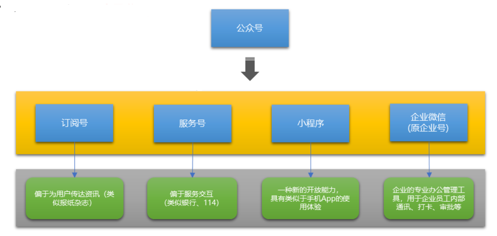

# 小程序基础第一天

---

小程序阶段前三天主要是小程序基础知识和wepy框架的基本使用、后面五天通过项目来实现小程序开发

## 今日目标

+ 了解什么是微信开放平台和微信公众平台
+ 能够知道App和小程序的区别
+ 能够注册小程序账号并使用小程序开发者工具
+ 能够知道小程序项目的基本结构
+ 能够使用小程序常用的组件
+ 能够使用wxss美化页面
+ 能够配置小程序外观
+ 能够配置小程序的tabbar
+ 能够知道小程序的生命周期

## 小程序基本概念介绍

### 微信开发的概述(能够描述出来)

#### 什么是微信开发

> 微信软件除了提供聊天还提供了例如：支付、分享、收藏、人工智能等功能，同时微信还对外开放了很多的接口与能力，程序员基于这些功能和接口进行的开发，叫做微信开发
>

#### 为什么要学习微信开发

- 企业开发的需要
- 个人的发展以及技能的提升

#### 了解微信开放平台(了解即可)

> 微信开放平台是微信对外提供**微信开放接口**的一个平台，这些开发出来的微信接口，供**第三方的网站**或**App**使用

####  微信开放平台

平台登录地址：[微信开放平台](https://open.weixin.qq.com/)

#### 微信开放平台提供的能力

- 微信分享

- 微信支付

- 微信登录

- 微信收藏

- ……等等

    

  

#### 谁会使用微信开放平台

- 网站应用开发(第三方网站)
- 移动应用开发(例如第三方`App`)
- 后台人员

#### 资质认证相关知识

-  只有通过 开发者资质认证后，才能使用开发平台提供的能力
-  个人名义无法申请资质认证，必须是公司或者一个团体才可以申请
-  只有企业类型的主体，才能申请资质认证

#### 微信公众平台(了解即可)

##### 微信公众平台

1.  微信公众平台

    是运营者通过公众号这个媒介，为微信用户提供咨询和服务的平台 

2.  微信公众平台开发

    指基于微信公众号进行的业务开发

3.  [平台登录地址](https://mp.weixin.qq.com/)

##### 微信公众平台的账号分类

> 微信公众平台的账号统称为公众号



##### 如何选择自己的公众号类型

-  订阅号 -- 简单的发送消息，达到宣传效果，建议选择订阅号
-  服务号 -- 想用公众号获得更多的功能、提供更多的服务，例如开通微信支付，建议选择服务号
-  小程序 -- 想提供类似于手机 `App` 的服务体验，建议选择小程序
-  企业微信(原企业号) -- 想用来管理内部企业员工、团队，对内使用，进行以选择企业微信(原企业号)

##### 开放平台和公众平台的区别(理解记忆)

###### 开放平台

-  是微信对外开放 `API` 接口的平台
-  开放的 `API` 接口，供第三方网站和 `App` 调用
-  后端程序员是开放平台开发的主力军

###### 公众平台

-  是基于微信公众号，为微信用户提供服务的平台
-  所用公众号，都属于微信内开发
-  前端程序员是公众平台开发的主力军

##### 认识小程序

###### 什么是小程序

> 微信小程序是一种全新的连接用户和服务的媒介，它可以在微信内被便捷地获取和传播，同时具有出色的使用体验

- 小程序的特点： 体积小、方便获取与传播
- 小程序的理念： 用完即走

######  小程序出现的目的

-  拦截微信用户流量入口，用户的大多数应用需求，都可以才能够微信小程序中得到满足

###### 小程序和订阅号、服务号的区别

-  发布时间不同
  - 2012-07 公众平台发布
  - 2017-01  小程序发布
-  入口方式不同
  -  订阅号、服务号是作为微信联系人存在的 

     

  -  小程序有自己的独立入口

     
-  体验效果不同
  -  订阅号、服务号体验差、无法提供类似于 `App` 的体验
  -  小程序模拟了手机 `App` 的体验，更人性化

###### 小程序适合的业务场景

- 适合做用完即走的应用
  -  例如： 点外卖、打车、代驾、共享单车等
- 不适合做重度依赖的应用
  -  例如：大型手机游戏类、音乐播放器等

###### 小程序和传统手机 `App` 的区别

-  开发原理不同
  - `App` ： 基于手机操作系统提供的 `API` 进行开发
  - 小程序：基于微信提供的 `API` 进行开发 
-  运行方式不同
  -  `App`：  直接安装并运行在手机操作系统之上
  -  小程序：必须基于手机微信才能安装和运行

 

##### 注册小程序账号

+ [微信公众平台](https://mp.weixin.qq.com/) 

+ 点击右上角立即注册

+ 选择账号类型：选择小程序

+ 填写账号基本信息（邮箱不能注册过公众号）

+ 进入邮箱激活

+ 最后一步信息登记，主体类型选择个人，然后登记信息

  

  

+ 登陆该账号进入自己的公众平台

##### 小程序基本信息设置

1.  登录小程序账号 --> 设置 --> 基本设置

##### 小程序账号的开发设置

1.  登录小程序账号 --> 开发 --> 开发设置
2.  既可以查看到在实际开发中需要获取以及设置的开发者ID

##### 小程序账号的成员管理

###### 成员管理的概念

1.  一个团队进行小程序开发，那么团队成员的身份管理是很有必要的
2.  管理员可在小程序管理后台统一管理项目成员、设置项目成员的权限

###### 权限说明

1.  运营者权限
   - 管理、推广、设置等模块权限，可使用体验版小程序
2.  开发者权限
   -  开发模块权限，可使用体验版小程序、开发者工具（`IDE`）
3.  数据分析者(基础分析)
   - 统计模块权限，可使用体验版小程序

######  添加方式

1.  登录小程序账号 --> 管理 --> 成员管理 -- 项目成员 -- 点击向下的箭头

## 创建小程序

### 创建基本的小程序

+ 下载开发者工具并安装[开发者工具下载地址](https://developers.weixin.qq.com/miniprogram/dev/devtools/download.html)
+ 利用开发者工具创建小程序
  + 打开小程序开发者工具，用微信扫码登录开发者工具
  + 点击左侧菜单中的小程序选项
  + 点击+号新建小程序项目
  + 填写项目名称
  + 选择项目存放路径（必须选择空目录）
  + 填写 `AppID`
  + 点击新建按钮


+ 预览小程序

### 介绍开发者工具界面和项目结构 

+ 开发者工具主界面，从上到下，从左到右，分别为五大部分：
  + 菜单栏
  + 工具栏
  + 模拟器
  + 编辑器
  + 调试器


+ 小程序项目的结构

```javascript
├── pages ······································ 【目录】存放所有的小程序页面
│   │── index ···································· 【目录】index 页面
│   │   ├── index.wxml ······························· 【文件】 index 页面的结构
│   │   ├── index.js ································· 【文件】 index 页面的逻辑
│   │   ├── index.json ······························· 【文件】 index 页面的配置
│   │   └── index.wxss ······························· 【文件】 index 页面的样式
│   └── logs ····································· 【目录】 logs 页面
│       ├── logs.wxml ································ 【文件】 logs 页面的结构
│       └── logs.js ·································· 【文件】 logs 页面的逻辑
└── utils ······································ 【目录】 存放小程序中用到的工具函数
├── app.js ····································· 【文件】 小程序逻辑
├── app.json ··································· 【文件】 小程序的公共配置
├── app.wxss ··································· 【文件】小程序公共样式表
├── project.config.json ························ 【文件】 开发工具配置文件
```

+ 小程序页面和 `Vue` 组件的对比
  + 每个 `.vue` 文件，是由 `template` 模板结构、`script` 行为逻辑、`style` 样式三部分组成的
  + 每个小程序页面，是由 `.wxml` 结构、`.js` 逻辑文件、`.json` 配置、`.wxss` 样式表这四部分组成的


+ 小程序页面中每个文件的作用
  + `.wxml` : 用来描述当前这个页面的标签结构，同时提供了类似于 `Vue` 中指令的语法
  + `.js` : 用来定义当前页面中用到的数据、交互逻辑和响应用户的操作
  + `.json` : 用来定义当前页面的个性化配置，例如，为每个页面单独配置顶部颜色、是否允许下拉刷新等
  + `.wxss` : 用来定义样式来美化当前的页面

### 创建小程序页面作为首页

- 在 `pages` 目录上右键，选择 “新建目录”，输入目录名称
- 在新建的目录上，再次右键，选择 “新建 `page`” ，输入 页面 名称

注意：

- 输入 页面名称以后，会自动创建四个文件
- 修改小程序项目的默认首页
  + 打开 `app.json` 全局配置文件，找到 `pages` 节点。这个 pages 节点是一个数组，存储了项目中所有页面的访问路径。其中，`pages` 数组中第一个页面路径，就是小程序项目的默认首页。
  + 所以只需要修改 pages 数组中路径的顺序，就可以可修改小程序的默认首页。

### 常用组件的基本使用

小程序提供了丰富的基础组件给开发者，开发者可以像搭积木一样，组合各种组件拼接称自己的小程序 <br />

小程序中的组件，就像 `HTML` 中的 `div` 、`p`、`span` 等标签的作用一样，用于搭建页面的基础结构

#### text文本组件的用法

##### text 组件的属性

|     属性     |   类型    |  默认值  |  必填  |                说明                |
| :--------: | :-----: | :---: | :--: | :------------------------------: |
| selectable | boolean | false |  否   |              文本是否可选              |
|   space    | string  |   .   |  否   | 显示连续空格，可选参数：`ensp`、`emsp`、`nbsp` |
|   decode   | boolean | false |  否   |               是否解码               |

**注： [text 组件详细文档](https://developers.weixin.qq.com/miniprogram/dev/component/text.html)**

- `text` 组件相当于行内标签、在同一行显示
- 除了文本节点以外的其他节点都无法长按选中

##### 代码案例

```html
<view>
  <!-- 长按文本是否可选 -->
  <text selectable='true'>来了老弟</text>
</view>

<view>
  <!-- 显示连续空格的方式 -->
  <view>
    <text space='ensp'>来了  老弟</text>
  </view>
  <view>
    <text space='emsp'>来了  老弟</text>
  </view>
  <view>
    <text space='nbsp'>来了  老弟</text>
  </view>
</view>

<view>
  <text>skyblue</text>
</view>

<view>
  <!-- 是否解码 -->
  <text decode='true'>&nbsp; &lt; &gt; &amp; &apos; &ensp; &emsp;</text>
</view>
```

#### view视图容器组件的用法

> View 视图容器， 类似于 HTML 中的 div

##### 组件的属性


**注：[View 的详细文档](https://developers.weixin.qq.com/miniprogram/dev/component/view.html)**

##### 代码案例

```html
<!-- hover-class设置点击之后的样式类名 -->
<!-- hover-start-time="2000" 设置点击之后延迟2000毫秒出现效果 -->
<!-- hover-stay-time='2000' 设置松开手指保持的时间 -->

<view class="box2" hover-class="box2_active">
  <view class='box1' hover-class='active' hover-stop-propagation hover-start-time="2000" hover-stay-time='2000'>

  </view>
</view>
```

#### button按钮组件的用法

#####  组件的属性

|   属性名    |   类型    |   默认值   |        说明         |
| :------: | :-----: | :-----: | :---------------: |
|   size   | String  | default |       按钮的大小       |
|   type   | String  | default |      按钮的样式类型      |
|  plain   | Boolean |  false  |   按钮是否镂空，背景色透明    |
| disabled | Boolean |  false  |       是否按钮        |
| loading  | Boolean |  false  | 名称是否带 loading t图标 |

**注：[Button 组件的详细文档](https://developers.weixin.qq.com/miniprogram/dev/component/button.html)**

- `button` 组件默认独占一行，设置 `size` 为 `mini` 时可以在一行显示多个

##### 案例代码

```html
<button size='mini' type='primary'>前端</button>

<button size='mini' type='default' disabled='true'>前端</button>

<button size='mini' type='warn' loading='true'>前端</button>
```

#### 其他组件及wxss和rpx的使用

##### input文本输入框组件的用法

###### input 组件属性

|     属性名     |   类型    |  默认值   |          说明           |
| :---------: | :-----: | :----: | :-------------------: |
|    value    | String  |   .    |       输入框的初始内容        |
|    type     | String  | 'text' |       input 的类型       |
|  password   | Boolean | false  |        是否是密码类型        |
| placeholder |  Sting  |   .    |       输入框为空时占位符       |
|  disabled   | Boolean | false  |         是否禁用          |
|  maxlength  | Number  |  140   | 最大输入长度，设置 -1 时不限制最大长度 |

**注：[input 组件的详细文档](https://developers.weixin.qq.com/miniprogram/dev/component/input.html)**

######  案例代码

```html
<input placeholder='111' type='idcard' />
```

##### image图片组件的用法

###### image 组件常用的属性

- `src` --  支持本地和网络上的图片
- `mode` -- 指定图片的裁剪、缩放的模式 
  + aspectFit：会保持比例缩放，长边能够完全的显示出来
  + aspectFill：会保持比例缩放，短边能够完全的显示出来，长边会被裁剪

**注意：[image 图片组件详细文档](https://developers.weixin.qq.com/miniprogram/dev/component/image.html)** 

- image 组件默认的宽度是 `300px` 、`高度是225px`

###### 案例代码

```html
<!-- image组件 -->
<image mode="aspectFit" src="http://destiny001.gitee.io/image/cxk.gif"></image>
<image mode="aspectFill" src="/assets/cxk.gif"></image>
```

##### wxss的基本使用

+ 初识wxss
  + `WXSS` 是一套样式语言，用来决定 `WXML` 的组件应该怎么显示
  + `wxss` 具有 `css` 大部分特性
  + `wxss` 对 `css` 进行了扩充以及修改，以适应微信小程序的开发
+ 002 - `wxss` 和 `css` 的区别
  + 尺寸单位
  + 样式导入


​	**注：[wxss 详细文档](https://developers.weixin.qq.com/miniprogram/dev/framework/view/wxss.html)**

+ 001 - `wxss` 目前支持的选择器

  + 标签选择器
  + id选择器
  + class选择器
  + 伪类选择器
  + data-*属性选择器(与之前我们学过的属性选择器有区别)
  + :nth-of-type() 等常用的 css3 选择器
  + 其他…

  **注： [wxss详细文档](https://developers.weixin.qq.com/miniprogram/dev/framework/view/wxss.html)**


+ 案例代码

```css
view{
  color: #8B3A3A;
}

#myText{
  color: green;
}

.myText {
  color: blue;
}

.myText::before{
  content: '我是左边的小翅膀'
}

.myText::after{
  content: '我是右边的小翅膀'
}

[data-color="pink"] {
  color: pink;
}


view:nth-of-type(5) {
  background: red;
}
```

##### import 样式导入

######  语法解释

- 使用 `@import` 语句可以导入外联样式表
- 语法格式：`@import "wxss 样式表文件的相对路径"`

###### 案例代码

```css
@import "/assets/common/common.wxss";
/* @import "../../assets/common/common.wxss"; */

.box {
  width: 375rpx;
  height: 375rpx;
  background-color: skyblue;
}
```

##### 全局样式和局部样式

######  局部样式

- 在 `page` 的 `wxss` 文件中定义的样式为局部样式，只作用在对应的页面，并会覆盖 `app.wxss` 中相同的选择器。

###### 全局样式

- 定义在 `app.wxss` 中的样式为全局样式，作用于每一个页面。

**注：[wxss 详细文档](https://developers.weixin.qq.com/miniprogram/dev/framework/view/wxss.html)**

##### rpx尺寸单位的使用

`rpx`： 是微信小程序独有的，解决屏幕自适应的尺寸单位

- 可以根据屏幕宽度进行自适应，不论屏幕大小，规定屏幕宽为 `750rpx`

- 通过 `rpx` 设置元素和字体的大小，小程序在**不同尺寸**的屏幕上，**可以实现自动适配**

- rpx之间的换算

  以 `iPhone6` 为例，`iPhone6`  的屏幕宽度为 `375px` ，共有 750 个物理像素，则 `750rpx` = `375px` = `750` 物理像素

  也就是 **`1rpx` = `0.5px` = `1 物理像素`** 

|       设备       | `rpx` 换算 `px` (屏幕宽度/750) | `px` 换算 `rpx` (750/屏幕宽度) |
| :------------: | :----------------------: | :----------------------: |
|   `iPhone5`    |    `1rpx` = 0.42`px`     |    `1px` = `2.34rpx`     |
|   `iPhone6`    |     `1rpx` = `0.5px`     |      `1px` = `2rpx`      |
| `iPhone6 Plus` |    `1rpx` = `0.552px`    |    `1px` = `1.81rpx`     |

​	那么也就是说：如果在`iPhone6`上，

​	如果要绘制宽`100px`，高`20px`的盒子，换算成`rpx`单位，

​	宽高分别为 `200rpx` 和 `40rpx`

+ `rpx` 和 `iPhone6` 设计稿的关系

  官方建议：开发微信小程序时，设计师可以用 `iPhone6` 作为视觉稿的标准。

  如果要根据 `iPhone6` 的设计稿，绘制小程序页面，可以直接把单位从 `px` 替换为 `rpx` 。

  因为一般设计稿都是二倍图，例如：在一个为`iPhone6` 的二倍图的设计稿上有一个宽为300px的盒子，那么我们在写出效果的时候，希望这个盒子在`iPhone6` 展示出来的大小为150px，那么此时我们就可以将这个盒子的大小设置成300rpx，因为300rpx最后在`iPhone6` 展示出来的就是150px

  总结：在二倍图的`iPhone6` 设计稿上rpx直接设置成设计稿的大小

  例如，假设 `iPhone6` 设计稿上，要绘制一个 宽高为 `200px` 的盒子，换算为 `rpx` 为 `200rpx`。

### 配置小程序的外观

#### `app.json` 配置文件

> 小程序根目录下的 `app.json` 文件用来对微信小程序进行全局配置，
>
> 它决定了页面文件的路径、窗口表现、设置多 tab 等。

1. 在 `app.json` 配置文件中，最主要的配置节点是：
   - `pages` 数组：配置小程序的页面路径
   - `window` 对象：用于设置小程序的状态栏、导航条、标题、窗口背景色
   - `tabBar` 对象：配置小程序的tab栏效果

**注：[全局配置详细文档](https://developers.weixin.qq.com/miniprogram/dev/framework/config.html#全局配置)**

#### `pages` 数组的用法

> `app.json` 中的 `pages` 数组，用来配置小程序的页面路径

#####  基础配置

- `pages` 用于指定小程序由哪些页面组成，每一项都对应一个页面的 路径+文件名 信息。
- 文件名不需要写文件后缀，框架会自动去寻找对应位置的 `.json`、 `.js`、 `.wxml` 和 `.wxss` 四个文件进行处理。

##### 创建页面的另一种方式

- 打开 `app.json` --> `pages` 数组节点 --> 新增页面路径并保存 --> 自动创建路径对应的页面

**注意事项：**

- 数组的第一项代表小程序的小程序的初始页面也就是首页
- 小程序中新增/减少页面，都需要对 pages 数组进行修改，否则在运行小程序时就会报错

**注：[全局配置详细文档](https://developers.weixin.qq.com/miniprogram/dev/framework/config.html#全局配置)**

##### 小程序窗口的组成部分

**常见的属性配置： [常见的属性配置](https://developers.weixin.qq.com/miniprogram/dev/reference/configuration/page.html)**


##### 通过app.json下的window配置窗口外观

+ navigationBarTitleText：设置小程序标题

- navigationBarBackgroundColor：设置导航栏背景色


- navigationBarTextStyle：设置导航栏标题颜色
- enablePullDownRefresh：全局是否开启下拉刷新功能值为布尔值
- backgroundColor：设置窗口的背景色
- backgroundTextStyle：下拉刷新加载loading的颜色
- onReachBottomDistance：设置距离底部的距离多少开启触底行为

注意： 默认距离为 `50px`，如果没有特殊需求，建议使用默认值即可

+ 在配置app.json中一定要符合json规范，例如最后一项不能有逗号

官方文档：[window配置项](https://developers.weixin.qq.com/miniprogram/dev/reference/configuration/app.html#window)

#### tabbar的基本使用

##### `tabBar` 的概念

> `tabBar` 是移动端应用常见的页面效果，用于实现多页面的快速切换；小程序中通常将其分为底部 `tabBar` 和顶部 `tabBar`


注意：`tabBar` 中，只能配置最少2个、最多5个 tab 页签，当渲染顶部 `tabBar` 的时候，不显示 `icon`，只显示文本**

**注： [tabbar 详细文档](https://developers.weixin.qq.com/miniprogram/dev/reference/configuration/app.html)** 

##### `tabBar` 节点的配置项

######  `tabBar` 节点的配置项

|       属性        |    类型    |  必填  |  默认值   |                    描述                    |
| :-------------: | :------: | :--: | :----: | :--------------------------------------: |
|      color      | HexColor |  是   |   .    |          tab 上的文字默认颜色，仅支持十六进制颜色          |
|  selectedColor  | HexColor |  是   |   .    |         tab 上的文字选中时的颜色，仅支持十六进制颜色         |
| backgroundColor | HexColor |  是   |   .    |            tab 的背景色，仅支持十六进制颜色            |
|   borderStyle   |  string  |  否   | black  |   tabBar 上边框的颜色， 仅支持 `black` / `white`   |
|      list       |  Array   |  是   |   .    | tab 的列表，详见 `list` 属性说明，最少 2 个、最多 5 个 tab |
|    position     |  string  |  否   | bottom |      tabBar 的位置，仅支持 `bottom`/ `top`      |
|     custom      | boolean  |  否   | false  |                自定义 tabBar                |

######  list 节点的配置项

|        属性        |   类型   |  必填  |                    说明                    |
| :--------------: | :----: | :--: | :--------------------------------------: |
|     pagePath     | string |  是   |           页面路径，必须在 pages 中先定义            |
|       text       | string |  是   |                tab 上按钮文字                 |
|     iconPath     | string |  否   |  图片路径，icon 大小限制为 40kb，建议尺寸为 81px * 81px  |
| selectedIconPath | string |  否   | 选中时的图片路径，icon 大小限制为 40kb，建议尺寸为 81px * 81px |

**注意：**

- **当 position 为 top 时，不显示 icon。**

##### 页面配置

###### 页面配置和局部配置的关系

- `app.json` 中的 `window` 节点，可以全局配置小程序中每个页面的窗口表现；
- 如果某些小程序页面，想要拥有特殊的窗口表现，此时，“页面级别的 `.json` 配置文件”就可以实现这种需求；

**注意：页面级别配置优先于全局配置生效**

##### 生命周期的概念

生命周期（Life Cycle）是指一个对象从 创建 -> 运行 -> 销毁 的整个阶段，强调的是一个时间段。

- 应用生命周期：特指小程序从启动 --> 运行 --> 销毁的过程；
- 页面生命周期：特指小程序中，每个页面的加载 --> 渲染 --> 销毁的过程；

**注意：页面的生命周期范围较小，应用程序的生命周期范围较大**


##### 程序生命周期函数

小程序框架提供的内置函数，会伴随着生命周期，自动按次序执行

- 应用生命周期函数

- 页面生命周期函数

- 生命周期函数的作用：

  允许程序员在特定的生命周期时间点上，执行某些特定的操作。

  **注意：生命周期强调的是时间段，生命周期函数强调的是时间点。**

##### 应用生命周期函数

`app.js` 是小程序执行的入口文件，在 `app.js` 中必须调用 `App()` 函数，且只能调用一次。其中，`App()` 函数是用来注册并执行小程序的。`App(Object)` 函数接收一个 `Object` 参数，可以通过这个 `Object` 参数，指定小程序的生命周期函数。

+ 应用的生命周期函数
  + onLaunch：小程序初始化了（只会执行一次）
  + onShow：小程序页面显示出来了（执行多次）
  + onHide：页面隐藏了（多次触发）
  + onError：小程序出现了异常

##### 页面生命周期函数

每个小程序页面，必须拥有自己的 `.js` 文件，且必须调用 `Page()` 函数，否则报错。其中 `Page()` 函数用来注册小程序页面。

`Page(Object)` 函数接收一个 `Object` 参数，可以通过这个 `Object` 参数，指定页面的生命周期函数。

+ 页面生命周期
  + onLoad：页面开始加载了
  + onShow：页面显示了
  + onReady：页面渲染完成了
  + onHide：页面隐藏了
  + onUnload：监听页面卸载

#### 数据绑定

##### 如何定义页面的数据

- 小程序每个页面，是由 4 部分组成，其中 `.js` 文件内可以定义页面的数据、生命周期函数、其他业务逻辑
- 如果要在 `.js` 文件内定义页面的数据，只需把数据定义在 `data` 节点下即可

#####  `Mustache` 语法格式

> 把 `data` 中的数据绑定到页面中渲染，使用 `Mustache` 语法(双大括号) 将变量包裹起来即可

```html
<view>{{ info }}</view>
```

- `Mustache` 语法的主要场景
  - 绑定内容
  - 绑定属性
  - 运算(三元表达式、算术运算、逻辑判断、字符串运算)

#####  案例代码

```html
<!-- 页面结构 -->

<!-- 绑定内容和属性 -->
<view id="item-{{id}}">{{ info }}</view>

<!-- 算数运算 -->
<view>{{ 1 + 1 }}</view>

<!-- 三元表达式 -->
<view>{{ id == 10 ? "正确" : "错误" }}</view>
```

```javascript
// 页面数据

Page({
  data: {
  	info: 'i miss you',
    id: 10,
    arr: [1, 2, 3]
  }
})
```

# 小程序基础第二天

## 课程目标

+ 能够知道小程序中的事件绑定和事件传参
+ 能够了解wxs的作用和使用
+ 能够知道wx:if和hidden的条件渲染
+ 能够知道wx:for列表渲染
+ 能够知道如何定义页面事件（上拉、下拉、滑动、分享）
+ 能够知道如何实现页面导航跳转
+ 能够实现小程序中的get、post请求

## 事件绑定和事件传参

###  绑定触摸事件

在小程序中，不存在网页中的 `onclick` 鼠标点击事件，而是通过 `bindtap` 事件来响应触摸行为

+ 直接通过bindtap来绑定点击事件

  ```html
  <button bindtap="tapHandle">点我啊，老弟</button>
  ```

+ 对应的事件函数应该定义到对应的js文件中的data、生命周期的同级即可

  ```js
  tapHandle (even) {
    // 默认的第一个参数为事件对象
    console.log(even)
  },
  ```

### 事件传参

小程序中事件传参错误写法

```html
<button bindtap="tapHandle(1)">点我啊</button>
```

- 在小程序中通过data-自定义属性的形式进行传参

  ```html
  <button bindtap="tapHandle" data-num="1" data-age="19">点我啊</button>
  ```

- 在事件函数内部通过事件对象来接收参数

  ```js
  // tap的事件处理函数
    tapHandle (even) {
      console.log(even.target.dataset.num)
      console.log(even.target.dataset.age)
    }
  ```

## 文本框与data数据同步和wxs的基本使用（了解）

### 文本框与data数据同步

+ 在小程序中是没有v-model这个指令的

+ `vue中v-model的原理`

  + `将data里面的数据绑定到输入框上`
  + `给输入框绑定input事件，检测输入框发生变化`
  + `将发生变化的最新的输入框的值同步给data即可`

+ 实现小程序中文本框和data同步

  + 在data里面定义一个数据value

  + 通过mustache语法将data的数据绑定到输入框上

    ```html
    <input value="{{value}}"></input>
    ```

  + 检测输入框发生变化，绑定input事件

    ```html
    <input value="{{value}}" bindinput="inputHandle"></input>
    ```

  + 定义事件处理函数，通过事件对象even.detail.value获取到发生变化的值

    ```js
    // 输入框发生变化的事件处理函数
    inputHandle (even) {
      console.log(even.detail.value)
    }
    ```

  + 拿到输入框的值之后，利用setData方法给data里面的数据进行同步

    ```js
    // input的处理函数
    inputHandle (even) {
      console.log(even.detail.value)
      console.log(this.data.value)
      // 通过下面这种方式修改数据，只会让数据同步，页面不会跟着同步
      // this.data.value = even.detail.value
      // 通过setData这个方法来同步数据：1，能够修改data中的数据 2，当修改数据之后，再将数据同步给页面
      this.setData({
        value: even.detail.value
      })
    },
    
    ```

### `WXS` 脚本简介

#### 什么是 `wxs`

- `wxs` 是小程序的一套脚本语言，结合 `wxml` ，可以构建出页面的结构
- ```wxs```的作用就是简化{{}}内部的模板语法

#### `wxs` 的注意事项

- 没有兼容性
  - `wxs` 不依赖于运行时的基础库版本，可以在所有版本的小程序中运行
- 与 `javascript` 不同
  - `wxs` 与 `javascript` 是不同的语言，有自己的语法，并不和 `javascript` 一致
- 隔离性
  - `wxs` 的运行环境和其他 `javascript` 代码是隔离的
  - `wxs` 中不能调用其他 `javascript` 文件中定义的函数，也不能调用小程序提供的`API`
- 不能作为事件回调
  - `wxs` 函数不能作为组件的事件回调
- `iOS`设备上比 `javascript` 运行快
  - 由于运行环境的差异，在 `iOS` 设备上小程序内的 `wxs` 会比 `javascript` 代码快 2 ~ 20 倍。
  - 在 `android` 设备上二者运行效率无差异 

####  `wxs` 遵循 `CommonJS` 模块化规范

> `CommonJS` 是 `javascript` 的模块化规范之一，小程序的脚本语言 `wxs` 遵循了 `CommonJS` 规范，因此，使用 `wxs` 时的体验和使用 `node.js` 的体验比较相似。

- `module` 对象
  - 每个 `wxs` 都是独立的模块，每个模块均有一个内置的 module 对象，每个模块都有自己独立的作用域。
- `module.exports`
  - 由于 `wxs` 拥有独立作用域，所以在一个模块里面定义的变量与函数，默认为私有的，对其他模块不可见，
  - 通过 `module.exports` 属性，可以对外共享本模块的私有变量与函数。
- require函数
  - 在 `wxs` 模块中引用其他 `wxs` 文件模块，可以使用 `require` 函数。


- `WXS` 语言目前共有以下8种数据类型：
  - `number` 数值类型
  - `string` 字符串类型
  - `boolean` 布尔类型
  - `object` 对象类型
  - `function` 函数类型
  - `array` 数组类型
  - `date` 日期类型
  - `regexp` 正则

#### 内嵌 `wxs` 脚本

##### 使用规则

- `wxs` 代码可以编写在 `wxml` 文件中的 `<wxs></wxs>` 标签内，就像 `javascript` 代码可以编写在 `html` 文件中的 `<script></script>` 标签内一样。
- `wxml` 文件中的每个 `<wxs></wxs>` 标签，**必须提供一个 `module` 属性**，用来指定当前 `<wxs></wxs>` 标签的模块名。
- module 属性值的命名必须符合下面两个规则：
  - 首字符必须是：字母（a-z A-Z），下划线（_）
  - 剩余字符可以是：字母（a-z A-Z），下划线（_）， 数字（0-9） 

##### 案例代码

```html
<view>
  小明同学的分数为：{{ wxs_util.fractionFormat(fraction) }}
</view>

<wxs module="wxs_util">
module.exports = {
  fractionFormat: function(fraction){
    return fraction>=80 ? "优秀" : "一般"
  }
}
</wxs>

```

#### wxs外联和小程序条件渲染的使用

##### 外联 `wxs` 脚本文件

#####  使用规则

- `wxs` 代码可以编写在以 `.wxs` 为后缀名的文件内，就像 j`avascript` 代码可以编写在以 `.js` 为后缀名文件中一样。
- 在 `wxml` 中如果要引入外联的 `wxs` 脚本，必须为 `<wxs></wxs>` 标签添加 `module` 和 `src` 属性。
  - `module` 用来为 `<wxs></wxs>` 标签指定模块名，作为当前页面访问这个模块的标识名称；
  - `src` 用来指定当前 `<wxs></wxs>` 标签要引入的脚本路径，必须是相对路径；

##### 案例代码

```javascript
// .wxs 文件
module.exports = {
  fractionFormat: function(fraction){
    return fraction>=80 ? "优秀" : "一般"
  }
}

```

```html
<view>
  小明同学的分数为：{{ wxs_util.fractionFormat(fraction) }}
</view>
<wxs src="../tools.wxs" module="wxs_util"></wxs>

```

**注意：**

+ **在 `wxs`中不要使用高级的`JS`语法**
+ 如果一个 `wxs` 模块在定义之后，一直没有被引用，则该模块不会被解析与运行。

## 条件渲染

### `wx:if`

- 在小程序中，使用 `wx:if="{{condition}}" `来判断是否需要渲染该组件
- 也可以用 `wx:elif` 和 `wx:else` 来添加一个 else 块

```html
<view>
  <text>小明的成绩属于：</text>
  <text wx:if="{{fraction>=80}}">优秀</text>
  <text wx:elif="{{fraction<80&&fraction>60}}">良好</text>
  <text wx:elif="{{fraction<60}}">较差</text>
</view>
```

### `block wx:if`

- 因为 `wx:if` 是一个控制属性，需要将它添加到一个标签上。
- 如果要一次性判断多个组件标签，可以使用一个 `<block></block>` 标签将多个组件包装起来，并在上边使用 `wx:if` 控制属性。
- **`<block/>` 并不是一个组件，它仅仅是一个包装元素，不会在页面中做任何渲染，只接受控制属性。**

```html
<view>
  <text>小明的成绩属于：</text>
  <text wx:if="{{fraction>=80}}">优秀</text>
  <text wx:elif="{{fraction<80&&fraction>60}}">良好</text>
  <block wx:elif="{{fraction<60}}">
    <text>较差</text>
    <text>同学你要补课了啊</text>
  </block>
</view>

```

###  hidden

- 使用 `hidden="{{condition}}"` 也能控制元素的显示与隐藏

```html
<view hidden="{{false}}">我是可以隐藏的也可以显示的</view>

```

利用hidden切换元素案例代码

+ wxml

  ```html
  <view hidden="{{flag}}">这是一个显示或隐藏的盒子</view>
  <button bindtap="changeView">切换</button>
  
  ```

+ js

  ```js
  changeView () {
      console.log('123')
      this.setData({
        flag: !this.data.flag
      })
    }
  
  ```

###  hidden 和 `wx:if` 的区别

- 被 `wx:if` 控制的区域，会根据控制条件的改变，动态创建或销毁对应的 `UI`结构。 
- hidden 组件始终会被渲染，只是简单的通过display控制显示与隐藏。
- **总结：**`wx:if` 有更高的切换消耗而 hidden 有更高的初始渲染消耗。因此，如果需要频繁切换的情景下，用 hidden 更好，如果在运行时条件不大可能改变则 `wx:if` 较好。

## 列表渲染

###  wx:for

- 在组件上使用 `wx:for` 控制属性绑定一个数组，即可使用数组中各项的数据重复渲染该组件。

- 默认数组的当前项的下标变量名默认为 `index`，数组当前项的变量名默认为 `item`。

- wx：for基本使用

  + 数据

    ```js
    data: {
        list: [
          {
            name: '能哥', age: 18
          },
          {
            name: '四哥', age: 28
          },
          {
            name: '小损样', age: 38
          },
          {
            name: '宋小宝', age: 48
          }
        ]
      }
    
    ```

  + 循环结构

    ```html
    // 默认的索引index、每一项的字段item
    <view wx:for="{{list}}">
    序号：{{index}}，名字：{{item.name}}，年龄：{{item.age}}
    </view>
    
    ```

### `block wx:for`

- `wx:for` 可以用在 `<block></block>` 标签上，以渲染一个包含多节点的结构块。

```html
<block wx:for='{{ arr }}' wx:key='index'>
  <view>值：{{item}} -- 索引{{index}}</view>
</block>

```

### 指定索引和当前项的变量名

- 使用 `wx:for-item` 可以指定数组当前元素的变量名
- 使用 `wx:for-index` 可以指定数组当前下标的变量名，

```html
<view wx:for='{{ arr }}' wx:for-item='foritem' wx:for-index='forindex' wx:key='index'>
  我是{{ foritem }} -- 索引是 {{ forindex }}
</view>
```

### 列表渲染中的 `wx:key`

1. `wx:key` 的作用说明
   - 如果列表中项目的位置会动态改变或者有新的项目添加到列表中，并且希望列表中的项目保持自己的特征和状态（如 `<input/>` 中的输入内容，`<checkbox/>` 的选中状态），需要使用 `wx:key` 来指定列表中项目的唯一的标识符。
   - 当数据改变触发渲染层重新渲染的时候，会校正带有 key 的组件，**框架会确保他们被重新排序，而不是重新创建**，以确保使组件保持自身的状态，并且提高列表渲染时的效率。
2. `wx:key` 的注意事项
   - `key` 值必须具有唯一性，且不能动态改变
   - `key` 的值必须是数字或字符串
   - 如果提供的key的唯一值是item中的字段，直接写字段名即可
   - 保留关键字 `*this` 代表在 `for` 循环中的 `item` 本身，它也可以充当 `key` 值，但是有以下限制：需要 `item` 本身是一个唯一的字符串或者数字。
   - 如不提供 `wx:key`，会报一个 `warning`， 如果明确知道该列表是静态，或者不必关注其顺序，可以选择忽略。
   - 如果只是单纯的想去除警告，可以直接给key设置成index

## 页面事件（上拉、下拉）

### 下拉刷新

#### 下拉刷新的概念

- 概念：下拉刷新是移动端更新列表数据的交互行为，用户通过手指在屏幕上自上而下的滑动，可以触发页面的下拉刷新，更新列表数据。

#### 如何启动下拉刷新

- 在 `app.json` 的 `window` 选项中或页面配置中开启 `enablePullDownRefresh`。
- 可以通过 `wx.startPullDownRefresh()` 触发下拉刷新，调用后触发下拉刷新动画，效果与用户手动下拉刷新一致。

**注意： 一般情况下，推荐在页面配置中为需要的页面单独开启下拉刷新行为**

#### 设置下拉刷新窗口的样式

- 在 `app.json` 的 `window` 选项中或页面配置中修改 `backgroundColor` 和 `backgroundTextStyle` 选项。
- `backgroundColor` 用来配置下拉刷新窗口的背景颜色，仅支持16进制颜色值
- `backgroundTextStyle` 用来配置下拉刷新 `loading` 的样式，仅支持 `dark` 和 `light`

#### 监听下拉刷新事件

> 需要先开启下拉刷新

- 为页面添加 `onPullDownRefresh()` 函数，可以监听用户在当前页面的下拉刷新事件。

```javascript
/**
 * 页面相关事件处理函数--监听用户下拉动作
 */
onPullDownRefresh: function () {
  console.log('触发下拉刷新啦')
}
```

####  停止下拉刷新

- 处理完下拉刷新后，下拉刷新的 loading 效果会一直显示，不会主动消失，
- 因此需要手动隐藏下拉刷新的 loading 效果，调用 `wx.stopPullDownRefresh()` 可以停止当前页面的下拉刷新。

```javascript
/**
 * 页面相关事件处理函数--监听用户下拉动作
 */
onPullDownRefresh: function () {
  console.log('触发下拉刷新啦')
    
  wx.stopPullDownRefresh()
}

```

###  上拉加载

#### 上拉加载的概念以及场景

- 概念：在移动端，随着手指不断向上滑动，当内容将要到达屏幕底部的时候，页面会随之不断的加载后续内容，直到没有新内容为止，我们称之为上拉加载更多。上拉加载更多的本质就是数据的分页加载。
- 应用场景：在移动端，列表数据的分页加载，首选的实现方式就是上拉加载更多。

#### 设置上拉加载的距离

- 在 `app.json` 的 `window`选项中或页面配置中设置触底距离 `onReachBottomDistance`。单位为`px`，默认触底距离为 `50px`。
- 为页面添加 `onReachBottom()` 函数，可以监听用户在当前页面的上拉触底事件，从而实现上拉加载更多列表数据的效果。

+ 案例代码

  结构

  ```html
  <view wx:for="{{list}}" wx:key="index">
  {{item}}
  </view>
  ```
  

js

```js
  /**
     * 页面上拉触底事件的处理函数
     */
  onReachBottom: function () {
    console.log('触底了')
    for (var i = 0; i < 5; i++){
      this.data.list.push(1)
    }
    this.setData({
      list: this.data.list
    })
  }
```

## 页面的其他事件

### 页面滑动事件`onPageScroll`

- 监听用户滑动页面事件
  - 得到 `scrollTop`，页面在垂直方向已滚动的距离（单位`px`）

```javascript
onPageScroll: function (e) {
  console.log(e)
}

```

### 分享事件 `onShareAppMessage`

触发时机

+ 点击右上角菜单之后“转发”按钮的时候会触发onShareAppMessage
+ 监听用户点击页面内转发按钮（`<button> 组件 open-type="share"`），open-type="share"就是转发按钮


事件对象

+ from：转发事件来源。button：页面内转发按钮；menu：右上角转发菜单
+ target：如果 from 值是 button，则 target 是触发这次转发事件的 button，否则为 undefined

自定义转发内容

+ 在onShareAppMessage事件函数内部返回一个配置对象，通过配置对象自定义转发内容
  + title：转发标题
  + path：转发的路径，好友点击你分享的小程序进入的页面
  + imageUrl：自定义图片路径，可以是本地文件路径、代码包文件路径或者网络图片路径，默认页面截图

## 页面导航跳转

页面导航就是页面之间的跳转，小程序页面之间的导航方式有两种

- 声明式导航：通过点击navigator组件进行跳转
- 编程式导航：通过调用小程序的api接口进行跳转

准备工作：快速搭建tabbar

+ app.json

  ```js
  "tabBar": {
    "list": [
      {
        "pagePath": "pages/home/home",
        "text": "首页",
        "iconPath": "/assets/tabs/home.png",
        "selectedIconPath": "/assets/tabs/home-active.png"
      },
      {
        "pagePath": "pages/message/message",
        "text": "信息",
        "iconPath": "/assets/tabs/message.png",
        "selectedIconPath": "/assets/tabs/message-active.png"
      }
    ]
  }
  
  ```

+ 生成首页和信息页面

+ 将图标复制到项目中

### 小程序导航 -- 声明式导航

- 导航到非 `tabBar` 页面

  非 `tabBar` 页面指的是没有被当作 `tabBar` 进行切换的页面。

  ```js
  <navigator url="/pages/test/test">跳转到 test 页面</navigator>
  ```

  注意事项

  - `url` 属性设置需要跳转的路径
  - 页面路径应该以 / 开头
  - 路径必须提前在 `app.json` 的 `pages` 节点下声明

- 导航到 `tabBar` 页面

  navigator组件单纯使用 `url` 属性，无法导航到  `tabBar` 页面，必须需要结合 `open-type` 属性进行导航。

  ```js
  <navigator url="/pages/message/message" open-type="switchTab">跳转到 tabBar 页面</navigator>
  ```

- 后退导航

  小程序如果要后退到上一页面或多级页面，需要把 `open-type` 设置为 `navigateBack`，同时使用 `delta` 属性指定后退的层数

  ```
  <navigator open-type='navigateBack' delta='1'> 返回上一页 </navigator>
  
  <navigator open-type='navigateBack' delta='2'> 返回上上一页 </navigator>
  ```

### 小程序导航 -- 编程式导航

- 导航到非 `tabBar` 页面

  - 通过 `wx.navigateTo(Object object)` 方法，可以跳转到应用内的某个页面。但是不能跳到 `tabbar` 页面


  - [wx.navigateTo  详细文档](https://developers.weixin.qq.com/miniprogram/dev/api/route/wx.navigateTo.html)

  - 代码案例:

    ```
    // 跳转到非导航页面
    handle: function () {
      wx.navigateTo({
        url: '/pages/test/test'
      })
    }
    
    ```

- 导航到 `tabBar` 页面

  - 通过 `wx.switchTab(Object object)` 方法，可以跳转到 `tabBar` 页面

  - [wx.switchTab 详细文档](https://developers.weixin.qq.com/miniprogram/dev/api/route/wx.switchTab.html)

  - 案例代码

    ```
    // 跳转到 tabBar 页面
    tabBarHandle: function () {
      wx.switchTab({
        url: '/pages/message/message'
      })
    }
    
    ```

- 后退导航

  - 通过 `wx.navigateBack(Object object) `方法，关闭当前页面，返回上一页面或多级页面。


  - [wx.navigateBack  详细文档](https://developers.weixin.qq.com/miniprogram/dev/api/route/wx.navigateBack.html)

  - 案例代码

    ```
    handle: function () {
      wx.navigateBack({
        delta: 1
      })
    }
    ```

### 小程序导航 -- 导航传参

- 声明式导航传参

  - `navigator` 组件的 `url` 属性用来指定导航到的页面路径，同时路径后面还可以携带参数，参数与路径之间使用 `?` 分隔，参数键与参数值用 `=` 相连，不同参数用 `&` 分隔。

  - 案例代码

    ```js
    <navigator url="/pages/test/test?age=18&name=shuji">跳转到 test 页面</navigator>
    ```

- 编程式导航传参

  - `wx.navigateTo(Object object)` 方法的 `objec`t 参数中，`url` 属性用来指定需要跳转的应用内非 `tabBar` 的页面的路径, 路径后可以带参数。参数与路径之间使用 `?` 分隔，参数键与参数值用 `=` 相连，不同参数用 `&` 分隔。

  - 案例代码

    ```js
    // 跳转到 tabBar 页面
    tabBarHandle: function () {
      wx.switchTab({
        url: '/pages/message/message?age=18&name=shuji'
      })
    }
    ```

- 接受传递的参数

  - 不论是声明式导航还是编程式导航，最终导航到的页面可以在 `onLoad` 生命周期函数中接收传递过来的参数。

  - 案例代码

    ```js
    onLoad: function (options) {
        // 打印传递出来的参数
        console.log(options)
      }
    ```


- 导航栏自定义编译模式快速传参
  - 小程序每次修改代码并编译后，会默认从首页进入，但是在开发阶段，我们经常会针对特定的页面进行开发，为了方便编译后直接进入对应的页面，可以配置自定义编译模式，步骤如下：
  - 单击工具栏上的“普通编译”下拉菜单
  - 单击下拉菜单中的“添加编译模式”选项
  - 在弹出的“自定义编译条件窗口”，按需添加模式名称、启用页面、启动参数、进入场景等。


## 小程序中的网络请求

### 网络数据请求

#### 小程序后台配置

- 每个微信小程序需要事先设置一个通讯域名，小程序只可以跟指定的域名进行网络通信。
- 服务器域名请在 「小程序后台-开发-开发设置-服务器域名」 中进行配置，配置时需要注意：
  - 域名只支持 `https` 和 `wss`  协议
  - 域名不能使用 `IP` 地址或 `localhost`
  - 域名必须经过 `ICP` 备案
  - 服务器域名一个月内可申请5次修改
- 小程序中是不存在跨域的问题的

**注意： [网络配置详情](https://developers.weixin.qq.com/miniprogram/dev/framework/ability/network.html)**

#### 跳过域名校验

- 在微信开发者工具中，可以临时开启 「开发环境不校验请求域名、TLS 版本及 HTTPS 证书」 选项，跳过服务器域名的校验。此时，在微信开发者工具中及手机开启调试模式时，不会进行服务器域名的校验。

**注意：在服务器域名配置成功后，建议开发者关闭此选项进行开发，并在各平台下进行测试，以确认服务器域名配置正确。**

[request文档](https://developers.weixin.qq.com/miniprogram/dev/api/network/request/wx.request.html)

#### 小程序发送 get 与 Post 请求

> 小程序发送请求使用 `wx.request()` 方法，

- Get 案例代码

```javascript
getData: function () {
  wx.request({
    url: 'https://www.liulongbin.top:8082/api/get',
    method: 'get',
    success: function (res) {
      console.log(res)
    }
  })
},
```

- Post 代码案例

```javascript
postData: function () {
  wx.request({
    url: 'https://www.liulongbin.top:8082/api/post',
    method: 'post',
    data: {
      name: 'shuji'
    },
    success: function (res) {
      console.log(res)
    }
  })
},
```

**注意： method 如果不进行配置，默认参数是 get 请求方式**

### 小程序中没有跨域限制

- 在普通网站开发中，由于浏览器的同源策略限制，存在数据的跨域请求问题，从而衍生出了 JSONP 和 CORS 两种主流的跨域问题解决方案。
- **注意：小程序的内部运行机制与网页不同，小程序中的代码并不运行在浏览器中，因此小程序开发中，不存在数据的跨域请求限制问题**

# 小程序基础第三天

## 课程目标

+ 能够知道如何创建自定义组件和定义数据、方法
+ 能够了解组件的生命周期函数
+ 能够知道小程序中插槽的使用
+ 能够知道小程序中组件通信的几种方式
+ 能够使用wepy创建项目
+ 能够将wepy项目运行起来
+ 能够知道.wpy文件结构的作用
+ 能够知道如何使用wepy绑定事件
+ 能够知道如何利用wepy发送请求

## 自定义组件的基本使用

前端中组件的概念就是：将页面的视图结构进行封装，即构成组件

组件化最大的好处就是前端结构的复用性问题

### 小程序组件 -- 创建与引用

####  组件的创建

- 在项目的根目录中，鼠标右键，创建 components 文件夹 --> test 
- 在新建的 components -> test 文件夹上，鼠标右键，点击“新建 Component”
- 为新建的组件命名之后，会自动生成组件对应的 4 个文件，后缀名分别为 `.js`，`.json`， `.wxml` 和 `.wxss`

**注意：应当尽量将不同的组件，存放到单独的文件夹中，从而保证清晰的目录结构**

#### 组件的引用

- 在需要引用组件的页面中，找到页面的 `.json` 配置文件，新增 `usingComponents` 节点
- 在 `usingComponents` 中，通过键值对的形式，注册组件；键为注册的组件名称，值为组件的**相对路径**
- 在页面的 `.wxml` 文件中，把注册的组件名称，以**标签形式在页面上使用**，即可把组件展示到页面上

```javascript
{
  "usingComponents": {
    "custom-test":"../../components/test/test"
  }
}
```

**注册组件名称时，建议把组件名称使用中横线进行连接，例如 vant-button 或 custom-button**

### 小程序组件 -- 数据与方法

> [组件详细的参数含义和使用](https://developers.weixin.qq.com/miniprogram/dev/reference/api/Component.html)

####  使用 data 定义组件的私有数据

- 小程序组件中的 `data`与小程序页面中的 `data` 用法一致，区别是：
  - 页面的 `data` 定义在 `Page()` 函数中
  - 组件的 `data` 定义在 `Component()` 函数中
- 在组件的 `.js` 文件中：
  - 如果要访问 `data` 中的数据，直接使用 `this.data.数据名称` 即可
  - 如果要为 `data` 中的数据重新赋值，调用 `this.setData({ 数据名称: 新值 })` 即可
- 在组件的 .wxml 文件中
  - 如果要渲染 data 中的数据，直接使用 {{ 数据名称 }} 即可

#### 使用 methods 定义组件的事件处理函数

> [组件间通信与事件 详细文档](https://developers.weixin.qq.com/miniprogram/dev/framework/custom-component/events.html)

- 和页面不同，组件的事件处理函数，必须定义在 methods 节点中

```javascript
methods: {
  changeName () {
    this.setData({
      count: 0
    })
  }
}
```

## 组件的生命周期

> 组件的生命周期，指的是组件自身的一些函数，这些函数在特殊的时间点或遇到一些特殊的框架事件时被自动触发。

- 最重要的生命周期是 `created`, `attached`, `detached` ，包含一个组件实例生命流程的最主要时间点。

  - 组件实例刚刚被创建时， `created` 生命周期被触发。
  - 在组件完全初始化完毕、进入页面节点树后， `attached` 生命周期被触发。
  - 在组件离开页面节点树后， `detached` 生命周期被触发。

- 通过点击按钮切换tets组件案例演示detached

  + 给父组件的按钮注册点击事件

    ```html
    <button bindtap="switchTest">控制test组件显示移除</button>
    ```

  + 定义switchTest事件函数

    ```js
    switchTest () {
      // data中定义flag为一个布尔值
      this.setData({
        flag: !this.data.flag
      })
    }
    ```

  + 将flag给组件绑定上

    ```html
    <my-test wx:if="{{flag}}"></my-test>
    ```

    

**其他： [组件生命周期详解](https://developers.weixin.qq.com/miniprogram/dev/framework/custom-component/lifetimes.html)**

## 小程序插槽的使用

组件在使用的时候，可以在组件节点中间提供wxml结构，供组件内部去展示

**注意：小程序中目前只有默认插槽和多个插槽，暂不支持作用域插槽。**

###  默认插槽

- 插槽使用步骤

  - 组件在使用的时候可以提供wxml结构

    ```javascript
    <custom-test>
      <view>
        <text>我是插槽的结构</text>
      </view>
    </custom-test>
    ```

  - 组件自身内部需要通过slot组件标签来接收传递过来的结构

    ```
    <slot></slot>
    ```

### 多个插槽

- 在组件中，需要使用多 `slot` 时，可以在组件 `js` 中声明启用。

  ```js
  Component({
    options: {
      multipleSlots: true
    }
  })
  ```

- 在组件在使用的时候通过slot的名字提供不同的插槽

  ```html
  <!-- 插槽的学习 -->
  <my_test>
    <view slot="header">
      我是插槽头部
    </view>
    <view slot="footer">
      我是插槽底部
    </view>
  </my_test>
  
  ```

- 组件在内部接受的时候通过name对应插槽的名字来接收

  ```html
  <slot name="header"></slot>
  <view><text>这是test组件</text></view>
  <slot name="footer"></slot>
  
  ```

## 组件通信的三种方式

- `WXML` 数据绑定：用于父组件向子组件的指定属性传递数据，子组件内部通过properties来接收
- 父组件主动获取子组件的数据：父组件通过 `this.selectComponent` 方法获取子组件实例对象，便可以直接访问组件的任意数据和方法。
- 事件，子组件将数据传递给父组件：用于子组件向父组件传递数据，可以传递任意数据。

### 小程序组件 --  properties

properties是用来接收外界传递到组件内部的数据的，类似于 `Vue` 中的 `props`

- 组件的 `properties` 和 `data` 的用法类似，它们都是可读可写的，只不过
  - `data` 更倾向于存储组件的私有数据
  - `properties` 更倾向于存储外界传递到组件中的数据

####  properties  使用步骤

- 外界通过在组件的标签上，以属性的形式进行传递

  ```html
  <my-prop money="{{money}}"></my-prop>
  
  ```

- 组件内部通过properties进行接收，并且可以限定类型

  ```js
  properties: {
    money: {				// 属性名
      type: Number,	// 属性的数据类型
      value: 0		// 默认值
    },
    money: Number  // 简化的定义方式
  }
  
  ```

**注意：**

+ type 的可选值为 Number，String、Boolean、Object、Array、null(表示不限制类型)  

####  修改父组件的值

当修改父组件的值的时候，子组件也会同步修改

```javascript
<view>
  父亲的钱：{{money}}
  <button bindtap="addMoney">父亲点击一下就赚10万</button>
</view>

```

```javascript
addMoney () {
  this.setData({
    money: this.data.money+100000
  })
}

```

#### 组件内修改 properties

> properties 的值是可读可写的，可以通过 `setData` 修改 `properties` 中任何属性的值，但是不会影响父组件的值

案例代码

+ 给子组件按钮注册点击事件

  ```html
  <view>我是子组件</view>
  <button bindtap="addMoney">儿子点一下赚一块钱</button>
  <view>我有{{money}}</view>
  
  ```


+ 定义事件函数

  ```js
  addMoney () {
    this.setData({
      money: this.data.money+1
    })
  }
  
  ```

### 通过事件监听实现子向父传值

事件系统是组件间通信的主要方式之一。

+ 子组件通过triggerEvent触发事件
+ 父组件通过定义自定义事件的事件函数来接收子组件传递过来的值

案例

准备工作

+ 父组件定义一个数据接受值

  ```js
  data: {
    parentMoney:0
  }
  
  ```

  ```html
  <view>我是父亲，已破产：{{parentMoney}}</view>
  
  ```


+ 子组件定义一个按钮，当点击按钮的时候给父组件传值

  ```js
  data: {
    money: 10000000
  }
  
  ```

  ```
  <view>
    我是儿子，我有钱：{{money}}
    <button bindtap="sendMoney">给父亲拨款</button>
  </view>
  
  ```

实现传值步骤

+ 在子组件内部定义sendData事件函数，并且通过triggerEvent给父组件传值

  ```js
  sendMoney () {
    // 触发一个自定义事件（事件需要在使用组件的标签上），并且发送一个数据
    this.triggerEvent('myEvent',{
      money:this.data.money
    })
  }
  
  ```

+ 因为要触发myEvent这个事件，所以在使用组件的位置，绑定自定义事件

  ```
  <my-event bind:myEvent="getMoney"></my-event>
  
  ```

+ 在父组件定义getData事件函数，并且通过事件对象获取传递过来的数据

  ```js
  getMoney (e) {
    console.log(e.detail.money)
    this.setData({
      parentMoney: e.detail.money
    })
  }
  
  ```

### 通过selectComponent获取子组件数据

父组件的 `.js` 文件中，可以调用 `this.selectComponent(string)` 函数并指定 `id` 或 `class` 选择器， 获取子组件对象 ，既然获取到子组件再通过.data即可获取到子组件的数据

注意：获取子组件不能使用标签选择器，否则返回null

- 给按钮注册点击事件，点击获取子组件的值，在使用子组件的标签上添加类名或id名

  ```html
  <view>我是父亲，已破产：{{parentMoney}}</view>
  // 给按钮注册点击事件，点击获取子组件的值
  <button bindtap="getChildData">找儿子要钱</button>
  <view>--------父子分割线--------</view>
  <my-select id="my_select"></my-select>
  
  ```


- 父组件的事件函数内部可以通过this.selectComponent(选择器)获取到子组件

  ```js
  getChildData () {
    console.log(this.selectComponent('#my_select').data.money)
    this.setData({
      parentMoney: this.selectComponent('#my_select').data.money
    })
  }
  
  ```

## wepy的使用

### WePY 简介和安装

#### 什么是 `WePY`

> `WePY` 是腾讯官方出品的一个小程序快速开发框架，对原生小程序的开发模式进行了再次封装

[wepy官网](https://tencent.github.io/wepy/donate.html)

#### 为什么使用 `WePY`

> `WePY` 相比于原生小程序开发，拥有众多的开发特性和优化方案，

- 开发风格接近于 Vue.js，支持很多vue中的语法特性；
- 通过 polyfill 让小程序完美支持 Promise；
- 可以使用ES6等诸多高级语法特性，简化代码，提高开发效率；
- 对小程序本身的性能做出了进一步的优化；
- 支持第三方的 npm 资源；
- 支持多种插件处理和编译器；

#### 安装 `WePY`

- `WePY` 的安装或更新都通过 `npm` 、yarn、cnpm进行全局安装

```
npm install wepy-cli -g

```

####  初始化 `WePY` 项目

- 使用命令行方式进行初始化项目结构
  + ```wepy init standard myproject```
  + `wepy init`  -- 是固定写法，代表要初始化 `wepy` 项目；
  + `standard`  -- 代表模板类型为标准小程序模板
  + `myproject`  -- 为自定义的项目名称。


- Project name () ：项目的名字可以更改，如果不修改直接回车即可
- AppId (touristappid)：输入自己小程序的Appid
- Project description：项目的描述，直接回车即可
- Author (lfs)：项目作者，直接回车
- Use ESLint to lint your code? (Y/n)：真正开发的时候建议开启，现在学习阶段，先不开启
- Use Redux in your project?：是否使用Redux框架语法,目录会多出store目录，no
- Use web transform feature in your project?：是否开启web转换，no

#### `WePY` 和 小程序项目的关系

- 通过 `wepy init` 命令初始化的`wepy` 项目，实际是一个模板项目，不能直接当作小程序运行。
- 需要运行相关的命令，把模板项目编译为小程序项目，才可以运行。


------


### wepy项目介绍

#### wepy项目运行

####  运行编译 `WePY` 项目

- 运行 `cd myproject` 切换至 `WePY`` 项目根目录
- 运行 `npm install` 安装 `WePY` 项目依赖项
- 运行 `wepy build --watch` 开启实时编译
  - `wepy build --watch` 命令，会循环监听 `WePY `项目中源代码的变化，自动编译生成小程序项目

**注意：生成的小程序项目默认被存放于 dist 目录中。**

#### 认识`WePY` 项目目录


###### 003 - 将 `WePy` 项目导入到开发者工具中

- 在微信开发者工具中选择导入项目，选择项目的根目录即可
- 可以用vscode打开wepy项目

## `WePY` 文件介绍

### 介绍`.wpy`文件的组成部分

- 一个 .wpy 文件可分为三大部分，各自对应于一个标签：
  - 脚本部分，即 `<script></script>` 标签中的内容，又可分为两个部分：
    - 逻辑部分，除了 `config` 对象之外的部分，对应于原生的 `.js` 文件
    - 配置部分，即 `config` 对象，对应于原生的 `.json` 文件
  - 结构部分，即 `<template></template>` 模板部分，对应于原生的 `.wxml` 文件。
  - 样式部分，即`<style></style>`样式部分，对应于原生的 `.wxss` 文件。
- 其中，小程序入口文件 `app.wpy` 不需要 `template`，所以编译时会被忽略。

### 小程序入口 `app.wpy`

app.wpy主要分为两大部分script和style

- `config` 属性会被编译为小程序的 `app.json` 全局配置文件；
- `config` 属性之外的其它节点，会被编译为小程序的 `app.js` 文件；
- style 标签会被编译为小程序的 `app.wxss` 全局样式；

###  `app.wpy` 全局配置小程序外观

> 在小程序的入口文件中找到 window 节点：`app.wpy` -> `script`标签 -> `config` -> `window` 即可全局配置小程序的外观

```javascript
window: {
  backgroundTextStyle: 'dark',
  navigationBarBackgroundColor: '#fff',
  navigationBarTitleText: '小程序电商项目',
  navigationBarTextStyle: 'black'
}

```

### 页面 `.wpy` 文件中 `script` 标签组成结构

> 页面文件 `page.wpy` 中所声明的页面实例继承自 `wepy.page` 类

| 属性       |                             说明                             |
| :--------- | :----------------------------------------------------------: |
| config     | 页面配置对象，对应于原生的`page.json`文件，类似于`app.wpy`中的config |
| components |          页面组件列表对象，声明页面所引入的组件列表          |
| data       |      页面渲染数据对象，存放可用于页面模板绑定的渲染数据      |
| methods    | wxml事件处理函数对象，存放响应wxml中所捕获到的事件的函数，如`bindtap`、`bindchange` |
| computed   |                   和vue的计算属性是一样的                    |
| onLoad     |                    小程序页面生命周期函数                    |

### 尝试修改window窗口外观

+ 通过修改app.wpy里面的config》window来配置窗口外观

## wepy的基本使用

### 创建页面和事件绑定

#### **如何设置默认首页**

+ 在pages文件夹下面新建home.wpy文件

+ 定义基本的结构

  ```html
  <template>
  
  </template>
  
  <script>
  
  import wepy from 'wepy'
  
  export default class Home extends wepy.page {
    data = {
    }
  
    config = {
    }
  
    methods = {
  
    }
  }
  
  </script>
  
  <style lang='less'>
  
  </style>
  
  ```

+ 配置用户代码片段，文件》首先项》用户代码片段》新建全局用户代码片段，取名wepy回车创建，将代码片段复制进文件内部即可

+ 将home.wpy路劲配置到全局的app.wpy下面的pages里面，并且是第一个

#### **页面绑定事件以及传参**

在 `wepy` 框架中，优化了事件绑定机制，支持类似于 `Vue.js `的事件绑定语法

- 在 `WePY` 中，统一使用 `@` 绑定事件，传递参数直接采用`@tap='handle({{params}})'`传递
- 案例代码

```html
<button type="primary" size="mini" @tap="tapHandle({{count}},{{count2}})">点我啊，老弟</button>

```

```javascript
data = {
  msg: '锄禾日当午，汗滴禾下土，这是四个人',
  count:10,
  count2:20
}

config = {
}

methods = {
  tapHandle (num,num2) {
    console.log(num,num2)
  }
}

```

+ 如果想获取到事件对象，默认不传递参数，第一个形参为事件对象
+ 如果即想要传参还想要获取到事件对象，可以采取data-自定义属性的形式传参

**页面绑定事件关于事件函数和非事件函数的注意事项**

+ 事件函数我们定义在methods里面
+ 非事件函数我们推荐定义在methods同级的下面

### 文本框和数据绑定同步

- 案例逻辑：

  - 首先在data里面准备数据，并渲染到input输入框中

    ```javascript
    data = {
      count: 10,
      value: '我和陆游说，我比较喜欢李白的诗，陆游气坏了，然后我家没网了'
    }
    
    <input type="text" value="{{value}}">
    
    ```

  - 给输入框注册input事件监听输入框的变化

    ```javascript
    <input type="text" value="{{value}}" @input="inputHandle">
    
    ```

  - 在事件处理函数内部拿到最新的输入框的值，并同步给数据

    ```javascript
    methods = {
      inputHandle (e) {
        console.log(e.detail.value)
        this.value = e.detail.value
      }
    }
    
    ```

### wepy的request请求

#### wepy发送请求

`WePY` 框架对原生小程序做了封装，之前通过 `wx` 调用的 `API`，都可以直接使用 `wepy` 进行调用

+ 利用wepy调用原生的方法

  ```js
  wepy.request({
    url: 'https://www.liulongbin.top:8082/api/get',
    success(res){
      console.log(res)
    }
  })
  
  ```

+ 修改成基于promise的形式，结果发现报错不支持

  ```js
  wepy.request({
    url: 'https://www.liulongbin.top:8082/api/get'
  }).then(res=>{
    console.log(res)
  })
  
  ```

**配置 `promisify` 启用 `async` 和 `await`**

- 默认使用 `wepy-cli` 创建的项目，不支持使用 `ES7` 的 `async` 和 `await` 来简化 `Promise API` 的调用。

- 需要手动开启此功能：打开 `src` -> `app.wpy`，找到 `constructor()` 构造函数，在构造函数中代码的最后一行，添加 `this.use(‘promisify’)`

  ```js
  constructor () {
    super()
    this.use('requestfix')
    this.use('promisify')
  }
  
  ```

- 基于promise使用wepy发送get请求

  ```js
  // wepy 发送 Get 请求
  
  wepy.request({
    url: 'https://www.liulongbin.top:8082/api/get',
    data:{
      age: 18
    }
  }).then(res=>{
    console.log(res)
  })
  
  ```

- 利用async和await简化promise

  ```js
  async getData () {
    const res = await wepy.request({
      url: 'https://www.liulongbin.top:8082/api/get',
      data:{
        age: 18
      }
    })
    console.log(res)
  }
  ```

#### 异步更新数据

在异步函数中更新数据的时候，必须手动调用 this.$apply 方法。

```js
const res = await wepy.request({
  url: 'https://www.liulongbin.top:8082/api/get',
  data:{
    age: 18
  }
})
console.log(res)
this.value = res.data.data.age
this.$apply()
```

发送post请求

```js
async postData () {
  const res = await wepy.request({
    url: 'https://www.liulongbin.top:8082/api/post',
    method: 'post',
    data:{
      age: 18
    }
  })
  console.log(res)
}
```

# 小程序基础第四天

## 课程目标

+ 能够知道如何实现项目初始化
+ 能够知道如何实现项目的tabbar和导航栏的配置
+ 能够知道如何实现轮播图的效果
+ 能够知道如何实现分类的渲染
+ 能够知道如何抽离页面的js文件
+ 能够知道如何封装消息提示、get请求、post请求
+ 能够知道如何实现楼层结构和数据渲染

## 项目初始化

**项目介绍**

首页、分类、搜索、商品列表、商品详情、购物车、支付、订单页面

**初始化项目**（正常流程）

+ 运行 `wepy init standard heima_ugo` 命令，初始化小程序项目
+ 运行 `cd heima_ugo` 进入项目根目录
+ 运行 `npm install` 安装所有依赖项
+ 运行 `wepy build --watch` 命令，开启 wepy 项目的实时编译功能
+ 打开微信开发者工具，加载 wepy 项目并查看效果

**初始化项目（上课流程） **

+ 将wxapp_wepy压缩包，解压到wxapp_wepy文件里面
+ 修改project.config.json里面的appid和projectname
+ 通过cnpm i下载项目依赖包
+ 编译小程序：wepy build --watch
+ 在开发者工具中打开项目


**梳理项目结构**

+ 清理并重置 `src -> pages -> index.wpy` 首页，index.wpy全部删除，重新创建基本结构
+ 清理并重置 `src -> app.wpy` 中的代码，将 `style` 和 `script` （onLaunch）标签中，不必要的代码删除掉
+ 清空 `src -> components` 和 `src -> mixins` 目录
+ 将梳理完毕后的项目，上传至码云

## 完成项目的外观配置并获取轮播图的数据

### 导航栏和tabbar的配置 

- 初始化项目-配置导航栏相关的样式

  - 修改背景色、下拉loading样式、标题文字、导航文字颜色

    ```
    backgroundTextStyle: 'dark',
    navigationBarBackgroundColor: '#FF0000',
    navigationBarTitleText: '黑马优购',
    navigationBarTextStyle: 'white'
    ```

- 初始化项目-完成tabbar

  + 首先准备好对应的5个页面和图标

  + 将5个页面的路劲配置到app.wpy中的config下面的pages里

    ```javascript
    pages: [
      'pages/tabs/home',
      'pages/tabs/cates',
      'pages/tabs/search',
      'pages/tabs/carts',
      'pages/tabs/my'
    ]
    ```

  + 错误记录pages/tabs/home.js 出现脚本错误或者未正确调用 Page()

    再次进入对应的页面重新保存一下即可

  + 在app.wpy》config利用tabBar配置小程序的tabbar

    ```javascript
    tabBar: {
      list: [
        {
          pagePath: 'pages/tabs/home',
          text: '首页',
          iconPath: 'assets/icons/home.png',
          selectedIconPath: 'assets/icons/home-active.png'
        },
        {
          pagePath: 'pages/tabs/cates',
          text: '分类',
          iconPath: 'assets/icons/cates.png',
          selectedIconPath: 'assets/icons/cates-active.png'
        },
        {
          pagePath: 'pages/tabs/search',
          text: '搜索',
          iconPath: 'assets/icons/search.png',
          selectedIconPath: 'assets/icons/search-active.png'
        },
        {
          pagePath: 'pages/tabs/cart',
          text: '购物车',
          iconPath: 'assets/icons/cart.png',
          selectedIconPath: 'assets/icons/cart-active.png'
        },
        {
          pagePath: 'pages/tabs/my',
          text: '我的',
          iconPath: 'assets/icons/my.png',
          selectedIconPath: 'assets/icons/my-active.png'
        }
      ]
    }
    ```

### 获取轮播图的数据

- 首页-为异步API启用Promise功能

  ```
  this.use('promisify')
  ```

- 首页-获取轮播图的数据

  + 首先定义一个方法进行获取轮播图的数据

    + 发送请求获取数据

      ```javascript
      // 获取轮播图的数据
        async getSwiperData () {
          var {data: res} = await wepy.request({
            url: 'https://uinav.com/api/public/v1/home/swiperdata'
          })
          console.log(res)
        }
      ```

    + 将获取回来的数据保存到data上

      ```javascript
      // 获取轮播图的数据
        async getSwiperData () {
          var {data: res} = await wepy.request({
            url: 'https://uinav.com/api/public/v1/home/swiperdata'
          })
          console.log(res)
          if(res.meta.status !== 200) {
            return console.log('获取数据失败')
          }
          this.swiperData = res.message
          this.$apply()
        }
      ```

  + 在小程序生命周期onLoad中去调用该方法

    ```javascript
    onLoad () {
      this.getSwiperData()
    }
    ```

### 完成轮播图获取分类数据

#### 实现轮播图功能

- 首页-使用wepy.showToast进行弹框提示

  + 将获取数据失败的打印换成showToas方法进行提示

    ```javascript
    if(res.meta.status !== 200) {
      return wepy.showToast({
        title: '获取数据失败',
        icon: 'none', // 提示没有图标
      })
    }
    ```

- 首页-初步渲染轮播图效果

  + 循环swiperData数据配合swiper组件快速搭建结构

    ```javascript
    <swiper>
      <swiper-item wx:for="{{swiperData}}">
        <image src="{{item.image_src}}"></image>
      </swiper-item>
    </swiper>
    
    ```

- 首页-美化轮播图中图片的显示效果

  + 美化轮播图的样式

    ```javascript
    swiper{
      height:350rpx;
      navigator,image{
        width: 100%;
        height: 100%;
      }
    }
    
    ```

  + 利用api修饰轮播图

    + 给swiper添加indicator-dots，显示轮播图的点
    + 给swiper添加circular，控制轮播图衔接滚动

- 首页-点击轮播图实现页面跳转功能

  + 设置navagator组件的url进行页面跳转

    ```javascript
    <navigator url="{{ item.navigator_url }}">
      <image src="{{item.image_src}}"></image>
    </navigator>
    
    ```

  + 在pages文件夹里新建goods_detail文件夹在新建index页面

  + 将商品详情页的路劲配置到app.wpy中

    ```
    'pages/goods_detail/index'
    
    ```

#### 获取分类数据

- 首页-获取首页分类选项数据

  + 定义获取分类数据的方法

    ```javascript
    // 获取分类数据
    async getCatesData () {
      var {data: res} = await wepy.request({
        url: 'https://uinav.com/api/public/v1/home/catitems'
      })
      console.log(res)
      // 判断数据是否获取成功
      if(res.meta.status !== 200) {
        return wepy.showToast({
          title: '获取数据失败',
          icon: 'none', // 提示没有图标
        })
      }
      this.catesData = res.message 
      this.$apply()
    }
    
    ```

  + 在onLoad中调用该方法

    ```
    this.getCatesData()
    
    ```

## 完成分类渲染和美化并且优化功能

### 首页- 完成分类的结构和渲染

+ 完成分类的静态结构

  ```
  <!-- 分类 -->
    <view class="cate_box">
      <navigator>
        <image src="https://api.zbztb.cn/pyg/icon_index_nav_4@2x.png"></image>
      </navigator>
      <navigator>
        <image src="https://api.zbztb.cn/pyg/icon_index_nav_4@2x.png"></image>
      </navigator>
      <navigator>
        <image src="https://api.zbztb.cn/pyg/icon_index_nav_4@2x.png"></image>
      </navigator>
      <navigator>
        <image src="https://api.zbztb.cn/pyg/icon_index_nav_4@2x.png"></image>
      </navigator>
    </view>
  
  ```

+ 样式美化结构

  ```
  .cate_box {
      display: flex;
      navigator{
        width:25%;
        text-align: center;
        padding: 40rpx 0rpx;
        image{
          width: 128rpx;
          height: 140rpx;
        }
      }
    }
  
  ```

+ 根据数据渲染分类

  ```
  <!-- 分类 -->
    <view class="cate_box">
      <navigator wx:for="{{ catesData }}" wx:key="index">
        <image src="{{item.image_src}}"></image>
      </navigator>
    </view>
  
  ```

+ 点击分类进行跳转

  ```
  <navigator hover-class="none" url="/pages/tabs/cates" open-type="switchTab" wx:for="{{ catesData }}" wx:key="index">
    <image src="{{item.image_src}}"></image>
  </navigator>
  
  ```

### 优化-抽离逻辑

+ 在mixins文件夹里创建tabs文件夹，在tabs文件夹内部在创建home.js

+ 将home.wpy的逻辑抽离到home.js里面

  ```javascript
  import wepy from 'wepy'
  export default class Home extends wepy.mixin {
    data = {
      swiperData: [],
      catesData: []
    }
      
    // 获取轮播图的数据
    async getSwiperData () {
      var {data: res} = await wepy.request({
        url: 'https://uinav.com/api/public/v1/home/swiperdata'
      })
      if(res.meta.status !== 200) {
        return wepy.showToast({
          title: '获取数据失败',
          icon: 'none', // 提示没有图标
        })
      }
      this.swiperData = res.message
      this.$apply()
    }
  
    // 获取分类数据
    async getCatesData () {
      var {data: res} = await wepy.request({
        url: 'https://uinav.com/api/public/v1/home/catitems'
      })
      console.log(res)
      if(res.meta.status !== 200) {
        return wepy.showToast({
          title: '获取数据失败',
          icon: 'none', // 提示没有图标
        })
      }
      this.catesData = res.message 
      this.$apply()
    }
  
    onLoad () {
      this.getSwiperData()
      this.getCatesData()
    }
  }
  
  ```

+ 在home.wpy中将home.js导入进来，并进行混入

  ```javascript
  import mixinHome from '../../mixins/tabs/home.js'
  export default class Home extends wepy.page {
    mixins = [mixinHome]
  }
  
  ```

## 封装baseToast、get、post

- 优化-封装baseToast函数提示错误消息
  + 首先在src内部创建utils文件夹，在utils文件夹里面创建api.js


  + 在api.js里封装baseToast方法

    ```javascript
    /**
     * @str为提示信息
     */
    wepy.baseToast = function(str='获取数据失败'){
      wepy.showToast({
        title: str,
        icon: 'none', // 提示没有图标
      })
    }
    
    ```

  + 在home.wpy中导入utils/api.js

    ```javascript
    import '@/utils/api.js'
    
    ```

  + 修改之前使用的showToast方法

    ```javascript
    wepy.baseToast('获取数据失败')
    
    ```

- 优化-封装wepy.get函数发起get请求

  + 封装get方法

    ```javascript
    /**
     * 封装get请求
     * @baseUrl 提取的公告域名
     * @path 是接口地址
     * @data 请求传递的数据
     */
    
     wepy.get = function (path,data={}) {
       return wepy.request({
         url: baseUrl+path,
         method: 'get',
         data:data
       })
     }
    
    ```

  + 将之前的get请求修改成封装之后的get

    ```
    var {data} = await wepy.get('/home/swiperdata')
    
    var {data} = await wepy.get('/home/catitems')
    
    ```

- 优化-封装wepy.get函数发起post请求

## 完成首页楼层效果

### 获取楼层数据并渲染标题

- 首页-获取楼层相关的数据

  + 定义获取楼层数据的方法

    ```javascript
    // 获取楼层数据
    async getFloorData () {
      var {data:res} = await wepy.get('/home/floordata')
      if(res.meta.status !== 200) {
        return wepy.baseToast('获取楼层数据失败')
      }
      this.floorData = res.message
      this.$apply()
    }
    
    ```

  + 在onLoad中调用getFloorData方法

    ```javascript
    this.getFloorData()
    
    ```

- 首页-渲染楼层标题

  + 定义基本的结构

    ```javascript
    <!-- 楼层 -->
      <view class="floor_box">
        <view class="floor_item">
          <!-- 标题图片 -->
          <image></image>
          <!-- 内容图片 -->
          <view class="content_img"></view>
        </view>
      </view>
    
    ```

  + 循环标题数据生成结构

    ```javascript
    <!-- 楼层 -->
      <view class="floor_box">
        <view class="floor_item" wx:for="{{floorData}}">
          <!-- 标题图片 -->
          <image src="{{item.floor_title.image_src}}"></image>
          <!-- 内容图片 -->
          <view class="content_img"></view>
        </view>
      </view>
    
    ```

  + 美化标题

    ```
    .floor_box{
      .floor_item{
        image{
          height: 50rpx;
          width: 640rpx;
        }
      }
    }
    
    ```

### 渲染图片列表

- 首页-渲染楼层图片列表

  + 根据数据动态生成图片列表

    ```javascript
    <!-- 内容图片 -->
    <view class="content_img">
      <image wx:for="{{item.product_list}}" src="{{item.image_src}}"></image>
    </view>
    
    ```

  + 美化图片列表样式

    ```javascript
    .floor_box{
      .floor_item{
        .tit{
          height: 50rpx;
          width: 640rpx;
        }
        .content_img{
          image{
            height: 190rpx;
            float: left;
            margin: 8rpx;
          }
          image:nth-child(1){
              height: 390rpx;
          }
        }
      }
    }
    ```

- 首页-点击楼层图片跳转到商品列表页面

  + 给图片注册点击事件

    ```
    <!-- 内容图片 -->
          <view class="content_img">
            <image @tap="goGoodsDetail({{item.navigator_url}})" style="width:{{item.image_width}}rpx" wx:for="{{item.product_list}}" src="{{item.image_src}}"></image>
          </view>
    ```

  + 定义事件函数

    ```
    goGoodsDetail (url) {
      wepy.navigateTo({
        url
      })
    }
    ```

  + 创建商品列表页

  + 将商品列表路劲存到app.wpy里面的pages里

  + 在商品列表里通过onLoad的形参获取传递过来的参数

# 小程序基础第五天

## 课程目标

+ 能够知道如何实现分类页
+ 能够知道如何使用vant
+ 能够知道如何实现loading效果
+ 能够知道实现搜索页面的功能和逻辑

## 点击楼层图片跳转到商品列表页面

- 给图片注册点击事件

  ```
  <!-- 内容图片 -->
        <view class="content_img">
          <image @tap="goGoodsDetail({{item.navigator_url}})" style="width:{{item.image_width}}rpx" wx:for="{{item.product_list}}" src="{{item.image_src}}"></image>
        </view>
  ```

- 定义事件函数

  ```
  goGoodsDetail (url) {
    wepy.navigateTo({
      url
    })
  }
  ```

- 创建商品列表页

- 将商品列表路劲存到app.wpy里面的pages里

- 在商品列表里通过onLoad的形参获取传递过来的参数

## 分类页的实现（上）

### 获取分类数据列表并使用vant组件实现基本结构

+ 实现自定义编辑模式

  + 点击工具栏中，编译模式的下拉菜单，选择新建编译模式
  + 填写编译模式的名称
  + 选择启动页面的路径
  + 确认添加

+ 抽离cates.js文件

  + 在mixins》tabs里面新建cate.js

  + 创建cate.js基本结构

    ```
    import wepy from 'wepy'
    
    export default class extends wepy.mixin {
      data = {
        
      }
    
      config = {
      }
    
      methods = {
    
      }
    }
    ```

  + 在cate.wpy中引入cate.js

    ```
    import mixinCates from '@/mixins/tabs/cates.js'
    export default class Cates extends wepy.page {
      mixins = [mixinCates]
    }
    ```

+ 获取分类数据列表

  + 在cates.js中定义获取分类数据的方法

    ```javascript
    // 获取分类数据
      async getCatesList () {
        var { data: res } = await wepy.get('/categories')
        if(res.meta.status !== 200){
          return wepy.baseToast('获取分类数据失败')
        }
    
        this.cates = res.message
        this.$apply()
      }
    ```

  + 在onLoad中调用该方法获取数据

    ```javascript
    this.getCatesList()
    ```

+ 下载安装vant小程序ui组件库

  [vant官网](https://youzan.github.io/vant-weapp/#/intro)

  + 在github中下载vant-weapp源码文件

  + 将源码解压之后，将里面的src改名为vant，并复制到自己项目中components中一份

  + 上面两个步骤可以忽略，直接将资料中的vant复制到自己项目components中

  + 在app.wpy中注册使用的组件为全局组件

    ```
    "usingComponents": {
      "van-sidebar": "./components/vant/sidebar/index",
      "van-sidebar-item": "./components/vant/sidebar-item/index"
    }
    ```

  + 在cates中使用sidebar组件

    ```
    <van-sidebar>
      <van-sidebar-item title="标签名称" />
      <van-sidebar-item title="标签名称" />
      <van-sidebar-item title="标签名称" />
    </van-sidebar>
    ```

### 渲染一级分类并优化滚动效果

+ 渲染左侧一级分类的结构

  ```html
  <view class="cate_box">
      <van-sidebar>
        <van-sidebar-item wx:for="{{cates}}" title="{{item.cat_name}}" wx:key="index" />
      </van-sidebar>
  </view>
  
  ```

+ 分类-使用scroll-view优化左侧分类的滚动效果

  ```html
  <view class="cate_box">
    <scroll-view class="left" scroll-y>
      <van-sidebar>
        <van-sidebar-item wx:for="{{cates}}" title="{{item.cat_name}}" wx:key="index" />
      </van-sidebar>
    </scroll-view>
  </view>
  
  ```

  ```css
  page{
    height:100%;
  }
  .cate_box{
    height:100%;
    .left{
      height:100%;
      width: 85px;
    }
  }
  
  ```

## 分类页的实现 （下）

### 准备二级分类数据和基本结构

+ 分类-根据一级分类的变化动态切换二级分类数据

  + 给一级分类注册change事件

    ```html
    <van-sidebar bind:change="sidebarChange" active="0">
      <van-sidebar-item wx:for="{{cates}}" title="{{item.cat_name}}" wx:key="index" />
    </van-sidebar>
    
    ```

  + 定义对应的sidebarChange事件函数

    ```js
    sidebarChange (e) {
      console.log(e.detail)
      this.secondCates = this.cates[e.detail].children
    }
    
    ```

  + 在获取一级分类的时候默认直接给二级分类赋值

    ```js
    this.secondCates = res.message[0].children
    
    ```

+ 分类-右侧完成结构

  + 右侧结构实现

    ```html
    <scroll-view scroll-y class="right">
          <view class="secondItem">
            <text class="tit">/ 圣诞狂欢 /</text>
            <!-- 三级分类 -->
            <van-grid column-num="3" border="{{ false }}">
              <van-grid-item use-slot wx:for="{{ 3 }}" wx:for-item="index">
                <image
                  style="height: 80px; width:80px;"
                  src="https://api.zbztb.cn/full/37e2413fad20445374180542fce4d06d0cb38545.jpg"
                />
                <text>图片</text>
              </van-grid-item>
            </van-grid>
          </view>
        </scroll-view>
    
    ```

  + 右侧样式美化

    ```css
    .right {
      height: 100%;
        .second_item {
          text-align: center;
          .tit {
            line-height: 80rpx;
            font-size: 28rpx;
          }
          image {
            width: 120rpx !important;
            height: 120rpx !important;
          }
          .name{
            font-size: 30rpx;
            line-height: 70rpx;
          }
          
        }
      }
    
    ```

### 渲染二级分类和三级分类

+ 分类-渲染二级分类

  + 根据数据渲染二级分类，因为要渲染多个结构所以用block包裹

    ```html
    <block wx:for="{{secondCates}}" wx:key="index">
      <!-- 二级分类标题 -->  
      <view class="second_tit">/  {{item.cat_name}}  /</view>
      <!-- 三级分类 -->
      <van-grid column-num="3" border="{{ false }}">
        <van-grid-item use-slot wx:for="{{ 3 }}" wx:for-item="index">
          <image
                 style="width: 100%; height: 90px;"
                 src="https://img.yzcdn.cn/vant/apple-{{ index + 1 }}.jpg"
                 />
          <view class="img_tit">曲面电视</view>
        </van-grid-item>
      </van-grid>
    </block>
    
    ```

+ 分类-渲染三级分类

  + 根据数据渲染三级分类

    ```html
    <!-- 三级分类 -->
    <van-grid column-num="3" border="{{ false }}">
      <van-grid-item use-slot wx:for="{{ item.children }}">
        <image
               src="{{item.cat_icon}}"
               />
        <view class="img_tit">{{item.cat_name}}</view>
      </van-grid-item>
    </van-grid>
    
    ```

  + 处理三级级分类间距

    ```
    .van-grid-item__content{
      padding: 5px 8px !important;
    }
    
    ```

+ 分类-点击三级分类跳转到商品列表页面

  ```html
  <van-grid-item 
   use-slot wx:for="{{ item.children }}" 
   link-type="navigateTo" 
   url="/pages/goods_list/index?id={{item.cat_id}}" wx:key="index">
    <image src="{{item.cat_icon}}"/>
    <view class="img_tit">{{item.cat_name}}</view>
  </van-grid-item>
  
  ```

## loading效果

### 利用拦截器实现loading加载

+ 拦截器-介绍wepy框架中的拦截器

+ 拦截器-实现数据加载期间的loading效果

  ```javascript
  // 拦截request请求
  this.intercept('request', {
    // 发出请求时的回调函数
    config (p) {
      wepy.showLoading({
        title: '正在加载中...'
      })
      // 必须返回OBJECT参数对象，否则无法发送请求到服务端
      return p;
    },
  
    // 请求成功后的回调函数
    success (p) {
      // 必须返回响应数据对象，否则后续无法对响应数据进行处理
      return p;
    },
  
    //请求失败后的回调函数
    fail (p) {
      // 必须返回响应数据对象，否则后续无法对响应数据进行处理
      return p;
    },
  
    // 请求完成时的回调函数(请求成功或失败都会被执行)
    complete (p) {
      wepy.hideLoading();
    }
  });
  
  ```

## 实现搜索的基本结构和逻辑抽离

+ 搜索-演示搜索功能并自定义编译模式

+ 搜索-全局注册搜索组件并渲染到页面中

  + 利用vant的search组件完成顶部结构

  + 注册search组件

    ```
    "van-search": "assets/vant/search/index"
    
    ```

  + 使用search组件

    ```html
    <van-search
                value="{{ value }}"
                placeholder="请输入搜索关键词"
                use-action-slot
                bind:search="onSearch"
                >
      <view slot="action" bind:tap="onSearch">取消</view>
    </van-search>
    
    ```

  + 创建search.js，并定义value数据

    ```js
    import wepy from 'wepy'
    
    export default class extends wepy.mixin {
      data = {
        value: '11'
      }
    
      config = {
      }
    
      methods = {
    
      }
    }
    
    ```

  + 在search.wpy中引入search.js

    ```js
    import wepy from 'wepy'
    import searchMix from '@/mixins/tabs/search.js'
    export default class Search extends wepy.page {
      mixins = [searchMix]
    }
    
    ```

### 搜索功能（上）

+ 搜索-根据关键字的变化动态获取搜索建议列表数据

  + 给输入框注册change事件

  + 定义change事件函数

    ```js
    methods = {
      onchange (e) {
        this.value = e.detail
      }
    }
    
    ```

  + 在事件函数内部完成搜索逻辑

    ```js
    const {data} = await wepy.get('/goods/qsearch',{
      query:e.detail
    })
    
    if(data.meta.status !== 200){
      return wepy.baseToast('获取数据失败')
    }
    this.suggestList = data.message
    this.$apply()
    
    ```

  + 如果在输入框发生变化的时候为空，不进行搜索，并且把suggestList=[]

    ```js
    if(this.value.trim() == '') return this.suggestList = []
    
    ```

### 搜索功能（下）

#### 实现搜索列表的结构和渲染

+ 利用cell单元格实现搜索的建议列表结构和渲染

  + 全局注册cell组件

    ```js
    "van-cell": "./components/vant/cell/index",
    "van-cell-group": "./components/vant/cell-group/index"
    
    ```

  + 使用cell组件

    ```html
    <van-cell-group>
        <van-cell title="单元格" />
      </van-cell-group>
    
    ```

  + 根据数据循环生成

    ```html
    <van-cell-group>
      <van-cell wx:for="{{suggestList}}" wx:key="index" title="{{item.goods_name}}" />
    </van-cell-group>
    
    ```

  + 给搜索结果列表添加url属性进行跳转

    ```html
    <van-cell-group>
        <van-cell url="/pages/goods_detail/index?goods_id={{item.goods_id}}" wx:for="{{suggestList}}" wx:key="index" title="{{item.goods_name}}" />
      </van-cell-group>
    
    ```

  + 敲回车（手机搜索按钮）搜索的时候进入商品列表页面

    + 给输入框注册search事件

    + 定义search事件函数进行跳转

      ```js
      // 点击搜索按钮
      onSearch () {
        if(this.value.trim() == '') return this.suggestList = []
        wepy.navigateTo({
          url: '/pages/goods_list/index?query='+this.value
        })
      }
      
      ```

#### 实现搜索历史数据缓存

+ 介绍搜索历史功能和小程序的数据缓存

  + wx.setStorageSync：向本地保存数据
  + wx.getStorageSync：获取本地数据
  + wx.removeStorageSync：移除本地数据

+ 点击搜索的时候将搜索记录存到本地

  + 在data中定义historyList数组，用来存储搜索历史的

  + 当触发搜索按钮的时候将数据存储到本地

    ```js
    // 点击搜索按钮
    onSearch () {
      if(this.value.trim() == '') return this.suggestList = []
      // 将数据存储到本地
      this.historyList.unshift(this.value)
      wepy.setStorageSync('historyList',this.historyList)
      wepy.navigateTo({
        url: '/pages/goods_list/index?query='+this.value
      })
    }
    
    ```

  + 优化-如果数据没有存储过在进行存储，并且之将数据的前十条进行存储

    ```js
    // 点击搜索按钮
    onSearch () {
      if(this.value.trim() == '') return this.suggestList = []
    
      if(this.historyList.indexOf(this.value) === -1){
        this.historyList.unshift(this.value)
      }
      this.historyList = this.historyList.slice(0,10)
      wepy.setStorageSync('historyList',this.historyList)
      wepy.navigateTo({
        url: '/pages/goods_list/index?query='+this.value
      })
    }
    
    ```

  + 每次重新进入页面的时候要获取本地存储的数据

    ```js
    onLoad () {
        this.historyList = wepy.getStorageSync('historyList') || []
      }
    }
    
    ```

### 搜索历史功能

#### 实现搜索历史基本结构按需展示

+ 完成商品历史结构

  + 搜索历史要使用tag和icon组件，所以将tag注册为全局组件

    ```js
    "van-tag": "./components/vant//tag/index",
    "van-icon": "./components/vant/icon/index"
    
    ```

  + 搜索历史结构

    ```html
    <!-- 搜索历史 -->
    <view class="history">
      <view class="tit">
        <text class="left">搜索历史</text>
        <van-icon name="delete" />
      </view>
      <view class="tag_box">
        <van-tag size="medium">标签</van-tag>
      </view>
    </view>
    
    ```

  + 搜索历史样式

    ```js
    .history{
      padding: 10rpx 20rpx;
      .tit{
        display: flex;
        justify-content: space-between;
        .left{
          font-size: 30rpx;
        }
      }
      .tag_box {
        .van-tag{
          margin-right:0 20rpx 10rpx 0;
        }
      }
    }
    
    ```

  + 搜索历史和搜索结果不能同时出现

    ```js
    <van-cell-group hidden="{{value === ''}}">
    <view class="history"  hidden="{{value !== ''}}">
    ```

#### 动态渲染tag和删除历史功能

+ 动态渲染tag标签

  ```
  <van-tag wx:for="{{historyList}}" wx:key="index" class="tag" size="medium">{{item}}</van-tag>
  
  ```

+ 删除历史功能

  + 给删除按钮注册tap事件

  + 在事件函数中删除本地历史

    ```js
    // 删除本地历史
    deleteHistory () {
      this.historyList = []
      wepy.setStorageSync('historyList',this.historyList)
    }
    
    ```

# 小程序基础第六天

.mixin中不能设置config,只能在.page中使用或者在全局也是可以的

在page中如果想抽离js逻辑，抽离的文件内部必须继承wepy.mixin，因为会混入的时候 mixins = []，能够将wepy.mixin的代码混入进来

## 搜索历史功能

### 实现搜索历史基本结构按需展示

- 完成商品历史结构

  - 搜索历史要使用tag和icon组件，所以将tag注册为全局组件

    ```js
    "van-tag": "./components/vant//tag/index",
    "van-icon": "./components/vant/icon/index"
    ```

  - 搜索历史结构

    ```html
    <!-- 搜索历史 -->
    <view class="history">
      <view class="tit">
        <text class="left">搜索历史</text>
        <van-icon name="delete" />
      </view>
      <view class="tag_box">
        <van-tag size="medium">标签</van-tag>
      </view>
    </view>
    ```

  - 搜索历史样式

    ```
    .history{
      padding: 10rpx 20rpx;
      .tit{
        display: flex;
        justify-content: space-between;
        .left{
          font-size: 30rpx;
        }
      }
      .tag_box {
        .van-tag{
          margin-right:0 20rpx 10rpx 0;
        }
      }
    }
    ```

  - 搜索历史和搜索结果不能同时出现

    ```
    <van-cell-group hidden="{{value === ''}}">
    <view class="history"  hidden="{{value !== ''}}">
    ```

### 动态渲染tag和删除历史功能

- 动态渲染tag标签

  ```
  <van-tag wx:for="{{historyList}}" wx:key="index" class="tag" size="medium">{{item}}</van-tag>
  ```

- 删除历史功能

  - 给删除按钮注册tap事件

  - 在事件函数中删除本地历史

    ```js
    // 删除本地历史
    deleteHistory () {
      this.historyList = []
      wepy.setStorageSync('historyList',this.historyList)
    }
    ```

- 点击tag进入商品列表

  + 给tag注册点击事件

    ```html
    <view class="tag_box">
            <van-tag @tap="goGoodsList({{item}})" size="medium" wx:for="{{history}}" wx:key="index">{{item}}</van-tag>
          </view>
    ```

  + 定义goGoodsList事件函数

    ```js
    // 点击tag进入商品列表
        goGoodsList (query) {
          wepy.navigateTo({
            url: '/pages/goods_list/index?query='+query
          })
        }
    ```

## 实现商品列表

### 实现商品列表逻辑抽离

- 定义商品列表编译模式添加query参数

- 抽离商品列表js

  - 在mixins下面新建goods_list.js

    ```js
    import wepy from 'wepy'
    
    export default class extends wepy.mixin {
      data = {
      }
    
      methods = {
    
      }
    
      onLoad () {
        
      }
    }
    
    ```

  - 在商品列表页面导入goods_list.js，并利用mixins混入进来

- 通过config来设置页面标题

### 实现商品列表数据渲染

+ 参数的整理

- 获取商品列表数据

  - 定义获取商品列表数据的方法

    ```js
    // 获取商品列表数据
      async getGoodsList () {
        const queryData = {
          cid: this.cid,
          query: this.query,
          pagenum: this.pagenum,
          pagesize: this.pagesize
        }
        var {data: res} = await wepy.get('/goods/search',queryData)
        if(res.meta.status !== 200){
          return wepy.baseToast('获取数据失败')
        }
        this.goodsList = res.message.goods 
        this.total = res.message.total
        this.$apply()
      }
    
    ```

  - 在onLoad中调用getGoodsList方法

    ```js
    this.getGoodsList()​
    
    ```

- 完成商品列表的静态结构

  - 引入商品卡片组件

    ```
    "van-card": "assets/vant/card/index"
    
    ```


- 完成基本结构

  ```html
  <van-card
      custom-class="goods_item"
      wx:for="{{goodsList}}"
      wx:key="index"
      num="{{item.goods_number}}"
      price="{{item.goods_price}}"
      title="{{item.goods_name}}"
      thumb="{{ item.goods_small_logo || 'http://destiny001.gitee.io/image/none.png' }}"
    />
  
  ```

- css样式

  ```css
  .goods_item{
    border-bottom: 4rpx solid #ccc;
  }
  
  ```

### 实现上拉加载更多

- 实现上拉加载更多基本功能

  - 通过onReachBottom来实现加载更多操作

    ```js
    onReachBottom () {
      console.log('触底了')
    }
    
    ```

  - 实现加载更多逻辑

    ```
    onReachBottom () {
      console.log('触底了')
      this.pagenum++
      this.getGoodsList()
    }
    
    ```

  - 修改获取数据之后复制给goodsList的方式

    ```
    this.goodsList = [...this.goodsList,...res.message.goods] 
    
    ```

- 实现防止重复发起请求

  - 首先定义isLoading: false

  - 在每次将要发起请求时将isLoading修改为true，也就是在getGoodsList里面的发送请求之前

  - 等数据加载成功之后将isLoading修改为false

  - 在onReachBottom中判断

    ```
    if(this.isLoading) return
    
    ```

- 判断数据是否加载完毕

  - 判断数据是否还有更多

    ```
    onReachBottom () {
        if(this.isLoading) return
        // 判断数据时候加载完成
        if(this.pagenum*this.pagesize>=this.total) {
          return 
        }
        this.pagenum++
        this.getGoodsList()
      }
    
    ```

  - 定义加载完毕的结构·

    ```
    <view class="isOver">-------客观没油了哦-------</view>
    
    ```

    ```css
    .isOver{
      height: 70rpx;
      border-top:3rpx solid #ccc;
      text-align: center;
      line-height: 70rpx;
      font-size: 30rpx;
      color: #ccc;
    }
    
    ```

  - 定义hiddenIsOver数据默认为true，控制加载完毕的结构按需显示

    ```html
    <view hidden="{{hiddenIsOver}}" class="isOver">-------客观没油了哦-------</view>
    
    ```

  - 当所有数据加载完毕将hiddenIsOver修改为false

    ```js
    onReachBottom () {
        if(this.isLoading) return
        if(this.pagenum*this.pagesize>=this.total) {
          // 当所有数据加载完毕将hiddenIsOver修改为false
          return this.hiddenIsOver = false
        }
        this.pagenum++
        this.getGoodsList()
      }
    
    ```


### 实现下拉刷新

+ 开启下拉刷新，并配置样式

  ```js
  enablePullDownRefresh: true,
  backgroundColor: '#ccc',
  backgroundTextStyle: 'light'
  
  ```

+ 通过onPullDownRefresh监听下拉行为

  ```js
  onPullDownRefresh () {
    console.log('下拉了')
  }
  
  ```

+ 触发下拉，重新请求数据，并在获取数据之前，将部分数据设置到初始状态

  ```js
  onPullDownRefresh () {
      console.log('下拉了')
      this.pagenum = 1
      this.isLoading = false 
      this.hiddenIsOver = true
      this.goodsList = []
      this.getGoodsList()
    }
  
  ```

+ 当下拉完成之后手动关闭下拉，通过回调函数的方式进行关闭

  ```js
  this.getGoodsList(function(){
    wepy.stopPullDownRefresh()
  })
  
  ```

  ```js
  // getGoodsList函数内部最下边
  if(cb){
    cb()
  }
  
  ```

## 实现商品详情页

+ 通过thumb-link设置点击图片进行跳转，并将id带过去

  ```html
  thumb-link="/pages/goods_detail/index?goods_id={{item.goods_id}}"
  
  ```

+ 优化暂无图片

  ```
  thumb="{{ item.goods_small_logo || '/assets/none.png'}}"
  
  ```

### 功能演示以及自定义编译模式

### 获取商品详情页的数据

+ 抽离商品详情js逻辑

  ```js
  import wepy from 'wepy'
  
  export default class extends wepy.mixin {
    data = {
      test: 123
    }
  
    methods = {
  
    }
  }
  
  ```

+ 将抽离的逻辑文件在goods_detail中引入进来

  ```js
  import wepy from 'wepy'
  import mix from '@/mixins/goods_detail'
  export default class Home extends wepy.page {
    mixins = [mix]
  }
  
  ```

+ 在onLoad中获取到参数保存到data上

  ```js
  onLoad (options) {
      this.goods_id = options.goods_id
    }
  
  ```

+ 定义获取商品详情的方法获取商品详情的数据

  ```js
  // 获取商品详情的数据
    async getGoodsDetail () {
      var { data: res } = await wepy.get('/goods/detail',{
        goods_id:this.goods_id
      })
      if(res.meta.status !== 200){
        return wepy.baseToast('获取数据失败')
      }
  
      this.goods_detail = res.message
      this.$apply()
    }
  
  ```

+ 在onLoad中调用该方法

  ```
  this.getGoodsDetail()
  
  ```

### 渲染轮播图区域

+ 利用swiper和swiper-item组件实现结构

  ```html
  <swiper>
    <swiper-item>
      1
    </swiper-item>
    <swiper-item>
      1
    </swiper-item>
  </swiper>
  
  ```

+ 根据数据渲染轮播图

  ```html
  <view class="goods_detail">
    <swiper indicator-dots circular>
      <swiper-item wx:for="{{goods_detail.pics}}" wx:key="index">
        <image src="{{item.pics_big_url}}"></image>
      </swiper-item>
    </swiper>
  </view>
  
  ```

+ 轮播图样式设置

  ```css
  .goods_detail{
    swiper{
      height:750rpx;
      image{
        width:100%;
        height: 100%;
      }
    }
  }
  
  ```

### 实现轮播图效果和运费、促销的结构

wx.previewImage可以实现图片预览，参数是一个配置对象

urls：值是数组，['1.jpg','2.jpg']  

current: 值是图片地址，是当前预览的图片地址

#### 实现轮播图图片预览效果

+ 给图片注册点击事件

  ```html
  <image @tap="previewImage({{item.pics_big_url}})" src="{{item.pics_big_url}}"></image>
  
  ```

+ 在事件函数内部通过previewImage进行图片预览

  ```js
  previewImage (currentUrl) {
    const urls = this.goods_detail.pics.map(item=>{
      return item.pics_big_url
    })
    const current = currentUrl
    wepy.previewImage({urls,current})
  }
  
  ```

#### 绘制价格名称运费区域和数据渲染

+ 价格运费区域的结构

  ```html
  <view class="info">
    <view class="box1">
      <view class="price">￥168</view>
      <view class="goods_name">
        <view class="left">
          卡奇莱德汽车车载空气净化器负离子除甲醛PM2.5除烟异味车用氧吧双涡轮出风（红色）
        </view>
        <view class="right">
          <van-icon name="star-o" />
          <text>收藏</text>
        </view>
      </view>
      <view class="express">快递：免运费</view>
    </view>
  </view>
  
  ```

+ 价格运费区域样式

  ```css
  .info{
    .box1{
      padding: 10rpx 20rpx;
      .price{
        color: red;
        font-size: 35rpx;
      }
      .goods_name {
        display: flex;
        padding: 15rpx 0;
        .left{
          font-size: 28rpx;
        }
        .right {
          width: 200rpx;
          margin-left: 10rpx;
          text-align: center;
          border-left:1px solid #ccc;
          text{
            font-size: 28rpx;
            display: block;
          }
        }
      }
  
      .express {
        color: #333;
        font-size: 28rpx;
        font-weight: bold;
      }
    }
  }
  
  ```

+ 渲染数据

#####完成促销已选的结构和样式

+ 结构

  ```html
  <view class="line"></view>
  <view class="box2">
    <view>
      <text>促销</text>
      <text>满200元减400元</text>
    </view>
    <view>
      <text>已选</text>
      <text>黑色/s/1件</text>
    </view>
  </view>
  <view class="line"></view>
  
  ```

+ 样式

  ```css
  .box2 {
    padding: 0rpx 20rpx;
    view{
      font-size: 28rpx;
      padding: 20rpx 0;
      text:nth-child(2){
        margin-left: 10rpx;
        color: #999;
      }
    }
  }
  
  ```

### 实现收货地址

+ 结构

  ```html
  <view class="box3">
    <view>
      <text>送至</text>
      <text>请选择收货地址</text>
    </view>
    <van-icon name="arrow" />
  </view>
  
  ```

+ 样式

  ```css
  .box3{
    padding: 0rpx 20rpx;
    display: flex;
    justify-content: space-between;
    align-items: center;
    view{
      font-size: 28rpx;
      padding: 20rpx 0;
      text:nth-child(2){
        margin-left: 10rpx;
        color: #999;
      }
    }
  }
  
  ```

### 完成tab标签页结构

+ 全局注册vant的Tab标签页

  ```js
  "van-tab": "assets/vant/tab/index",
  "van-tabs": "assets/vant/tabs/index"
  
  ```

+ 使用tabs标签页

  ```html
  <van-tabs active="{{ active }}" bind:change="onChange">
    <van-tab title="图文详情">图文详情</van-tab>
    <van-tab title="规格参数">规格参数</van-tab>
  </van-tabs>
  
  ```

#### 完成规格参数

+ 完成规格参数结构

  ```html
  <van-tab title="规格参数">
    <view class="params_row">
      <text>名字</text>
      <text>信息</text>
    </view>
  </van-tab>
  
  ```

+ 样式

  ```css
  .params_row {
    display: flex;
    text{
      width: 50%;
      border-right:1px solid #eee;
      border-bottom:1px solid #eee;
      text-align: center;
      line-height: 80rpx;
      color: #333;
      font-size: 30rpx;
    }
    text:nth-child(2) {
      border-right:none;
    }
  }
  
  ```

+ 动态渲染规格参数

  ```html
  <van-tab title="规格参数">
    <view wx:for="{{ goods_detail.attrs }}" wx:key="index" class="params_row">
      <text>{{item.attr_name}}</text>
      <text>{{item.attr_vals}}</text>
    </view>
  </van-tab>
  
  ```

#### 完成图文详情

+ 利用rich-text组件解析html

  ```html
  <rich-text nodes="{{goods_info.goods_introduce}}"></rich-text>
  
  ```

+ 我们当前的图文详情图片在ios下面是显示不出来的，是因为后端返回来的数据图片，最终的后缀名是webp,ios不能识别

### 点击、选择收货地址选择

+ 给收货地址注册点击事件

  ```
  <view class="box3" @tap="chooseAddress">
  
  ```

+ 定义选择收货地址的事件函数，获取到地址后，存储到data和storage中

  ```js
  // 选择收货地址
  async chooseAddress () {
    // 小程序开发文档中 api》开放接口
    const res = await wepy.chooseAddress().catch(err=>err)
    console.log(res)
    if(res.errMsg !== 'chooseAddress:ok') {
      return wepy.baseToast('获取收货地址失败')
    }
    wepy.baseToast('已选择地址')
    this.addressInfo = res 
    wepy.setStorageSync('address',res)
    this.$apply()
  }
  
  ```

+ 每次重新进入页面的时候如果本地有直接获取本地

  ```js
  onLoad (options) {
    this.goods_id = options.goods_id
    // 获取本地收货地址
    this.addressInfo = wepy.getStorageSync('address') || null
    this.getGoodsDetail()
  }
  
  ```

### 实现动态展示收货地址

##### 动态展示收货地址信息

+ 根据判断addressInfo是否为null来动态展示，此处定义计算属性

  ```js
  computed = {
    formatAddressInfo () {
      if(this.addressInfo === null) {
        return '请选择收货地址'
      }else{
        const { provinceName, cityName, countyName,detailInfo } = this.addressInfo
        return provinceName+cityName+countyName+detailInfo
      }
    }
  }
  
  ```

+ 将计算属性展示到页面

  ```html
  <view>
    <text>送至</text>
    <text>{{formatAddressInfo}}</text>
  </view>
  
  ```

### 商品导航和客服功能

+ 注册商品导航组件

  ```js
  "van-goods-action": "assets/vant/goods-action/index",
  "van-goods-action-icon": "assets/vant/dist/goods-action-icon/index",
  "van-goods-action-button": "assets/vant/goods-action-button/index"
  
  ```

+ 使用导航组件

  ```html
  <van-goods-action>
    <van-goods-action-icon
      icon="chat-o"
      text="客服"
      bind:click="onClickIcon"
    />
    <van-goods-action-icon
      icon="cart-o"
      text="购物车"
      bind:click="onClickIcon"
    />
    <van-goods-action-button
      text="加入购物车"
      type="warning"
      bind:click="onClickButton"
    />
    <van-goods-action-button
      text="立即购买"
      bind:click="onClickButton"
    />
  </van-goods-action>
  
  ```

+ 解决层级问题

  + 给van-goods-action添加自定义类名 custom-class="goods_nav"

  + 通过类名设置层级

    ```css
    .goods_nav{
      z-index:999999;
    }
    ```

+ 实现客服功能，介绍如何添加客服

  ```html
  <van-goods-action-icon
          icon="chat-o"
          text="客服"
          bind:click="onClickIcon"
          open-type="contact"
        />
  ```


