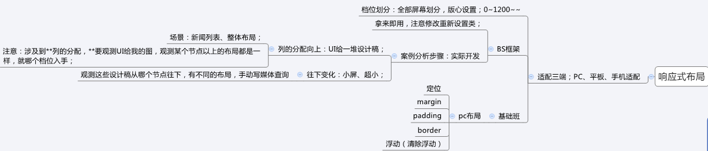

# 移动Web开发

## 流式布局

### 移动端基础

​		PC端常见浏览器
​			360浏览器、谷歌浏览器、火狐浏览器、QQ浏览器、百度浏览器、搜狗浏览器、IE浏览器

​		移动端常见浏览器
​			UC浏览器，QQ浏览器，欧朋浏览器，百度手机浏览器，360安全浏览器，谷歌浏览器，搜狗手机浏览器，猎豹浏览器，以及其他杂牌浏览器

​		兼容移动端主流浏览器，处理Webkit内核浏览器即可

### 手机屏幕现状

​		移动端设备屏幕尺寸非常多，碎片化严重

### 移动端调试方式

​		Chrome DevTools（谷歌浏览器）的模拟手机调试
​		搭建本地web服务器，手机和服务器一个局域网内，通过手机访问服务器使用外网服务器，直接IP或域名访问

### 视口

​	布局视口


​	视觉视口


理想视口

	

		为了使网站在移动端有最理想的浏览和阅读宽度而设定 
		理想视口，对设备来讲，是最理想的视口尺寸需要手动添写meta视口标签通知浏览器操作
### meta标签配置视口	

配置方式
```html
<meta name="viewport" content="width=device-width, user-scalable=no,initial-scale=1.0, maximum-scale=1.0, minimum-scale=1.0">
配置解析
		width
			宽度设置的是viewport宽度，可以设置device-width特殊值
		initial-scale
			初始缩放比，大于0的数字
		maximum-scale
			最大缩放比，大于0的数字
		minimum-scale
			最小缩放比，大于0的数字
		user-scalable
			用户是否可以缩放，yes或no（1或0）
```

标准视口设置
		- 视口宽度和设备保持一致
		- 视口的默认缩放比例1.0
		- 不允许用户自行缩放
		- 最大允许的缩放比例1.0
		- 最小允许的缩放比例1.0

### 二倍图

#### 	物理像素&物理像素比

		1. 什么物理像素？
			屏幕分辨率
		2. 什么是开发像素？
			css像素px
		3. 开发像素在PC端和屏幕分辨率比例是一致吗？
			一致
		4. 开发像素在移动端和屏幕分辨率比例一致吗？
			不一定一致，因为物理像素比可能不一样
		5. 什么是物理像素比？
			1个物理像素 = 多个开发像素
		6. 物理像素比的影响？
			问题：未来图片在移动端，因为物理像素比的存在，图片可能会放大而失真，影响用户体验
		7. 解决方案：设计素材人员，在设计图片时，以多倍的方式设置
		8 .Retina（视网膜屏幕）是一种显示技术，将把更多的物理像素点压缩至一块屏幕里，从而达到更高的分辨率，并提高屏幕显示的细腻程度

#### 	 多倍图

#### 	 背景缩放

```css
		background-size: 背景图片宽度 背景图片高度
			单位：像素|百分比|cover|contain;
			cover把背景图像扩展至足够大，以使背景图像完全覆盖背景区域
			contain把图像图像扩展至最大尺寸，以使其宽度和高度完全适应内容区域
			百分比，参照背景图所在的盒子大小
```

### 移动端开发选择

​	移动端主流方案:
​		1.单独制作移动端页面（主流）
​			京东商城手机版
​			淘宝触屏版
​			苏宁易购手机版
​		2.响应式页面兼容移动端（其次）
​			三星手机官网

​	单独移动端页面（主流）

​	响应式兼容PC移动端

### 移动端常见布局

#### 移动端技术选型


#### 流式布局

​	1.流式布局，就是**百分比布局**，也称非固定像素布局

​	2.通过**盒子的宽度设置成百分比**来根据屏幕的宽度来进行伸缩，不受固定像素的限制，内容向两侧填充

​	3.流式布局方式是移动web开发使用的比较常见的布局方式
​	          max-width   最大宽度 （max-height  最大高度）  
​	          min-width    最小宽度 （min-height  最小高度）

#### 移动端技术解决方案

##### 	移动端浏览器

​		移动端浏览器基本以 webkit 内核为主，因此我们就考虑webkit兼容性问题
​		我们可以放心使用 H5 标签和 CSS3 样式
​		同时我们浏览器的私有前缀我们只需要考虑添加 webkit 即可

##### 	CSS初始化 

​		移动端 CSS 初始化推荐使用 normalize.css
​			normalize.css：保护了有价值的默认值
​			normalize.css：修复了浏览器的bug
​			normalize.css：是模块化的
​			normalize.css：拥有详细的文档
​		下载地址：normalize.css

##### 	CSS3 盒子模型

​		传统模式宽度计算
​			盒子的宽度 =  CSS中设置的width + border + padding 

​		CSS3盒子模型
​			盒子的宽度 =  CSS中设置的宽度width 里面包含了 border 和 padding 

```css
		/*CSS3盒子模型*/
   		box-sizing: border-box;
        /*传统盒子模型*/
    	box-sizing: content-box;
```

##### 	特殊样式

```css
		/*CSS3盒子模型*/
   	 -webkit-box-sizing: border-box;

		/*点击高亮我们需要清除清除  设置为transparent 完成透明*/
     -webkit-tap-highlight-color: transparent;

		/*在移动端浏览器默认的外观在iOS上加上这个属性才能给按钮和输入框自定义样式*/
     -webkit-appearance: none;

		/*禁用长按页面时的弹出菜单*/
    img,a { -webkit-touch-callout: none; }
```

### 图片格式


### 扩展

​	`H5新增具有语义的布局标签：`
`​		header 头部标签`
`​		footer  底部标签`
`​		section 区块标签`
`​		article  文本内容标签`
`​		aside   侧边标签`
`​		nav 导航`

​	以往的布局标签
​		div   `division单词简写` 仅仅具有分割的作用，没有语义

## flex布局

### 传统布局和flex布局对比

​	传统布局：
​		1.兼容性好
​		2.布局繁琐
​		3.局限性，不能在移动端很好的布局

​	flex布局：
​		1.操作方便，布局极其简单，移动端使用比较广泛
​		2.pc端浏览器支持情况比较差
​		3.IE11或更低版本不支持flex或仅支持部分

​	建议：
​		1.如果是pc端页面布局，还是采用传统方式
​		2.如果是移动端或者是不考虑兼容的pc则采用flex

### flex布局原理

​	1.flex 是 flexible Box 的缩写，意为"弹性布局"，用来为盒状模型提供最大的灵活性，任何一个容器都可以指定为 flex 布局

​	2.当我们为父盒子设为 flex 布局以后，子元素的 float、clear 和 vertical-align 属性将失效

​	3.flex布局又叫伸缩布局 、弹性布局 、伸缩盒布局 、弹性盒布局 

​	4.采用 Flex 布局的元素，称为 Flex 容器（flex container），简称"容器"。它的所有子元素自动成为容器成员，称为 Flex 项目（flexitem），简称"项目"

​	5.总结：就是通过给父盒子添加flex属性，来控制子盒子的位置和排列方式

### 背景线性渐变	

```css
	background: linear-gradient(起始方向, 颜色1, 颜色2, ...);	
	background: -webkit-linear-gradient(left, red , blue);
	background: -webkit-linear-gradient(left top, red , blue);

	注意：
		背景渐变的值必须添加浏览器私有前缀
		起始方向可以是： 方位名词  或者 度数 ， 如果省略默认就是 top
```

### 子项常见属性

​		1.flex 属性定义子项目==分配容器的剩余空间==，用flex来表示占多少==份数==

​		2.align-self控制子项自己在侧轴上的排列方式

​		3.align-self 属性允许单个项目有与其他项目不一样的对齐方式，可覆盖 align-items 属性

​		4.order 属性定义项目的排列顺序,数值越小，排列越靠前，默认为0

### 父项常见属性

#### flex-direction：设置主轴的方向

​		在 flex 布局中，是分为主轴和侧轴两个方向，同样的叫法有 ： 行和列、x 轴和y 轴

​		默认主轴方向就是 x 轴方向，水平向右

​		默认侧轴方向就是 y 轴方向，水平向下

​		注意： 主轴和侧轴是会变化的，就看 flex-direction 设置谁为主轴，剩下的就是侧轴。而我们的子元素是跟着主轴来排列的
​		

####  justify-content：设置主轴上的子元素排列方式


#### flex-wrap：设置子元素是否换行 

​	1.默认情况下，项目都排在一条线（又称”轴线”）上。

​	2.flex-wrap属性定义，flex布局中默认是不换行的。

​		nowrap 不换行
​		wrap 换行

#### align-content：设置侧轴上的子元素的排列方式（多行）

​	设置子项在侧轴上的排列方式 并且只能用于子项出现 换行 的情况（多行），在单行下是没有效果的
​	

#### align-items：设置侧轴上的子元素排列方式（单行）

​	该属性是控制子项在侧轴（默认是y轴）上的排列方式  在子项为单项（单行）的时候使用

```css
	flex-start 从头部开始
	flex-end 从尾部开始
	center 居中显示
	stretch 拉伸(不能设置高度)

	flex-flow：复合属性，相当于同时设置了 flex-direction 和 flex-wrap
	flex-flow:row wrap;

	align-content 和align-items区别
	align-items  适用于单行情况下， 只有上对齐、下对齐、居中和 拉伸
	align-content适应于换行（多行）的情况下（单行情况下无效）， 可以设置 上对齐、下对齐、居中、拉伸以及平均分配剩余空间等属性值。 

	总结就是单行找align-items  多行找 align-content
```

## rem布局

### rem基础

​	rem (root em)是一个相对单位

​	rem:root指HTML的font-size大小

​	特点：绝对唯一控制，接近等比变化的第一步；只要你把PX单位换成rem单位

### 媒体查询

#### 	什么是媒体查询

​		语法：查询屏幕，响应屏幕变化

​		使用 @media查询，可以针对不同的媒体类型定义不同的样式

​		当你重置浏览器大小的过程中，页面也会根据浏览器的宽度和高度重新渲染页面 

​		目前针对很多苹果手机、Android手机，平板等设备都用得到多媒体查询

#### 	媒体查询语法规范

```css
		@media mediatype and|not|only (media feature) {
    		CSS-Code;
		}
```

​		1.mediatype  媒体类型（将不同的终端设备划分成不同的类型）


​		

​		2.关键字 and  not  only

​			and：可以将多个媒体特性连接到一起，相当于“且”的意思
​			not：排除某个媒体类型，相当于“非”的意思，可以省略
​			only：指定某个特定的媒体类型，可以省略


​		3.media feature 媒体特性必须有小括号包含

​			每种媒体类型都具体各自不同的特性，根据不同媒体类型的媒体特性设置不同的展示风格


​		

​		4.媒体查询书写规则

​			为了防止混乱，媒体查询我们按照从小到大或者从大到小的顺序来写,但是我们最喜欢的还是从小到大来写，这样代码更简洁

​		

​		5.档位划分

```css
			 /* 档位划分：习惯用min-width */

			@media screen and (min-width:0px) {
  			body {
    			background-color: red;
  				}
			}

			@media screen and (min-width:540px) {
  			body {
    			background-color: blue;
  				}
			}

			/* - 档位3 : 640px<=w */
			@media screen and (min-width:640px) {
  			body {
    			background-color: green;
  				}
			}
```

### rem适配方案

#### 	-rem布局-rem&媒体查询&less方案

​		档位：按照市场上所有手机尺寸形成各个档位的最小界值；
​		rem背后的值：按照各个档位除以 相同份数		

```css
@fenshu:10;

// 320~360

@media screen and (min-width: 320px) {
  html {
    font-size: 320px/@fenshu;
  }
}
// 360~375
@media screen and (min-width: 360px) {
  html {
    font-size: 360px/@fenshu;
  }
}
// 375 iphone 678
@media screen and (min-width: 375px) {
  html {
    font-size: 375px/@fenshu;
  }
}
// 384
@media screen and (min-width: 384px) {
  html {
    font-size: 384px/@fenshu;
  }
}
// 400
@media screen and (min-width: 400px) {
  html {
    font-size: 400px/@fenshu;
  }
}
// 414
@media screen and (min-width: 414px) {
  html {
    font-size: 414px/@fenshu;
  }

}
// 424
@media screen and (min-width: 424px) {
  html {
    font-size: 424px/@fenshu;
  }
}
// 480
@media screen and (min-width: 480px) {
  html {
    font-size: 480px/@fenshu;
  }
}
// 540
@media screen and (min-width: 540px) {
  html {
    font-size: 540px/@fenshu;
  }
}
// 720
@media screen and (min-width: 720px) {
  html {
    font-size: 720px/@fenshu;
  }
}
// 750
@media screen and (min-width: 750px) {
  html {
    font-size: 750px/@fenshu;
  }
}
```

#### rem实际开发适配方案1

​		第一步：原稿实现：先拿到设计稿：750px；页面上所有的元素，在750px设计稿上进行测量，代码实

​				现；（流式、flex）结果：所有的属性都写死了，写成固定的px值；

​		第二步：把PX单位属性替换为rem单位；

​				准备各个档位下的rem ：提前准备好各个档位下的HTML 的font-size大小；

​				拿到当前尺寸的rem：因为我现在是750px的设计稿，所以可以得到750px这个尺寸属于的档位

​				下的HTML 的font-size大小，也就是750px设计稿下的1rem值。1rem = 75px;  

​		约定：各个档位的最小值 / 相同的份数

​		计算比例：把页面刚才所有的元素的PX值替换为 rem 比例值；（82px  82/75rem）;

​		达到目标：那么，屏变化时，1rem(基础块)也会变化，自然就是等比缩放；

#### rem实际开发适配方案2

​	rem布局-rem&flexible.js方案
​		方案1：阶梯型变化，档位划分的不够细；
​		想要：1px划分一个档位；不现实（320~750）；
​		flexible.js：

- 默认划分10份
- 变化一点就算一次，足够细程度

## 响应式布局

### 响应原理

​	1.应式布局通过同一份代码快速、有效适配手机、平板、PC设备等所有的屏幕

​	2.位置：手机端(单独制作)；<-----响应式（三端）----->PC(单独制作)

​	3.响应布局的原理：媒体查询+百分比布局（浮动）；

​	4.rem布局也有媒体查询（设置HTML 字体大小 1rem=多少px），但是rem布局更侧重于等比变化；

### 档位划分

​	市场上默认的划分；三个节点、四个档位
​		xs : extra small    w<768  超小屏幕（手机，学习rem布局里面的档位划分都是在这个范围）

​		sm : small   768<= w <992  小屏设备  s（平板）

​		md: medium   992<= w <1200  中等屏幕 m（桌面显示器）

​		lg: large    1200<=w  大宽屏设备（大桌面显示器）
​		

```css
/* 1. 超小屏幕下 xs  小于 768  布局容器的宽度为 100% */
	@media screen and (max-width: 767px) {
}

/* 2. 小屏幕下 sm  大于等于768  布局容器改为 750px */
@media screen and (min-width: 768px) {
}

/* 3. 中等屏幕下 md 大于等于 992px   布局容器修改为 970px */
@media screen and (min-width: 992px) {
}

/* 4. 大屏幕下 lg 大于等于1200 布局容器修改为 1170 */
@media screen and (min-width: 1200px) {
}
```
### bootstrap框架

​	介绍
​		利用 框架 bootstrap 可非常快地搭建出响应式页面

			- 中文网：http://www.bootcss.com/

- 官网：http://getbootstrap.com/

- 推荐：http://bootstrap.css88.com/

- 使用初始化


  ```html
  <!DOCTYPE html>
  <html lang="zh-CN">
    <head>
      <meta charset="utf-8">
      <!-- 要求 当前网页 使用 IE浏览器 最高版本的内核 来渲染 -->
      <meta http-equiv="X-UA-Compatible" content="IE=edge">
      
      <!-- 视口的设置：视口的宽度和设备一致，默认的缩放比例和PC端一致，用户不能自行缩放 -->
      <meta name="viewport" content="width=device-width, initial-scale=1">
        
      <title>Bootstrap Template</title>
  
      <!-- Bootstrap 的文件引入 已经有初始化文件 Normalize.css-->
      <link href="css/bootstrap.min.css" rel="stylesheet">
        
     
      <!--解决ie9以下浏览器对 html5新增标签的不识别，并导致CSS不起作用的问题-->
      <!--解决ie9以下浏览器对 css3 Media Query  的不识别 -->
       
      <!-- 条件注释:小于IE9的版本 -->
      <!--[if lt IE 9]>
        <script src="//cdn.bootcss.com/html5shiv/3.7.2/html5shiv.min.js"></script>
        <script src="//cdn.bootcss.com/respond.js/1.4.2/respond.min.js"></script>
      <![endif]-->
    </head>
    <body>
      <h1>你好，世界！</h1>
    </body>
  </html>
  ```

  #### 布局容器

  ​	版心设置

  ​		1.Bootstrap 需要为页面内容包裹一个 .container 或者.container-fluid 容器
  ​		2.container：设置不同档位下的版心的宽度

  ​			超小屏（xs : extra small）：手机； 0px <=w ；版心宽度为100%

  ​			小屏（sm : small） ：平板； 768px<=w  ；版心宽度定为  750px

  ​			中屏（md: medium）：桌面；992px<=w ；版心宽度定为  970px

  ​			大屏（lg: large）：大桌面；1200px<=w ；版心宽度定为  1170px

  ​		3.特点

  ​			所有元素为CSS3盒子模型

  ​			布局盒子有左右15px的padding值

  #### 预制类

  ​	**排版**

  ```html
  <h1>h1. Bootstrap heading</h1>
  <h2>h2. Bootstrap heading</h2>
  <h3>h3. Bootstrap heading</h3>
  <h4>h4. Bootstrap heading</h4>
  <h5>h5. Bootstrap heading</h5>
  <h6>h6. Bootstrap heading</h6>
  ```

  ​	**按钮**

```html
	<a class="btn btn-default" href="#" role="button">Link</a>
	<button class="btn btn-default" type="submit">Button</button>
	<input class="btn btn-default" type="button" value="Input">
	<input class="btn btn-default" type="submit" value="Submit">
```
​		**辅助类样式**

```html
		<!-- 上下文颜色 -->
		<p class="text-muted">...</p>

		<!-- 下拉三角 -->
		<span class="caret"></span>
```
​		**字体图标**

```html
	<span class="glyphicon glyphicon-search" aria-hidden="true"></span>
```

### 栅格系统

#### 介绍

​			1.栅格系统，在各个档位下，控制子元素布局不同；将版心宽度均分为12份

​			2.各个档位下都有预制好的类前缀


​			3.类前缀

​					超小屏（xs : extra small）：手机；

​					小屏（sm : small） ：平板； 

​					中屏（md: medium）：桌面；

​					大屏（lg: large）：大桌面

#### 基本使用

​		1. 容器：有左右15padding

​		2. 盒子col-lg-：有左右15padding

​		3. 去除15padding：加div.row(左右-15pxmargin值，向外撑)

​		4. 所有元素：CSS3盒子模型；

#### 列嵌套

​		可以在已经分好的子元素中内部，继续进行列的划分（共12份）	

```html
		<!-- 直接嵌套 -->
		<div class="col-sm-4">
    		<div class="col-sm-6">小列</div>
    		<div class="col-sm-6">小列</div>
		</div>
```

```html
		<!-- 使用row嵌套 -->
		<div class="col-sm-4">
    	<!-- 加1个行 row 这样可以取消父元素的padding值 而且高度自动和父级一样高； -->
	    	<div class="row">
     		    <div class="col-sm-6">小列</div>
         		<div class="col-sm-6">小列</div>
    		</div>
		</div>
```
#### 列偏移

​		划分好的子项进行列的份数偏移

```html
		<!-- 左右对齐-->
		<div class="row">
    	<!-- 如果只有一个盒子 那么就偏移 = 12-4-4  -->
    		<div class="col-lg-4">1</div>
    		<div class="col-lg-4 col-lg-offset-4">2</div>
		</div>
```
```html
		<!-- 居中-->
		<div class="row">
     	<!-- 如果只有一个盒子 那么就偏移 = (12 - 8) /2 -->
     		<div class="col-md-8 col-md-offset-2">中间盒子</div>
		</div>
```

#### 列排序

​		划分份数的子项，按照列的份数进行排序

```html
		<!-- 列排序 -->
		<div class="row">
    		<div class="col-md-4 col-lg-4 col-lg-push-8"></div>
    		<div class="col-md-8 col-lg-8 col-lg-pull-4"></div>
		</div>
```
### 响应式工具

​		可以控制子元素在档位下进行显示或隐藏

 

# 总结




