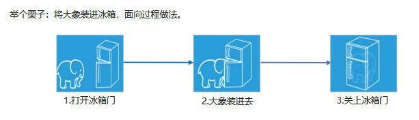
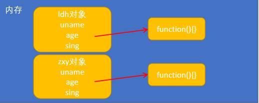
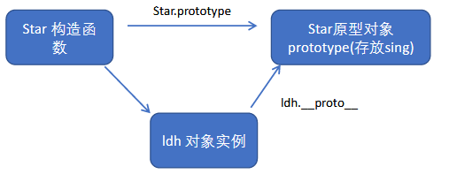

# 1. JavaScript面向对象

## 两大编程思想

### 	面向过程

​			**面向过程：POP(Process-oriented programming)**

> ​					面向过程就是分析出解决问题所需要的步骤，然后用函数把这些步骤一步一步实现，使用的时候再一个一个的依次调用就可以了。

​	    		大象放到冰箱：打开冰箱==》放入大象==》关上冰箱



### 	面向对象

​			**面向对象：OOP (Object Oriented Programming)**

> ​			面向对象是把事务分解成为一个个对象，然后由对象之间分工与合作。

​			大象，冰箱：都看成对象功能

### 	面向对象和过程区别

在

​			面向过程：小项目【例如一个人盖一个小狗窝】

​			面向对象：多人合作大项目【要盖高楼，一个人完成太慢，而且其他事情等等待】

​			**比如：**

​			一个人盖小狗窝，直接和泥，方砖，修饰既可

​			但是盖高楼的话，需要打地基，需要运输材料，需要财务结算等，此时不需要等，个做个的，效率			高【模块完成】

## 面向对象三大特性

​			封装性【已经把扫把功能准备好，负责开即可】

​			继承性【继承与拖拉机，会开拖拉机就会弄这个，继承自拖拉机】

​			多态性【可以放到一起，也可以单独拿下来，而且那个扫把坏了换哪个不影响其他的】


## 面向对象和过程的优缺点

​		**面向过程：**

​			优点：性能比面向对象高，步骤练习紧密

​			缺点：不好维护，不易多次使用及扩展		

​		**面向对象：**

​			优点：易维护，可复用，可扩展，灵活性高

​			缺点性能没有面向过程高

# ES6中的类和对象

## 类和对象的概念

​		**类：抽象**

​			类模拟抽象的，泛指的，对象是具体的

​			面向对象模拟现实世界，更贴近实际生活，生活照分为抽象事物和具体事物

​			比如：手机【两层含义：具体某个手机，和笼统的概念手机】

​				1、抽取，把对象的属性和行为封装成一个类

​				2、对类进行实例化, 获取类的对象

​		**对象：具体**

​				现实生活中：万物皆对象，对象是一个具体的事物，看得见摸得着的实物。例如，一本书、一

​			辆汽车、一个人可以是“对象”

​				在 JavaScript 中，对象是一组无序的相关属性和方法的集合，所有的事物都是对象，例如字符

​			串、数值、数组、函数等。

​		**对象是由属性和方法组成的**

​				属性：事物的特征，在对象中用属性来表示（常用名词）

​				方法：事物的行为，在对象中用方法来表示（常用动词）

​		**面向对象的思维特点:**

​	 			1. 抽取（抽象）对象共用的属性和行为组织(封装)成一个类(模板)

​				 2. 对类进行实例化, 获取类的对象

## 类class

> 在ES6中新增加了类的概念，可以使用class关键字声明一个类，之后以这个类来实例化对象。【构造函数实例化对象】

​		类抽象了对象的公共部分，它泛指某一大类（class）

​		对象特指某一个，通过类实例化一个具体的对象

​		例如：人有身高，体重等，但是具体的某个人也有这个属性

## 创建类

```js
		语法：class 类名 {}【构造函数语法】

		注意类名首字母大写

		类要抽取公共属性方法，定义一个类

```

​	代码

```js
		class Star {
		};

		var ldh = new Star();
		类就是构造函数的语法
```
## 类constructor构造函数

```js
		语法：
			class Star {
				constructor (uname,age){
					this.uname = uname;
					this.age = age;
				}
			}
```

​		    **注意**：1.类里面的方法不带function，直接写既可

​				2.类里面要有属性方法，属性方法要是想放到类里面，我们用constructor构造器

​				3.构造函数作用：接收参数，返回实例对象，new的时候主动执行，主要放一些公共的属性

​				4.constructor() 方法是类的构造函数(默认方法)， 传递参数,返回实例对象，通过new命令生

​				5.成对象实例时，自动调用该方法。

​				6.每个类里面一定有构造函数，如果没有显示定义, 类内部会自动给我们创建一个constructor() 

​				**7.this代表当前实力化对象，谁new就代表谁**

## 类添加方法

​		语法：注意方法和方法之间不能加逗号

```js
			class Star {
				constructor () {}
				sing () {}
				tiao () {}
			}
```

```js
			class 类名 { constructor(){}   方法名(){} }

			注意：类中定义属性，调用方法都得用this
            注意：方法之间不能加逗号分隔，同时方法不需要添加function 关键字
```

​		**总结：**

​				**类有对象的公共属性和方法，用class创建，class里面包含constructor和方法，我们把公共属性放到constructor里面，把公共方法直接往后写既可，但是注意不要加逗号**

## 类的继承

### 	extends

```js
			语法：
			class Father {}
			class Son extends Father{}

			注意：是子类继承父类
```

### 	super关键字

​			我们应用的过程中会遇到父类子类都有的属性，此时，没必要再写一次，可以直接调用父类的方法

​			super关键字用于访问和调用对象父类上的函数。调用父类的构造函数，也可以调用父类的普通函数

```js
		  当子类没有constructor的时候可以随意用父类的，但是如果子类也含有的话，constructor会返回实例，this的指向不同，不可以再直接使用父类的东西
```

#### 		**调用父类构造函数**

```js
			class F { constructor(name, age){} }

			class S extends F { constructor (name, age) { super(name,age); } }

			注意: 子类在构造函数中使用super, 必须放到this前面(必须先调用父类的构造方法,再使用子类构造方法
```

#### 		**调用父类普通函数**

```js
			class F { constructor(name, age){} say () {} }

			class S extends F { constructor (name, age) { super(name,age); } say () { 
                
            super.say() } }

			注意：如果子类也有相同的方法，优先指向子类，就近原则
```

​			    **总结：super调用父类的属性和方法，那么查找属性和方法的原则就近原则**

## 三个注意点

- 在ES6中类没有变量提升，所以必须先定义类，才能通过类实例化对象.
- **类里面的共有属性和方法一定要加this使用.【this.对象调用属性和方法】**
- 类里面的this指向问题
- **constructor 里面的this指向实例对象, 方法里面的this 指向这个方法的调用者**

```js
	class Button {

		constructor () {
			var btn = document.querySelector('input');
			btn.onclick = this.cli;
		}

		cli () {
		console.log('点击了');
		}
	}

	var anniu = new Button();
```

### 	类里面的this指向

​			`构造函数的this指向实例对象`

​			`普通函数的this是调用者，谁调用this是谁`

```js
			<input type="button" value="点击">
			var that;
			class F {
				constructor (name, age) {
					this.name = name;
					this.age = age;
					// console.log(this);
					that = this;
					this.btn = document.querySelector('input');
					this.btn.onclick = this.cli;
				}

				cli () {
					console.log(this);
				}

				say () {
					console.log(this);
				}
			}

			var obj = new F('刘德华',22);
```

# 案例-tab栏

​		this执行==》构造函数，new的对象，方法：this,调用者

## 	**面向对象版tab 栏切换**

```js
		1.tab栏切换的主要思路是：

		2.点击当前li 添加liactive 类其余li移除类

		3.根据当前li 的索引号当前section 添加类，其余section 删除类

		4.这里可以把添加放入切换函数里面

		5.新增一个清除类函数，专门移除其余li和section 类

		6.注意里面this 指向问题
```

## 	**面向对象版tab 栏切换添加功能**

```js
		1.点击+ 可以实现添加新的选项卡和内容

		2.第一步: 创建新的选项卡li 和新的内容section
	
		3.第二步: 把创建的两个元素追加到对应的父元素中.

		4.以前的做法:  动态创建元素createElement, 但是元素里面内容较多, 需要innerHTML赋值,在						appendChild追加到父元素里面.

		5.现在高级做法:   利用insertAdjacentHTML() 可以直接把字符串格式元素添加到父元素中

		6.appendChild不支持追加字符串的子元素, insertAdjacentHTML支持追加字符串的元素

		7.insertAdjacentHTML(追加的位置,‘要追加的字符串元素’)  

		8.追加的位置有: beforeend插入元素内部的最后一个子节点之后

		9.该方法地址:
			   https://developer.mozilla.org/zhCN/docs/Web/API/Element/insertAdjacentHTML
```

# ES5

## ES5介绍

​	在典型的OOP 的语言中（如Java），都存在类的概念，类就是对象的模板，对象就是类的实例，但在ES6之

前，JS 中并没用引入类的概念。

​	ES6，全称ECMAScript6.0 ，2015.06 发版。但是目前浏览器的JavaScript 是ES5 版本，大多数高版本的浏览

器也支持ES6，不过只实现了ES6 的部分特性和功能。

​	在ES6之前，对象不是基于类创建的，而是用一种称为构建函数的特殊函数来定义对象和它们的特征。

## 创建对象

### 	对象字面量

```JS
	 		var obj = {
		 		name : '张三丰',
		 		age : 22
		 		tiaji : function () {}
		 	};
		 	console.log( obj.name );
```

### 	new Object()【构造函数】

```js
			var obj = new Object();
			obj.uname = '李寻欢';
			obj.age = 22;
			obj.abc = function () {}
			console.log( obj.uname );

			// var obj1 = new Object();
			// obj1.name = name;
			// obj1.age = age;
```
### 	自定义构造函数

```js
			function Gou (uname,age) {	
                //公共属性
				this.uname = uname;
				this.age = age;
                
				//定义方法
				this.jiao = function () {
					console.log('汪汪叫');
				}

				this.tiao = function () {
					console.log('跳起来');
				}
			}
			//实例化对象
			var obj = new Gou('大黄',2);
			//调用方法
			obj.jiao();
```
## 构造函数和原型

​	**构造函数：**

​			  是一种特殊的函数，主要用来初始化对象，即为对象成员变量赋初始值，它总与new一起使用。

​			   我们可以把对象中一些公共的属性和方法抽取出来，然后封装到这个函数里面。

​	**在JS 中，使用构造函数时要注意以下两点：**

​			1.构造函数用于创建某一类对象，其首字母要大写

​			2.构造函数要和new 一起使用才有意义

​	`new在执行时会做四件事情：`

​			`1. 在内存中创建一个新的空对象。`

​			`2. 让this指向这个新的对象。`

​			`3. 执行构造函数里面的代码，给这个新对象添加属性和方法。`

​			`4. 返回这个新对象（所以构造函数里面不需要return）。`

## 静态成员和实例成员

​	JavaScript 的构造函数中可以添加一些成员，可以在构造函数本身上添加，也可以在构造函数内部的this 上添

加。通过这两种方式添加的成员，就分别称为静态成员和实例成员。

​	**静态成员：**不需要new直接用的属性

​	**实例成员：**必须new之后在调用的属性

### 	静态成员

​			在构造函数本身上添加的成员称为静态成员，只能由构造函数本身来访问

```js
				var obj = {
					name : '张三丰',
					age : 22,
					taiji : function () {alert('打太极')}
				};
				obj.taiji();

				// 属性，键值对，成员
```
### 	实例成员

​			在构造函数内部创建的对象成员称为实例成员，只能由实例化的对象来访问	

```js
			function Star (uname,age) {
				this.uname = uname;
				this.age = age;
			}

			var obj = new Star('张三丰',22);
			console.log(obj.uname);

			// 直接往构造函数上添加一个score属性
			Star.score = 99;
			console.log(Star.score);
```

## 构造函数小问题

```js
		当实例化对象的时候，属性好理解，属性名属性值，那么方法是函数，函数是复杂数据类型

		那么保存的时候是保存地址，又指向函数，而每创建一个对象，都会有一个函数，每个函数都得开辟一个内

		存空间，此时浪费内存了，那么如何节省内存呢，我们需要用到原型
```

```js
		function Star (uname, age) {
			this.uname = uname;
			this.age = age;
			this.sing = function () {
			console.log(this.name + '在唱歌');
			}
		}

		var ldh = new Star('周星驰', 22);
		var ldh = new Star('刘德华', 22);
```
  

## 构造函数prototype

​	什么是原型对象：就是一个属性，这个属性是一个对象，我们也称呼，prototype 为原型对象。

​	作用：是为了共享方法，从而达到节省内存

​	**注意：每一个构造函数都有prototype属性**

```js
		例如：大家来学校上学，有的开车，有的汽车，有的开飞机，此时浪费，那么准备一个大巴车，方便有节省
```

> ​	构造函数通过原型分配的函数是所有对象所共享的。
>
> ​	JavaScript 规定，每一个构造函数都有一个prototype 属性，指向另一个对象。注意这个prototype 就是
>
> 一个对象，这个对象的所有属性和方法，都会被构造函数所拥有。我们可以把那些不变的方法，直接定义在
>
> prototype 对象上，这样所有对象的实例就可以共享这些方法。

```js
		function Star(name,age) {
        	this.name = name;
       		this.age = age;  
    	}
    	Star.prototype = {
            //指回
        	constructor: Star,
            //定义方法
        	sing : function () {
            	console.log("嫦娥");    
        	},
        	chang : function () {
            	console.log("高边");  
        	}
    	}

    	var zsf = new Star("张三分", 22);
    	zsf.sing();
    	zsf.chang();
    	console.log(Star.prototype.constructor);
```

​	总结：`所有的公共属性写到构造函数里面，所有的公共方法写到原型对象里面`

## 对象原型：____proto____

​    	构造函数和原型对象都会有一个属性__proto__ 指向构造函数的prototype 原型对象，之所以我们对象可以使用构

造函数prototype 原型对象的属性和方法，就是因为对象有__proto__ 原型的存在。

> ```js
> 注意：____proto____是一个非标准属性，不可以拿来赋值或者设置【只读属性】
>  	 ____proto____对象原型和原型对象prototype 是等价的
>      ____proto____对象原型的意义就在于为对象的查找机制提供一个方向，或者说一条路线，但是它是一个非标准属性，因此实际开发中，不可以使用这个属性，它只是内部指向原型对象prototype
> ```




**总结：每一个对象都有一个原型，作用是指向原型对象prototype**

**统一称呼：proto原型，prototype成为原型对象**

## constructor  构造函数

> <u>**记录是哪个构造函数创建出来的**</u>
>
> 指回构造函数本身

​	原型（__proto__）和构造函数（prototype）原型对象里面都有一个属性constructor属性，constructor 我们称

为构造函数，因为它指回构造函数本身。

​	constructor 主要用于记录该对象引用于哪个构造函数，它可以让原型对象重新指向原来的构造函数。

​	一般情况下，对象的方法都在构造函数的原型对象中设置。如果有多个对象的方法，我们可以给原型对象采

取对象形式赋值，但是这样就会覆盖构造函数原型对象原来的内容，这样修改后的原型对象constructor  就不再指

向当前构造函数了。此时，我们可以在修改后的原型对象中，添加一个constructor 指向原来的构造函数。

​	**总结：constructor  主要作用可以指回原来的构造函数  **    **constructor：构造函数**

## 构造函数、实例、原型对象三者之间的关系


​	**prototype**：原型对象，每一个构造函数都有这个属性

​	____**proto**____：对象原型，每一个实例对象都有这个属性，这个属性的作用就是指向prototype

​	**constructor**：构造函数，prototype，____proto____都有这个属性，这个属性的作用指回构造函数

## `原型链`

```
作用；提供一个成员的查找机制，或者查找规则
```


## 成员查找机制(规则)

```js
    当访问一个对象的属性（包括方法）时，首先查找这个对象自身有没有该属性。
		如果没有就查找它的原型（也就是__proto__指向的prototype 原型对象）。

		如果还没有就查找原型对象的原型（Object的原型对象）。

		依此类推一直找到Object 为止（null）。

		__proto__对象原型的意义就在于为对象成员查找机制提供一个方向，或者说一条路线。

		// console.log(Star.prototype.__proto__.__proto__);
		// console.log(Object.prototype);
```

## 扩展内置对象

```
		可以通过原型对象，对原来的内置对象进行扩展自定义的方法。比如给数组增加自定义求偶数和的功能。
```

```js
		console.log( Array.prototype );
		// 添加求和方法
		Array.prototype.sum = function () {
			var sum = 0;
			for (var i = 0; i < this.length; i++) {
				sum += this[i];
			}
			return sum;
		}

		var arr = [1,2,3];
		console.log( arr.sum() );

		var newArr = [6,7,8,9];
		console.log( newArr.sum() );
```

## 继承

​		ES6之前并没有给我们提供extends 继承。我们可以通过构造函数+原型对象模拟实现继承，被称为组合

继承。

### 	属性的继承

​			**call()**: 调用这个函数, 并且修改函数运行时的this 指向

​			**fun.call(thisArg, arg1, arg2, ...);**call把父类的this指向子类

​			thisArg ：当前调用函数this 的指向对象

​			arg1，arg2：传递的其他参数

```js
			function Father (uname,age) {
				// this指向父类的实例对象
				this.uname = uname;
				this.age = age;
				// 只要把父类的this指向子类的this既可
			}
			function Son (uname, age,score) {
				// this指向子类构造函数
				// this.uname = uname;
				// this.age = age;
				// Father(uname,age);
				Father.call(this,uname,age);
				this.score = score;
			}
			Son.prototype.sing = function () {
				console.log(this.uname + '唱歌')
			}
			var obj = new Son('刘德华',22,99);
			console.log(obj.uname);
			console.log(obj.score);
			obj.sing();
```

### 	方法的继承

​			实现方法：**把父类的实例对象保存给子类的原型对象**

​			一般情况下，对象的方法都在构造函数的原型对象中设置，通过构造函数无法继承父类方法。

​			**核心原理：**

​					①将子类所共享的方法提取出来**，让子类的prototype 原型对象= new 父类()**  

​					②本质：子类原型对象等于是实例化父类，因为父类实例化之后另外开辟空间，就不会影

​							响原来父类原型对象

​					③将子类的constructor 从新指向子类的构造函数

```js
				function Father () {
				}
				Father.prototype.chang = function () {
					console.log('唱歌');
				}

				function Son () {
				}

				Son.prototype = new Father();
				var obj = new Son();
				obj.chang();

				Son.prototype.score = function () {
					console.log('考试');
				}

				// obj.score();
				// console.log(Son.prototype);
				console.log(Father.prototype);
```

​		**注意：一定要让Son指回构造函数**

```js
				Son.prototype = new Father();

				Son.prototype.constructor = Son;
```

**总结：用构造函数实线属性继承，用原型对象实线方法继承**

# ES6类的本质

```js
	class本质还是function

	类的所有方法都定义在类的prototype属性上

	类创建的实例,里面也有__proto__ 指向类的prototype原型对象

	所以ES6的类它的绝大部分功能，ES5都可以做到，新的class写法只是让对象原型的写法更加清晰、更像面向对象
	
	编程的语法而已。

	所以ES6的类其实就是语法糖.

	语法糖:语法糖就是一种便捷写法.
	简单理解, 有两种方法可以实现同样的功能, 但是一种写法更加清晰、方便,那么这个方法就是语法糖
```

# ES5 中的新增方法

```js
	ES5 中给我们新增了一些方法，可以很方便的操作数组或者字符串，这些方法主要包括：

	数组方法

	字符串方法
```

## 数组方法

```js
	迭代(遍历)方法：forEach()、map()、filter()、some()、every()；这些方法都是遍历数组的
```

### 		forEach()

```js
		array.forEach(function(currentValue, index, arr))

		currentValue：数组当前项的值
		index：数组当前项的索引
		arr：数组对象本身
```

```js
		var arr = ['red','blue','yellow','orange'];

		arr.forEach(function (elm,i,arrAbc) {
			console.log(elm,i,arrAbc);
		});
```

### 		filter()

```js
		array.filter(function(currentValue, index, arr))

		filter() 方法创建一个新的数组，新数组中的元素是通过检查指定数组中符合条件的所有元素,用于筛选数组

		注意：它直接返回一个新数组

		currentValue: 数组当前项的值
		index：数组当前项的索引
		arr：数组对象本身回调函数里面添加return添加返回条件
```

```js
		var arr = [100,66,99,123,333,33,44,66];
		var reArr = arr.filter(function (elm, a, n) {

		// console.log(elm,a, n);
		return elm % 2 == 0;
		});

		console.log(reArr);
```

### 		some()

```js
		array.some(function(currentValue, index, arr)) 【注意：找到或者满足条件立刻停止】

		some() 方法用于检测数组中的元素是否满足指定条件. 通俗点查找数组中是否有满足条件的元素

		注意：它返回值是布尔值, 如果查找到这个元素, 就返回true , 如果查找不到就返回false.

		如果找到第一个满足条件的元素,则终止循环. 不在继续查找.

		currentValue: 数组当前项的值index：数组当前项的索引
		arr：数组对象本身
```

```js
		var arr = [100,200,300,400];
		var re = arr.some(function (elm,i,arr) {
			// console.log(elm,i,arr);
			console.log(i);
			return elm >= 200;
		});
		console.log(re);
```

# 案例-查询商品

```js
<!DOCTYPE html>
<html lang="en">

<head>
    <meta charset="UTF-8">
    <meta name="viewport" content="width=device-width, initial-scale=1.0">
    <meta http-equiv="X-UA-Compatible" content="ie=edge">
    <title>Document</title>
    <style>
        table {
            width: 400px;
            border: 1px solid #000;
            border-collapse: collapse;
            margin: 0 auto;
        }
        
        td,
        th {
            border: 1px solid #000;
            text-align: center;
        }

        input {
            width: 50px;
        }

        .search {
            width: 600px;
            margin: 20px auto;
        }
    </style>
</head>

<body>
    <div class="search">
        按照价格查询: <input type="text" class="start"> - <input type="text" class="end"> <button
            class="search-price">搜索</button> 按照商品名称查询:
        <select name="" id="sele">
            <option value="0">--请选择商品名称--</option>
            <option value="1">小米</option>
            <option value="2">oppo</option>
            <option value="3">荣耀</option>
            <option value="4">华为</option>
            <option value="5">苹果</option>
        </select>

    </div>
    <table>
        <thead>
            <tr>
                <th>id</th>
                <th>产品名称</th>
                <th>价格</th>
            </tr>
        </thead>
        <tbody>
            <!-- <tr><td>1</td><td>1</td><td>1</td></tr> -->
        </tbody>
    </table>
    <script>
        // 利用新增数组方法操作数据
        var data = [{
            id: 1,
            pname: '小米',
            price: 3999
        }, {
            id: 2,
            pname: 'oppo',
            price: 999
        }, {
            id: 3,
            pname: '荣耀',
            price: 1299
        }, {
            id: 4,
            pname: '华为',
            price: 1999
        }, {
            id: 5,
            pname: '苹果',
            price: 6999
        },];
        // var data = [{},{},{}];

        // 获取元素
        var tbody = document.querySelector('tbody');
        var btn = document.querySelector('.search-price');
        var start = document.querySelector('.start');
        var end = document.querySelector('.end');
        var sele = document.querySelector('#sele');
        // forEach封装
        function bianli(data) {
            data.forEach(function (ele, i) {
                // console.log(ele);
                var tr = '<tr><td>' + ele.id + '</td><td>' + ele.pname + '</td><td>' + ele.price + '</td></tr>';
                // 添加内容
                tbody.insertAdjacentHTML('beforeend', tr);
            });
        }

        // 1、展示商品
        bianli(data);
        // 2、点击搜索
        btn.onclick = function () {
            // 遍历数组
            var reArr = data.filter(function (ele, i) {
                // 查找所有商品，看看商品的价格是否符合要求
                return start.value <= ele.price && ele.price <= end.value;
            });
            tbody.innerHTML = '';
            bianli(reArr);
        }
        // 3、下拉选择
        // 选择商品的value,根据这个value值找到对应上午id值，吧这个对应上午id值得商品展示出来即可
        sele.onchange = function () {
            // 获取value值
            var val = sele.value;
            var arr = [];
            // 遍历数组【data数组中有没有对应的id值和val相同。找到后放入页面中】
            data.some(function (ele, i) {
                if (val ==0) {
                    arr = data;
                    return;
                }
                if (ele.id == val) {
                    arr.push(ele);
                    return true;
                }
            });
            tbody.innerHTML ="";
            bianli(arr);
        }
    </script>
</body>
</html>
```

# 字符串方法

```js
	str.trim()
	trim：删除字符串两侧的空白符
```

# 函数进阶

## 	函数的定义和调用

### 			命名函数

​					函数声明方式function 关键字()

```js
 					function fn () {
						console.log('函数');
					}
					fn();
```

### 			自调用函数

​					函数表达式(匿名函数)

```js
					(function (a) {
						console.log(a);
					})(1);
```

### 		了解

```js
					new Function()   var fn = new Function('参数1','参数2'..., '函数体')

					var fn = new Function('a','b','console.log(a,b);');

					fn(123,456);
```

### 		注意

​					1. Function 里面参数都必须是字符串格式

​					2. 第三种方式执行效率低，也不方便书写，因此较少使用

​					3. 所有函数都是Function 的实例(对象) 

​					4. 函数也属于对象

# 函数的调用方式

​					1. 普通函数

​					2. 对象的方法

​					3. 构造函数

​					4. 绑定事件函数

​					5. 定时器函数

​					6. 立即执行函数

# this指向

​	**this：当前调用者**


# 改变函数内部this 指向

​	    JavaScript 为我们专门提供了一些函数方法来帮我们更优雅的处理函数内部this 的指向问题，常用的有

bind()、call()、apply() 三种方法。

## 	call 方法

```js
			call() 方法调用一个对象。简单理解为调用函数的方式，但是它可以改变函数的this 指向。

			fun.call(thisArg, arg1, arg2, ...)
			thisArg：在fun 函数运行时指定的this 值
			arg1，arg2：传递的其他参数

			返回值就是函数的返回值，因为它就是调用函数

			function Father () {this}
			function Son () { Father.call(this,1,2) }

			因此当我们想改变this 指向，同时想调用这个函数的时候，可以使用call，比如继承
```

## 	apply 方法

```js
			fun.apply(thisArg, [argsArray]):调用函数

			thisArg：在fun函数运行时指定的this值
			argsArray：传递的值，必须包含在数组里面

			返回值就是函数的返回值，因为它就是调用函数

			因此apply 主要跟数组有关系，比如使用Math.max() 求数组的最大值

			var arr = [23,45,56,23,54];
			var n = Math.max.apply(null,arr);
			console.log(n);
```

## 	bind 方法

```js
			bind() 方法不会调用函数。但是能改变函数内部this 指向

			fun.bind(thisArg, arg1, arg2, ...)

			thisArg：在fun 函数运行时指定的this 值
			arg1，arg2：传递的其他参数

			返回由指定的this 值和初始化参数改造的原函数拷贝

			因此当我们只是想改变this 指向，并且不想调用这个函数的时候，可以使用bind

			var btn = document.querySelector('input');
			btn.onclick = function () {
				this.disabled = true;
				window.setTimeout(function () {
					this.disabled = false;
				}.bind(btn),2000);
			}
```

## 	call  apply  bind 总结

```js
			fun.call(obj,arg1,arg2......);
			fun.apply(obj,[a,b,c])
			fun.bind(obj,arg1,arg2......);
```

```js
			相同点:  都可以改变函数内部的this指向.

			区别点:  
					1.call 和apply  会调用函数, 并且改变函数内部this指向.
					2.call 和apply 传递的参数不一样, call 传递参数aru1, aru2..形式apply 必须数组形式[arg]
					3.bind 不会调用函数, 可以改变函数内部this指向

			主要应用场景:  
						1.call 经常做继承. 
						2.apply 经常跟数组有关系.比如借助于数学对象实现数组最大值最小值
						3.bind  不调用函数,但是还想改变this指向. 比如改变定时器内部的this指向
```

# 严格模式

​	JS：两种模式[类似于HTML版本]

​		1、正常模式

​		2、严格模式

## 	严格模式

```js
			JavaScript 除了提供正常模式外，还提供了严格模式（strictmode）。ES5 的严格模式是采用具有限制性JavaScript 变体的一种方式，即在严格的条件下运行JS 代码。
			严格模式在IE10 以上版本的浏览器中才会被支持，旧版本浏览器中会被忽略。
			严格模式对正常的JavaScript 语义做了一些更改：

			1.消除Javascript语法的一些不合理、不严谨之处，减少一些怪异行为【例如变量，不声明就报错】
			2.消除代码运行的一些不安全之处，保证代码运行的安全。
			3.提高编译器效率，增加运行速度。
			4.禁用了在ECMAScript的未来版本中可能会定义的一些语法，为未来新版本的Javascript做好铺垫。
              比如一些保留字如：class, enum, export, extends, import, super 不能做变量名
```

## 	开启严格模式

​				开启严格模式："use strict"

```js
				<script>"use strict"</script>：脚本开启严格模式
				<script>function fn () {"use strict"}</script>为函数开启严格模式
```

​					严格模式可以应用到整个脚本或个别函数中。因此在使用时，我们可以将严格模式分为为

​			脚本开启严格模式和为函数开启严格模式两种情况。

### 		**为脚本开启严格模式**

```js
			为整个脚本文件开启严格模式，需要在所有语句之前放一个特定语句“use strict”;（或‘use strict’;）。

				<script>
					"use strict";
					console.log("这是严格模式。");
				</script>

				因为"use strict"加了引号，所以老版本的浏览器会把它当作一行普通字符串而忽略。
```

### 		**为函数开启严格模式**

```js
			要给某个函数开启严格模式，需要把“use strict”;  (或'use strict'; ) 声明放在函数体所有语句之前。

				function fn(){
                    "use strict";
                    return "这是严格模式。";
                }

				将"use strict"放在函数体的第一行，则整个函数以"严格模式"运行。
```

## 	严格模式中的变化

​			严格模式对Javascript的语法和行为，都做了一些改变。

### 		**变量规定**

​					**变量申明必须加var，而且不准删除变量**

```js
	  在正常模式中，如果一个变量没有声明就赋值，默认是全局变量。严格模式禁止这种用法，变量都必须先用var命令声明，然后再使用。
                   n = 3;
      严禁删除已经声明变量。例如，delete x; 语法是错误的。
```

### 		**严格模式下this 指向问题**

​				严格模式下，普通函数this是undefined

```js
				以前在全局作用域函数中的this 指向window 对象。
				严格模式下全局作用域中函数中的this是undefined。

				其他的没有变化：
				以前构造函数时不加new也可以调用,当普通函数，this 指向全局对象
				严格模式下,如果构造函数不加new调用, this 指向的是undefined 如果给他赋值则会报错
				new 实例化的构造函数指向创建的对象实例。
				定时器this 还是指向window 。
				事件、对象还是指向调用者。
```

### 		**函数变化**

​				参数不能重名

```js
				函数不能有重名的参数。

				函数必须声明在顶层.新版本的JavaScript 会引入“块级作用域”（ES6 中已引入）。为了与新版本接轨，不允许在非函数                 的代码块内声明函数。【if，for等里面定义函数也不可以，但是现在不可以】

            更多严格模式要求参考：https://developer.mozilla.org/zh-CN/docs/Web/JavaScript/Reference/Strict_mode				           		

				错误写法:
						function fn (a,a) {console.log(a+a);}
						fn(1,2);

```

# 高阶函数

​		高阶函数是对其他函数进行操作的函数，它接收函数作为参数或将函数作为返回值输出。

​		此时fn就是一个高阶函数

​		函数也是一种数据类型，同样可以作为参数，传递给另外一个参数使用。最典型的就是作为回调函数。

​		同理函数也可以作为返回值传递回来

```js
		<script>
			function fn(callback){
				callback&&callback();
			}
			fn(function(){
				alert('hi')
			})
		</script>

		<script>
			function fn(){
				return function() {}
			}
			fn();
		</script>
```

# 闭包

## 	变量作用域

​			变量根据作用域的不同分为两种：全局变量和局部变量。

```js
			1. 函数内部可以使用全局变量。
			2. 函数外部不可以使用局部变量。
			3. 当函数执行完毕，本作用域内的局部变量会销毁。
```

## **什么是闭包**

​		**闭包作用：延伸变量的作用范围。**

```js
		闭包（closure）指有权访问另一个函数作用域中变量的函数。【很多种解释，都并不权威】
		简单理解就是，一个作用域可以访问另外一个函数内部的局部变量。

		<script>
			function fn1(){
				// fn1 就是闭包函数
				var num = 10;
				function fn2(){
				console.log(num); // 10
				}
			fn2()
			}
		fn1();
		</script>
```

​		**思考：如何在函数外面访问到函数内部的变量**

```js
		function fn () {

			var i = 7;
			return function () {
			console.log(i);
		}
			// function fn1 () {
			// 	console.log(i);
			// }
			// fn1();
		}
		var n = fn();
		n();
```

## 	练习

```js
			注册事件练习：打印索引值
			var lis = document.querySelectorAll('li');

			for (var i = 0; i < lis.length; i++) {

				(function (index) {
					lis[index].onclick = function () {
					console.log(index);
					}
				})(i);
			}
```


课程回顾：

​	函数：定义调用

​	this指向：call，apply，bind【fun.XXX()】

​	严格模式："use strict"

​	高阶函数：把函数当做参数或者返回值传递

​	闭包：一个作用域访问另外一个函数里面的局部变量

​		function fn () {

​			this.name : '张三丰';

​			var n = 3;

​			function () {

​				console.log(n);

​			}

​		}


# 递归

## 	递归介绍

```
递归：**如果一个函数在内部可以调用其本身，那么这个函数就是递归函数。简单理解:函数内部自己调用自己, 这个函数就是递归函数

递归：函数调用函数其本身

**注意：**递归函数的作用和循环效果一样，由于递归很容易发生“栈溢出”错误（stack overflow），所以必须要加退出条件return。
```

### 		练习

```js
		利用递归求1~n的阶乘

		//利用递归函数求1~n的阶乘 1 * 2 * 3 * 4 * ..n
 		function fn(n) {
     		if (n == 1) { //结束条件
       			return 1;
     		}
     		return n * fn(n - 1);
 		}
 		console.log(fn(3));
```

```js
		利用递归求斐波那契数列

		// 利用递归函数求斐波那契数列(兔子序列)  1、1、2、3、5、8、13、21...
		// 用户输入一个数字 n 就可以求出 这个数字对应的兔子序列值
		// 我们只需要知道用户输入的n 的前面两项(n-1 n-2)就可以计算出n 对应的序列值
		function fb(n) {
  			if (n === 1 || n === 2) {
        		return 1;
  			}
  			return fb(n - 1) + fb(n - 2);
		}
		console.log(fb(3));


		羊村：50人家，每户一只羊
			 每户只能看别人家的羊有木有病
			 每户只能杀自己家的羊
			 第一天，第二天 ,第三天，砰砰砰几声枪响，问杀了几只羊
```

```js
		利用递归遍历数据

			var data = [
				{
					id : 1,
					name : '家电'
				},
				{
					id : 2,
					name : '服饰'
				}
			];

			var data = [{
   				id: 1,
   				name: '家电',
  				goods: [{
     				id: 11,
     				gname: '冰箱',
     				goods: [{
      					 id: 111,
       					 gname: '海尔'
     				}, {
       					id: 112,
      			 		gname: '美的'
     				},
            	]
  				}, {
     				id: 12,
     				gname: '洗衣机'
  				}]
 				}, {
   					id: 2,
   					name: '服饰'
					}];
				//1.利用 forEach 去遍历里面的每一个对象
 				function getID(json, id) {
   				var o = {};
   				json.forEach(function(item) {
     			// console.log(item); // 2个数组元素
     			if (item.id == id) {
      			// console.log(item);
       			o = item;
  
       			// 2. 我们想要得里层的数据 11 12 可以利用递归函数
       			// 里面应该有goods这个数组并且数组的长度不为 0 
     			} else if (item.goods && item.goods.length > 0) {
       				o = getID(item.goods, id);
     			}
   				});
  				 return o;
				}
```

## 深拷贝和浅拷贝

​	**拷贝不能直接赋值，对象赋值的是地址**

```js
	var obj = {
		name : '张三丰',
		age : 22
	};
	var newObj = obj;
	console.log(newObj);
```

### 	浅拷贝

​			**只拷贝最外面一层** 拷贝的是地址会随着被拷贝的变动

```js
			var obj = {
				name : '张三丰',
				age : 22
			};

			var newObj = {};
			for (key in obj) {
				newObj[key] = obj[key];
			}

			console.log(newObj);
		
			es6：新方法
			Object.assign(target, sources);

			console.log(newObj);

```

### 	深拷贝 

​		拷贝所有属性，且拷贝后的数据不会随着被拷贝的变化而变化

```js
			var obj = {
				name : '1张三丰',
				age : 22,
				messige : {
					sex : '男',
					score : 16
				},
				color : ['red','purple','qing']
			}

			var newObj = {};
			function kaobei (newObj,obj) {
				for (key in obj) {
					if (obj[key] instanceof Array) {
						newObj[key] = [];
						kaobei(newObj[key],obj[key]);
					} else if (obj[key] instanceof Object) {
						newObj[key] = {};
						kaobei(newObj[key],obj[key])
					} else {
						newObj[key] = obj[key];
					}
				}
			}
			obj.messige.sex = 99;
			kaobei(newObj,obj);
			console.log(newObj);
```

# 正则表达式	

## 	正则表达式概述

```js
		  正则表达式（ Regular Expression ）是用于匹配字符串中字符组合的模式。在JavaScript中，正则表达式也是对象。

		  作用：检索关键字，过滤敏感字符，表单验证

		  正则表通常被用来检索、替换那些符合某个模式（规则）的文本，例如验证表单：用户名表单只能输入英文字母、数字或者下划线， 昵称输入框中可以输入中文(匹配)。此外，正则表达式还常用于过滤掉页面内容中的一些敏感词(替换)，或从字符串中获取我们想要的特定部分(提取)等 。

	   其他语言也会使用正则表达式，本阶段我们主要是利用JavaScript 正则表达式完成表单验证。
```

## 	正则表达式的特点

```js
		1. 灵活性、逻辑性和功能性非常的强。
		2. 可以迅速地用极简单的方式达到字符串的复杂控制。
		3. 对于刚接触的人来说，比较晦涩难懂。比如：^\w+([-+.]\w+)@\w+([-.]\w+).\w+([-.]\w+)*$
		4. 实际开发,一般都是直接复制写好的正则表达式. 但是要求会使用正则表达式并且根据实际情况修改正则表达式.   
           比如用户名:/^[a-z0-9_-]{3,16}$/
```

## 	正则表达式在js中的使用

### 		**创建正则表达式**

```js
				在 JavaScript 中，可以通过两种方式创建一个正则表达式。

				方式一：通过调用RegExp对象的构造函数创建 

    					var regexp = new RegExp(/123/);
    					console.log(regexp);

				方式二：利用字面量创建 正则表达式

     					var rg = /abc/; 含义：只要包含abc就可以
```

### 		测试正则表达式 

```js
				test() 正则对象方法，用于检测字符串是否符合该规则，该对象会返回 true 或 false，其参数是测试字符串

				注意正则里面没有引号
						regexObj.test(str);
						regexObj：正则表达式
						str：用户输入字符串

					var rg = /123/;
					console.log(rg.test(123));//匹配字符中是否出现123  出现结果为true
					console.log(rg.test('abc'));//匹配字符中是否出现123 未出现结果为false
```

## 正则表达式中的特殊字符

### 	正则表达式的组成

```js
		 正则表达式可以由简单的字符构成，比如 /abc/，也可以是简单和特殊字符的组合，比如 /ab*c/ 。其中特殊字符也被称为元字符，在正则表达式中是具有特殊意义的专用符号，如 ^ 、$ 、+ 等。

		 正则表达式：简单字符 和 特殊字符【元字符】

		 特殊字符非常多，可以参考： 

	     MDN：https://developer.mozilla.org/zh-CN/docs/Web/JavaScript/Guide/Regular_Expressions


		 jQuery 手册：正则表达式部分

		 正则测试工具 ： http://tool.oschina.net/regex
```

​			正则：匹配字符串

​				1、创建珍珠铬【new RegExp(/abc/)，var str = /abc/;】

​				2、测试【reg.test(str)】

​				3、表达式：简单字符和特殊字符

### 	边界符

```js
		正则表达式中的边界符（位置符）用来提示字符所处的位置，主要有两个字符

		^ : 表示匹配行首的文本（以谁开始）【/^abc/：以abc为开头】

		$：表示匹配行尾的文本（以谁结束）【/^abc$/：只能是abc】
```

​			**如果 ^和 $ 在一起，表示必须是精确匹配。**

```js
			var rg = /abc/; // 正则表达式里面不需要加引号 不管是数字型还是字符串型
			// /abc/ 只要包含有abc这个字符串返回的都是true
			console.log(rg.test('abc'));
			console.log(rg.test('abcd'));
			console.log(rg.test('aabcd'));
			console.log('---------------------------');
			var reg = /^abc/;
			console.log(reg.test('abc')); // true
			console.log(reg.test('abcd')); // true
			console.log(reg.test('aabcd')); // false
			console.log('---------------------------');
			var reg1 = /^abc$/; // 精确匹配 要求必须是 abc字符串才符合规范
			console.log(reg1.test('abc')); // true
			console.log(reg1.test('abcd')); // false
			console.log(reg1.test('aabcd')); // false
			console.log(reg1.test('abcabc')); // false
```

### 	字符类

​		符类表示有一系列字符可供选择，只要匹配其中一个就可以了。所有可供选择的字符都放在方括号内。

### 	[] 方括号

```js
		表示有一系列字符可供选择，只要匹配其中一个就可以了【多选1】

		var rg = /[abc]/; // 只要包含有a 或者 包含有b 或者包含有c 都返回为true
		console.log(rg.test('andy'));//true
		console.log(rg.test('baby'));//true
		console.log(rg.test('color'));//true
		console.log(rg.test('red'));//false
		var rg1 = /^[abc]$/; // 三选一 只有是a 或者是 b  或者是c 这三个字母才返回 true
		console.log(rg1.test('aa'));//false
		console.log(rg1.test('a'));//true
		console.log(rg1.test('b'));//true
		console.log(rg1.test('c'));//true
		console.log(rg1.test('abc'));//true
		---------------------------------------------------------------------------------
		var reg = /^[a-z]$/ //26个英文字母任何一个字母返回 true  - 表示的是a 到z 的范围  
		console.log(reg.test('a'));//true
		console.log(reg.test('z'));//true
		console.log(reg.test('A'));//false
		---------------------------------------------------------------------------------
		//字符组合
		var reg1 = /^[a-zA-Z0-9]$/; // 26个英文字母(大写和小写都可以)任何一个字母返回 true  
		---------------------------------------------------------------------------------
		//取反 方括号内部加上 ^ 表示取反，只要包含方括号内的字符，都返回 false 。
		var reg2 = /^[^a-zA-Z0-9]$/;
		console.log(reg2.test('a'));//false
		console.log(reg2.test('B'));//false
		console.log(reg2.test(8));//false
		console.log(reg2.test('!'));//true

		/^[^a-z]$/：两个^，括号外面的是便边界，括号里面的是取反的含义
```

### 	量词符

​				词符用来设定某个模式出现的次数。

```js
				量词		说明

				*		重复0次或更多次【>=0次】/^[a-z]*$/

				+		重复1次或更多次【>=1次】【/^[a-z]+$/】

				?		重复0次或1次

				{n}		重复n次

				{n,}	重复n次或更多次

				{n,m}	重复n到m次
                
				注意：{n,m}n和m之间不准有空格
```

#### 		用户名表单验证

功能需求:

1. 如果用户名输入合法, 则后面提示信息为:  用户名合法,并且颜色为绿色
2. 如果用户名输入不合法, 则后面提示信息为:  用户名不符合规范, 并且颜色为红色

```js
var input = document.querySelector('input');
		var span = document.querySelector('span');

		var reg = /^[a-zA-Z0-9_-]{6,16}$/;

		input.onblur = function () {

			if (reg.test(this.value)) {
				span.innerHTML = '输入正确';
				span.className = 'right';
			}else {
				span.innerHTML = '错误内容';
				span.className = 'error';
			}
}

```

### 	括号总结

```js
	1.大括号  量词符.  里面表示重复次数

	2.中括号 字符集合。匹配方括号中的任意字符. 

	3.小括号表示优先级

	正则表达式在线测试 ： https://c.runoob.com
```

## 预定义类

​		预定义类指的是某些常见模式的简写方式.


### 	验证案例

#### 		手机验证

```js
		var tel = document.getElementById('tel');
		var regtel = /^[1][3|4|5|7|8][0-9]{9}$/;
		tel.onblur = function () {

			if (regtel.test(tel.value)) {
				this.nextElementSibling.className = 'success';
				this.nextElementSibling.innerHTML = '手机输入正确<i class="success_icon"></i>';
				console.log(123);
			} else {
				tel.nextElementSibling.className = 'error';
				tel.nextElementSibling.innerHTML = '手机输入错误<i class="error_icon"></i>';
				console.log(456)
			}

		}
```

#### 		QQ验证

```js
var regqq = /^[1-9][0-9]{4,}$/;

var regtel = /^1[3|4|5|7|8][0-9]{9}$/;
	var regqq = /^[1-9][0-9]{4,}$/;
	

	function jiance (obj, reg) {
		obj.onblur = function () {
			if (reg.test(this.value)) {
				this.nextElementSibling.className = 'success';
				this.nextElementSibling.innerHTML = '<i class="success_icon"></i> 手机输入正确';
			} else {
				this.nextElementSibling.className = 'error';
				this.nextElementSibling.innerHTML = '<i class="error_icon"></i> 手机输入错误';
			}
		}
	}

	jiance(tel,regtel);
	jiance(qq,regqq);

```

#### 		昵称验证

```js
			var nikName = /^[\u4e00-\u9fa5]{2,8}$/;
```

#### 		16.1.4 短信验证

```js
			var regmsg = /^[0-9]{6}$/;
```

## replace替换

/表达式/[修饰符]

g：全局匹配

i：忽略大小写

gi：全局+忽略

屏蔽敏感字符


