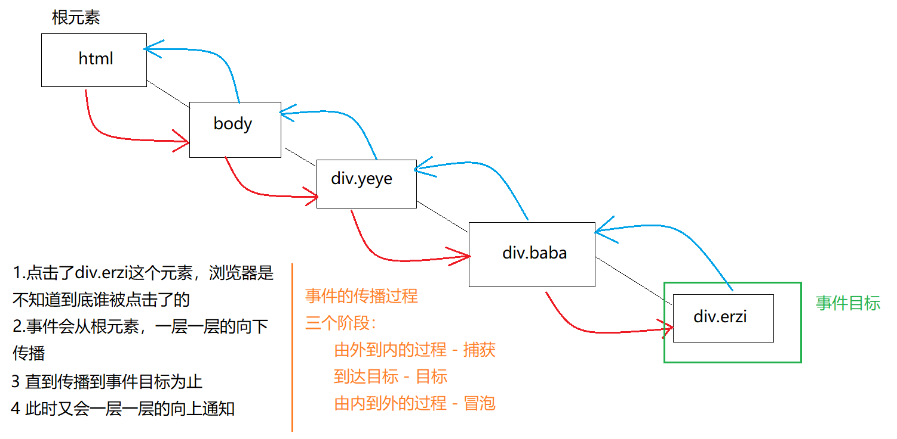

WebAPI 简介

​	**1、 API - application   programing   interface 翻译过来叫 `应用编程接口`** 

​	**2、javascript组成**
​		2.1  ECAMAScript：js的语法规范；js基础6天所学 -，简称es；
​			变量：用于储存数据
​			数据类型：简单类型（字符串、数字等）、复杂类型(数组、对象)
​			方法：字符串方法、数组的方法；
​			函数：封装一段代码
​			结构：if、for
​		2.2  DOM - document object model - 文档对象模型 -  把整个页面看成一个对象
​			document.write();
​		2.3  BOM - browser object model - 浏览器对象模型 - 把浏览器看成一个对象
​			Math.random()
​			new Date()
​	**3、WebAPI阶段**
​		学习DOM+BOM的属性和方法，并使用它们实现页面上的效果

# DOM

## 	1. DOM简介

​                      **2.1.1简介**：DOM - document object model - 文档对象模型
​		              文档对象模型：其实就是一个 `树` 形结构 ，把整个树状的模型
​			      节点：树形结构里面的每个交叉点（标签），被称为 `节点`  ，也叫DOM节点
​			      我们现在认知的节点包括： 标签本身
​			            				      标签上的属性（src、id、class、style等）
​									  标签内文本

## 	2. 获取元素对象

### 		     2.1 ById

​              元素对象：DOM节点
​              语法：后面要传入元素的ID的字符串


```js
     var closeBtn = document.getElementById('close'); 
```

​             若是没有找到这个标签，返回为null， null对象类型，代表空
​             获取body，因为body比较特别；永远只有一个 document.body

###       2.2  ByTagName

​		根据标签名获取元素

```js
	  参数： tagname - 标签名 - 必须是字符串
```
​		返回值：伪数组 - 里面包含有所有满足条件的元素
​		伪数组：可以遍历；

```js
	  document.getElementsByTagName(tagname)；
```

###      2.3  ByClassName

​		根据元素类名获取元素

```js
	  参数： classname - 类名 - 必须是字符串
```

​		返回值： 伪数组 - 里面包含有所有满足条件的元素
​		伪数组：可以遍历

```js
	  document.getElementsByClassName(classname)
```

###      2.4  选择器

```js
	  document.querySelector(css选择器);
	  //根据指定的选择器获取从上到下的第一个元素，获取不到返回个null对象
	  document.querySelectorAll(css选择器1,css选择器2...);
	  //作用：根据选择器获取所有满足条件的元素，这个使用的比较多
	  //参数：多个css选择器，以逗号隔开，都是字符串
	  //返回值：伪数组；for，但是这个伪数组上面有forEach方法
```

## 3.获取元素对象-offset

​		**元素.offsetLeft**

​			得到的是某个元素距离他的offsetParent元素的水平距离

​			元素.offsetLeft = marginLeft + left		

​		**元素.offsetTop** 	

​			得到的是某个元素距离他的offsetParent元素的垂直距离		

​			元素.offsetTop = marginTop + top	

​	       **元素的offsetParent**		

​			找到一个有定位的父亲元素进行参考，如果亲生父亲没有定位，会一直往上找，直到找打有定位的

​			父亲，或者body						

​		**元素.offsetWidth** 

​			元素的实际宽度 = border+padding+width

  	      **元素.offsetHeight** 

​			元素的实际高度 = border+padding+height

​		**案例**：鼠标拖到一个盒子进行移动

```js
			// 获取节点
  			var box = document.querySelector("#box");
 			// 注册事件
  			var x_start = 0;
  			var y_start = 0;
  			var isClick = false;
  			// 鼠标点击
  			box.addEventListener('mousedown', function (e) {
    		x_start = e.pageX - box.offsetLeft;
   			y_start = e.pageY - box.offsetTop;
    		isClick = true;
  			});
  			document.addEventListener('mousemove', function (e) {
    		if (isClick == true) {
      			var left = e.pageX - x_start;
      			var top = e.pageY - y_start;
      			box.style.left = `${left}px`;
      			box.style.top = `${top}px`;
    			}
  			});
  			box.addEventListener('mouseup', function () {
    		isClick = false;
 			 });
```

## 4. 事件

### 4.1 捕获与冒泡

 

​	**捕获**：从根部往目标DOM节点上，一层一层的找，捕获是用户点击了那个DOM节点

​	**到达目标**

​	**冒泡**：事件默认是在冒泡阶段执行；当我们目标DOM节点注册了事件，冒泡往上的DOM节点也注册了同样的事件话，也会执行

​	**阻止冒泡**：事件对象.stopPropagation();

```js
			// 阻止默认行为；
			事件对象.preventDefault();

			// 页面右键事件 查看右键菜单
			document.oncontextmenu = function(e){
 			e.preventDefault();
			}

			// 阻止a标签转跳
			// 1 把a标签的href属性设置为 javascript:void(0);
			// 2 在a标签的点击事件里面，return false;
			// 3 使用事件对象.preventDefault();
			dom_a.addEventListener('click', function(e) {
    			e.preventDefault();
			});
```


### 4.2 事件对象

​	**1. 事件对象：万物皆对象，把一次事件行为也看成对象***
​	   **对象：属性和方法的集合**

```js
   		// 获取事件对象
  		事件源.on+事件类型 = function(event){  };
   		事件源.addEventListener(事件类型,function(e){});
```

​	**2. 属性**
​		    可视区域坐标系 - 以浏览器的可视区域的左上角为原点的
​		    可视区域：就是元素用来显示内容的区域

```js
			事件对象.clientX
			事件对象.clientY
```

​		    页面坐标系  -  以body的左上角作为原点

```js
			事件对象.pageX
			事件对象.pageY
```

​		    事件的目标对象，用户点击到谁上面了；用于事件委托；

```js
			事件对象.target
```

​		    事件的绑定对象，就是是绑定在哪个DOM节点上 和 this一样

```js
			e.currentTarget==this -----> true
```


### 4.3  事件委托、解绑

​	**1. 委托**
​		把事件注册在父级的元素身上
​		利用事件冒泡执行，当事件传播到已经注册了事件的父级元素身上
​		判断  触发事件的DOM  （e.target）节点是否是指定的元素，e.target.nodeName=="LI"
​		如果是，就执行逻辑
​		否则什么都不管
​		innerHTML，可以获取标签内的HTML结构，也也可以设置HTML结构

​	**2. 解绑**

​          	  **btn.removeEventListener('click',fn);**

​	   	 **btn.onclick = null;**

```js
			var btn = document.getElementById('btn');
			btn.onclick = function(){
 			btn.onclick = null;
  			console.log('谢谢惠顾');
			}
```

```js
			var btn = document.getElementById('btn');
			btn.addEventListener('click',function fn(){
  			// 解绑 当前的函数
 			btn.removeEventListener('click',fn);
 			console.log('抽奖了');
			})
```

## 5. 注册事件

###     5.1注册方法

​		**1. on事件名**
​			本质相当于是把一个函数存储到 了 on 这个属性里面 ， 后面被重复赋值了，on的方式注册
​			无法多次注册；团队协作时，有可能别人写的代码，会把你的覆盖了

​		**2. addEventListener**

```js
		  添加事件监听，可以多次注册事件
		  var btn = document.querySelector('#btn');
		  //参数： 事件类型 - 字符串； 事件处理程序 - function 
		  //返回值：undefined
		  btn.addEventListener('click', function() {
          console.log(123);
          })
          btn.addEventListener('click', function() {
          console.log(456);
          })
		  btn.addEventListener('click', function() {
          console.log(789);
          })
```


###     5.2 点击事件-click

​		注册给谁：元素对象（DOM节点）

​		btn 事件源：通过谁要触发这个事件，也就是元素对象；
​		click 事件类型：用户通过什么行为,去触发一件事
​		匿名函数 事件处理程序(函数)：做了这个行为之后，要做什么事情；

```js
	  btn.onclick = function(){
  	  console.log('被点击了');
	  }
```

​		**案例：搜索区显示隐藏**
​				业务
​					有光标时，搜索区显示
​					无光标时，搜索区隐藏
​				步骤
​					获取元素：文本框
​					注册事件：focus blur
​					事件后：搜索区的显示隐藏；

```js
				  // 1 获取元素
				  var search = document.getElementById('search');
				  var list = document.getElementById('list');
				  // 2 注册获得焦点的事件
				  search.onfocus = function(){
  				  // 把搜索历史显示 - 通过修改display属性 - 元素.style.display = 'block';
  				  list.style.display = 'block';
				  }
				  // 2 注册失去焦点事件
				  search.onblur = function(){
  				  // 把搜索历史隐藏 - 修改display为none
  				  list.style.display = 'none';
				  }
```

### 5.3 鼠标事件-mouse

​		**.mousedown**

​			当鼠标的按键点下的时候触发	

​		**.mousemove**		

​			鼠标在某个元素身上移动的时候触发	

​		**.mouseup**	

​			当鼠标的按键被松开的时候触发	

​		**.onmouseover**	

​			当鼠标移入时触发	

​                **.onmouseout**	

 			当鼠标移除时触发			

### 5.4 键盘事件-keyCode

​	      **.onkeydown**

​				按键按下：keydown	

​	      **.onkeyup**	        

​				按键弹起：keyup             

​		**事件对象.keyCode**

​				这个属性被称为  键盘码 ，每个按键对应的数字是不一样 ，只需要判断数字，就知

​				道按下的按键是哪一个					

​		**keyCode==13 回车键**

​		**按下了ctrl键 ctrl==true**	

​		**案例-组合键发布**

```js
			  text.onkeydown = function(e) {
              console.log(e.keyCode, e.ctrlKey);
              // 判断是否同时按下ctrl和回车
              if (e.ctrlKey && e.keyCode === 13) {
              // 在代码中执行；
              btn.onclick();
               }
              }
```

### 5.5 动画事件

​	**注意**

​		不能使用on的方式注册，只能使用addEventListener的方式注册		

​		如果帧动画是无限次的，不会触发该事件		

#### 5.5.1 transitionend

```js
		//元素的过渡动画结束的时候触发
		var box = document.querySelector('.box');
		box.addEventListener('transitionend',function(){
  		console.log(123);
		});
```

#### 5.5.2 animationend

```js
		//会在帧动画结束的时候触发
		var box = document.querySelector('.box');
		box.addEventListener('animationend',function(){
  		console.log(123);
		})
```

### 5.6 触摸事件

​	**touchstart** 

​		会在手指触摸到屏幕的时候触发

​	**touchmove** 

​		会在手指触摸到屏幕，移动的过程中触发

​	**touchend** 

​		会在手指离开屏幕的瞬间触发

​	**注意**
​		触摸事件在pc端是不会触发的，必须是在移动端才可以

​		推荐使用addEventListener的方式注册：有很多移动端的事件，都是后面h5或者c3才出现的，on的方式

​		没有对应的属性		

​	**触摸点**		

​		事件对象.touches - 屏上面的触摸点	

​		事件对象.targetouches - 元素上面的触摸点	

​		事件对象.changedTouches - 变化的触摸点	

​	**用一个手指触摸屏幕内的元素**		

​		刚触摸时touchstart：touches、targetTouches、changedTouches，有一个值；都是同一个值

​		在元素上触摸移动时touchmove, touches、targetTouches、changedTouches，有一个值；都是同一

​		个值					

​		离开屏幕：touches、targetTouches没有值；changedTouches有最后离开屏幕的值			
​		

## 6. 属性

###     6.1类样式对象

####   	1. -className

​			操作谁：元素对象，DOM节点
​			类样式是什么：DOM节点上的class属性
​			操作类样式的效果：可以添加或修改我们已经写好的类名；快熟的更换样式

```js
		  console.log(元素.class); // 输出undefined
		  console.log(元素.className); // 正常输出元素的class属性
```

​			 如果要修改类样式，只需要把className修改一下就行了,但是会直接覆盖

```js
		  box.className = '新的类名';
```

​			解决：在原来的基础上进行添加类名

```js
		   box.className += '新的类名';
```

#### 	2. -classList

​			classList：DOM元素对象的一个属性对象；管理着所有类名
​			对象：提供多个方法进行操作，操作更为简单；比较好的方式解决上面的覆盖问题
​			操作什么：类名
​			**add：给元素对象添加一个或者多个类名，不会影响原来的类名**

```js
	      //参数：多个类名，之间用逗号隔开		  
	      box.classList.add(类名1,类名2...)；
```

​			**remove： 给元素删除一个或者多个类名**

```js
		  //参数：多个类名，可以是多个，多个之间用逗号隔开
		  box.classList.remove(类名1,类名2...)
```

​			**toggle：切换类名**

```js
		  //参数： 要切换的类名
		  box.classList.toggle(类名
```

### 6.2标准属性

#### 	1.style

​		style属性里面的内容其实是多个键值对，js帮我们把它们以对象的方式管理起来
​		获取：只需要元素对象.style.样式属性名 ；如果样式属性名是多个单词的，需要把样式属性的`-` 去掉，			   修改为驼峰命名

```js
	  // 获取：只能获取行内样式；
      div.style.backgroundColor
      // 设置
      div.style.backgroundColor = ’#fff‘;
```

#### 	2.focus  聚焦

​		有光标时：获得焦点 focus；

```js
	  ipt.onfocus = function(){
      // 当你想要让鼠标光标在输入框里面的时候要做什么事，就使用这个事件即可
	  }
```

#### 	3.blur  模糊

​		无光标时：失去焦点 blur

```js
	  ipt.onblur =  function(){
      // 当你希望处理鼠标光标失去的时候所做的事情，就在这里做
      }
```

#### 	4.checked  开关属性

​	       开关属性： checked/selected/disabled ，这种只有两种状态的属性

```js
		var ck = document.getElementById('ck');
	    ck.checked = true;
        ck.checked = false;
```

​		**案例**

```js
		功能：全选与取消
		获取元素：全选盒子、下面的子盒子
		注册事件：全选盒子click
		点击之后：点全选 选择 
			拿到全选后的状态
			循环遍历给子元素 赋值状态
```
~~~js
         var ckAll = document.getElementById('checkAll');
         // 伪数组
          var cks = document.getElementsByClassName('ck');
          // 2 给全选注册点击事件
          ckAll.onclick = function() {
            // 3 获取当前是否勾选
            var status = ckAll.checked；
        ```
        for (var i = 0; i < cks.length; i++) {
          cks[i].checked = status;
        }
        ```
~~~

​		

```js
		功能：反选
		需求：当我们把全部子ck选择中，上面的allCk 也会被选中；
  		相反，只有有一个ck没有选，allCk就不选；
```


```js
		for (let j = 0; j < cks.length; j++) {
    	// 每个子ck注册上事件
    	cks[j].onclick = function() {
      	// 点击之后：  
		// 假设 三个子ck 全部选中了；
  		var flag = true;
  		//怎么验证？三个，一个一个的过；
  		for (var k = 0; k < cks.length; k++) {
    	//只有子ck有一个是没有选中，假设就推翻；
    	if (cks[k].checked == false) {
     		flag = false;
      		break;
    		}
  		}
  		// 循环结束：
 		// 假设成立的时候： flag = true; 每一次，没有进行if执行；
 		// 假设不成立的时候，flag = false;

  		// flag true:假设成立：子ck全部选中，allCk跟着被选中,
  		// if (flag == true) {
  		//   allCk.checked = true;
  		// }
  		//假设成立：子ck至少有一个没有选中，allCk不能跟着被选中,
  		// else {
  		// allCk.checked = false;
  		// }
            
  		// 三元表达式；
  		// flag == true ? allCk.checked = true : allCk.checked = false;
 	 	// flag ? allCk.checked = true : allCk.checked = false;

  		// flag:true的时候，正面三个全部选中，allCk跟着被选中
  		allCk.checked = flag;
		}
```

### 6.3自定义属性

​		初始化定义 比如为 data- 开头的自定义属性

```js
		<div id="box" class="abc" title="我叫div" abc="abc" data-abc="我是自定义属性" data-index="5" data-name="狗蛋"></div>
```

​	 	   dom_div.dataset :返回值，对象，所有自定义属性和值都在上面
​		     console.log(dom_div.dataset.name);

​		**案例-点击按钮切换图**
​			需求：点击不同的按钮，切换各自的图片

```js
		  1.获取DOM节点；伪数组；
     	  var doms_btn = document.getElementsByClassName("ipt");
    	  // 获取图片节点
          var img = document.getElementById("img");
          var btn;
   		  // 2.注册事件；因为上面获取的是伪数组，这里每个按钮注册事件，需要遍历的方式进行注册；
		  for (var index = 0; index < doms_btn.length; index++) {
  		  // 每个DOM节点；
  		  btn = doms_btn[index];
  		  // 注册事件：点击
  		  btn.onclick = function() {
    	  // 点击之后的函数体；图片跟换地址；

    	  // 点击还是各自点击各自的按钮。
    	  // 都能获取自己身上值；
          // console.log(index);
          // console.log(doms_btn[index]);
   		  // 如何，注册事件写在循环里面，获取当前点击的自己的DOM节点，需要通过this;
    	  // this:获取当前事件类型 前面的事件源,DOM节点
    	  // console.log(this.dataset.src);
      	  img.src = this.dataset.src;
 			 }
		  }
```
### 6.4  操作属性

​		语法：这个操作属性更为灵活。一般情况下是操作自定义属性多一些

```js
		元素.getAttribute(属性名)
		//作用： 根据属性名获取属性值
		//参数： 要获取的属性名,标准属性和自定义属性都可以。而且自定义属性不再限制于 data-属性的格式要求
		//返回值：返回获取属性的值
		元素.setAttribute(属性名,属性值)
		//作用：添加或者修改属性的值
		//参数：都是字符串
		元素.removeAttribute(属性名)
		//作用：删除某个属性
```

### 6.5  修改节点

​		**innerHTML** 

```js
		//元素.innerHTML = '是满足html语法的标签结构';
		//可以获取和设置元素的内部的结构;
		//会把旧的结构覆盖掉;
		ul.innerHTML = '<li>狗蛋</li>';
```

​		**innerText**

```js
		//对于页面上已存在的，或者即将新创建的节点都适用
		//获取和设置元素对象（DOM节点）的文本信息
		ul.innerText= '<li>狗蛋</li>';	
```

### 6.6  获取 DOM节点

​	**获取子元素**

```js
			父元素.children
			//可以得到某个元素之下的所有的子元素的集合，一个伪数组
```

​	**获取父元素**

```js
			元素.parentNode
```

​	**获取兄弟元素**

```js
			元素.nextElementSibling  -  得到下一个兄弟元素
			元素.previousElementSibling - 得到上一个兄弟元素
```

## 7.方法

### 7.1 创建节点

```js
	innerHTML
```

```js
	document.write();
	//把页面已经存在的HTML结构覆盖
	//该方法可解析HTML结构，且多次写多次输出
```

```js
	document.createElement('标签名');
	//参数：要创建的新的标签的标签名
	//返回值：一个元素对象 DOM节点；
	//注意：该方法创建的元素，是不会自动进入结构里面的，需要自己手动添加
```

### 7.2  添加节点

​	**元素.appendChild(子元素)**：给一个父元素，追加子元素，作为最后一个子元素；从后添加一个子元素

```js
		var li = document.createElement('li');
		li.innerText = "我是一个li"
		ul.appendChild(li);
```

​	 **insertBefore**：在某个子元素之前，插入新的子元素

```js
		//父元素.insertBefore(新的子元素,旧的子元素)
		var second = document.querySelector('.second');
		ul.insertBefore(li,second);
```

### 7.3  删除节点

​	 **父元素.removeChild(要删除的子元素);**

```js
		var first = ul.children[0];
		// 调用方法，移除
		ul.removeChild(first);
```

### 微博案例

### 1.微博-发布

​	**1.1  需求**
​			发送一条内容，显示在列表的第一条
​	**1.2  实现**
​			获取元素：文本域、按钮、ul
​			注册事件：按钮click
​			点击之后：
​					文本为空时：返回return
​					文本非空时：创建一个DOM节点；创建节点
​								DOM节点里设置我们新的内容：修改内容
​								插入到列表最前面；追加节点
​								清空文本域
​	**1.3  代码**

```js
		btn.onclick = function() {
    	// 3.点击之后；
    	// 3.1 获取文本域的内容
    	var value = ipt.value;
		if (value == "") {
  		return;
		}

		// 3.2 创建新的DOM；
		var newLI = document.createElement("li");

		// 3.3.新的DOM修改内容；
		newLI.innerHTML = `
		<p>${value}</p>
		<span>删除</span>`;

		// 3.4 从前插入：ul 参考；
		var cankao = document.querySelector("ul li:nth-child(1)");
		ul.insertBefore(newLI, cankao);

		// 3.5优化：
		ipt.value = "";
        }
```
### 2.微博-删除

​	**1.1  功能：**点击新增发布的删除按钮，无效；因为新发布的信息上，删除按钮没有注册事件

​	**2.2  原理：**

​			  事件注册给UL，通过 事件冒泡执行 机制，去判断当前你点击的DOM节点

​			  是不是我想要的DOM节点；e.target.nodeName

​			  **事件委托**：使用场景，用在动态新增的DOM节点注册事件的时候。用事件委托

 			  性能：事件注册只是注册一次

```js
		//事件委托
		// 给ul注册
  		ul.onclick = function(e) {
    	// 点谁是谁的对象；
    	// console.log(e.target);
		// 返回 点谁是谁的节点名称
		// console.log(e.target.nodeName);

		if (e.target.nodeName == "SPAN") {
  		// console.log("你点击的是span");
  		// span节点：e.target
  		// parent：LI
  		var parent = e.target.parentNode;
        // 删除：父亲.removeChild(LI);
 		ul.removeChild(parent);
		}
```

## 8.获取可是区域的宽度-client

​		元素.clientWidth - 可视区域的宽度

​		元素.clientHeight - 可视区域的高度

# BOM

## 1.介绍

​			浏览器对象：window对象
​	 		browser object model：是把浏览器看成是一个对象，就是学习浏览器对象的各种方法和属性

## 2.window 对象

​	**2.1** 所有window对象的属性和方法，都可以**直接省略 window**.，而直接使用

​	**2.2 顶级对象**：页面中所有的东西都是依赖于这个对象存在的	

​				 因为window对象在浏览器中被称为顶级对象	

​	**2.3 变量与函数**		

​				所有的全局变量和全局函数都是window对象的属性和方法

​				在js代码里面，不使用var声明的变量，都是隐式全局变量，这个方式是不推荐的，因为如果不

​				使用var声明，是不会变量提升的								

```js
			  // 1.所有window对象的属性和方法，直接省略  `window.`
			  document.getElementById('xx');

			  // 2.顶级对象
			  console.log(window.document == document);

			  // 3.全局变量和函数 都是window上的挂载
			  var a = 10;
			  console.log(window.a);

			  function fn() {
    			console.log(1);
			  }
			  window.fn();

			  // 4.隐式变量：定义变量，变量赋值；
			  b = 2;
			  console.log(window.b);

			  // 访问变量：无赋值，就是访问变量；报错，无定义；
			  c;
			  console.log(window.c);
```

## 3.属性

### 3.1 location

​		location：负责管理浏览器地址栏相关的行为和信息的对象

​		location.href 属性：该属性就是浏览器的地址栏里面的内容

​		获取：当前浏览器的地址, 重新设置，页面就会发生跳转		

```js
	  // 如果想要使用js进行跳转，只需要 location.href = 新的地址;
	  location.href = 'http://www.jd.com';
```

### 3.2 localStorage

#### 	1. 介绍

​			把数据进行本地储存，刷新还是操作后的样子

​			本地储存：本地指浏览器，储存指浏览器可以储存数据			

#### 	2. localStorage.setItem(键,值)

​			多次对一个键进行赋值，会把前面的值覆盖；

​			**存储： 后面的值 前面可以放入任何数据类型，保存后为字符串**

​			注意： 如果存储的是对象之类的复杂类型，需要先把复杂类型转换为的字符串，再存进去		
​		

#### 	3. localStorage.getItem(键)

​			读取 数据

​			返回：我们存入的的数据的值，返回的是字符串		 

#### 	4. localStorage.removeItem(键)　　

​			删除键的值

#### 	5. localStorage.clear()

​			全部清空

## 4. JSON

### 	4.1 JSON格式

​			[] - 表示数组；{} - 对象；和JS学习的对象，数组特别的像

​			 JSON是有一定格式的字符串	

​			所有的键必须使用双引号包起来	

​			字符串也必须是双引号	

​			只有数字和字符串两种类型	

​			只是记录数据		

### 	4.2 JSON.stringify(对象)

​			将对象转换为json格式的字符串

​			返回值：一个满足json格式的 字符串		

### 	4.3 JSON.parse(json格式字符串)

​			将json格式的字符串转换为对象

​			返回值：依赖于你的json格式字符串，可能返回数组，或者是对象....		

### 	案例-发布微博-数据化

### 		1. 数据本地化-列表


​					先把HTML结构的数据抽象为对象	

​					对象数据本地化：储存起来	

​					读取出本地数据		

​					数据循环遍历：渲染				

```js
				  代码
				 	// 1.把写的这些HTML里面数据，抽象为一个对象（arr、Obj）
  					// var arr = [
  					// 对一条微博的描述
  					// {
  					// content: "快来收了这九款用上就停不下来的应用吧！！",
  					// time: "2019-7-26 15:25:56",
  					// },
  					// ];

  					// 储存进浏览器
 				 	// 把抽象的数据，转为JSON格式
  					// var str = JSON.stringify(arr);
  					// 储存
  					// localStorage.setItem("list", str);

  					// 1.读取；本地数据读取出来
  					var str = localStorage.getItem("list");
  					var arr = JSON.parse(str);

  					// 2.把你写的HTML结构，用JS全部渲染；
  					var ul = document.querySelector("ul");

  					// 循环数据
  					for (var i = 0; i < arr.length; i++) {
    				// console.log(arr[i]);
    				// 1.新增DOM节点
    				var li = document.createElement("li");
                        
                    // 2.内容的填充
					li.innerHTML = `
 						<p class="content">${arr[i].content}</p>
 						<span class="del">删除</span>
 						<span class="time">${arr[i].time}</span>`;

					// 3.获取第一个
					var cankao = ul.children[0];

					// 4.
					ul.insertBefore(li, cankao);
                     }
```

### 	2. 数据本地化-新增

​				DOM操作：把获取到的数据渲染到HTML结构内，实现数据本地化
​						     新的这一条数据抽象为一个对象，格式要和列表中一条数据格式一样

```js
			  代码：
				  // 抽象为一个数据，操作
    			  var obj = {
      			  content: value,
      			  time: time
   				  };
    			  // 一条数据的格式
                  // {
    			  // content: "快来收了这九款用上就停不下来的应用吧！！",
                  // time: "2019-7-26 15:25:56",
                  // }
				  //添加到全局的数组里
			     //把全局数组进行本地储存：注意你储存数组的每一条数据先后顺序和列表初始化先后顺序要保持					一致
```
## 5. 属性- 获取元素的实际宽度和高度

​			元素的实际宽高 = border+padding+content（width和height）

​			返回值：数值

```js
		  // 元素的实际宽度
		  元素.offsetWidth 
```

```js
		  // 元素的实际高度
		  元素.offsetHeight	
```

## 6.方法

### 6.1 onload

​			作用：页面加载完毕的时候执行

​			页面加载完毕：页面所需的静态资源全部加载完毕	

​			静态资源： html文件、css文件、js文件、图片...	

```js
			//这个方法调用一般是用window.onload 不省略window
			window.onload = function(){
    		// 想要获取图片的宽高，就需要等待图片加载完成后才执行后面的函数；
			}
```

### 6.2 定时器

#### 	6.2.1 setTimeout

​			一次性定时器:  set - 设置；Timeout - 超时

​			作用： 延迟一定的毫秒之后，调用函数一次

​			**返回值： 是该定时器的id，id可以用于停止这个定时器**	

```js
		  var timer = setTimout(函数,延迟的毫秒数);	 
```

#### 	6.2.2 clearTimeout(timer)

​			停止一次性的定时器：清除后，就不会执行这个定时器

#### 	6.2.3 setInterval

​			永久性的定时器；interval - 间隔

​			作用：阶段的时间执行函数

​			**返回值：就是该定时器的id**		

```js
		  var timer = setInterval(函数,间隔);	
```

#### 	6.2.4 clearInterval(timer)

​			清除永久定时器

### 6.3 获取DOM节点样式

​		Computed：计算后的样式

​		返回值： 当前作用在这个元素身上的所有样式的集合对象  BOM的方法；	

​		属性：具体的属性 无论是行内的还是CSS样式设置的，都可以获取到；字符串	

```js
	  var res = window.getComputedStyle(元素对象)；
      res.width 
	  // 只能操作行内属性；
      var dom = document.getElementById('xx');
      dom.style.color；
```


# 	案例-获取验证码-倒计时

​			1.获取元素：按钮

​			2.注册事件：click

​			3.点击之后：按钮表现为禁用状态

​			4.倒计时设置：开始计时，初始化

​						  setInterval 1秒间隔

​						  设置  time--	

​						  改变按钮的值	

​						清除倒计时：time==0时清除定时器；按钮恢复文字和可点击的样式					
​			5.代码

```js
				btn.onclick = function() {
    			// 3.点击之后有效果？
    			// 3.1 按钮不能点了
    			btn.disabled = true;
				// 3.2 开启倒计时
				var miaoshu = 5;

				// 立即执行；
				btn.value = `获取验证码【${miaoshu}】`;

				// 无限次定时器
				var timer = setInterval(function() {
 				 miaoshu--;

  				// 当==1的时候
  				btn.value = `获取验证码【${miaoshu}】`;

  				// 判断：miaoshu到哪了？到达1的时候要清除定时器
  				if (miaoshu == 0) {
    			// 清除定时器
   				clearInterval(timer);

    			// 把禁用的属性关了
    			btn.disabled = false;

    			// 本身的文字恢复
   				btn.value = "获取验证码";
  					}
				  }, 1000);	 
                }
```

# 案例-手风琴特效


​	**需求**
​		鼠标移入，鼠标当前的图片变宽，其他变小（排他思想）
​		鼠标移出，所有图片大小恢复原状
​	**移入**
​		获取元素：所有的li元素
​		注册事件：鼠标移入
​		移入之后：排他
​			所有的li变为一个值100
​			当前单独变为一个值800

​	**代码**

```js
		var lis = document.querySelectorAll('#box li');
  		for (var i = 0; i < lis.length; i++) {
    	// 注册鼠标移入事件
    	lis[i].onmouseover = function() {
      	// 排他的设置每个li的宽度
      	lis.forEach(function(element) {
        element.style.width = 100 + 'px';
      	})
      	this.style.width = 800 + 'px';
    	};
  		}
		//移除
		//获取元素：所有的li元素
		//注册事件：鼠标移出
		//移出之后：所有的元素回复原来的宽度240
		//代码
			for (var i = 0; i < lis.length; i++) {
    	// 注册鼠标的移出事件
    	lis[i].onmouseout = function() {
      	// 把所有的li恢复原状
      	lis.forEach(function(element) {
        element.style.width = 240 + 'px';
      			});
    		};
 		 }
```

# 案例-点击按钮切换位置


​	**需求**
​		点击按钮切换盒子的位置
​	**需知**
​		控制盒子的位置和大小的类名为数组
​	**实现**
​		初始化：把数组按照盒子的循环，改变类名
​		点击按钮，改变类名数组的位置，重新给盒子循环赋值类名

​	**代码**

```js
		var pos_arr = ["pos_1", "pos_2"];
  		var boxs = document.querySelectorAll("p");
  		// 初始化
  		setTimeout(function() {
    	for (var i = 0; i < boxs.length; i++) {
      	boxs[i].className = pos_arr[i];
    		}
  		}, 1000);

  		// 点击切换；
  		var btn = document.querySelector("#btn");
  		// 点击后，位置发生改变；
  		// 实质上为 控制位置类名的数组发生改变；
  		btn.onclick = function() { 
    	var last = pos_arr.pop();
   		pos_arr.unshift(last);
		// console.log(pos_arr);

		for (var i = 0; i < boxs.length; i++) {
  		boxs[i].className = pos_arr[i];
			}
        }
```

  **函数优化**
				

```js
		var pos_arr = ["pos_1", "pos_2"];
  		var boxs = document.querySelectorAll("p");
		function change(){
    		for (var i = 0; i < boxs.length; i++) {
      			boxs[i].className = pos_arr[i];
    		}
		}
		// 初始化
 		setTimeout(function() {
    	change();
  		}, 1000);

  		// 点击切换；
  		var btn = document.querySelector("#btn");
  		// 点击后，位置发生改变；
  		// 实质上为 控制位置类名的数组发生改变；
  		btn.onclick = function() {
    	var last = pos_arr.pop();
   		pos_arr.unshift(last);
    	change();
  		}
```
**特点**
	HTML结构不变，变的是类名数组

# 案例-旋转木马


​	**需求**
​		让所有的图片从中间展开
​		点击右边按钮，让图片可以逆时针旋转
​		点击左边按钮，让图片可以顺时针旋转
​	**初始化**
​		初始化布局：给每个li分别设置一个可以控制位置、大小、层级的类名，给类名使用一个数组的方式管理					起来，直接按照索引对应的方是设置位置即可
​		获取元素：获取所有的li
​		注册事件：无
​		初始化：使用循环设置所有的li的大小、位置、层级->只是设置一个已经准备好的类名
​	**代码**		

```js
		var lis = document.querySelectorAll('.slide li');
		var pos = ['left1', 'left2', 'middle', 'right2', 'right1'];
		// 遍历所有的li，设置类名，就可以发送位置的变化
		for (var i = 0; i < lis.length; i++) {
    		lis[i].className = pos[i];
		}
		//左右按钮
		//右按钮分析：第一张图
			//HTML结构：没变
			//变化的是：类名在数组中的位置
		//如何变化
			// 初始化：
		// HTML : 1        2         3         4          5
		// 位置：'left1', 'left2', 'middle', 'right2', 'right1'

		// 右侧点击下：
		// HTML :    1        2         3         4          5
		// 位置类名：'left2', 'middle', 'right2', 'right1'  'left1',
		//实现
			//获取元素：左右按钮
			//注册事件：click
			//点击之后
				//右侧：把第一个类名拿出来，从后添加
				//左侧：把最后一个类名拿出来，从前添加
			//代码
				// 初始化再次设置每个li的位置
		lis.forEach(function (e, i) {
  		e.className = pos[i];
		});
		// 封装为函数
		function rotate() {
  		lis.forEach(function (e, i) {
    		e.className = pos[i];
  			});
		}
		// 点击右边按钮
		var rightBtn = document.querySelector('.next');
		// 注册点击事件
		rightBtn.onclick = function () {
  		// 把位置数组的第一个取出，放到最末尾
  		pos.push(pos.shift());
  		// 再次把每个li移动
  		rotate();
		}

		// 左侧
		leftBtn.onclick = function () {
  		// 把位置数组从最后面抽取一个，放到最前面
  		pos.unshift(pos.pop());
  		rotate();
		}
```

案例-轮播图案例


​	**序号轮播**

		- 其实就是tab栏

- 获取元素：所有的小圆点序号
- 注册事件：鼠标移入mouseover小圆点的事件
- 移入之后：
  - 小圆点：排他思想实现当前样式出现；
  - 图片切换：计算ul应该向左移动多少，`ul的位置 = 图片宽度 * 索引 * -1`;
    


```js
   // 1.1 获取元素 (小圆点，ul)
	var circles = document.querySelectorAll('.list>i');
	var ul = document.getElementById('imglist');
	// 定义一个变量，保存图片的宽度 // li和图片的宽度是一样的
	var imgWidth = ul.children[0].offsetWidth;

	// 1.2 给序号注册鼠标移入事件
	for (var i = 0; i < circles.length; i++) {
	// 先把数据存起来；
    circles[i].index = i;
    circles[i].onmouseover = function() {
    var target = imgWidth * this.index * -1;
    ul.style.left = target + 'px';
    ul.style.transition = "left 300ms linear";

	// 当前样式设置；排他思想；
    circles.forEach(function(c) {
      c.classList.remove('current');
    });
    this.classList.add('current');
     }
   }
```
**左右轮播**

​	 获取元素：左右按钮

​	注册事件：click

​	点击之后：整体向左滑动一格；

​	变量控制下标增1；

​	我要一直向右滑动动么？

​		不能滑动到无限，

​		点击下标为5，显示为第6张；

​		点击下标为6，显示为第1张；回归下标为0；

- 实现：点击右侧
  - 设置变量，为初始化图片的下标为0；

  - 点击右侧，变量加+；

    ​	下标0：显示第一张；

    ​	下标为5：显示第六张；

    ​	下标为6，当前显示第1张，回到下标为0;

    ```JS
    //注册点击事件
    // 下标为0；当前显示第1张
    // 下标为1；当前显示第2张
    // 下标为5，当前显示第6张
    // 下标为6，当前显示第1张，回到下标为0;
    rightBtn.onclick = function() {
    currentIndex++;
    
    // 下标等于长度的时候，应该恢复到第1张，下标为0；
    if (currentIndex == ul.children.length) {
      currentIndex = 0;
    }
    
    // 算出ul的位置
    var target = currentIndex * imgWidth * -1;
    // 设置ul的位置
    ul.style.left = target + 'px';
    
    };
    	leftBtn.onclick = function() {
    // 正常递减
    currentIndex--;
    
    // 当下标为-1；当前显示应该为第6张，下标回归为 最后的下标= 数组长度-1；
    if (currentIndex == -1) {
        currentIndex = ul.children.length - 1;
    }
    
    // 算出ul的位置
    var target = currentIndex * imgWidth * -1;
    // 设置ul的位置
    ul.style.left = target + 'px';
    }
    ```

    左右联动序号

    - 点击左右按钮切换图片后，小圆点也应该跟着切换当前样式；
    - 让当前下标的小圆点的样式变化：排他思想；

  ```js
  	// 联动序号
      // 归根到底，左右切换控制的就是index，序号也是控制的index。
      // 左右切换时，应该把左右切换控制的index,影响到序号的样式上；
     // 样式联动：排他思想
     circles.forEach(function(c) {
       c.classList.remove('current');
     });
     circles[currentIndex].classList.add('current');
     };
  ```

  **序号联动左右**

  	- 完成上面左右切换联动序号样式；
		
  	- 完成上面左右切换联动序号样式；

- 当鼠标通过序号切换后，在用左右切换，会出现问题，原因：
  - 左右按钮控制一个**全局变量**，也把全局变量的值联动给小圆点的样式了；（左右切换联动序号）
  - 小圆点自己切换的时候，没有影响到全局变量，所以会出现乱转的情况；

- 如何设置：把小圆点切换时控制的当前的下标，赋值给全局的变量（左右按钮控制的那个变量）即可；

     ```js
     	// 1.2 给序号注册鼠标移入事件
     	for (var i = 0; i < circles.length; i++) {
         // const element = array[index];
       	circles[i].index = i;
      	circles[i].onmouseover = function() {
         // 计算
         var target = imgWidth * this.index * -1;
         // 移动
         ul.style.left = target + 'px';
     	// 样式设置
     	circles.forEach(function(c) {
       	c.classList.remove('current');
     	});
     	this.classList.add('current');
     
     	// 联动
     	// 要把序号切换的值，影响到全局的变量形成统一；
     	currentIndex = this.index;
           }
     	}
     ```

     自动轮播及鼠标控制轮播

      - 初始化页面，页面自动向右轮播；

     - 实现：

     - 需要把向右的函数提炼为一个函数

     - 定时器：执行向右点击的函数

       ```js
       	// 自动轮播
       	var timer = setInterval(function() {
       	moveRight();
       	}, 2000);
       ```

       - 鼠标不在整个盒子上操作时，图片自动向右轮播；

     - 现实：

     - 获取元素：整个盒子；

     - 注册事件：鼠标移出；

     - 移出之后：定时器执行向右的函数；（需要把向右的函数提炼为一个函数）

       ```js
       	// 鼠标移出，恢复自动轮播
       	box.onmouseout = function() {
       	timer = setInterval(function() {
           	moveRight();
       	}, 2000);
       	}
       ```

       

       - 鼠标在盒子上，停止自动轮播

     - 实现：

     - 获取元素：整个盒子；

     - 注册事件：鼠标移入；

     - 移入之后：清除定时器；

       ```js
       	var box = document.getElementById('box');
       	box.onmouseover = function() {
       		clearInterval(timer);
       	};
       ```

       