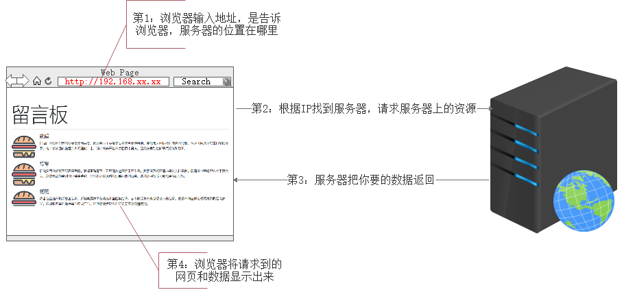
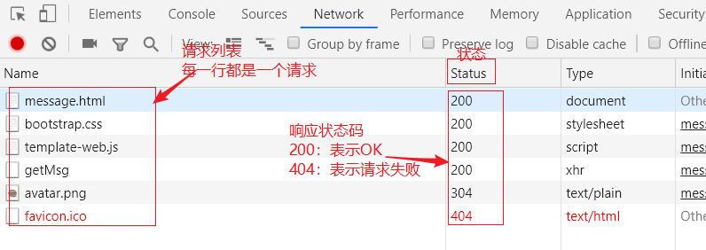
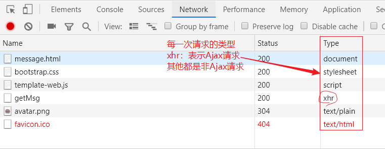
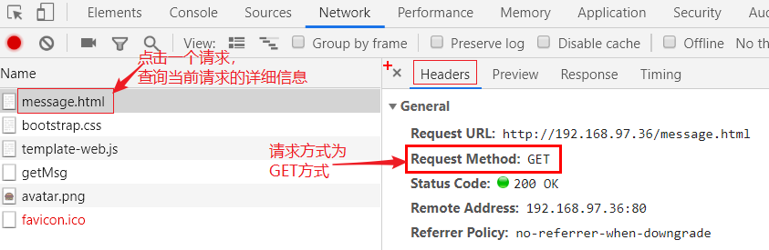
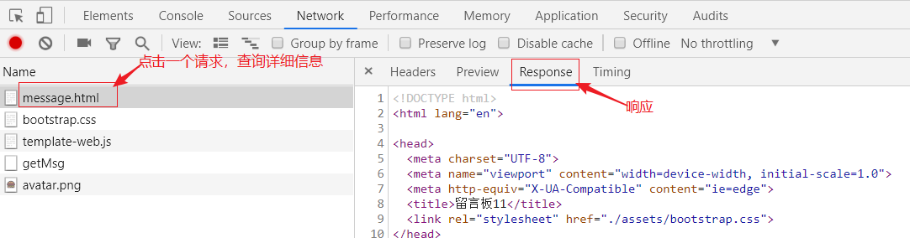
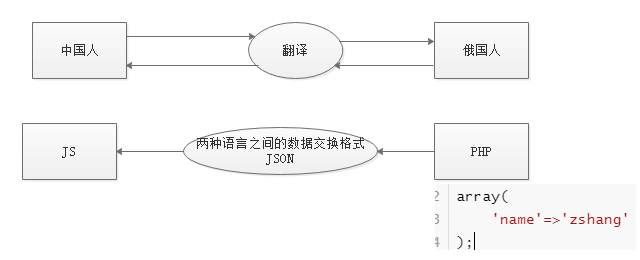
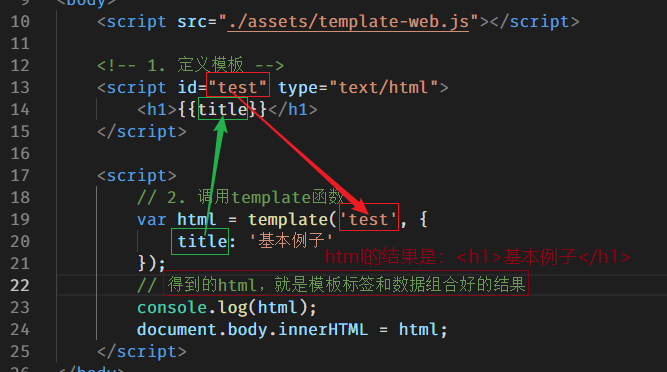

# 前言

- 发微博案例（之前的案例）
    - 可以在输入框输入内容，点击确定，实现发布微博效果
    - 刷新页面，恢复到初始状态。说明**数据并没有真正保存**
    - 只能自己访问（查看、浏览）自己的页面，**其他人无法访问你的案例**
- 留言板案例（Ajax阶段）
    - 可以在输入框输入内容，点击确定，实现发布留言功能
    - 刷新页面，发布的数据不会丢失。**说明数据被永久保存了**
    - **通过IP地址，其他人也可以访问留言板案例**

**案例对比**：

两个案例中，发微博案例更像是一个“单机程序“，就是一个网页；

留言板案例更像是一个真实的网站。之所以有如此大的区别，是因为留言板案例使用了==Ajax==和==服务器==相关知识。Ajax和服务器端编程正是这个阶段的主要内容。

------

# 服务器介绍

## 客户端和服务器

- 客户端：
    - 当你使用自己的计算机来访问（留言板）网站的时候，你的计算机就是客户端
    - 你使用的浏览器来访问网站的，所以也可以认为浏览器就是客户端。
- 服务器：
    - 我们访问的所有网页都在服务器上，比如百度的页面，比如留言板页面
    - 你访问的留言板网站搭建在老师的计算机上，老师的计算机就是服务器

## 什么是服务器

- Q1：留言板这个HTML页面在你自己的计算机上吗？它在哪里？

    - 不在自己的计算机上，在服务器上。

- Q2：大家发的留言（数据），在哪里保存着呢？

    - 在服务器上

    >  **服务器能够保存网页，能够保存网页中使用的数据。**

- Q3：为什么要用服务器？

    - 有了服务器，网页才能够被所有人访问；
    - 有了服务器，数据也能够永久保存

- Q4：老师的电脑为什么能当做服务器？我自己的电脑能不能当服务器用？

    - 因为老师的电脑上安装了`服务器软件`
    - 同学们的电脑也可以当服务器，只需要安装服务器软件即可

- Q5：常用的服务器软件有什么？我们选择哪个软件来学习？

    - Apache 
    - Tomcat 
    - `自己写的服务器软件`（源代码）

**小结：**

1. **服务器就是一个安装了服务器软件的计算机；真实的服务器也就是一个安装了服务软件的超级计算机。**
2. **服务器可以永久保存数据；**
3. **服务器上的资源（html、css、js、图片、数据等等）可以被所有人访问。**
4. **真实的服务器也是一个计算机。**

------

# 请求响应过程

客户端浏览器如何访问服务器

- 在浏览器中输入IP地址，告诉客户端服务器的位置
- 浏览器通过web这条路(网络)，走到服务器去向服务器要数据(网页/留言数据) 
- 服务器知道你要的数据后，把数据通过web这条路(网络)给你
- 客户端浏览器接收到数据后把数据(网页/数据)显示出来



上述，**从浏览器输入IP地址，到看到留言板页面，这一整个过程称之为 ==请求响应== 过程**。

- 请求（Request），指浏览器向服务器发出的请求（请求HTML页面和留言数据）；
- 响应（Response），指服务器接收到浏览器的请求后，做出的回应（把请求的东西给你）；

> 有的时候，为了看到一个页面，也许会向服务器发很多次请求。

# 浏览器工具

## 4.1 查看请求基本信息

如果需要了解请求及响应过程。也可以使用浏览器工具，而且多数情况都是通过浏览器工具来分析学习的



## 请求类型(Request Type)

通过浏览器工具，可以查看到请求的类型，我们将请求类型分为两类即可：

- Ajax类型的请求：通过浏览器工具，查看请求的Type列，标注为xhr的，就是Ajax请求
- 非Ajax类型的请求：通过浏览器工具，查看请求的Type列，标注为document、stylesheet等，就是Ajax请求



## 请求方式(Request Method)

浏览器在向服务器发送请求的时候，也分为不同的请求方式。

请求方式共有数十种，但是主要的请求方式就两种，一种为GET方式，一种为POST方式。

- **GET** 得到，意思浏览器的目的是希望从服务器得到一些东西
- **POST** 投递，提交，意思是浏览器希望将数据提交给服务器

还是使用浏览器工具来查看



## 查看响应结果(Response)

当浏览器向服务器发送了一个请求后，服务器会根据请求，做出响应。

响应，即将浏览器请求的内容返回给浏览器。



# 搭建服务器环境

## 安装Node

将下载的node软件安装（一直下一步即可）

如果忘记了是否安装过node，可以先进行下一步。

## 使用node运行app.js开启服务

- 如何搭建web服务环境
    - 将老师发给你的 `Ajax阶段资料.zip` 解压缩，得到 `Ajax阶段资料` 文件夹。
    - 使用 vscode 打开 `Ajax阶段资料\01-服务器软件\ajax` 文件夹
    - 在编辑器中，在 `app.js` 上右键，选择在终端中打开
    - 在打开的终端面板中，输入 `node app.js` 回车，表示开启服务了。

## 其他问题

- 大家可以把 `ajax` 文件夹认为是服务器即可。

- 我们的代码文件放哪里？
    - 放在 public 文件夹中。

- 为什么要使用老师写的代码当做服务器
    - 贴合学习，安装配置简单方便
    - 内置了很多学习阶段用的数据接口 

## 数据接口（测试接口）

就是一个请求地址（网址），向这个地址发送请求，可以得到一些数据。 

网上有很多网站专门提供数据接口？比如[天气信息接口](https://www.tianqiapi.com/api/?version=v1)、IP地址接口、新闻头条接口等等。


下面的表格中的接口，就是ajax服务器提供的一些测试接口。这些接口在别的服务器软件上是没有的，是老师提前

写好的，用于学习使用的。我们后面自己也可以写这样的接口。

| 请求方式 | 接口地址    | 参数                                | 返回值                              |
| -------- | ----------- | ----------------------------------- | ----------------------------------- |
| GET      | /time       |                                     | 时间戳 [string]                     |
| GET      | /query-get  | 任意                                | 发送给服务器的参数 [string]         |
| POST     | /query-post | 任意                                | 提交给服务器的数据 [string]         |
| POST     | /checkUser  | username:[string]                   | true或false                         |
| GET      | /big-data   |                                     | 返回一百万次时间戳 [string]         |
| GET      | /getMsg     |                                     | 返回所有留言[JSON]                  |
| POST     | /addMsg     | name:[string]<br />content:[string] | 添加成功：true<br />添加失败：false |
| POST     | /fd         | FormData对象                        | 提交给服务器的数据 [JSON]           |


## 请求响应GET、POST

请求的方式有两种：

- GET （获得）
    - 地址栏输入网址，按回车
    - a标签的超链接跳转
    - 表单提交（不设置method属性，或设置为GET）
    - Ajax的GET请求
- POST （邮递）
    - 表单提交（一定要设置method为POST）
    - Ajax的POST请求

# Ajax简介

字面意思：`A`（asynchronous）`j`（javascript）`a`（and）`x`（xml），翻译过来是 “异步的JavaScript和XML”。

简单来说，Ajax是一种技术、是能够使浏览器和服务器进行交互（请求响应）的一种技术。

Ajax也是一套内置在浏览器端的API，核心对象是 `XMLHttpRequest` ，通过这些API的调用，可以实现发送Ajax类

型的请求和收取服务器端响应的数据。

## 发送 Ajax 请求

**初体验**

Ajax的核心是内置在浏览器中的 `XMLHttpRequest` 对象。我们可以通过调用这套API，实现发送Ajax请求。

在public文件夹中，创建 03-初体验.html ，代码如下：

```js
<body>
    <h1>ajax初体验</h1>

    <script>
        // 1. 创建浏览器内置的对象 XMLHttpRequest，简称xhr对象
        var xhr = new XMLHttpRequest();
        // 2. 调用xhr对象的open方法，设置请求方式和请求的url
        xhr.open('GET', 'http://localhost:4000/time');
        // 3. 调用xhr对象的send方法，向服务器发送请求
        xhr.send();
        // 4. 当请求响应整个过程结束，然后接收服务器响应的结果（返回的数据）
        xhr.onload = function () {
            // 使用xhr的response属性来接收服务器响应的结果
            console.log(xhr.response)
        }
    </script>
</body>
```

浏览器访问  `http://localhost:4000/03-初体验.html` 就可以通过浏览器工具查看到有一次ajax请求

**难点**

Q1：03-初体验.html 为什么要通过IP地址来访问，能不能双击打开？

​	不能双击打开。html文件在public文件夹中，public文件夹是服务器上的文件夹。访问服务器上的资源必须使用服务器的IP地址或域名才行。

Q2：刷新03-初体验.html 是如何看到时间戳的？

 	1. 当地址栏输入 03-初体验.html  按回车，表示向服务器请求该html页面
 	2. 服务器收到请求后，会做出响应，即把html代码返回给浏览器
 	3. 浏览器接收到html代码后，解析这些html代码
 	4. 当解析到js代码的时候，发现又是一次Ajax请求，所以又发送了Ajax请求
 	5. 服务器收到Ajax请求，然后会把时间戳返回给浏览器

## Ajax发送GET请求及简化URL

- get 请求

    - get 字面意思获取，一般用户从服务器获取数据

- 一个通用的IP地址

    - 127.0.0.1  始终可以访问到本机的服务器

    - localhost  始终可以访问到本机的服务器

- 如果访问的HTML页面和请求的数据接口是同一个服务器上的资源，IP地址可以省略

    ```js
    // 省略前的写法
    xhr.open('GET', 'http://127.0.0.1:4000/time');
    xhr.open('GET', 'http://localhost:4000/time');
    // 省略后的写法
    xhr.open('GET', '/time');
    ```

- 代码实现

    ```js
    <body>
    
        <input type="button" id="btn" value="请求">
    
        <script>
            // 点击按钮的时候，发送ajax请求
            document.getElementById('btn').onclick = function () {
                // 1. 创建 XHR 对象
                var xhr = new XMLHttpRequest();
                // 2. 调用open方法，设置请求方式和url（接口）
                // xhr.open('GET', 'http://127.0.0.1:4000/time');
                xhr.open('GET', '/time');
                // 3. 调用send方法，发送请求
                xhr.send();
                // 4. 当请求响应过程结束，才接受服务器响应的结果
                xhr.onload = function () {
                    // console.log(xhr.response);
                    console.log(this.response);
                }
            }
        </script>
    </body>
    ```

    ​        在发送Ajax请求的时候，比如A、B两个网页文件或接口地址都属于同一个服务器上的资源，则请求URL可以省略前面的IP和端口，直接用`/time` 即可。浏览器在解释 `/time` 的时候，会自动补充完整的URL。

```js
// 1. 创建一个 xhr 对象
var xhr = new XMLHttpRequest();
// 2. 设置请求的方式和路径

//////////////////////////////  注意，下面的URL接口就是简化后的写法。
xhr.open('GET', '/time');

// 3. 发送请求
xhr.send(null);
// 4. 注册事件
xhr.onload = function () {
    // 通过 xhr 的 responseText 获取到响应的响应体
  	console.log(this.response)
}
```

## GET 请求传参

- 什么时候需要带请求参数

    - 请求参数又叫做查询字符串
    - 一般用于告诉服务器此次请求的详细目的，比如查询什么、删除哪条记录等

- URL 携带查询字符串

    - 格式：http://www.baidu.com/s?q=word&sug=5017
    - 查询字符串(querystring)：
        - URL中==问号后面==携带的就是 get 请求传参的数据，叫做查询字符串
        - 格式：aa=xxx&bb=yyyy
        - 查询字符串只适合传输少量数据

- 代码演示：

    ```js
    <body>
    
        <input type="button" id="btn" value="发送请求">
    
        <script>
            // 点击按钮的时候，发送ajax请求
            document.getElementById('btn').onclick = function () {
                // 1. 创建xhr对象
                var xhr = new XMLHttpRequest();
                // 2. 调用open，设置请求（方式、url）
                xhr.open('GET', '/query-get?id=11&age=22');
                // 3. 调用send，发送请求
                xhr.send(null);
                // 4. 当请求响应过程结束后，才获取服务器响应的结果
                xhr.onload = function () {
                    console.log(this.response);
                }
            };
    
        </script>
    
    </body>
    ```

## 缓存问题(了解)

- 只有IE浏览器会有缓存问题，所以作为了解内容
- 缓存问题指的是：两次或多次 AJAX GET 请求**同一个** URL ，IE浏览器在第二次请求的时候，并不会从新向服务器发请求，而是直接使用上次请求的结果。

```html
<body>

    <input type="button" id="btn" value="请求">

    <script>
        // 点击按钮的时候，发送ajax请求
        document.getElementById('btn').onclick = function () {
            // 1. 创建 XHR 对象
            var xhr = new XMLHttpRequest();
            // 2. 调用open方法，设置请求方式和url（接口）
            // xhr.open('GET', 'http://127.0.0.1:4000/time');
            // xhr.open('GET', '/time?abc=' + Math.random());
            xhr.open('GET', '/time?abc=' + Date.now());
            // 3. 调用send方法，发送请求
            xhr.send();
            // 4. 当请求响应过程结束，才接受服务器响应的结果
            xhr.onload = function () {
                // console.log(xhr.response);
                console.log(this.response);
            }
        }
    </script>
</body>
```

- 解决方案

> 让每次请求的URL都不同
>
> 不同的查询字符串(请求参数)会被浏览器认为是不同的地址，浏览器会忽略客户端缓存。

```javascript
var xhr = new XMLHttpRequest()
xhr.open('GET', '/time?t=' + Date.now())
xhr.send(null)
xhr.onload = function () {
console.log(this.responseText)
// =>
}
```

## Ajax发送POST方式的请求

post 把传递的数据封装在 HTTP 请求数据中，以键/值的形式出现，可以传输大量数据，对数据量没有限制，也不

会显示在 URL 中。

- 字面意思是把数据提交给服务器
- post 请求，**必须调用setRequestHeader方法设置 Content-Type**
    - 请求头中的 Content-Type，告诉服务器发送过去的数据的格式
- 发送的数据
    - send方法的参数就是post方式发送给服务器的数据。（和get不同）
- 代码演示

```js
var xhr = new XMLHttpRequest()
// open 方法的第一个参数的作用就是设置请求的 method
xhr.open('POST', '/query-post')
// 设置 Content-Type 为 application/x-www-form-urlencoded，这行代码不用死记硬背，去复制即可
xhr.setRequestHeader('Content-Type', 'application/x-www-form-urlencoded')
// 需要提交到服务端的数据可以通过 send 方法的参数传递
// 格式：name=zhangsan&age=18
xhr.send('name=zhangsan&age=18')
xhr.onload = function () {
    console.log(this.responseText)
}
```

# 案例-验证用户名

使用的接口是 POST方式的checkUser，参数必须为username，值是注册的用户名；服务器上目前已有zhangsan、lisi、wangwu三个用户了。

```js
<body>
    <input type="text" id="user"><span id="msg"></span>

    <script>
        // 当输入框失去焦点的时候，向接口checkUser发送ajax请求，验证用户名
        document.getElementById('user').onblur = function () {
            // 获取输入的值
            var user = this.value;
            // 发送ajax请求
            var xhr = new XMLHttpRequest();
            xhr.open('POST', '/checkUser');
            xhr.setRequestHeader('Content-Type', 'application/x-www-form-urlencoded');
            xhr.send('username=' + user);
            xhr.onload = function () {
                // console.log(this.response); // 如果返回true，说明用户名已被占用
                if (this.response === 'true') {
                    document.getElementById('msg').innerHTML = '<font color="red">sorry，用户名已被占用</font>';
                } else {
                    document.getElementById('msg').innerHTML = '<font color="green">恭喜，用户名可用</font>';
                }
            }
        }
    </script>
</body>
```

# 案例-留言板

## 功能介绍及postman工具

- 案例功能介绍

    - 刷新页面，发送Ajax请求( /getMsg )，向服务器请求数据（所有的留言数据）
    - 点击提交按钮，发送Ajax请求(/addMsg)，向服务器发送新添加的数据，完成添加

- 用到的接口

    

- 测试接口的软件postman介绍

    - 安装软件，一路next
    - 演示发送请求

    

## 发送请求，获取所有留言

**==开发案例前的准备工作==**：

首先将message.html中的JS代码全部删除，`修改css路径为本地路径`。然后通过浏览器访问127.0.0.1:4000/message.html即可看到初始的页面效果。

初始的页面中，只有一条假的留言（张三，哈哈哈哈哈哈）。

所以下面写Ajax代码，发送Ajax请求，到 /getMsg 接口。获取所有的留言。

```js
// 1、创建XHR对象
var xhr = new XMLHttpRequest();
// 2、设置请求方式、请求url
xhr.open('GET', '/getMsg');
// 3、发送
xhr.send(null);
// 4、当请求响应过程结束的时候，接收服务器返回的数据
xhr.onload = function () {
		// 接收服务器返回的结果，即响应的结果
      var result = this.response;
      // console.log(result);
      // 下面只需要将服务器返回的所有留言展示到页面上
      // 1. 需要将JSON格式的数据转换成JS数组
      var data = JSON.parse(result);
      console.log(data);
      // 2. 循环JS数组，循环的时候，拼接li
      var str = '';
      data.forEach(function (item) {
          // item 表示数组中的每个单元
          str += `<li class="media">
                  
                  <div class="media-body">
                    <h4>${item.name}</h4>
                    <p>${item.content}</p>
                  </div>
                </li>`;
        });
      // 3. 循环结束，把拼接好的所有li放到ul中
      document.getElementById('messages').innerHTML = str;
};
```

==整个请求响应过程==：

1. 输入地址 <http://127.0.0.1:4000/message.html> 向服务器发送请求，请求message.html 页面
2. 服务器返回给浏览器 message.html 中的代码
3. 浏览器接受到 message.html 中的代码，然后解析
    1. 遇到加载css的link标签，再次去服务器请求css文件
    2. 遇到图片的img标签，再次去服务器请求图片
    3. 遇到js代码，发送Ajax请求，请求所有的留言数据
        1. 服务器响应的结果是JSON格式的留言数据
        2. 将JSON格式的数据转成JS数组
        3. 通过拼接li的方式，拼接所有的留言
        4. 把拼接好的所有的li，放到ul中

## 点击按钮，发送请求，添加留言

> 添加完留言，要想实时看到新添加的留言，则需要在添加完成之后，从新从服务器获取所有留言。为了方便，将前面的获取留言的代码封装成 `loadData` 函数。

下面是添加留言的代码：

```js
/////////////////////////////////////////////////////////
    // 添加留言
    // 点击提交按钮的时候，获取输入框的值，向接口 /addMsg 发送请求。
    document.getElementById('btn_send').onclick = function () {
      // 获取输入框的DOM对象
      var username = document.getElementById('txt_name');
      var content = document.getElementById('txt_content');
      // 发送Ajax请求
      // 前面的script中已经创建了xhr对象了，这里不用再次创建
      xhr.open('POST', '/addMsg');
      xhr.setRequestHeader('Content-Type', 'application/x-www-form-urlencoded');
      xhr.send('name=' + username.value + '&content=' + content.value);
      xhr.onload = function () {
        if (this.response === 'true') {
          // 添加成功
          // location.reload(); // 刷新页面
          loadData(); // 调用loadData，从新获取数据，页面不会刷新，因为获取数据也是ajax请求
          // 清空输入框的值
          username.value = content.value = '';
        }
      }
    }
```

# 响应数据格式

## 简介

​        服务器返回的数据不一定是非常简单的字符串，比如在获取留言板中的所有留言的时候，这时获取的数据就

比较多，思考，如果是你，你希望返回什么格式的数据呢？希望是一大段拼接到一起的字符串还是一个JS数组或对象呢？

​	答案肯定是数组或对象，因为数组或对象操作起来更加方便。

```js
// 下面的字符串，表示所有的留言，是不好的
var liuyan = '王大拿：阿萨德发阿萨德发；刘老师：阿萨德饭店; 王老师: 你以为你是小子；';

// 下面的表示留言的数据格式非常好
var liuyan = [
    {name:'张三', message:'哈哈哈哈哈,我喝多了'},
    {name:'李四', message:'呵呵呵'},
    {name: 'xx', message: 'xxxxxx'},
    {name: '王老师', message: '你以为你是校长;先'}
];

// 下面是PHP数组的表示方法
array(
	array('wanglaoshi', '你以为'),
    array('wanglaoshi', '你以为'),
    array('wanglaoshi', '你以为'),
);
```

​	但是不同语言之间的数组和对象语法又不同，所以服务器直接返回该语言的数组或对象是不行的。

​	语言设计人员早已意识到这个问题，所以专门设计了两种数据表示格式，他们分别是`JSON`和`XML`。在服务器

和浏览器之间传输数据的时候，需要先把数据转换成双方都能够识别的格式，即`JSON`或`XML`。这就犹如中国人和

其他国家人交流时需要找个翻译一样。



## JSON

​	JSON（JavaScript Object **Notation**：JS对象**表示法**） 是一种通过普通**==字符串==**描述数据的手段，用于表

示有结构的数据。类似于编程语言中字面量的概念，语法上跟 JavaScript 的字面量非常类似。

> 别看JSON长得像JS中的各种数据，但JSON的本质是字符串。

### 	数据类型

- ​	     null

  ```json
  		null
  ```

- ​         number

  ```json
  		2048
  ```

- ​          boolean

  ```
  		true
  ```

- ​          string

  ```
  		"hello"
  ```

- ​          object

  ```
  		{
    			"name": "zce",
   			"age": 18,
    			"gender": true,
    			"girl_friend": null,
    			"arr": []
  		}
  ```

- ​            array

  ```
  		["zhangsan", "lisi", "wangwu"]
  ```

**注意**

1. JSON 中属性名称==必须用双引号==包裹

2. JSON 中表述字符串（==值）必须使用双引号==

3. JSON 中不能有单行或多行注释

4. JSON 没有 `undefined` 这个值

5. 一个完整的JSON，不能有其他内容掺杂，必须是一个完整的 “数组” 或完整的 “对象”  或 完整的 字符串 或 ..........

   ### 	JSON 数据转换

- JSON 格式转JS数据
  - `JS = JSON.parse(JSON)`
- JS数据转JSON
  - `JSON = JSON.stringify(JS);`

```js
		// 定义一些JS格式的数据
        var a = ['张悦', '假冰冰', '老狗', '苏老湿'];
        var b = true;
        var o = {id: 1, name: '刘老湿', nickname: '北狗最光阴'};

        // 把JS数据转成JSON数据  （JSON.stringify()）
        var jsonA = JSON.stringify(a);
        var jsonB = JSON.stringify(b);
        var jsonO = JSON.stringify(o);
        console.log(jsonA)
        console.log(jsonB)
        console.log(jsonO)

        // 把JSON数据转成JS数据 （JSON.parse()）
        console.log(JSON.parse(jsonA));
        console.log(JSON.parse(jsonB));
        console.log(JSON.parse(jsonO));

        // console.log(JSON.parse('[]{}')); // 报错了，因为JSON格式不是一个完整的JSON
```

## JSON 表述

有了 JSON 这种格式，我们就可以更加容易的表示拥有复杂结构的数据了。

> **注意**：
>
> - 不管是 JSON 也好，还是 XML，只是在 AJAX 请求过程中用到，并不代表它们与 AJAX 之间有必然的联系，它们只是数据协议罢了。
> - 不管服务端是采用 XML 还是采用 JSON 本质上都是将数据返回给客户端。
> - 服务端应该根据响应内容的格式设置一个合理的 Content-Type。

# XML

HTML:超文本标记语言

XML: e==X==tension ==M==arkup ==L==anguage   可扩展标记语言

一种数据描述手段

淘汰的原因：数据冗余太多，操作不方便

```xml
<?xml version="1.0" encoding="UTF-8" ?>
<students>
	<stu id="1">
    	<name>张三</name>
        <age>18</age>
        <sex>男</sex>
        <other height="175cm" weight="65kg" />
    </stu>
    <stu id="2">
    	<name>李四</name>
        <age>20</age>
        <sex>女</sex>
        <other height="170cm" weight="60kg" />
    </stu>
</students>

```

`XML语法规范：`

- `和html写法差不多`
- `有且只有一个根标签`
- `标签区分大小写`
- `标签必须闭合`
- `属性值必须加引号`

==如果服务器返回的是XML格式的数据，JS收到数据之后，把收到的数据当做document对象来处理即可==。

临时测试，app.js中，添加一个接口，接口返回一段XML格式的数据，代码如下：

```js
app.get('/getXML', (req, res) => {
  res.setHeader('Content-Type', 'text/xml; charset=utf-8');
  res.send(
    `<result>
      <msg>成功</msg>
      <code>200</code>
    </result>`
  );
});

```

创建  `02-处理XML.html` 文件 ，写js代码，向 /getXML 接口发请求，得到的就是XML格式的数据了。处理方式和document对象一样。

```html
<script>
    var xhr = new XMLHttpRequest();
    xhr.open('GET', '/getXML');
    xhr.responseType = 'document'; // 设置服务器返回数据的类型
    xhr.send();
    xhr.onload = function () {
        console.log(this.response); // response属性，会根据responseType属性，自动将结果处理
        // console.log(this.responseXML)
        console.log(document);

        // 服务器返回的xml格式的数据，和document对象一样。所以处理方式也是一样的
        // 比如，要获取到 “成功”
        var msg = this.response.getElementsByTagName('msg')[0]; // 先找到msg节点
        var text = msg.childNodes[0]; // 找到成功这两个字的文本节点
        console.log(text.nodeValue); // 输出，文本节点的值
    }
</script>

```


# 模板引擎

## 模板引擎介绍

​	     客户端中拿到请求的数据过后最常见的就是把这些数据呈现到界面上。

​     	如果数据结构简单，可以直接通过**字符串操作（拼接）**的方式处理，但是如果数据过于复杂，字符串拼接维护成本太大，就不推荐了。

> 模板引擎：
>
> - artTemplate：https://aui.github.io/art-template/

​	     模板引擎实际上就是一个 API，模板引擎有很多种，使用方式大同小异，目的为了可以更容易更高效的将数据渲染到HTML字符串中。==通俗的说，模板引擎的目的就是将服务器返回的数据显示到HTML页面中==。

## 使用模板引擎步骤

1. 准备一个存放数据的盒子（不是必须的，使用body也可以）

2. 引入template-web.js文件

3. 定义模板（具体语法可以去官网查看），一定要指定script的id和type属性

4. 调用template函数，为模板分配数据，template函数有两个参数一个返回值

   1. 参数1：模板的id
   2. 参数2：分配的数据，必须是一个JS对象的形式
   3. 一个返回值：是数据和模板标签组合好的结果

5. 将 “拼接” 好的结果放到准备好的盒子中（不是必须的，console出来也可以看结果）

   

```js
<!-- 使用模板引擎-1.加载js文件 -->
<script src="./assets/template-web.js"></script>

<!-- 使用模板引擎-2.设置模板 -->
<script id="test" type="text/html">
        <h1>{{title}}</h1>
</script>

<script>
    // 使用模板引擎-3.调用template函数
    // var 模板和数据组合好的结果 = template(模板id, 模板中使用的数据必须是js对象类型);
    var data = {
        title: '这是模板引擎的例子'
    };
    // “拼接”
    // 调用插件提供的方法template。将数据和模板组合起来。
    var html = template('test', data);
    console.log(html);
    /*
        <h1>这是模板引擎的例子</h1>
        */
    document.body.innerHTML = html;

</script>

```

> 定义模板时的script标签一定好指定id和type
>
> tempalte函数语法：var html = template(模板id,  Object);

## 模板语法

### 	输出普通数据（字符串、数值等）

```js
// 模板写法
{{var}}

// template函数写法
var html = template('id', {
    var: 'hello world'
});
```

### 	条件

```js
// 模板写法
{{if age > 18}}
	大于18
{{else}}
	小于18
{{/if}}

// template函数写法
var html = template('id', {
    age: 20
});

```

### 循环

```js
// 模板写法
{{each arr}}
	{{$index}} -- 数组的下标
	{{$value}} -- 数组的值
{{/each}}

// template函数写法
var html = template('id', {
    arr: ['apple', 'banana', 'orange']
});
```

完整的代码：

```html
<script src="./assets/template-web.js"></script>

    <!-- 1. 定义模板 -->
    <script id="abc" type="text/html">
        <h1>{{name}}</h1>
        <p>我是{{nickname}}，我有一辆{{car}}，我今年{{age}}岁了</p>
        {{if age >= 18}}
            <p>欢迎来玩~</p>
        {{else}}
            <p>未成年人禁止进入</p>
        {{/if}}
        <p>我有好几个女朋友，分别是：</p>
        <ul>
            {{each girls}}
            <li>{{$index}} -- {{$value}}</li>
            {{/each}}
        </ul>
    </script>


    <script>
        // 2. 调用template函数
        var str = template('abc', {
            name: '狗哥',
            nickname: '北狗最光阴',
            car: '宝马',
            age: 31,
            girls: ['王婆', '金莲', '西门大官人', '李师师', '赛金花']
        });

        console.log(str);
        document.body.innerHTML = str;
    </script>

```

## 案例中使用模板引擎处理响应数据

```js
<!-- 引入template-web.js -->
<script src="./assets/template-web.js"></script>

<!-- 定义模板 -->
<script id="moban" type="text/html">
    {{each girls}}
    <li class="media">
      
      <div class="media-body">
        <h4>{{$value.name}}</h4>
        <p>{{$value.content}}</p>
    </div>
    </li>
    {{/each}}
</script>

```

```js
xhr.onload = function () {
    // console.log(this.response);
    var data = JSON.parse(this.response);
    console.log(data);
    // 拼接字符串
    var str = template('moban', {
        girls: data
    });
    // 把变量后，拼接好的str放到 id为 messages 的ul中
    document.getElementById('messages').innerHTML = str;
}

```

# 同步与异步

*Ajax* 即“**==A==synchronous** ==J==avascript ==A==nd ==X==ML”（**异步** JavaScript 和 XML）

单词：

Asynchronous -- 异步的，不同步的

synchronous -- 同步的

Deprecation -- 反对的，不赞成的，不期望的

关于同步与异步的概念在生活中有很多常见的场景，举例说明。

> - 同步：一个人在同一个时刻只能做一件事情，在执行一些耗时的操作的时候，不能去做别的事，只是等待
> - 异步：在执行一些耗时的操作的时候，同时去做别的事，而不是等待

`xhr.open()` 方法第三个参数要求传入的是一个 `bool` 值，其作用就是设置此次请求是否采用异步方式执行，默**认为 `true`，表示异步操作。如果需要同步执行可以通过传递 `false` 实现**：

分析下面的代码：

```javascript
console.log('111')

var xhr = new XMLHttpRequest()
// 默认第三个参数为 true 意味着采用异步方式执行
xhr.open('GET', '/time', true)
xhr.send(null)
xhr.onload = function () {
    // 这里的代码最后执行
    console.log('ajax')
}
console.log('222')

```

上述代码，先执行 `console.log('111')`，然后是发送异步的Ajax请求，最后执行 `console.log('222')`，试想，输出的顺序是怎样的？

**答**：移除输出 `111`、`222`、`ajax`。因为代码执行顺序是从上到下依次执行的，所以最先输出 `111` ，下面是执行Ajax请求，它是一个异步的耗时操作，需要等待服务器的响应，只有服务器响应的结果完整的被xhr对象接收，才会输出 `ajax`，因为它是异步操作，不会阻塞后续代码的执行，所以后续输出 `222` 这行代码的执行，无需等待 Ajax操作是否结束。

下面的代码，设置 `open` 的第三个参数为 `false`，则表示同步方式的ajax请求，如果采用同步方式执行，则代码会卡死在 `xhr.send()` 这一步：

```javascript
console.log('111')
var xhr = new XMLHttpRequest()
// 同步方式
xhr.open('GET', '/time', false)
// // 同步方式 执行需要 先注册事件再调用 send，否则 onload 事件无法触发
 xhr.onload = function () {
     // 会按代码执行顺序执行这行代码
     console.log('ajax')
}
xhr.send(null)
// 因为 send 方法执行完成 响应已经下载完成
console.log(xhr.responseText)
console.log('222')

```

> 了解同步模式即可，切记不要使用同步模式。

# XHR对象其他API

## readyState和onreadystatechange

### 	readyState

​	既然Ajax请求是一个耗时操作，也就是从开始创建 xhr 对象，然后调用open、调用send发送请求到服务器

（耗时）、·（耗时）、接收服务器返回的数据、完全接收到服务器返回的数据，这一整个过程是耗时的操作，即

使网速再快也需要一定的时间。

换句话说，在执行Ajax请求响应过程中，要经过好几个阶段，xhr 对象提供了一个属性 readyState ，用它来表示 Ajax请求到哪个阶段了。

输出 xhr.readyState 会得到 0、1、2、3、4几个数字，他们分别表示 Ajax请求响应的各个阶段，每个数字表示的

意思如下：

| readyState | 状态描述         | 说明                                                         |
| ---------- | ---------------- | ------------------------------------------------------------ |
| 0          | UNSENT           | 代理（XHR）被创建，但尚未调用 `open()` 方法。                |
| 1          | OPENED           | `open()` 方法已经被调用，建立了连接。                        |
| 2          | HEADERS_RECEIVED | `send()` 方法已经被调用，并且已经可以获取状态行和响应头。    |
| 3          | LOADING          | 响应体（服务器返回的数据）下载中， `responseText` 属性可能已经包含部分数据。 |
| **4**      | **DONE**         | **响应体（服务器返回的数据）下载完成，可以直接使用 `responseText`或response 获取完整的结果。** |

> 一般都不说Ajax请求响应的几个阶段，大多数都说Ajax的几个状态，也就是说readyState表示Ajax请求过程中的几个状态。

### onreadystatechange

onload是H5之后新增的事件，在H5之前，都是使用onreadystatechange。

on... 表示一个事件，翻译过来就是“当...时候”，readystate前面说过，是一个数字，表示ajax的状态，change是改变的意思。所以这个事件的意思是，当Ajax状态发生变化的时候，就会触发这个事件。

```js
var xhr = new XMLHttpRequest()；
// 创建对象后，先打印一次XHR对象的状态，此时状态值为0
console.log(xhr.readyState); // 0

// 添加事件onreadystatechange，每当XHR对象的状态发生变化的时候，就会触发这个事件
// 比如
// xhr对象的状态从0-->1，会触发下面的事件
// xhr对象的状态从1-->2，会触发下面的事件
// xhr对象的状态从2-->3，会触发下面的事件
// xhr对象的状态从3-->4，会触发下面的事件
xhr.onreadystatechange = function () {
    console.log(this.readyState); 
    // 输出1/2/3/4
}
// open 方法的第一个参数的作用就是设置请求的 method
xhr.open('POST', '/query-post')
// 设置 Content-Type 为 application/x-www-form-urlencoded，这行代码不用死记硬背，去复制即可
xhr.setRequestHeader('Content-Type', 'application/x-www-form-urlencoded')
// 需要提交到服务端的数据可以通过 send 方法的参数传递
// 格式：name=zhangsan&age=18
xhr.send('name=zhangsan&age=18');

```

## xhr对象分块接收数据

​	如果服务器返回的数据量非常大，xhr对象是分块接收数据的，一次性接收一部分（大小不确定），直至接收

完毕为止。

​	注意的是，当xhr对象接收的数据发生变化的时候，这里readyState的值不会发生变化，一直为3，但接收到

的数据变化了，也表示ajax的状态变化了，此时也会触发onreadystatechange事件。

```js
var xhr = new XMLHttpRequest()；

xhr.onreadystatechange = function () {
    conso.log('数据：' + this.responseText.length); // 数据非常长，输出它的长度看效果即可
    console.log('Ajax状态：' + this.readyState);  // 3表示正在接收数据，最后一次4表示接收完毕
}
// 这里调用 /big-data 接口，它返回100万次时间戳
xhr.open('GET', '/big-data')
xhr.send()；

```

## onprogress

progress -- 过程，进度

这也是 xhr 对象中的一个事件，当正在接收服务器返回数据的时候，它会触发。


另外下面还有几个补充的事件及所表示的意义：

- onload -- 当readyState等于4的时候触发。只有请求成功了才触发。
- onprogress -- 当readyState等于3的时候触发（数据正在返回途中的时候触发）
- onloadstart() -- 当开始发送请求的时候触发，要放到send之前
- onloadend() -- 当请求响应过程结束的时候触发。无论成功还是失败都会触发。

```html
<p style="display: none;">玩命加载中...</p>

    <script>
        var xhr = new XMLHttpRequest();

        // 当数据正在接收的时候，会触发。它可能会触发多次
        xhr.onprogress = function () {
            // 此时，ajax的状态值为 3
            // console.log(this.response.length);
            console.log('正在下载数据，请稍后');
        }

        // 当数据完全接收后，会触发
        xhr.onload = function () {
            console.log('接收完毕，成功接收了所有的数据');
        }

        // 当ajax请求开始的时候，会触发
        xhr.onloadstart = function () {
            document.querySelector('p').style.display = 'block';
            console.log('请求开始了');
        }

        // 当ajax请求结束的时候，会触发
        xhr.onloadend = function () {
            document.querySelector('p').style.display = 'none';
            console.log('结束了，也不知道请求成功了还是失败了');
        }

        // 这里调用 /big-data 接口，它返回100万次时间戳
        xhr.open('GET', '/big-data');
        xhr.send();
    </script>

```

## 创建XHR对象的兼容方案

​	XMLHttpRequest 在老版本浏览器（IE5/6）中有兼容问题，可以通过另外一种方式代替。

```javascript
var xhr = window.XMLHttpRequest ? new XMLHttpRequest() : new ActiveXObject('Microsoft.XMLHTTP')
// xhr 的成员相同，即后续的open、send方法一样使用、onreadystatechange

```

## responseType

`responseType`，表示预期服务器返回的数据的类型，当设置了该属性后，通过 `response` 接收数据的时候，会

根据该属性的值来自动处理结果为JS能够识别的数据。

比如，当设置了 `responseType='json'`  后，使用 `response` 来接收服务器返回的数据时，会自动处理 JSON 数

据为 JS 数组，免去了 `JSON.parse()` 这一步。

responseType的可选值为下面几个：

- “ 	”  -- 空，表示文本，和text一样。空为默认值
- text -- 文本
- json -- JSON格式数据
- document -- 文档对象。当服务器返回的结果是XML类型的时候，需要指定为document

```js
var xhr = new XMLHttpRequest();
xhr.onload = function () {
    // 因为指定了responseType为json。所以ajax会自动将服务器返回的结果当做json来处理
    // 会自动调用JSON.parse来将结果处理成JS数据
    console.log(this.response);
}
xhr.open('GET', '/getMsg');
// send之前，指定预期服务器返回数据的类型
xhr.responseType = 'json'; // 可选的值 '' 、 text 、 json 、 document
xhr.send();

```

## API小结

- XHR 1 版 API
  - open -- 设置请求方式、请求url、同步或异步
  - send -- 发送请求
  - readyState -- ajax的状态，值（0，1，2，3，4）
  - onreadystatechange -- 当readyState的值改变的时候，或当接收的数据发生改变的时候都会触发
  - responseText：-- 用于接收服务器返回的 `文本类型` 的结果
- XHR 2.0 新增API （h5之后新增的API）
  - onload -- 当请求响应成功了，会触发
  - onprogress -- 当响应的数据，正在接收中，会触发。数据量比较大的话，可能会触发多次，可以使用它做一个进度条
  - onloadstart -- 当请求开始的时候，会触发
  - onloadend -- 当请求结束的时候，会触发
  - response ：可以接收任何的响应结果
  - responseType：配合response使用的一个属性

# jQuery 中封装的 AJAX

jQuery 中有一套专门针对 AJAX 的封装，功能十分完善，经常使用，需要着重注意。

> 一个你会用我会用他会用到的点，就一定有一个已经封装好的

> 参考：
>
> - http://www.jquery123.com/category/ajax/
> - http://www.w3school.com.cn/jquery/jquery_ref_ajax.asp

## $.ajax

基本的使用：

```html
<script src="./assets/jquery.js"></script>
<script>
    // $.ajax(JS对象);
    $.ajax({
    // 属性: 值
    type: 'GET', // 请求方式
    url: '/query-get',
    // data: 'id=111&age=222&name=zs',
    data: {id: 333, age: 666, name: 'zs'}, // 发送给接口的数据，可以写成对象，jQuery内部会自动将对象转成字符串
    dataType: 'json', // 如同 responseType。
    success: function (res) {
        console.log(res);
    }
});
</script>

```

其他选项：

```javascript
$.ajax({
  url: '/time',
  type: 'get',
  dataType: 'json',
  data: { id: 1 },
  beforeSend: function (xhr) {
    console.log('before send')
  },
  success: function (data) {
    console.log(data)
  },
  error: function (xhr) {
    console.log(xhr)
  },
  complete: function (xhr) {
    console.log('request completed')
  }
})

```

## 常用选项参数

- cache: 设置ie浏览器的缓存问题， cache: false 不缓存
- url：请求地址
- type：请求方法，默认为 `get`
- dataType：预期服务端响应数据类型
- contentType：请求体内容类型，如果是POST请求，默认 `application/x-www-form-urlencoded`
- data：（object|string）传递到服务端的数据
- timeout：请求超时时间
- beforeSend：请求发起之前触发
- complete：请求完成触发（不管成功与否）
- success：请求成功之后触发（响应状态码 200）
- error：请求失败触发
- processData：是否让jQuery帮我们将发送给服务器的数据进行处理（默认：true表示将对象处理成字符串）

## jQuery封装的快捷方法

### 	GET 请求快捷方法

`$.get(url, [data], [callback], [dataType])`

`$.get({settings})`

### 	POST 请求快捷方法

`$.post(url, [data], [callback], [dataType])`

`$.post({settings})`

```js
<script src="./jquery.js"></script>
<script>
    // $.get(请求的接口, 发送到服务器的数据, 用于处理服务器返回结果的函数, 预期服务器返回数据的类型);

    /* $.get('/time', function (result) {
            console.log(result);
        }); */

    /* $.get('/query-get', {id: 123, age: 345}, function (result) {
            console.log(result);
        }, 'json'); */

    $.post('/query-post', {id: 123, age: 345}, function (result) {
        console.log(result);
    }, 'json');

</script>

```

## Axios封装库

Axios 它是一个封装库，封装了ajax请求使用的一些方法。

它比jQuery更专业，专注于处理ajax请求的，这个封装库中没有其他的封装。体积大约10k。

能够使用axios发送一次请求就可以

```html
<script src="./assets/axios.js"></script>
<script>
    // 试着使用axios发送一次ajax请求
    axios.get('/time').then(function (res) {
        console.log(res);
    });
</script>
```

## 自己封装Ajax

自己封装的目的是为了**提高编程能力，锻炼逻辑思维能力**。另外封装Ajax还能体会到==回调函数==的作用，即使用回调函数来处理异步请求的结果。

```js
// 3. 把可变的位置换成参数
function ajax(type, url, data, fn) {
    var xhr = new XMLHttpRequest();

    if (type === 'GET') {
        xhr.open(type, url + '?' + data);
        xhr.send(null);
    }
    if (type === 'POST') {
        xhr.open(type, url);
        xhr.setRequestHeader('Content-Type', 'application/x-www-form-urlencoded');
        xhr.send(data);
    }

    xhr.onload = function () {
        fn(this.response);
    }
}

// function chuli (r) {
//     console.log(r);
// }

// ajax('GET', '/getMsg', null, chuli);
ajax('GET', '/getMsg', null, function (r) {
    console.log(r);
});
/* $.get('/getMsg', null, function (r) {
            console.log(r);
        }); */

ajax('POST', '/addMsg', 'name=zs&content=lisi', function (res) {
    console.log(res);
});
```

## 全局事件处理

​	每次Ajax请求都需要的事件，比如给一个请求响应过程进度提示，可以使用全局事件处理。反过来说，通过

全局事件处理的事件，**后续**的每个ajax请求都会触发。

- 语法

  - `$.ajaxSetup({事件: 处理函数, 事件:处理函数, ...});`

- 示例

  ```js
  // 设置全局事件处理
  $.ajaxSetup({
      // 设置发送请求前的事件
      beforeSend: function () {
          // 这里可以提示，玩命加载中...
      },
      // 设置完全接收响应数据后的事件
      complete: function () {
          // 这里可以去掉“玩命加载中...”
      }
  });
  
  ```

- 进度提示插件--NProgress

  - https://github.com/rstacruz/nprogress

参考链接：

> http://www.jquery123.com/category/ajax/global-ajax-event-handlers/

**自学内容（作业）**

- `$(selector).load()`
- `$.getJSON()`
- `$.getScript()`

简单概括以上方法的作用和基本用法。

# H5新增FormData对象(重点)

Date() -- 日期

Data -- 数据 

FormData是h5中新增的一个内置对象。

FormData对象用以将数据编译成键值对，以便用`XMLHttpRequest`来发送数据。其主要用于发送表单数据，但亦可用于发送带键数据(keyed data)，而独立于表单使用。

以前 AJAX 操作只能提交字符串，现在可以提交 **二进制** 的数据

- 使用方法一（有form表单）

  ```html
  <form id="fm">
      <input type="text" name="user"><br>
      <input type="password" name="pwd"><br>
      <input type="radio" name="sex" value="男" checked>男
      <input type="radio" name="sex" value="女">女<br>
      <input type="file" name="pic"><br/>
      <input type="button" id="btn" value="提交">
  </form>
  
  <script>
      // 当点击提交按钮的时候，需要把表单各项的值，提交给fd接口。
          document.getElementById('btn').onclick = function () {
              // 获取各项值
              /* var user = document.getElementsByName('user')[0].value;
              var pwd = document.getElementsByName('pwd')[0].value; */
  
              // FormData 专门用于收集表单各项值
              // 1. 有表单，找到表单
              var form = document.getElementById('fm');
              // 2. 实例化FormData，将表单的DOM对象传入即可
              var fd = new FormData(form); // fd对象中包含了表单所有的值
  
              // 将各项值发送给fd接口
              var xhr = new XMLHttpRequest();
              xhr.open('POST', '/fd');
              // xhr.setRequestHeader('Content-Type', 'application/x-www-form-urlencoded');
              xhr.responseType = 'json';
              xhr.send(fd);
              xhr.onload = function () {
                  console.log(this.response);
              }
          }
  </script>
  ```

  ==上述使用FormData的时候，form表单中的各项必须有name属性。没有name属性是收集不到数据的==

- 使用方法二（没有form表单）

  ```php+HTML
  <input type="text" id="user"><br>
  <input type="password" id="pwd"><br>
  <input type="file" id="pic"><br/>
  <input type="button" id="btn" value="提交">
  
  <script>
      // 点击提交按钮的时候，把数据发送给fd接口
          document.getElementById('btn').onclick = function () {
              // 收集表单数据
              // 1. 先实例化FormData
              var fd = new FormData();
              // 2. 调用FormData内置的方法append，向fd对象中，添加值
              // fd.append(key, value);
              fd.append('username', document.getElementById('user').value);
              fd.append('pwd', document.getElementById('pwd').value);
              // 如果是文件的话，必须使用文件对象
              var file = document.getElementById('pic');
              // console.dir(file);
              var fileObj = file.files[0];
              // fd.append('myfile', 文件对象);
              fd.append('myfile', fileObj);
  
              var xhr = new XMLHttpRequest();
              xhr.open('POST', '/fd');
              xhr.responseType = 'json';
              xhr.send(fd);
              xhr.onload = function () {
                  console.log(this.response);
              }
          }
  </script>
  ```

jQuery中使用FormData：

```html
	<form id="fm">
        <input type="text" name="user"><br>
        <input type="password" name="pwd"><br>
        <input type="radio" name="sex" value="男" checked>男
        <input type="radio" name="sex" value="女">女<br>
        <input type="file" name="pic"><br />
        <input type="button" id="btn" value="提交">
    </form>

    <script src="/jquery.js"></script>
    <script>

        $('#btn').click(function () {
            var fm = $('#fm');
            var fd = new FormData(fm[0]); // 这里fm必须是DOM对象
            console.log(fd);

            $.ajax({
                type: 'post',
                url: '/fd',

                // 如果data使用的是对象，ajax方法会把对象转成字符串，
                // 即把{name: 'zs', age: 18}转成name=zs&age=18
                // data: {name: 'zs', age: 18}, 
                data: fd,
                // processData: false, 表示不让jQuery把fd对象转成字符串，而是直接发送fd对象
                processData: false,
                // contentType：false，表示不让jQuery去设置content-type，让FormData去处理
                contentType: false,
                success: function (res) {
                    console.log(res);
                }
            });
        });


        // xhr.send('name=zs&age=18');

    </script>
```


参考链接：

https://developer.mozilla.org/zh-CN/docs/Web/API/FormData/Using_FormData_Objects

# 总结

- 请求响应
  - 请求：指的是浏览器向服务器发送的请求
    - GET
      - 浏览器地址栏输入地址，按回车
      - 超链接跳转
      - form表单提交（不要设置method属性）
      - `Ajax`的GET方式请求 -- 需要通过JS代码来发请求
    - POST
      - form表单提交（必须设置method属性，属性必须为POST）
      - `Ajax`的POST请求 -- 需要通过JS代码来发请求
  - 响应
    - 浏览器请求什么，服务器就响应什么
    - 服务器响应的不是文件下载，而是文件中的源代码
- 能够发送ajax的GET和POST请求（重点）
  - GET
    - 4步
    - 传参的话，参数要写到url的后面
  - POST
    - 5步
    - 传参的话，参数要当做send的参数
- GET和POST的区别（Ajax请求和非Ajax）
  - 字母意思不同，如果请求希望从服务器获取数据，则使用GET方式；如果请求是把数据提交给服务器，则使用POST方式
  - GET请求传递数据（参数）大小有限制，一般限制为2k；POST请求传参大小没有限制
  - GET请求传递的参数在url上，不是很安全；POST请求传递的数据不在url上，稍微安全一些。
  - GET请求不能上传文件；POST请求可以上传文件
- JSON （重点）
  - 两种编程语言交互数据的时候，互相不认识对方的数据，所以要把数据转成各种语言都认识的格式，就是JSON
  - var js = JSON.parse(json数据);
  - var json = JSON.stringify(JS数据);
- 模板引擎 （重点）
  - 步骤
    - 加载template-web.js
    - 定义模板
      - 要使用script标签
      - 要设置id属性
      - 要设置type属性
    - 调用template函数
      - 参数1：模板的id
      - 参数2：必须是js对象，表示模板中使用的数据
      - 返回值：模板和数据组合好的结果
  - 模板语法
    - {{title}}
    - {{if 条件}} ..... {{/if}}
    - {{each 变量}}   {{$index}} {{$value}}   {{/each}}
- 其他API （了解）
  - XHR 1 版 API
    - open -- 设置请求方式、请求url、同步或异步
    - send -- 发送请求
    - readyState -- ajax的状态，值（0，1，2，3，4）
    - onreadystatechange -- 当readyState的值改变的时候，或当接收的数据发生改变的时候都会触发
    - responseText：-- 用于接收服务器返回的 `文本类型` 的结果
  - XHR 2.0 新增API （h5之后新增的API）
    - onload -- 当请求响应成功了，会触发
    - onprogress -- 当响应的数据，正在接收中，会触发。数据量比较大的话，可能会触发多次，可以使用它做一个进度条
    - onloadstart -- 当请求开始的时候，会触发
    - onloadend -- 当请求结束的时候，会触发
    - response ：可以接收任何的响应结果
    - responseType：配合response使用的一个属性
- 同步异步 （理解）
  - 同步：同一个时间点，只能有一个操作，只能有一行代码在执行，如果代码没有执行完，后续的代码都需要等待。
  - 异步：同一个时间点，可以执行多个操作，当前文档中的js代码正在执行，ajax的代码可以同时执行，二者互不影响
- jQuery中封装的方法 （重点）
  - $.ajax();
  - $.get();
  - $.post();
  - $.ajaxSetup();

# Ajax综合案例-会员功能

## 用到的接口列表

### GET /api/member-list

获取会员数据列表，返回数组

**参数**

- page: 如果传递 page，则分页获取指定页的 6 条数据
- last: 如果传递 last，则获取指定 ID 之后的 6 条数据

### GET /api/member-detail

获取指定 ID 对应的数据

**参数**

- id: 需要获取的数据 ID

### GET /api/member-delete

根据id删除数据

**参数**

- id: 需要根据id删除

### POST /api/member-add

添加一个新的会员

**参数**

- name: 会员名称
- bio: 会员简介
- avatar: 头像文件

### GET /api/member-list-last

获取下拉分页数据

**参数**

- last: 如果为null，默认获取第一页数据；如果需要获取下一页的数据，则需要传递当前已显示的会员中的最后一个会员的id

## 实现会员列表功能

删除public里面的index.html 、add.html 、detail.html、index-data.html。

复制资料中的index.html 、add.html 、detail.html 三个文件到public文件夹。


1. 页面加载，发送Ajax请求到对应的接口`/api/member-list-last`，获取6个会员
2. 通过模板引擎将响应数据渲染到页面中

- 模板代码

```html
<script id="moban" type="text/html">
    {{each arr}}
    <div class="col-lg-4 col-md-6">
        <div class="card mb-4">
          <div class="card-img-top py-4 bg-dark text-center">
            
            <h3 class="card-title text-light">{{$value.name}}</h3>
    </div>
          <div class="card-body">
            <p class="card-text">{{$value.bio}}</p>
            <a href="#" class="card-link">View</a>
            <a href="#" class="card-link text-danger">Delete</a>
    </div>
    </div>
    </div>
      {{/each}}
</script>
```

- ajax代码

```js
/////////////////////////////////////////////////////////////
// 页面刷新，获取6个会员
$.get('/api/member-list-last', {last: null}, function (res) {
    console.log(res);
    // 使用模板引擎将数据显示到页面上
    // 调用template函数
    var str = template('moban', {
        arr: res
    });
    // 把模板和数据组合好的结果放到div#members里面
    $('#members').append(str);
}, 'json');
```

> 调用 `/api/menber-list` 接口获取的是全部会员，加载的时候非常慢，所以可以使用 `/api/member-list-last`接口，该接口只获取6个会员，这样刷新页面后，只会看到最新的6个会员，加载速度比较快。

## 实现查看会员详细信息

1. 点击 “View” 超链接，跳转到 `/detail.html` ，跳转时**一定要携带**该会员的id

   ```html
   <!--index.html页面中，循环模板的时候，给每个View都挂这个超链接-->
   <a href="/detail.html?id={{$value.id}}" class="card-link">View</a>
   ```

2. 点击View，会跳转到detail.html中，并且还带有id参数

   

3. 到detail.html中，获取地址栏的id值

   ```js
   // var id = location.search.replace(/\D/g, ''); // 482
   var id = location.search;  // ?id=498
   ```

4. `detail.html` 中获取到会员id后，调用接口`/api/member-detail`获取该会员的信息

5. 将获取到的信息展示在页面中

```html
<!-- detail.html 页面中的模板 --->
	<script id="moban" type="text/html">
    <div class="container">
      
      <h1 class="display-4">{{name}}</h1>
      <p class="lead text-muted">{{bio}}</p>
      <div>
        <a href="#" class="btn btn-primary my-2">Edit</a>
        <a href="#" class="btn btn-danger my-2">Delete</a>
      </div>
    </div>
  </script>
```

```js
//////////////////////////////////////////////
    // 获取地址栏的id
    // var id = location.search.replace(/\D/g, ''); // 482
    // console.log(id);
    var id = location.search; // ?id=482
    // 发送ajax请求到 /api/member-detail 接口，获取当前的会员
    $.get('/api/member-detail' + id, function (res) {
      console.log(res);
      // 调用template函数
      var str = template('moban', res);
      // 把组合好的结果放到section标签里面
      $('section').html(str);
    }, 'json');
```

## 实现删除会员功能

1. 点击超链接不能跳转，设置href属性为javascript:;

2. 使用事件委托的方式来注册单击事件（给body注册单击事件，委托给 delete标签）

3. 提示是否要删除（因为删除是敏感操作，必须要提示）

4. 在delete标签上设置自定义属性 data-id ，值就是当前这个会员的id

   ```html
   <a href="javascript:;" data-id="{{$value.id}}" class="card-link text-danger">Delete</a>
   ```

5. 调用接口 `/api/member-delete` ，并携带id参数，完成删除

6. 删除成功后，将当前的会员移除掉即可

```js
//////////////////////////////////////////////////////////////
    // 删除功能
    // 点击删除超链接的时候，获取当前会员的id，调用 /api/member-delete 删除即可
    // 给删除添加单击事件，必须使用事件委托，因为a标签是后来添加到页面中的元素
    $('body').on('click', '.text-danger', function () {
      if (!confirm('你确定要删除吗？')) {
        return;
      }
      // alert(123);
      // 获取当前会员的id
      var myid = $(this).attr('data-id');
      var that = $(this);
      // console.log(id);
      $.get('/api/member-delete', {id: myid}, function (res) {
        if (res.message === '数据删除成功') {
          // 说明删除成功了。移除当前会员所在的div
          that.parents('.col-md-6').remove();
        }
      }, 'json');
    });
```

## 实现新增会员功能

1. 点击index.html中的“New Member”超链接，跳转到add.html

   ```html
   <a href="/add.html" class="btn btn-primary my-2">New member</a>
   ```

2. 新增会员,图片预览功能。

- 图片预览

  - input:file 标签属性介绍

    - accept：限制上传文件的文件类型
      - accept=".jpg,.png,.gif"       一个一个后缀指定
      - accept="image/*"    表示允许任何的图片类型
    - multiple：多选

  - 如何实现图片预览

    - 获取文件的dom对象 `var fileObj = this.files[0]`;
    - 使用h5新增对象URL.createObjectURL(fileObj)，创建临时图片地址，用于预览
    - 设置预览图片的src属性为临时图片地址

    ```js
    	// 根 #input_avatar 添加 change 事件，当文件域的内容发生变化的时候，会触发
        $('#input_avatar').change(function () {
          // 完成文件预览功能
          // 1. 找到文件对象
          var fileObj = this.files[0]; // 文件对象，直接使用this，因为this是DOM对象
          // 2. 使用URL.createObjectURL方法，可以为图片临时生成一个连接，通过这个链接可以查看到图片
          var url = URL.createObjectURL(fileObj);
          // console.log(url);
          // 3. 设置预览图片的src属性为上面的链接即可
          $('.img-thumbnail').attr('src', url);
        });
    
    ```

    

- 提交 FormData

  > 注意事项：接口需要的三个参数分别为 name / bio / avatar
  >
  > 表单中的input需要设置name值，否则FormData是收集不到数据的
  >
  > name值要和接口指定的参数对应。否则不能添加成功

  ```js
  // 2. 点击save的时候，实现添加即可
      $('.btn-block').click(function () {
        // console.log(111);
        // 收集表单中的各项数据
        var form = $('form')[0];
        var fd = new FormData(form);
        // console.log(fd);
        // console.log(fd.get('name'));
        // 将fd对象发送给 /api/member-add 接口
        $.ajax({
          type: 'POST',
          url: '/api/member-add',
          data: fd, // {id: 111, age: 222}, // jQuery会自动将对象转成字符串 id=111&age=222
          dataType: 'json',
          success: function (res) {
            // console.log(res)
            if (res.message === '数据保存成功') {
              // 添加成功，跳转到index.html
              location.href = '/index.html';
            }
          },
          processData: false, // 不让jQuery把data转成字符串
          contentType: false // 不让jQuery设置编码格式为application/x-www-form-urlencoded
        });
      });
  ```

## 实现加载更多功能

思路：当滚动条快接近底部的时候。然后去加载下一页的数据。所以第一：找到滚动条快接近底部的条件；第二分析如何去加载下一页的数据；

1. 接口/api/member-list-last，分页加载会员

   会员较多，一次性加载耗时，可以分页加载，每页有6条数据，即6个会员。该功能通过接口 `/api/member-list-last` 可以实现。

   - 通过改变last参数的值，可以获取到下一页的数据

     

2. 计算出，当滚动条快接近底部的时候，再次调用接口 `/api/member-list-last` ，通过改变参数，获取下一页的6个会员。

   - $(document).height()		     文档的高度

   - $(window).height()                    窗口的高度

   - $(document).scrollTop()           文档滚动出去的距离

     

3. 设置标识，当正在处理当前页数据的时候，不允许再次请求下一页的数据

**具体做法**：

1. 绑定滚动事件，找到何时加载另外的数据那个点

   ```JS
   /////////////////////////////////////////////////////
       // 懒加载
       // 当滚动条滚动的时候，计算卷曲出去的距离、浏览器的高度、文档的高度
       // 当 卷曲出去的距离 + 浏览器的高度 + 100 >= 文档的高度 ，说明滚动条快接近底部
       $(window).scroll(function () {
         var scrollTop = $(document).scrollTop();
         var winHeight = $(window).height();
         var documentHeight = $(document).height();
         if (scrollTop + winHeight + 100 >= documentHeight) {
           // 此时说明 滚动条快接近底部，此时可以去加载另外的数据了
           // 这个判断，非常有可能触发多次
           console.log(124124);
         }
       });
   ```

2. 封装获取6条数据的代码为loadData函数，函数内部在处理数据的时候，重置lastId为当前数据中的最后一个id

   ```js
   	var lastId = null;
   
       // 封装一个函数，实现加载6条数据
       function loadData() {
         $.get('/api/member-list-last', { last: lastId }, function (res) {
           console.log(res); // 得到6条数据
           
           // 调用template函数
           var html = template('list', {
             // key: value
             arr: res
           });
           // 将组合好的结果，放到id为members的div中
           $('#members').append(html);
           // 此时，当前这6条数据处理完毕，此时允许去加载另外的数据了
            // 重置lastId为当前这组中的最后一个id，以便下次loadData调用时使用
           lastId = res[res.length - 1].id;
         });
       }
       // 页面刷新，首先调用一次loadData
       loadData();
   ```

3. 当滚动条快接近底部的时候，去调用loadData即可

   ```js
   $(window).scroll(function () {
       var scrollTop = $(document).scrollTop();  // 卷曲出去的距离
       var winHeight = $(window).height();  // 浏览器的高度
       var documentHeight = $(document).height(); // 文档（页面）的高度
       if (scrollTop + winHeight + 100 >= documentHeight) {
           // 此时去加载下一页的数据
           console.log(12313);  // 注意，这个输出一不小心就会执行多次；也就意味着，一不小心，就会加载多次数据
           loadData();
       }
   });
   ```

   

4. 加入flag，控制何时允许去加载6条数据

   ```js
   var flag = true; // 全局变量，控制此时是否可以去加载更多数据了。默认true表示允许加载
   
   // 在loadData函数中，改变flag的值
   function loadData() {
         flag = false; // 此时正在发送请求，处理数据，不允许在这个时候去加载另外的数据
         $.get('/api/member-list-last', { last: lastId }, function (res) {
           console.log(res); // 得到6条数据
           
           // 调用template函数
           var html = template('list', {
             // key: value
             arr: res
           });
           // 将组合好的结果，放到id为members的div中
           $('#members').append(html);
           // 此时，当前这6条数据处理完毕，此时允许去加载另外的数据了
           // 重置lastId为当前这组中的最后一个id，以便下次loadData调用时使用
           lastId = res[res.length - 1].id;
           flag = true;
         });
       }
   
   
   
   //////////////////////////////////////////////////////////////////////////////
   	// 滚动条滚动时，加入flag判断
   	$(window).scroll(function () {
         var scrollTop = $(document).scrollTop();
         var winHeight = $(window).height();
         var documentHeight = $(document).height();
         if (scrollTop + winHeight + 100 >= documentHeight && flag) {
           // 此时说明 滚动条快接近底部，此时可以去加载另外的数据了
           // 这个判断，非常有可能触发多次
           // console.log(124124);
           // setTimeout(function () {
           //   loadData();
           // }, 300);
           // if (flag) {
           //   loadData();
           // }
           loadData();
         }
       });
   ```

   