# 网络基础

## HTTP 协议

### HTTP 协议概述

- HTTP(HyperText Transfer Protocol) 超文本传输协议
- HTTP 是一种能够获取如 HTML 这样的网络资源的 [protocol](https://developer.mozilla.org/en-US/docs/Glossary/protocol) (通讯协议)。
- 是一种 client客户端 - server服务器 同时要遵守的协议，就是浏览器和服务器双方 “签订” 的一个协议
- 请求通常是由像浏览器这样的接受方发起的
- ==HTTP 协议中规定了请求数据和响应数据的格式(**报文**)==

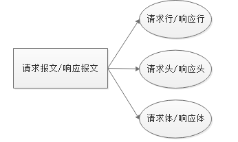

### 请求报文

- 请求报文

    - 浏览器在向服务器发送请求的时候，会携带的数据
    - 该数据是特定格式的字符串
    - 可以使用 chrome 监视请求并查看请求报文

- 请求报文格式

    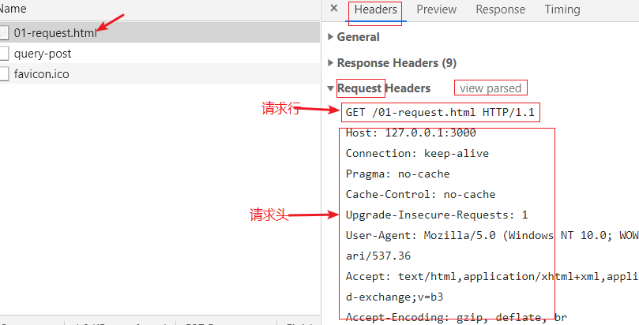

    **==GET方式请求没有请求体、POST方式有请求体，请求体就是发送给服务器的数据==**

    - 请求行

        - 请求方法(常见的 GET 和 POST)

        - 请求路径

        - 协议版本

            ```http
            GET / HTTP/1.1
            GET /index.html HTTP/1.1
            ```

    - 请求头

        - 浏览器在向服务器发送请求的时候携带了附加信息
        - 由键值对组成
        - 如果需要设置请求头，使用setRequestHeader方法来设置
        - [参考链接](https://developer.mozilla.org/zh-CN/docs/Web/HTTP/Headers)

        | 键              | 值                                                           |
        | --------------- | ------------------------------------------------------------ |
        | Host            | 请求的主机                                                   |
        | Cache-Control   | 控制缓存（例如：max-age=60 缓存 60 秒）                      |
        | Accept          | 客户端想要接收的文档类型，逗号分隔                           |
        | ==User-Agent==  | 标识什么客户端帮你发送的这次请求，可以看出发请求的浏览器是什么浏览器 |
        | Referer         | 这次请求的来源                                               |
        | Accept-Encoding | 可以接受的压缩编码                                           |
        | Content-Type    | POST请求时，告诉服务器，给你提交的数据编码格式是什么         |

    - 请求体

        - GET 请求==没有==请求体
        - POST 请求有请求体，请求体就是发送给服务器的数据

### 响应报文

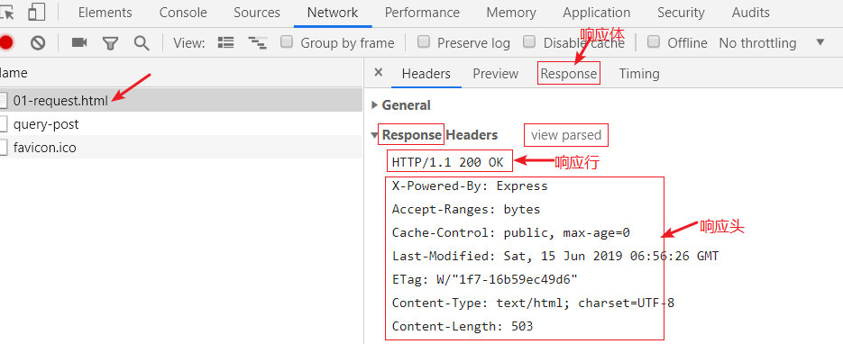

- 响应报文组成

    - 响应行

        - 协议版本

            ```js
            HTTP/1.1 200 OK
            // 需要注意的是200，它表示状态码
            // 状态码：
            // - 描述了请求过程中所发生的情况
            // - 每个状态码的第一位数字都用于描述状态的一般类别("成功"、"出错"等)
            // - 常见状态码
            //   - 200 - 成功
            //   - 304 - 成功，曾经请求过它
            //   - 404 - 请求的资源不存在
            //   - 500 - 服务器内部错误
            // 参考链接 https://developer.mozilla.org/zh-CN/docs/Web/HTTP/Status
            ```

    - 响应头

        - 服务器返回响应的时候携带了附加信息
        - 由键值对组成

        | 键               | 值               |
        | ---------------- | ---------------- |
        | Date             | 响应时间         |
        | Server           | 服务器信息       |
        | **Content-Type** | 响应体的内容类型 |
        | Content-Length   | 响应的内容大小   |

    - **响应体**

        - 返回的主体内容，如果请求的是网页返回网页的内容，如果请求的是图片返回图片的内容


### 小结

> 请求头有Content-Type：application/x-www-form-urlencoded 告诉服务器，发送给你的数据是什么编码的
>
> 响应头有Content-Type:  application/json; charset=utf-8 服务器告诉浏览器，返回的数据是 json 。编码是utf-8

http协议：浏览器和服务器签订的协议。协议规定了请求报文和响应报文的格式。

- 请求报文：
    - 请求行
        - GET  
        - url
    - 请求头
        - Content-Type: 浏览器告诉服务器，我给你发送是数据编码是什么
        - User-Agent：告诉服务器，我使用的是什么浏览器发送的请求
    - 请求体
        - get请求没有请求体
        - POST请求有请求体，请求体就是发送给服务器的数据
- 响应报文：
    - 响应行
        - 状态码
    - 响应头
        - Content-Type: 服务器告诉浏览器，我给你返回的数据是什么类型
    - 响应体
        - 我们所说的服务器返回的数据

### Ajax请求遵循 HTTP协议

Ajax请求也要符合http协议。

本质上 XMLHttpRequest 就是 JavaScript 在 Web 平台中发送 HTTP 请求的手段，所以我们发送出去的请求任然是 HTTP 请求，同样符合 HTTP 约定的格式：

```javascript
// 设置请求报文的请求行
xhr.open('GET', '/time')
// 设置请求头
xhr.setRequestHeader('Accept', 'text/plain')
// 设置请求体
xhr.send(null)

xhr.onreadystatechange = function () {
  if (this.readyState === 4) {
    // 获取响应状态码
    console.log(this.status)
    // 获取响应状态描述
    console.log(this.statusText)
    // 获取响应头信息
    console.log(this.getResponseHeader('Content-Type')) // 指定响应头
    console.log(this.getAllResponseHeaders()) // 全部响应头
    // 获取响应体
    console.log(this.responseText) // 文本形式
    console.log(this.responseXML) // XML 形式，了解即可不用了
  }
}
```

> 参考链接：
>
> - https://developer.mozilla.org/zh-CN/docs/Web/API/XMLHttpRequest
> - https://developer.mozilla.org/zh-CN/docs/Web/API/XMLHttpRequest/Using_XMLHttpRequest

## Web服务器

 问题: 当我们写好一个html文件，放在桌面上时，别人能不能通过浏览器访问？

  	答: 不行。 必须将我们的html文件放入web服务器，其他人通过网络才能访问。

服务器作用：

​	只有放到服务器上的资源（html、css、js、图像、数据），才能被所有人访问

### 什么是服务器？

服务器可以从硬件、软件(系统软件、应用软件)两个角度描述。

- 按硬件描述
    - 服务器就是一台超级计算机。可以达到常年不关机。
- 按系统划分
    - 在硬件上安装了什么操作系统，就可以称为该系统的服务器
    - 例如:  linux服务器、windows服务器、unix服务器等。
- 按软件划分
    - 在操作系统中安装了什么软件，就可以称作该软件的服务器
    - 例如:  Apache服务器、MySQL服务器、邮件服务器等。

### Web服务器

Web服务器就是安装了Web服务软件，能够提供网站服务的服务器。

- 常见的Web服务器软件：
  - Apache、Nginx、IIS、Tomcat、Nodejs 等。
  - 我们学习时用的是 源码（通过node app.js来开启服务）

  PS: web服务器又叫做http/httpd服务器

### 服务器有什么作用

- 服务器用于保存开发好的网页和网页中用到的数据
- 通过服务器的IP地址或域名可以访问到服务器上的资源(网页或数据接口)
    - 只要是能够连接到服务器，任何人都可以访问服务器上的资源

## 使用Apache演示服务器

### 介绍

WampServer软件是一个集成环境，包含了：Apache、MySQL等服务器软件。 我们安装该软件之后，就是在自己电脑上安装了 Apache服务器和MySQL服务器。

W：windows

a：Apache

m：MySQL

p：php

类似的软件： PHPstudy、PHPnow等等

### 下载

下载：<https://sourceforge.net/projects/wampserver/>

### 安装

#### 1）安装之前要检测计算机的端口是否被占用了

- 直接用管理员身份，打开命令提示符

    执行命令：netstat -anb  查看 80端口和3306端口是否被占用了

    80 端口是Apache软件默认的端口

    3306是MySQL软件默认的端口

    如果端口被占用了，查看是哪个程序占用了端口，最后去任务管理器中，结束该程序的任务。

#### 2）安装目录必须是英文目录

安装目录中不能包含中文。

==核心重点：  安装任何与开发相关的软件时都必须安装到英文路径下。== (不安装到英文路径下可能产生未知的错误)

#### 3）允许 Apache 和 MySQL 访问网络

安装过程中，如果出现防火墙的问题，则需要允许

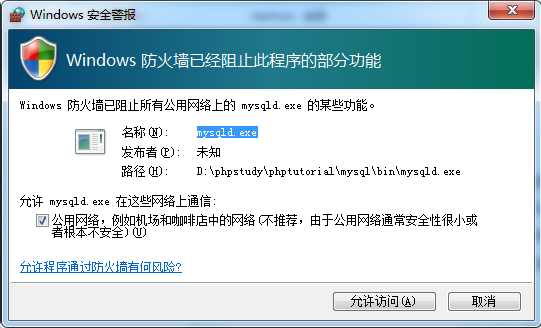

#### 4）安装

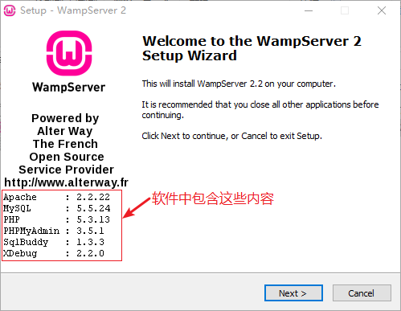

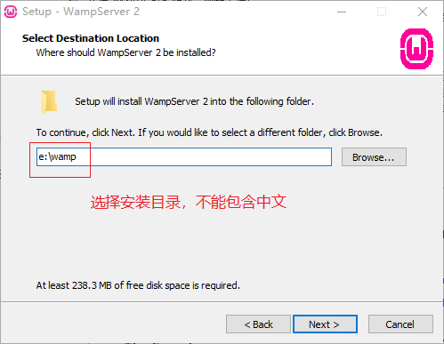

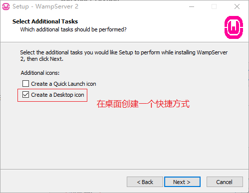

安装到最后的位置，会出现下面的选择框，让我们选择一个浏览器；你可以选择chrome浏览器。如果你找不到你的谷歌，直接点击打开，选择IE浏览器即可。这步不是必须选择chrome。

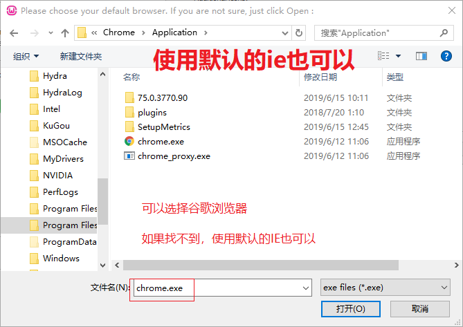

后续next，完成安装即可。

#### 5）安装完毕，查看图标

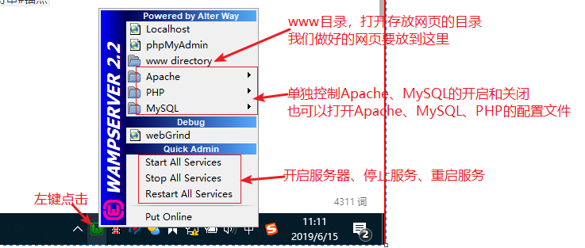

#### 6) 测试

浏览器输入127.0.0.1 看效果：

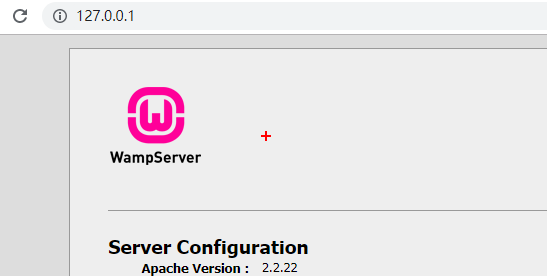

**到此为止，一个集成了Apache和MySQL的软件（WampServer）就安装好了**。

### 安装目录介绍

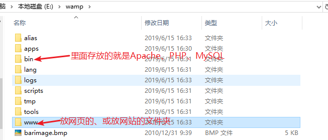

### 使用Apache展示静态网站

将品优购所有页面都复制到www目录中，然后通过浏览器 127.0.0.1 就可以访问到品优购的页面了。

## 网络的基础概念

### URL组成

URL（Uniform Resource Locator），统一资源定位符，通俗点来说就是表示网络当中某一个网页的完整访问地址，它具有一定的格式：`协议://主机地址[:端口]/路径[?查询字符串][#锚点]`

```html
http://localhost:4000/time?id=11&age=222
http://localhost:4000/index.html#top

<body id="top">
    
</body>

<a href="#top">顶部</a>
```

- 协议
    - http
    - https
- 主机地址，网站服务器的地址
    - IP地址
    - 域名
- 端口
    - http请求，默认端口80
    - https请求，默认端口443
    - MySQL默认端口3306
    - 访问一个网页的时候，默认端口可以省略
- 路径
    - 服务器文件夹上的资源（html/css/images/js/接口）
- 参数（查询字符串）
    - ? 后面的部分，是键值对的形式

例如：http://itcast.cn:80/schools/students?id=18&name=zs#photo

URL作用：标示网络上的资源

### IP 地址

> Internet Protocol Address

- 作用就是标识一个网络设备（计算机、手机、电视）在**某一个具体的网络**当中的地址。
- 设备在某一个网络中的地址，目前最常见的格式：`[0-255].[0-255].[0-255].[0-255]` 即为四个 0-255 的数字组成。
- 在同一个网络中，计算机的IP是不允许相同的，都是唯一的
- 127.0.0.1 是本地回环地址，该地址永远可以访问到自己的计算机

#### 单个网络情况

在单个局域网下，结构非常简单，就是我们所连接的网络设备（网关）给我们分配了一个地址，在**这个范围之内**我们都可以通过这个地址找到我们的这个设备。

> 如果设备没有连接任何网络情况下，我们会有一个本地回环地址 127.0.0.1


#### 多个网络情况

但是当一个设备同时处于多个网络下（比如同时连接了有线网卡和无线网卡），就会变得稍微复杂一点：


### 域名

由于 IP 地址都是没有规律的一些数字组成的，很难被人记住，不利于广泛传播，所以就有人想出来要给 IP 起名字（别名）。

> 域名是需要花钱注册的
>
> 购买到域名需要解析到你的web服务器，即让他和服务器IP对应上

#### 顶级域名（了解）

.com: 商业机构 
.cn: 中国国家、地区域名 .hk
.gov: 政府网站。
.org: 机构。
.edu: 教育网站。
.net: 网络服务商。 
.mil: 军事。

#### 特殊的域名

`localhost` 含义为本地主机，对应127.0.0.1 。这是一个保留域名，主要用于本地测试。

### 端口

计算机本身是一个封闭的环境，就像是一个大楼，如果需要有数据通信往来，必须有门，这个门在术语中就叫端口，每一个端口都有一个编号，每台计算机只有 65536 个端口（0-65535）。

> 一般我们把“占门”的过程叫做监听
>
> **端口号的作用，是标示计算机内的某个软件，区分计算机中的每个软件**

可以通过在命令行中运行： `netstat -an` 命令监视本机端口使用情况

在请求网络资源时，默认端口可以省略

> 参考链接：
>
> - https://baike.baidu.com/item/%E6%9C%8D%E5%8A%A1%E5%99%A8%E7%AB%AF%E5%8F%A3
> - https://baike.baidu.com/item/%E7%AB%AF%E5%8F%A3
> - `http` 默认的端口 `80`
> - `https` 默认的端口是 `443`
> - `mysql` 默认端口是3306

### DNS

DNS: Domain Name System  域名系统。在DNS服务器中保存了域名和IP的映射关系。主要工作是将域名转换为IP地址，因为我们通过浏览器访问网站时，实际上是去找对应的IP地址。

| 域名      | IP           |
| --------- | ------------ |
| baidu.com | 202.22.35.66 |
| sina.com  | 45.22.45.45  |

通过宽带运营商提供的服务器解析一个域名背后对应的 IP，这个过程叫做 **DNS 寻址**，帮你完成 DNS 寻址过程的服务器叫做 **DNS 服务器**。

通俗的将，DNS服务器能够通过你输入的域名返回该域名对应的IP。然后我们通过IP去访问网络上的资源。

#### 浏览器DNS缓存

当我们在浏览器输入域名后，浏览器首先并不是向DNS服务器发起请求，解析其对应的IP的，而是先看浏览器缓存中是否有缓存，如果有，则使用缓存中保存的IP去请求网络资源的。

- windows下查看dns缓存:
    - ipconfig  /displaydns
    - ipconfig  /displaydns > c:/dnscache.txt   将dns缓存导入到c:/dnscache.txt文件

- windows下清除dns缓存
    - ipconfig  /flushdns

- 清除谷歌浏览器缓存
    - chrome://net-internals/#dns

#### hosts 文件

操作系统在发起对 DNS 服务器的查询请求之前，会优先检查本机的 hosts 文件。如果这个文件中包含了对当前需要解析的域名的配置，则不再发起对 DNS 服务器的请求，直接使用 hosts 文件中的配置。

**文件所在路径：**

- Windows：`C:\Windows\System32\drivers\etc\hosts`
- macOS：`/etc/hosts`

> **注意：**
>
> - 本机的 hosts 文件配置只能到影响本机的 DNS 寻址
> - 只有以管理员权限运行的编辑器才有权利修改 `hosts` 文件

### 发起TCP请求

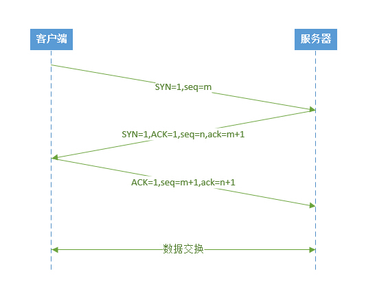

客户端在向服务器发请求之前，会先向服务器发送TCP请求，过程可以理解为：

1. 客户端：hello，你在吗？
2. 服务器：嗯，我在
3. 客户端：好的，我知道了

此过程又称之为客户端和服务器三次握手。

### 访问网站时请求响应流程

我们在浏览器输入一个网址后，按下回车，最后看到一个页面，这个过程是怎样的？

下图是一个访问网站的完整流程：

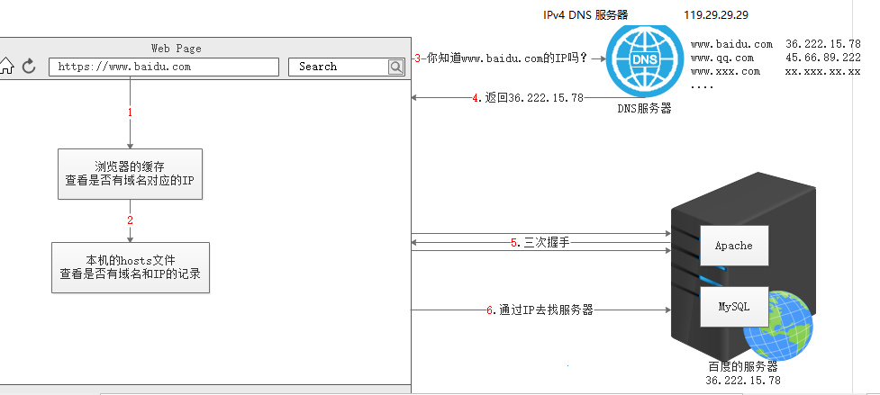

1. 用户打开浏览器
2. 地址栏输入我们需要访问的网站网址（`URL`）
3. 检测浏览器DNS缓存，看是否有域名和IP的对应关系
4. 检查本机的 hosts 文件，看是否有域名和IP的对应关系
5. 浏览器通过  `DNS 服务器` 获取即将访问的网站  `IP 地址`
6. 进行三次握手
7. 浏览器发起一个对这个 IP地址的 `请求`
8. 服务端监听指定的 `端口` 的服务器软件接收到这个请求，**进行相应的处理**
9. 服务端将处理完的结果返回给客户端浏览器（`响应`）
10. 浏览器将服务端返回的结果呈现到界面上

### C/S 与 B/S

应用软件架构一般分为两类：

- B/S 架构：Browser（浏览器） ←→ Server（服务器），这种软件都是通过浏览器访问一个网站使用，服务器提供数据存储等服务。
    - 优点：简单方便，不用下载软件。网站升级和浏览器没关系
    - 缺点：不安全，占用带宽（流量）较少，传输速度比较慢。
- C/S 架构：Client（客户端） ←→ Server（服务器），这种软件通过安装一个软件到电脑，然后使用，服务器提供数据存储等服务。
    - 优点：安全，占用带宽（流量）较少，传输速度比较快。
    - 缺点：需要下载软件，还要更新客户端

### 静态网站和动态网站

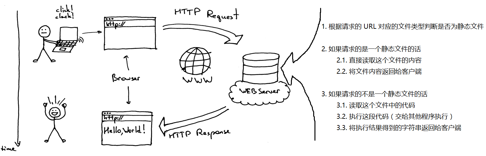

#### 静态网站

- Apache 实现的功能，浏览器请求对应的文件 → Apache 负责读取文件 → 将文件内容响应给客户端浏览器
- Apache 将**网页文件(纯文本)原封不动的返回给浏览器**
- **无法满足让网页内容动起来（随着数据动态变化）的需求**

#### 动态网站

- 不再将 HTML 固定写死，每次用户请求时，动态执行一段代码，临时生成一个用户想要的 HTML 页面。

- **动态网站指的也就是每次请求时服务端动态生成 HTML 返回给用户的这种网站。**
- 实现动态网站的技术有很多，例如：JSP、ASP.NET、PHP、**Node.js** 等等。

这里我们选择 Node.js 作为我们了解服务端动态网页开发的技术方案，注意：**我们学习的重心不在 Node.js，而是了解服务端开发，以及某些其他对前端开发有帮助的东西。

# 命令行

## 命令行介绍

- windows未发布之前，人们都是用DOS（磁盘操作系统）来操作计算机。
- DOS系统内置了很多命令（例如：cd、dir等），我们可以通过调用不同的命令来操作计算机。
- windows发布之后保留了命令行操作模式，内置了两种命令行： Cmd 和 PowerShell，我们可以使用命令行来操作计算机。 win 7默认Cmd， win 10 默认 PowerShell

Cmd：


PowerShell：


## 为什么要学习命令行

- 学习 Node.js 离不开命令行环境
- 作为一名前端开发工程师，**日常工作是离不开命令行的**，因为有**一些工作只有通过命令才能完成**。其中包括：
  1. 使用 Node.js 开发的工具
  2. 从服务器获取或提交源代码
  3. 开启测试 Web 服务器
  4. 代码压缩、合并
  5. Git
  6. ...

## 打开命令行的方式

> 不同系统，命令行工具不一样，但是都不影响使用

- **方式 1**：**开始菜单**|**Windows 系统**|**命令提示符**，如下图所示：

  

- **方式2**：找到上图中的运行，或按快捷键 `win+r`，找到运行，然后输入 `cmd`，回车。如下图所示：

  

- **方式3**：在任何文件夹，按住shift键，然后右键，选择命令行工具

  

- **方式4**：代码编辑器内置命令行工具

  - VSCode

    - `Ctrl + 反引号`

      

  - WebStorm

    - `Alt + F12`

## 使用命令

### 命令格式（了解）

```bash
command [/options] [parameter]
```

### 命令行中的路径

打开命令行窗口后，在**窗口的左上角位置**，会显示**当前所在的位置**，如下图所示：


上图中C:\Users\Tang>表示当前执行命令的目录，其中：

- `C:` 表示**盘符**；
- `\`表示**目录的层次关系**；
- `>` 在后面输入命令。

### 切换盘符（windows系统）

直接输入盘符后面跟一个冒号，回车即可。


**提示**：

1. 盘符的**字母不区分大小写**；
2. 盘符的冒号 `:` 后面不要使用 `\`。

### cd 命令

> 切换目录的命令，它只能切换目录，但是不能切换盘符

| 命令        | 含义               |
| ----------- | ------------------ |
| `cd \`      | 切换到**根目录**   |
| `cd .`      | 保持在当前目录不变 |
| `cd ..`     | 切换到**上级目录** |
| `cd [目录]` | 切换到指定目录     |

#### 相对目录和绝对目录

- **相对路径**：从当前目录开始的路径描述。例如：
  - `cd dev` 表示切换到当前目录下的 `dev` 目录；
  - `cd ..\css` 表示切换到上级目录下的 `css` 目录。
- **绝对路径**：从**盘符**开始的完整路径描述。例如：
  - `cd C:\Users\黑马程序员` 表示切换到 `C:\Users\黑马程序员`。
  - 注意：使用绝对路径，不能直接从一个盘切换到另外的盘，必须先切换盘符

### 4.5 常用命令（掌握）

|  序号  | 命令                         | 英文                     | 作用                       |
| :----: | ---------------------------- | ------------------------ | -------------------------- |
| ==01== | `dir [目录名]`  `苹果系统ls` | **dir**ectory            | 列出目录中的所有文件       |
| ==02== | `cd [目录名]`                | **c**hange **d**irectory | 切换目录                   |
| ==03== | `盘符:`，如：`c:`、`d:` 等   |                          | 切换盘符                   |
|   04   | `md [目录名]`                | **m**ake **d**irectory   | 创建文件夹（知道）         |
|   05   | `rd [目录名]`                | **r**emove **d**irectory | 删除文件夹（知道）         |
| ==06== | `cls`                        | clear                    | 清屏                       |
|   07   | `exit;`                      | **exit**                 | 退出命令行，关闭命令行窗口 |

### 小技巧（掌握）

- **粘贴和复制**

- (c) 2018 Microsoft Corporation。保留所有权利

  - **粘贴**：**点击鼠标右键**，可以将之前在其他位置复制过的文本**粘贴到当前命令行**。

    > **提示**：从资源管理器粘贴很长的目录时尤其有用！

  - **复制**：在命令行窗口中选中一段文本后，**点击鼠标右键**，可以复制选中的文本。

- **自动补全**

  - 在敲出**文件/目录**的前几个字母后，按下 **tab** 键；
    - 如果**有以这前几个字母开头的**文件/目录，系统**会自动补全**；
    - 如果补全的文件/目录不是想要的，**可以再次按 tab 键**，会**切换下一个**文件/目录，只到切换到想要的文件/目录为止。

- **历史命令**

  - 按**上/下光标键**可以在曾经使用过的命令间来回切换；
  - 如果不想执行当前的命令可以按 **CTRL + C**。

### 小结

- **本小节重点**

  1. 会打开命令行窗口，对命令行窗口建立第一印象；

  2. 知道使用 `cd` 切换目录，盘符切换磁盘；

  3. 如果执行的程序时间比较长，终止正在执行的程序 `CTRL + C`，退出终端窗口 `exit`。

     

# ECMAScript 6

自学网站：<http://es6.ruanyifeng.com/>

目标：学习完 ES6 可以掌握方便后续的开发，未来工作中大量使用 ES6 开发

1. ECMAScript 6 介绍
2. ECMAScript 6 新增语法
3. 内置对象的扩展
4. ECMAScript 6 降级处理

## ECMAScript 6 介绍

<!--01-介绍-ES6简介-->

JS包含下面三个方面

ECMAScript（语法标准）   DOM（操作标签的一套API）   BOM（浏览器对象）

ECMA  欧洲计算机制造商协会

### 为什么要学习ES6

- 提供了更加方便的新语法，**弥补** JS 语言本身的**缺陷**，新增了便捷的语法
- 给内置对象增加了更多的方法。
- ES6 让 JS 可以开发复杂的大型项目，成为企业级开发语言
- 新的前端项目中大量使用 ES6 的新语法

### ECMAScript 6 是什么

- ECMAScript 6 又叫 ES2015，简称 ES6
- ES6 是继 ES4、ES5 之后的 JS 语言规范
- ES6 中增加了一些新的特性
- ES6 的目标，是使得 JavaScript 语言可以用来编写复杂的大型应用程序，成为企业级开发语言
- 2015年6月发布

### 小结

- ES6 是新的 JS 的代码规范，提供了一些新特性，使我们可以开发大型应用
- ES6 弥补了 JS 语言本身的缺陷，增加了新语法，扩展了内置对象

## ECMAScript 6 新增语法

1. let 和 const
2. 解构赋值
3. 函数
4. 字符串扩展
5. 数组扩展
6. 新的定义对象的方式

### let 和 const

- let

  - let 定义变量，变量不可以再次定义，但可以改变其值

  - 具有块级作用域

  - 没有变量提升，必须先定义再使用

  - let声明的变量不会压到window对象中，是独立的

  - 代码演示

    ```js
    // 1. let 定义变量，变量不可以再次定义，但可以改变其值
    let name = 'zhangsan';
    name = 'lisi';
    console.log(name); // lisi
    let name = 'wangwu'; // 再次定义，报错：Identifier 'name' has already been declared
    ```

    ```js
    // 2. 具有块级作用域，块就是大括号
    {
        let age = 18;
        console.log(age); // 18
    }
    console.log(age); // 报错，此作用域中没有age的定义
    
    for (let i = 0; i < 10; i++) {
        // i 只能在此范围内使用，因为有块级作用域
    }
    console.log(i);  // 报错，此作用域中没有age的定义
    ```

    ```js
    // 3. 没有变量提升，必须先定义再使用
    console.log(gender); // 报错，此时还没有定义gender
    let gender = '男'; 
    ```

    ```js
    // 4. let声明的变量不会压到window对象中，是独立的
    let hobby = '吃饭';
    console.log(window.hobby); // undefined
    ```

> 如果使用var声明了变量，也不能再次用let声明了，反之也是不行的。
>
> 原因也是这个变量已经被声明过了。
>
> 不过这只是一种特殊情况了，实际开发要么全部使用var，要么全部使用let。

- const

  - 使用const关键字定义常量

  - 常量是不可变的，一旦定义，则不能修改其值

  - 初始化常量时，必须给初始值

  - 具有块级作用域

  - 没有变量提升，必须先定义再使用

  - 常量也是独立的，定义后不会压入到window对象中

  - 代码演示

    ```js
    // 1. 使用const关键字定义常量，常量名一般大写
    const PI = 3.1415926;
    ```

    ```js
    // 2. 常量是不可变的，一旦定义，则不能修改其值
    const PI = 3.1415926；
    PI = 3.14; // 报错，常用一旦被初始化，则不能被修改
    ```

    ```js
    // 3. 初始化常量时，必须给初始值
    const PI; // 报错，Missing initializer in const declaration
    ```

    ```js
    // 4. 具有块级作用域
    // 5. 没有变量提升，必须先定义再使用
    // 6. 常量也是独立的，定义后不会压入到window对象中
    // 这三条和let变量一样，不再写代码
    ```

- 小结

  | 关键字 | 变量提升 | 块级作用域 | 初始值 | 更改值 | 通过window调用 |
  | :----: | :------: | :--------: | :----: | :----: | :------------: |
  |  let   |    ×     |     √      |   -    |  Yes   |       No       |
  | const  |    ×     |     √      |  Yes   |   No   |       No       |
  |  var   |    √     |     ×      |   -    |  Yes   |      Yes       |

### 解构赋值

1. 数组的解构
2. 对象的解构

ES 6 允许按照一定**==模式==**，从数组和对象中提取值，对变量进行赋值，这被称为解构（Destructuring）。

#### 数组的解构

方便获取数组中的某些项

```js
// 情况1，变量和值一一对应
let arr = [5, 9, 10];
let [a, b, c] = arr;
console.log(a, b, c); // 输出 5 9 10

```

```js
// 情况2，变量多，值少
let arr = [5, 9, 10];
let [a, b, c, d] = arr;
console.log(a, b, c, d); // 输出 5 9 10 undefined

```

```js
// 情况3，变量少，值多
let arr = [5, 9, 10, 8, 3, 2];
let [a, b] = arr;
console.log(a, b); // 5, 9

```

```js
// 情况4，按需取值
let arr = [5, 9, 10, 8, 3, 2];
let [, , a, , b] = arr; // 不需要用变量接收的值，用空位占位
console.log(a, b); // 10, 3 

```

```js
// 情况5，剩余值
let arr = [5, 9, 10, 8, 3, 2];
let [a, b, ...c] = arr; // ...c 接收剩余的其他值，得到的c是一个数组
console.log(a, b, c); 
// 结果：
// a = 5, 
// b = 9, 
// c = [10, 8, 3, 2]

```

```js
// 情况6，复杂的情况，只要符合模式，即可解构
let arr = ['zhangsan', 18, ['175cm', '65kg']];
let [, , [a, b]] = arr;
console.log(a, b); // 175cm 65kg
```

#### 对象的解构

- 方便解析对象中的某些属性的值

```js
// 情况1，默认要求变量名和属性名一样
let { foo, bar } = {foo: 'aaa', bar: 'bbb'};
console.log(foo, bar); // aaa, bbb

let {a, c} = {a: 'hello', b: 'world'};
console.log(a, c); // hello, undefined
```

```js
// 情况2，可以通过:为变量改名
let {a, b:c} = {a: 'hello', b: 'world'};
console.log(a, c); // hello, world
```

```js
// 情况3，变量名和属性名一致即可获取到值，不一定要一一对应
let {b} = {a: 'hello', b: 'world'};
console.log(b); // world
// 此时，没有定义变量a，所以使用a会报错

```

```js
// 情况4，剩余值
let obj = {name:'zs', age:20, gender:'男'};
let {name, ...a} = obj;
console.log(name, a);
// 结果：
// name = zs
// a = {age: 20, gender: "男"};

```

```js
// 情况5，复杂的情况，只要符合模式，即可解构
let obj = {
    name: 'zhangsan',
    age: 22,
    dog: {
        name: '毛毛',
        age: 3
    }
};
let {dog: {name, age}} = obj;
console.log(name, age); // 毛毛 3

```

#### 实际应用

```js
// 假设从服务器上获取的数据如下
let response = {
    data: ['a', 'b', 'c'],
    meta: {
        code: 200,
        msg: '获取数据成功'
    }
}
// 如何获取到 code 和 msg
let { meta: { code, msg } } = response;
console.log(code, msg); // 200, 获取数据成功

```

### 函数

#### 箭头函数

ES6 中允许使用箭头定义函数 (=>  goes to)，目的是**简化函数的定义**并且里面的this也比较特殊。

- 箭头函数的基本定义

  ```js
  // 非箭头函数
  let fn = function (x) {
      return x * 2;
  }
  // 箭头函数，等同于上面的函数
  let fn = (x) => {
      return x * 2;
  }
  
  ```

- 箭头函数的特点

  - 形参只有一个，可以省略小括号

    ```js
    let fn = (x) => {
        return x * 2;
    }
    // 等同于
    let fn = x => {
        return x * 2;
    }
    
    ```

  - 函数体只有一句话，可以省略大括号，并且表示返回函数体的内容

    ```js
    let fn = (x, y) => {
        return x + y;
    }
    // 等同于
    let fn = (x, y) => x + y;
    ```
    
- 箭头函数内部没有 arguments
  
  ```js
    let fn = () => {
        console.log(arguments); // 报错，arguments is not defined
    };
    fn(1, 2);
    
    ```
  
- 箭头函数内部的 `this` 指向外部作用域中的 `this` ，或者可以认为箭头函数没有自己的 `this`
  
  ```js
    var name = 'lisi'; // 测试时，这里必须用var，因为用let声明的变量不能使用window调用
    let obj = {
        name: 'zhangsan',
        fn : () => {
            console.log(this); // window对象
            console.log(this.name); // lisi
        }
    };
    obj.fn();
    
    ```
  
- 箭头函数不能作为构造函数
  
  ```js
    let Person = () => {
    	
    };
    let obj = new Person(); // 报错，Person is not a constructor
    // 换个角度理解，箭头函数中都没有自己的this，怎么处理成员，所以不能当构造函数
    
    ```

#### 参数的默认值

ES6 之前函数不能设置参数的默认值

```js
// ES5 中给参数设置默认值的变通做法
function fn(x, y) {
    y = y || 'world';
    console.log(x, y);
}
fn(1)
// ES6 中给函数设置默认值
function fn(x, y = 'world') {
    console.log(x, y);
}
fn(2)
fn(2,3)

```

#### rest 参数

rest 参数：剩余参数，以 … 修饰最后一个参数，把多余的参数都放到一个**数组**中。可以替代 arguments 的使用

```js
// 参数很多，不确定多少个，可以使用剩余参数
function fn(...values) {
    console.log(values); // [6, 1, 100, 9, 10]
}
// 调用
fn(6, 1, 100, 9, 10);

```

```js
function fn(a, b, ...values) {
    console.log(a); // 6
    console.log(b); // 1
    console.log(values); // [100, 9, 10]
}
// 调用
console.log(fn(6, 1, 100, 9, 10));

```

> **注意：rest 参数只能是最后一个参数**

## 内置对象的扩展

1. Array 的扩展
2. String 的扩展
3. Number 的扩展
4. Set

### Array 的扩展

<!--03.1-语法-Array扩展-->

- 扩展运算符

  - 可以看成 rest 参数的逆运算，也可以看做是 **...** 可以把数组中的每一项展开

  ```js
  // 合并两个数组
  let arr1 = [1, 2];
  let arr2 = [3, 4];
  let arr3 = [...arr1, ...arr2];
  console.log(arr3); // [1, 2, 3, 4]
  
  // 把数组展开作为参数，可以替代 apply
  // 求数组的最大值
  let arr = [6, 99, 10, 1];
  let max = Math.max(...arr); // 等同于 Math.max(6, 99, 10, 1);
  
  ```

- Array.from()

  - 把伪数组转换成数组
  - 伪数组必须有length属性，没有length将得到一个空数组
  - 转换后的数组长度，是根据伪数组的length决定的

  ```js
  let fakeArr = {
    0: 'a',
    1: 'b',
    2: 'c',
    length: 3
  };
  
  let arr = Array.from(fakeArr);
  console.log(arr); // ['a', 'b', 'c']
  
  // 转数组的对象必须有length值，因为得到的数组的成员个数是length指定的个数
  // 上例中，如果length为2，则得到的数组为 ['a', 'b']
  
  ```

- forEach遍历数组

  - 要为forEach传递一个函数进来

  - 为forEach传递的函数有三个形参，分别表示数组的值、下标、当前的数组

    ```js
    // [xxx,xxx].forEach(function (value, index, arr) {
        // value 表示数组的值
        // index 表示数组的下标、索引
        // arr 表示当前的数组
    // });
    
    [3, 8, 4, 9].forEach(function (v, i, a) {
        console.log(v); // 表示数组的值 ，输出的结果是 3,8,4,9
        // console.log(i); // 表示数组的下标
        // console.log(a); // 表示数组
    });
    
    // 如果不需要下标和当前的数组，只使用value即可
    // 函数可以使用箭头函数
    [3, 8, 4, 9].forEach((item) => {
        console.log(item);
    });
    
    // 下面的意思是循环，在循环数组的时候，输出数组的每个值
    [3, 8, 4, 9].forEach(item => console.log(item));
    
    ```

    

- 数组实例的 find() 和 findIndex()

  - find和findIndex方法，会遍历传递进来的数组
  - 回调函数有三个参数，分别表示数组的值、索引及整个数组
  - 回调函数中return的是一个条件，find和findIndex方法的返回值就是满足这个条件的第一个元素或索引
  - **find** 找到数组中第一个满足条件的成员并**返回该成员**，如果找不到返回**undefined**。
  - **findIndex** 找到数组中第一个满足条件的成员并**返回该成员的索引**，如果找不到返回 **-1**。

  ```js
  // 语法结构
  let arr = [1, 2, 4, 0, -4, 3, -2, 9];
  arr.find(function (item, index, self) {
      console.log(item); // 数组中的每个值
      console.log(index); // 数组中的每个索引/下标
      console.log(self); // 当前的数组
  });
  
  ```

  ```js
  // 用法：找数组中第一个小于0的数字
  let arr = [1, 2, 4, 0, -4, 3, -2, 9];
  let result = arr.find(function (item) {
      return item < 0; //遍历过程中，根据这个条件去查找
  });
  console.log(result); // -4
  
  ```

  > findIndex 的使用和 find 类似，只不过它查找的不是值，而是下标

- 数组实例的 includes()

  - 判断数组是否包含某个值，返回 true / false
  - 参数1，必须，表示查找的内容
  - 参数2，可选，表示开始查找的位置，0表示开头的位置

  ```js
  let arr = [1, 4, 3, 9];
  console.log(arr.includes(4)); // true
  console.log(arr.includes(4, 2)); // false， 从2的位置开始查，所以没有找到4
  console.log(arr.includes(5)); // false
  
  ```

### String的扩展

<!--03.2-语法-String扩展-->

- 模板字符串

  - 模板字符串解决了字符串拼接不便的问题
  - 模板字符串使用反引号 **`** 括起来内容
  - 模板字符串中的内容可以换行
  - 变量在模板字符串中使用 `${name}` 来表示，不用加 + 符号

  ```js
  let name = 'zs';
  let age = 18;
  // 拼接多个变量，在模板字符串中使用占位的方式，更易懂
  let str = `我是${name}，今年${age}`;
  
  // 内容过多可以直接换行
  let obj = {name: 'zhangsan', age: 20};
  let arr = ['175cm', '60kg'];
  let html = `
  	<div>
  		<ul>
  			<li>${obj.name}</li>
  			<li>${obj.age}</li>
  			<li>${arr[0]}</li>
  			<li>${arr[1]}</li>
  		</ul>
  	</div>
  `;
  
  ```

- includes(), startsWith(), endsWith()

  - `includes(str, [position])`		返回布尔值，表示是否找到了参数字符串
  - `startsWidth(str, [position])`         返回布尔值，表示参数字符串是否在原字符串的头部或指定位置
  - `endsWith(str, [length])`            返回布尔值，表示参数字符串是否在原字符串的尾部或指定位置。

  ```js
  console.log('hello world'.includes('e', 2)); // false 从位置2开始查找e，没有找到
  console.log('hello world'.includes('e')); // true
  
  console.log('hello world'.startsWith('h')); // 未指定位置，看开头是否是h，返回true
  console.log('hello world'.startsWith('l', 2)); // 指定位置的字符是l，返回true
  
  console.log('hello world'.endsWith('d')); // 未指定位置，结尾是d，返回true
  console.log('hello world'.endsWith('r', 9)); // 指定位置的字符是r，返回true
  
  ```

- repeat()

  `repeat`方法返回一个新字符串，表示将原字符串重复`n`次。

  ```js
  let html = '<li>itheima</li>';
  html = html.repeat(10);
  
  ```

- trim()

  `trim()` 方法可以去掉字符串两边的空白

  ```js
  console.log('    hello        '.trim()); // hello
  console.log('    hello        '); //
  
  ```

  

### Number的扩展

ES6 将全局方法`parseInt()`和`parseFloat()`，移植到`Number`对象上面，功能完全保持不变。

- Number.parseInt()

- Number.parseFloat()

  ```js
  console.log(parseInt('123abc'));
  // ES6中，将parseInt移植到了Number对象上
  console.log(Number.parseInt('123abc'));
  
  ```

  

### Set

<!--03.4-语法-新增Set对象-->

ES6 提供了新的数据结构 Set。它类似于数组，但是==成员的值都是唯一的==，没有重复的值。

`Set`本身是一个构造函数，用来生成 Set 数据结构。

Set的特点就是该对象里面的成员不会有重复。

```js
// 1. 基本使用
let s = new Set();
// 得到一个空的Set对象
// 调用add方法，向s中添加几个值
s.add(3);
s.add(7);
s.add(9);
s.add(7); // Set对象中的成员都是唯一的，前面添加过7了，所以这里添加无效

console.log(s.size);
console.log(s); // {3, 7, 9}

```

- Set 的成员
  - `size`：属性，获取 `set` 中成员的个数，相当于数组中的 `length`
  - `add(value)`：添加某个值，返回 Set 结构本身。
  - `delete(value)`：删除某个值，返回一个布尔值，表示删除是否成功。
  - `has(value)`：返回一个布尔值，表示该值是否为`Set`的成员。
  - `clear()`：清除所有成员，没有返回值。

```js
// 将一些重复的值加入到Set对象中，看看效果
const s = new Set();
// 使用forEach遍历前面的数组，然后将数组中的每个值都通过Set对象的add方法添加到Set对象中
[2, 3, 5, 4, 5, 2, 2].forEach(x => s.add(x));
// s = {2, 3, 5, 4}
// 遍历Set对象，发现重复的值只有一份
// for...in  循环中的 i 表示数组的下标，或对象的属性名
// for...of  循环中的 i 表示数组的值，或对象的值
for (let i of s) {
  console.log(i);
}
// 2 3 5 4

```

另外初始化Set的时候，也可以为其传入数组或字符串，得到的Set对象中的成员不会有重复。

根据这个特点可以完成数组或字符串去重。

```js
// Set 可以通过一个数组初始化
let set = new Set([1, 2, 1, 5, 1, 6]);
console.log(set); //Set(4) {1, 2, 5, 6}
// 数组去重
let arr = [...set]; // 方式一
console.log(Array.from(set)); // from是将伪数组变为数组;方式二
console.log(arr); // [1, 2, 5, 6]

// 完成字符串去重
let str = [...new Set('ababbc')].join('');
console.log(str); // abc

```

## 定义对象的简洁方式

<!--04-语法-简洁的定义对象的方式-->

```js
let name = 'zhangsan', age = 20, gender = '女';
let obj = {
    name: name, // 原来的写法
    age, // 对象属性和变量名相同，可以省略后面的 “:age”，下面的gender同理
    gender,
    fn1: () => {  // 常规的箭头函数写法
        console.log(123);
    },
    fn2 () { // 可以省略 “:” 和 “=>”
        console.log(456);
    }
};
console.log(obj.age); // 20
obj.fn2(); // 456

```

## ECMAScript 6 降级处理(演示)

### ES 6 的兼容性问题

- ES6 虽好，但是有兼容性问题，IE7-IE11 基本不支持 ES6

  [ES6 兼容性列表](http://kangax.github.io/compat-table/es6/)

- 在最新的现代浏览器、移动端、Node.js 中都支持 ES6

- 后续我们会讲解如何处理 ES6 的兼容性

### ES 6 降级处理

因为 ES 6 有浏览器兼容性问题，可以使用一些工具进行降级处理，例如：**babel**

- 降级处理 babel 的使用步骤
  1. 安装 Node.js
  2. 命令行中安装 babel
  3. 配置文件 `.babelrc`
  4. 运行

- 安装 Node.js

  [官网](https://nodejs.org/en/)

- 项目初始化(项目文件夹不能有中文)

  ```bash
  npm init -y
  
  ```

- 在命令行中，安装 babel [babel官网](https://babeljs.io)

  ```bash
  npm install  @babel/core @babel/cli @babel/preset-env
  
  ```

- 配置文件 `.babelrc` (手工创建这个文件)

  babel 的降级处理配置

  ```json
  {
    "presets": ["@babel/preset-env"]
  }
  
  ```

- 在命令行中，运行

  ```bash
  # 把转换的结果输出到指定的文件
  npx babel index.js -o test.js
  # 把转换的结果输出到指定的目录
  npx babel 包含有js的原目录 -d 转换后的新目录
  
  ```

**参考：**[babel官网](https://www.babeljs.cn/)

## 扩展阅读

[ES 6 扩展阅读](http://es6.ruanyifeng.com/)

# Node

## Node概述

### Node介绍

<!--1.1-概述-Nodejs介绍-->

- Node全名是Node.js，但它不是一个js文件，而是一个软件
- ==Nodejs是一个==基于Chrome V8引擎的==ECMAScript的运行环境==
- Nodejs可以执行js代码，这一点和浏览器一样
- ==Nodejs提供了大量的工具==（API），能够让我们==完成文件读写、Web服务器创建等==功能


### node.js中的JS和浏览器中的JS的区别

- 安装了浏览器这个软件，它不但可以执行ECMAScript，浏览器这个软件内置了window对象，所以浏览器有处理DOM和BOM的能力。
- 安装了Node.Js这个软件，它不但可以执行ECMAScript，NodeJS这个软件也内置了一些东西，包括全局成员和模块系统。


### 为什么要学习Nodejs

在我们熟悉的浏览器上执行JS不是很好吗？为什么还要安装Nodejs，要学习Nodejs呢？主要原因：

- 大前端必备技能
- 使得JS能够和操作系统 “互动”（读写、创建文件等，还可以处理计算机中的进程。）
- 为JavaScript提供了服务端编程的能力
  - 文件IO
  - 网络IO
- 了解服务器这个黑盒内部的实现原理
- 了解接口开发
- 进一步理解Web开发

### 安装Nodejs

<!--1.4-安装-安装Nodejs-->

官网： https://Nodejs.org/en/

中文网：http://Nodejs.cn/


- 版本说明
  - **LTS**： 长期稳定版。 实际项目开发建议使用长期稳定版
  - **Current**： 最新版。最新版包含了一些新功能，如果想学习最新的功能，则可以使用该版本。但是，最新版可能会有一些未知的bug
- 安装
  - 到底选择哪个文件文件
    - node-v10.16.0.pkg  --  苹果系统
    - node-v10.16.0-x86.msi    --  windows32位系统  （右键我的电脑-->属性，可以查看电脑是32位）
    - node-v10.16.0-x64.msi    --  windows64位系统

1) 双击安装文件开始安装（不同系统选择对应的安装文件）


2) 傻瓜式安装，一路 'next' 即可


注意： **==安装在英文路径下==**； 


3) 测试

在桌面上或者是任意一个文件夹，按住 shift 键 , 点击鼠标右键，选择 '在此处打开命令窗口'


进入黑窗口后输入： `node -v`或`node --version`


能够看到Nodejs版本号即为安装成功。

### node初体验

<!--1.5-体验-在Node环境中执行JS代码和JS文件-->

#### 使用node执行js代码

既然说node安装后，也可以执行JS，那么我们就用node执行一行js代码试试，或者写一个js文件，让node执行一下。

如下图所示，输入node命令-->回车，这样就进入到了node环境中了，这一步类似于之前打开浏览器的Console面板。

进入node环境后，就可以执行js代码了。


如果后面没有js代码要执行了，可以退出node环境，退出需要按住 `Ctrl` 键，按两次 `C` 键即可。

#### 使用node执行一个js文件

进入node环境执行js代码，适合少量的代码，或者测试使用。

更多的情况，我们会将js代码写到js文件中，然后使用node命令执行js文件即可。

需要注意的是，要找好js文件的路径。


注意事项：

- 输入node回车后，要按两次Ctrl+C，才能回到目录中（Ctrl一直按着不放也可以，松开从新按也可以）
- 执行js文件时，如果当前命令行目录和js文件**不在**同一个盘符下，要先切换盘符
- 执行js文件时，如果当前命令行目录和js文件**在**同一个盘符中，则可以使用相对路径找到js文件并执行
- 体会，此时执行的js代码或文件和浏览器没有任何关系，他们是通过node执行的

## Node学习

### 前言

<!--2.1-基础-Node知识网介绍-->

前面介绍了node也提供了一种JS的执行环境，确切的说是ECMAScript的执行环境。

node不但可以执行我们学习过的ECMAScript，node还自带了很多全局对象和很多模块。


### 全局变量

<!--2.2-基础-Node中的全局变量-->

说明：

- node中有一个全局变量global，是node中最大的一个对象，相当于浏览器中的window对象。
- global中的成员在使用时，可以省略global，这点也类似浏览器中的window

下面介绍几个全局对象global中的成员：

- console，我们在初体验时，使用了console，它可不是浏览器中的console对象，使用的是node中的console
- process，和进程相关的对象
- setInterval，同理，也是node中的，不是浏览器中的
- **require()**，它是全局对象global中的一个方法，用于在js文件中引入另外的文件
  - require() 方法可以在js文件中加载另外的js文件（模块）
  - require() 方法可以在js文件中加载json文件
- __dirname，当前执行文件的绝对路径（在js文件中使用）
- __filename，当前执行文件的绝对路径，包含文件名（在js文件中使用）

> 上述：__dirname、\_\_filename、exports、module、require 这5个不能通过global调用，但是可以直接使用

上述成员使用下面的代码进行演示：

01-global的成员简介.js

```js
// Node中最大的全局对象是 global
// 调用global中的成员的时候，可以省略global

// global.console.log('hello');

// 省略了global的写法
// console.log('world');

// console.log(__dirname); // 一个当前正在执行的js文件的绝对路径（不包含文件夹）
// console.log(__filename);  // 一个当前正在执行的js文件的绝对路径（包含文件名）
```

test.js

```js
// Node中封装的console。
console.log(123);

for (let i = 0; i < 3; i++) {
    console.log(i);
}

// Node中封装的
setTimeout(() => {
    console.log('时间到了');
}, 2000);

```


### node核心模块

> 模块是Node.js 平台自带的一套基本的 API(功能模块)。

#### path模块

<!--2.3.1-基础-path模块-->

> 处理路径的模块

- http://nodejs.cn/api/path.html
- 操作文件的时候经常要对文件的路径做处理，或者获取文件的后缀，使用 `path` 模块。
- `path` 是 Node 本身提供的 API，专门用来处理路径。
- `path` 仅仅用来处理路径的字符串，不一定存在对应的物理文件。

------

- 使用方法

  - 加载模块

    ```js
    // 使用核心模块之前，首先加载核心模块
    let path = require('path');
    // 或者
    const path = require('path');
    ```

  - 调用path模块中的方法，来处理相应的问题，下面列举path模块中的几个方法

    | 方法                       | 作用                             |
    | -------------------------- | -------------------------------- |
    | path.basename(path[, ext]) | 返回 path 的最后一部分(文件名)   |
    | path.dirname(path)         | 返回目录名                       |
    | path.==extname==(path)     | 返回路径中文件的扩展名(包含.)    |
    | path.format(pathObject)    | 将一个对象格式化为一个路径字符串 |
    | path.==join==([...paths])  | 拼接路径                         |
    | path.parse(path)           | 把路径字符串解析成对象的格式     |
    | path.resolve([...paths])   | 基于当前**工作目录**拼接路径     |

    > 工作目录：当前运行 Node 程序的目录

    ```js
    const path = require('path');
    
    // extname -- 获取文件后缀
    console.log(path.extname('index.html')); // .html
    console.log(path.extname('index.coffee.md')); // .md
    
    // join -- 智能拼接路径
    console.log(path.join('/a', 'b', 'c')); // \a\b\c
    console.log(path.join('a', 'b', 'c')); // a\b\c
    console.log(path.join('/a', '/b/../c')); // \a\c
    console.log(path.join('/a', 'b', 'index.html')); // \a\b\index.html
    console.log(path.join(__dirname, 'a', 'index.html')); // 得到一个绝对路径
    ```

    

#### fs模块

<!--2.3.2-基础-fs模块-->

> 文件操作模块

- http://nodejs.cn/api/fs.html
- 文件系统，对文件/文件夹的操作  file system

------

- 使用方法

  - 加载模块

    ```js
    // 引入模块，引入模块的时候，可以使用var、let，但是建议使用const，因为我们不希望它改变
    const fs = require('fs');
    ```

  - 调用fs模块的方法，下面列举fs模块中的常用方法

    | API                                         | 作用              | 备注           |
    | ------------------------------------------- | ----------------- | -------------- |
    | fs.access(path, callback)                   | 判断路径是否存在  |                |
    | fs.appendFile(file, data, callback)         | 向文件中追加内容  |                |
    | fs.copyFile(src, callback)                  | 复制文件          |                |
    | fs.mkdir(path, callback)                    | 创建目录          |                |
    | fs.readDir(path, callback)                  | 读取目录列表      |                |
    | fs.rename(oldPath, newPath, callback)       | 重命名文件/目录   |                |
    | fs.rmdir(path, callback)                    | 删除目录          | 只能删除空目录 |
    | fs.stat(path, callback)                     | 获取文件/目录信息 |                |
    | fs.unlink(path, callback)                   | 删除文件          |                |
    | fs.watch(filename[, options]\[, listener])  | 监视文件/目录     |                |
    | fs.watchFile(filename[, options], listener) | 监视文件          |                |

    ```js
    // 使用Node中的模块（内置对象），必须先加载这个对象
    const fs = require('fs');
    // console.log(fs);
    
    
    // 功能：判断文件或路径是否存在
    // fs.access(需要判断的路径, 检测路径是否存在的一个回调函数);
    fs.access('E:/Study/83/Node-02/Node代码/test.json', (err) => {
        // console.log(err);
        // err 为 null，表示没有错误；意思是表示判断的文件 存在
        // err 为 错误对象，意思判断的文件 不存在
        if (err) {
            console.log('文件不存在');
        } else {
            console.log('文件存在');
        }
    });
    ```

    

    ```js
    // readFile -- 异步读取文件
    fs.readFile('./test.json', (err, data) => {
        if (err) {
            console.log('读取文件出错');
        } else {
            console.log(data); // 读取到的二进制数据
            console.log(data.toString()); // 得到原始数据
        }
    });
    
    fs.readFile('./test.json', 'utf-8', (err, data) => {
        if (err) {
            console.log('读取文件出错');
        } else {
            console.log(data); // 读取到的原始数据
        }
    });
    ```

    ```js
    // writeFile -- 异步写入文件
    fs.writeFile('./abc.html', 'hello world', (err) => {
        if (err) {
            console.log('写入文件失败');
        } else {
            console.log('文件写入成功');
        }
    });
    ```

    

#### querystring模块(查找字符)

<!--2.3.3-基础-querystring模块-->

> 查询字符串（id=1&name=zs&age=20）处理模块

- 处理查询字符串（请求参数）的模块

------

- 使用方法

  - 加载模块

    ```js
    const querystring = require('querystring');
    ```

  - 调用querystring模块中的方法

    ```js
    // parse -- 将查询字符串解析成JS对象
    console.log(querystring.parse('id=1&name=zs&age=20')); 
    // { id: '1', name: 'zs', age: '20' }
    
    // stringify -- 将JS对象转成查询字符串
    console.log(querystring.stringify({ id: '1', name: 'zs', age: '20' }));
    // id=1&name=zs&age=20
    
    ```

#### url模块

<!--2.3.4-基础-url模块-->

> url模块
>
> 一个完整的url  协议://主机地址:[端口]/文件地址?参数

- 提供两套处理url的API
- 遗留的API（node封装的一套API），提供url.parse();方法解析url
- 新的API（ECMAScript新增对象URL），通过实例化URL，来解析url

------

- 使用方法

  - 加载模块

    ```js
    const url = require('url');
    ```

  - 遗留API使用方法

    ```js
    let myURL = url.parse('/test.html?id=11&age=22'); // 返回一个包含url各个部分的对象
    ```

  - 新的API使用方法，实例化的时候，必须传递一个**完整的**url

    ```js
    // 直接提供一个完整的url
    let myURL = new URL('http://www.xxx.com/test.html?id=11&age=22');
    // 或
    // 提供两个参数，一是文件路径及参数部分，二是域名，总之，二者组合必须是完整的url
    let myURL = new URL('/test.html?id=11&age=22', 'http://www.xxx.com');
    
    // 得到的myURL是一个对象，包含url中的各个部分
    // 如果需要解析参数部分，则使用querystring模块，或使用URL的一个子对象searchParams中的get方法
    let age = myURL.searchParams.get('age')； // 22
    
    ```

### http模块

> http服务器处理模块，可以使用http模块搭建服务器
>
> node不同于Apache，安装完node并没有一个能够提供Web服务环境，需要使用http模块自己来搭建Web服务器

- http是一个系统模块，让我们能够通过简单的流程创建一个Web服务器

------

#### 使用http模块搭建Web服务器

<!--2.4.1-基础-使用http模块搭建Web服务器-->

- 使用http模块搭建Web服务器

  创建 Web 服务器的步骤

  - 导入 http 核心模块
  - 创建 server 对象(server 对象负责建立连接，接收数据)
  - 注册 request 事件，当浏览器发送请求到服务器执行，设置处理请求的函数
  - 监听端口（==这个步骤也可以放到注册request事件之前==）

  ```js
  // 1. 加载http模块
  const http = require('http');
  
  // 2. 创建服务对象，一般命名为server
  const server = http.createServer(); // create创建、server服务器
  
  // 3. 给server对象注册请求（request）事件，监听浏览器的请求。只要有浏览器的请求，就会触发该事件
  server.on('request', () => {
      // 只要有浏览器的请求，就会触发该事件
      console.log('我发现你的请求了，但是不想搭理你');
  });
  
  // 4. 设置端口，开启服务
  server.listen(3000, () => {
      console.log('服务器启动了');
  });
  
  ```

  - 当服务器接收到浏览器的请求后，如果没有做出响应，浏览器会等待
  - 服务器的最终目的是要根据请求做出响应

#### 如何对浏览器的请求做出响应

<!--2.4.2-基础-对浏览器的请求做出响应-->

> 当收到浏览器的请求后，会触发request事件，其实就是触发request事件的处理函数（该函数有两个核心参数 request 和 response）

请求已经能够收到了，现在急需给浏览器的请求做出响应，这里就使用到了处理请求的函数，具体的是使用到了该函数的第二个参数，见下面的代码。

```js
// 代码片段
server.on('request', function (req, res) {
  // 该函数就是处理请求响应的函数
  // 形参res是响应response的简写
})

```

- [形参res](http://nodejs.cn/api/http.html#http_class_http_serverresponse)
  - 形参res是response的缩写
  - 响应对象，服务器给浏览器返回的响应内容，可以通过该对象设置
  - res.write()  设置响应体（返回给浏览器的内容）的内容，可以多次调用，但是只调用write不会做出响应，发送响应要调用 end() 
  - res.end()    把响应报文（响应行、响应头、响应体）发送给浏览器
  - res.setHeader()  设置响应头，比如设置响应体的编码
  - statusCode 设置状态码
  - writeHead(200, {响应头})

PS：浏览器在请求服务器的时候，默认会请求网站根目录下的 `/favicon.ico` 网站图标

- 响应代码

  - 响应一句话

  ```js
  // 1. 加载http模块
  const http = require('http');
  
  // 2. 创建server对象
  const server = http.createServer();
  
  // 3. 监听端口，开启服务
  server.listen(3000, () => console.log('server start'));
  
  // 4. 监听浏览器的请求。只要有浏览器的请求，就会触发下面的事件
  server.on('request', (req, res) => {
      // req：request，请求；它是一个对象；它包含了所有和请求相关的信息
      // res：response，响应；它是一个对象；它包含了所有和响应相关的信息
      /**
       * res.end('响应的内容'); --- 它可以设置响应体，并做出响应
       * res.setHeader(); --- 设置响应头
       * res.write('响应体'); -- 设置响应体，但不会做出响应
       * res.writeHead() -- 设置响应头，设置响应状态码
       * res.statusCode = 404;  ---- 设置响应状态码
       */
      // res.statusCode = 404;
      res.setHeader('Content-Type', 'text/html; charset=utf-8');
      res.end('hello，我是服务器');
  });
  
  ```

  - 响应一个html文件

  ```js
  // 如果需要将一个html页面返回给浏览器，则读取文件，然后返回即可
  const fs = require('fs');
  
  // 1. 加载http模块
  const http = require('http');
  
  // 2. 创建服务对象，一般叫做server
  const server = http.createServer();
  
  // 3. 监听端口，开启服务
  server.listen(3000, () => console.log('我又启动了'));
  
  // 4. 给server注册request事件。当有浏览器的请求，就会触发该事件
  server.on('request', (req, res) => {
      // 浏览器请求的是什么？
      /**
       * req.url ----  获取请求的url
       * req.method --- 获取请求的方式，值为GET或POST
       * req.headers -- 所有的请求头
       */
      console.log(req.url);
      // 判断，如果请求的是index.html。则相应index.html
      if (req.url === '/index.html') {
          // 使用fs.readFile读取index.html。读取的结果就是index.html里面的源代码
          // 最后将读取的结果响应即可
          fs.readFile('./manager/index.html', (err, data) => {
              if (err) throw err;
              res.end(data);
          });
      }
  });
  
  ```


#### 根据不同 url 地址处理不同请求

<!--2.4.3-基础-根据请求url的不同做出不同的响应-->

前面已经可以对浏览器的请求做出响应了，但是响应的内容总是一样的。能不能根据url的不同，做出合适的响应呢？当然可以，那么首先就需要知道浏览器请求的url是什么。

涉及到和请求相关的信息，都是通过请求响应处理函数的第一个参数完成的。

```javascript
server.on('request', function (req, res) {  
  // 形参req 是 请求request的意思，所有和请求相关的信息，都在req对象中
})

```

- [形参req](http://nodejs.cn/api/http.html#http_class_http_incomingmessage)

  - 请求对象，浏览器发送的请求报文中的数据已经被解析到该对象上
  - **req.url**            获取请求行中的路径
  - **req.method**   获取请求行中的请求方法
  - req.headers    获取请求头

- 代码实例

  ```js
  const fs = require('fs');
  
  const http = require('http');
  const server = http.createServer();
  server.listen(3000, () => console.log('又又开启了'));
  
  server.on('request', (req, res) => {
      // console.log(req.method); // 获取请求方式 GET 或 POST
      // console.log(req.url); // 获取请求地址
      // console.log(req.headers); // 获取请求头的信息
  
      /* if (req.url === '/index.html') {
          // 说明浏览器请求的是 index.html 文件
          fs.readFile('./index.html', (err, data) => {
              if (err) throw err;
              res.end(data);
          });
      } else if (req.url === '/login.html') {
          // 说明浏览器请求的是 login.html 文件
          fs.readFile('./login.html', (err, data) => {
              if (err) throw err;
              res.end(data);
          });
      } */
  
      // 判断浏览器请求的文件是否存在，如果存在，则读取文件响应结果；如果不存在，则告知404
      fs.access('.' + req.url, (err) => {
          if (err) {
              // 说明文件不存在
              res.writeHead(404, {
                  'Content-Type': 'text/html; charset=utf-8'
              });
              res.end('小朋友，你走错了');
          } else {
              // 说明文件存在
              fs.readFile('.' + req.url, (err, data) => {
                  if (err) throw err;
                  res.end(data);
              });
          }
      });
  
  });
  
  ```


#### 处理浏览器POST方式提交的数据

<!--2.4.4-基础-处理浏览器POST方式提交的数据-->

> 浏览器要发送POST方式的请求比较麻烦，所以这里可以使用POSTMAN软件来模拟请求。

上一节，我们根据不同的url地址，对不同的请求，做出了不同的响应。但这些请求都是GET方式的请求，如果浏览器使用POST方式向服务器发送了一次请求，又该如何处理呢？

POST请求一般会提交数据给服务器，服务器在接收数据的时候也是分块接收的

```js
const http = require('http');

const server = http.createServer();

server.listen(3000, () => console.log('我有回来了'));

// 有请求过来，就会触发这个事件。请求包含GET和POST两种请求
server.on('request', (req, res) => {
    // 当有数据提交给服务器之后。
    // 服务器接收提交过来的数据；并且保存（json文件中，或者数据库中）
    /**
     * 1. 创建一个空字符串，用于保存提交过来的数据
     * 2. 给req注册data事件，只要有数据提交过来，就会触发；用于接收提交过来的数据；数据比较大的话，是分块接收的
     * 3. 给req注册end事件，当完全接收了提交过来的数据，就会触发
     */
    let str = ''; // 定义一个用于保存数据的空字符串
    req.on('data', (chunk) => {
        // chunk -- 块
        str += chunk;
    });
    req.on('end', () => {
        console.log(str); // id=1&name=zs&age=43
    });
});

```

#### 处理静态资源

<!--2.4.5-1-基础-处理静态资源-->

<!--2.4.5-2-基础-统一处理静态资源-->

- 静态资源指的是html文件中链接的外部资源，如css、js、image文件等等。
- 如果请求的a.html 文件中链接了外部文件(静态资源)，比如css、images、js文件等，浏览器会自动再次发送请求，向服务器请求这些文件
- 服务器要判断浏览器请求的路径是否是静态资源，如果是静态资源把静态资源的内容返回给浏览器

------

我们之前和响应html文件一样，统一将静态资源处理了。所以这里没有代码。具体查看 “2.4.3 根据不同 url 地址处理不同请求”

建议每个响应都告诉客户端我给你发送的 Content-Type 内容类型是什么

为不同的文件类型设置不同的 Content-Type

- .html：text/html
- .css：text/css
- .js：application/javascript
- .jpg：image/jpg

```js
response.setHeader('Content-Type', 'text/css');

```

> 代码和前面的代码一样，注意请求及响应的执行过程即可。

```js
const fs = require('fs');

const http = require('http');
const server = http.createServer();
server.listen(3000, () => console.log('服务器启动了'));

server.on('request', (req, res) => {
    console.log(req.url);
    let filename = './manager' + decodeURIComponent(req.url);
    // console.log(filename); // ./manager/add.html
    // 判断文件是否存在
    fs.access(filename, (err) => {
        if (err) {
            // 说明文件不存在
            res.statusCode = 404;
            res.end('');
        } else {
            // 说明文件存在
            fs.readFile(filename, (err, data) => {
                if (err) throw err;
                res.end(data);
            });
        }
    });
});

```


#### 2.4.6 处理 404

<!--2.4.6-基础-请求不存在的文件时给出404提示-->

- 404是一个响应状态码，表示请求的资源不存在

- 如果请求未处理的路径，服务器不会做任何的响应，此时浏览器处于等待状态

- 如果浏览器请求未处理的路径，统一设置响应码 `404`，并做友好提示

  ```js
  const fs = require('fs');
  
  const http = require('http');
  const server = http.createServer();
  server.listen(3000, () => console.log('服务器启动了'));
  
  server.on('request', (req, res) => {
      console.log(req.url);
      let filename = './manager' + decodeURIComponent(req.url);
      // console.log(filename); // ./manager/add.html
      // 判断文件是否存在
      fs.access(filename, (err) => {
          if (err) {
              // 说明文件不存在
              res.statusCode = 404;
              res.end('');
          } else {
              // 说明文件存在
              fs.readFile(filename, (err, data) => {
                  if (err) throw err;
                  res.end(data);
              });
          }
      });
  });
  
  ```

## 留言板服务器搭建

### 搭建一个服务器，处理留言板的静态页面

先将 Ajax阶段资料 中的 留言板案例模板，复制到代码文件夹中的 public 里面：


在代码文件夹中， 创建app.js。里面的代码如下：

```js
const fs = require('fs');

// 创建web服务器的代码
const http = require('http');
const server = http.createServer();
server.listen(3000, () => console.log('留言板的服务器开启了'));

// 浏览器的请求事件
server.on('request', (req, res) => {
    // 查看浏览器请求的url是什么？
    // console.log(req.url);
    /**
     *  /message.html
        /assets/bootstrap.css
        /assets/avatar.png
        /favicon.ico
     */
    // 判断 浏览器请求的文件是否存在，如果存在，则读取它
    fs.access('./public' + req.url, (err) => {
        if (err) {
            // 文件不存在，告知浏览器即可
            res.statusCode = 404;
            res.end('');
        } else {
            // 读取 浏览器请求的文件 ，并将读取的结果响应给浏览器
            fs.readFile('./public' + req.url, (err, data) => {
                if (err) throw err;
                res.end(data);
            });
        }
    });

});
```

到此，开启服务器，就可以通过浏览器请求到一个完整的message.html。

### 3.2 写接口

首先写一个 /time 接口，还是在 ==处理请求的事件== 中，判断，如果满足 `req.url==='/time' && req.method == 'GET'` 条件，说明浏览器请求的就是 `/time` 接口，所以，服务器只需要将时间戳响应给浏览器即可。

```js
代码要写到 request事件内部	
	// 写一个 /time 接口
    if (req.url === '/time' && req.method === 'GET') {
        // end方法，参数不能是number类型，否则end会将数字当做是http状态码
        res.end(Date.now() + '');
    }
```


再写一个 `/getMsg` 接口，也是在  ==处理请求的事件== 中，判断，如果满足 `req.url==='/getMsg' && req.method == 'GET'` 条件，说明浏览器请求的就是 `/getMsg` 接口，所以，服务器就读取 `db.json` ，并且将读取的结果响应给浏览器即可。

> db.json 从之前学习ajax的代码中，复制过来的。里面存放的就是留言板的数据

```js
代码要写到 request事件内部
// 写一个 /getMsg 接口，用于获取留言数据
    if (req.url === '/getMsg' && req.method === 'GET') {
        // 读取留言板的数据，并将读取的结果响应给浏览器
        let result = require('./db.json');
        // console.log(result);
        res.setHeader('Content-Type', 'application/json; charset=utf-8');
        res.end(JSON.stringify(result));
    }
```


> 接口要写到处理文件的代码的前面。否则服务器会将接口当做文件去处理。

request事件内部的结构：


### 3.3 前端message.html页面中，发送ajax请求，请求 /getMsg 接口

```html
<script src="./assets/template-web.js"></script>

<script id="moban" type="text/html">
    {{each arr}}
    <li class="media">
      
      <div class="media-body">
        <h4>{{$value.name}}</h4>
        <p>{{$value.content}}</p>
    </div>
    </li>
    {{/each}}
</script>
  
<script>
    var xhr = new XMLHttpRequest();
    xhr.open('GET', '/getMsg');
    xhr.responseType = 'json'; // 预期服务器返回数据的类型
    xhr.send();
    xhr.onload = function () {
        // console.log(this.response);
        var str = template('moban', {
            arr: this.response
        });
        // 把str 放到 ul#messages 里面
        document.getElementById('messages').innerHTML = str;
    }
</script>
```

这时，访问 message.html 就可以看到所有的留言了。

### 3.4 前端完成添加留言的代码

```js
// 点击提交按钮，将留言的称呼和内容，提交给 /addMsg 接口
    document.getElementById('btn_send').onclick = function (e) {
      e.preventDefault();
      // e.defaultValue = false; // IE 中阻止默认行为的写法
      // 获取留言的称呼和内容
      var chenghu = document.getElementById('txt_name');
      var neirong = document.getElementById('txt_content');
      // 发送ajax请求
      var xhr2 = new XMLHttpRequest();
      xhr2.open('POST', '/addMsg');
      xhr2.setRequestHeader('Content-Type', 'application/x-www-form-urlencoded');
      // xhr2.send('name=xxx&content=yyy');
      xhr2.send(`name=${chenghu.value}&content=${neirong.value}`);
      xhr2.onload = function () {
        // 如果添加成功，服务器返回true；如果服务器添加失败，返回false
        if (this.response === 'true') {
          loadData();
          chenghu.value = neirong.value = '';
        } else {
          alert('添加失败');
        }
      }
    }
```


### 3.5 服务器端编写接口，接收浏览器提交的数据

```js
// 写一个 /addMsg 接口，用于添加留言数据
if (req.url === '/addMsg' && req.method === 'POST') {
    // console.log(1111);
    // 1. 接收浏览器提交的数据
    // 1.1 定义一个空字符串，用于保存浏览器提交的数据
    let str = '';
    // 1.2 给req对象，注册一个data事件
    // 当有一块数据提交过来的时候，就会触发这个事件
    // 服务器接收浏览器提交的数据，也是分块接收了
    // 事件处理函数的形参 chunk 表示接收到的那一块数据
    // chunk 单词的意思就是 块
    req.on('data', (chunk) => {
        str += chunk;
    });
    // 1.3 给req对象，注册一个end事件 
    // 当完全接收了浏览器提交的数据，会触发
    req.on('end', () => {
        console.log(str); // name=laowang&content=hello world
    });
    // 2. 把数据存到 db.json 中
    // 3. 做出响应
}
```


### 3.6 完成留言数据的添加

```js
// 写一个 /addMsg 接口，用于添加留言数据
    if (req.url === '/addMsg' && req.method === 'POST') {
        // console.log(1111);
        // 1. 接收浏览器提交的数据
            // 1.1 定义一个空字符串，用于保存浏览器提交的数据
            let str = '';
            // 1.2 给req对象，注册一个data事件
            // 当有一块数据提交过来的时候，就会触发这个事件
            // 服务器接收浏览器提交的数据，也是分块接收了
            // 事件处理函数的形参 chunk 表示接收到的那一块数据
            req.on('data', (chunk) => {
                str += chunk;
            });
            // 1.3 给req对象，注册一个end事件 
            // 当完全接收了浏览器提交的数据，会触发
            req.on('end', () => {
                console.log(str); // name=laowang&content=hello world
                // 2. 把数据存到 db.json 中
                // 2.1 读取db.json 中原有的数据
                let result = require('./db.json'); // 结果已经是JS数组了
                // 2.2 处理新的数据
                const querystring = require('querystring');
                let newMsg = querystring.parse(str);
                // 2.3 将新的留言数据，放到result中
                result.push(newMsg);
                // 2.4 将result放回到db.json中
                fs.writeFile('./db.json', JSON.stringify(result), (err) => {
                    // 3. 做出响应
                    if (err) {
                        // 添加失败
                        res.end('false');
                    } else {
                        // 添加成功
                        res.end('true');
                    }
                });
                
            });
            return;
    }
```

> 在写入文件的时候，因为 fs.writeFile 是一个异步操作，不会阻塞后续代码，所以手动加一个 return 来阻止后续代码

## npm概述

### 第三方模块

- Node安装过后，就可以使用一些模块，比如fs、path、http等，这些模块叫做内置模块或`核心模块`
- 第三方模块，它不是Node软件自带的模块，是其他人编写的模块。不过我们可以下载下来使用。
- 使用第三方模块，多数都是为了简化开发，将复杂的代码封装后，形成的模块
- 使用第三方模块，需要先安装（从网上下载）
- 第三方模块也叫做  ”包“  或  第三方库。

### npm概述

- npm（node package manager）翻译过来就是node包管理器
- npm就是安装、卸载第三方模块的管理工具
- npm不用单独安装，安装完node，npm默认就安装好了
- 试着执行 `npm -v` 命令，看下能否看到 npm 的版本

### 使用npm安装第三方模块

#### 全局安装

全局安装的一般都是==命令==，所以全局安装的模块，在任何文件夹都可以调用这个命令。

全局安装的内容一般都是在系统盘，可以通过 `npm root -g` 查看全局安装路径。

全局安装的语法格式：

```bash
# 安装语法
npm install -g 模块名

# 新版Mac系统，如果提示权限不足，可以使用 sudo su npm install -g 模块名
```

执行下面的命令，全局安装第一个第三方模块

```bash
npm install -g nodemon
```

- npm 表示使用npm工具
- install 表示安装
- -g 表示全局安装
- nodemon是第三方模块的名字

> nodemon是一个用于自动启动服务的工具，是一个类似node的命令
>
> 全局安装之后，在任何位置都可以使用这个命令
>
> 全局安装的第三方模块，一般都是命令

#### 本地安装

本地安装的都是能够直接使用的模块，他们不是命令，是类似于 `fs` 等可以通过 `require()` 加载的模块。

在需要使用第三方模块的文件夹，执行下面的命令，本地安装第三方模块

```bash
npm install 模块名
```

- npm 表示使用npm工具
- install 表示安装

> 后续马上就会大量的使用本地安装了

下面本地安装express

- 在今天的写代码的文件夹中，打开终端
- 执行命令 `npm install express`
- 安装完毕，在code中会生成 node_modules 文件夹和 package-lock.json文件
  - node_modules --- 我们刚刚下载的第三方模块express的文件都在这里面
  - package-lock.json --- 里面记录了express中的内容下载的地址、版本等等
- 在code文件夹中，安装了express，这就属于本地安装，安装完成之后，只能在code文件夹中或code的子（后代）目录中来使用express，在其他文件夹中就不能使用express。

> 后续的学习中，我们基本上都是使用第三方模块开发，因为他们封装的方法更简单，更好用。

## express框架

### express 介绍

- Express 是一个第三方模块，用于搭建服务器
- Express 是一个基于 Node.js 平台，快速、开放、极简的 **web 开发框架**。
- express保留了http模块的基本API，也就是说使用express时也能使用req和res对象
- express还额外封装了一些新方法，能让我们更方便的搭建服务器
- express提供了中间件功能，其他很多强大的第三方模块都是基于express开发的
- [Express 官网](http://expressjs.com/)
- [Express 中文文档（非官方）](http://www.expressjs.com.cn/)
- [Express GitHub仓库](https://github.com/expressjs/express)

### 使用Express构造Web服务器

使用Express构建Web服务器步骤：

  1) 加载 express 模块

  2) 创建 express 服务器

  3) 开启服务器

  4) 监听浏览器请求并进行处理


```js
// 使用express 搭建web服务器
// 1) 加载 express 模块
const express = require('express');

// 2) 创建 express 服务器
const app = express();

// 3) 开启服务器
app.listen(4000, () => console.log('express服务器开始工作了'));

// 4) 监听浏览器请求并进行处理

app.get('GET请求的地址', 处理函数);
或
app.post('POST请求的地址', 处理函数);
```


总结：

 1) 使用express构造服务器也是4步流程： 

```
① 加载express模块         const  express = require('express');
② 创建express服务器       const  app = express();
③ 开启express服务器       app.listen(3000, () => {})
④ 注册服务器事件           app.get(url, callback)   app.post(url, callback)
```

 2) 注册服务器事件有两个方法： app.get() 和 app.post()

```
get方法用来接收get请求，浏览器地址栏发起的请求都是get请求

post方法用来接收post请求，接收post表单提交的请求
```

 3) express框架封装了一些额外的API（例如:send），可以让我们更方便的构造Web服务器

​	3.1 ）使用send方法响应数据的话，会自动设置content-type。但有时候会错误设置

​	3.1 ）注意send不能直接响应数字，需要加引号，否则会将数字当做响应状态码处理

 4) 浏览器请求的每一个url地址都会由一个独立方法接收并处理，没有了 if ... else if ... else 这样的分支，程序结构
     更加清晰

5）sendFile(文件路径); -- 功能是读取文件，并将读取到的结果响应给浏览器。它的参数==必须是绝对路径==。

### 中间件

为了理解中间件，我们先来看一下我们现实生活中的自来水厂的净水流程。


- 在上图中，自来水厂从获取水源到净化处理交给用户，中间经历了一系列的处理环节
- 我们称其中的每一个处理环节就是一个中间件。
- 这样做的目的既提高了生产效率也保证了可维护性。


express中间件是一个特殊的url地址处理函数

- 中间件是 express 的最大特色，也是最重要的一个设计
- 一个 express 应用，就是由许许多多的中间件来完成的
- 中间件就是一个函数，中间件函数要当做 `app.use();` 的参数，这样来使用
- 中间件函数中有三个基本参数， req、res、next
- req就是请求相关的对象，它和后面用到的req对象是一个对象
- res就是响应相关的对象，它和后面用到的res对象也是一个对象
- next：它是一个函数，调用它将会跳出当前的中间件函数，执行后续代码；如果不调用next，则会在当前中间件卡住

### 自定义中间件处理静态资源文件的读取及响应

思路：

- 判断请求的文件是否存在，如果存在，则读取文件并响应读取的结果
- 如果不存在，则交给下一个中间件处理（next）

方法：一个中间件，即处理css、js、images，也处理html

```js
const path = require('path');
const express = require('express');
const app = express();
app.listen(3000, () => console.log('服务器开启了'));


// 使用中间件的语法
/**
 * app.use([请求的url的开头], 中间件函数);
 * 
 * 中间件函数的写法：
 * (req, res, next) => {
 *      req ： 表示请求的对象，后续的所有req和这里的req是相同的对象
 *      res :  表示响应的对象，后续的所有res和这里的res是相同的对象
 *      next : 它是一个函数，调用它，表示当前的中间件执行完毕了。进入下一个中间件
 * }
 */

// 下面定义中间件，处理所有的文件（html、css、js、png等）
app.use((req, res, next) => {
    // console.log(req.url);
    // 判断是否有浏览器请求的文件，如果有，则读取并响应；如果没有则next
    const fs = require('fs');
    let filename = __dirname + '/public' + req.url;
    fs.access(filename, (err) => {
        if (err) {
            next();
        } else {
            res.sendFile(filename);
        }
    });   
});

// app.use((req, res, next) => {
//     next();
// });


// app.use(express.static('public'));

// 浏览器请求的是什么，服务器就读取这个文件，并将读取的结果响应给浏览器
/* 
app.get('*', (req, res) => {
    console.log(req.url);
    // 读取文件，并响应结果
    res.sendFile(path.join(__dirname, 'public', req.url));
}); 
*/
```


### 使用express自带的中间件静态资源文件

前面，为了理解中间件，都是自定义的中间件，其实，关于处理静态资源文件，express自带了更好的办法

```js
const express = require('express');
const app = express();
app.listen(3000, () => console.log('服务器开启了'));

// 通过如下代码就可以将 public 目录下的图片、CSS 文件、JavaScript 文件对外开放访问了
app.use(express.static('public'));

```


### 自定义中间件处理post提交的数据

思路：

- 如果是POST方式的请求，则接受数据。并将数据绑定到req对象的body属性上，然后next
- 如果不是POST方式的请求，则直接next

```js
app.use((req, res, next) => {
    // 判断，看是否是POST方式的请求
    if (req.method === 'POST') {
        // 这里的代码和之前一样，还是接收数据
        let str = '';
        req.on('data', (chunk) => {
            str += chunk;
        });
        req.on('end', () => {
            // 将接收到的数据，赋值给req.body
            // req.body属性本来不存在，是自定义的，你也可以用其他的名字
            req.body = querystring.parse(str);
            next();
        });
    } else {
        // 不是POST方式的请求，继续向下走
        next();
    }
})

```


### 使用body-parser中间件处理post提交数据

前面，为了理解中间件，都是自定义的中间件，其实，关于接收POST请求体的中间件也早就存在了，它就是body-parser

```js
// 安装
// 找好文件夹
npm install body-parser

```

代码：

```js
const bodyParser = require('body-parser');
// 如果请求头的 Content-Type为application/x-www-form-urlencoded，则将请求体赋值给req.body
app.use(bodyParser.urlencoded({extended: false})); // extended: false 表示将接收的数据用querystring模块处理成对象

```

## 补充


```js
send方法： 功能是做出响应，可以代替end方法
		  - 1. 设置编码
		  - 2. 可以直接响应JS结构的数据。可以直接响应一个JS数组，在向浏览器返回数据的时候，它会自动将JS				数组转成JSON
     	  // res.send(result);
          
sendFile方法 -- 功能是读取文件，并将文件的结果响应
 			要求： 传递的参数必须是一个绝对路径
			//res.sendFile(__dirname + '/public/message.html');
```

### npm

- 作用
  - 是下载安装第三方模块。
- 第三方模块
  - node安装之后，并不存在的模块
  - 是别人写的模块，目的都是为了简化代码
- 全局安装
  - 安装的位置一般都在C盘的某个目录中，可以通过 `npm root -g` 查看
  - 全局安装的一般都是命令，全局安装的目的是这个命令可以在任何位置使用
  - 全局安装的模块，不能通过 `require()` 去加载
- 本地安装
  - 如果一个模块需要通过 `require()` 加载使用，这个模块必须本地安装
  - 本地安装的模块，可以在当前目录中，及它的后代目录中都可以使用

### JSON和JS格式相互转换

比如要使用一个 数组方法，比如 `push`。必须使用 JS数组去调用这个方法，因为这个方法属于JS数组。

比如要把一个JS数组存放到文件中保存，必须将JS数组转成JSON字符串，因为JSON是字符串，只有字符串才可以存放到文件中。

JSON.parse();

JSON.stringify();

### 浏览器提交的数据的类型

浏览器提交的数据的类型，有三种：

- 查询字符串格式 ，比如 `name=zs&age20`
  - 如果没有文件上传，一般都是这种格式
  - 浏览器，需要设置Content-Type，告诉服务器，我给你提交的数据是什么格式
- FormData格式，就是一个FormData对象。
  - 如果有文件上传，则是FormData格式
  - 浏览器会自动设置Content-Type为 multiple/form-data，不用我们自己去设置
- json格式 --- 学习vue的时候会用到

> 浏览器提交的不同类型的数据，服务器有不同的接收方式，所以服务器需要知道浏览器提交的数据是什么格式。


### 服务器接收浏览器的数据

- 接收查询字符串格式的数据

  ```js
  let str = '';
  req.on('data', (chunk) => {
      str += chunk;
  });
  req.on('end', () => {
      // 这里处理接收到的数据
  });
  ```

  - 也可以使用第三方模块 `body-parser` 来处理这种格式的数据

- 接收FormData格式的数据

  - 需要使用第三方模块 `multer`来处理这种类型的数据

## 会话技术

### 会话技术概况

#### http协议的缺陷

http是无状态的，就是无记忆，不能让同一浏览器和服务器进行多次数据交换时，产生业务的连续性。

目前，每次请求都是独立的，没有关系的。所以服务器和客户端都不知道是否是登录过的。

#### 什么是会话控制

会话控制就是弥补http无记忆的缺陷的。能够将数据持久化的保存在客户端(浏览器)或者服务器端，从而让浏览器和服务器进行多次数据交换时，产生连续性。

#### 会话控制的分类

- cookie： 将数据持久化保存到**客户端**（浏览器）
- session： 将数据持久化保存到**服务器端**


### cookie技术

#### 什么是cookie

- cookie是将数据持久化存储到客户端的一种技术。

- 网站可以将数据写到浏览器中， 一个网站最多能在一个浏览器写20个cookie。现在的浏览器能写的更多

- 一个浏览器能够设置的总cookie数最多为300个，每个不能超过4kb。

- cookie既能保存在文件中，也能保存在内存中。

- 可以通过浏览器查看某个网站的cookie

  

#### 设置cookie

- 核心： cookie是服务端设置的，随着响应头返回给浏览器的信息，浏览器要将这些信息记录下来
- 如何设置cookie
  - 使用 res.setHeader
  - 使用res.writeHead
  - 如果使用的是express框架，可以使用res.set()方法
- cookie设置格式：`key=value;expires=time`
  - key: cookie的名称
  - value： 名称对应的值
  - expires： 有效期

```js
// 所有的设置cookie，都必须写到一个请求中

//1. 使用 http模块中的setHeader 方法，它可以和sendFile一起使用
res.setHeader('set-cookie', 'id=101');                   //设置单个cookie
res.setHeader('set-cookie', ['id=101', 'name=zs']);      //设置多个cookie

//2. 使用 http模块中的writeHead 方法，它不能和sendFile及send一起使用
res.writeHead(200, {
    'content-type': 'text/html;charset=utf-8',
    'set-cookie': ['type=10', 'name=my']
})；

//3. 使用 express模块中的set 方法，该方法是express封装的方法，它可以和sendFile一起使用
res.set({
    'set-cookie':['goodsName=xiaomi 6', 'goodsPrice=3999']
})；

//4. 设置cookie时，指定有效期
//注意：要使用UTC时间，使用 toUTCString()方法转换
//设置有效期为 1小时
const expiresTime = new Date(Date.now() + 3600000).toUTCString();
res.set({
    'set-cookie':['goodsName=xiaomi 6;expires=' + expiresTime, 'goodsPrice=3999']
})
```

7.2.3 读取cookie

一旦网站在浏览器设置好cookie之后，浏览器**再访**问网站（任何页面）时，浏览器会将cookie信息随着请求头一起发送给服务器。所以我们在服务器端通过 `req.headers.cookie` 可以获取到cookie的信息。

```js
const express = require('express');
const app = express();
app.listen(3000, () => console.log('启动了'));

app.get('/captcha', (req, res) => {
    let vcode = '3Hj9';
    // 将验证码设置为cookie
    // cookie设置为响应头即可
    // res.setHeader('Set-Cookie', '名字=值');
    // res.setHeader('Set-Cookie', ['名字=值', '名字=值']);
    // res.setHeader('Set-Cookie', 'yzm=3Hj9');

    let time = new Date(Date.now() + 3600000).toUTCString();
    res.set({
        // 设置响应头
        'Content-Type': 'text/html; charset=utf-8',
        // 'Set-Cookie': ['age=20;expires=世界时间', 'name=zs', 'sex=F']
        'Set-Cookie': ['age=20;expires=' + time, 'name=zs', 'sex=F']
    });

    res.send('设置成功');
});

app.get('/login', (req, res) => {
    // 获取cookie，因为cookie中有yzm
    console.log(req.headers.cookie); // yzm=3Hj9
    res.send('获取成功');
});
```

#### cookie有效期

- 默认情况是，当关闭浏览器，cookie即消失
- 如果设置了cookie的有效期（expires），则cookie会在指定的有效期内一直存在，无论浏览器是否关闭

```js
// 设置cookie的有效期为1小时
// 方式: 先找到一小时之后的时间戳，再转为utc时间
// Date.now()： 获取当前时间点的时间戳 （毫秒数）
// Date.now() + 3600000： 一小时之后的毫秒数
// new Date(Date.now() + 3600000).toUTCString(): 将时间戳转为时间格式（UTC时间格式）
let time = new Date(Date.now() + 3600000).toUTCString();
// 设置cookie，有效期为1个小时
res.set({
    'set-cookie': ['name=zs;expires='+time]
});
```

### session技术

#### session介绍

- 因为cookie是保存在客户端的数据，不够安全，所以出现了session。
- session会将数据保存到服务器端（保存在文件、内存服务器或数据表中），安全性就可以得到保证。

#### 设置/读取session

express设置session时，需要使用第三方模块 --- express-session

```shell
npm i express-session

# 这个模块也可以设置session     cookie-session
```


使用步骤：

1) 加载 express-session 模块

2) 将session注册为中间件（这样，当有请求过来的时候，都会先经过中间件）

3) 使用 `req.session` 对象设置/读取session

```js
const express = require('express');
const app = express();
app.listen(3000, () => console.log('启动了'));

const session = require('express-session');
// 使用session中间件
app.use(session({ 
    secret: 'asre23s2323',  // 加密串，随便写
    cookie: { maxAge: 60000 }, // 过期时间，目前设置为 1分钟
    resave: false, // 重新保存
    saveUninitialized: false, // 即使未初始化也要保存
    // store: 保存位置 （文件、数据库中、memcache中......，保存到其他位置，还需要其他中间件）
}));

app.get('/captcha', (req, res) => {
    // 设置session
    // req.session.名字 = 值;
    req.session.yzm = 'abcd';
    req.session.isLogin = true;
    res.send('设置成功');
});

app.get('/login', (req, res) => {
    // 获取session
    console.log(req.session.yzm); // abcd
    console.log(req.session.isLogin); // true
    res.send('获取成功');
});
```

#### session有效期

- 当服务器关闭后，session消失
- express-session会将session保存在内存中，每次重启服务器时即使没有关闭浏览器session也会消失

> 学习阶段都是开发环境，服务器一会关闭了，一会开启了。
>
> 开发环境中，session是保存在内存中的，所以关闭服务器，session就消失了
>
> 生产环境中session的有效期要设置在配置项中，`cookie: {maxAge: 3600000}`，session应该保存到内存服务器中（memcache、Redis、MongoDB等）

#### 删除session

核心： req.session.destroy()    销毁所有session

```js
// 删除所有session
req.session.destroy((err) => {
    if (err) {
        // 删除失败
    } else {
        // 删除成功
    }
});
```


#### session 的有效范围

在一个网站中设置了session，则整个网站都能找到这个session

### cookie、session原理

cookie原理：


session原理：

服务器端会为每个用户（浏览器）各自保存一个session（文件）

下次用户再来访问的时候，就不能确定该用户的session是哪一个了

所以当服务器保存session之后，会以cookie的形式告诉浏览器，你的session是哪一个

下次再来访问服务器的时候，浏览器就会带着它自己的session号去访问，服务器就可以找到对应的session了


### cookie和session的优缺点

- cookie：优点是节省服务器空间，缺点不安全。
  - 不需要特别安全的，使用cookie
  - 比如，视频观看的位置
- session：优点是安全，缺点需要服务器空间。
  - 安全性要求较高，使用session


## multer第三方模块

### 简介

- multer 是基于express框架的一个实现文件上传功能的中间件。
- multer在GitHub仓库地址是：<https://github.com/expressjs/multer>，里面有中文文档

### 配置

使用multer，主要用于文件上传。那么文件上传到哪里？保存到哪里？上传后的文件名是否需要重命名等等问题，都可以通过multer来进行配置。

下面介绍一种非常简单的配置，一般网站使用此配置即可。

```js
// 加载模块
const multer  = require('multer');

// 配置
/*
1. 调用multer函数，需要给他传递一个对象，来对上传的文件进行配置
2. dest：表示目标，在这里表示文件上传的保存位置。下面设置上传的文件保存在当前文件夹的myup子文件夹中
3. 设置dest为一个目录后，如果该目录不存在，还可以自行创建该文件夹。
4. 得到的myupload是一个对象，该对象的几个方法都可以当做中间件，可以在添加或注册的时候使用
*/
const myupload = multer({
  dest: __dirname + '/myup'
});
```

如果需要更加复杂的配置，则看下面的代码

```js
// 加载模块
const multer  = require('multer');

// 配置
/*
1. 仍然是调用multer函数，给它传递一个对象进行配置
2. storage：文件的存储引擎，multer内置了磁盘存储(DiskStorage)和内存存储(MemoryStorage)
3. 下面使用的是diskStorage磁盘存储引擎，及它的配置
4. destination表示上传文件的存储路径，可以是一个函数，也可以是一个字符串
   如果用函数设置此项，函数的三个形参，分别表示请求的req对象、表示上传文件的file对象和一个回调函数
   无论使用函数还是字符串设置destination，都不会自动创建文件夹
5. filename 用于确定文件夹中的文件名的确定。 如果没有设置 filename，每个文件将设置为一个随机文件    名，并且是没有扩展名的。
6. 下面配置中，回调函数中的file形参表示上传的文件对象，对象的属性见后面的表
*/
const myupload = multer({
  storage: multer.diskStorage({
    destination: function (req, file, cb) {
      // cb是回调函数，用它设置上传路径，null的位置可以写成err，用于获取错误，使用null表示不获取错误
      cb(null, __dirname + '/abcd')
    },
    // destination: __dirname + '/cdef',
    filename: function (req, file, cb) {
      cb(null, file.fieldname + '-' + Date.now())
    }
  })
});
```

上面配置 destination和filename函数的file参数表示上传的文件对象，该对象具有以下属性：

| Key            | Description                     |
| -------------- | ------------------------------- |
| `fieldname`    | Field name 由表单指定           |
| `originalname` | 用户计算机上的文件的名称        |
| `encoding`     | 文件编码                        |
| `mimetype`     | 文件的 MIME 类型                |
| `size`         | 文件大小（字节单位）            |
| `destination`  | 保存路径                        |
| `filename`     | 保存在 `destination` 中的文件名 |
| `path`         | 已上传文件的完整路径            |


### 使用

在有文件上传的请求处理中，使用中间件即可

```js
/////////////////////////////// 1. 单文件上传 ////////////////////////
// 单文件上传使用方式（形如：<input type="file" name="pic" />）
/*
在下面的 /abc 接口中，使用myupload.single() 方法作为该接口的中间件
myupload.single() 的参数 pic 为 表单项的name值
因为是单文件上传，所以在函数内部可以通过req.file 来获取上传的文件对象
*/
app.post('/abc', myupload.single('pic'), (req, res) => {
  console.log(req.file); // 上传的文件对象
  console.log(req.body); // 表单的文本信息
  res.send('文件上传成功');
});

/////////////////////////////// 2. 多文件上传 ////////////////////////
// 一个可以多文件上传的文件域（形如：<input type="file" multiple name="pic" />）
/*
在下面的 /abc 接口中，使用myupload.array() 方法作为该接口的中间件
myupload.array() 的参数 pic 为 表单项的name值， 2 表示允许上传的文件个数不能超过2个
因为是多文件上传，所以在函数内部可以通过req.files 来获取上传的文件对象
*/
app.post('/abc', myupload.array('pic', 2), (req, res) => {
  console.log(req.files);
  console.log(req.body);
  res.send('文件上传成功');
});


/////////////////////////////// 3. 多个文件域 ////////////////////////
// 有多个文件域 (形如：<input type="file" multiple name="pic1" /><input type="file" multiple name="pic2" />)
/*
在下面的 /abc 接口中，使用myupload.fields() 方法作为该接口的中间件
myupload.fields() 的参数 为一个数组，数组中的每个单元对应着一个文件域，name为文件域name属性值，maxCount表示该文件域可以选择的文件个数最大值
因为是多文件上传，所以在函数内部可以通过req.files 来获取上传的文件对象
*/
let up = upload.fields([
    { name: 'pic1', maxCount: 1 }, 
    { name: 'pic2', maxCount: 8 }
]);
app.post('/abc', up, (req, res) => {
  console.log(req.files);
  console.log(req.body);
  res.send('文件上传成功');
});
```

## 路由模块

### 什么是路由

路由（router），就是请求的接口地址，比如 `/getHeroes` 、 `/addHero` 、 `/login` 、 `/reg` 等

### 为什么要拆分

完成英雄管理案例之后，我们会发现app.js文件变的很大。

越大的文件越难于维护，所以我们需要将app.js文件进行拆分，让每个文件变的更小，功能更单一，这样就有利于项目的后期维护了。

原则： 让每个文件都更小，功能更单一

### 拆分路由一般规则

==将功能相同或相近的功能单独拆分成一个路由文件==。

比如英雄管理案例

可以将 和 `heroes` 表相关的操作，比如 `/getHeroes`、 `/addHero`、`/updateHero` 接口放到 `heroes.js` 中保存；

可以将和 `user` 表相关的操作, 比如 `/reg` 、`/login` 接口放到 `login.js` 中

### 使用路由语法

在合适的位置创建 路由 文件，它也是一个js文件。比如将登陆和注册功能拆分成一个路由，则可以创建一个 `login.js` ，用于处理 `/reg` 、`/login` 等接口；比如再创建一个 `heroes.js`，用于处理 `/getHeroes`、 `/addHero`、`/updateHero` 等接口。

在login.js 中使用创建路由对象，将路由挂载到路由对象上

```js
// 1. 加载express
const express = require('express');
// 2. 创建路由对象
const router = express.Router();

// 3. 将接口挂载到路由对象上
router.post('/login', (req, res) => {
    ....
});

router.get('/reg', (req, res) => {
    ....
});

...


// 4. 导出路由模块
module.exports = router;
```

然后在app.js 中加载路由，然后将其注册成中间件即可：

```js
// 5. 加载路由模块，并注册成中间件
const router = require(__dirname + '/login.js');
app.use(router);
```

> 拆分路由后，需要从新整理代码，解决错误。策略是路由文件中使用了什么第三方模块，就需要加载第三方模块，否则报错。

> __dirname指向发生变化了，需要在app.js中，使用全局变量 global.rootPath 将 \_\_dirname 的值保存，其他路由文件使用rootPath代替\_\_dirname

## npm相关

### 已经学过的

npm（node package manager）是node包管理器，我们之前学习过安装卸载包，**首次==本地==**安装，需要先初始化。

初始化：

```shell
npm init -y
npm init --yes
npm init
```

全局安装：

全局安装的一般都是命令，全局安装之后，在任何文件夹都可以使用这个命令。

==全局安装的东西，不能通过require加载==。

```shell
# 安装命令
npm i 包名 -g
npm install 包名 -g
# 卸载命令
npm un 包名 -g
npm uninstall 包名 -g
```

本地安装：

```shell
# 安装命令
npm i 包名
npm install 包名
# 卸载命令
npm un 包名
npm uninstall 包名
```

### 关于安装第三方包的补充

- 安装第三方包

  ```bash
  # 老版本的node安装，后面加 --save,是为了把安装的第三方模块在package.json中做记录，新版不用
  npm install 包名 --save
  # 正常的安装
  npm install 包名
  # 一次安装多个包，名字之间用空格隔开
  npm install 包名1 包名2 包名3
  npm i express mysql art-template
  # 指定包的版本进行安装
  npm install 包名@版本号
  # 简写
  npm i 包名
  ```

- 从缓存目录安装包

  ```bash
  # 查看缓存目录
  npm config get cache
  # 从缓存目录下载包
  # --cache-min 后面跟的是时间，单位是分钟，超过这个时间才去服务器下载
  npm install 包名 --cache-min 9999999
  ```

- 查看全局安装目录

  ```bash
  # 查看全局安装时的安装目录
  npm root -g
  ```

  

### 切换 npm 镜像源

- npm 存储包文件的服务器在国外，速度很慢，所以我们需要解决这个问题。

- 国内淘宝的开发团队把 npm 在国内做了一个备份，网址是：http://npm.taobao.org/。

  ```bash
  # 查看当前的源
  npm config ls
  # 在上面命令的结果有，有下面一行，该行记录的网站就是我们安装第三方模块的网站
  # registry = "https://registry.npmjs.org/"
  
  # 下载包的时候切换源
  npm install express --registry=https://registry.npm.taobao.org
  # 全局设置
  npm config set registry https://registry.npm.taobao.org
  # 原始的路径
  # https://registry.npmjs.org/
  # nrm 是管理镜像源的模块，通过nrm来管理镜像源
  npm i nrm # 自行查询如何使用 
  ```

### package.json

在初始化之后，会生成一个package.json文件

- 创建 `package.json`

  ```bash
  npm init 
  npm init -y
  ```

- main

  main 字段指定了加载的入口文件

- dependencies  依赖(复数)

  - 指定了当前项目所依赖（需要）的包
  - 软件的版本号 jQuery@3.3.1
    1. 大版本.次要版本.小版本
    2. **小版本**：当项目在进行了局部修改或 bug 修正时，修正版本号加 1
    3. **次要版本**：当项目在原有的基础上增加了部分功能时，主版本号不变，子版本号加 1
    4. **大版本**：当项目在进行了重大修改或局部修正累积较多，而导致项目整体发生全局变化时，主版本号加 1

  ```json
  "dependencies": {
      "art-template": "^4.14.2",
      "body-parser": "^1.18.3",
      "express": "^4.16.4",
      "express-art-template": "^1.0.1"
   }
  ```

  - `dependencies` 字段指定了项目运行所依赖的模块
  - **==使用 `npm install` 可以安装所有的依赖==**
  - 该对象的各个成员，分别由模块名和对应的版本要求组成，表示依赖的模块及其版本范围。
    - **指定版本**：比如`1.2.2`，遵循“大版本.次要版本.小版本”的格式规定，安装时只安装指定版本。
    - **波浪号（tilde）+指定版本**：比如`~1.2.2`，表示安装1.2.x的最新版本（不低于1.2.2），但是不安装1.3.x，也就是说安装时不改变大版本号和次要版本号。
    - **插入号（caret）+指定版本**：比如ˆ1.2.2，表示安装1.x.x的最新版本（不低于1.2.2），但是不安装2.x.x

- scripts

  `scripts`指定了运行脚本命令的 npm **命令行**缩写，比如start指定了运行`npm run start`时，所要执行的命令。

  ```bash
  "scripts": {
      "test": "echo \"Error: no test specified\" && exit 1",
      "start": "node app.js",
      "t": "dir c:\\"
   }
  ```

  运行 `scripts`

  ```bash
  npm run t
  npm run start
  # 只有 start 可以简化调用
  npm start
  
  ```

依赖的作用：

- 记录项目必须的包
- 发送给别人的时候，不需要发送比较大的 `node_modules` 文件夹。只需要发送给你 `package.json` 即可，你只需要执行 `npm install` 即可安装所有的包

### 一个神秘的文件夹 node_modules

- 我们下载第三方包的时候，会自动把下载的第三方包，放到 `node_modules` 中。使用第三方包的时候直接 `require('第三方包的名字')`。

- 我们自己写的包也可以放到此文件夹，**加载的时候直接写包名**即可。

- `require`  的加载顺序

  - 打印 module 对象

  - 包加载的过程，按照 `module.paths` 中的路径一级一级往上查找

    

  - 第一次 `require()` 加载完毕，会把 模块/包 **缓存**起来，再次 `require()` 的时候直接从缓存加载

### require 的加载机制

- `require` 优先加载**缓存**中的模块
- 如果缓存中没有模块，优先加载**核心模块（node自带的模块，fs、path、http）**，并缓存
- 如果有**相对路径**，则根据路径加载**文件模块**，并缓存
  - `require('./main')`  省略扩展名的情况
  - 先加载 `main.js`，如果没有再加载 `main.json`，如果没有再加载 `main.node`(c/c++编写的模块)
- 如果不是文件模块，也不是核心模块，则加载**第三方模块（下载的，比如express/mysql等）**
- node 会去 node_modules 目录中找（找跟你引用的名称一样的目录），例如这里 `require('moment')`
- 如果在 node_modules 目录中找到 `moment` 目录，则加载该模块并缓存
- 如果过程都找不到，node 则取上一级目录下找 `node_modules` 目录，规则同上
- 如果一直找到代码文件的根路径还找不到，则报错


## ES6降级处理

因为 ES 6 有浏览器兼容性问题，可以使用一些工具进行降级处理，例如：**babel**

- 降级处理 babel 的使用步骤

  1. 安装 Node.js
  2. 命令行中安装 babel
  3. 配置文件 `.babelrc`
  4. 运行

- 项目初始化 (项目文件夹不能有中文)

  ```bash
  npm init -y
  ```

- 在命令行中，安装 babel [babel官网](https://babeljs.io)

  ```bash
  npm install  @babel/core @babel/cli @babel/preset-env
  ```

- 配置文件 `.babelrc` (手工创建这个文件)

  babel 的降级处理配置

  ```json
  {
    "presets": ["@babel/preset-env"]
  }
  ```

- 在命令行中，运行

  ```bash
  # 把转换的结果输出到指定的文件
  npx babel index.js -o test.js
  # 把转换的结果输出到指定的目录
  npx babel 包含有js的原目录 -d 转换后的新目录
  ```

## Ajax跨域请求

### 同源政策（策略）

1995年，同源政策由 Netscape（网景） 公司引入浏览器。目前，所有浏览器都实行这个政策。

最初，它的含义是指，A 网站设置的 Cookie，B 网站不能打开，除非这两个网页同源。所谓同源指的是三个相同。

- 协议相同（http https）
- 域名相同
- 端口相同（http默认80端口，https默认443端口）


随着互联网的发展，同源政策越来越严格。目前，如果非同源，共有三种行为受到限制。

- Cookie无法读取。
- DOM 无法获得。
- AJAX 请求无效（可以发送，但浏览器会拒绝接受响应）。

### 什么是跨域请求

其实，了解了什么是同源政策，就知道什么是跨域请求了。

在发送Ajax请求的时候，请求的地址只要违反了同源政策，那么就属于跨域请求。

### 实现跨域请求的方案--JSONP

#### JSONP简介

**JSON** with **P**adding，是一种借助于 `script` 标签发送跨域请求的技巧。

其原理就是在客户端借助 `script` 标签请求服务端的一个地址，服务端的这个地址返回一段带有调用某个全局函数调用的 JavaScript 脚本（而非一段 HTML），将原本需要返回给客户端的数据通过参数传递给这个函数，函数中就可以得到原本服务端想要返回的数据。

以后绝大多数情况都是采用 JSONP 的手段完成不同源地址之间的跨域请求

#### 使用JSONP实现跨域请求

1. 首先得创建两个服务器，一个服务器（:3000)向另外一个服务器(:4000)发送请求


2. 在3000里面写一个HTML页面 index.html

3. 在3000里面，app.js中，返回 index.html

   ```js
   app.get('/index.html', (req, res) => {
       res.sendFile(__dirname + '/index.html');
   })
   ```

   重启服务器，此时，访问127.0.0.1:3000/index.html 就可以看到页面

4. 在3000中的 index.html 中，通过script的src属性，请求4000网站中的一个接口 getHeroes

   ```html
   <script src="http://127.0.0.1:4000/getHeroes"></script>
   ```

5. 到4000中，写接口 getHeroes，完成响应

   ```js
   app.get('/getHeroes', (req, res) => {
       // 返回的内容，只要符合JS的语法即可
       // res.send('hello');
       res.send('alert(12345)');
   })
   ```

   写好之后，4000要重启服务器

6. 在3000中，刷新 index.html 就可以看到弹出框了

   说明了，4000网站的接口响应的字符串，会被3000网站当做js代码解析。

### 3）实现跨域传输数据

前面实现了跨域请求，如果4000网站返回一个调用函数的字符串，那么3000网站接收到之后，也会执行一个函数。然后给函数传递一个参数，这个参数就是要传输的数据。

1. 4000网站，返回一个调用函数的字符串

   ```js
   app.get('/getHeroes', (req, res) => {
       // res.send('hello');
       // res.send('alert(12345)');
   
       let heroes = [
           {name: '曹操', age: 23},
           {name: '鲁智深', age: 32}
       ];
   
       heroes = JSON.stringify(heroes);
   
       res.send('abc(' + heroes + ')');
   });
   ```

2. 3000网站，要提前准备好一个叫做abc的函数，用于接收4000返回的数据

   ```html
   <script>
       // 输出4000网站返回的内容
       // console.log(aa);
   
       // 为了配合4000网站的要求，所以要定义一个abc函数
       function abc(x) {
           console.log(x);
       }
   </script>
   
   <script src="http://127.0.0.1:4000/getHeroes"></script>
   ```

   这样就可以实现跨域请求了。并且也实现了数据的传输。

   问题是两个网站的函数名字如何统一？大家有一个约定，请求的时候，要把你的函数名传递给4000网站，并且参数名必须是callback。

3. 3000网站中，将函数名以参数的形式，传递过去

   ```html
   <script>
       // 输出4000网站返回的内容
       // console.log(aa);
   
       // 为了配合4000网站的要求，所以要定义一个abc函数
       function abc(x) {
           console.log(x);
       }
   </script>
   
   <script src="http://127.0.0.1:4000/getHeroes?callback=abc"></script>
   ```

4. 4000网站中，获取地址栏的callback参数，值就是函数的名字

   ```js
   app.get('/getHeroes', (req, res) => {
       // res.send('hello');
       // res.send('alert(12345)');
   
       let heroes = [
           {name: '曹操', age: 23},
           {name: '鲁智深', age: 32}
       ];
   
       heroes = JSON.stringify(heroes);
   
       // 获取callback的值，值就是函数的名字
       let fn = req.query.callback;
   
       res.send(fn + '(' + heroes + ')');
   });
   ```

> 以上只是实现跨域的原理。

### 4）jQuery封装的ajax方法跨域请求

1. 在3000网站中，index.html 中引入一个jQuery文件，为了方便（引入自己的jQuery，自己就得写处理静态资源文件的代码），引入的是百度提供的jquery

2. 使用jQuery提供的ajax方法，实现跨域访问

   ```html
   <!-- 使用jQuery提供的ajax方法，实现跨域请求 -->
   <!-- 下面引入百度提供的jQuery，需要联网 -->
   <script src="http://libs.baidu.com/jquery/2.1.4/jquery.min.js"></script>
   
   <script>
       $.ajax({
           type: 'GET',
           // data: {}, // 发送给4000网站的数据
           // url: 'http://127.0.0.1:4000/getHeroes?callback=?', // ? 可以理解为下面的success方法。
           url: 'http://127.0.0.1:4000/getHeroes',
           success: function (result) {
               // result就是4000服务器返回的数据
               console.log(result);
           },
           dataType: 'jsonp' // 必须要指定dataType为jsonp
       });
   </script>
   ```

   

### 实现跨域请求的方案--CORS

通过在**==被==请求的路由中**设置header头，可以实现跨域。不过这种方式只有最新的浏览器（IE10）才支持。

Cross Origin Resource Share，跨域资源共享

前端发送ajax请求，还是照常发送即可，不需要做任何设置就行。

```js
// 写一个ajax请求，请求4000网站的一个接口
var xhr = new XMLHttpRequest();
xhr.open('GET', 'http://127.0.0.1:4000/getHeroes2');
xhr.send();
xhr.onload = function () {
    console.log(this.response);
}
```


4000网站的接口

```javascript
app.get('/getHeroes2', (req, res) => {
    
    // res.setHeader('Access-Control-Allow-Origin', '允许请求的网址');
    // res.setHeader('Access-Control-Allow-Origin', '*');
    res.setHeader('Access-Control-Allow-Origin', 'http://127.0.0.1:3000');
    
    let heroes = [
        {name: '曹操', age: 23},
        {name: '鲁智深', age: 32}
    ];

    heroes = JSON.stringify(heroes);
    
    res.send(heroes);
});
```

这种方案无需客户端作出任何变化（客户端不用改代码），只是在被请求的服务端响应的时候添加一个 `Access-Control-Allow-Origin` 的响应头，表示这个资源是否允许指定域请求。


## Promise - ES6新对象

### 回调地狱

​		 JS中或node中，都大量的使用了回调函数进行异步操作，而异步操作什么时候返回结果是不可控的，如果我们希望几个异步请

求按照顺序来执行，那么就需要将这些异步操作嵌套起来，嵌套的层数特别多，就叫做回调地狱。

下面的案例就有回调地狱的意思：

案例：有 a.txt、b.txt、c.txt三个文件，使用fs模板按照顺序来读取里面的内容，代码：

```js
// 将读取的a、b、c里面的内容，按照顺序输出
const fs = require('fs');

// 读取a文件
fs.readFile('./a.txt', 'utf-8', (err, data) => {
    if (err) throw err;
    console.log(data.length);
    // 读取b文件
    fs.readFile('./b.txt', 'utf-8', (err, data) => {
        if (err) throw err;
        console.log(data);
        // 读取c文件
        fs.readFile('./c.txt', 'utf-8', (err, data) => {
            if (err) throw err;
            console.log(data);
        });
    });
});
```

> 案例中，只有三个文件，试想如果需要按照顺序读取的文件非常多，那么嵌套的代码将会多的可怕，这就是回调地狱的意思。

### Promise简介

- Promise对象可以解决回调地狱的问题
- Promise 是异步编程的一种解决方案，比传统的解决方案（回调函数和事件）更合理和更强大
- ==Promise可以理解为一个容器，里面可以编写异步请求的代码==
- 从语法上说，Promise 是一个对象

### Promise简单使用

​		 Promise是“承诺”的意思，实例中，它里面的异步操作就相当于一个承诺，而承诺就会有两种结果，要么完成了承诺的内容，

要么失败。所以，使用Promise，分为两大部分，首先是有一个承诺（异步操作），然后再兑现结果。

第一部分：定义“承诺”

```js
// 实例化一个Promise，表示定义一个容器，需要给它传递一个函数作为参数，而该函数又有两个形参，通常用resolve和reject来表示。该函数里面可以写异步请求的代码
// 换个角度，也可以理解为定下了一个承诺
let p = new Promise((resolve, reject) => {
    // 形参resolve，单词意思是 完成
    // 形参reject ，单词意思是 失败
    fs.readFile('./a.txt', 'utf-8', (err, data) => {
        
        if (err) {
            // 失败，就告诉别人，承诺失败了
            reject(err);
        } else {
            // 成功，就告诉别人，承诺实现了
            resolve(data.length);
        }  
    });
});
```

第二部分：获取“承诺”的结果

```js
// 通过调用 p 的then方法，可以获取到上述 “承诺” 的结果
// then方法有两个函数类型的参数，参数1表示承诺成功时调用的函数，参数2可选，表示承诺失败时执行的函数
p.then(
	(data) => {},
    (err) => {}
);
```

完整的代码：

```js
const fs = require('fs');
// promise 承诺

// 使用Promise分为两大部分

// 1. 定义一个承诺
let p = new Promise((resolve, reject) => {
    // resolve -- 解决，完成了; 是一个函数
    // reject  -- 拒绝，失败了; 是一个函数
    // 异步操作的代码，它就是一个承诺
    fs.readFile('./a.txt', 'utf-8', (err, data) => {
        if (err) {
            reject(err);
        } else {
            resolve(data.length);
        }
    });
});

// 2. 兑现承诺
// p.then(
//     (data) => {}, // 函数类似的参数，用于获取承诺成功后的数据
//     (err) => {} // 函数类型的参数，用于或承诺失败后的错误信息
// );
p.then(
    (data) => {
        console.log(data);
    },
    (err) => {
        console.log(err);
    }
);
```

### then方法的链式调用

- 前一个then里面返回的字符串，会被下一个then方法接收到。但是没有意义；

- 前一个then里面返回的Promise对象，并且调用resolve的时候传递了数据，数据会被下一个then接收到

- 前一个then里面如果没有调用resolve，则后续的then不会接收到任何值

  ```js
  const fs = require('fs');
  // promise 承诺
  
  new Promise((resolve, reject) => {
      fs.readFile('./a.txt', 'utf-8', (err, data) => {
          err ? reject(err) : resolve(data.length);
      });
  })
  .then((a) => {
      console.log(a);
      return new Promise((resolve, reject) => {
          fs.readFile('./a.txt', 'utf-8', (err, data) => {
              err ? reject(err) : resolve(data.length);
          });
      });
  })
  .then((b) => {
      console.log(b);
      return new Promise((resolve, reject) => {
          fs.readFile('./a.txt', 'utf-8', (err, data) => {
              err ? reject(err) : resolve(data.length);
          });
      });
  })
  .then((c) => {
      console.log(c)
  })
  .catch((err) => {
      console.log(err);
  });
  
  ```

  > catch 方法可以统一获取错误信息

###  封装按顺序异步读取文件的函数

```js
function readFile(path) {
    return new Promise((resolve, reject) => {
        fs.readFile(path, 'utf-8', (err, data) => {
            err ? reject(err) : resolve(data.length);
        })
    });
}


readFile('./a.txt')
.then((a) => {
    console.log(a);
    return readFile('./b.txt');
})
.then((b) => {
    console.log(b);
    return readFile('./c.txt');
})
.then((c) => {
    console.log(c)
})
.catch((err) => {
    console.log(err);
});


```

### async 和 await 修饰符

​		 异步操作是 JavaScript 编程的麻烦事，麻烦到一直有人提出各种各样的方案，试图解决这个问题。

​		 从最早的回调函数，到 Promise 对象，再到 Generator 函数，每次都有所改进，但又让人觉得不彻底。它们都有额外的复杂

性，都需要理解抽象的底层运行机制。

​		 异步I/O不就是读取一个文件吗，干嘛要搞得这么复杂？**异步编程的最高境界，就是根本不用关心它是不是异步。**

​		 ==async 函数就是隧道尽头的亮光，很多人认为它是异步操作的终极解决方案==。

ES7提供了async和await关键字。await和async关键词能够将异步请求的结果以返回值的方式返回给我们。

- async 修饰的函数，表示该函数里面有异步操作
- await和async需要配合使用，没有async修饰的函数中使用await是没有意义的
- await需要定义在async函数内部，await后面跟的一般都是一个异步操作
- await修饰的异步操作，可以使用返回值的方式去接收异步操作的结果
- 如果有哪一个await操作出错了，会中断async函数的执行

总结来说：**async 表示函数里有异步操作，await 表示紧跟在后面的表达式需要等待结果**。

```js
const fs = require('fs');
// 将异步读取文件的代码封装
function readFile (path) {
    return new Promise((resolve, reject) => {
        fs.readFile(path, 'utf-8', (err, data) => {
            err ? reject(err) : resolve(data.length);
        });
    })
}

async function aa () {
    let a = await readFile('./a.txt');
    let b = await readFile('./b.txt');
    let c = await readFile('./c.txt');
    console.log(b);
    console.log(a);
    console.log(c);
}

aa();

```


- Ajax
  - 原生：
  - jQuery封装的方法：
  - Axios：
- 服务器编程（了解） --  工作的时候用不上
  - 搭建服务器
  - 提供接口
- npm的使用
  - npm i 模块


# 英雄管理项目开发

## 一、使用Git管理项目

项目使用Git管理，但是不需要 推送 到 远程仓库。

新建一个 `项目代码` 的文件夹。首先初始化 Git。

- git init

把项目使用的html文件（manager文件夹）拷贝过来。

执行 `git add .` 和 `git commit -m '添加了案例的所有静态页面'`

使用Git：

- git add .   (表示把所有改变的文件和新增的文件添加到暂存区，此时没有历史记录)
- git commit -m '注释' （表示将暂存区的文件提交到本地仓库，这样就会有历史记录了）
- git log --oneline  （查看历史记录）3f2l445
- git checkout 版本号  （切换到历史版本）
- git checkout master  （回到主版本）


- git remote add 别名 远程仓库地址
- git push -u 别名 本地分支
- git push
- 多人开发，要先拉取，后推送


## 二、搭建项目

### 2.1 下载第三方模块

在 `项目代码` 文件夹中，执行：

```bash
npm i express body-parser mysql
```


### 2.2 创建服务器文件 app.js

在 `项目代码` 文件夹中，创建app.js。用于开启web服务器：

```js
// 创建web服务器
const express = require('express');
const app = express();
app.listen(3000, () => console.log('服务器启动了'));

// 使用中间件，处理文件资源
app.use(express.static('manager'));

// 处理 ‘x-www-form-urlencoded’ 编码格式的POST请求体 （把浏览器提交的数据放到 req.body中）
const bodyParser = require('body-parser');
app.use(bodyParser.urlencoded({extended: false}));


```

写完代码，启动服务，通过浏览器查看每个页面是否可以正常显示。没有问题，则使用Git管理：

执行 `git add app.js` 和 `git commit -m '创建了app.js'`

### 2.3 导出db模块

在 `项目代码` 文件夹中，创建 db.js 。代码如下：

```js
// 将封装的函数直接导出
module.exports = (sql, values, cb) => {
    const mysql = require('mysql');
    const conn = mysql.createConnection({
        host: 'localhost',
        port: 3306,
        user: 'root',
        password: '',
        database: 'yingxiong',
        multipleStatements: true
    });
    conn.connect();
    conn.query(sql, values, cb);
    conn.end();
}
```

执行 `git add db.js` 和 `git commit -m '创建了db.js'`

## 三、完成index.html页面开发

### 3.1 完成getHeroes接口

在app.js 中，完成这个接口：

```js
const db = require('./db.js');


///////////////////////////// 下面是接口 ////////////////////////////////////////
// 1. 获取所有的英雄
app.get('/getHeroes', (req, res) => {
    // 直接调用db函数，完成查询工作
    db('select * from heroes order by id desc', null, (err, result) => {
        if (err) throw err;
        // 把查询的结果响应给浏览器
        res.send(result); // send可以将js数组自动转成json格式，并做出响应
    });    
});
```

可以使用浏览器或postman来测试接口是否能够响应所有的英雄。

执行 `git add app.js` 和 `git commit -m '写了getHeroes接口，完成了对所有英雄的查询'`

### 3.2 前端发送ajax请求，将响应的数据渲染到页面

在 index.html 中，编写代码，发送请求：

```js
// 页面刷新，马上发送ajax请求。请求 /getHeroes 接口
$.get('/getHeroes', function (res) {
    // console.log(res);
    var str = template('moban', {
        arr: res
    });
    // 把str放到tbody中
    $('tbody').html(str);
}, 'json');
```

模板代码：

```html
<script id="moban" type="text/html">
    {{each arr}}
    <tr>
      <td></td>
      <td>{{$value.name}}</td>
      <td>{{$value.nickname}}</td>
      <td>{{$value.skill}}</td>
      <td>
        <button onclick="location.href='./edit.html'" class="btn btn-primary">编辑</button>
        <button onclick="alert('你真狠')" class="btn btn-danger">删除</button>
    </td>
    </tr>
    {{/each}}
</script>
```

整个请求响应示意图：


执行 `git add manager/index.html` 和 `git commit -m '前端请求getHeroes接口，将数据渲染到页面'`

## 四、完成新增

### 4.1 处理表单

- 表单中，有没有缺少的项
  - 缺少昵称，复制一份。  还缺少年龄和性别，可以加，也可以不加
- 各项有没有name属性
- 提交按钮是submit还是button类型，涉及到要不要阻止默认行为


### 4.2 本地图片预览

```js
//////////////////////////   图片预览
    // 当文件域（上传控件）的内容发生改变的时候，实现预览
    $('#heroIcon').change(function () {
      // 1. 找到文件对象
      // console.dir(this);
      var fileObj = this.files[0];
      // 2. 为文件对象生成一个临时的url
      var url = URL.createObjectURL(fileObj);
      // console.log(url);
      // 3. 设置预览的图片的src为临时的url即可
      $('.preview').attr('src', url);
    });
```

执行 `git add .` 和 `git commit -m '处理添加的表单和图片预览效果'`

### 4.3 前端发送请求，将数据提交给接口，完成添加

**分析**：

1. 点击 “新增” 按钮的时候
2. 使用FormData获取表单数据
3. 调用 $.ajax() 将数据发送到接口 addHero (注：接口目前不存在，后面补充)
4. 想象服务器返回的数据结构 ： `{code: 200, msg: '添加成功'}`

代码如下：

```js
/**
     * $('form').serialize();   --  获取到的是字符串
     * new FormData();          --  获取到的是对象。如果有文件上传，必须使用FormData
     * 
     * 共同点，都是根据表单各项的name属性获取值的
     */
    // 点击 新增 按钮的时候，获取表单各项数据，并提交给 addHero接口
    $('.btn-success').click(function (e) {
      e.preventDefault();
      // 获取表单各项数据
      // var formdata = new FormData(表单的DOM对象);
      var formdata = new FormData($('form')[0]);
      // 提交数据给接口
      $.ajax({
        type: 'POST',
        url: '/addHero',
        data: formdata,
        dataType: 'json',
        success: function (res) {
          // 约定好，服务器返回的结果的结构： {code: 200, msg: '添加成功'}
          // 无论成功，还是失败，都给出提示
          alert(res.msg);
          if (res.code === 200) {
            // 添加成功，跳转到首页
            location.href = 'index.html';
          }
        },
        contentType: false,
        processData: false
      });
    });
```

执行 `git add manager/add.html` 和 `git commit -m '前端完成添加英雄的请求'`

### 4.4 服务器端完成添加接口

应该使用body-parser 还是 multer ？

- 请求体的格式（请求头中的Content-Type）
  - application/x-www-form-urlencoded
    - 使用 serialize() 的时候，会是这种编码格式
    - 使用body-parser
  - multipart/form-data
    - 使用FormData的时候，会是这种编码格式
    - 使用multer

添加英雄的时候，因为有文件上传，所以必须得使用FormData。必须得使用multer。

下载安装multer （npm i multer）。

使用multer方法：

1. 加载multer

   `const multer = require('multer')`

2. 配置multer -- 主要要配置上传文件的保存目录，当然也可以配置文件的名字

   `const upload = multer({ dest: 'uploads/'});`

3. 使用multer

   


使用multer之后，可以输出：

- req.file  --  是一个包含上传文件信息的对象
- req.body -- 是一个包含文本信息的对象

完成接口：

```js
// 2. 完成添加英雄的接口
// 加载multer
const multer = require('multer');
// 配置multer
const upload = multer({ dest: 'uploads/'});

app.post('/addHero', upload.single('heroIcon'), (req, res) => {
    // console.log(req.body); // { heroName: '拉克丝', heroNickName: '光辉女郎', skillName: '动感光波' }
    // console.log(req.file);
    // 写SQL，完成添加入库
    let sql = 'insert into heroes set ?';
    let values = {
        // 字段： 值
        name: req.body.heroName,
        nickname: req.body.heroNickName,
        skill: req.body.skillName,
        file: req.file.filename
    };
    db(sql, values, (err, result) => {
        if (err) {
            // send方法，它会将对象自动转成json格式并响应
            res.send({code: 201, message: '添加失败'});
        } else {
            res.send({code: 200, message: '添加成功'});
        }
    });
});

```

执行 `git add app.js` 和 `git commit -m '安装了multer，完成后端的添加接口'`

app.js 中 把上传文件的目录开放，即在app.js中加入 `app.use(express.static('uploads'));` 即可。

执行 `git add app.js` 和 `git commit -m '将uploads文件夹开发，解决图片不显示的问题'`

## 五、修改英雄

**分析**：

前端需要两次请求，服务端需要两个接口。


### 5.1 给index.html中的 “编辑”设置跳转链接


### 5.2 服务端 -- 完成根据id获取一个英雄的接口

```js
// 3. 根据id，获取一个英雄
app.get('/getHeroById', (req, res) => {
    // 获取url上的id参数
    // req.query -- 可以获取到url上所有的参数。这是express提供的一个属性
    let id = req.query.id;
    db('select * from heroes where id=?', id, (err, result) => {
        if (err) throw err;
        res.send(result[0]);
    });
});
```

执行 `git add app.js` 和 `git commit -m '完成了根据id获取一个英雄的接口'`

### 5.3 前端 -- 发送请求，获取一个英雄

前端edit.html中，向接口 getHeroById 发送请求，获取当前正在修改的英雄的信息，并把数据设置为每个input的value值。

```js
// 页面刷新，发送请求，获取一个英雄
    var id = location.search; // ?id=3
    $.get('/getHeroById' + id, function (res) {
      console.log(res); // {"id":3,"name":"嘉文四世","nickname":"德玛西亚皇子","file":null,"skill":null,"age":22,"sex":"男"}
      // 单独设置每个input 的 value
      $('#heroName').val(res.name);
      $('#heroNickName').val(res.nickname);
      $('#skillName').val(res.skill);
      $('.preview').attr('src', res.file);
    }, 'json');
```

执行 `git add manager/edit.html manager/index.html` 和 `git commit -m '前端向getHeroById接口发请求，并将取得的数据渲染到页面中'`

### 5.4 前端 -- 收集表单数据，提交给修改接口

点击edit.html中的保存的时候，同样是将表单的数据提交给更新的接口。这个代码和添加的代码一样。所以将添加英雄的前端代码复制过来，修改即可。

- 修改了按钮的 类 ，该为了 btn-save
- 接口改成 updateHero

```js
// 给保存 添加单击事件
    $('.btn-save').click(function (e) {
      e.preventDefault(); // 阻止默认行为
      // 使用FormData收集数据
      var fd = new FormData($('form')[0]);
      // 调用$.ajax发送请求
      $.ajax({
        type: 'POST',
        url: '/updateHero',
        data: fd,
        dataType: 'json',
        success: function (res) {
          // 约定服务器返回的数据格式为： {code: 200, message: '修改成功'}
          // 无论成功还是失败，都要提示
          alert(res.message);
          if (res.code === 200) {
            // 修改成功，跳转到index.html
            location.href = '/index.html';
          }
        },
        contentType: false,
        processData: false
      });
    });

```

执行 `git add manager/edit.html` 和 `git commit -m '修改的时候，前端完成提交数据到更新接口'`

### 5.5 服务端-- 完成修改的接口

补充：前面表单中没有id，补充一个：


执行 `git add manager/edit.html` 和 `git commit -m '补充一个遗漏，修改的表单中加入id'`

下面继续完成接口，更新的接口和添加的接口差不多，所以也是复制然后修改即可：

```js
// 4. 更新的接口
app.post('/updateHero', upload.single('heroIcon'), (req, res) => {
    // console.log(req.body); // { heroName: '拉克丝', heroNickName: '光辉女郎', skillName: '动感光波' }
    // console.log(req.file);
    // 写SQL，完成添加入库
    let sql = 'update heroes set ? where id = ?';
    let values = {
        // 字段： 值
        name: req.body.heroName,
        nickname: req.body.heroNickName,
        skill: req.body.skillName
    };
    // 单独设置文件
    // console.log(req.file); // 如果没有选择图片，req.file为undefined
    if (req.file !== undefined) {
        // 说明此次更新了头像
        values.file = req.file.path;
    }
    // return;
    db(sql, [values, req.body.id], (err, result) => {
        if (err) {
            // send方法，它会将对象自动转成json格式并响应
            res.send({code: 201, message: '更新失败'});
        } else {
            res.send({code: 200, message: '更新成功'});
        }
    });
});

```

执行 `git add app.js` 和 `git commit -m '完成更新的接口'`

## 六、删除英雄

**分析**：

点击 index.html 中的删除的时候

首先提示是否要删除

向删除的接口发送请求，参数id必须要有

服务端的接口根据id完成删除即可

### 6.1 前端 -- 发送请求，完成删除

首先给删除标签，添加data-id属性，值就是当前英雄的id


发送ajax请求：

```js
// 找到删除，添加单击事件。单击事件必须使用 事件委托的方式
    $('body').on('click', '.btn-danger', function () {
      if (!confirm('你确定要删除吗')) {
        return;
      }
      var id = $(this).attr('data-id'); // this.dataset.id  也可以

      var that = $(this);

      // 发送请求
      $.get('/deleteHero', {id: id}, function (res) {
        // 服务器返回数据的格式： {code: 200, msg: '删除成功'}
        alert(res.msg);
        if (res.code === 200) {
          that.parents('tr').remove();
        }
      }, 'json');
    });

```

执行 `git add manager/index.html ` 和 `git commit -m '前端完成删除的请求'`

### 6.2 服务端--完成删除的接口

```js
// 5. 删除英雄的接口
app.get('/deleteHero', (req, res) => {
    // 获取url上的id
    // console.log(req.query);
    // 使用express的话，获取url上的参数，直接使用 req.query即可，req.query表示所有的GET请求参数
    let id = req.query.id;
    if (id == '' || isNaN(id)) {
        res.send('参数错误');
        return;
    }
    // 完成删除
    db('delete from heroes where id = ?', id, (err, result) => {
        if (err) {
            res.send({code: 201, msg: '删除失败'});
        } else {
            res.send({code: 200, msg: '删除成功'});
        }
    });
});

```

执行 `git add app.js` 和 `git commit -m '服务端完成删除的接口'`

## 七、分页

### 7.1 服务端分页原理

```sql
分页：
每页有多少条， pageNum = 5;
当前是第几页， page = 1;

第1页的数据
select * from heroes limit 0, 5

第2页的数据
select * from heroes limit 5, 5

第3页的数据
select * from heroes limit 10, 5

第 page 页的数据
select * from heroes limit (page-1) * pageNum , pageNum

```

在代码中试验一下，在getHeroes接口中试验一下：

```js
// 1. 完成获取英雄的接口
app.get('/getHeroes', (req, res) => {
    let page = 2; // page表示页码
    let pageNum = 5; // 表示每页显示多少条
    let sql = 'select * from heroes limit ' + (page-1) * pageNum + ',' + pageNum;
    db(sql, null, (err, result) => {
        if (err) throw err;
        res.send(result);
    });
});

```

修改了这个接口，刷新index.html。查看是否获取到了对应页的数据。 试着改变page的值，看数据是否能发生变化。

### 7.2 前端-使用插件

比对大事件的分页例子，例子中是如何使用插件的，我们index.html中就如何使用。

案例中需要加载 `jquery.pagination.css` 和 `jquery.pagination.min.js` ，这两个文件需要去大事件代码文件夹中复制。

并且复制 大事件中 list.html 中的 一个 `page()` 函数 到我们案例中的index.html中。


执行 `git add .` 和 `git commit -m '前端引入 pageination 分页插件'`

到此为止，可以看到页码了。但是页码还不能点击

### 7.3 基本上实现了分页

index.html 中，前端将发送请求获取数据的代码封装成loadData()。并且先调用一次。另外，发送请求的时候，要传递一个page参数（表示要获取哪一页的数据）


### 7.4 获取总页数

要想获取到总页数，必须获取到总条数；

`总页数 = Math.ceil(总条数 / pageNum)`

获取总条数，必须使用SQL查询：

```sql
select count(*) from 表名 [where 条件]
select count(*) count from heroes

```

在 接口 getHeroes 中，写多条SQL，一条是查询数据的SQL，一条是查询总条数的SQL。

所以查询的结果 result[0] 表示第一条SQL的查询结果；result[1]表示第二条SQL的查询结果。

将两个结果整理，并响应给浏览器：

```js
// 1. 完成获取英雄的接口
app.get('/getHeroes', (req, res) => {
    // 接收前端传递过来的page
    let page = req.query.page || 1; // page表示页码
    let pageNum = 5; // 表示每页显示多少条
    let sql = 'select * from heroes limit ' + (page-1) * pageNum + ',' + pageNum;
    sql += ';select count(*) count from heroes';
    db(sql, null, (err, result) => {
        if (err) throw err;
        console.log(result);
        res.send({
            data: result[0], // 第一条SQL的查询结果
            totalPage: Math.ceil(result[1][0].count / pageNum)
        });
        // res.send(result);
    });
});

```

前端，在调用page函数的时候，传递真正的总页数即可


执行 `git add .` 和 `git commit -m '分页，后端获取总页数，前端封装page函数并调用一次'`

### 7.5 模糊搜索

前端：

- 点击 “查找” 的时候，将搜索的关键字发送给接口（直接调用loadData就可以）

  ```js
  // 因为有搜索，所以初始的params要有keywords，默认值为null，表示不搜索任何内容
  let params = {page: 1, keywords: null}
  
  ```

  ```js
  /////////////////////////////  模糊搜索
      $('.btn-default').click(function (e) {
        e.preventDefault();
        // 获取输入框的值
        var keywords = $('input[name="search"]').val();
        params.keywords = keywords;
        params.page = 1; // 搜索的时候，重置一下page
        loadData();
      });
  
  ```

服务端：

- 根据keywords生成一个where条件即可

  

  

执行 `git add .` 和 `git commit -m '模糊搜索，差一个分页页码显示'` 

## 八、登录和注册

### 8.1 创建用户表


用户名不能重复：所以设置username为unique：


### 8.2 注册

前端：

点击注册，将账号和密码提交给 /reg 接口。密码要使用md5加密

```js
$('.register').click(function () {
      // 收集表单数据
      // var data = $('form').serialize(); // username=zhangsan&password=123
      var data = $('form').serializeArray();
      data[1].value = md5(data[1].value); // 这是密码
      // console.log(data);
      // 将数据发送给注册的接口，约定接口为 /reg
      $.post('/reg', data, function (res) {
        alert(res.message);
        if (res.code == 200) {
          // 注册成功，跳转到登录页
          location.href = '/login.html';
        }
      }, 'json');
    });
```

服务端：

```js
// 6. 注册接口
app.post('/reg', (req, res) => {
    console.log(req.body);
    // 写SQL，将账号和密码添加入库
    let sql = 'insert into user set ?';
    // let values = {
    //     username: '',
    //     password: ''
    // }
    db(sql, req.body, (err, result) => {
        if (err) {
            // throw err;
            res.send({code: 201, message: '注册失败'});
        } else {
            res.send({code: 200, message: '注册成功'});
        }
    });
});

```

执行 `git add manager/register.html app.js` 和 `git commit -m '完成注册'` 

### 8.3 登录

验证码后续单独说明。所以目前只考虑账号和密码即可：

前端：提交账号、密码、验证码到接口

```html
<!-- 导入md5 -->
<script src="./lib/md5/md5.min.js"></script>

<script>
    // 点击登录按钮的时候，将用户名、密码、验证码提交给接口
    $('.login').click(function (e) {
        e.preventDefault();
        // 收集表单数据
        var data = $('form').serializeArray();
        data[1].value = md5(data[1].value);
        // console.log(data);
        // 将数据提交给登录接口 /login
        $.post('/login', data, function (res) {
            alert(res.msg);
            if (res.code === 200) {
                // 登录成功，跳转到index.html
                location.href = '/index.html';
            }
        }, 'json');
    });
</script>
```


后端：接收账号密码验证码，并判断账号和密码是否正确

```js
// 登录接口
app.post('/login', (req, res) => {
    // console.log(req.body);
    // req.body 就是提交过来的数据
    // 首先应该判断验证码是否正确
    // if (req.body.vcode !== '真实的验证码') {
    //     res.send({code: 202, message: '验证码错误'});
    //     return;
    // }

    // 验证码通过了，则判断账号和密码是否正确
    let sql = 'select * from user where username = ? and password = ?';
    db(sql, [req.body.username, req.body.password], (err, result) => {
        if (err) throw err;
        // console.log(result); // 账号密码错误，得到空数组；否则得到非空数组
        if (result.length > 0) {
            res.send({code: 200, msg: '登录成功'});
        } else {
            res.send({code: 201, msg: '登录失败'});
        }
    });
});
```

执行 `git add manager/login.html app.js` 和 `git commit -m '完成登录，但是没有验证码'` 

### 8.4 验证码

在 github上搜索一个模块 `svg-captcha` 。复制里面（标志有“在express中使用”）的代码到项目。

```js
// 8. 验证码接口
var svgCaptcha = require('svg-captcha');

app.get('/captcha', function (req, res) {
    var options = {
        background: 'pink',
        noise: 3
    };
	var captcha = svgCaptcha.create(options);
	// var captcha = svgCaptcha.createMathExpr(options);
    // req.session.captcha = captcha.text; // 这行注释，否则报错
    
    console.log(captcha.text); // captcha.text 是验证码上的文字或计算结果
	
	res.type('svg');
	res.status(200).send(captcha.data);
});

```

把 `req.session.captcha = captcha.text;` 先注释了，然后浏览器访问 127.0.0.1:3000/captcha 即可看到验证码。

在login.html中使用：

只需要将验证码图片的src指向上面的接口即可：‘


> 在执行git添加和提交之前，我们先配置一个忽略文件

- 在项目代码中， 创建一个  `.gitignore` 文件

- 里面添加忽略的内容

  ```bash
  # 下面设置一些忽略文件
  
  # 忽略文件的意思是，设置一些文件或文件夹，使他们不被git管理
  
  # 在执行 git add . 的时候，不会把这些文件添加到暂存区
  
  # 忽略 package-lock.json 一个文件不被git管理
  package-lock.json
  
  # 忽略整个文件夹的内容不被git管理
  /node_modules
  
  # 忽略uploads里面的文件不被git管理
  /uploads
  
  # 忽略gif 图片
  # *.gif
  
  ```

配置了忽略文件，然后就可以 `git add .` 了。

执行 `git add .` 和 `git commit -m '加入验证码，但是登录时没有验证'` 

8.5 session和cookie使用

- cookie：

  - 设置cookie

    ```js
    res.set({
        'Set-Cookie': 'name=zs',
        'Set-cookie': ['name=zs', 'age=20'],
        'Set-Cookie': ['name=zs', 'age=20;expires=世界时间']
    });
    
    ```

  - 获取cookie

    ```js
    req.headers.cookie
    ```

- session：

  - 配置

    ```js
    const session = require('express-session');
    // 使用session中间件
    app.use(session({ 
        secret: 'asre23s2323',  // 加密串，随便写
        cookie: { maxAge: 60000 }, // 过期时间，目前设置为 1分钟
        resave: false, // 重新保存
        saveUninitialized: false, // 即使未初始化也要保存
        // store: 保存位置 （文件、数据库中、memcache中......，保存到其他位置，还需要其他中间件）
    }));
    ```

  - 设置session

    ```js
    req.session.名字 = 值;
    ```

  - 获取session

    ```js
    req.session.名字
    ```

    

### 8.6 判断验证码是否正确

- 首先在项目中，安装express-session.

- 在app.js中，配置session中间件：

  ```js
  const session = require('express-session');
  // 使用session中间件
  app.use(session({ 
      secret: 'asre23s2323',  // 加密串，随便写
      cookie: { maxAge: 60000 }, // 过期时间，目前设置为 1分钟
      resave: false, // 重新保存
      saveUninitialized: false, // 即使未初始化也要保存
      // store: 保存位置 （文件、数据库中、memcache中......，保存到其他位置，还需要其他中间件）
  }));
  ```

- 生成验证码的接口中，将验证码上的字母使用session记录

  

- 登录接口中，使用session中的验证码

  

  

执行 `git add .`  和  `git commit -m '登录的时候完成验证码的判断'`

### 8.7 必须登录才能访问页面

- 登录成功，要在session中，记录一个变量，能够表示登录或没有登录即可

  

- 将所有的接口全部分成两个部分

  - 一个部分不需要登录，比如登录、注册、验证码等接口和静态资源
  - 一个部分需要登录，比如index、add、edit等页面和相关接口

  

  

- 处理静态资源

  

- 在session中间件后面，自定义中间件，控制那些页面和接口需要登录才能访问

  ```js
  // 自定义中间件，处理html
  app.use((req, res, next) => {
      // 判断请求的url是不是html文件
      if (req.url.endsWith('.html')) {
          // login.html register.html 不需要登录就可以访问的
          if (req.url === '/login.html' || req.url === '/register.html') {
              res.sendFile(__dirname + '/manager' + req.url);
          } else {
              // 读取其他不允许直接访问的html，如果登录了则允许访问，没有登录则不允许访问
              if (req.session.isLogin) {
                  // 登录了
                  res.sendFile(__dirname + '/manager' + req.url);
              } else {
                  // 没有登录
                  res.send('<script>alert("请先登录"); location.href="/login.html";</script>');
              }
          }
      } else {
          // 请求的不是html，就是接口
          // 可以在这里判断哪些接口需要登录才能访问
          // if ()
          next();
      }
  });
  ```

  

  执行 `git add .`  和  `git commit -m '控制index等页面必须登录才能访问'`


## 十、路由

具体查看 “路由.md” 

执行 `git add .`  和  `git commit -m '使用路由分割接口'`

