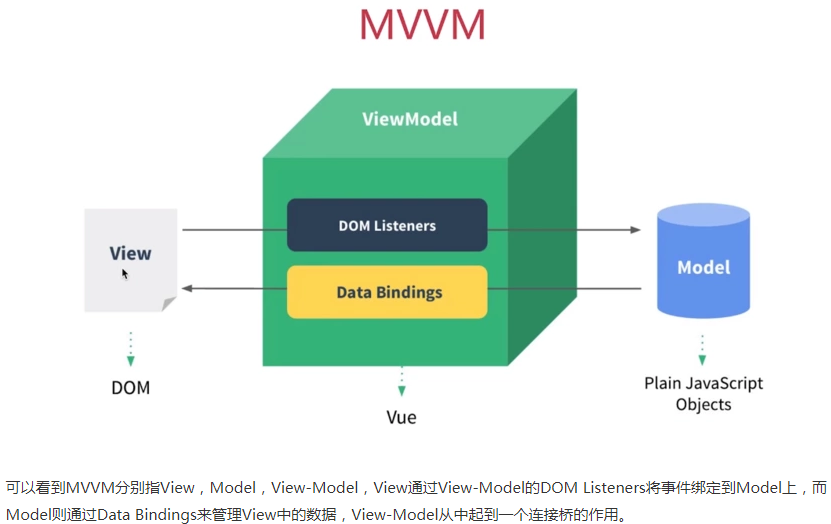
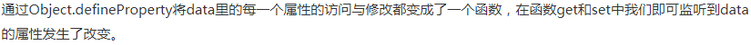

# 简述异步和同步的区别

同步：浏览器访问服务器请求，用户看得到页面刷新，重新发请求,等请求完，页面刷新，新内容出现，用户看到新内容,进行下一步操作

异步：浏览器访问服务器请求，用户正常操作，浏览器后端进行请求。等请求完，页面不刷新，新内容也会出现，用户看到新内容

# 简述JavaScript基本数据类型

undefined、null、string、boolean、number、symbol

# 简述div元素和span元素的区别

DIV(division)是一个块级元素，可以包含段 落、标题、表格，乃至诸如章节、摘要和备注等。SPAN 是行内元素，SPAN 的前后是不会换行的，它没有结构的意义，纯粹是应用样式，当其他行内元素都不合适时，可以使用SPAN。块元素相当于内嵌元素在前后各加一个 换行。其实，块元素和行内元素也不是一成不变的，只要给块元素定义display:inline，块元素就成了内嵌元素，同样地，给内嵌元素定义了display:block就成了块元素了。 

# 什么是css预处理器|后处理器

CSS预处理器定义了一种新的语言，其基本思想是，用一种专门的编程语言，为CSS增加了一些编程的特性，将CSS作为目标生成文件，然后开发者就只要使用这种语言进行编码工作。通俗的说，CSS预处理器用一种专门的编程语言，进行Web页面样式设计，然后再编译成正常的CSS文件。CSS 后处理器是对 CSS 进行处理，并最终生成 CSS 的预处理器，它属于广义上的 CSS 预处理器。

# Css优先级算法如何计算

通配符选择器:0  元素选择符:1  关系选择器:1  伪元素选择器:1  类选择符:10  属性选择器:10 伪类选择器:10  id选择器:100  内联样式：1000  !important声明的样式优先级最高

# This指向问题

  

# Display有哪些值及作用

block :块对象的默认值。用该值为对象之后添加新行

none :隐藏对象。与visibility属性的hidden值不同，其不为被隐藏的对象保留其物理空间

inline :内联对象的默认值。用该值将从对象中删除行

compact :分配对象为块对象或基于内容之上的内联对象

marker :指定内容在容器对象之前或之后。要使用此参数，对象必须和:after及:before 伪元素一起使用

inline-table :将表格显示为无前后换行的内联对象或内联容器

list-item :将块对象指定为列表项目。并可以添加可选项目标志

run-in :分配对象为块对象或基于内容之上的内联对象

table :将对象作为块元素级的表格显示

# position的值

static（默认）：按照正常文档流进行排列；

relative（相对定位）：不脱离文档流，参考自身静态位置通过 top, bottom, left, right 定位；

absolute(绝对定位)：参考距其最近一个不为static的父级元素通过top, bottom, left, right 定位；

fixed(固定定位)：所固定的参照对像是可视窗口。

# 介绍JavaScript有哪些内置对象

1.Object是JavaScript中所有对象的父对象

2.数据封装类对象：Object、Array、Boolean、Number和String

3.其他对象：Function、Arguments、Math、Date、RegExp、Error

# JavaScript作用域链

在JS引擎中，通过标识符查找标识符的值，会从当前作用域向上查找，直到作用域找到第一个匹配的标识符位置。就是JS的作用域链。

# 模块化的好处及实现方式

解决命名冲突；提供复用性；提高代码可维护性

立即执行函数；AMD和CMD；Commonjs；ES Module。

# 什么是window对象，什么是document对象

window它是一个顶层对象,而不是另一个对象的属性即浏览器的窗口。

document对象是window对象的一个对象属性

# Document.write和innerHTML的区别

document.write是直接写入到页面的内容流，如果在写之前没有调用document.open, 浏览器会自动调用open。每次写完关闭之后重新调用该函数，会导致页面被重写。

innerHTML则是DOM页面元素的一个属性，代表该元素的html内容。你可以精确到某一个具体的元素来进行更改。如果想修改document的内容，则需要修改document.documentElement.innerElement。

innerHTML将内容写入某个DOM节点，不会导致页面全部重绘;innerHTML很多情况下都优于document.write，其原因在于其允许更精确的控制要刷新页面的那一个部分。

# Map,filter,reduce各自有什么作用

Map是生成一个新数组，遍历原数组，将每个元素拿出来做一些变换然后放入到新的数组中。

Filter是生成一个新数组，在遍历数组的时候将返回值为 true 的元素放入新数组，我们可以利用这个函数删除一些不需要的元素。

Reduce将数组中的元素通过回调函数最终转换为一个值。

# 如何实现数组的随机排序

## 第一种、利用数组自带的sort方法

```js
let arr = [1, 2, 3, 4, 5, 6, 7, 8, 9];
function foo(arr) {
    let cloneArr = arr.concat();
    cloneArr.sort((n1, n2) => Math.random() - 0.5)
    return cloneArr;
}
console.log(foo(arr));
```

## 第二种、利用递归函数对比

```js
let arr = [1, 2, 3, 4, 5, 6, 7, 8, 9];

function foo(arr) {

 let result = [];

 let cloneArr = arr.concat();

 (function(){

     if (!cloneArr.length) { return }
    
     let index = Math.floor(Math.random() * cloneArr.length);
    
     result = result.concat(cloneArr.splice(index, 1));
    
     arguments.callee();

  })()

  return result;

}

console.log(foo(arr));
```

## 第三种、洗牌算法

```js
let arr = [1, 2, 3, 4, 5, 6, 7, 8, 9];

function foo(arr) {

    let cloneArr = arr.concat();
    
    let len = cloneArr.length;
    
    for (let i = 0; i < len; i++) {
    
        let index = Math.floor(Math.random() * cloneArr.length);
    
        let temp = cloneArr[index];
    
        cloneArr[index] = cloneArr[i];
    
        cloneArr[i] = temp;
    
    }
    
    return cloneArr;

}

console.log(foo(arr));
```

# 写出一个图片懒加载的实现步骤

先将img标签的src链接设为同一张图片（比如空白图片），然后给img标签设置自定义属性（比如 data-src）,然后将真正的图片地址存储在data-src中，当JS监听到该图片元素进入可视窗口时，将自定义属性中的地址存储到src属性中。达到懒加载的效果。

# Doctype作用，标准模式和兼容模式的区别

DOCTYPE是document type (文档类型) 的缩写。<!DOCTYPE >声明位于文档的最前面，处于标签之前，它不是html标签。主要作用是告诉浏览器的解析器使用哪种HTML规范或者XHTML规范来解析页面。

标准模式和兼容模式都是浏览器的呈现模式，浏览器究竟使用兼容模式还是标准模式呈现页面与网页中的DTD（文件类型定义）有关，DTD里面包含了文档的规则。

标准模式是指浏览器按照W3C标准来解析代码，呈现页面；兼容模式，是指浏览器按照自己的方式来解析代码，使用一种比较宽松的向后兼容的方式来显示页面。

# 介绍下您对浏览器内核的理解

使用Trident内核的浏览器：IE、Maxthon、TT、The World等；使用Gecko内核的浏览器：Netcape6及以上版本、FireFox、MozillaSuite/SeaMonkey；使用Presto内核的浏览器：Opera7及以上版本；使用Webkit内核的浏览器：Safari、Chrome。

# 简述一下对HTML语义化的理解

用正确的标签做正确的事情；html语义化就是让页面的内容结构化，便于对浏览器、搜索引擎解析；在没有样式CSS情况下也以一种文档格式显示，并且是容易阅读的；搜索引擎的爬虫依赖于标记来确定上下文和各个关键字的权重，利于SEO；使阅读源代码的人对网站更容易将网站分块，便于阅读维护理解。

# Iframe有哪些缺点

iframe会阻塞主页面的Onload事件；搜索引擎的检索程序无法解读这种页面，不利于SEO；iframe和主页面共享连接池，而浏览器对相同域的连接有限制，所以会影响页面的并行加载；使用iframe之前需要考虑这两个缺点。如果需要使用iframe，最好是通过javascript动态给iframe添加src属性值，这样可以绕开以上两个问题。

# 块级元素有哪些；行内元素有哪些

块级元素：div ul ol li dl dt dd h1 h2 h3 h4 p等

行内元素：a b span img input select strong

Display:none和visibility:hidden的区别

display：none 不显示对应的元素，在文档布局中不再分配空间（回流+重绘）

visibility：hidden 隐藏对应元素，在文档布局中仍保留原来的空间（重绘）

# 简单的介绍下弹性盒子模型的属性和属性值

flex-direction

row：横向从左到右排列（左对齐），默认的排列方式。

row-reverse：反转横向排列（右对齐，从后往前排，最后一项排在最前面。

column：纵向排列。

column-reverse：反转纵向排列，从后往前排，最后一项排在最上面。

flex-wrap

nowrap（默认）：不换行。

wrap：换行，第一行在上方。

wrap-reverse：换行，第一行在下方。

flex-flow

是flex-direction属性和flex-wrap属性的简写形式，默认值为row nowrap

justify-content

flex-start：从左到右排列

flex-end：从右到左排列

center：中间开始排列

space-between：平分

space-around：平分，且两边占1/2

align-items

flex-start：交叉轴的起点对齐。

flex-end：交叉轴的终点对齐。

center：交叉轴的中点对齐。

baseline: 项目的第一行文字的基线对齐。

stretch（默认值）：如果项目未设置高度或设为auto，将占满整个容器的高度。

align-content

flex-start：与交叉轴的起点对齐。

flex-end：与交叉轴的终点对齐。

center：与交叉轴的中点对齐。

space-between：与交叉轴两端对齐，轴线之间的间隔平均分布。

space-around：每根轴线两侧的间隔都相等。所以，轴线之间的间隔比轴线与边框的间隔大一倍。

stretch（默认值）：轴线占满整个交叉轴。

# 垂直上下居中的方法

## 第一种：知道元素的宽和高

```js
div.box{

    weight:200px;
    
    height:400px;
    
    position:absolute;
    
    left:50%;
    
    top:50%;
    
    margin-left:-100px;
    
    margin-top:-200px;

 }
```

## 第二种：不知道元素的宽和高

```js
div.box{

    weight:200px;
    
    height:400px;
    
    position:absolute;
    
    left:50%;
    
    top:50%;

transform:translate(-50%,-50%);

}
```

## 第三种：flex布局

```js
父级元素：{

   display:flex;

   flex-direction:row;

   justify-content:center;

   align-items:center;

}

子级元素：{

flex:1

}
```

# px、em、rem、%、vw、vh、vm这些单位的区别

Px  就是pixel的缩写，意为像素。px就是一张图片最小的一个点，一张位图就是千千万万的这样的点构成的，比如常常听到的电脑像素是1024x768的，表示的是水平方向是1024个像素点，垂直方向是768个像素点。

Em 参考物是父元素的font-size，具有继承的特点。如果自身定义了font-size按自身来计算（浏览器默认字体是16px），整个页面内1em不是一个固定的值。

Rem css3新单位，相对于根元素html（网页）的font-size，不会像em那样，依赖于父元素的字体大小，而造成混乱。

%  一般宽泛的讲是相对于父元素，但是并不是十分准确。

1、对于普通定位元素就是我们理解的父元素

2、对于position: absolute;的元素是相对于已定位的父元素

3、对于position: fixed;的元素是相对于 ViewPort（可视窗口）

Vw css3新单位，viewpoint width的缩写，视窗宽度，1vw等于视窗宽度的1%。

举个例子：浏览器宽度1200px, 1 vw = 1200px/100 = 12 px。

Vh css3新单位，viewpoint height的缩写，视窗高度，1vh等于视窗高度的1%。

举个例子：浏览器高度900px, 1 vh = 900px/100 = 9 px。

Vm css3新单位，相对于视口的宽度或高度中较小的那个。其中最小的那个被均分为100单位的vm

举个例子：浏览器高度900px，宽度1200px，取最小的浏览器高度， 1 vm = 900px/100 = 9 px。

# 简述JavaScript实现继承的几种方式

组合继承核心是在子类的构造函数中通过 Parent.call(this) 继承父类的属性，然后改变子类的原型为 new Parent() 来继承父类的函数

```js
function Parent(value) {
    this.val = value;
}
Parent.prototype.getValue = function () {
    console.log(this.val);
}
function Child(value) {
    Parent.call(this, value);
}

Child.prototype = new Parent();
const child = new Child(1);
child.getValue(); // 1
child instanceof Parent; // true
```

寄生组合继承核心就是将父类的原型赋值给了子类，并且将构造函数设置为子类，这样既解决了无用的父类属性问题，还能正确的找到子类的构造函数

```ja
function Parent(value) {
    this.val = value;
}
Parent.prototype.getValue = function () {
    console.log(this.val);
}
function Child(value) {
    Parent.call(this, value);
}
Child.prototype = Object.create(Parent.prototype, {
    constructor: {    
        value: Child,    
        enumerable: false,    
        writable: true,    
        configurable: true   
    }
})
const child = new Child(1);
child.getValue(); // 1
child instanceof Parent; // true
```

Class 继承核心在于使用 extends 表明继承自哪个父类，并且在子类构造函数中必须调用 super，因为这段代码可以看成 

```js
Parent.call(this, value)
class Parent {
    constructor(value) {
        this.val = value;
    }
    getValue() {
        console.log(this.val);
    }
}
class Child extends Parent {
    constructor(value) {  
        super(value);  
    }
}
let child = new Child(1);
child.getValue(); // 1
child instanceof Parent; // true
```

# 数组去重

第一种：Array.filter() + indexOf

```js
function distinct(a, b) {
    let arr = a.concat(b); 
    return arr.filter((item, index)=> { 
        return arr.indexOf(item) === index 
    })
}
```

第二种：双重 for 循环

```js
function distinct(a, b) {
   let arr = a.concat(b);   
    for (let i=0, len=arr.length; i<len; i++) { 
        for (let j=i+1; j<len; j++) {   
            if (arr[i] == arr[j]) {   
                arr.splice(j, 1);
               // splice 会改变数组长度，所以要将数组长度 len 和下标 j 减一
                len--;
                j--;
            }  
        }  
    }  
    return arr
}
```

第三种：for...of + includes()

```js
function distinct(a, b) {
    let arr = a.concat(b) 
    let result = [] 
    for (let i of arr) { 
        !result.includes(i) && result.push(i) 
    }
    return result
}
```

第四种：Array.sort()

```js
function distinct(a, b) {
    let arr = a.concat(b)  
    arr = arr.sort()   
    let result = [arr[0]]   
    for (let i=1, len=arr.length; i<len; i++) {   
        arr[i] !== arr[i-1] && result.push(arr[i])  
    }  
    return result
}
```

第五种：new Set()

```js
function distinct(a, b) {
    return Array.from(new Set([...a, ...b]))
}
```

第六种：for...of + Object

```js
function distinct(a, b) {
    let arr = a.concat(b)   
    let result = []   
    let obj = {}  
    for (let i of arr) {  
        if (!obj[i]) {
            result.push(i)
            obj[i] = 1
        }
    }
    return result
}
```

# 找出字符串中出现次数最多的字符，并统计次数

```js
let str = "asddfssssaasswef";
let obj = {};
for (let i = 0; i < str.length; i++) {
    if (!obj[str.charAt(i)]) {  
        obj[str.charAt(i)] = 1;  
    } else {
        obj[str.charAt(i)]++;   
    }
}
console.log(obj);
let max = 0;
let charmax;
for (let key in obj) {
    if (obj[key] > max) {    
        max = obj[key];    
        charmax = key;    
    }
}
console.log(`出现最多的字符是${charmax},出现了${max}次`);
```

# 请用JavaScript写一个方法：要求实现格式化输出，比如输入9999999，输出为9,999,999

```js
function splitNum(n) {
    let b = parseInt(n).toString();  
    let len = b.length; 
    if (len < 3) { return b } 
    let r = len % 3, 
    b1 = b.slice(0, r) + "," + b.slice(r, len).match(/\d{3}/g).join(","),  
    b2 = b.slice(r, len).match(/\d{3}/g).join(",")    
    return r > 0 ? b1 : b2;
}
console.log(splitNum(9999999));
```

# 说明cookie，session的概念与区别，另外说出你知道的浏览器缓存方式

cookie是客户端记录保存用户身份信息；session实在服务器记录用户的信息的

cookie是保存在客户端的，而session是保存在服务器的；

cookie不是很安全，别人可以分析存放在本地的COOKIE并进行COOKIE欺骗,如果主要考虑到安全应当使用session

session会在一定时间内保存在服务器上。当访问增多，会比较占用你服务器的性能，如果主要考虑到减轻服务器性能方面，应当使用COOKIE

单个cookie在客户端的限制是3K，就是说一个站点在客户端存放的COOKIE不能超过3K。

将登陆信息等重要信息存放为SESSION;其他信息如果需要保留，可以放在COOKIE中。

 

http缓存是基于HTTP协议的浏览器文件级缓存机制。即针对文件的重复请求情况下，浏览器可以根据协议头判断从服务器端请求文件还是从本地读取文件，chrome控制台下的Frames即展示的是浏览器的http文件级缓存。IndexedDB 是一个为了能够在客户端存储可观数量的结构化数据，并且在这些数据上使用索引进行高性能检索的 API。Cookie（或者Cookies），指一般网站为了辨别用户身份、进行session跟踪而储存在用户本地终端上的数据（通常经过加密）。localStorage是html5的一种新的本地缓存方案，目前用的比较多，一般用来存储ajax返回的数据，加快下次页面打开时的渲染速度。sessionStorage和localstorage类似，但是浏览器关闭则会全部删除，api和localstorage相同，实际项目中使用较少。application cahce是将大部分图片资源、js、css等静态资源放在manifest文件配置中。当页面打开时通过manifest文件来读取本地文件或是请求服务器文件。Flash缓存主要基于flash有读写浏览器端本地目录的功能，同时也可以向js提供调用的api，则页面可以通过js调用flash去读写特定的磁盘目录，达到本地数据缓存的目的

# Ajax实现机制，简述ajax跨域问题并提出解决方案

创建XMLHttpRequest对象。设置请求方式。调用回调函数。发送请求。

 

主流的前后端分离模式下，当前端调用后台接口时，由于是在非同一个域下的请求，从而会引发浏览器的自我安全保护机制，最终结果是接口成功请求并响应，但前端不能正常处理该返回数据。因此，当同时满足以下三个条件的情况下，就会出现跨域问题：浏览器限制；非同源请求（跨域）；发送的是 XHR ( XMLHttpRequest ) 请求

 

通过jsonp跨域；document.domain + iframe跨域；location.hash + iframe跨域；window.name + iframe跨域；postMessage跨域；跨域资源共享（CORS）；nginx代理跨域；nodejs中间件代理跨域；WebSocket协议跨域

# 静态链接与动态链接的区别，为什么需要动态链接

静态链接和动态链接两者最大的区别就在于链接的时机不一样，静态链接是在形成可执行程序前，而动态链接的进行则是在程序执行时

动态链接出现的原因就是为了解决静态链接中提到的两个问题，一方面是空间浪费，另外一方面是更新困难。

# 从浏览器地址栏输入url到网页彻底打开，中间发送了什么

客户端输入域名后，由DNS服务器来将域名解析成对应服务器的IP地址；获得服务器IP之后，就需要三次握手的协议才能建立连接；与服务器建立连接之后，就可以向服务器发送请求了，请求需要遵循http协议；被请求的服务器解析用户请求的有哪些资源，通过服务器返回数据给客户端；给客户端返回请求的状态码，通过状态码可以知道服务器端的处理是否正常；返回成功之后，浏览器拿到请求页面的代码，将其解析渲染出来。解析和渲染的过程主要由浏览器的渲染引擎实现；数据传输完毕，需要断开tcp连接，此时tcp发起4次挥手。

# JavaScript的prototype原型的作用是什么

prototype允许我们在创建对象之后来改变对象或类的行为，并且这些通过prototype属性添加的字段或方法所有对象实例是共享的。

# JavaScript中的闭包，及几种写法和用途

闭包是指有权访问另一个函数作用域中的变量的函数

第一种：给函数添加一些属性

function Circle(r) { 

      this.r = r; 

} 

Circle.PI = 3.14159; 

Circle.prototype.area = function() { 

  return Circle.PI * this.r * this.r; 

} 

let c = new Circle(1.0);

alert(c.area());

第二种：声明一个变量，将一个函数当作值赋给变量

let Circle = function() { 

   let obj = new Object(); 

   obj.PI = 3.14159; 

   obj.area = function( r ) { 

       return this.PI * r * r; 

   } 

   return obj; 

} 

let c = new Circle(); 

alert( c.area( 1.0 ) );

第三种：new 一个对象，然后给对象添加属性和方法

let Circle = new Object(); 

Circle.PI = 3.14159; 

Circle.Area = function( r ) { 

       return this.PI * r * r; 

}

alert( Circle.Area( 1.0 ) );

第四种：let obj = {}就是声明一个空的对象

let Circle={ 

   "PI":3.14159, 

 "area":function(r){ 

          return this.PI * r * r; 
    
        } 

}; 

alert( Circle.area(1.0) );

用途：可以读取函数内部的变量；让变量的值始终保持在内存中

# 列出几个为浏览器兼容而做的处理

1.不同浏览器的标签默认的外补丁( margin )和内补丁(padding)不同？解决方案： css 里增加通配符 * { margin: 0; padding: 0; }

2.IE6双边距问题；在 IE6中设置了float , 同时又设置margin , 就会出现边距问题？解决方案：设置display:inline;

3.当标签的高度设置小于10px，在IE6、IE7中会超出自己设置的高度？解决方案：超出高度的标签设置overflow:hidden,或者设置line-height的值小于你的设置高度

4.图片默认有间距？解决方案：使用float 为img 布局

5.边距重叠问题；当相邻两个元素都设置了margin 边距时，margin 将取最大值，舍弃最小值；？解决方案：为了不让边重叠，可以给子元素增加一个父级元素，并设置父级元素为overflow:hidden；

6.cursor:hand 显示手型在safari 上不支持？解决方案：统一使用 cursor:pointer

7.两个块级元素，父元素设置了overflow:auto；子元素设置了position:relative ;且高度大于父元素，在IE6、IE7会被隐藏而不是溢出？解决方案：父级元素设置position:relative

# 简述事件传播的各个阶段

1.捕获阶段：事件传播由目标节点的祖先节点逐级传播到目标节点。先由文档的根节点document（window）开始触发对象，最后传播到目标节点，从外向内捕获事件对象；

2.目标阶段：事件到达目标对象，事件触发，如果事件不允许冒泡，事件会在这一阶段停止传播。

3.冒泡阶段：从目标节点逐级传播到document节点。

# 如何阻止冒泡

```js
function stopBubble(e) {
    if ( e && e.stopPropagation ){
        e.stopPropagation();
    }else {
        window.event.cancelBubble = true;
    }	
}
```

# 数组的排序方式

第一种：arrayObject.sort(sortby)

```js
function sortNum(a, b) {
return a - b;
}
let arr = [524, 684, 5, 69, 15];
let res = arr.sort(sortNum);
console.log(res);
```

第二种：冒泡排序

```
function bubbleSort(arr) {

    for (let i = 0; i < arr.length; i++) {
    
        for (let j = 0; j < arr.length; j++) {
    
            if (arr[i] < arr[j]) {
    
                let temp = arr[j];
    
                arr[j] = arr[i];
    
                arr[i] = temp;
    
            }
    
        }
    
    }
    
    return arr;

}

let arr = [524, 684, 5, 69, 15];

console.log(bubbleSort(arr));
```

第三种：快速排序

function quickSort(arr) {

```js
if (arr.length <= 1) {
    return arr;
}
let pivotIndex = Math.floor(arr.length / 2),
pivot = arr.splice(pivotIndex, 1)[0],
lef = [],
rig = [];
for (var i = 0; i < arr.length; i++) {
    if (arr[i] < pivot) {
        lef.push(arr[i]);
    }else {
        rig.push(arr[i]);
    }
}
return quickSort(lef).concat(pivot, quickSort(rig));
}
let arr = [524, 684, 5, 69, 15];
console.log(quickSort(arr));
```

第四种：插入排序

```js
function insertSort(arr, a) {
    for (let i = 1; i < arr.length; i++) {  
        if (arr[i] >= a) {  
            for (let j = arr.length; j > i; j--) {  
                arr[j] = arr[j - 1];  
            }  
            arr[i] = a;  
            break;  
        }  
    }  
    return arr;
}

let arr = [5, 15, 69, 524, 684];
console.log(insertSort(arr, 92));
```

# position 属性值的含义

Static：元素框正常生成。块级元素生成一个矩形框，作为文档流的一部分，行内元素则会创建一个或多个行框，置于其父元素中。

Relative：元素框偏移某个距离。元素仍保持其未定位前的形状，它原本所占的空间仍保留。

Absolute：元素框从文档流完全删除，并相对于其包含块定位。包含块可能是文档中的另一个元素或者是初始包含块。元素原先在正常文档流中所占的空间会关闭，就好像元素原来不存在一样。元素定位后生成一个块级框，而不论原来它在正常流中生成何种类型的框。

Fixed：元素框的表现类似于将 position 设置为 absolute，不过其包含块是视窗本身。

# http请求中的8种请求方法

1、GET方法：发送一个请求来取得服务器上的某一资源

2、POST方法：向URL指定的资源提交数据或附加新的数据

3、PUT方法：跟POST方法很像，也是想服务器提交数据。但是，它们之间有不同。PUT指定了资源在服务器上的位置，而POST没有

4、HEAD方法：只请求页面的首部

5、DELETE方法：删除服务器上的某资源

6、OPTIONS方法：它用于获取当前URL所支持的方法。如果请求成功，会有一个Allow的头包含类似“GET,POST”这样的信息

7、TRACE方法：TRACE方法被用于激发一个远程的，应用层的请求消息回路

8、CONNECT方法：把请求连接转换到透明的TCP/IP通道

# GET和POST提交的区别

GET产生一个TCP数据包；POST产生两个TCP数据包(Firefox只发送一次)。GET在浏览器回退时是无害的，而POST会再次提交请求。GET产生的URL地址可以被Bookmark，而POST不可以。GET请求会被浏览器主动cache，而POST不会，除非手动设置。GET请求只能进行url编码，而POST支持多种编码方式。GET请求参数会被完整保留在浏览器历史记录里，而POST中的参数不会被保留。GET请求在URL中传送的参数是有长度限制的，而POST没有。对参数的数据类型，GET只接受ASCII字符，而POST没有限制。GET比POST更不安全，因为参数直接暴露在URL上，所以不能用来传递敏感信息。GET参数通过URL传递，POST放在Request body中。

# 为什么JavaScript里面0.1+0.2 === 0.3是false

JavaScript 中的 number 类型就是浮点型，JavaScript 中的浮点数采用IEEE-754 格式的规定，这是一种二进制表示法，可以精确地表示分数，比如 1/2，1/8，1/1024，每个浮点数占 64 位。但是，二进制浮点数表示法并不能精确的表示类似 0.1 这样的简单的数字，会有舍入误差。由于采用二进制，JavaScript 也不能有限表示 1/10、1/2 等这样的分数。在二进制中，1/10(0.1)被表示为 0.00110011001100110011…… 注意 0011 是无限重复的，这是舍入误差造成的，所以对于 0.1 + 0.2 这样的运算，操作数会先被转成二进制，然后再计算。

# 写一个function ，清除字符串前后的空格

第一种：重写trim方法

```js
let str=’   abc    ’;
if(!String.prototype.trim){
    String.prototype.trim = function(){  
        return this.replace(/^\s+/,"").replace(/\s+$/,"");
    }
};
console.log(str.trim());
```

第二种：写fntrim去掉左右空格

```js
let str=’   abc   ’;
function fntrim(str){
return str.replace(/^\s+/,"").replace(/\s+$/,"");
};
Console.log(fntrim(str));
```

# 多行文本超出隐藏

overflow:hidden; //超出文本隐藏

text-overflow:ellipsis; //溢出省略号显示

display:-webkit-box; //将对象作为弹性伸缩盒子

-webkit-box-orient:vertical; //设置伸缩盒子的子元素排列方式-从上到下垂直排列

-webkit-line-clamp:2; //这个属性不是css的规范属性，需要组合上面两个属性，数组代表显示的行数。

# 数组快速反转

```js
function reverse(arr){
   let num=parseInt(arr.length/2);
    for(var i=0;i<num;i++){   
        let temp = arr[i];   
       arr[i] = arr[arr.length-i-1];   
       arr[arr.length-i-1] = temp;   
    }   
      return arr；
}
var A=[1,10,5,13,26,50,2];
console.log(reverse(A));
```

# 用JavaScript实现随机选取10-100之间的10个数，存入一个数组并排序

```js
let iArray=[];
function getRandom(istart,iend){
    let iChoice=iend-istart+1,
        res=Math.floor(Math.random()*iChoice+istart);
    return res;
}
for(let i=0;i<10;i++){
    iArray.push(getRandom(10,100));
}
iArray.sort((a,b)=>a>b);
console.log(iArray);
```

# let,const,var有什么区别

let 和 const 定义的变量不会出现变量提升，而 var 定义的变量会提升；let 和 const 是JS中的块级作用域；let 和 const 不允许重复声明(会抛出错误)；let 和 const 定义的变量在定义语句之前，如果使用会抛出错误(形成了暂时性死区)，而 var 不会；const 声明一个只读的常量，一旦声明，常量的值就不能改变(如果声明是一个对象，那么不能改变的是对象的引用地址)。

# Webpack如何实现打包

WebPack是一个模块打包工具，你可以使用WebPack管理你的模块依赖，并编绎输出模块们所需的静态文件。它能够很好地管理、打包Web开发中所用到的HTML、Javascript、CSS以及各种静态文件（图片、字体等），让开发过程更加高效。对于不同类型的资源，webpack有对应的模块加载器。webpack模块打包器会分析模块间的依赖关系，最后生成了优化且合并后的静态资源。

# Promise详解

Promise有三种状态：pengding(),resolved(已完成),rejected(已失败)；Promise从Pending状态开始，如果成功就转到成功态，并执行resolve回调函数；如果失败就转到失败状态并执行reject回调函数。

优点：一旦状态改变，就不会再变，任何时候都可以得到这个结果；可以将异步操作以同步操作的流程表达出来，避免了层层嵌套的回调函数。

缺点：无法取消 Promise；当处于pending状态时，无法得知目前进展到哪一个阶段。

# JavaScript基本规范

不要在同一行声明多个变量；请使用 ===/!==来比较true/false或者数值；使用对象字面量替代new Array这种形 式；不要使用全局函数；Switch语句必须带有default分支；函数不应该有时候有返回值，有时候没有返回值；For循环必须使用大括号；If语句必须使用大括号；for-in循环中的变量 应该使用var关键字明确限定作用域，从而 避免作用域污染；命名规则中构造器函数首字母大写，如function Person(){}；写注释。

Promise 实现了链式调用，也就是说每次调用 then 之后返回的都是一个 Promise，并且是一个全新的 Promise，原因也是因为状态不可变。如果你在 then 中 使用了 return，那么 return 的值会被 Promise.resolve() 包装

# Async/await的用法及优缺点

async 函数返回一个 Promise 对象，当函数执行的时候，一旦遇到 await 就会先返回，等到触发的异步操作完成，再接着执行函数体内后面的语句。

async 和 await 相比直接使用 Promise 来说，优势在于处理 then 的调用链，能够更清晰准确的写出代码。缺点在于滥用 await 可能会导致性能问题，因为 await 会阻塞代码，也许之后的异步代码并不依赖于前者，但仍然需要等待前者完成，导致代码失去了并发性。

# 深浅拷贝的区别

浅拷贝只复制指向某个对象的指针，而不复制对象本身，新旧对象还是共享同一块内存。但深拷贝会另外创造一个一模一样的对象，新对象跟原对象不共享内存，修改新对象不会改到原对象。

```js
浅拷贝Object.assign()
let obj = { a: {a: "kobe", b: 39} };
var initalObj = Object.assign({}, obj);
initalObj.a.a = "wade";
console.log(obj.a.a);

浅拷贝Array.prototype.concat()
let arr = [1, 3, {
    username: 'kobe'    
    }];
let arr2=arr.concat();   
arr2[2].username = 'wade';
console.log(arr);

浅拷贝Array.prototype.slice()
let arr = [1, 3, {
    username: ' kobe'  
    }];
let arr3 = arr.slice();
arr3[2].username = 'wade'
console.log(arr);

深拷贝JSON.parse(JSON.stringify())
let arr = [1, 3, {
    username: ' kobe'
}];
let arr4 = JSON.parse(JSON.stringify(arr));
arr4[2].username = 'duncan';
console.log(arr, arr4);

深拷贝递归
function deepClone(initalObj, finalObj) {   
  let obj = finalObj || {};   
  for (var i in initalObj) {       
    let prop = initalObj[i];   
    if(prop === obj) {              
      continue;   
    }          
    if (typeof prop === 'object') {   
      obj[i] = (prop.constructor === Array) ? [] : {};               
      arguments.callee(prop, obj[i]);   
    } else {   
      obj[i] = prop;   
    }
  }  
  return obj;
}

深拷贝函数库lodash
let _ = require('lodash');
let obj1 = {
    a: 1,    
    b: { f: { g: 1 } },    
    c: [1, 2, 3]
};
let obj2 = _.cloneDeep(obj1);
console.log(obj1.b.f === obj2.b.f);

深拷贝jquery的$.extend
let $ = require('jquery');
let obj1 = {
    a: 1,    
    b: { f: { g: 1 } },    
    c: [1, 2, 3]
};
let obj2 = $.extend(true, {}, obj1);
obj1.b.f === obj2.b.f;
```

# JQuery中$.get()提交和$.post()提交区别

相同点：都是异步请求的方式来获取服务端的数据

不同点：请求方式不同：$.get() 方法使用GET方法来进行异步请求的。$.post() 方法使用POST方法来进行异步请求的；参数传递方式不同：get请求会将参数跟在URL后进行传递，而POST请求则是作为HTTP消息的实体内容发送给Web服务器的，这种传递是对用户不可见的；数据传输大小不同：get方式传输的数据大小不能超过2KB 而POST要大的多；安全问题： GET 方式请求的数据会被浏览器缓存起来，因此有安全问题。

# XMLHttpRequest：XMLHttpRequest.readyState;状态码的意思

状态0(请求未初始化):(XMLHttpRequest)对象已经创建或已被abort()方法重置，但还没有调用open()方法；

状态1(载入服务器连接已建立):已经调用open() 方法，但是send()方法未调用，尚未发送请求；

状态2(载入完成，请求已接收):send()方法已调用，HTTP请求已发送到web服务器，请求已经发送完成，未接收到响应；

状态3(交互，请求处理中):所有响应头部都已经接收到。响应体开始接收但未完成，即可以接收到部分响应数据；

状态4(请求完成，且相应已就绪):已经接收到了全部数据，并且连接已经关闭。

# Vue、React、Angular 介绍

MVC模式【Model(模型)+View(视图)+controller(控制器)】

View通过Controller来和Model联系，Controller是View和Model的协调者，View和Model不直接联系，基本联系都是单向的。用户User通过控制器Controller来操作模板Model从而达到视图View的变化

MVP模式【是从MVC模式演变而来的，都是通过Controller/Presenter负责逻辑的处理+Model提供数据+View负责显示】

在MVP中，Presenter完全把View和Model进行了分离，主要的程序逻辑在Presenter里实现。

并且，Presenter和View是没有直接关联的，是通过定义好的接口进行交互，从而使得在变更View的时候可以保持Presenter不变。

# MVVM模式【Model+View+ViewModel】






MVVM是把MVC里的Controller和MVP里的Presenter改成了ViewModel；View的变化会自动更新到ViewModel,ViewModel的变化也会自动同步到View上显示。这种自动同步是因为ViewModel中的属性实现了Observer，当属性变更时都能触发对应的操作。

Vue框架【MVVM】

优点：轻量级框架，语法简单，学习成本低；双向数据绑定；组件化开发；数据和结构的分离；虚拟DOM；运行速度快；灵活渐进式框架

缺点：不支持IE8；生态环境差，不如angular和react；不适合偏大型的项目

应用场景：小型应用

React框架【MVC】

优点：jsx语法创建虚拟DOM，极速的渲染性能；组件化开发，组件独立，方便重复使用；单向数据流；组件生命周期；跨浏览器兼容性好

缺点：不适合单独做一个完整的框架

应用场景：个性化需求、中型应用

Angular框架

优点：模板功能强大丰富，并且是声明式的，自带了丰富的Angular指令；是一个比较完善的前端框架，包含服务，模板，数据双向绑定，模块化，路由，过滤器，依赖注入等所有功能；自定义指令，自定义指令后可以在项目中多次使用。ng模块化比较大胆的引入了Java的一些东西（依赖注入）；双向绑定（脏检查机制）

缺点：验证功能错误信息显示比较薄弱，需要写很多模板标签；ng提倡在控制器里面不要有操作DOM的代码，对于一些jQuery 插件的使用，如果想不破坏代码的整洁性，需要写一些directive去封装插件；从1.0.X升级到1.2.X，貌似有比较大的调整，没有完美兼容低版本，升级之后可能会导致一个兼容性的BUG；AngularJS 太笨重了，没有让用户选择一个轻量级的版本，当然1.2.X后，Angular也在做一些更改，比如把route，animate等模块独立出去，让用户自己去选择。

应用场景：在大型超大型web应用开发上。

Vue与React的区别

相同点：react和vue都是用虚拟DOM Virtual DOM；中心思想相同：一切都是组件，组件实例之间可以嵌套；都有着合理的钩子函数；都不内置ajax、route等核心包，以插件的形式加载；都有配套的路由和负责处理全局状态管理的库；

不同点：React使用JSX渲染页面，Vue使用简单的模板；Vue双向数据流，React单向数据流；Vue.js在模板中提供了指令，过滤器等，可以非常方便，快捷地操作DOM；Vue比react运行更快

Vue与Angular的区别

相同点：都支持指令：内置指令和自定义指令；都支持过滤器：内置过滤器和自定义过滤器；都支持双向数据绑定；都不支持低端浏览器；vue和angular绑定都可以用{{}}

不同点：vue相当于angular要变得小巧很多，运行速度比angular快；vue指令用v-xxx，angular用ng-xxx；vue中数据放在data对象里面，angular数据绑定在$scope上面；vue有组件化概念，angular中没有；AngularJS的学习成本高，比如增加了Dependency Injection特性，而Vue.js本身提供的API都比较简单、直观；在性能上，AngularJS依赖对数据做脏检查，所以Watcher越多越慢，Vue.js使用基于依赖追踪的观察并且使用异步队列更新，所有的数据都是独立触发的

React与Angular的区别

相同点：都是单向数据流

不同点：React中没有指令，Angular提供了丰富的指令

React中，并不是父子关系的组件，如何实现相互的数据通信

使用父组件，通过props将变量传入子组件（如通过refs，父组件获取一个子组件的方法，简单包装后，将包装后的方法通过props传入另一个子组件）

# Vue生命周期理解

创建前/后： 在beforeCreated阶段，vue实例的挂载元素$el和数据对象data都为undefined，还未初始化。在created阶段，vue实例的数据对象data有了，$el还没有。

载入前/后：在beforeMount阶段，vue实例的$el和data都初始化了，但还是挂载之前为虚拟的dom节点，data.message还未替换。在mounted阶段，vue实例挂载完成，data.message成功渲染。

更新前/后：当data变化时，会触发beforeUpdate和updated方法。

另外还有 keep-alive 独有的生命周期，分别为 activated 和 deactivated 。用 keep-alive 包裹的组件在切换时不会进行销毁，而是缓存到内存中并执行 deactivated 钩子函数，命中缓存渲染后会执行 actived 钩子函数。

销毁前/后：在执行destroy方法后，对data的改变不会再触发周期函数，说明此时vue实例已经解除了事件监听以及和dom的绑定，但是dom结构依然存在。

# vue父子通信

通过props来传值：静态传值就是直接通过props来传递；动态传值是通过v-bind来绑定一个要传递值的key，然后后面跟要传递的内容，不过这个内容是可以改变的。

通过ref来传值：在父组件引用的子组件中采用ref=’要传递的值的key’

emit是子组件向父组件的传值方式：子组件可以使用 $emit 触发父组件的自定义事件

Slot：父组件向子组件传递模板采用slot，如果父组件没传递模板，slot里面有内容的话，就会显示内容，如果有多个模板要进行传递，这需要在slot中通过命名（name）来区分。

# v-if和v-show的区别

v-if 的话就得说到 Vue 底层的编译了。当属性初始为 false 时，组件就不会被渲染，直到条件为 true，并且切换条件时会触发销毁/挂载组件，所以总的来说在切换时开销更高，更适合不经常切换的场景。并且基于 v-if 的这种惰性渲染机制，可以在必要的时候才去渲染组件，减少整个页面的初始渲染开销。

v-show 只是在 display: none 和 display: block 之间切换。无论初始条件是什么都会被渲染出来，后面只需要切换 CSS，DOM 还是一直保留着的。所以总的来说 v-show 在初始渲染时有更高的开销，但是切换开销很小，更适合于频繁切换的场景。

# 兄弟组件通信

对于这种情况可以通过查找父组件中的子组件实现，也就是 this.$parent.$children，在 $children 中可以通过组件 name 查询到需要的组件实例，然后进行通信。

# computed 和 watch 区别

computed 是计算属性，依赖其他属性计算值，并且 computed 的值有缓存，只有当计算值变化才会返回内容；watch 监听到值的变化就会执行回调，在回调中可以进行一些逻辑操作。

# keep-alive 组件有什么作用

如果你需要在组件切换的时候，保存一些组件的状态防止多次渲染，就可以使用 keep-alive 组件包裹需要保存的组件。

对于 keep-alive 组件来说，它拥有两个独有的生命周期钩子函数，分别为 activated 和 deactivated 。用 keep-alive 包裹的组件在切换时不会进行销毁，而是缓存到内存中并执行 deactivated 钩子函数，命中缓存渲染后会执行 actived 钩子函数。

# 简述Vuex及五个核心概念

Vuex 是一个专为 Vue.js 应用程序开发的状态管理模式。它采用集中式存储管理应用的所有组件的状态，并以相应的规则保证状态以一种可预测的方式发生变化

State：一般在Vue组件中在计算属性computed中返回一个某个状态；getter：是 store 的计算属性, getter 的返回值会根据它的依赖被缓存起来，且只有当它的依赖值发生了改变才会被重新计算；mutation：包含多个直接更新state的方法（回调函数）的对象；action：包含多个时间回调函数的对象；module：Vuex 允许我们将 store 分割成模块（module）。每个模块拥有自己的 state、mutation、action、getter、甚至是嵌套子模块。

# XSS攻击

就是攻击者想尽一切办法将可以执行的代码注入到网页中。

持久型也就是攻击的代码被服务端写入进数据库中；非持久型相比于前者危害就小的多了，一般通过修改 URL 参数的方式加入攻击代码，诱导用户访问链接从而进行攻击。

转义输入输出的内容，对于引号、尖括号、斜杠进行转义；建立白名单，开发者明确告诉浏览器哪些外部资源可以加载和执行。

# CSRF攻击

攻击者构造出一个后端请求地址，诱导用户点击或者通过某些途径自动发起请求。如果用户是在登录状态下的话，后端就以为是用户在操作，从而进行相应的逻辑。

对 Cookie 设置 SameSite 属性，表示 Cookie 不随着跨域请求发送，可以很大程度减少 CSRF 的攻击，但是该属性目前并不是所有浏览器都兼容；验证 Referer 来判断该请求是否为第三方网站发起的；服务器下发一个随机 Token，每次发起请求时将 Token 携带上，服务器验证 Token 是否有效。

# 将一个单向链表反转

```js
var reverseList = function(head) {
    if (!head || !head.next) return head    
    let pre = null;    
    let current = head;    
    let next;    
    while(current) {    
        next = current.next;    
        current.next = pre;    
        pre = current;    
        current = next;    
    }    
    return pre;
};
```

# HTTP请求构成

HTTP 请求由三部分构成，分别为：请求行、首部、实体

请求行：基本由请求方法、URL、协议版本组成；首部：分为请求首部和响应首部

# 设计模式有哪几种

工厂模式、单列模式的核心就是保证全局只有一个对象可以访问、适配器模式用来解决两个接口不兼容的情况，不需要改变已有的接口，通过包装一层的方式实现两个接口的正常协作、装饰模式作用是给对象添加功能、代理模式是为了控制对对象的访问，不让外部直接访问到对象、发布-订阅模式通过一对一或者一对多的依赖关系，当对象发生改变时，订阅方都会收到通知、外观模式提供了一个接口，隐藏了内部的逻辑，更加方便外部调用

# 标准盒子模型与IE盒子模型的不同

标准盒子模型：宽度=内容的宽度（content）+ border + padding + margin

低版本IE盒子模型：宽度=内容宽度（content+border+padding）+ margin

# CSS3有哪些新特性

RGBA和透明度；  background-image background-origin(content-box/padding-box/border-box) background-size background-repeat；  word-wrap（对长的不可分割单词换行）word-wrap：break-word；  文字阴影：text-shadow： 5px 5px 5px #FF0000;（水平阴影，垂直阴影，模糊距离，阴影颜色）；  font-face属性：定义自己的字体；  圆角（边框半径）：border-radius 属性用于创建圆角；  边框图片：border-image: url(border.png) 30 30 round；  盒阴影：box-shadow: 10px 10px 5px #888888；  媒体查询：定义两套css，当浏览器的尺寸变化时会采用不同的属性

# 用纯CSS创建一个三角形的原理是什么

首先，需要把元素的宽度、高度设为0。然后设置边框样式。

width: 0;

height: 0;

border-top: 40px solid transparent;

border-left: 40px solid transparent;

border-right: 40px solid transparent;

border-bottom: 40px solid #ff0000;

# 为什么会出现浮动和什么时候需要清除浮动？清除浮动的方式

浮动元素碰到包含它的边框或者浮动元素的边框停留。由于浮动元素不在文档流中，所以文档流的块框表现得就像浮动框不存在一样。浮动元素会漂浮在文档流的块框上。

浮动带来的问题：父元素的高度无法被撑开，影响与父元素同级的元素；与浮动元素同级的非浮动元素（内联元素）会跟随其后；若非第一个元素浮动，则该元素之前的元素也需要浮动，否则会影响页面显示的结构。

清除浮动的方式：父级div定义height；最后一个浮动元素后加空div标签 并添加样式clear:both；包含浮动元素的父标签添加样式overflow为hidden或auto；父级div定义zoom；父级div定义 display:table

# 什么是响应式设计？响应式设计的基本原理是什么？如何兼容低版本的IE？

响应式网站设计(Responsive Web design)是一个网站能够兼容多个终端，而不是为每一个终端做一个特定的版本。

基本原理是通过媒体查询检测不同的设备屏幕尺寸做处理。

页面头部必须有meta声明的viewport。

<meta name=’viewport’ content=”width=device-width, initial-scale=1. maximum-scale=1,user-scalable=no”>
# 渐进增强和优雅降级

优雅降级观点认为应该针对那些最高级、最完善的浏览器来设计网站。

渐进增强观点则认为应关注于内容本身，优先考虑低版本。

# 请阐述块格式化上下文（Block Formatting Context）及其工作原理

块格式上下文（BFC）是 Web 页面的可视化 CSS 渲染的部分，是块级盒布局发生的区域，也是浮动元素与其他元素交互的区域。

一个 HTML 盒（Box）满足以下任意一条，会创建块格式化上下文：float的值不是none、  position的值不是static或relative、  display的值是table-cell、table-caption、inline-block、flex、或inline-flex、  overflow的值不是visible。

在 BFC 中，每个盒的左外边缘都与其包含的块的左边缘相接。
————————————————
版权声明：本文为CSDN博主「Yuanriver」的原创文章，遵循 CC 4.0 BY-NC-SA 版权协议，转载请附上原文出处链接及本声明。
原文链接：https://blog.csdn.net/Yuanriver/article/details/102796970