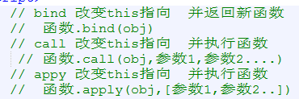
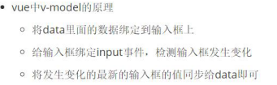
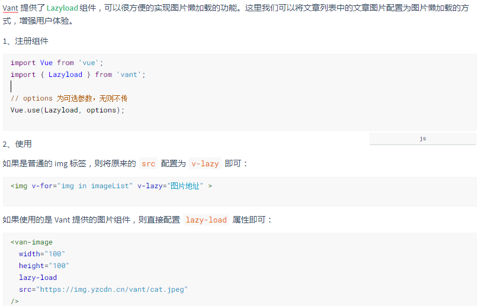
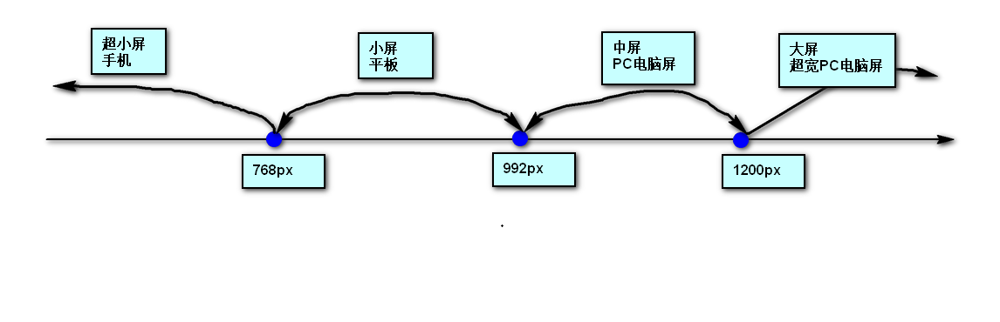
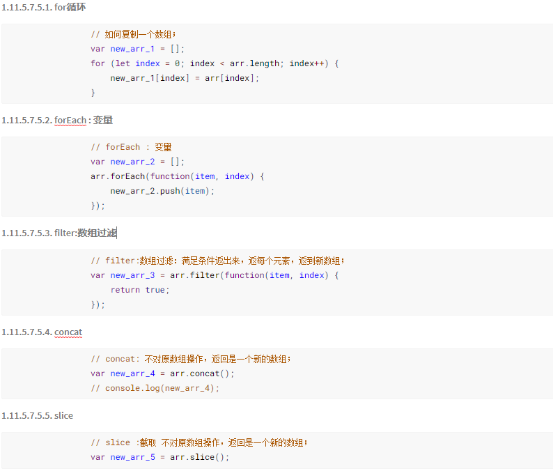

# vue、angular、react区别和优点

## vue框架（MVVM）

优点：

> - 轻量级框架，语法简单，学习成本低
> - 双向数据绑定
> - 组件化开发
> - 数据和结构的分离
> - 虚拟DOM
> - 运行速度快
> - 灵活渐进式框架

缺点：

> - 不支持IE8
> - 生态环境差，不如angular和react
> - 不适合偏大型的项目

应用场景：小型应用

参考：[https://blog.csdn.net/weixin_...](https://blog.csdn.net/weixin_43730646/article/details/84257878)

## react框架（MVC）

优点：

> - jsx语法创建虚拟DOM，极速的渲染性能
> - 组件化开发，组件独立，方便重复使用
> - 单向数据流
> - 组件生命周期
> - 跨浏览器兼容性好

缺点：

> - 不适合单独做一个完整的框架
>
> React是目标是UI组件，通常可以和其它框架组合使用，目前并不适合单独做一个完整的框架。React 即使配上 Flux 的组合，也不能称之一个完整的框架，比如你想用Promise化的AJAX？对不起没有，自己找现成的库去。而且第三方组件远远不如Angular多。

应用场景：个性化需求、中型应用

参考：[https://www.cnblogs.com/qiqi7...](https://www.cnblogs.com/qiqi715/p/10513195.html)

## angular框架

优点：

> - 模板功能强大丰富，并且是声明式的，自带了丰富的Angular指令；
> - 是一个比较完善的前端框架，包含服务，模板，数据双向绑定，模块化，路由，过滤器，依赖注入等所有功能；
> - 自定义指令，自定义指令后可以在项目中多次使用。
> - ng模块化比较大胆的引入了Java的一些东西（依赖注入）
> - 双向绑定（脏检查机制）

缺点：

> - 验证功能错误信息显示比较薄弱，需要写很多模板标签
> - ng提倡在控制器里面不要有操作DOM的代码，对于一些jQuery 插件的使用，如果想不破坏代码的整洁性，需要写一些directive去封装插件
> - 从1.0.X升级到1.2.X，貌似有比较大的调整，没有完美兼容低版本，升级之后可能会导致一个兼容性的BUG
> - AngularJS 太笨重了，没有让用户选择一个轻量级的版本，当然1.2.X后，Angular也在做一些更改，比如把route，animate等模块独立出去，让用户自己去选择。

应用场景：在大型超大型web应用开发上。

参考：[论AngularJS的优缺点](https://blog.csdn.net/qq_23334071/article/details/80504366)

## vue与react的区别

相同点：

> - react和vue都是用虚拟DOM Virtual DOM
> - 中心思想相同：一切都是组件，组件实例之间可以嵌套
> - 都有着合理的钩子函数
> - 都不内置ajax、route等核心包，以插件的形式加载
> - 都有配套的路由和负责处理全局状态管理的库；

不同点：

> - React使用JSX渲染页面，Vue使用简单的模板 
> - Vue双向数据流，React单向数据流
> - Vue.js在模板中提供了指令，过滤器等，可以非常方便，快捷地操作DOM。
> - Vue比react运行更快

## vue与angular的区别

相同点：

> - 都支持指令：内置指令和自定义指令。
> - 都支持过滤器：内置过滤器和自定义过滤器。
> - 都支持双向数据绑定。
> - 都不支持低端浏览器。
> - vue和angular绑定都可以用{{}}

不同点：

> - vue相当于angular要变得小巧很多，运行速度比angular快
> - vue指令用v-xxx，angular用ng-xxx
> - vue中数据放在data对象里面，angular数据绑定在$scope上面
> - vue有组件化概念，angular中没有
> - AngularJS的学习成本高，比如增加了Dependency Injection特性，而Vue.js本身提供的API都比较简单、直观
> - 在性能上，AngularJS依赖对数据做脏检查，所以Watcher越多越慢。 Vue.js使用基于依赖追踪的观察并且使用异步队列更新。所有的数据都是独立触发的

## react与angular的区别

相同点：

> - 都是单向数据流

不同点：

> - React中没有指令，angular则提供了丰富的指令

# Vue的生命周期及其钩子函数

```js
//组件实例刚被创建，组件属性计算之前，如data属性等
beforeCreate
//组件实例创建完成，属性已绑定，但DOM还未生成，$el属性还不存在
created
//模板编译 / 挂载之前
beforeMount
//模板编译 / 挂载之后
mounted
//组件更新之前
beforeUpdate
//组件更新之后
updated
//组件被激活时调用
activated
//组件被移除时调用
deactivated
//组件销毁前调用
beforeDestory
//组件销毁后调用
destoryed
```


# H5 新特性

1. 语义化标签：header、footer、section、nav、aside、article
2. 增强型表单：input 的多个 type
3. 新增表单元素：datalist、keygen、output
4. 新增表单属性：placehoder、required、min 和 max
5. 音频视频：audio、video
6. canvas
7. 地理定位
8. 拖拽
9. 本地存储：localStorage - 没有时间限制的数据存储；sessionStorage - 针对一个 session 的数据存储，当用户关闭浏览器窗口后，数据会被删除
10. 新事件：onresize、ondrag、onscroll、onmousewheel、onerror、onplay、onpause
11. WebSocket：单个 TCP 连接上进行全双工通讯的协议

# HTML 与 XHTML——二者有什么区别？

> - 所有的标记都必须要有一个相应的结束标记
> - 所有标签的元素和属性的名字都必须使用小写
> - 所有的 XML 标记都必须合理嵌套
> - 所有的属性必须用引号 "" 括起来
> - 给所有属性赋一个值
> - 图片必须有说明文字

# js是单线程还是多线程？

-  JavaScript语言的一大特点就是单线程，也就是说，同一个时间只能做一件事 
-  JavaScript的单线程，与它的用途有关。作为浏览器脚本语言，JavaScript的主要用途是与用户互动，以及操作DOM。这决定了它只能是单线程，否则会带来很复杂的同步问题。 

# 什么是闭包？会造成哪些问题？怎么解决？

 当内部函数被保存到外部时，会形成闭包；闭包会导致原始作用域链不释放，造成内存泄漏（占用）； 

闭包作用：延伸变量的作用范围。

 解决办法: 

​					一是使用ES6中let使for循环中的变量变成块儿作用域

​                二就是使用立即执行函数，通过函数作用域可以保存变量的特性来将每次循环的变量 保存到函数中 

# 移动端点击 300ms 延迟

有些移动端浏览器的点击事件有 300ms 延迟问题，为了保证都没事儿，我们建议把 fastclick 配置到你的项目中。

安装 FastClick：npm i fastclick

# localStorage（本地存储）和sessionStorage

- **cookie**
  不同的浏览器存放的cookie位置不一样，也是不能通用的。
  cookie的存储是以域名形式进行区分的，不同的域下存储的cookie是独立的。
  一个域名下存放的cookie的个数是有限制的，不同的浏览器存放的个数不一样,一般为20个。
  每个cookie存放的内容大小也是有限制的，不同的浏览器存放大小不一样，一般为4KB。
  cookie也可以设置过期的时间，默认是会话结束的时候，当时间到期自动销毁
  cookie值既可以设置，也可以读取
- **localStorage（本地存储）**
  生命周期：持久化的本地存储，除非主动删除数据，否则数据是永远不会过期的。
  存储的信息在同一域中是共享的。
  当本页操作（新增、修改、删除）了localStorage的时候，本页面不会触发storage事件,但是别的页面会触发storage事件。
  大小：据说是5M（跟浏览器厂商有关系）
  localStorage本质上是对字符串的读取，如果存储内容多的话会消耗内存空间，会导致页面变卡
  localStorage受同源策略的限制
- **sessionStorage**
  其实跟localStorage差不多，也是本地存储，会话本地存储
  特点：
  用于本地存储一个会话（session）中的数据，这些数据只有在同一个会话中的页面才能访问并且当会话结束后数据也随之销毁。因此sessionStorage不是一种持久化的本地存储，仅仅是会话级别的存储。也就是说只要这个浏览器窗口没有关闭，即使刷新页面或进入同源另一页面，数据仍然存在。关闭窗口后，sessionStorage即被销毁，或者在新窗口打开同源的另一个页面，sessionStorage也是没有的。
- **cookie、localStorage、sessionStorage区别**
  相同：在本地（浏览器端）存储数据。
  不同：
  localStorage、sessionStorage
  localStorage只要在相同的协议、相同的主机名、相同的端口下，就能读取/修改到同一份localStorage数据。
  sessionStorage比localStorage更严苛

# DOM和BOM顶级对象

# this指向问题

# ajax原理

# call和apply区别



# transform的属性

位移、旋转、缩放

# js事件流模型

“事件冒泡”：事件开始由最具体的元素接受，然后逐级向上传播
“事件捕捉”：事件由最不具体的节点先接收，然后逐级向下，一直到最具体的
“DOM 事件流”：三个阶段：事件捕捉，目标阶段，事件冒泡

# undefined和null的区别

1.含义不同

　　undefined：表示使用var声明变量但未对其加以初始化时，这个变量的值就是undefined

　　null：是一个空对象指针，表示准备用来保存对象，还没有真正保存对象的值，

　　如果定义的变量准备在将来用于保存对象，应该将该变量初始化为null。

2.类型不同

　　未初始化定义的值用typeof检测出来是"undefined"(字符串)，

　　而null值用typeof检测出来是"object"（字符串）

```
console.log(typeOf undefined);//undefined
console.log(typeOf null);//object
```

3.转化为值时不一样


 

# vue中 key 值的作用

 key值：用于 管理可复用的元素。尽可能高效地渲染虚拟DOM

# V-if和v-show的区别

# vue-router中route的信息对象

-  1.$route.path  字符串，等于当前路由对象的路径，会被解析为绝对路径，如 "/home/news" 。  
- 2.$route.params  对象，包含路由中的动态片段和全匹配片段的键值对。 
-  3.$route.query  对象，包含路由中查询参数的键值对。例如，对于 /home/news/detail/01?favorite=yes ，会得到$route.query.favorite == ‘yes‘ 。  
- 4.$route.router  路由规则所属的路由器（以及其所属的组件）。  
- 5.$route.matched  数组，包含当前匹配的路径中所包含的所有片段所对应的配置参数对象。  6.$route.name  当前路径的名字，如果没有使用具名路径，则名字为空。 

# vuex原理

 Vuex 是一个专为 Vue.js 应用程序开发的**状态管理模式**。它采用集中式存储管理应用的所有组件的状态，并以相应的规则保证状态以一种可预测的方式发生变化。 

- **state**，驱动应用的数据源；

- **view**，以声明方式将 **state** 映射到视图；

- **actions**，响应在 **view** 上的用户输入导致的状态变化。

  ```js
  const store = new Vuex.Store({
      state: {
          name: 'zml',
          age: 3
      },
      getters: {
          personInfo(state) {
              return `My name is ${state.name}, I am ${state.age}`;
          }
      },
      mutations: {
          SET_AGE(state, age) {
              commit(age, age);
          }
      },
      actions: {
          nameAsyn({commit}) {
              setTimeout(() => {
                  commit('SET_AGE', 18);
              }, 1000);
          }
      },
      modules: {
          a: modulesA
      }
  }
  ```

  vuex 包含有五个基本的对象：

  - state：存储状态。也就是变量；
  - getters：派生状态。也就是set、get中的get，有两个可选参数：state、getters分别可以获取state中的变量和其他的getters。外部调用方式：store.getters.personInfo()。就和vue的computed差不多；
  - mutations：提交状态修改。也就是set、get中的set，这是vuex中唯一修改state的方式，但不支持异步操作。第一个参数默认是state。外部调用方式：store.commit('SET_AGE', 18)。和vue中的methods类似。
  - actions：和mutations类似。不过actions支持异步操作。第一个参数默认是和store具有相同参数属性的对象。外部调用方式：store.dispatch('nameAsyn')。
  - modules：store的子模块，内容就相当于是store的一个实例。调用方式和前面介绍的相似，只是要加上当前子模块名，如：store.a.getters.xxx()。


  https://www.jianshu.com/p/d28d29052782来源：简书著作权归作者所有。商业转载请联系作者获得授权，非商业转载请注明出处。

# 虚拟DOM实现原理

1. 用JavaScript模拟DOM树，并渲染这个DOM树

2. 比较新老DOM树，得到比较的差异对象

3. 把差异对象应用到渲染的DOM树。

4.  

5. 虚拟DOM的缺点：

   1. 代码更多，体积更大

   2. 内存占用增大

   3. 小量的单一的dom修改使用虚拟dom成本反而更高，不如直接修改真实dom快

# promise原理和axios区别

- **promise是一种异步解决方案。在ES2015以前，javascript中实现异步的方式，主要通过回调函数，也即在一个函数中传入一个函数，实现异步操作。**
- **由于ajax异步方式请求数据时，我们不能知道数据具体回来的事件，所以过去只能将一个callback函数传递给ajax封装的方法，当ajax异步请求完成时，执行我们传递的callback函数。**
- **promise对象接受resolve和reject两个参数，当一个异步动作发生时，promise对象会通过resolve完成对动作成功进行解析，reject会捕获这个动作的异常。一个promise对象，通过new Promise().then()执行下一步骤操作。**

# v-model原理

 v-model本质上就是语法糖，即利用v-model绑定数据后，其实就是既绑定了数据，又添加了一个input事件监听 ，  input 事件在用户输入时触发，触发时获取元素的value 值 然后在赋值 



# JS 作用域与作用域链、原型链

 原型链：原型对象有个指针指向构造函数，实例对象又有一个指针指向原型对象，就形成了一条原型链，最终指向null。 

- 作用域

> 所谓作用域，就是变量或者是函数能作用的范围。

- 作用域链

> 变量随着作用长辈函数一级一级往上搜索，直到找到为止，找不到就报错，这个过程就是作用域链起的作用。

# 前后端联调

1、json-serve

2、nodejs

3、mock.js

# webpack打包流程

1、安装实时打包依赖包  yarn add -D webpack-dev-server

2、在webpack.config.js文件做如下配置

```js
module.exports = {
  // 给dev-server(实时打包运行机制)做配置
  devServer: {
    open: true,  // 启动实时打包服务后会自动开启浏览器并展示项目效果
    port: 12306, // web服务的端口号码,可以自定义为其他
    host: '127.0.0.1', //  web服务的主机名地址，必须是本机真实的
    compress: true  // web服务运行程序文件可以被优化压缩处理，使得比较节省资源，运行速度快
  },
}
```

3、在package.json中做如下配置

```js
  "scripts": {
    "serve": "webpack-dev-server"
  },
```

4、现在在项目根目录命令行终端中可以执行 npm  run serve 指令，就自动打开浏览器查看项目运行效果了

# vue图片懒加载



# vue全家桶

`vue-cli + vue2.0 + vuex + vue-router + axios + element-ui`

# 数组去重

1、 将两个数组拼接为一个数组，然后使用 ES6 中的 [Array.filter()](https://developer.mozilla.org/zh-CN/docs/Web/JavaScript/Reference/Global_Objects/Array/filter) 遍历数组，并结合 indexOf 来排除重复项 

```js
function distinct(a, b) {
    let arr = a.concat(b);
    return arr.filter((item, index)=> {
        return arr.indexOf(item) === index
    })
}
```

2、双重 for 循环

最容易理解的方法，外层循环遍历元素，内层循环检查是否重复

当有重复值的时候，可以使用 push()，也可以使用 splice()

```js
function distinct(a, b) {
    let arr = a.concat(b);
    for (let i=0, len=arr.length; i<len; i++) {
        for (let j=i+1; j<len; j++) {
            if (arr[i] == arr[j]) {
                arr.splice(j, 1);
                // splice 会改变数组长度，所以要将数组长度 len 和下标 j 减一
                len--;
                j--;
            }
        }
    }
    return arr
}
```

# vue中父子组件传值有几种方法？

1. props

2. event bus

3. $emit

4. vuex

5. storage

   ```js
   // 存储
   localStorage.setItem("lastname", "Smith");
   // 检索
   document.getElementById("result").innerHTML = localStorage.getItem("lastname");
   ```

6. provide/inject(优点是不用层层传递了)

# vue总结

Vue 本身是一个库，它主要提供数据驱动视图以及组件化的能力。

<script src="vue.js"></script>
为了开发单页面应用，我们需要使用 Vue Router。

为了集中的管理共享数据，我们需要使用 Vuex。

为了能具有更方便的开发体验：

- 代码改变自动刷新浏览器
- .vue 单文件组件
- JavaScript 模块化
- ....

我们需要配置使用 webpack 进行打包。

但是 webpack 配置起来非常繁琐，所以 Vue 官方提供了一个工具：VueCLI，它把以上功能都给你封装了一个工具中了。

VueCLi 脚手架。

为了能使用 .vue 单文件组件进行开发，我们需要 VueCLI 工具帮我们生成项目。

axios 的作用是：获取数据。

Vue 的作用是：把数据放到HTML页面上，响应视图变化。

# 档位划分

​	市场上默认的划分；三个节点、四个档位
​		xs : extra small    w<768  超小屏幕（手机，学习rem布局里面的档位划分都是在这个范围）

​		sm : small   768<= w <992  小屏设备  s（平板）

​		md: medium   992<= w <1200  中等屏幕 m（桌面显示器）

​		lg: large    1200<=w  大宽屏设备（大桌面显示器）
​		

# `CommonJS`

  CommonJS就是为JS的表现来制定规范，因为js没有模块的功能所以CommonJS应运而生，它希望js可以在任何地方运行，不只是[浏览器](http://www.2cto.com/os/liulanqi/)中。 

CommonJS定义的模块分为:{模块引用(require)} {模块定义(exports)} {模块标识(module)}

 require()用来引入外部模块；exports对象用于导出当前模块的方法或变量，唯一的导出口；module对象就代表模块本身。 

# 数组复制



# 两大编程思想

面向过程：POP(Process-oriented programming)

> ​	面向过程就是分析出解决问题所需要的步骤，然后用函数把这些步骤一步一步实现，使用的时候再一个一个的依次调用就可以了。

面向对象：OOP (Object Oriented Programming)

> ​	面向对象是把事务分解成为一个个对象，然后由对象之间分工与合作。
>
> ​	三大特性：封装线、继承性、多态性

# 浏览器兼容性

 **问题一：不同浏览器的标签默认的外补丁和内补丁不同** （ 各自的margin 和padding差异较大 ）

> ​	 几乎所有的CSS文件开头都会用通配符*来设置各个标签的内外补丁是0。 

 **问题二：图片默认有间距** 

> ​	 使用float属性为img布局 

 **问题三：超链接点击过后hover样式就不出现的问题？** 

> ​	 被点击访问过的超链接样式不再具有hover和active样式了,解决方法是改变CSS属性的排列顺序: L-V-H-A 

 **问题四：水平居中的问题** ( 设置 text-align: center ie6-7文本居中，嵌套的块元素也会居中ff /opera /safari /ie8文本会居中，嵌套块不会居中,)

> ​	1、margin-left:auto;margin-right:auto
>
> ​	2、margin:0 auto;

**问题五：透明度属性问题**

> ​	解决方案：针对IE浏览器：filter：alpha（opacity=value）；（取值范围1–100）
>
>    兼容其他浏览器：opacity：value；（取值范围0–1）

**问题六：上下margin的重叠问题**

> 描述：给上边元素设置了margin-bottom，给下边元素设置了margin-top，浏览器只会识别较大值；
>
> 解决方案：margin-top和margin-bottom中选择一个，只设置其中一个值；

**问题七：IE6两个层之间3px的问题**

> ​	问题：左边层采用浮动，右边没有采用浮动，这时在ie6中两层之间就会产生3像素的间距
>
> ​	解决：1、右边层也采用浮动 float 2、左边层添加属性 margin-right:-3px;

# promise\axios\async await

​			 Promse.all在处理多个异步处理时非常有用，比如说一个页面上需要等两个或多个ajax的数据回来以后才正常显示，在此之前只显示loading图标。 需要特别注意的是，Promise.all获得的成功结果的数组里面的数据顺序和Promise.all接收到的数组顺序是一致的，即p1的结果在前，即便p1的结果获取的比p2要晚。这带来了一个绝大的好处：在前端开发请求数据的过程中，偶尔会遇到发送多个请求并根据请求顺序获取和使用数据的场景，使用Promise.all毫无疑问可以解决这个问题。

 		Promse.race就是赛跑的意思，意思就是说，Promise.race([p1, p2, p3])里面哪个结果获得的快，就返回那个结果，不管结果本身是成功状态还是失败状态。 

# 冒泡排序

# vue后台管理开发所遇到的问题及解决办法

##  npm run build 打包项目，背景图片加载错误 404  

当用vue-cli自动构建项目后，有两种运行方法，分别是：

        npm run dev : 提供一个开发的环境，自动热更新，资源使用绝对路径，所以可以正常看到背景图片。
    
        npm run build : 打包项目，资源使用相对路径，所以会出现路径错误问题。
##  如果开发过程中，后端API文档还未提供，如何开发功能模块？ 

 可以先用localStorage和vuex结合起来代替模拟数据传递以及请求响应操作 

前后端联调

##  无法修改Elerment组件样式的问题 

 修改elementUI样式的时候，添加了scoped的组件无法修改的样式，去掉scoped就可以了 （ scoped再使用深度选择器有时候会失效 ）

比较常见的 引入第三方组件 , 我们需要修改样式时，就需要用到深度选择器

如 >>> , 有些像Less, Sass 之类的预处理器无法正确解析 >>>，这种情况下你可以使用 /deep/ 代替，效果是一样的

# vue兼容ie9问题

## ES6兼容

1、在 ie9 的环境上，es6 的部分新对象、表达式，并不支持，解决方案是使用 babel-polyfill 组件，它可以将 es6 的代码翻译成低版本浏览器可以识别的 es5 代码

npm i babel-polyfill --save-dev

2、安装完成后webpack.base.config.js下修改文件

require('babel-polyfill');

entry: {

'babel-polyfill': 'babel-polyfill',

app: './src/main.js'

},

## vue中 elementUI 的 ie9 兼容问题

1. 可能的原因1，element-ui 中使用了 display: flex; 样式，IE9不支持次样式，解决方法为，排查下各组件，避免使用带 display: flex; 的组件(`ie10以上没问题`)

​     2.**[flex.css](https://github.com/lzxb/flex.css)**直接引入文件，兼容flex弹性布局